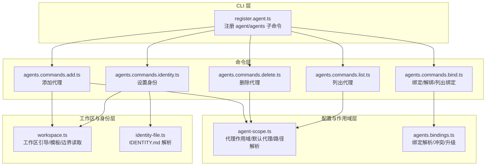
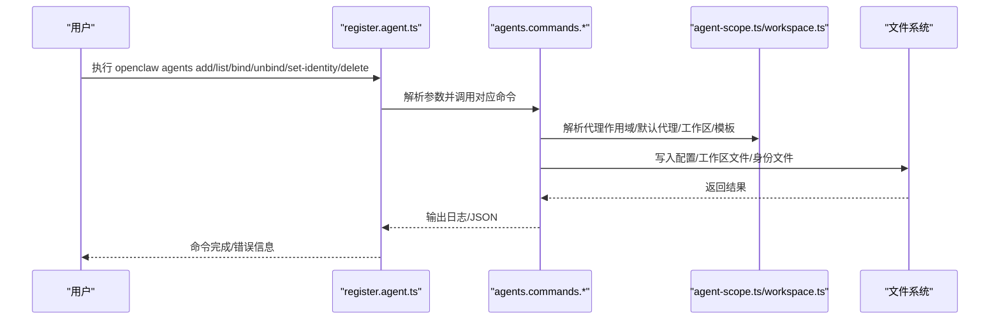
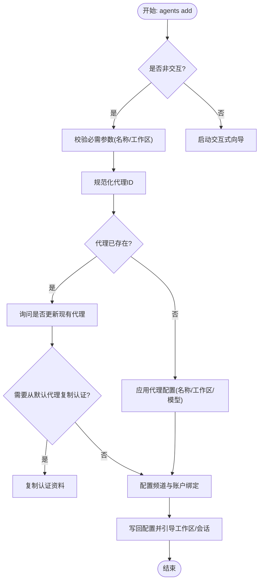
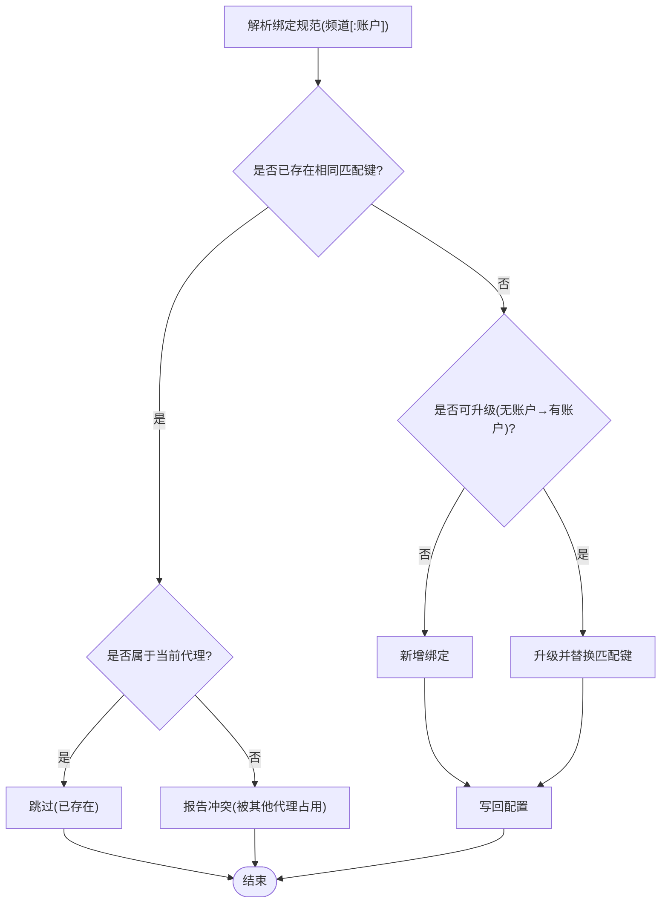
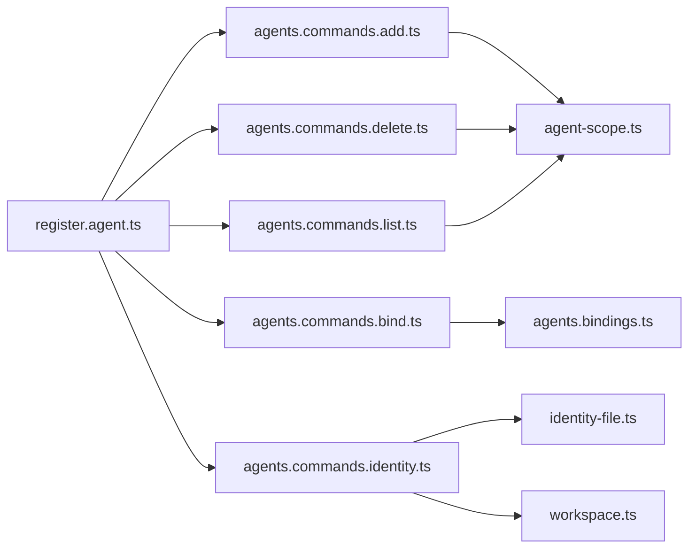

# 代理操作命令

<cite>
**本文引用的文件**
- [docs/cli/agent.md](file://docs/cli/agent.md)
- [docs/cli/agents.md](file://docs/cli/agents.md)
- [src/cli/program/register.agent.ts](file://src/cli/program/register.agent.ts)
- [src/commands/agents.ts](file://src/commands/agents.ts)
- [src/commands/agents.commands.add.ts](file://src/commands/agents.commands.add.ts)
- [src/commands/agents.commands.delete.ts](file://src/commands/agents.commands.delete.ts)
- [src/commands/agents.commands.bind.ts](file://src/commands/agents.commands.bind.ts)
- [src/commands/agents.bindings.ts](file://src/commands/agents.bindings.ts)
- [src/commands/agents.commands.identity.ts](file://src/commands/agents.commands.identity.ts)
- [src/commands/agents.commands.list.ts](file://src/commands/agents.commands.list.ts)
- [src/agents/agent-scope.ts](file://src/agents/agent-scope.ts)
- [src/agents/identity-file.ts](file://src/agents/identity-file.ts)
- [src/agents/workspace.ts](file://src/agents/workspace.ts)
</cite>

## 目录

1. [简介](#简介)
2. [项目结构](#项目结构)
3. [核心组件](#核心组件)
4. [架构总览](#架构总览)
5. [详细组件分析](#详细组件分析)
6. [依赖关系分析](#依赖关系分析)
7. [性能考虑](#性能考虑)
8. [故障排查指南](#故障排查指南)
9. [结论](#结论)
10. [附录](#附录)

## 简介

本参考文档系统性梳理“代理（Agent）”在命令行层面的操作能力，覆盖代理的创建、删除、路由绑定、解绑、身份设置与列表查看等完整生命周期管理，并深入解析代理身份文件、工作区与会话目录、模型回退策略、路由绑定规则与冲突处理、以及与频道（Channel）的集成方式。文档同时提供配置模板、批量操作思路、状态监控方法、性能调优建议与常见故障诊断技巧，帮助用户在多代理场景下实现稳定、可维护且高性能的自动化编排。

## 项目结构

围绕代理的 CLI 命令注册与执行，主要涉及以下层次：

- CLI 层：命令注册与参数解析，负责将用户输入转换为具体命令函数调用
- 命令层：各子命令的具体实现，包括添加、删除、绑定、解绑、身份设置、列表等
- 配置与作用域层：代理配置解析、默认值推导、工作区与状态目录解析
- 工作区与身份层：工作区引导、模板填充、身份文件解析与应用
- 绑定规则层：路由绑定解析、冲突检测、升级策略与写回配置

图表来源

- [src/cli/program/register.agent.ts:22-278](file://src/cli/program/register.agent.ts#L22-L278)
- [src/commands/agents.commands.add.ts:51-369](file://src/commands/agents.commands.add.ts#L51-L369)
- [src/commands/agents.commands.delete.ts:19-102](file://src/commands/agents.commands.delete.ts#L19-L102)
- [src/commands/agents.commands.bind.ts:154-387](file://src/commands/agents.commands.bind.ts#L154-L387)
- [src/commands/agents.bindings.ts:75-159](file://src/commands/agents.bindings.ts#L75-L159)
- [src/commands/agents.commands.identity.ts:68-234](file://src/commands/agents.commands.identity.ts#L68-L234)
- [src/commands/agents.commands.list.ts:75-136](file://src/commands/agents.commands.list.ts#L75-L136)
- [src/agents/agent-scope.ts:26-339](file://src/agents/agent-scope.ts#L26-L339)
- [src/agents/workspace.ts:321-459](file://src/agents/workspace.ts#L321-L459)
- [src/agents/identity-file.ts:38-108](file://src/agents/identity-file.ts#L38-L108)

章节来源

- [src/cli/program/register.agent.ts:22-278](file://src/cli/program/register.agent.ts#L22-L278)
- [src/commands/agents.ts:1-7](file://src/commands/agents.ts#L1-L7)

## 核心组件

- 代理命令注册器：集中注册 agent 与 agents 子命令，定义参数、帮助文本与动作函数
- 代理命令集合：导出所有代理相关命令模块，便于统一管理
- 添加代理命令：支持交互式向导与非交互模式，自动写入配置、引导工作区与会话目录
- 删除代理命令：安全删除代理及其工作区/状态/会话目录，支持强制模式
- 绑定命令族：列出绑定、添加绑定、移除绑定（支持全部清空），内置冲突检测与升级逻辑
- 身份设置命令：从 IDENTITY.md 或显式参数更新代理身份字段（名称、主题、表情、头像）
- 列表命令：输出代理概要、路由规则、提供商状态与绑定详情
- 代理作用域与路径解析：解析默认代理、工作区与状态目录、会话键到代理映射
- 工作区与模板：引导工作区、注入模板文件、边界安全读取与 Git 初始化
- 身份文件解析：解析 IDENTITY.md 中的身份字段，支持占位符过滤

章节来源

- [src/cli/program/register.agent.ts:22-278](file://src/cli/program/register.agent.ts#L22-L278)
- [src/commands/agents.ts:1-7](file://src/commands/agents.ts#L1-L7)
- [src/commands/agents.commands.add.ts:51-369](file://src/commands/agents.commands.add.ts#L51-L369)
- [src/commands/agents.commands.delete.ts:19-102](file://src/commands/agents.commands.delete.ts#L19-L102)
- [src/commands/agents.commands.bind.ts:154-387](file://src/commands/agents.commands.bind.ts#L154-L387)
- [src/commands/agents.bindings.ts:75-159](file://src/commands/agents.bindings.ts#L75-L159)
- [src/commands/agents.commands.identity.ts:68-234](file://src/commands/agents.commands.identity.ts#L68-L234)
- [src/commands/agents.commands.list.ts:75-136](file://src/commands/agents.commands.list.ts#L75-L136)
- [src/agents/agent-scope.ts:26-339](file://src/agents/agent-scope.ts#L26-L339)
- [src/agents/workspace.ts:321-459](file://src/agents/workspace.ts#L321-L459)
- [src/agents/identity-file.ts:38-108](file://src/agents/identity-file.ts#L38-L108)

## 架构总览

代理命令体系以“CLI 注册器 → 命令实现 → 配置/作用域/工作区/身份”的分层设计组织，确保职责清晰、扩展性强。命令在运行时通过默认运行时环境与依赖工厂创建运行上下文，最终落盘更新配置或文件系统。

图表来源

- [src/cli/program/register.agent.ts:75-83](file://src/cli/program/register.agent.ts#L75-L83)
- [src/commands/agents.commands.add.ts:107-138](file://src/commands/agents.commands.add.ts#L107-L138)
- [src/commands/agents.commands.bind.ts:232-238](file://src/commands/agents.commands.bind.ts#L232-L238)
- [src/commands/agents.commands.identity.ts:198-199](file://src/commands/agents.commands.identity.ts#L198-L199)
- [src/agents/agent-scope.ts:256-272](file://src/agents/agent-scope.ts#L256-L272)
- [src/agents/workspace.ts:333-459](file://src/agents/workspace.ts#L333-L459)

## 详细组件分析

### 命令注册与入口

- 注册 agent 与 agents 子命令，定义参数与帮助文本
- 支持 JSON 输出、超时控制、本地嵌入模式、思考层级、回复通道覆盖等
- agents 子命令包含 list/bindings/bind/unbind/add/set-identity/delete 等子命令

章节来源

- [src/cli/program/register.agent.ts:22-278](file://src/cli/program/register.agent.ts#L22-L278)
- [docs/cli/agent.md:1-29](file://docs/cli/agent.md#L1-L29)
- [docs/cli/agents.md:1-124](file://docs/cli/agents.md#L1-L124)

### 添加代理（agents add）

- 支持交互式向导与非交互模式；非交互需提供工作区路径
- 自动规范化代理 ID，避免保留字与重复
- 应用代理配置（名称、工作区、状态目录、模型），可选绑定频道
- 写回配置并引导工作区与会话目录，必要时复制认证资料
- 输出 JSON 或人类可读摘要，包含冲突绑定提示

图表来源

- [src/commands/agents.commands.add.ts:51-177](file://src/commands/agents.commands.add.ts#L51-L177)
- [src/commands/agents.commands.add.ts:179-369](file://src/commands/agents.commands.add.ts#L179-L369)

章节来源

- [src/commands/agents.commands.add.ts:51-369](file://src/commands/agents.commands.add.ts#L51-L369)

### 删除代理（agents delete）

- 规范化代理 ID，禁止删除默认代理
- 支持强制模式；否则需要 TTY 确认
- 安全删除工作区、状态目录与会话目录，写回配置并输出摘要

章节来源

- [src/commands/agents.commands.delete.ts:19-102](file://src/commands/agents.commands.delete.ts#L19-L102)

### 绑定与解绑（agents bindings/bind/unbind）

- 列出绑定：支持按代理过滤，JSON 输出
- 添加绑定：解析绑定规范（频道[:账户]），自动解析默认账户；支持升级已有无账户绑定
- 移除绑定：支持按代理全部清空或指定绑定；检测冲突与缺失
- 冲突与升级：若同一匹配键被其他代理占用则跳过；支持从无账户升级到有账户绑定

图表来源

- [src/commands/agents.bindings.ts:75-159](file://src/commands/agents.bindings.ts#L75-L159)
- [src/commands/agents.bindings.ts:288-327](file://src/commands/agents.bindings.ts#L288-L327)
- [src/commands/agents.commands.bind.ts:208-283](file://src/commands/agents.commands.bind.ts#L208-L283)
- [src/commands/agents.commands.bind.ts:285-387](file://src/commands/agents.commands.bind.ts#L285-L387)

章节来源

- [src/commands/agents.bindings.ts:75-159](file://src/commands/agents.bindings.ts#L75-L159)
- [src/commands/agents.bindings.ts:288-327](file://src/commands/agents.bindings.ts#L288-L327)
- [src/commands/agents.commands.bind.ts:154-387](file://src/commands/agents.commands.bind.ts#L154-L387)

### 设置身份（agents set-identity）

- 支持从 IDENTITY.md 文件或显式参数设置身份字段（名称、主题、表情、头像）
- 若未指定代理，可通过工作区定位代理；支持从工作区根读取默认 IDENTITY.md
- 合并现有身份配置并写回配置文件，输出 JSON 或人类可读摘要

章节来源

- [src/commands/agents.commands.identity.ts:68-234](file://src/commands/agents.commands.identity.ts#L68-L234)
- [src/agents/identity-file.ts:38-108](file://src/agents/identity-file.ts#L38-L108)
- [src/agents/workspace.ts:104-108](file://src/agents/workspace.ts#L104-L108)

### 列出代理（agents list）

- 生成代理概要：ID、名称、工作区、状态目录、模型、路由规则数
- 可选输出绑定详情与提供商状态
- 提供 JSON 输出与渠道健康检查链接

章节来源

- [src/commands/agents.commands.list.ts:75-136](file://src/commands/agents.commands.list.ts#L75-L136)

### 代理作用域与路径解析

- 默认代理解析：当多个代理标记为默认时，采用首个条目并告警
- 会话键解析：支持从会话键中提取代理 ID，优先级高于默认代理
- 工作区与状态目录：支持自定义路径、默认路径与基于状态目录的派生路径
- 模型回退策略：支持显式模型主模型与回退列表，支持会话覆盖

章节来源

- [src/agents/agent-scope.ts:72-111](file://src/agents/agent-scope.ts#L72-L111)
- [src/agents/agent-scope.ts:256-339](file://src/agents/agent-scope.ts#L256-L339)
- [src/agents/agent-scope.ts:178-254](file://src/agents/agent-scope.ts#L178-L254)

### 工作区与模板

- 引导工作区：创建目录、注入模板文件（如 AGENTS.md、SOUL.md、TOOLS.md、IDENTITY.md、USER.md、HEARTBEAT.md、BOOTSTRAP.md）
- 边界安全读取：对工作区内文件进行边界保护与缓存，防止越界与缓存污染
- Git 初始化：在全新工作区尝试初始化 Git 仓库
- 会话引导：根据配置引导会话目录

章节来源

- [src/agents/workspace.ts:321-459](file://src/agents/workspace.ts#L321-L459)
- [src/agents/workspace.ts:498-555](file://src/agents/workspace.ts#L498-L555)
- [src/agents/workspace.ts:575-655](file://src/agents/workspace.ts#L575-L655)

## 依赖关系分析

- CLI 注册器依赖各命令模块；命令模块依赖配置解析与作用域模块
- 绑定命令依赖绑定解析模块；身份命令依赖身份文件解析与工作区模块
- 工作区模块提供模板与边界读取能力，被添加代理与身份设置命令复用

图表来源

- [src/cli/program/register.agent.ts:22-278](file://src/cli/program/register.agent.ts#L22-L278)
- [src/commands/agents.commands.add.ts:51-369](file://src/commands/agents.commands.add.ts#L51-L369)
- [src/commands/agents.commands.delete.ts:19-102](file://src/commands/agents.commands.delete.ts#L19-L102)
- [src/commands/agents.commands.bind.ts:154-387](file://src/commands/agents.commands.bind.ts#L154-L387)
- [src/commands/agents.bindings.ts:75-159](file://src/commands/agents.bindings.ts#L75-L159)
- [src/commands/agents.commands.identity.ts:68-234](file://src/commands/agents.commands.identity.ts#L68-L234)
- [src/commands/agents.commands.list.ts:75-136](file://src/commands/agents.commands.list.ts#L75-L136)
- [src/agents/agent-scope.ts:26-339](file://src/agents/agent-scope.ts#L26-L339)
- [src/agents/identity-file.ts:38-108](file://src/agents/identity-file.ts#L38-L108)
- [src/agents/workspace.ts:321-459](file://src/agents/workspace.ts#L321-L459)

章节来源

- [src/cli/program/register.agent.ts:22-278](file://src/cli/program/register.agent.ts#L22-L278)
- [src/commands/agents.ts:1-7](file://src/commands/agents.ts#L1-L7)

## 性能考虑

- 绑定解析与冲突检测：在大量绑定场景下，注意避免重复解析与多次写盘；可在批处理时合并变更后一次性写回
- 工作区引导与模板注入：批量创建代理时，建议预热模板缓存与并发控制，减少 IO 抖动
- 身份文件解析：对大体量 IDENTITY.md 的解析应避免重复读取，结合工作区缓存机制
- 会话与内存：合理设置模型回退策略与会话修剪策略，避免不必要的历史数据加载
- 并发与超时：CLI 命令支持超时控制，建议在自动化脚本中为长耗时操作设置合理超时

## 故障排查指南

- 代理 ID 冲突或保留字
  - 现象：添加代理时报错“代理已存在”或“保留字”
  - 处理：更换代理名称，避免使用保留 ID；检查规范化后的 ID 是否与现有冲突
- 绑定冲突
  - 现象：添加绑定时提示“已被其他代理占用”
  - 处理：先查询绑定列表，确认归属后再迁移或调整；必要时先解绑再绑定
- 账户解析失败
  - 现象：绑定时无法解析账户 ID
  - 处理：检查频道插件默认账户解析逻辑；必要时显式指定账户 ID
- 工作区安全读取失败
  - 现象：工作区文件读取报错或被拒绝
  - 处理：确认文件路径在工作区边界内；检查权限与符号链接；清理缓存后重试
- 删除失败或未删除
  - 现象：删除代理后残留目录
  - 处理：确认非交互模式下使用了 --force；检查 TTY 环境；手动清理残留目录

章节来源

- [src/commands/agents.commands.add.ts:87-100](file://src/commands/agents.commands.add.ts#L87-L100)
- [src/commands/agents.commands.bind.ts:276-282](file://src/commands/agents.commands.bind.ts#L276-L282)
- [src/commands/agents.bindings.ts:229-262](file://src/commands/agents.bindings.ts#L229-L262)
- [src/agents/workspace.ts:48-88](file://src/agents/workspace.ts#L48-L88)
- [src/commands/agents.commands.delete.ts:51-66](file://src/commands/agents.commands.delete.ts#L51-L66)

## 结论

本参考文档系统化梳理了代理的创建、删除、绑定、身份设置与列表展示等核心命令，明确了代理作用域、工作区与身份文件的协作机制，并提供了绑定冲突处理、批量操作与性能优化建议。通过遵循本文档的流程与最佳实践，用户可以在多代理环境中实现高可靠、可扩展的自动化编排与运维。

## 附录

### 代理配置模板与示例

- 配置样例：agents.list[].identity 字段（名称、主题、表情、头像）
- 工作区模板：首次引导时注入 AGENTS.md、SOUL.md、TOOLS.md、IDENTITY.md、USER.md、HEARTBEAT.md、BOOTSTRAP.md
- IDENTITY.md：支持从工作区根读取，解析名称、表情、主题、头像等字段

章节来源

- [docs/cli/agents.md:105-124](file://docs/cli/agents.md#L105-L124)
- [src/agents/workspace.ts:372-384](file://src/agents/workspace.ts#L372-L384)
- [src/agents/identity-file.ts:38-78](file://src/agents/identity-file.ts#L38-L78)

### 批量操作脚本思路

- 批量添加代理：准备代理清单与工作区目录，使用非交互模式逐个调用 agents add，合并绑定后再一次性写回
- 批量绑定：先解析绑定规范，去重后一次性 applyAgentBindings，最后写回配置
- 批量删除：配合 --force 与 JSON 输出，记录删除摘要并清理残留

章节来源

- [src/commands/agents.commands.add.ts:64-69](file://src/commands/agents.commands.add.ts#L64-L69)
- [src/commands/agents.bindings.ts:75-159](file://src/commands/agents.bindings.ts#L75-L159)
- [src/commands/agents.commands.delete.ts:51-66](file://src/commands/agents.commands.delete.ts#L51-L66)

### 代理状态监控方法

- 列表输出：agents list 支持 JSON 输出，便于集成外部监控系统
- 渠道健康：通过 channels status --probe 获取实时健康状态
- 绑定详情：agents bindings --bindings 查看完整路由规则

章节来源

- [src/commands/agents.commands.list.ts:124-134](file://src/commands/agents.commands.list.ts#L124-L134)
- [docs/cli/agents.md:30-40](file://docs/cli/agents.md#L30-L40)

### 代理与频道、技能、工具的集成

- 频道绑定：通过 agents bind/unbind 将频道与账户映射到特定代理，实现路由隔离
- 技能与工具：代理配置支持技能过滤与工具启用，结合工作区模板与会话引导
- 会话绑定：通过会话键解析确定代理，支持本地嵌入模式与网关模式切换

章节来源

- [src/commands/agents.bindings.ts:264-286](file://src/commands/agents.bindings.ts#L264-L286)
- [src/agents/agent-scope.ts:86-111](file://src/agents/agent-scope.ts#L86-L111)
- [docs/cli/agent.md:10-11](file://docs/cli/agent.md#L10-L11)
