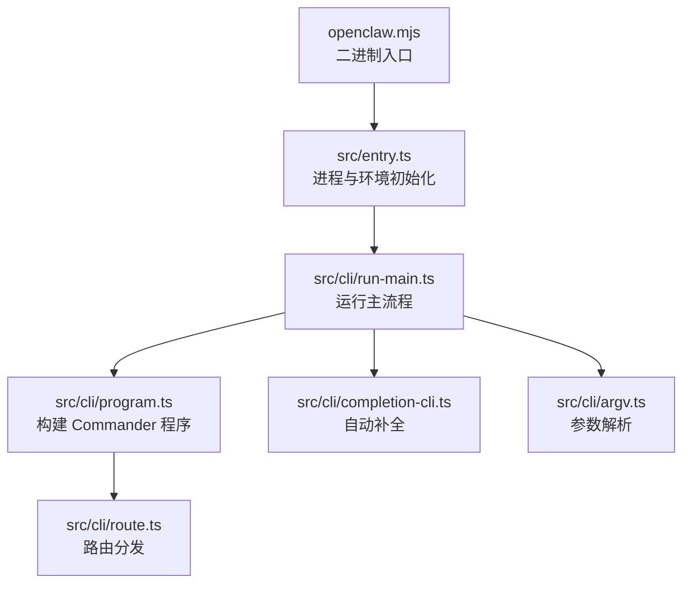
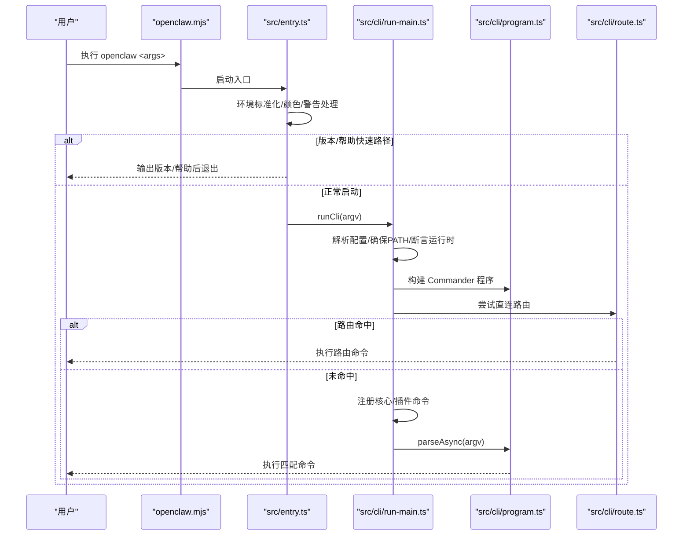
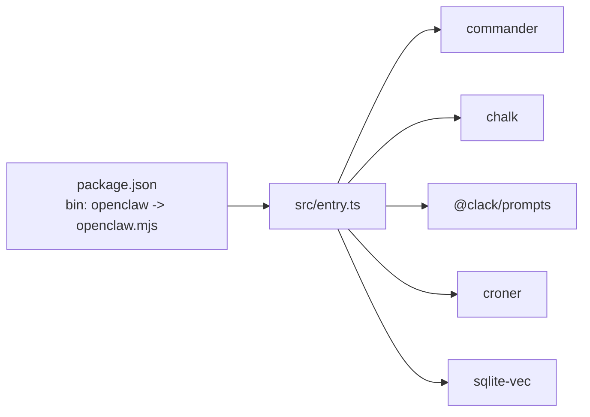

# 命令行工具

<cite>
**本文引用的文件**
- [入口点（entry.ts）](file://src/entry.ts)
- [运行主流程（run-main.ts）](file://src/cli/run-main.ts)
- [程序构建与路由（program.ts）](file://src/cli/program.ts)
- [参数解析（argv.ts）](file://src/cli/argv.ts)
- [路由分发（route.ts）](file://src/cli/route.ts)
- [配置文件（package.json）](file://package.json)
- [自动补全（completion-cli.ts）](file://src/cli/completion-cli.ts)
- [CLI 参考总览（docs/cli/index.md）](file://docs/cli/index.md)
- [自动补全参考（docs/cli/completion.md）](file://docs/cli/completion.md)
</cite>

## 目录

1. [简介](#简介)
2. [项目结构](#项目结构)
3. [核心组件](#核心组件)
4. [架构总览](#架构总览)
5. [详细组件分析](#详细组件分析)
6. [依赖分析](#依赖分析)
7. [性能考虑](#性能考虑)
8. [故障排查指南](#故障排查指南)
9. [结论](#结论)
10. [附录](#附录)

## 简介

本文件为 OpenClaw 命令行工具的完整参考文档，覆盖命令、参数、子命令、帮助系统、自动补全、全局选项、输出样式、跨平台行为、性能优化与调试方法等。读者可据此快速掌握 openclaw CLI 的使用方式，并将其集成到自动化脚本与 CI/CD 流水线中。

## 项目结构

OpenClaw 的 CLI 以 Node.js 模块化组织，入口通过 openclaw.mjs 暴露为二进制命令名 openclaw；核心启动逻辑位于 src/entry.ts，随后进入 run-main.ts 的运行时初始化与路由分发，最终由 program.ts 构建 Commander 程序树并注册内置命令与插件命令。

图表来源

- [入口点（entry.ts）:1-195](file://src/entry.ts#L1-L195)
- [运行主流程（run-main.ts）:74-151](file://src/cli/run-main.ts#L74-L151)
- [程序构建与路由（program.ts）:1-3](file://src/cli/program.ts#L1-L3)
- [参数解析（argv.ts）:1-329](file://src/cli/argv.ts#L1-L329)
- [路由分发（route.ts）:29-47](file://src/cli/route.ts#L29-L47)
- [自动补全（completion-cli.ts）:231-301](file://src/cli/completion-cli.ts#L231-L301)

章节来源

- [入口点（entry.ts）:1-195](file://src/entry.ts#L1-L195)
- [运行主流程（run-main.ts）:74-151](file://src/cli/run-main.ts#L74-L151)
- [程序构建与路由（program.ts）:1-3](file://src/cli/program.ts#L1-L3)
- [参数解析（argv.ts）:1-329](file://src/cli/argv.ts#L1-L329)
- [路由分发（route.ts）:29-47](file://src/cli/route.ts#L29-L47)
- [自动补全（completion-cli.ts）:231-301](file://src/cli/completion-cli.ts#L231-L301)

## 核心组件

- 入口与环境初始化：设置进程标题、注入执行标记、安装警告过滤、规范化环境变量、启用编译缓存、处理颜色禁用、实验性警告抑制与重生（respawn）策略、版本/帮助快速路径。
- 运行主流程：解析 CLI 配置文件、确保 PATH 中存在 openclaw、断言运行时支持、注册核心与插件命令、捕获控制台输出、解析参数并执行。
- 参数解析：识别帮助/版本、解析全局选项、提取命令路径、解析布尔/数值/键值型选项、判断是否需要迁移状态。
- 路由分发：在非帮助/版本场景下尝试“直连路由”，准备配置与插件注册后执行对应命令。
- 自动补全：按 zsh/bash/fish/PowerShell 生成/安装补全脚本，支持写入状态目录与 profile 注入。

章节来源

- [入口点（entry.ts）:31-194](file://src/entry.ts#L31-L194)
- [运行主流程（run-main.ts）:74-151](file://src/cli/run-main.ts#L74-L151)
- [参数解析（argv.ts）:12-329](file://src/cli/argv.ts#L12-L329)
- [路由分发（route.ts）:29-47](file://src/cli/route.ts#L29-L47)
- [自动补全（completion-cli.ts）:231-301](file://src/cli/completion-cli.ts#L231-L301)

## 架构总览

下面的序列图展示了从用户输入到命令执行的关键调用链，包括帮助/版本快速路径、配置准备、插件加载与最终解析执行。

图表来源

- [入口点（entry.ts）:128-194](file://src/entry.ts#L128-L194)
- [运行主流程（run-main.ts）:74-151](file://src/cli/run-main.ts#L74-L151)
- [程序构建与路由（program.ts）:1-3](file://src/cli/program.ts#L1-L3)
- [路由分发（route.ts）:29-47](file://src/cli/route.ts#L29-L47)

## 详细组件分析

### 命令与子命令参考

- 命令总览与子命令树：详见 CLI 参考总览文档中的“Command tree”部分，涵盖 setup、onboard、configure、config、completion、doctor、dashboard、backup、reset、uninstall、update、message、agent、agents、acp、status、health、sessions、gateway、logs、system、models、memory、directory、nodes、devices、node、approvals、sandbox、tui、browser、cron、dns、docs、hooks、webhooks、pairing、qr、plugins、channels、security、secrets、skills、daemon、clawbot、voicecall 等。
- 全局选项：--dev、--profile <name>、--no-color、--update、-V/--version/-v。
- 输出样式：TTY 渲染 ANSI 与进度条，支持 --json 与 --plain；NO_COLOR/FORCE_COLOR 控制颜色输出；长任务显示进度指示。
- 安全审计：security audit 支持深度探测与修复建议。
- 插件扩展：插件可新增顶级命令（如 voicecall），通常需重启网关生效。

章节来源

- [CLI 参考总览（docs/cli/index.md）:13-267](file://docs/cli/index.md#L13-L267)
- [CLI 参考总览（docs/cli/index.md）:62-91](file://docs/cli/index.md#L62-L91)
- [CLI 参考总览（docs/cli/index.md）:268-291](file://docs/cli/index.md#L268-L291)

### 参数解析与帮助系统

- 帮助/版本检测：支持 -h/--help、-V/--version、-v 别名；对根级帮助/版本进行快速路径处理，避免完整初始化。
- 命令路径解析：从 argv 提取主/次级命令，支持跳过根选项与终止符 --。
- 选项解析：支持布尔、=号键值、位置值，以及正整数校验；提供 --verbose/--debug 辅助开关。
- 状态迁移策略：根据命令路径决定是否迁移状态目录，避免对只读查询类命令进行状态变更。

章节来源

- [参数解析（argv.ts）:8-106](file://src/cli/argv.ts#L8-L106)
- [参数解析（argv.ts）:145-184](file://src/cli/argv.ts#L145-L184)
- [参数解析（argv.ts）:108-143](file://src/cli/argv.ts#L108-L143)
- [参数解析（argv.ts）:303-329](file://src/cli/argv.ts#L303-L329)

### 路由与命令注册

- 直连路由：在非帮助/版本场景下尝试“直连路由”，提前准备配置与插件注册，提升冷启动性能。
- 延迟注册：若未命中直连路由，则在 parseAsync 前注册核心命令与插件命令，保证帮助与补全完整性。
- 插件命令：在满足条件时加载插件注册表，动态注册插件 CLI 子命令。

章节来源

- [路由分发（route.ts）:29-47](file://src/cli/route.ts#L29-L47)
- [运行主流程（run-main.ts）:117-145](file://src/cli/run-main.ts#L117-L145)

### 自动补全与 Shell 集成

- 支持 shell：zsh、bash、fish、PowerShell；可按 shell 生成脚本或写入状态目录。
- 安装模式：将“OpenClaw Completion”块写入用户 shell profile，指向缓存脚本；支持交互确认与慢速动态模式检测。
- 缓存策略：优先使用缓存脚本，避免每次启动动态生成带来的性能损耗。

章节来源

- [自动补全（completion-cli.ts）:18-41](file://src/cli/completion-cli.ts#L18-L41)
- [自动补全（completion-cli.ts）:231-301](file://src/cli/completion-cli.ts#L231-L301)
- [自动补全（completion-cli.ts）:303-377](file://src/cli/completion-cli.ts#L303-L377)
- [CLI 自动补全参考（docs/cli/completion.md）:1-36](file://docs/cli/completion.md#L1-L36)

### 全局选项与输出样式

- 全局选项：--dev、--profile <name>、--no-color、--update、-V/--version/-v。
- 输出样式：TTY 渲染 ANSI 与进度条；--json/--plain 关闭样式；NO_COLOR/FORCE_COLOR 控制颜色；长任务显示进度指示。
- 颜色调色板：定义了强调色、成功、警告、错误、柔和等色值，来源于终端主题模块。

章节来源

- [CLI 参考总览（docs/cli/index.md）:62-91](file://docs/cli/index.md#L62-L91)

## 依赖分析

- 二进制映射：package.json 的 bin 字段将 openclaw 映射到 openclaw.mjs。
- 运行时要求：engines 指定 Node >= 22.12.0。
- 关键依赖：commander（命令解析）、chalk（着色）、@clack/prompts（交互）、croner（定时）、sqlite-vec（向量检索）等。

图表来源

- [配置文件（package.json）:16-18](file://package.json#L16-L18)
- [入口点（entry.ts）:1-195](file://src/entry.ts#L1-L195)

章节来源

- [配置文件（package.json）:16-18](file://package.json#L16-L18)
- [配置文件（package.json）:424-426](file://package.json#L424-L426)

## 性能考虑

- 快速路径：版本/帮助在入口层直接处理，避免加载配置与插件。
- 实验性警告抑制：通过 respawn 机制隐藏 ExperimentalWarning，减少启动噪音。
- 编译缓存：在可用时启用 Node 模块编译缓存，加速后续启动。
- 延迟注册：仅在必要时注册插件命令，减少 parseAsync 前的开销。
- 补全缓存：优先使用缓存脚本，避免动态生成导致的性能下降。
- 状态迁移：对只读命令跳过状态迁移，降低 IO 开销。

章节来源

- [入口点（entry.ts）:128-194](file://src/entry.ts#L128-L194)
- [入口点（entry.ts）:48-54](file://src/entry.ts#L48-L54)
- [运行主流程（run-main.ts）:117-145](file://src/cli/run-main.ts#L117-L145)
- [参数解析（argv.ts）:303-329](file://src/cli/argv.ts#L303-L329)
- [自动补全（completion-cli.ts）:303-377](file://src/cli/completion-cli.ts#L303-L377)

## 故障排查指南

- 启动失败：检查 Node 版本是否满足 engines 要求；查看 uncaughtException 处理器输出的错误格式化信息。
- 无输出或样式异常：确认是否在 TTY 环境；尝试 --json 或 --no-color；检查 NO_COLOR/FORCE_COLOR。
- 帮助/版本无效：确认未混入未知根选项；使用 -h/--help、-V/--version、-v 是否在正确位置。
- 补全问题：使用 completion --write-state 写入缓存；检查 profile 是否已添加“OpenClaw Completion”块；避免使用慢速动态模式（source <(...)）。
- 插件命令缺失：确认插件已安装且启用；必要时重启网关；查看 doctor 输出。

章节来源

- [运行主流程（run-main.ts）:109-112](file://src/cli/run-main.ts#L109-L112)
- [自动补全（completion-cli.ts）:208-229](file://src/cli/completion-cli.ts#L208-L229)
- [CLI 参考总览（docs/cli/index.md）:62-91](file://docs/cli/index.md#L62-L91)

## 结论

OpenClaw CLI 采用模块化设计与延迟注册策略，在保证功能完整性的同时兼顾启动性能与用户体验。通过完善的帮助系统、自动补全与输出样式控制，以及清晰的全局选项与命令树，用户可以高效地完成从安装、配置、诊断到自动化集成的全流程操作。

## 附录

### 常用命令与示例（摘自参考文档）

- 初始化与向导：setup、onboard、configure
- 配置管理：config get/set/unset/file/validate
- 健康与诊断：doctor、status、health、sessions
- 网关与服务：gateway（run/service）、logs、system
- 消息与代理：message、agent、agents
- 插件与技能：plugins、skills
- 安全与密钥：security、secrets
- 设备与配对：devices、pairing、qr
- 自动补全：completion
- 其他：backup、reset、uninstall、update、sandbox、tui、browser、cron、dns、docs、hooks、webhooks、clawbot、voicecall

章节来源

- [CLI 参考总览（docs/cli/index.md）:13-267](file://docs/cli/index.md#L13-L267)
