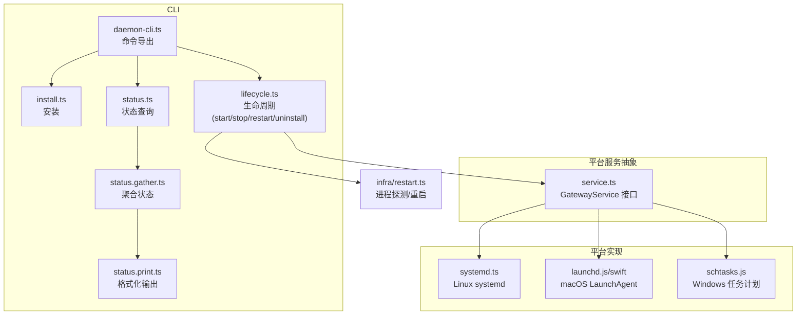
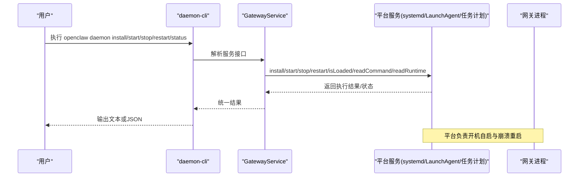
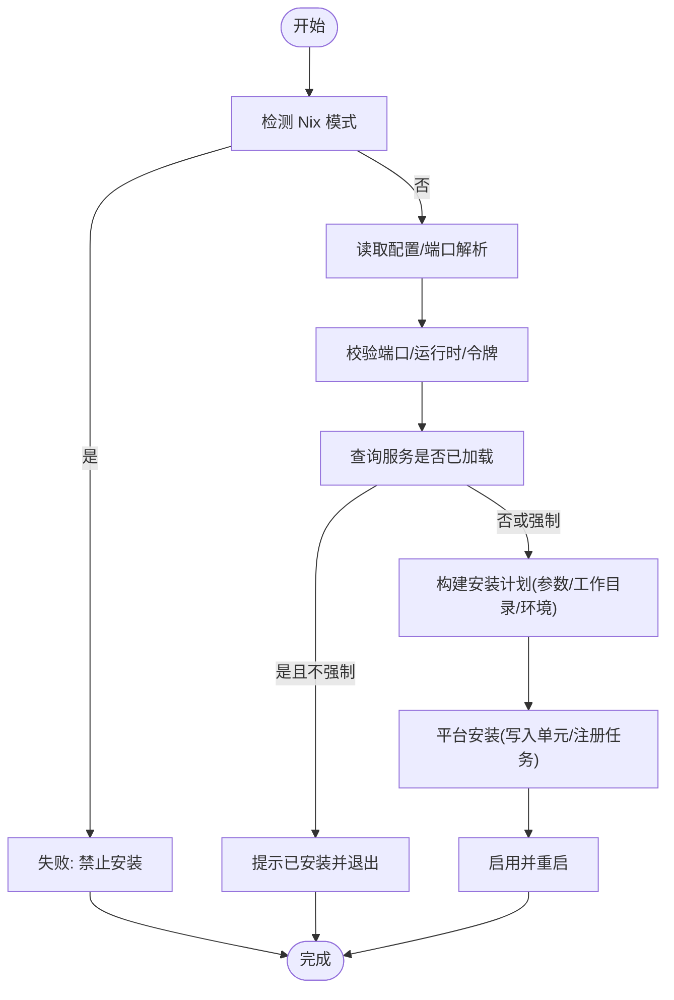
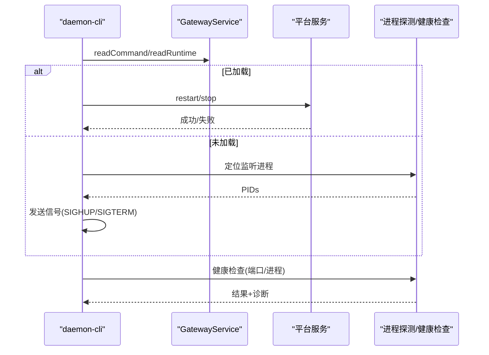
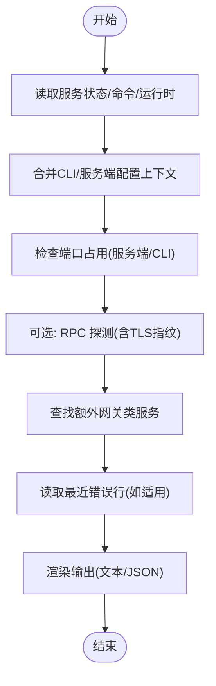
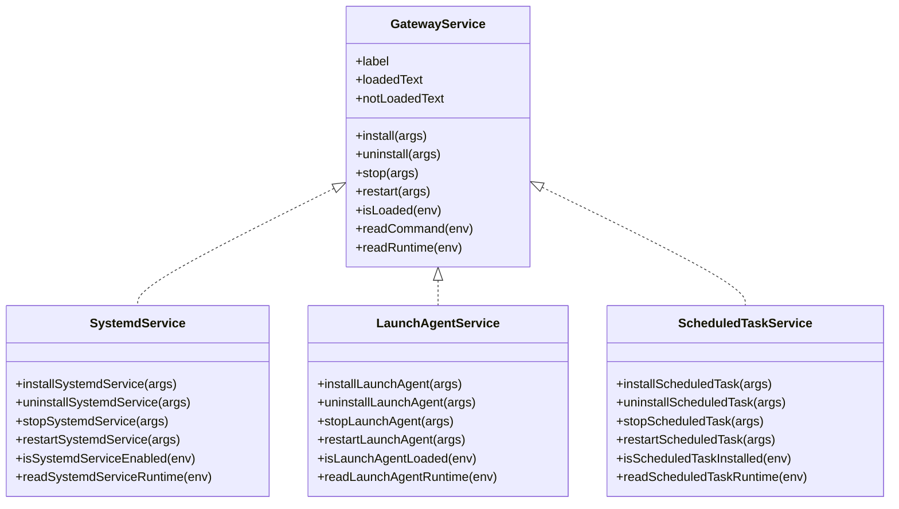

# 守护进程管理

<cite>
**本文引用的文件**
- [src/cli/daemon-cli.ts](file://src/cli/daemon-cli.ts)
- [src/cli/daemon-cli/install.ts](file://src/cli/daemon-cli/install.ts)
- [src/cli/daemon-cli/lifecycle.ts](file://src/cli/daemon-cli/lifecycle.ts)
- [src/cli/daemon-cli/status.ts](file://src/cli/daemon-cli/status.ts)
- [src/cli/daemon-cli/status.gather.ts](file://src/cli/daemon-cli/status.gather.ts)
- [src/cli/daemon-cli/status.print.ts](file://src/cli/daemon-cli/status.print.ts)
- [src/cli/daemon-cli/types.ts](file://src/cli/daemon-cli/types.ts)
- [src/daemon/service.ts](file://src/daemon/service.ts)
- [src/daemon/systemd.ts](file://src/daemon/systemd.ts)
- [src/infra/restart.ts](file://src/infra/restart.ts)
- [apps/macos/Sources/OpenClaw/LaunchAgentManager.swift](file://apps/macos/Sources/OpenClaw/LaunchAgentManager.swift)
</cite>

## 目录

1. [简介](#简介)
2. [项目结构](#项目结构)
3. [核心组件](#核心组件)
4. [架构总览](#架构总览)
5. [详细组件分析](#详细组件分析)
6. [依赖关系分析](#依赖关系分析)
7. [性能考量](#性能考量)
8. [故障排查指南](#故障排查指南)
9. [结论](#结论)
10. [附录](#附录)

## 简介

本文件系统性阐述守护进程管理命令“daemon-cli”的安装、启动、停止与状态查询能力，覆盖 macOS（LaunchAgent）、Linux（systemd）与 Windows（任务计划程序）三大平台的实现差异，说明服务注册、权限与自动启动配置要点，并给出配置项、日志管理与故障恢复策略，以及多实例管理的最佳实践。

## 项目结构

daemon-cli 的核心位于 CLI 层与平台适配层：

- CLI 命令入口与导出：src/cli/daemon-cli.ts
- 子命令实现：install、start、stop、restart、status
- 平台服务抽象：src/daemon/service.ts
- Linux 实现：src/daemon/systemd.ts
- macOS 实现：src/daemon/launchd.js（在 Swift 中调用 launchctl）
- Windows 实现：src/daemon/schtasks.js
- 进程探测与健康检查：src/infra/restart.ts
- 状态聚合与打印：src/cli/daemon-cli/status.gather.ts、status.print.ts

图表来源

- [src/cli/daemon-cli.ts:1-15](file://src/cli/daemon-cli.ts#L1-L15)
- [src/cli/daemon-cli/install.ts:1-127](file://src/cli/daemon-cli/install.ts#L1-L127)
- [src/cli/daemon-cli/lifecycle.ts:1-332](file://src/cli/daemon-cli/lifecycle.ts#L1-L332)
- [src/cli/daemon-cli/status.ts:1-21](file://src/cli/daemon-cli/status.ts#L1-L21)
- [src/cli/daemon-cli/status.gather.ts:1-382](file://src/cli/daemon-cli/status.gather.ts#L1-L382)
- [src/cli/daemon-cli/status.print.ts:1-310](file://src/cli/daemon-cli/status.print.ts#L1-L310)
- [src/daemon/service.ts:1-120](file://src/daemon/service.ts#L1-L120)
- [src/daemon/systemd.ts:1-713](file://src/daemon/systemd.ts#L1-L713)
- [src/infra/restart.ts:359-404](file://src/infra/restart.ts#L359-L404)
- [apps/macos/Sources/OpenClaw/LaunchAgentManager.swift:61-78](file://apps/macos/Sources/OpenClaw/LaunchAgentManager.swift#L61-L78)

章节来源

- [src/cli/daemon-cli.ts:1-15](file://src/cli/daemon-cli.ts#L1-L15)
- [src/daemon/service.ts:1-120](file://src/daemon/service.ts#L1-L120)

## 核心组件

- 安装（install）：解析端口、运行时、令牌，构建安装计划并调用平台服务安装；支持强制覆盖与 JSON 输出。
- 启动（start）：通过平台服务启动网关守护进程。
- 停止（stop）：优先使用平台服务停止；若未加载则尝试直接向监听端口的进程发送信号。
- 重启（restart）：优先使用平台服务重启；若未加载则向单个监听进程发送信号；随后进行健康检查与故障诊断。
- 状态（status）：聚合服务状态、配置、端口占用、RPC 可达性、额外服务等信息，并可选择深度扫描与 JSON 输出。

章节来源

- [src/cli/daemon-cli/install.ts:21-127](file://src/cli/daemon-cli/install.ts#L21-L127)
- [src/cli/daemon-cli/lifecycle.ts:193-332](file://src/cli/daemon-cli/lifecycle.ts#L193-L332)
- [src/cli/daemon-cli/status.ts:7-21](file://src/cli/daemon-cli/status.ts#L7-L21)

## 架构总览

daemon-cli 将“网关守护进程”抽象为跨平台的服务对象，按平台分发到 systemd/LaunchAgent/任务计划程序。安装时生成服务单元或计划任务，启动后由平台负责开机自启与拉起。状态查询同时检查服务状态、配置路径一致性、端口占用与 RPC 可达性，并提供健康诊断与清理建议。

图表来源

- [src/daemon/service.ts:54-120](file://src/daemon/service.ts#L54-L120)
- [src/cli/daemon-cli/lifecycle.ts:193-332](file://src/cli/daemon-cli/lifecycle.ts#L193-L332)
- [src/cli/daemon-cli/install.ts:21-127](file://src/cli/daemon-cli/install.ts#L21-L127)

## 详细组件分析

### 安装流程（install）

- 输入校验：端口合法性、运行时类型（node/bun）、令牌解析与生成。
- 服务检查：探测当前是否已加载，非致命错误容忍。
- 配置构建：根据环境与配置推断端口、工作目录、环境变量，生成启动参数。
- 平台安装：写入服务单元或计划任务，启用并重启以应用变更。
- 输出：成功/已安装提示、警告收集、JSON 输出模式。

图表来源

- [src/cli/daemon-cli/install.ts:21-127](file://src/cli/daemon-cli/install.ts#L21-L127)
- [src/daemon/systemd.ts:451-521](file://src/daemon/systemd.ts#L451-L521)

章节来源

- [src/cli/daemon-cli/install.ts:21-127](file://src/cli/daemon-cli/install.ts#L21-L127)
- [src/daemon/systemd.ts:451-521](file://src/daemon/systemd.ts#L451-L521)

### 生命周期控制（start/stop/restart/uninstall）

- start：调用平台服务启动。
- stop：优先平台服务停止；若未加载则定位监听端口的进程并发送终止信号。
- restart：优先平台服务重启；若未加载则向监听进程发送重启信号，并进行健康检查与故障诊断。
- uninstall：停止并卸载服务，断言卸载后不再加载。

图表来源

- [src/cli/daemon-cli/lifecycle.ts:193-332](file://src/cli/daemon-cli/lifecycle.ts#L193-L332)
- [src/infra/restart.ts:359-404](file://src/infra/restart.ts#L359-L404)

章节来源

- [src/cli/daemon-cli/lifecycle.ts:193-332](file://src/cli/daemon-cli/lifecycle.ts#L193-L332)
- [src/infra/restart.ts:359-404](file://src/infra/restart.ts#L359-L404)

### 状态查询（status）

- 聚合维度：服务加载状态、命令行参数、工作目录、环境、运行时状态、配置路径与有效性、端口占用与监听地址、RPC 可达性、额外服务发现。
- 输出：彩色文本或 JSON；提供日志路径、systemd journal 或 macOS 日志路径提示；端口占用与健康诊断。

图表来源

- [src/cli/daemon-cli/status.gather.ts:253-358](file://src/cli/daemon-cli/status.gather.ts#L253-L358)
- [src/cli/daemon-cli/status.print.ts:52-310](file://src/cli/daemon-cli/status.print.ts#L52-L310)

章节来源

- [src/cli/daemon-cli/status.gather.ts:253-358](file://src/cli/daemon-cli/status.gather.ts#L253-L358)
- [src/cli/daemon-cli/status.print.ts:52-310](file://src/cli/daemon-cli/status.print.ts#L52-L310)

### 平台实现概览

#### Linux（systemd）

- 单元文件路径：用户态 ~/.config/systemd/user/<name>.service。
- 安装：写入单元、daemon-reload、enable、restart；备份旧单元。
- 运行时读取：systemctl show 获取 ActiveState/SubState/MainPID 等。
- 可用性检测：systemctl --user status；对 bus 不可用、权限等问题有明确提示。
- 兼容处理：识别历史服务名并可卸载。

章节来源

- [src/daemon/systemd.ts:451-521](file://src/daemon/systemd.ts#L451-L521)
- [src/daemon/systemd.ts:606-646](file://src/daemon/systemd.ts#L606-L646)
- [src/daemon/systemd.ts:419-449](file://src/daemon/systemd.ts#L419-L449)

#### macOS（LaunchAgent）

- 通过 launchctl 管理；当服务被系统移除但缓存标签仍存在时，回退到 bootstrap 再 kickstart。
- Swift 层封装了异步执行 launchctl 的逻辑，便于 GUI 应用集成。

章节来源

- [src/infra/restart.ts:359-404](file://src/infra/restart.ts#L359-L404)
- [apps/macos/Sources/OpenClaw/LaunchAgentManager.swift:61-78](file://apps/macos/Sources/OpenClaw/LaunchAgentManager.swift#L61-L78)

#### Windows（任务计划程序）

- 使用 schtasks.js 提供安装、查询、停止、重启、卸载等能力。
- 与 CLI 的生命周期命令对接，实现统一的 start/stop/restart/uninstall。

章节来源

- [src/daemon/service.ts:11-18](file://src/daemon/service.ts#L11-L18)

## 依赖关系分析

图表来源

- [src/daemon/service.ts:54-120](file://src/daemon/service.ts#L54-L120)
- [src/daemon/systemd.ts:451-521](file://src/daemon/systemd.ts#L451-L521)

章节来源

- [src/daemon/service.ts:54-120](file://src/daemon/service.ts#L54-L120)

## 性能考量

- 健康检查采用有限次数与延迟重试，避免长时间阻塞 CLI。
- 状态查询并发读取服务状态、端口占用与 RPC 探测，缩短等待时间。
- Linux 平台在 sudo 场景下优先使用目标用户的用户作用域，减少连接 bus 的失败概率。

章节来源

- [src/cli/daemon-cli/lifecycle.ts:272-330](file://src/cli/daemon-cli/lifecycle.ts#L272-L330)
- [src/daemon/systemd.ts:387-417](file://src/daemon/systemd.ts#L387-L417)

## 故障排查指南

- systemd 用户作用域不可用：检查 dbus、XDG_RUNTIME_DIR、用户会话状态；必要时切换到机器级用户作用域。
- 服务已加载但未运行：查看 journalctl 日志（systemd）或服务运行时详情；检查环境变量与工作目录。
- macOS LaunchAgent 缓存标签缺失：使用 launchctl bootout 清理缓存后重新安装。
- 端口占用：status 会报告占用情况与监听地址；根据 bind 模式判断是否应监听所有接口。
- 多实例冲突：status 会检测其他网关类服务并给出清理建议；推荐每台机器仅运行一个网关。

章节来源

- [src/cli/daemon-cli/status.print.ts:197-237](file://src/cli/daemon-cli/status.print.ts#L197-L237)
- [src/cli/daemon-cli/status.gather.ts:292-295](file://src/cli/daemon-cli/status.gather.ts#L292-L295)
- [src/daemon/systemd.ts:433-449](file://src/daemon/systemd.ts#L433-L449)

## 结论

daemon-cli 提供一致的跨平台守护进程生命周期管理体验。通过平台服务抽象与统一的 CLI 接口，用户可以便捷地安装、启动、停止、重启与诊断网关守护进程。配合状态查询与健康检查机制，能够快速定位配置、权限与端口问题，并在多实例场景下提供清理建议。

## 附录

### 命令与选项速查

- 安装：支持指定端口、运行时、令牌与强制覆盖；可输出 JSON。
- 启动/停止/重启：统一行为，未加载时具备“无服务管理器”降级路径。
- 状态：支持深度扫描、RPC 探测、JSON 输出；展示服务命令、环境、日志路径与诊断提示。

章节来源

- [src/cli/daemon-cli/types.ts:11-28](file://src/cli/daemon-cli/types.ts#L11-L28)
- [src/cli/daemon-cli/install.ts:21-127](file://src/cli/daemon-cli/install.ts#L21-L127)
- [src/cli/daemon-cli/lifecycle.ts:193-332](file://src/cli/daemon-cli/lifecycle.ts#L193-L332)
- [src/cli/daemon-cli/status.ts:7-21](file://src/cli/daemon-cli/status.ts#L7-L21)
