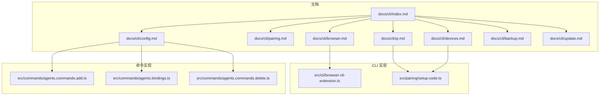
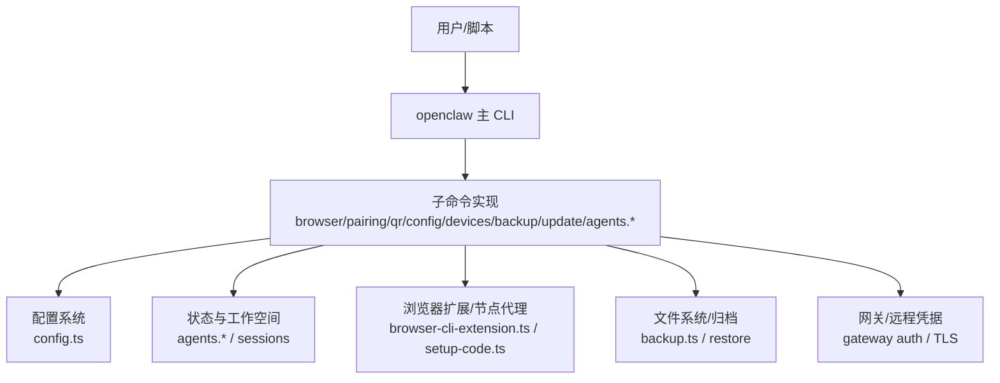
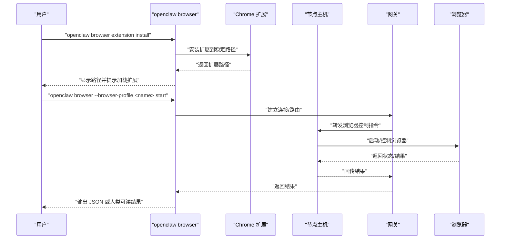
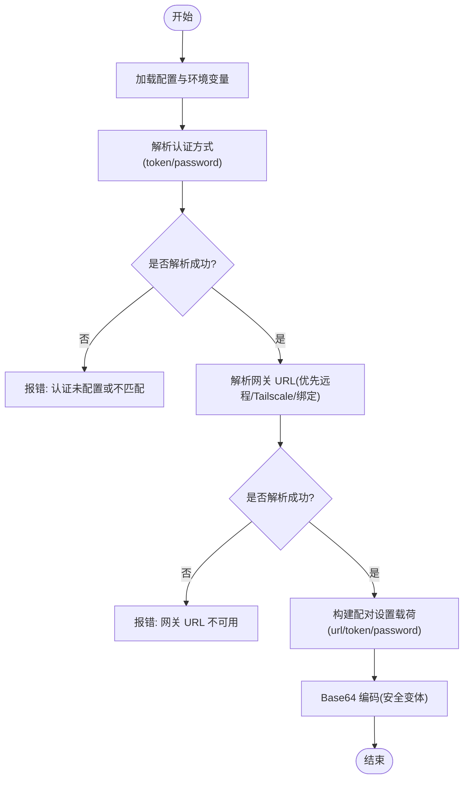
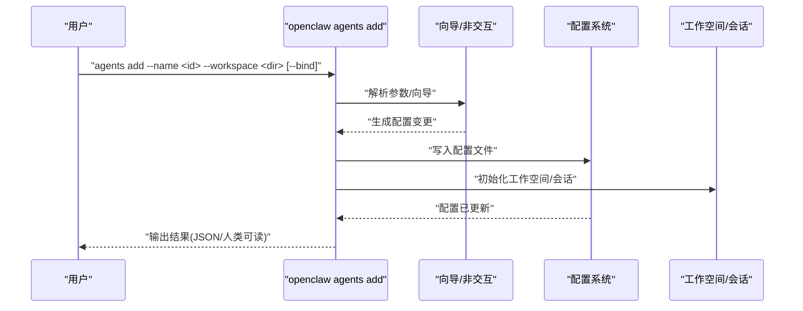
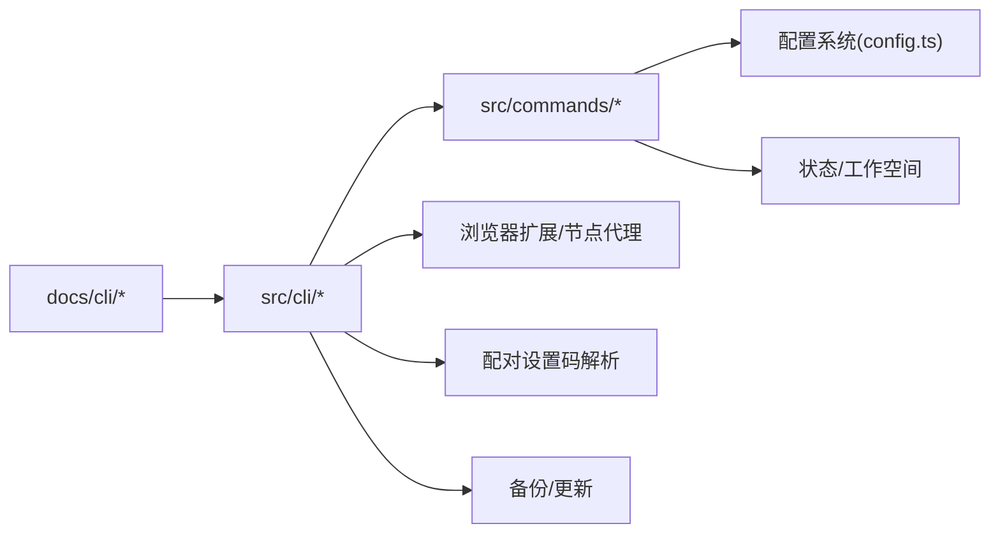

# 实用工具命令

<cite>
**本文引用的文件**
- [docs/cli/index.md](file://docs/cli/index.md)
- [docs/cli/browser.md](file://docs/cli/browser.md)
- [docs/cli/pairing.md](file://docs/cli/pairing.md)
- [docs/cli/qr.md](file://docs/cli/qr.md)
- [docs/cli/config.md](file://docs/cli/config.md)
- [docs/cli/devices.md](file://docs/cli/devices.md)
- [docs/cli/backup.md](file://docs/cli/backup.md)
- [docs/cli/update.md](file://docs/cli/update.md)
- [src/cli/browser-cli-extension.ts](file://src/cli/browser-cli-extension.ts)
- [src/pairing/setup-code.ts](file://src/pairing/setup-code.ts)
- [src/commands/agents.commands.add.ts](file://src/commands/agents.commands.add.ts)
- [src/commands/agents.bindings.ts](file://src/commands/agents.bindings.ts)
- [src/commands/agents.commands.delete.ts](file://src/commands/agents.commands.delete.ts)
</cite>

## 目录

1. [简介](#简介)
2. [项目结构](#项目结构)
3. [核心组件](#核心组件)
4. [架构总览](#架构总览)
5. [详细组件分析](#详细组件分析)
6. [依赖关系分析](#依赖关系分析)
7. [性能考量](#性能考量)
8. [故障排查指南](#故障排查指南)
9. [结论](#结论)
10. [附录](#附录)

## 简介

本参考文档聚焦“实用工具命令”，系统梳理浏览器操作、配对管理、二维码生成与配置管理等辅助命令，覆盖以下主题：

- 浏览器自动化：启动/停止、标签页管理、快照/截图、导航、元素交互（点击/输入/悬停/拖拽）、表单填写、等待与评估、PDF导出、控制台输出等。
- 设备配对与令牌管理：列出/批准/拒绝/移除/清空请求；轮换/吊销设备令牌；远程控制与节点代理。
- 二维码生成：基于当前网关配置生成 iOS 配对二维码与设置码，支持远程模式与凭据覆盖。
- 配置管理：非交互式读取/设置/删除配置项、打印配置文件路径、校验配置；与工作空间、通道、技能、网关等联动。
- 备份与更新：本地备份归档、验证与预览；安全更新与通道切换、自动重启网关。
- 命令行快捷操作、批处理脚本与自动化集成：通过 JSON 输出、超时控制、远程凭据解析等提升可编程性。

## 项目结构

围绕“实用工具命令”的文档与实现主要分布在以下位置：

- 文档层：docs/cli 下的各子命令参考文档，提供使用说明、选项与示例。
- CLI 层：src/cli 下的浏览器扩展安装/路径查询、配对设置码解析等命令注册与实现。
- 命令层：src/commands 下的多智能体添加/绑定/删除等命令，体现配置变更与状态持久化。
- 功能层：src/pairing 下的配对设置码解析逻辑，支撑二维码生成与远程凭据选择。

图表来源

- [docs/cli/index.md:1-264](file://docs/cli/index.md#L1-L264)
- [docs/cli/browser.md:1-108](file://docs/cli/browser.md#L1-L108)
- [docs/cli/qr.md:1-46](file://docs/cli/qr.md#L1-L46)
- [docs/cli/pairing.md:1-33](file://docs/cli/pairing.md#L1-L33)
- [docs/cli/config.md:1-69](file://docs/cli/config.md#L1-L69)
- [docs/cli/devices.md:1-132](file://docs/cli/devices.md#L1-L132)
- [docs/cli/backup.md:1-77](file://docs/cli/backup.md#L1-L77)
- [docs/cli/update.md:1-103](file://docs/cli/update.md#L1-L103)
- [src/cli/browser-cli-extension.ts:1-141](file://src/cli/browser-cli-extension.ts#L1-L141)
- [src/pairing/setup-code.ts:1-398](file://src/pairing/setup-code.ts#L1-L398)
- [src/commands/agents.commands.add.ts:1-369](file://src/commands/agents.commands.add.ts#L1-L369)
- [src/commands/agents.bindings.ts:1-327](file://src/commands/agents.bindings.ts#L1-L327)
- [src/commands/agents.commands.delete.ts:1-102](file://src/commands/agents.commands.delete.ts#L1-L102)

章节来源

- [docs/cli/index.md:1-264](file://docs/cli/index.md#L1-L264)

## 核心组件

- 浏览器控制命令族：提供本地或远程节点代理的浏览器控制能力，包括配置文件管理、标签页操作、快照/截图、导航与元素交互、扩展中继安装与路径查询等。
- 配对与设备管理命令族：支持列出/批准/拒绝/移除/清空设备配对请求，轮换/吊销设备令牌，并提供二维码生成以快速完成 iOS 设备配对。
- 配置管理命令族：提供非交互式配置读取/设置/删除、打印配置文件路径、校验配置合法性，便于脚本化与自动化。
- 备份与更新命令族：支持创建本地备份归档、验证归档完整性；在源码安装场景下提供安全更新与通道切换、自动重启网关。
- 多智能体管理命令族：支持添加智能体、绑定路由、删除智能体，配合配置文件写入与工作空间/会话初始化。

章节来源

- [docs/cli/browser.md:1-108](file://docs/cli/browser.md#L1-L108)
- [docs/cli/pairing.md:1-33](file://docs/cli/pairing.md#L1-L33)
- [docs/cli/qr.md:1-46](file://docs/cli/qr.md#L1-L46)
- [docs/cli/config.md:1-69](file://docs/cli/config.md#L1-L69)
- [docs/cli/devices.md:1-132](file://docs/cli/devices.md#L1-L132)
- [docs/cli/backup.md:1-77](file://docs/cli/backup.md#L1-L77)
- [docs/cli/update.md:1-103](file://docs/cli/update.md#L1-L103)
- [src/commands/agents.commands.add.ts:1-369](file://src/commands/agents.commands.add.ts#L1-L369)
- [src/commands/agents.bindings.ts:1-327](file://src/commands/agents.bindings.ts#L1-L327)
- [src/commands/agents.commands.delete.ts:1-102](file://src/commands/agents.commands.delete.ts#L1-L102)

## 架构总览

实用工具命令的整体架构由“文档参考—CLI 注册—命令实现—功能模块”构成，形成清晰的分层与职责边界：

- 文档参考层：集中描述命令树、选项与示例，确保用户与自动化脚本的一致性入口。
- CLI 注册层：将命令与子命令注册到主 CLI，统一参数解析与输出格式（含 JSON）。
- 命令实现层：执行业务逻辑（如浏览器控制、配对设置码解析、多智能体管理），并与配置/状态持久化交互。
- 功能模块层：如配对设置码解析、浏览器扩展安装等，为命令提供可复用的能力。

图表来源

- [docs/cli/index.md:93-264](file://docs/cli/index.md#L93-L264)
- [src/cli/browser-cli-extension.ts:70-141](file://src/cli/browser-cli-extension.ts#L70-L141)
- [src/pairing/setup-code.ts:357-398](file://src/pairing/setup-code.ts#L357-L398)
- [docs/cli/backup.md:13-77](file://docs/cli/backup.md#L13-L77)

## 详细组件分析

### 组件一：浏览器控制命令

- 能力概览
  - 启动/停止浏览器实例，重置配置文件，列出/聚焦/关闭标签页，创建/删除配置文件。
  - 快照与截图，导航至指定 URL，窗口尺寸调整。
  - 元素交互：点击、输入、按键、悬停、拖拽、选择、上传、填充表单。
  - 等待与评估：等待条件满足、执行 JS 评估、查看控制台输出。
  - PDF 导出与对话框处理。
  - 远程控制：通过节点主机代理在远端机器上控制浏览器。
  - 扩展中继：安装/查询 Chrome 扩展路径，手动附加到现有 Chrome 标签页。
- 关键实现要点
  - 扩展安装与路径查询：提供稳定的扩展安装目录、复制路径到剪贴板、提示下一步操作。
  - 远程控制：通过网关节点代理转发浏览器动作，支持自动路由与节点选择。
  - 行为一致性：统一超时、JSON 输出、错误处理与可编程接口。

图表来源

- [docs/cli/browser.md:86-108](file://docs/cli/browser.md#L86-L108)
- [src/cli/browser-cli-extension.ts:70-141](file://src/cli/browser-cli-extension.ts#L70-L141)

章节来源

- [docs/cli/browser.md:1-108](file://docs/cli/browser.md#L1-L108)
- [src/cli/browser-cli-extension.ts:1-141](file://src/cli/browser-cli-extension.ts#L1-L141)

### 组件二：配对与设备管理命令

- 能力概览
  - 列出/批准/拒绝/移除/清空设备配对请求；轮换/吊销设备令牌；支持 JSON 输出与远程凭据。
  - 二维码生成：从当前网关配置生成 iOS 配对二维码与设置码，支持远程模式与凭据覆盖。
- 关键实现要点
  - 配对设置码解析：根据配置与环境变量解析网关 URL 与认证方式（token/password），支持强制安全协议、Tailscale 服务、远程 URL 优先策略。
  - 设备令牌管理：提供轮换与吊销接口，要求 operator 权限范围；支持批量清理与最新请求自动批准。
  - 安全与兼容：当同时配置 token 与 password 且未显式设置模式时，需显式指定认证模式以避免歧义。

图表来源

- [src/pairing/setup-code.ts:357-398](file://src/pairing/setup-code.ts#L357-L398)

章节来源

- [docs/cli/pairing.md:1-33](file://docs/cli/pairing.md#L1-L33)
- [docs/cli/devices.md:1-132](file://docs/cli/devices.md#L1-L132)
- [docs/cli/qr.md:1-46](file://docs/cli/qr.md#L1-L46)
- [src/pairing/setup-code.ts:1-398](file://src/pairing/setup-code.ts#L1-L398)

### 组件三：配置管理命令

- 能力概览
  - 非交互式配置读取/设置/删除，打印活动配置文件路径，校验配置合法性（支持 JSON 输出）。
  - 支持点/方括号路径访问数组与对象，严格 JSON5 解析与字符串回退。
- 关键实现要点
  - 路径语法：支持 agents.defaults.workspace、agents.list[0].id 等形式。
  - 值解析：优先 JSON5，否则按字符串处理；可通过严格模式要求 JSON5。
  - 变更生效：修改后建议重启网关以应用新配置。

章节来源

- [docs/cli/config.md:1-69](file://docs/cli/config.md#L1-L69)

### 组件四：备份与更新命令

- 备份
  - 创建本地备份归档，包含状态目录、活动配置文件、凭据目录与可选工作空间；支持验证归档完整性、仅备份配置、跳过工作空间发现等。
  - 归档布局记录清单，避免自包含与路径穿越风险；支持硬链接发布与回退复制。
- 更新
  - 源码安装场景下的安全更新：支持通道切换（stable/beta/dev）、标签覆盖、干运行预演、禁用重启；与网关自动更新器复用同一路径。
  - Git 工作流：dev 分支采用 rebase 并进行构建前检查；其他分支直接 checkout 并构建。
  - 便捷短横线：openclaw --update 等价于 openclaw update。

章节来源

- [docs/cli/backup.md:1-77](file://docs/cli/backup.md#L1-L77)
- [docs/cli/update.md:1-103](file://docs/cli/update.md#L1-L103)

### 组件五：多智能体管理命令

- 能力概览
  - 添加智能体：支持非交互模式（必须提供工作空间）、向导模式、规范化 ID、默认模型与账户复制。
  - 绑定路由：解析绑定规范（channel[:accountId]），支持插件默认账户解析与强制账户绑定；处理冲突与升级场景。
  - 删除智能体：删除配置条目并清理工作空间/状态/会话，支持 JSON 输出与交互确认。
- 关键实现要点
  - 绑定冲突检测：若目标匹配键已被其他智能体占用，则标记为冲突并跳过。
  - 账户作用域升级：当从无账户作用域升级到有账户作用域时，尝试在同一身份键下迁移。
  - 默认智能体复制：在不同智能体目录间复制认证资料，减少重复配置。

图表来源

- [src/commands/agents.commands.add.ts:51-177](file://src/commands/agents.commands.add.ts#L51-L177)
- [src/commands/agents.bindings.ts:75-159](file://src/commands/agents.bindings.ts#L75-L159)
- [src/commands/agents.commands.delete.ts:19-102](file://src/commands/agents.commands.delete.ts#L19-L102)

章节来源

- [src/commands/agents.commands.add.ts:1-369](file://src/commands/agents.commands.add.ts#L1-L369)
- [src/commands/agents.bindings.ts:1-327](file://src/commands/agents.bindings.ts#L1-L327)
- [src/commands/agents.commands.delete.ts:1-102](file://src/commands/agents.commands.delete.ts#L1-L102)

## 依赖关系分析

- 命令与文档耦合：docs/cli 下的各子命令文档与 CLI 实现一一对应，保证用户手册与实际行为一致。
- 命令与配置耦合：多智能体命令与配置系统深度耦合，涉及 agents 列表、绑定、工作空间与会话。
- 命令与功能模块耦合：配对设置码解析与浏览器扩展安装分别服务于二维码生成与浏览器控制。
- 外部依赖：远程凭据解析依赖网关认证模式与 TLS 设置；备份归档依赖文件系统与压缩工具；更新命令依赖 Git/npm 生态。

图表来源

- [docs/cli/index.md:93-264](file://docs/cli/index.md#L93-L264)
- [src/pairing/setup-code.ts:357-398](file://src/pairing/setup-code.ts#L357-L398)
- [src/cli/browser-cli-extension.ts:70-141](file://src/cli/browser-cli-extension.ts#L70-L141)

章节来源

- [docs/cli/index.md:93-264](file://docs/cli/index.md#L93-L264)

## 性能考量

- 备份性能：大型工作空间是归档体积的主要驱动因素；可通过“仅备份配置”“跳过工作空间”降低体积与耗时。
- 更新性能：dev 分支采用预检构建与回退策略，避免失败更新；稳定/β 分支直接切换标签并构建。
- 浏览器控制：远程节点代理与扩展中继可能受网络延迟影响，建议合理设置超时与重试策略。
- 配置校验：config validate 支持 JSON 输出，适合 CI 中快速校验配置正确性。

## 故障排查指南

- 浏览器扩展安装失败
  - 现象：安装后 manifest.json 缺失或无法加载。
  - 排查：确认扩展根目录存在，检查安装目录权限；重新安装并复制路径到剪贴板后手动加载。
- 远程浏览器控制不可达
  - 现象：网关无法转发到节点主机。
  - 排查：检查节点主机连通性、网关节点代理配置、自动路由与节点选择；确认浏览器实例已启动。
- 配对二维码无效
  - 现象：iOS 扫描后无法配对。
  - 排查：确认网关 URL 可达（LAN/Tailscale/远程 URL），认证方式（token/password）已正确解析；若同时配置两者且未显式设置模式，需明确 gateway.auth.mode。
- 设备令牌漂移
  - 现象：客户端反复出现 AUTH_TOKEN_MISMATCH。
  - 排查：使用 devices rotate 为受影响设备轮换 operator 令牌；必要时移除旧配对并重新批准。
- 备份归档校验失败
  - 现象：verify 报告清单缺失或路径穿越。
  - 排查：检查归档完整性与清单；避免输出路径位于源树内导致自包含；使用 dry-run 预览包含路径。

章节来源

- [src/cli/browser-cli-extension.ts:42-68](file://src/cli/browser-cli-extension.ts#L42-L68)
- [docs/cli/devices.md:96-132](file://docs/cli/devices.md#L96-L132)
- [docs/cli/qr.md:34-46](file://docs/cli/qr.md#L34-L46)
- [docs/cli/backup.md:29-31](file://docs/cli/backup.md#L29-L31)

## 结论

实用工具命令围绕“易用性、可编程性与安全性”展开：通过丰富的浏览器控制、简洁的配对与设备管理、灵活的配置与备份更新能力，以及面向脚本与自动化集成的 JSON 输出与超时控制，为用户提供了从日常运维到复杂场景的完整工具集。建议在生产环境中结合 JSON 输出与远程凭据解析，配合定期备份与更新策略，确保系统的稳定性与可维护性。

## 附录

- 常用命令速查
  - 浏览器：openclaw browser profiles/tabs/start/stop/screenshot/snapshot/navigate/click/type/evaluate/pdf/console 等。
  - 配对与设备：openclaw pairing list/approve；openclaw devices list/approve/reject/remove/clear/rotate/revoke。
  - 二维码：openclaw qr [--remote/--url/--token/--password/--setup-code-only/--json]。
  - 配置：openclaw config get/set/unset/file/validate；支持 JSON5 与严格模式。
  - 备份：openclaw backup create [--output/--dry-run/--verify/--no-include-workspace/--only-config]；openclaw backup verify <archive>。
  - 更新：openclaw update [--channel/--tag/--dry-run/--no-restart/--json/--timeout]；openclaw --update。
  - 多智能体：openclaw agents add/list/bind/unbind/delete；支持绑定规范与账户作用域解析。
