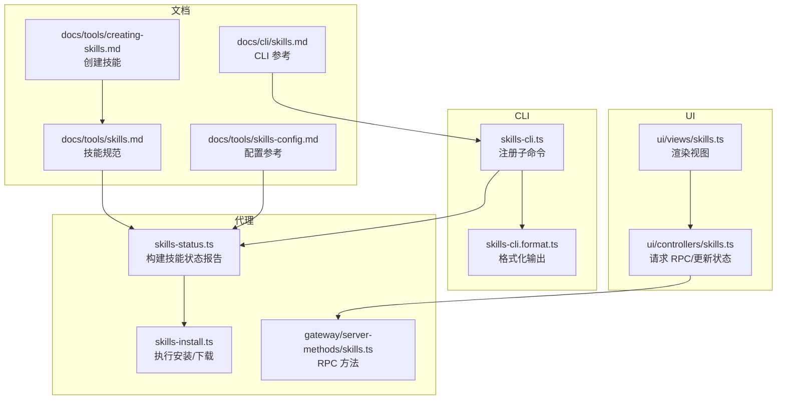
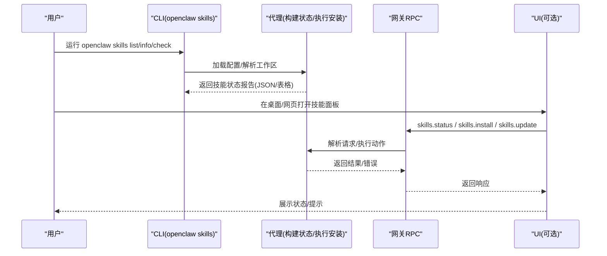
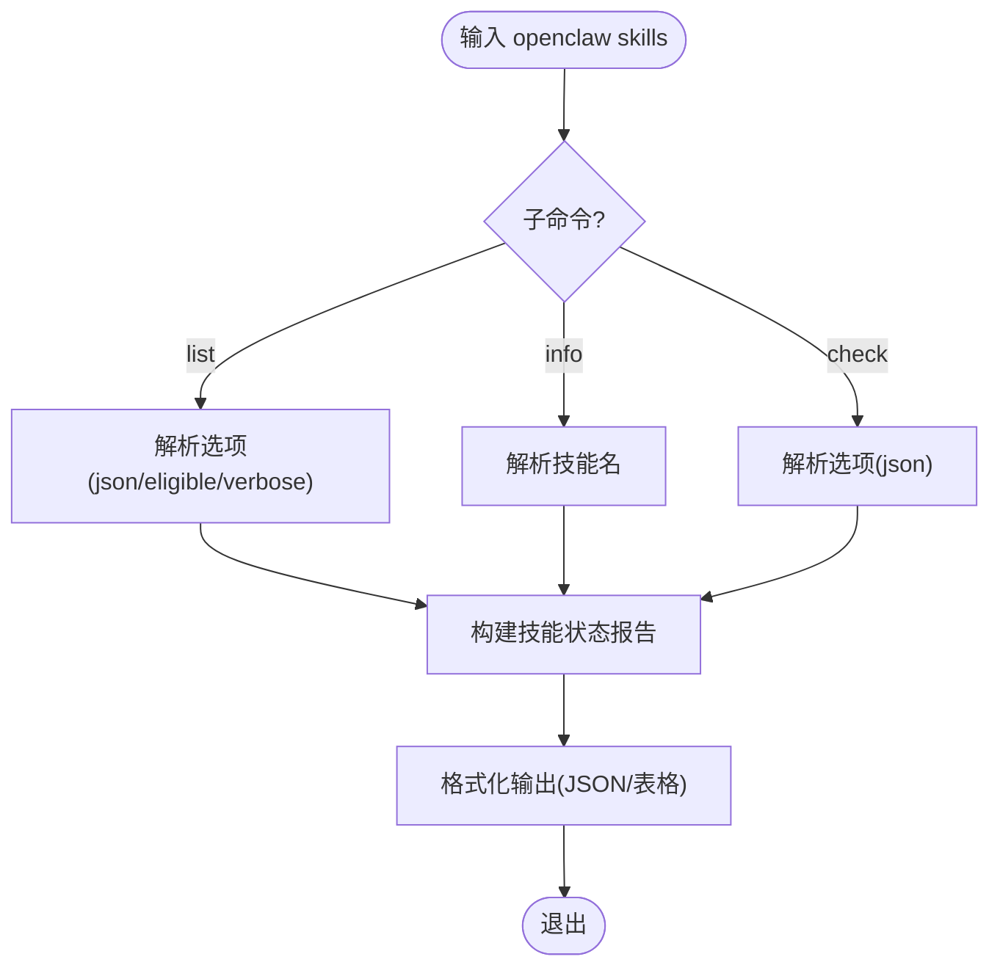
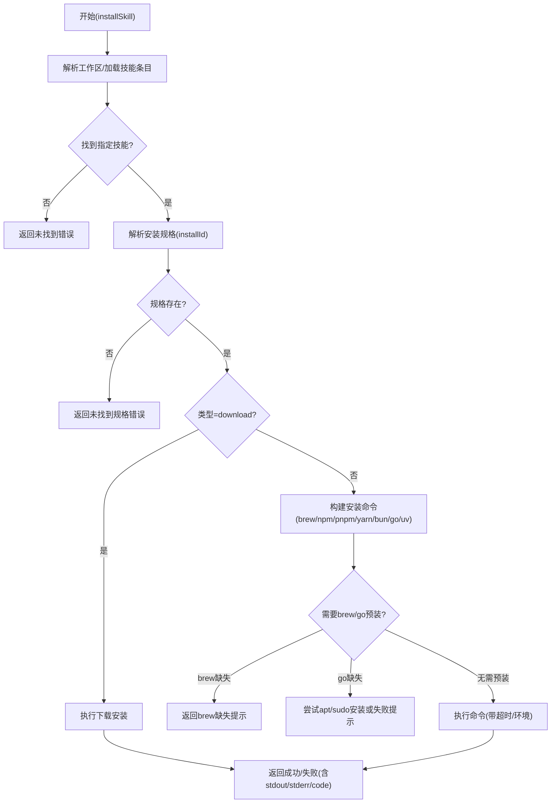
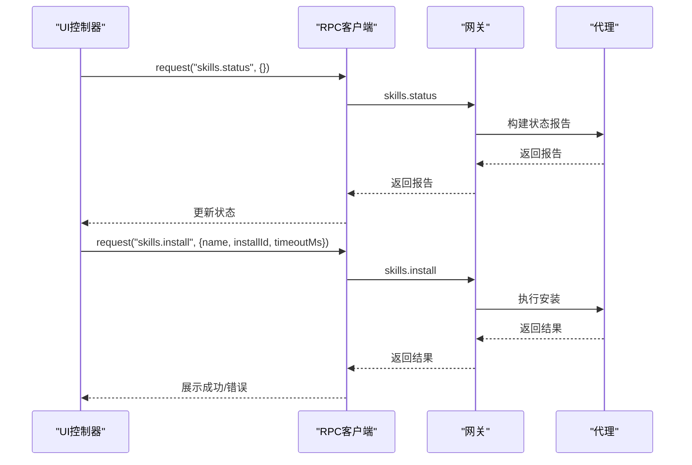
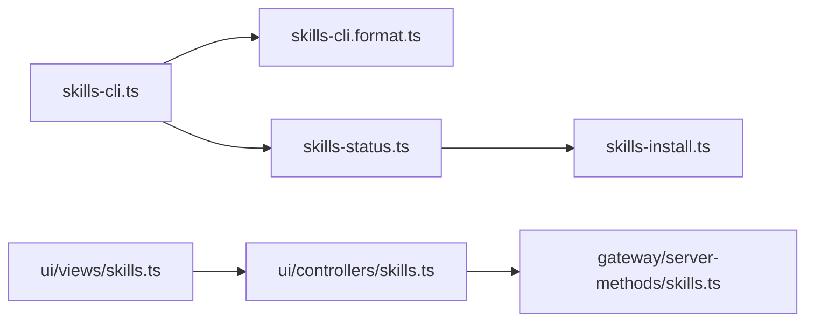

# 技能管理命令

<cite>
**本文引用的文件**
- [skills.md](file://docs/cli/skills.md)
- [skills.md](file://docs/tools/skills.md)
- [creating-skills.md](file://docs/tools/creating-skills.md)
- [skills-config.md](file://docs/tools/skills-config.md)
- [skills-cli.ts](file://src/cli/skills-cli.ts)
- [skills-cli.format.ts](file://src/cli/skills-cli.format.ts)
- [skills-status.ts](file://src/agents/skills-status.ts)
- [skills-install.ts](file://src/agents/skills-install.ts)
- [skills.ts](file://src/gateway/server-methods/skills.ts)
- [skills.ts](file://apps/macos/Sources/OpenClaw/SkillsModels.swift)
- [skills.ts](file://src/auto-reply/skill-commands.ts)
- [commands-registry.data.ts](file://src/auto-reply/commands-registry.data.ts)
- [slash-skill-commands.runtime.ts](file://src/slack/monitor/slash-skill-commands.runtime.ts)
- [skills.ts](file://ui/src/ui/controllers/skills.ts)
- [skills.ts](file://ui/src/ui/views/skills.ts)
- [uninstall.md](file://docs/cli/uninstall.md)
</cite>

## 目录

1. [简介](#简介)
2. [项目结构](#项目结构)
3. [核心组件](#核心组件)
4. [架构总览](#架构总览)
5. [详细组件分析](#详细组件分析)
6. [依赖关系分析](#依赖关系分析)
7. [性能考量](#性能考量)
8. [故障排查指南](#故障排查指南)
9. [结论](#结论)
10. [附录](#附录)

## 简介

本文件系统化梳理 OpenClaw 的“技能管理命令”，覆盖技能的安装、卸载、更新与配置管理，解释技能包格式、依赖与版本控制机制，提供开发工具链、测试与发布流程建议，并给出性能监控、错误追踪与调试技巧，以及与代理集成、权限控制与安全考虑。

## 项目结构

围绕“技能管理命令”的相关模块分布如下：

- CLI 层：提供 openclaw skills 子命令，列出、查看、检查技能状态
- 代理层：构建技能状态报告、执行安装与更新操作
- UI 层：桌面端与 Web UI 提供技能状态展示与交互
- 文档层：技能规范、配置参考与使用指南

**图表来源**

- [skills-cli.ts:40-82](file://src/cli/skills-cli.ts#L40-L82)
- [skills-cli.format.ts:1-44](file://src/cli/skills-cli.format.ts#L1-L44)
- [skills-status.ts:227-254](file://src/agents/skills-status.ts#L227-L254)
- [skills-install.ts:392-471](file://src/agents/skills-install.ts#L392-L471)
- [skills.ts:114-138](file://src/gateway/server-methods/skills.ts#L114-L138)
- [skills.ts:46-97](file://ui/src/ui/controllers/skills.ts#L46-L97)
- [skills.ts:28-36](file://ui/src/ui/views/skills.ts#L28-L36)
- [skills.md:1-303](file://docs/tools/skills.md#L1-L303)
- [skills.md:1-27](file://docs/cli/skills.md#L1-L27)
- [creating-skills.md:1-59](file://docs/tools/creating-skills.md#L1-L59)
- [skills-config.md:1-78](file://docs/tools/skills-config.md#L1-L78)

**章节来源**

- [skills-cli.ts:1-82](file://src/cli/skills-cli.ts#L1-L82)
- [skills-cli.format.ts:1-44](file://src/cli/skills-cli.format.ts#L1-L44)
- [skills-status.ts:1-254](file://src/agents/skills-status.ts#L1-L254)
- [skills-install.ts:1-471](file://src/agents/skills-install.ts#L1-L471)
- [skills.ts:93-138](file://src/gateway/server-methods/skills.ts#L93-L138)
- [skills.ts:1-74](file://apps/macos/Sources/OpenClaw/SkillsModels.swift#L1-L74)
- [skills.ts:36-164](file://src/auto-reply/skill-commands.ts#L36-L164)
- [commands-registry.data.ts:131-184](file://src/auto-reply/commands-registry.data.ts#L131-L184)
- [slash-skill-commands.runtime.ts:1-1](file://src/slack/monitor/slash-skill-commands.runtime.ts#L1-L1)
- [skills.ts:39-157](file://ui/src/ui/controllers/skills.ts#L39-L157)
- [skills.ts:1-36](file://ui/src/ui/views/skills.ts#L1-L36)
- [skills.md:1-303](file://docs/tools/skills.md#L1-L303)
- [skills.md:1-27](file://docs/cli/skills.md#L1-L27)
- [creating-skills.md:1-59](file://docs/tools/creating-skills.md#L1-L59)
- [skills-config.md:1-78](file://docs/tools/skills-config.md#L1-L78)

## 核心组件

- CLI 子命令
  - openclaw skills list：列出技能，支持筛选“仅可用”“详细缺失项”“JSON 输出”
  - openclaw skills info <name>：显示技能详情
  - openclaw skills check：检查技能就绪状态与缺失项
- 代理能力
  - 构建技能状态报告（含来源、是否可用、缺失需求、可安装选项）
  - 执行安装（brew/npm/pnpm/yarn/bun/go/uv/download）
  - 更新技能配置（启用/禁用、保存 API Key、环境变量注入）
- UI 集成
  - 请求 skills.status/skills.install/skills.update
  - 渲染技能列表、状态提示与安装入口
- 文档与规范
  - 技能包格式（SKILL.md 前言元数据）、加载优先级、环境注入、远程节点适配
  - 配置 schema（允许捆绑包、额外扫描目录、安装偏好、按技能覆盖）

**章节来源**

- [skills-cli.ts:40-82](file://src/cli/skills-cli.ts#L40-L82)
- [skills-cli.format.ts:7-26](file://src/cli/skills-cli.format.ts#L7-L26)
- [skills-status.ts:30-55](file://src/agents/skills-status.ts#L30-L55)
- [skills-install.ts:19-34](file://src/agents/skills-install.ts#L19-L34)
- [skills.ts:114-138](file://src/gateway/server-methods/skills.ts#L114-L138)
- [skills.ts:46-97](file://ui/src/ui/controllers/skills.ts#L46-L97)
- [skills.md:11-303](file://docs/tools/skills.md#L11-L303)
- [skills-config.md:13-78](file://docs/tools/skills-config.md#L13-L78)

## 架构总览

技能管理命令的端到端流程如下：

**图表来源**

- [skills-cli.ts:20-35](file://src/cli/skills-cli.ts#L20-L35)
- [skills-status.ts:227-254](file://src/agents/skills-status.ts#L227-L254)
- [skills-install.ts:392-471](file://src/agents/skills-install.ts#L392-L471)
- [skills.ts:114-138](file://src/gateway/server-methods/skills.ts#L114-L138)
- [skills.ts:46-97](file://ui/src/ui/controllers/skills.ts#L46-L97)

## 详细组件分析

### CLI 子命令与格式化

- 注册与帮助
  - skills 子命令组，包含 list/info/check 三个子命令
  - 支持 --json/--eligible/--verbose 等选项
- 格式化输出
  - 列表：按可用性、来源、缺失项等格式化
  - 信息：按技能键值展示详情
  - 检查：突出缺失项与原因

**图表来源**

- [skills-cli.ts:40-82](file://src/cli/skills-cli.ts#L40-L82)
- [skills-cli.format.ts:7-26](file://src/cli/skills-cli.format.ts#L7-L26)

**章节来源**

- [skills-cli.ts:1-82](file://src/cli/skills-cli.ts#L1-L82)
- [skills-cli.format.ts:1-44](file://src/cli/skills-cli.format.ts#L1-L44)

### 技能状态构建与安装执行

- 状态构建
  - 读取工作区/托管/捆绑技能，评估平台要求、环境变量、配置项
  - 生成技能条目：名称、描述、来源、是否可用、缺失项、可安装选项
- 安装执行
  - 支持 brew/npm/pnpm/yarn/bun/go/uv/download 多种安装器
  - 自动探测 brew 与 go 安装路径，必要时先安装依赖工具
  - 对下载类安装器执行下载与解压流程
  - 统一超时控制与错误包装

**图表来源**

- [skills-install.ts:392-471](file://src/agents/skills-install.ts#L392-L471)
- [skills-install.ts:114-154](file://src/agents/skills-install.ts#L114-L154)
- [skills-install.ts:256-367](file://src/agents/skills-install.ts#L256-L367)

**章节来源**

- [skills-status.ts:169-225](file://src/agents/skills-status.ts#L169-L225)
- [skills-install.ts:1-471](file://src/agents/skills-install.ts#L1-L471)

### 网关 RPC 方法与 UI 交互

- skills.status：返回技能状态报告
- skills.install：执行安装并返回结果
- skills.update：更新技能启用状态/API Key/环境变量
- UI 控制器：封装 RPC 请求、刷新状态、展示消息

**图表来源**

- [skills.ts:46-97](file://ui/src/ui/controllers/skills.ts#L46-L97)
- [skills.ts:125-157](file://ui/src/ui/controllers/skills.ts#L125-L157)
- [skills.ts:114-138](file://src/gateway/server-methods/skills.ts#L114-L138)

**章节来源**

- [skills.ts:93-138](file://src/gateway/server-methods/skills.ts#L93-L138)
- [skills.ts:39-157](file://ui/src/ui/controllers/skills.ts#L39-L157)

### 技能包格式、依赖与版本控制

- 包格式
  - 采用 AgentSkills 兼容的 SKILL.md，前言元数据为单行 YAML
  - metadata.openclaw 支持 always/emoji/homepage/os/requires/install 等字段
- 依赖管理
  - requires.bins/anyBins：PATH 中二进制依赖
  - requires.env：进程环境或配置中提供的变量
  - requires.config：openclaw.json 中的路径表达式
  - primaryEnv：与技能 API Key 关联的主环境变量
- 版本与安装
  - 支持多安装器：brew/node/go/uv/download
  - 安装器可按平台过滤，Node 管理器可配置（npm/pnpm/yarn/bun）
  - 下载安装器支持 URL、压缩包、提取策略与目标目录

**章节来源**

- [skills.md:78-184](file://docs/tools/skills.md#L78-L184)
- [skills-config.md:13-78](file://docs/tools/skills-config.md#L13-L78)

### 配置与环境注入

- 全局配置
  - skills.allowBundled：对捆绑技能的白名单
  - skills.load.extraDirs：额外扫描目录
  - skills.load.watch/watchDebounceMs：热重载与去抖
  - skills.install.preferBrew/nodeManager：安装偏好
- 按技能覆盖
  - skills.entries.<key>：enabled/env/apiKey/config
- 运行时注入
  - 每次代理回合开始时，应用技能 env/apiKey 至进程环境，结束后恢复

**章节来源**

- [skills-config.md:13-78](file://docs/tools/skills-config.md#L13-L78)
- [skills.md:189-241](file://docs/tools/skills.md#L189-L241)

### 与代理集成、权限与安全

- 代理命令公开
  - 用户可通过 /skill 命令调用 user-invocable 技能
  - 支持 command-dispatch: tool 直接路由到工具（确定性，避免模型）
- 权限与沙箱
  - 第三方技能视为不受信任代码，建议沙箱运行
  - 沙箱容器需具备所需二进制；环境变量不继承宿主进程
- 远程节点
  - Linux 网关可借助 macOS 节点在满足条件时将 macOS-only 技能视为可用

**章节来源**

- [skills.md:69-76](file://docs/tools/skills.md#L69-L76)
- [skills.md:248-253](file://docs/tools/skills.md#L248-L253)
- [slash-skill-commands.runtime.ts:1-1](file://src/slack/monitor/slash-skill-commands.runtime.ts#L1-L1)
- [commands-registry.data.ts:147-167](file://src/auto-reply/commands-registry.data.ts#L147-L167)

## 依赖关系分析

- CLI 依赖代理构建状态与格式化模块
- 代理依赖配置解析、技能条目加载、安装器实现
- 网关 RPC 暴露安装与更新接口
- UI 通过 RPC 与网关交互，驱动状态刷新与安装

**图表来源**

- [skills-cli.ts:1-82](file://src/cli/skills-cli.ts#L1-L82)
- [skills-cli.format.ts:1-44](file://src/cli/skills-cli.format.ts#L1-L44)
- [skills-status.ts:1-254](file://src/agents/skills-status.ts#L1-L254)
- [skills-install.ts:1-471](file://src/agents/skills-install.ts#L1-L471)
- [skills.ts:46-97](file://ui/src/ui/controllers/skills.ts#L46-L97)
- [skills.ts:28-36](file://ui/src/ui/views/skills.ts#L28-L36)

**章节来源**

- [skills-cli.ts:1-82](file://src/cli/skills-cli.ts#L1-L82)
- [skills-status.ts:1-254](file://src/agents/skills-status.ts#L1-L254)
- [skills-install.ts:1-471](file://src/agents/skills-install.ts#L1-L471)
- [skills.ts:39-157](file://ui/src/ui/controllers/skills.ts#L39-L157)
- [skills.ts:1-36](file://ui/src/ui/views/skills.ts#L1-L36)

## 性能考量

- 技能列表注入系统提示的成本是确定性的，随技能数量与字段长度线性增长
- 折叠/压缩技能路径可减少提示 token 开销
- 监控与热重载：开启 skills.load.watch 可在变更时刷新技能快照

**章节来源**

- [skills.md:269-286](file://docs/tools/skills.md#L269-L286)
- [skills.md:242-247](file://docs/tools/skills.md#L242-L247)

## 故障排查指南

- 缺少二进制/环境变量/配置
  - 使用 openclaw skills check 查看缺失项
  - 根据提示安装 brew/go/uv 或补齐环境变量与配置
- 安装失败
  - 检查 stdout/stderr 与退出码
  - 若 brew 缺失，按提示安装 Homebrew 或改用其他安装器
- UI 安装无响应
  - 确认已连接网关，查看错误消息与加载状态
  - 重新触发刷新或重启网关

**章节来源**

- [skills-cli.format.ts:41-64](file://src/cli/skills-cli.format.ts#L41-L64)
- [skills-install.ts:247-254](file://src/agents/skills-install.ts#L247-L254)
- [skills.ts:125-157](file://ui/src/ui/controllers/skills.ts#L125-L157)

## 结论

技能管理命令围绕“状态构建—安装执行—UI 展示—配置覆盖”形成闭环。通过标准化的技能包格式与安装器生态，结合严格的依赖与安全策略，OpenClaw 为多平台、多代理场景下的技能生命周期管理提供了清晰、可扩展的方案。

## 附录

### 常用命令速查

- 列出技能：openclaw skills list [--eligible] [--verbose] [--json]
- 查看技能：openclaw skills info <name> [--json]
- 检查就绪：openclaw skills check [--json]
- 安装技能：在 UI 中选择技能与安装规格，或通过网关 RPC 调用 skills.install
- 更新配置：通过 UI 或网关 RPC 调用 skills.update（启用/禁用、保存 API Key）

**章节来源**

- [skills.md:19-27](file://docs/cli/skills.md#L19-L27)
- [skills-cli.ts:50-75](file://src/cli/skills-cli.ts#L50-L75)
- [skills.ts:125-157](file://ui/src/ui/controllers/skills.ts#L125-L157)
- [skills.ts:114-138](file://src/gateway/server-methods/skills.ts#L114-L138)

### 技能开发与测试

- 创建步骤
  - 在工作区 skills 目录下创建新技能目录与 SKILL.md
  - 使用 frontmatter 定义元数据，必要时声明 command-dispatch/tool
  - 通过 /skill 命令或 UI 测试
- 最佳实践
  - 安全优先：避免在提示中泄露敏感信息
  - 简洁明确：指导模型做什么而非如何做
  - 本地验证：使用 openclaw agent --message 测试

**章节来源**

- [creating-skills.md:17-59](file://docs/tools/creating-skills.md#L17-L59)

### 发布与同步

- 使用 ClawHub 进行发现、安装、更新与备份
- 默认安装到当前工作区或配置的工作区，下次会话生效

**章节来源**

- [skills.md:50-68](file://docs/tools/skills.md#L50-L68)

### 卸载与清理

- openclaw uninstall 支持干跑与全部清理，建议先备份
- 注意：卸载会移除服务与本地数据，CLI 本身保留

**章节来源**

- [uninstall.md:1-21](file://docs/cli/uninstall.md#L1-L21)
