# 插件管理命令

<cite>
**本文引用的文件**
- [docs/cli/plugins.md](file://docs/cli/plugins.md)
- [docs/plugins/manifest.md](file://docs/plugins/manifest.md)
- [src/cli/plugins-cli.ts](file://src/cli/plugins-cli.ts)
- [src/plugins/cli.ts](file://src/plugins/cli.ts)
- [src/plugins/commands.ts](file://src/plugins/commands.ts)
- [src/plugins/discovery.ts](file://src/plugins/discovery.ts)
- [src/plugins/config-state.ts](file://src/plugins/config-state.ts)
- [src/plugins/install.ts](file://src/plugins/install.ts)
- [src/plugins/update.ts](file://src/plugins/update.ts)
- [src/plugins/uninstall.ts](file://src/plugins/uninstall.ts)
- [src/plugins/loader.ts](file://src/plugins/loader.ts)
- [src/plugins/status.ts](file://src/plugins/status.ts)
- [src/plugin-sdk/index.ts](file://src/plugin-sdk/index.ts)
</cite>

## 目录

1. [简介](#简介)
2. [项目结构](#项目结构)
3. [核心组件](#核心组件)
4. [架构总览](#架构总览)
5. [详细组件分析](#详细组件分析)
6. [依赖关系分析](#依赖关系分析)
7. [性能考量](#性能考量)
8. [故障排查指南](#故障排查指南)
9. [结论](#结论)
10. [附录](#附录)

## 简介

本文件为 OpenClaw 插件管理命令的完整参考文档，覆盖插件的安装、卸载、更新与配置管理命令；解释插件注册机制、依赖解析与版本兼容性检查；提供插件开发工具链、测试框架与发布流程建议；并包含性能监控、内存管理与安全审计方法，以及插件与核心系统的集成、权限隔离与故障隔离策略。

## 项目结构

围绕插件管理的核心模块包括：

- CLI 命令层：负责用户输入解析与调用插件子系统
- 插件发现与加载：扫描候选插件、校验清单、按策略启用并加载
- 安装/更新/卸载：处理本地路径、归档包与 npm 包的安装、完整性校验与更新
- 配置状态：规范化与生效控制（允许/拒绝、加载路径、槽位选择等）
- 插件 SDK：对外暴露 API、HTTP 路由、命令注册、钩子运行器等能力

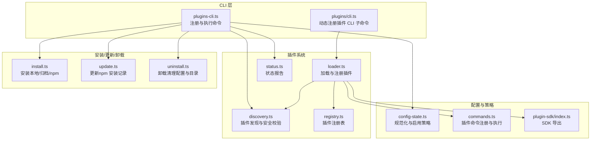

**图表来源**

- [src/cli/plugins-cli.ts:364-800](file://src/cli/plugins-cli.ts#L364-L800)
- [src/plugins/cli.ts:11-60](file://src/plugins/cli.ts#L11-L60)
- [src/plugins/discovery.ts:618-712](file://src/plugins/discovery.ts#L618-L712)
- [src/plugins/loader.ts:447-800](file://src/plugins/loader.ts#L447-L800)
- [src/plugins/install.ts:1-573](file://src/plugins/install.ts#L1-L573)
- [src/plugins/update.ts:197-501](file://src/plugins/update.ts#L197-L501)
- [src/plugins/uninstall.ts:177-238](file://src/plugins/uninstall.ts#L177-L238)
- [src/plugins/config-state.ts:90-287](file://src/plugins/config-state.ts#L90-L287)
- [src/plugins/commands.ts:1-349](file://src/plugins/commands.ts#L1-L349)
- [src/plugin-sdk/index.ts:1-826](file://src/plugin-sdk/index.ts#L1-L826)

**章节来源**

- [src/cli/plugins-cli.ts:364-800](file://src/cli/plugins-cli.ts#L364-L800)
- [src/plugins/discovery.ts:618-712](file://src/plugins/discovery.ts#L618-L712)
- [src/plugins/loader.ts:447-800](file://src/plugins/loader.ts#L447-L800)
- [src/plugins/install.ts:1-573](file://src/plugins/install.ts#L1-L573)
- [src/plugins/update.ts:197-501](file://src/plugins/update.ts#L197-L501)
- [src/plugins/uninstall.ts:177-238](file://src/plugins/uninstall.ts#L177-L238)
- [src/plugins/config-state.ts:90-287](file://src/plugins/config-state.ts#L90-L287)
- [src/plugins/commands.ts:1-349](file://src/plugins/commands.ts#L1-L349)
- [src/plugin-sdk/index.ts:1-826](file://src/plugin-sdk/index.ts#L1-L826)

## 核心组件

- 插件 CLI 命令注册与执行：提供 list/info/enable/disable/install/uninstall/update/doctor 等命令，并在运行时动态注册插件自定义 CLI 子命令。
- 插件发现与加载：扫描工作区、捆绑与全局扩展目录，进行路径安全校验、清单读取与注册。
- 安装/更新/卸载：支持本地路径、归档包与 npm 规范包；对 npm 安装记录进行完整性校验与更新；卸载时清理配置与可选删除目录。
- 配置状态与策略：规范化 plugins.\* 配置，实现允许/拒绝列表、加载路径、槽位选择（如 memory）与默认行为。
- 插件命令系统：提供插件自定义命令注册、匹配、鉴权与执行，含参数清洗与错误处理。
- 插件 SDK：导出插件开发所需的类型、HTTP 路由注册、运行时、日志、Webhook、安全与工具集。

**章节来源**

- [src/cli/plugins-cli.ts:364-800](file://src/cli/plugins-cli.ts#L364-L800)
- [src/plugins/cli.ts:11-60](file://src/plugins/cli.ts#L11-L60)
- [src/plugins/discovery.ts:618-712](file://src/plugins/discovery.ts#L618-L712)
- [src/plugins/loader.ts:447-800](file://src/plugins/loader.ts#L447-L800)
- [src/plugins/install.ts:1-573](file://src/plugins/install.ts#L1-L573)
- [src/plugins/update.ts:197-501](file://src/plugins/update.ts#L197-L501)
- [src/plugins/uninstall.ts:177-238](file://src/plugins/uninstall.ts#L177-L238)
- [src/plugins/config-state.ts:90-287](file://src/plugins/config-state.ts#L90-L287)
- [src/plugins/commands.ts:1-349](file://src/plugins/commands.ts#L1-L349)
- [src/plugin-sdk/index.ts:1-826](file://src/plugin-sdk/index.ts#L1-L826)

## 架构总览

下图展示从 CLI 到插件加载与状态报告的整体流程：

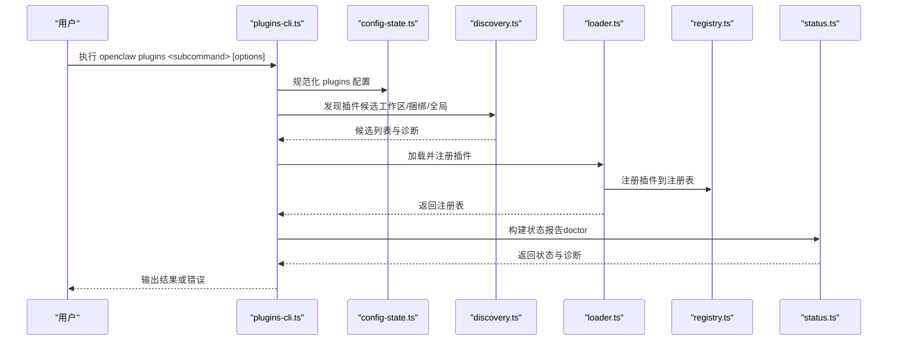

**图表来源**

- [src/cli/plugins-cli.ts:364-800](file://src/cli/plugins-cli.ts#L364-L800)
- [src/plugins/config-state.ts:90-287](file://src/plugins/config-state.ts#L90-L287)
- [src/plugins/discovery.ts:618-712](file://src/plugins/discovery.ts#L618-L712)
- [src/plugins/loader.ts:447-800](file://src/plugins/loader.ts#L447-L800)
- [src/plugins/status.ts:15-36](file://src/plugins/status.ts#L15-L36)

## 详细组件分析

### CLI 命令与交互流程

- list/info/enable/disable/uninstall/install/update/doctor：分别对应列举、查看详情、启用、禁用、卸载、安装、更新与诊断。
- 动态 CLI 注册：插件可在注册阶段向主 CLI 注册子命令，避免冲突并记录失败原因。

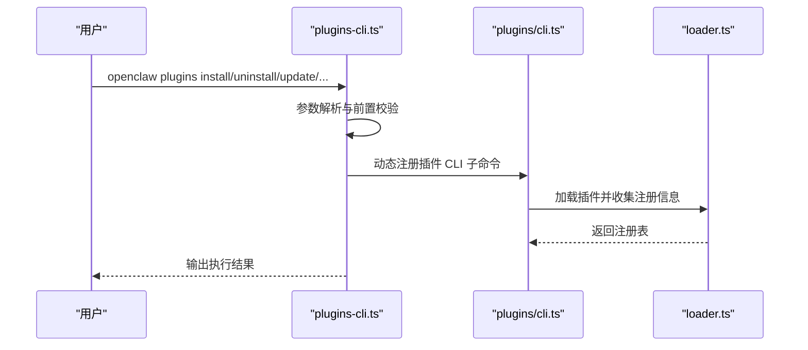

**图表来源**

- [src/cli/plugins-cli.ts:364-800](file://src/cli/plugins-cli.ts#L364-L800)
- [src/plugins/cli.ts:11-60](file://src/plugins/cli.ts#L11-L60)
- [src/plugins/loader.ts:447-800](file://src/plugins/loader.ts#L447-L800)

**章节来源**

- [src/cli/plugins-cli.ts:364-800](file://src/cli/plugins-cli.ts#L364-L800)
- [src/plugins/cli.ts:11-60](file://src/plugins/cli.ts#L11-L60)

### 插件发现与安全校验

- 发现范围：额外路径、工作区 .openclaw/extensions、捆绑插件目录、全局配置 extensions。
- 安全校验：禁止源逃逸根目录、禁止世界可写、检测可疑属主；硬链接拒绝（非捆绑）。
- 清单与入口：优先使用 package.json 的 openclaw.extensions；否则扫描常见入口文件。

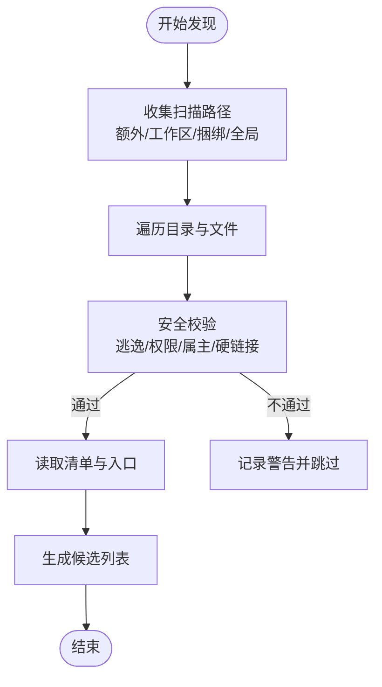

**图表来源**

- [src/plugins/discovery.ts:618-712](file://src/plugins/discovery.ts#L618-L712)

**章节来源**

- [src/plugins/discovery.ts:618-712](file://src/plugins/discovery.ts#L618-L712)

### 插件加载与注册

- 按策略启用：plugins.enabled、allow/deny、槽位选择（如 memory）、捆绑插件默认启用集合。
- 清单校验：必须存在且可通过 JSON Schema 校验；缺失或非法将阻断加载。
- 注册过程：JITI 动态加载、导出校验、API 创建、调用 register 并记录注册表与诊断。

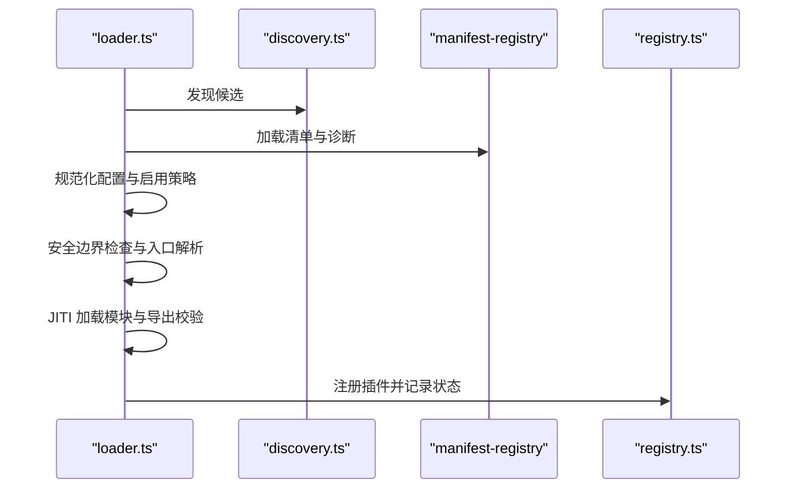

**图表来源**

- [src/plugins/loader.ts:447-800](file://src/plugins/loader.ts#L447-L800)
- [src/plugins/discovery.ts:618-712](file://src/plugins/discovery.ts#L618-L712)

**章节来源**

- [src/plugins/loader.ts:447-800](file://src/plugins/loader.ts#L447-L800)
- [src/plugins/config-state.ts:90-287](file://src/plugins/config-state.ts#L90-L287)

### 安装流程（本地/归档/npm）

- 本地路径：支持目录、归档（zip/tgz/tar/tar.gz）与单文件 JS/TS；归档自动解压后复制。
- npm 安装：仅接受注册表规范包名与精确版本或 dist-tag；支持 --pin 记录解析后的精确 spec；下载前完整性校验。
- 安全扫描：对插件源进行危险模式扫描，告警但不阻止安装；建议后续运行深度安全审计。

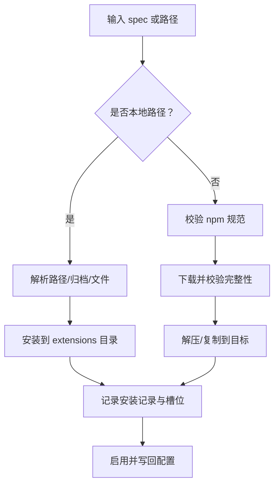

**图表来源**

- [src/plugins/install.ts:1-573](file://src/plugins/install.ts#L1-L573)
- [src/plugins/update.ts:197-501](file://src/plugins/update.ts#L197-L501)

**章节来源**

- [src/plugins/install.ts:1-573](file://src/plugins/install.ts#L1-L573)
- [src/plugins/update.ts:197-501](file://src/plugins/update.ts#L197-L501)

### 更新流程（npm 安装记录）

- 仅针对 plugins.installs 中记录的 npm 安装进行更新。
- 支持干跑（dry-run）预检；遇到完整性漂移（integrity drift）时提示确认或自动通过（CI 可用 --yes）。
- 更新成功后写回最新版本与解析字段。

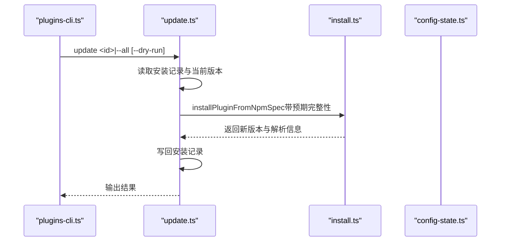

**图表来源**

- [src/cli/plugins-cli.ts:729-790](file://src/cli/plugins-cli.ts#L729-L790)
- [src/plugins/update.ts:197-501](file://src/plugins/update.ts#L197-L501)
- [src/plugins/install.ts:487-539](file://src/plugins/install.ts#L487-L539)

**章节来源**

- [src/cli/plugins-cli.ts:729-790](file://src/cli/plugins-cli.ts#L729-L790)
- [src/plugins/update.ts:197-501](file://src/plugins/update.ts#L197-L501)

### 卸载流程

- 清理配置：移除 entries、installs、allow、load.paths、slots.memory。
- 删除目录：仅对非链接（source !== "path"）且安全路径进行递归删除；失败仅产生警告。
- 重置槽位：若被卸载插件占用了 memory 槽位，恢复为默认值。

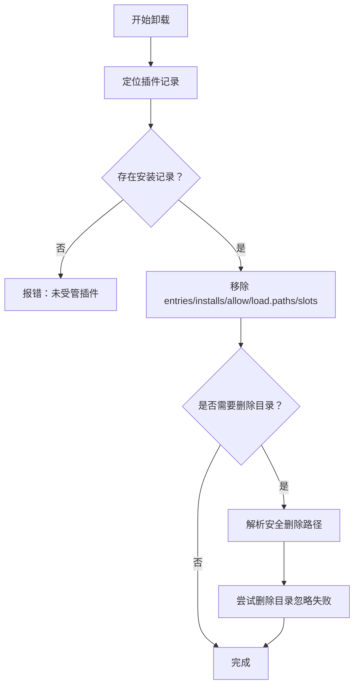

**图表来源**

- [src/plugins/uninstall.ts:177-238](file://src/plugins/uninstall.ts#L177-L238)

**章节来源**

- [src/plugins/uninstall.ts:177-238](file://src/plugins/uninstall.ts#L177-L238)

### 插件命令系统

- 命令注册：插件可注册自定义命令，名称需符合规则且不可与内置命令冲突。
- 匹配与执行：支持参数提取与清洗；可要求授权；执行期间锁定注册表防止并发修改。
- 列表输出：用于帮助与命令列表展示。

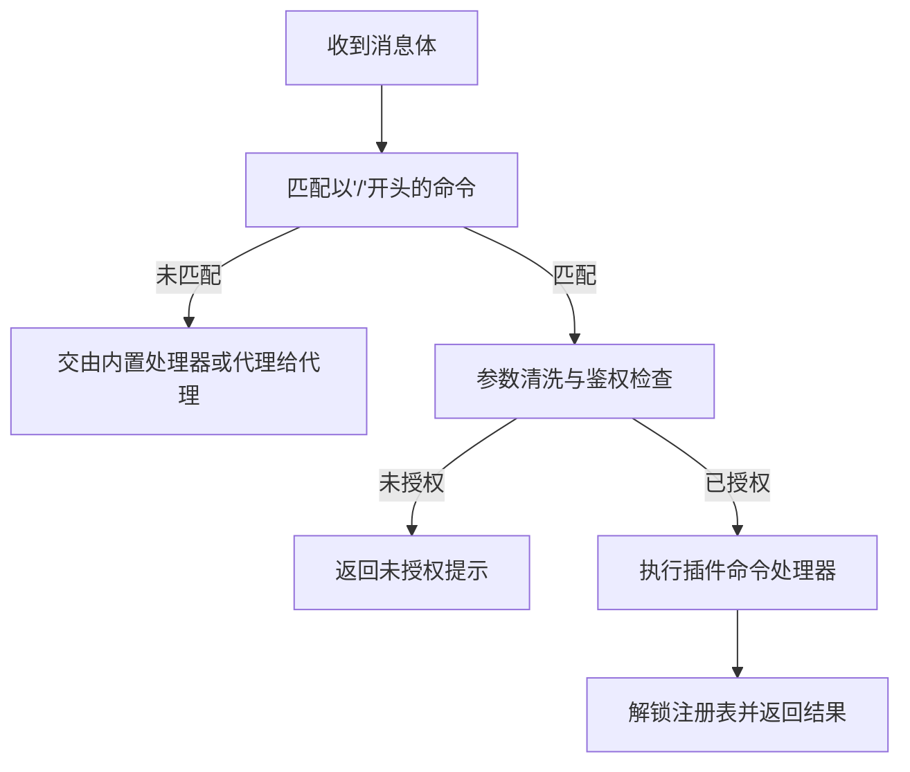

**图表来源**

- [src/plugins/commands.ts:183-301](file://src/plugins/commands.ts#L183-L301)

**章节来源**

- [src/plugins/commands.ts:1-349](file://src/plugins/commands.ts#L1-L349)

### 插件清单与配置验证

- 必填清单字段：id、configSchema（即使空也必须存在）。
- 可选字段：kind、channels、providers、skills、name、description、uiHints、version。
- 验证行为：未知 channels._ 键为错误；plugins._ 引用未知 id 为错误；禁用插件保留配置并告警。

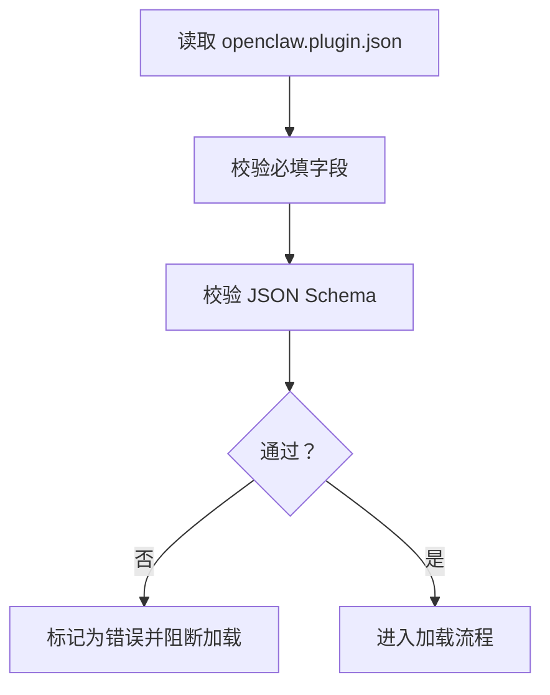

**图表来源**

- [docs/plugins/manifest.md:18-76](file://docs/plugins/manifest.md#L18-L76)

**章节来源**

- [docs/plugins/manifest.md:1-76](file://docs/plugins/manifest.md#L1-L76)

### 插件开发工具、测试与发布

- 开发工具：JITI 动态加载、别名映射（openclaw/plugin-sdk/\*）、边界文件读取与安全校验。
- 测试：单元测试与端到端测试，测试环境默认关闭插件以减少依赖；提供测试专用默认内存槽位禁用策略。
- 发布：npm 包需满足 openclaw.extensions 字段；建议固定版本（--pin）并进行完整性校验。

**章节来源**

- [src/plugins/loader.ts:539-558](file://src/plugins/loader.ts#L539-L558)
- [src/plugins/install.ts:100-129](file://src/plugins/install.ts#L100-L129)
- [src/plugins/config-state.ts:137-187](file://src/plugins/config-state.ts#L137-L187)

## 依赖关系分析

- CLI 对安装/更新/卸载与状态报告有直接依赖。
- 加载器依赖发现、清单注册表、配置状态与命令系统。
- 安装/更新/卸载依赖安全扫描、安装流与 npm 解析工具。
- 插件 SDK 提供统一 API，贯穿注册、HTTP 路由、运行时与工具集。

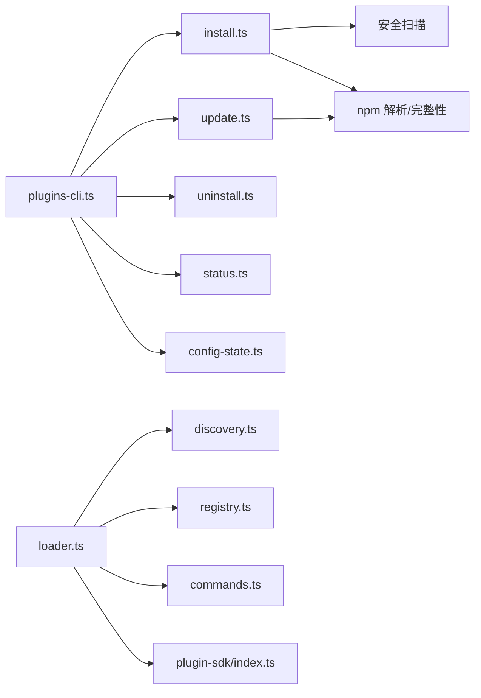

**图表来源**

- [src/cli/plugins-cli.ts:364-800](file://src/cli/plugins-cli.ts#L364-L800)
- [src/plugins/loader.ts:447-800](file://src/plugins/loader.ts#L447-L800)
- [src/plugins/install.ts:1-573](file://src/plugins/install.ts#L1-L573)
- [src/plugins/update.ts:197-501](file://src/plugins/update.ts#L197-L501)
- [src/plugins/uninstall.ts:177-238](file://src/plugins/uninstall.ts#L177-L238)
- [src/plugins/config-state.ts:90-287](file://src/plugins/config-state.ts#L90-L287)
- [src/plugins/commands.ts:1-349](file://src/plugins/commands.ts#L1-L349)
- [src/plugin-sdk/index.ts:1-826](file://src/plugin-sdk/index.ts#L1-L826)

**章节来源**

- [src/cli/plugins-cli.ts:364-800](file://src/cli/plugins-cli.ts#L364-L800)
- [src/plugins/loader.ts:447-800](file://src/plugins/loader.ts#L447-L800)

## 性能考量

- 发现缓存：插件发现支持短 TTL 缓存，降低启动时重复扫描成本。
- 延迟初始化：运行时与通道依赖按需创建，避免无用依赖加载。
- 干跑更新：支持 dry-run 预检，减少不必要的网络与磁盘操作。
- 命令执行锁：在命令执行期间锁定注册表，避免并发修改带来的额外开销与竞态。

**章节来源**

- [src/plugins/discovery.ts:41-84](file://src/plugins/discovery.ts#L41-L84)
- [src/plugins/loader.ts:472-502](file://src/plugins/loader.ts#L472-L502)
- [src/plugins/update.ts:263-322](file://src/plugins/update.ts#L263-L322)
- [src/plugins/commands.ts:23-25](file://src/plugins/commands.ts#L23-L25)

## 故障排查指南

- doctor 命令：汇总插件错误与诊断信息，无问题时提示“未检测到插件问题”。
- 常见错误：
  - 清单缺失或非法：阻断加载并报错。
  - 权限问题：世界可写、属主异常、源逃逸根目录等会被记录为警告并跳过。
  - 安装失败：npm 包不存在、缺少 openclaw.extensions、插件 id 不匹配等。
  - 更新完整性漂移：提示实际与期望的完整性差异，必要时确认继续。
- 建议：
  - 使用 --pin 固定 npm 版本。
  - 运行安全审计（security audit）检查可疑代码模式。
  - 在 CI 中使用 --yes 跳过交互确认。

**章节来源**

- [src/cli/plugins-cli.ts:791-800](file://src/cli/plugins-cli.ts#L791-L800)
- [src/plugins/install.ts:48-74](file://src/plugins/install.ts#L48-L74)
- [src/plugins/update.ts:171-195](file://src/plugins/update.ts#L171-L195)

## 结论

OpenClaw 的插件管理命令提供了从安装、更新到卸载与诊断的完整闭环，结合严格的清单校验、安全扫描与发现缓存，在保证安全性的同时提升了可用性。通过插件命令系统与 SDK，开发者可以快速构建并集成插件功能，配合测试与发布流程确保质量与稳定性。

## 附录

- 命令速查与安全提示参见 CLI 文档与插件清单文档。
- 插件 SDK 导出广泛能力，便于插件作者进行路由、运行时、日志与安全相关开发。

**章节来源**

- [docs/cli/plugins.md:1-103](file://docs/cli/plugins.md#L1-L103)
- [docs/plugins/manifest.md:1-76](file://docs/plugins/manifest.md#L1-L76)
- [src/plugin-sdk/index.ts:1-826](file://src/plugin-sdk/index.ts#L1-L826)
