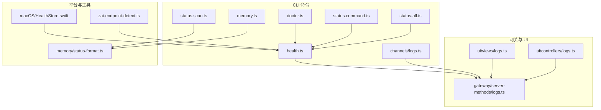
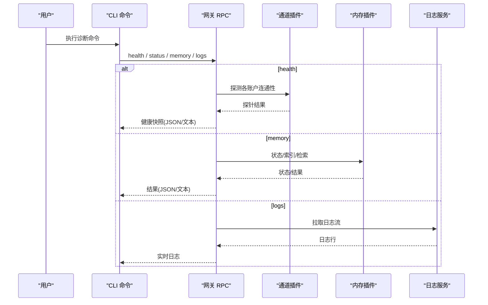
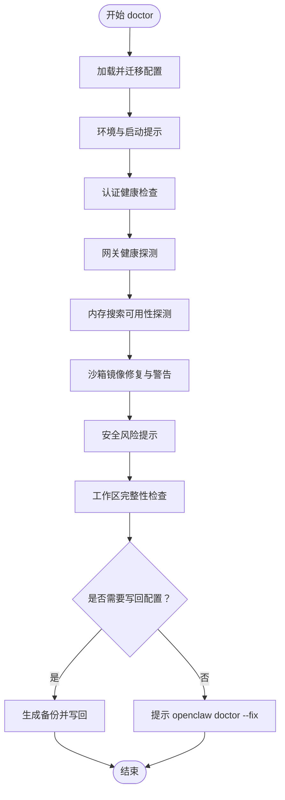
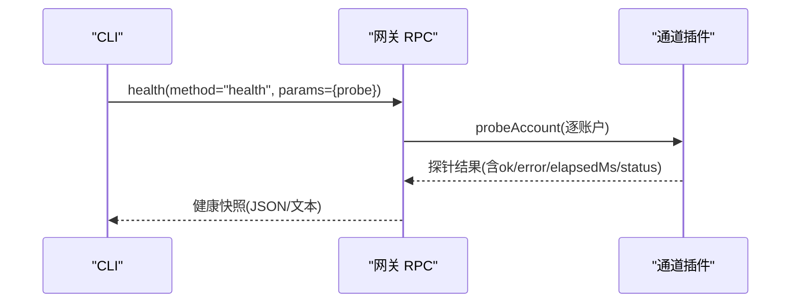
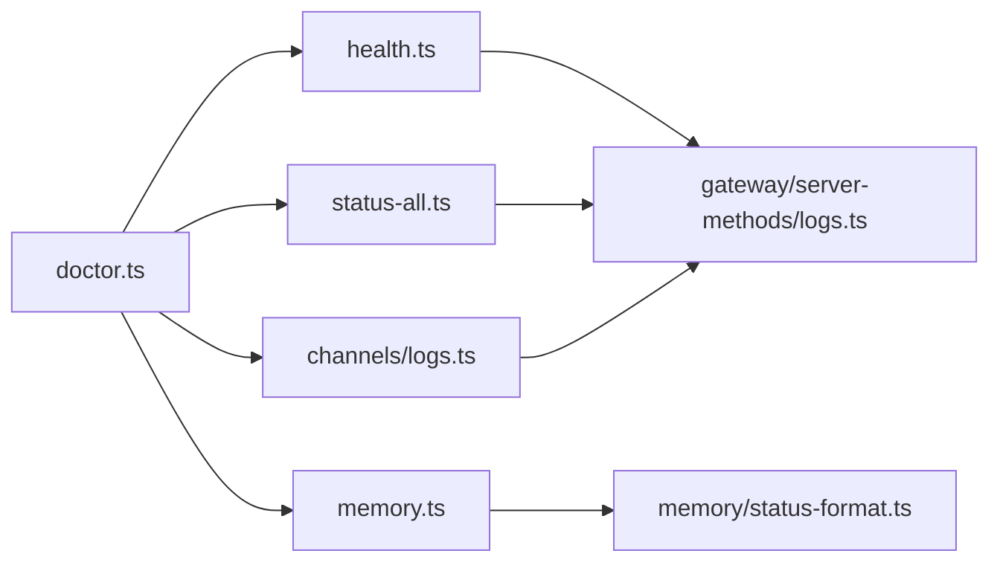

# 系统诊断命令

<cite>
**本文引用的文件**
- [doctor.ts](file://src/commands/doctor.ts)
- [health.ts](file://src/commands/health.ts)
- [status.command.ts](file://src/commands/status.command.ts)
- [status-all.ts](file://src/commands/status-all.ts)
- [status.scan.ts](file://src/commands/status.scan.ts)
- [memory.ts](file://src/commands/memory.ts)
- [logs.ts](file://src/commands/channels/logs.ts)
- [logs.ts（网关）](file://src/gateway/server-methods/logs.ts)
- [logs.ts（UI 视图）](file://src/ui/src/ui/views/logs.ts)
- [logs.ts（UI 控制器）](file://src/ui/src/ui/controllers/logs.ts)
- [doctor.md](file://docs/cli/doctor.md)
- [health.md](file://docs/cli/health.md)
- [logs.md](file://docs/cli/logs.md)
- [memory.md](file://docs/cli/memory.md)
- [status.md](file://docs/cli/status.md)
- [status-all.md](file://docs/cli/status-all.md)
- [status-scan.md](file://docs/cli/status-scan.md)
- [status-all.ts](file://src/commands/status-all.ts)
- [status-all.ts（macOS 健康存储）](file://apps/macos/Sources/OpenClaw/HealthStore.swift)
- [zai-endpoint-detect.ts](file://src/commands/zai-endpoint-detect.ts)
- [status-format.ts](file://src/memory/status-format.ts)
- [pi-embedded-error-observation.test.ts](file://src/agents/pi-embedded-error-observation.test.ts)
</cite>

## 目录

1. [简介](#简介)
2. [项目结构](#项目结构)
3. [核心组件](#核心组件)
4. [架构总览](#架构总览)
5. [详细组件分析](#详细组件分析)
6. [依赖关系分析](#依赖关系分析)
7. [性能考量](#性能考量)
8. [故障排查指南](#故障排查指南)
9. [结论](#结论)
10. [附录](#附录)

## 简介

本文件系统化梳理与“系统诊断命令”相关的 CLI 能力，覆盖系统健康检查、日志管理、内存监控与性能诊断，并提供使用方法、输出格式与结果解读、常见问题的自动检测与修复建议，以及系统资源监控、网络连通性测试与第三方服务健康检查、日志分析与性能瓶颈定位技巧。

## 项目结构

围绕诊断能力的关键目录与文件：

- CLI 命令实现：src/commands 下的 doctor、health、status、memory、logs 等
- 文档：docs/cli 下的 doctor、health、logs、memory、status、status-all、status-scan 等
- 网关侧日志 RPC：src/gateway/server-methods/logs.ts
- UI 日志视图与控制器：ui/src/ui/views/logs.ts、ui/src/ui/controllers/logs.ts
- 平台特定健康存储：apps/macos/Sources/OpenClaw/HealthStore.swift
- 内存状态解析：src/memory/status-format.ts
- 第三方端点探测：src/commands/zai-endpoint-detect.ts
- 错误观察与脱敏：src/agents/pi-embedded-error-observation.test.ts

**图表来源**

- [doctor.ts:1-370](file://src/commands/doctor.ts#L1-L370)
- [health.ts:1-752](file://src/commands/health.ts#L1-L752)
- [status.command.ts:318-613](file://src/commands/status.command.ts#L318-L613)
- [status-all.ts:170-202](file://src/commands/status-all.ts#L170-L202)
- [status.scan.ts:157-180](file://src/commands/status.scan.ts#L157-L180)
- [memory.ts](file://src/commands/memory.ts)
- [logs.ts](file://src/commands/channels/logs.ts)
- [logs.ts（网关）](file://src/gateway/server-methods/logs.ts)
- [logs.ts（UI 视图）](file://src/ui/src/ui/views/logs.ts)
- [logs.ts（UI 控制器）](file://src/ui/src/ui/controllers/logs.ts)
- [status-all.ts（macOS 健康存储）:147-163](file://apps/macos/Sources/OpenClaw/HealthStore.swift#L147-L163)
- [status-format.ts:1-45](file://src/memory/status-format.ts#L1-L45)
- [zai-endpoint-detect.ts:57-99](file://src/commands/zai-endpoint-detect.ts#L57-L99)

**章节来源**

- [doctor.ts:1-370](file://src/commands/doctor.ts#L1-L370)
- [health.ts:1-752](file://src/commands/health.ts#L1-L752)
- [status.command.ts:318-613](file://src/commands/status.command.ts#L318-L613)
- [status-all.ts:170-202](file://src/commands/status-all.ts#L170-L202)
- [status.scan.ts:157-180](file://src/commands/status.scan.ts#L157-L180)
- [memory.ts](file://src/commands/memory.ts)
- [logs.ts](file://src/commands/channels/logs.ts)
- [logs.ts（网关）](file://src/gateway/server-methods/logs.ts)
- [logs.ts（UI 视图）](file://src/ui/src/ui/views/logs.ts)
- [logs.ts（UI 控制器）](file://src/ui/src/ui/controllers/logs.ts)
- [status-all.ts（macOS 健康存储）:147-163](file://apps/macos/Sources/OpenClaw/HealthStore.swift#L147-L163)
- [status-format.ts:1-45](file://src/memory/status-format.ts#L1-L45)
- [zai-endpoint-detect.ts:57-99](file://src/commands/zai-endpoint-detect.ts#L57-L99)

## 核心组件

- doctor：综合健康检查与快速修复，自动扫描配置、认证、网关、内存搜索、沙箱、安全与工作区状态，支持交互式修复与非交互模式。
- health：查询运行中网关的健康快照，支持深度探测（per-account 探针）、JSON 输出与详细展示。
- status/status-all/status-scan：系统状态概览、远程连接与网关可达性探测、内存搜索状态快照。
- memory：语义记忆索引与检索、状态检查（含向量/嵌入可用性探测）。
- logs：通过 RPC 实时抓取网关日志，支持 follow、limit、本地时间显示、JSON 行输出。

**章节来源**

- [doctor.md:1-46](file://docs/cli/doctor.md#L1-L46)
- [health.md:1-22](file://docs/cli/health.md#L1-L22)
- [logs.md:1-29](file://docs/cli/logs.md#L1-L29)
- [memory.md:1-67](file://docs/cli/memory.md#L1-L67)
- [status.md](file://docs/cli/status.md)
- [status-all.md](file://docs/cli/status-all.md)
- [status-scan.md](file://docs/cli/status-scan.md)

## 架构总览

诊断命令通过 CLI 调用网关 RPC 或直接执行本地检查，形成“CLI → 网关/RPC → 插件/通道/内存/会话”的数据流。

**图表来源**

- [health.ts:525-751](file://src/commands/health.ts#L525-L751)
- [status.command.ts:318-613](file://src/commands/status.command.ts#L318-L613)
- [status-all.ts:170-202](file://src/commands/status-all.ts#L170-L202)
- [logs.ts（网关）](file://src/gateway/server-methods/logs.ts)
- [memory.ts](file://src/commands/memory.ts)

## 详细组件分析

### doctor：系统健康检查与自动修复

- 功能要点
  - 更新提示、安装/环境/启动优化提示、配置迁移与清理
  - 网关健康探测、内存搜索可用性探测、网关服务配置修复
  - 认证配置健康检查（含 OAuth/TLS 预检）、沙箱镜像修复与警告
  - 安全风险提示、工作区完整性检查、会话锁健康检查
  - 非交互模式下跳过交互式提示；可生成备份并写回配置
- 使用示例
  - openclaw doctor
  - openclaw doctor --repair
  - openclaw doctor --deep
- 输出与结果解读
  - 分类输出：Gateway、Gateway auth、Hooks、Workspace、Security 等
  - 建议修复项与操作指引；必要时提示生成备份路径
- 自动修复建议
  - 生成网关 token、修复旧版 cron 存储、修复沙箱镜像、设置 systemd linger（Linux）
  - 识别 launchctl 环境变量覆盖导致的鉴权失败

**图表来源**

- [doctor.ts:73-370](file://src/commands/doctor.ts#L73-L370)
- [doctor.md:1-46](file://docs/cli/doctor.md#L1-L46)

**章节来源**

- [doctor.ts:1-370](file://src/commands/doctor.ts#L1-L370)
- [doctor.md:1-46](file://docs/cli/doctor.md#L1-L46)

### health：网关健康快照

- 功能要点
  - 查询运行中网关健康；支持 --verbose 进行 per-account 探针
  - 输出通道链路状态、心跳间隔、会话存储信息
  - 支持 --json 输出结构化 JSON
- 使用示例
  - openclaw health
  - openclaw health --json
  - openclaw health --verbose
- 输出格式
  - 文本：通道名称、状态（linked/configured/failed/ok）、探针耗时、失败原因
  - JSON：包含 ok/ts/durationMs/channels/channelOrder/channelLabels/agents/sessions 等字段
- 结果解读
  - ok=true 表示 RPC 成功；通道失败不影响整体成功
  - 失败可能由未配置、鉴权失败、超时或第三方服务不可达引起

**图表来源**

- [health.ts:525-751](file://src/commands/health.ts#L525-L751)

**章节来源**

- [health.ts:1-752](file://src/commands/health.ts#L1-L752)
- [health.md:1-22](file://docs/cli/health.md#L1-L22)

### status/status-all：系统状态与远程连接

- 功能要点
  - status：本地/远程模式下的健康摘要、队列事件、网关可达性、最近心跳
  - status-all：远程模式下自动探测 gateway.remote.url 缺失场景，给出修复建议
- 使用示例
  - openclaw status
  - openclaw status-all
  - openclaw status-all --timeout 8000
- 输出与结果解读
  - 网关模式、目标地址、绑定模式、本地回退地址
  - 健康探测耗时、错误信息（如 gateway unreachable）

**章节来源**

- [status.command.ts:318-613](file://src/commands/status.command.ts#L318-L613)
- [status-all.ts:170-202](file://src/commands/status-all.ts#L170-L202)
- [status-all.md](file://docs/cli/status-all.md)

### status-scan：内存搜索状态快照

- 功能要点
  - 在启用 memory-core 且 slot 正确时，探测向量可用性，返回内存状态快照
  - 用于诊断内存搜索是否可用、缓存状态、FTS 状态
- 使用示例
  - openclaw memory status --deep
  - openclaw memory status --deep --index
- 输出与结果解读
  - 向量状态（ready/unavailable/disabled/unknown）
  - FTS 状态（ready/unavailable/disabled）
  - 缓存开关与条目数

**章节来源**

- [status.scan.ts:157-180](file://src/commands/status.scan.ts#L157-L180)
- [status-format.ts:1-45](file://src/memory/status-format.ts#L1-L45)
- [status-scan.md](file://docs/cli/status-scan.md)

### memory：语义记忆索引/检索/状态

- 功能要点
  - memory status：查看向量/嵌入可用性、缓存、FTS 状态
  - memory index：强制重索引、按代理作用域运行
  - memory search：查询、限制结果数、最小分数过滤
- 使用示例
  - openclaw memory status
  - openclaw memory index --force
  - openclaw memory search "meeting notes" --max-results 20
- 输出与结果解读
  - JSON 模式下输出结构化结果
  - 非法参数组合会报错（如未提供查询）

**章节来源**

- [memory.md:1-67](file://docs/cli/memory.md#L1-L67)
- [memory.ts](file://src/commands/memory.ts)

### logs：远程日志跟踪

- 功能要点
  - openclaw logs：远程尾随网关日志（支持 follow、limit、--json、--local-time）
  - UI 日志视图与控制器同样基于网关日志 RPC
- 使用示例
  - openclaw logs
  - openclaw logs --follow --limit 500 --json
- 输出与结果解读
  - JSON 行：便于工具链消费
  - 本地时间戳：--local-time

**章节来源**

- [logs.md:1-29](file://docs/cli/logs.md#L1-L29)
- [logs.ts](file://src/commands/channels/logs.ts)
- [logs.ts（网关）](file://src/gateway/server-methods/logs.ts)
- [logs.ts（UI 视图）](file://src/ui/src/ui/views/logs.ts)
- [logs.ts（UI 控制器）](file://src/ui/src/ui/controllers/logs.ts)

### 第三方服务健康检查与自动检测

- 端点探测
  - detectZaiEndpoint：对指定 API Key 的端点进行探测，提取错误码与消息
- 使用建议
  - 在 doctor 或自定义脚本中调用，结合 --repair 自动修复鉴权/配额/网络问题

**章节来源**

- [zai-endpoint-detect.ts:57-99](file://src/commands/zai-endpoint-detect.ts#L57-L99)

## 依赖关系分析

- doctor 依赖 health/status/memory/logs 等命令与网关 RPC
- health 依赖通道插件的 probeAccount 与状态汇总
- status-all 依赖网关连接细节与远程 URL 解析
- memory 依赖内存插件的状态解析与格式化
- logs 依赖网关日志 RPC 与 UI 日志视图/控制器

**图表来源**

- [doctor.ts:1-370](file://src/commands/doctor.ts#L1-L370)
- [health.ts:1-752](file://src/commands/health.ts#L1-L752)
- [status-all.ts:170-202](file://src/commands/status-all.ts#L170-L202)
- [memory.ts](file://src/commands/memory.ts)
- [logs.ts](file://src/commands/channels/logs.ts)
- [logs.ts（网关）](file://src/gateway/server-methods/logs.ts)
- [status-format.ts:1-45](file://src/memory/status-format.ts#L1-L45)

**章节来源**

- [doctor.ts:1-370](file://src/commands/doctor.ts#L1-L370)
- [health.ts:1-752](file://src/commands/health.ts#L1-L752)
- [status-all.ts:170-202](file://src/commands/status-all.ts#L170-L202)
- [memory.ts](file://src/commands/memory.ts)
- [logs.ts](file://src/commands/channels/logs.ts)
- [logs.ts（网关）](file://src/gateway/server-methods/logs.ts)
- [status-format.ts:1-45](file://src/memory/status-format.ts#L1-L45)

## 性能考量

- 健康探测默认超时上限为 10 秒，可通过 --timeoutMs 调整
- --verbose 会触发 per-account 探针，增加网络往返与处理开销
- memory index --force 与 --deep 可能产生大量 IO 与网络请求，建议在维护窗口执行
- logs --follow 会持续拉取日志，注意带宽与磁盘占用

[本节为通用指导，不直接分析具体文件]

## 故障排查指南

- 网络与鉴权
  - doctor 提示 launchctl 环境变量覆盖导致的鉴权失败，需 unset 对应变量
  - status-all 在远程模式下缺失 gateway.remote.url 时，给出修复建议（设置 remote.url 或改为 local 模式）
- 通道健康
  - health 输出中的 failed(status) 与 error 字段可用于定位第三方服务异常或超时
  - macOS 健康存储将超时与无状态视为超时失败，辅助定位网络/服务问题
- 内存搜索
  - status-scan 返回 unavailable/disabled/unknown 时，优先检查向量/嵌入可用性与缓存状态
- 日志分析
  - 使用 logs --json 与 --local-time，结合错误上下文字段（如 requestId、HTTP 状态）进行追踪
  - 对于敏感信息，确保已启用脱敏策略（见错误观察测试用例）

**章节来源**

- [doctor.md:35-45](file://docs/cli/doctor.md#L35-L45)
- [status-all.ts:170-202](file://src/commands/status-all.ts#L170-L202)
- [health.ts:175-220](file://src/commands/health.ts#L175-L220)
- [status-all.ts（macOS 健康存储）:147-163](file://apps/macos/Sources/OpenClaw/HealthStore.swift#L147-L163)
- [status-format.ts:1-45](file://src/memory/status-format.ts#L1-L45)
- [pi-embedded-error-observation.test.ts:133-163](file://src/agents/pi-embedded-error-observation.test.ts#L133-L163)

## 结论

通过 doctor、health、status/status-all/status-scan、memory、logs 等命令，可构建从系统健康、通道连通性、内存可用性到日志实时观测的完整诊断闭环。建议在日常运维中定期执行 doctor 与 health，结合 logs 进行问题复现与回归验证，并在变更后使用 status-scan 与 memory 确认语义记忆可用性。

[本节为总结，不直接分析具体文件]

## 附录

- 常用命令速查
  - openclaw doctor [--repair] [--deep]
  - openclaw health [--json] [--verbose]
  - openclaw status
  - openclaw status-all [--timeout <ms>]
  - openclaw memory status [--deep] [--index] [--json]
  - openclaw memory index [--force] [--agent <id>] [--verbose]
  - openclaw memory search "<query>" [--max-results <n>] [--min-score <s>] [--agent <id>] [--json]
  - openclaw logs [--follow] [--limit <n>] [--json] [--local-time]

[本节为参考清单，不直接分析具体文件]
