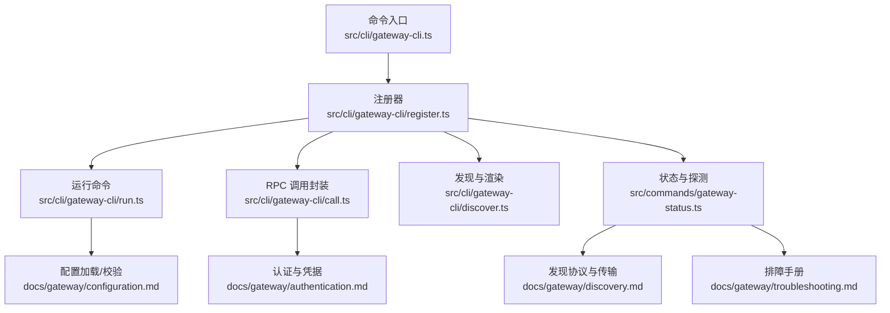
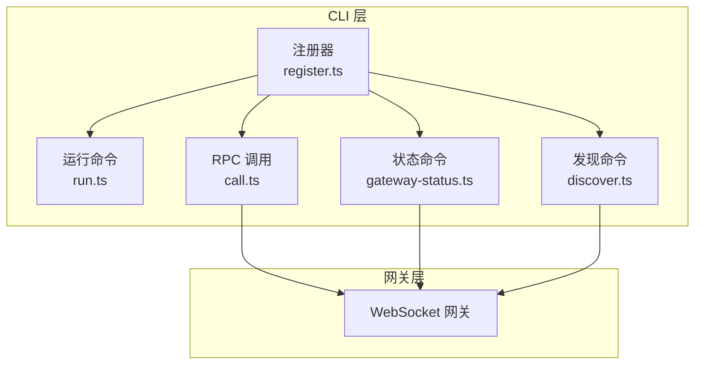
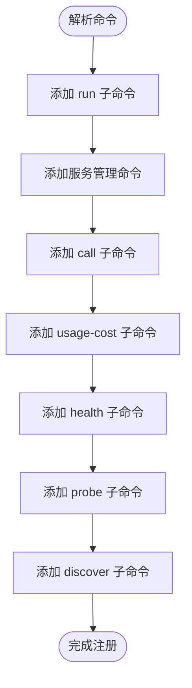
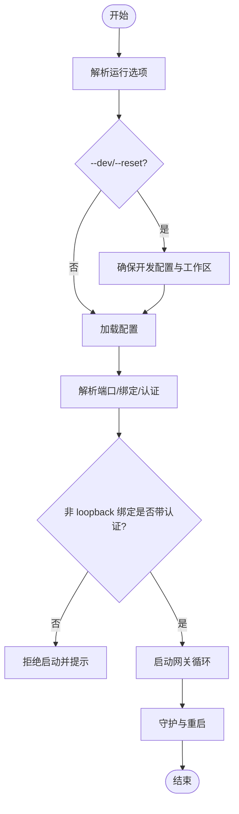
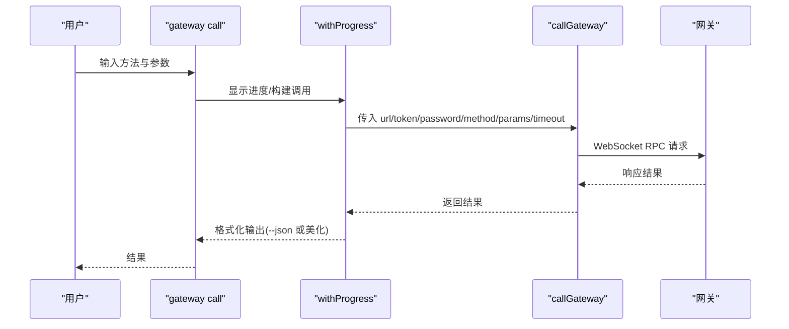
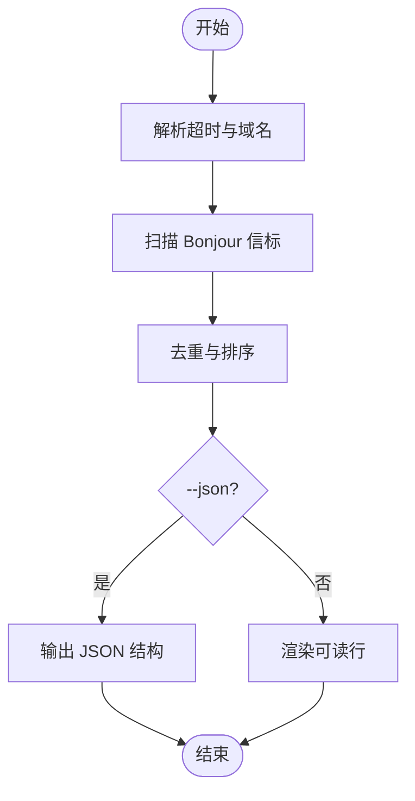
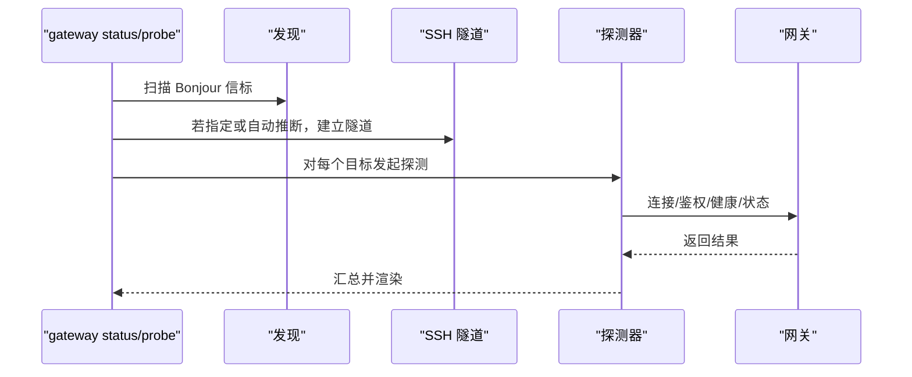
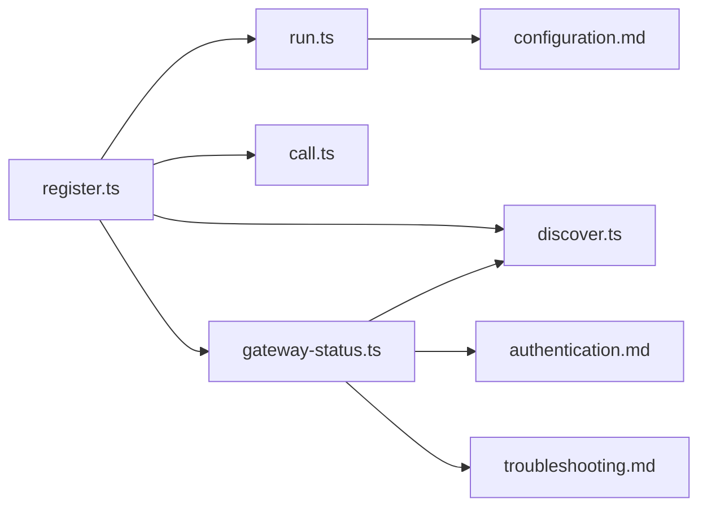

# 网关管理命令

<cite>
**本文引用的文件**
- [gateway-cli.ts](file://src/cli/gateway-cli.ts)
- [register.ts](file://src/cli/gateway-cli/register.ts)
- [run.ts](file://src/cli/gateway-cli/run.ts)
- [call.ts](file://src/cli/gateway-cli/call.ts)
- [discover.ts](file://src/cli/gateway-cli/discover.ts)
- [gateway-status.ts](file://src/commands/gateway-status.ts)
- [gateway.md](file://docs/cli/gateway.md)
- [configuration.md](file://docs/gateway/configuration.md)
- [discovery.md](file://docs/gateway/discovery.md)
- [authentication.md](file://docs/gateway/authentication.md)
- [troubleshooting.md](file://docs/gateway/troubleshooting.md)
- [dev.ts](file://src/cli/gateway-cli/dev.ts)
- [shared.ts](file://src/cli/gateway-cli/shared.ts)
- [daemon-cli.ts](file://src/cli/daemon-cli.ts)
</cite>

## 目录

1. [简介](#简介)
2. [项目结构](#项目结构)
3. [核心组件](#核心组件)
4. [架构总览](#架构总览)
5. [详细组件分析](#详细组件分析)
6. [依赖关系分析](#依赖关系分析)
7. [性能与监控](#性能与监控)
8. [故障排除指南](#故障排除指南)
9. [结论](#结论)
10. [附录：使用示例与最佳实践](#附录使用示例与最佳实践)

## 简介

本文件系统化梳理 openclaw 的网关管理命令（openclaw gateway），覆盖网关启动、发现、调用、服务管理、配置与认证、健康检查、多实例管理、性能监控与调试等全链路能力。目标读者既包括一线运维与开发者，也包括需要通过命令行管理多个网关实例的高级用户。

## 项目结构

- 命令注册入口导出：src/cli/gateway-cli.ts 将注册函数导出给 CLI 主程序。
- 子命令注册与路由：src/cli/gateway-cli/register.ts 定义 gateway 及其子命令（run、status、discover、call、probe、usage-cost）。
- 运行时与生命周期：src/cli/gateway-cli/run.ts 负责解析运行选项、校验绑定与认证、启动网关循环。
- RPC 调用封装：src/cli/gateway-cli/call.ts 提供统一的 WebSocket RPC 调用封装。
- 发现与渲染：src/cli/gateway-cli/discover.ts 负责 Bonjour 广播扫描、去重与输出格式化。
- 状态与探测：src/commands/gateway-status.ts 统一执行服务状态与可达性探测，支持 SSH 隧道与多目标并行探测。
- 文档参考：docs/cli/gateway.md、docs/gateway/configuration.md、docs/gateway/discovery.md、docs/gateway/authentication.md、docs/gateway/troubleshooting.md 提供权威使用说明与排障手册。

**图表来源**

- [gateway-cli.ts:1-2](file://src/cli/gateway-cli.ts#L1-L2)
- [register.ts:89-281](file://src/cli/gateway-cli/register.ts#L89-L281)
- [run.ts:460-509](file://src/cli/gateway-cli/run.ts#L460-L509)
- [call.ts:17-47](file://src/cli/gateway-cli/call.ts#L17-L47)
- [discover.ts:1-112](file://src/cli/gateway-cli/discover.ts#L1-L112)
- [gateway-status.ts:24-367](file://src/commands/gateway-status.ts#L24-L367)
- [configuration.md:1-547](file://docs/gateway/configuration.md#L1-L547)
- [discovery.md:1-124](file://docs/gateway/discovery.md#L1-L124)
- [authentication.md:1-180](file://docs/gateway/authentication.md#L1-L180)
- [troubleshooting.md:1-380](file://docs/gateway/troubleshooting.md#L1-L380)

**章节来源**

- [gateway-cli.ts:1-2](file://src/cli/gateway-cli.ts#L1-L2)
- [register.ts:89-281](file://src/cli/gateway-cli/register.ts#L89-L281)

## 核心组件

- 命令注册器：集中定义 gateway 子命令、共享选项、帮助与示例。
- 运行命令：负责端口/绑定/认证/日志/流式输出等运行期参数解析与安全校验。
- RPC 调用：统一封装 WebSocket RPC 调用，支持超时、最终响应等待、JSON 输出。
- 发现命令：基于 Bonjour 扫描本地与广域发现，去重并渲染可读信息。
- 状态命令：综合服务状态、可达性探测、SSH 隧道、配置摘要与告警。
- 服务管理：install/start/stop/restart/uninstall 与 JSON 输出，便于脚本化。
- 配置与认证：本地/远程模式、SecretRef、环境变量注入、令牌与密码认证。
- 排障与诊断：错误码映射、端口占用诊断、服务停止提示、常见症状排查。

**章节来源**

- [register.ts:114-190](file://src/cli/gateway-cli/register.ts#L114-L190)
- [run.ts:38-83](file://src/cli/gateway-cli/run.ts#L38-L83)
- [call.ts:7-47](file://src/cli/gateway-cli/call.ts#L7-L47)
- [discover.ts:45-112](file://src/cli/gateway-cli/discover.ts#L45-L112)
- [gateway-status.ts:24-367](file://src/commands/gateway-status.ts#L24-L367)
- [configuration.md:1-547](file://docs/gateway/configuration.md#L1-L547)
- [authentication.md:1-180](file://docs/gateway/authentication.md#L1-L180)
- [troubleshooting.md:1-380](file://docs/gateway/troubleshooting.md#L1-L380)

## 架构总览

下图展示 openclaw 网关 CLI 的高层交互：命令注册器将用户输入路由到具体实现；运行命令负责启动与守护；状态命令进行探测与汇总；发现命令负责网络可达性；RPC 调用封装用于直接调用网关方法。

**图表来源**

- [register.ts:89-281](file://src/cli/gateway-cli/register.ts#L89-L281)
- [run.ts:460-509](file://src/cli/gateway-cli/run.ts#L460-L509)
- [discover.ts:210-281](file://src/cli/gateway-cli/discover.ts#L210-L281)
- [gateway-status.ts:24-367](file://src/commands/gateway-status.ts#L24-L367)
- [call.ts:26-47](file://src/cli/gateway-cli/call.ts#L26-L47)

## 详细组件分析

### 命令注册与路由（register.ts）

- 定义 gateway 主命令与子命令：run、status、discover、call、probe、usage-cost。
- 共享选项：为 call/probe/discover 等命令注入通用 RPC/输出/超时等选项。
- 帮助与示例：在命令后追加示例与文档链接，提升可用性。
- 错误处理：统一包装 runGatewayCommand，捕获异常并退出码规范化。

**图表来源**

- [register.ts:89-281](file://src/cli/gateway-cli/register.ts#L89-L281)

**章节来源**

- [register.ts:89-281](file://src/cli/gateway-cli/register.ts#L89-L281)

### 运行命令（run.ts）

- 选项解析与继承：支持父级选项继承、布尔与值型选项合并。
- 模式与安全校验：
  - 绑定模式：loopback、lan、tailnet、auto、custom。
  - 认证模式：none、token、password、trusted-proxy。
  - 非 loopback 绑定必须有共享密钥或可信代理，否则拒绝启动。
- 开发模式：--dev/--reset 自动创建/重置开发配置与工作区。
- 日志与流式输出：控制台时间戳、详细级别、WebSocket 日志样式、原始模型流 jsonl 输出路径。
- 强制端口释放：--force 可尝试终止占用进程并等待端口可绑定。
- 启动循环：runGatewayLoop 负责锁端口、启动服务器、信号处理与重启。

**图表来源**

- [run.ts:160-458](file://src/cli/gateway-cli/run.ts#L160-L458)
- [dev.ts:90-131](file://src/cli/gateway-cli/dev.ts#L90-L131)

**章节来源**

- [run.ts:38-83](file://src/cli/gateway-cli/run.ts#L38-L83)
- [run.ts:139-158](file://src/cli/gateway-cli/run.ts#L139-L158)
- [run.ts:318-412](file://src/cli/gateway-cli/run.ts#L318-L412)
- [dev.ts:90-131](file://src/cli/gateway-cli/dev.ts#L90-L131)

### RPC 调用封装（call.ts）

- 统一选项：url、token、password、timeout、expectFinal、json。
- 调用流程：withProgress 包裹，构造调用参数（含客户端标识与模式），调用 callGateway。
- 返回处理：根据 --json 输出 JSON 或人类可读格式。

**图表来源**

- [call.ts:17-47](file://src/cli/gateway-cli/call.ts#L17-L47)

**章节来源**

- [call.ts:7-47](file://src/cli/gateway-cli/call.ts#L7-L47)

### 发现命令（discover.ts + register.ts）

- 扫描策略：本地 local. 与可选广域域名（Wide-Area Bonjour）。
- 去重与渲染：按 host/port/displayName 等键去重，渲染 tailnet/lane/host/wsUrl/tls/ssh 等信息。
- 输出：默认人类可读，支持 --json 输出机器可读结构。

**图表来源**

- [discover.ts:9-65](file://src/cli/gateway-cli/discover.ts#L9-L65)
- [register.ts:210-281](file://src/cli/gateway-cli/register.ts#L210-L281)

**章节来源**

- [discover.ts:9-112](file://src/cli/gateway-cli/discover.ts#L9-L112)
- [register.ts:210-281](file://src/cli/gateway-cli/register.ts#L210-L281)

### 状态与探测（gateway-status.ts）

- 多目标探测：本地 loopback、配置的远程、SSH 隧道转发的目标。
- 探测预算：整体超时拆分到发现与探测阶段。
- SSH 自动推断：--ssh-auto 可从发现结果中挑选第一个候选。
- 输出：默认人类可读，支持 --json 输出完整结构（包含 warnings、network、targets、discovery 等）。

**图表来源**

- [gateway-status.ts:24-367](file://src/commands/gateway-status.ts#L24-L367)

**章节来源**

- [gateway-status.ts:24-367](file://src/commands/gateway-status.ts#L24-L367)

### 服务管理（install/start/stop/restart/uninstall）

- 支持选项：--port、--runtime、--token、--force、--json 等。
- SecretRef 解析：安装前验证 SecretRef 可解析但不持久化明文。
- 密码认证建议：优先 OPENCLAW_GATEWAY_PASSWORD、--password-file 或 SecretRef，避免明文 --password。
- 生命周期：接受 --json 以便脚本化集成。

**章节来源**

- [register.ts:159-178](file://src/cli/gateway-cli/register.ts#L159-L178)
- [daemon-cli.ts:1-16](file://src/cli/daemon-cli.ts#L1-L16)

### 配置与认证

- 配置来源与热重载：严格校验，支持 $include、环境变量注入、SecretRef。
- 认证方式：token/password/trusted-proxy；远程调用需显式提供 --token/--password。
- 安全约束：非 loopback 绑定必须配置认证；--allow-unconfigured 仅用于临时场景。

**章节来源**

- [configuration.md:1-547](file://docs/gateway/configuration.md#L1-L547)
- [authentication.md:1-180](file://docs/gateway/authentication.md#L1-L180)
- [run.ts:318-412](file://src/cli/gateway-cli/run.ts#L318-L412)

## 依赖关系分析

- 注册器依赖：命令选项继承、RPC 选项混入、服务命令注入、发现与状态辅助模块。
- 运行命令依赖：配置加载、端口/绑定/认证解析、SSH 端口转发、端口占用诊断、锁端口与重启逻辑。
- 状态命令依赖：发现器、SSH 配置解析、探测器、配置快照提取、目标选择与预算分配。
- 发现命令依赖：Bonjour 扫描、去重与渲染工具。

**图表来源**

- [register.ts:1-281](file://src/cli/gateway-cli/register.ts#L1-L281)
- [run.ts:1-509](file://src/cli/gateway-cli/run.ts#L1-L509)
- [call.ts:1-47](file://src/cli/gateway-cli/call.ts#L1-L47)
- [discover.ts:1-112](file://src/cli/gateway-cli/discover.ts#L1-L112)
- [gateway-status.ts:1-431](file://src/commands/gateway-status.ts#L1-L431)
- [configuration.md:1-547](file://docs/gateway/configuration.md#L1-L547)
- [authentication.md:1-180](file://docs/gateway/authentication.md#L1-L180)
- [troubleshooting.md:1-380](file://docs/gateway/troubleshooting.md#L1-L380)

**章节来源**

- [register.ts:1-281](file://src/cli/gateway-cli/register.ts#L1-L281)

## 性能与监控

- WebSocket 日志样式：--ws-log/auto|full|compact 控制日志密度与可读性。
- 原始模型流：--raw-stream 与 --raw-stream-path 将流事件写入 jsonl，便于离线分析。
- 超时与预算：不同命令具有不同默认超时，可通过 --timeout 调整。
- 并行探测：状态命令对多个目标并行探测，缩短总耗时。
- 端口占用与等待：--force 与等待策略减少启动阻塞。

[本节为通用指导，无需特定文件引用]

## 故障排除指南

- 常见症状与命令梯度：先 status/gateway status/logs/doctor/channels status，再逐步缩小范围。
- 端口冲突与绑定：检查 EADDRINUSE、bind 与 auth 不匹配；必要时使用 --force 释放端口。
- 认证漂移与设备身份：关注 device nonce、signature、PAIRING_REQUIRED 等错误码，按指引旋转/重新批准。
- 远程访问：当本地直连不可用时，使用 SSH 隧道；--ssh-auto 可自动推断目标主机。
- 服务状态不一致：若服务配置与运行态不一致，可强制 reinstall metadata 并重启。

**章节来源**

- [troubleshooting.md:14-380](file://docs/gateway/troubleshooting.md#L14-L380)
- [gateway-status.ts:211-238](file://src/commands/gateway-status.ts#L211-L238)
- [run.ts:432-457](file://src/cli/gateway-cli/run.ts#L432-L457)

## 结论

openclaw 的网关管理命令以“注册器 + 子命令 + 统一 RPC/探测/发现”的架构，提供了从启动、服务管理、健康检查到远程访问与多实例管理的完整能力。配合严格的配置校验与安全约束、丰富的排障手册与示例，能够满足从开发调试到生产运维的多样化需求。

[本节为总结性内容，无需特定文件引用]

## 附录：使用示例与最佳实践

- 启动本地网关（前台）
  - 示例：openclaw gateway run
  - 关键点：默认要求 gateway.mode=local；如需临时启动，使用 --allow-unconfigured；非 loopback 绑定需配置认证。

- 远程网关连接（SSH 隧道）
  - 示例：openclaw gateway probe --ssh user@host
  - 自动推断：--ssh-auto 可从 Bonjour 发现中挑选首个候选。
  - 本地回环可达：即使配置了远程网关，仍会探测本地回环。

- 本地网关配置与工作区
  - 开发模式：openclaw gateway --dev 创建最小化配置与工作区；--reset 可重置。
  - 工作区模板：首次创建包含 AGENTS.md、SOUL.md、TOOLS.md、IDENTITY.md、USER.md 等文件。

- 网关健康检查与状态
  - 健康：openclaw gateway health
  - 状态：openclaw gateway status（支持 --json）
  - 探针：openclaw gateway probe（支持 --timeout、--token/--password）

- 网关发现（Bonjour）
  - 示例：openclaw gateway discover（支持 --timeout、--json）
  - 广域发现：需配置 Wide-Area DNS 与 split DNS；TXT 字段包含 role、transport、gatewayPort、sshPort、tailnetDns、tls 等。

- 网关生命周期管理
  - 安装/启动/停止/重启/卸载：openclaw gateway install/start/stop/restart/uninstall
  - 服务命令支持 --json，便于自动化集成。

- 性能监控与调试
  - WebSocket 日志：--ws-log=compact/full/auto
  - 原始流：--raw-stream 与 --raw-stream-path
  - 仅 Claude CLI 日志：--claude-cli-logs

- 认证配置与安全
  - 令牌：OPENCLAW_GATEWAY_TOKEN 或 --token；远程调用需显式提供。
  - 密码：OPENCLAW_GATEWAY_PASSWORD、--password-file 或 SecretRef；避免明文 --password。
  - 受信代理：trusted-proxy 模式适用于前置反向代理/网关。

- 多网关实例与隔离
  - 多实例：在同一主机上通过不同端口/配置运行多个网关；状态命令会检测并警告多个可达网关。
  - 救援实例：隔离配置用于应急场景。

**章节来源**

- [gateway.md:22-215](file://docs/cli/gateway.md#L22-L215)
- [configuration.md:1-547](file://docs/gateway/configuration.md#L1-L547)
- [discovery.md:1-124](file://docs/gateway/discovery.md#L1-L124)
- [authentication.md:1-180](file://docs/gateway/authentication.md#L1-L180)
- [dev.ts:90-131](file://src/cli/gateway-cli/dev.ts#L90-L131)
- [run.ts:318-412](file://src/cli/gateway-cli/run.ts#L318-L412)
- [gateway-status.ts:108-126](file://src/commands/gateway-status.ts#L108-L126)
