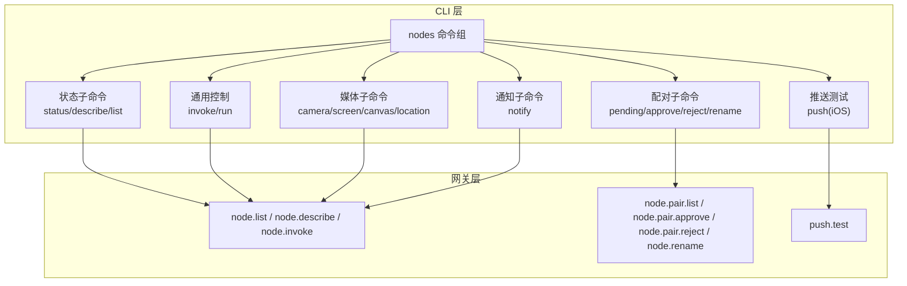
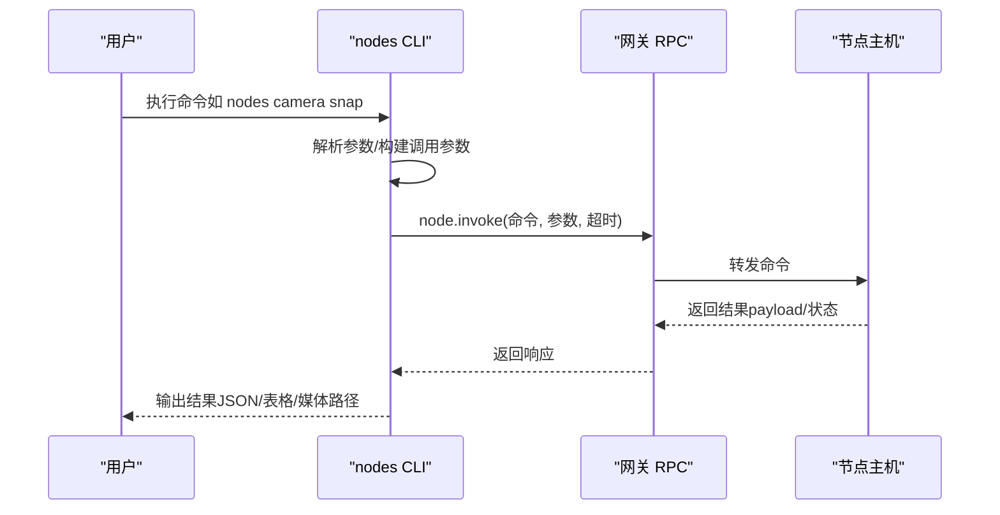
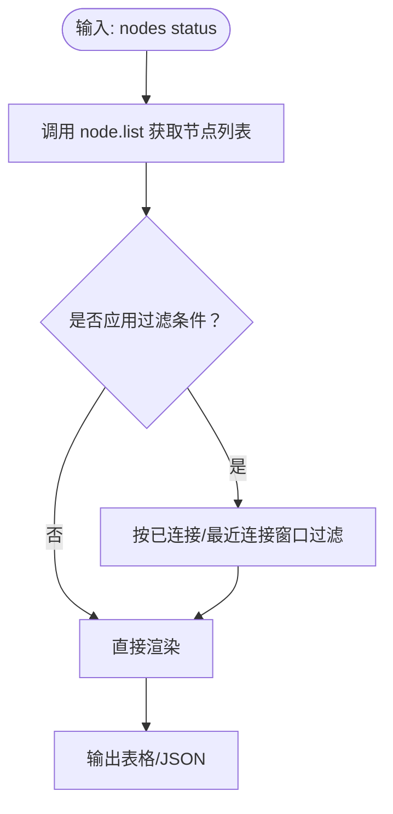
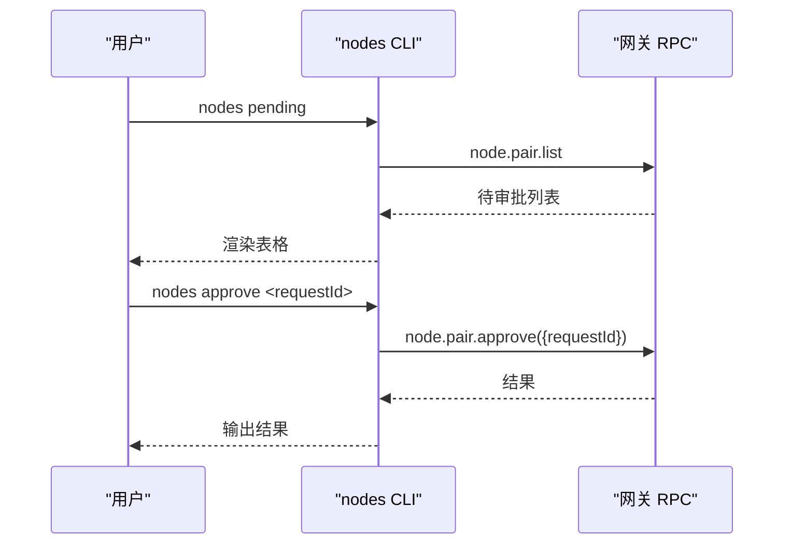
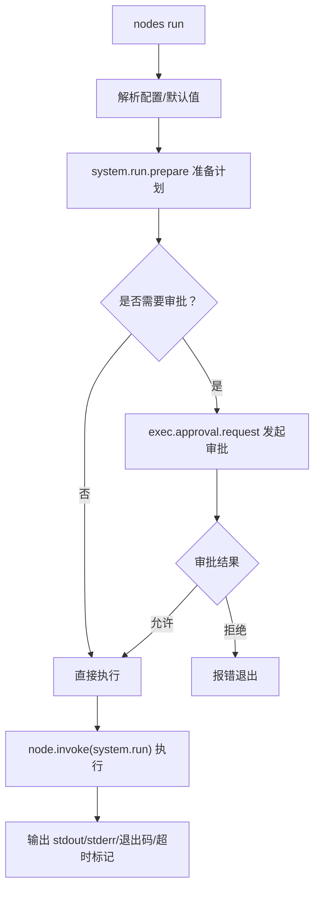
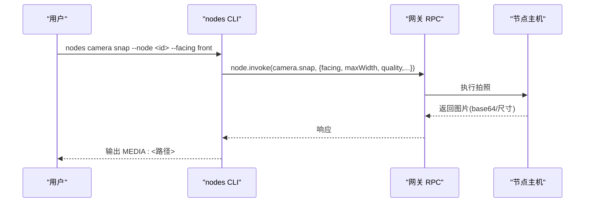
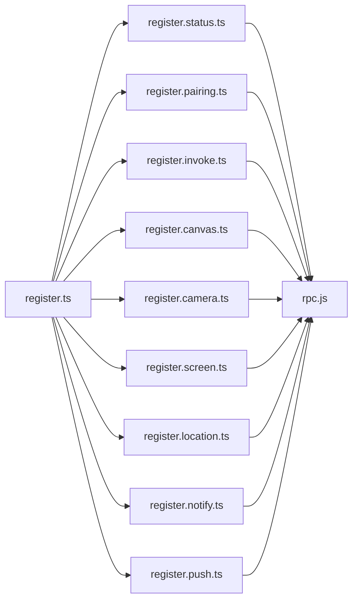

# 节点管理命令

<cite>
**本文档引用的文件**
- [nodes-cli.ts](file://src/cli/nodes-cli.ts)
- [register.ts](file://src/cli/nodes-cli/register.ts)
- [register.status.ts](file://src/cli/nodes-cli/register.status.ts)
- [register.pairing.ts](file://src/cli/nodes-cli/register.pairing.ts)
- [register.invoke.ts](file://src/cli/nodes-cli/register.invoke.ts)
- [register.notify.ts](file://src/cli/nodes-cli/register.notify.ts)
- [register.push.ts](file://src/cli/nodes-cli/register.push.ts)
- [register.canvas.ts](file://src/cli/nodes-cli/register.canvas.ts)
- [register.camera.ts](file://src/cli/nodes-cli/register.camera.ts)
- [register.screen.ts](file://src/cli/nodes-cli/register.screen.ts)
- [register.location.ts](file://src/cli/nodes-cli/register.location.ts)
- [program.register.subclis.ts](file://src/cli/program/register.subclis.ts)
- [index.md](file://docs/nodes/index.md)
- [camera.md](file://docs/nodes/camera.md)
- [GatewayConnectionController.swift](file://apps/ios/Sources/Gateway/GatewayConnectionController.swift)
- [NodeRuntime.kt](file://apps/android/app/src/main/java/ai/openclaw/app/NodeRuntime.kt)
- [DiscoverCommand.swift](file://apps/macos/Sources/OpenClawMacCLI/DiscoverCommand.swift)
- [usage-aggregates.ts](file://src/shared/usage-aggregates.ts)
- [session-cost-usage.ts](file://src/infra/session-cost-usage.ts)
- [status.ts](file://src/auto-reply/status.ts)
</cite>

## 目录

1. [简介](#简介)
2. [项目结构](#项目结构)
3. [核心组件](#核心组件)
4. [架构总览](#架构总览)
5. [详细组件分析](#详细组件分析)
6. [依赖关系分析](#依赖关系分析)
7. [性能考量](#性能考量)
8. [故障排查指南](#故障排查指南)
9. [结论](#结论)
10. [附录](#附录)

## 简介

本文件系统性梳理“节点管理命令”的设计与实现，覆盖设备节点的注册、配置、控制与监控全流程。内容包括：

- 节点发现与配对：通过网关进行节点发现、配对请求审批与重命名
- 运行时控制：通用命令调用（invoke）与安全沙箱执行（run）
- 媒体能力：相机拍照/录像、屏幕录制、画布快照/渲染、位置获取
- 状态监控：节点列表、连接状态、能力与权限展示
- 资源与性能：会话用量聚合、延迟统计与成本追踪
- 故障诊断：错误提示、超时处理与常见问题定位

## 项目结构

节点管理命令由 CLI 子命令“nodes”统一入口，按功能拆分为多个子模块：

- 状态与描述：nodes status/describe/list
- 配对与推送：nodes pending/approve/reject/rename；nodes push
- 通用控制：nodes invoke；nodes run（含安全策略与审批）
- 媒体能力：nodes camera/screen/canvas/location
- 通知：nodes notify（mac）

图表来源

- [register.ts:15-39](file://src/cli/nodes-cli/register.ts#L15-L39)
- [register.status.ts:100-212](file://src/cli/nodes-cli/register.status.ts#L100-L212)
- [register.pairing.ts:9-100](file://src/cli/nodes-cli/register.pairing.ts#L9-L100)
- [register.invoke.ts:300-468](file://src/cli/nodes-cli/register.invoke.ts#L300-L468)
- [register.canvas.ts:28-245](file://src/cli/nodes-cli/register.canvas.ts#L28-L245)
- [register.camera.ts:34-262](file://src/cli/nodes-cli/register.camera.ts#L34-L262)
- [register.screen.ts:14-82](file://src/cli/nodes-cli/register.screen.ts#L14-L82)
- [register.location.ts:8-81](file://src/cli/nodes-cli/register.location.ts#L8-L81)
- [register.notify.ts:8-57](file://src/cli/nodes-cli/register.notify.ts#L8-L57)
- [register.push.ts:25-88](file://src/cli/nodes-cli/register.push.ts#L25-L88)

章节来源

- [register.ts:15-39](file://src/cli/nodes-cli/register.ts#L15-L39)
- [program.register.subclis.ts:109-115](file://src/cli/program/register.subclis.ts#L109-L115)

## 核心组件

- 节点状态与能力查询：nodes status/describe/list 提供节点清单、连接状态、权限与能力集合
- 节点配对管理：nodes pending 列出待审批请求；approve/reject 完成审批；rename 修改显示名
- 通用命令与安全执行：nodes invoke 直接调用节点命令；nodes run 在安全策略下准备并执行系统命令
- 媒体与画布：camera（拍照/录像）、screen（屏幕录制）、canvas（快照/呈现/导航/脚本执行/A2UI 推送）、location（位置获取）
- 通知与推送：notify 发送本地通知（mac）；push 向 iOS 节点发送 APNs 测试推送
- 网关 RPC：所有命令最终通过“node.invoke”或专用方法（如 node.pair.\*、node.describe、push.test）与网关交互

章节来源

- [register.status.ts:100-212](file://src/cli/nodes-cli/register.status.ts#L100-L212)
- [register.pairing.ts:9-100](file://src/cli/nodes-cli/register.pairing.ts#L9-L100)
- [register.invoke.ts:300-468](file://src/cli/nodes-cli/register.invoke.ts#L300-L468)
- [register.canvas.ts:28-245](file://src/cli/nodes-cli/register.canvas.ts#L28-L245)
- [register.camera.ts:34-262](file://src/cli/nodes-cli/register.camera.ts#L34-L262)
- [register.screen.ts:14-82](file://src/cli/nodes-cli/register.screen.ts#L14-L82)
- [register.location.ts:8-81](file://src/cli/nodes-cli/register.location.ts#L8-L81)
- [register.notify.ts:8-57](file://src/cli/nodes-cli/register.notify.ts#L8-L57)
- [register.push.ts:25-88](file://src/cli/nodes-cli/register.push.ts#L25-L88)

## 架构总览

节点管理命令围绕“CLI → 网关 RPC → 节点执行”的链路工作。CLI 解析参数、构建调用参数，经网关转发到目标节点，节点返回结果后由 CLI 格式化输出。

图表来源

- [register.camera.ts:108-187](file://src/cli/nodes-cli/register.camera.ts#L108-L187)
- [register.canvas.ts:13-26](file://src/cli/nodes-cli/register.canvas.ts#L13-L26)
- [register.invoke.ts:310-338](file://src/cli/nodes-cli/register.invoke.ts#L310-L338)

## 详细组件分析

### 状态与描述（nodes status/describe/list）

- nodes status：列出已知节点，支持仅显示已连接、限定最近连接时间窗口；输出节点 ID、IP、权限、版本、能力等信息
- nodes describe：展示单个节点的能力集合与支持的命令列表
- nodes list：汇总待审批与已配对节点，支持过滤条件

图表来源

- [register.status.ts:107-211](file://src/cli/nodes-cli/register.status.ts#L107-L211)

章节来源

- [register.status.ts:100-212](file://src/cli/nodes-cli/register.status.ts#L100-L212)
- [register.status.ts:214-295](file://src/cli/nodes-cli/register.status.ts#L214-L295)
- [register.status.ts:297-407](file://src/cli/nodes-cli/register.status.ts#L297-L407)

### 配对与推送（nodes pending/approve/reject/rename；nodes push）

- nodes pending：列出待审批的节点配对请求
- nodes approve/reject：对请求进行批准或拒绝
- nodes rename：修改已配对节点的显示名称
- nodes push：向 iOS 节点发送 APNs 测试推送，可指定标题、正文与环境

图表来源

- [register.pairing.ts:10-70](file://src/cli/nodes-cli/register.pairing.ts#L10-L70)
- [register.push.ts:25-88](file://src/cli/nodes-cli/register.push.ts#L25-L88)

章节来源

- [register.pairing.ts:9-101](file://src/cli/nodes-cli/register.pairing.ts#L9-L101)
- [register.push.ts:25-88](file://src/cli/nodes-cli/register.push.ts#L25-L88)

### 通用控制（nodes invoke；nodes run）

- nodes invoke：直接调用节点命令，支持自定义参数与超时
- nodes run：在安全策略与审批流程下执行系统命令，支持环境变量、工作目录、代理/会话键、超时与幂等键

图表来源

- [register.invoke.ts:361-467](file://src/cli/nodes-cli/register.invoke.ts#L361-L467)

章节来源

- [register.invoke.ts:300-340](file://src/cli/nodes-cli/register.invoke.ts#L300-L340)
- [register.invoke.ts:342-468](file://src/cli/nodes-cli/register.invoke.ts#L342-L468)

### 媒体与画布（nodes camera/screen/canvas/location）

- nodes camera：列出设备、拍照（支持前后摄、质量、宽高、延时、设备 ID）、录短片（支持时长、是否含音）
- nodes screen：屏幕录制（支持时长、帧率、是否含麦克风、输出路径）
- nodes canvas：画布快照、呈现/隐藏、导航至 URL、在画布中执行 JS、A2UI JSONL 推送与重置
- nodes location：获取位置（支持缓存时效、精度、超时）

图表来源

- [register.camera.ts:108-187](file://src/cli/nodes-cli/register.camera.ts#L108-L187)
- [register.screen.ts:30-78](file://src/cli/nodes-cli/register.screen.ts#L30-L78)
- [register.canvas.ts:13-26](file://src/cli/nodes-cli/register.canvas.ts#L13-L26)
- [register.location.ts:23-77](file://src/cli/nodes-cli/register.location.ts#L23-L77)

章节来源

- [register.camera.ts:34-262](file://src/cli/nodes-cli/register.camera.ts#L34-L262)
- [register.screen.ts:14-82](file://src/cli/nodes-cli/register.screen.ts#L14-L82)
- [register.canvas.ts:28-245](file://src/cli/nodes-cli/register.canvas.ts#L28-L245)
- [register.location.ts:8-81](file://src/cli/nodes-cli/register.location.ts#L8-L81)

### 通知（nodes notify）

- nodes notify：在 macOS 节点上发送本地通知，支持标题、正文、声音、优先级与投递模式

章节来源

- [register.notify.ts:8-57](file://src/cli/nodes-cli/register.notify.ts#L8-L57)

### 节点发现与连接（概念性说明）

- iOS/Android/macOS 平台均内置网关发现与连接逻辑，支持自动发现、信任提示与 TLS 指纹校验
- CLI 通过网关 RPC 间接管理节点，平台侧负责底层连接与信任建立

章节来源

- [GatewayConnectionController.swift:20-46](file://apps/ios/Sources/Gateway/GatewayConnectionController.swift#L20-L46)
- [NodeRuntime.kt:58-77](file://apps/android/app/src/main/java/ai/openclaw/app/NodeRuntime.kt#L58-L77)
- [DiscoverCommand.swift:1-55](file://apps/macos/Sources/OpenClawMacCLI/DiscoverCommand.swift#L1-L55)

## 依赖关系分析

- nodes 命令组由 register.ts 统一注册，内部组合状态、配对、通用控制、媒体、通知与推送子模块
- 所有命令最终依赖 RPC 工具函数（resolveNodeId/buildNodeInvokeParams/callGatewayCli）与网关方法
- nodes run 依赖执行审批与安全策略模块，确保在受控环境下执行系统命令

图表来源

- [register.ts:15-39](file://src/cli/nodes-cli/register.ts#L15-L39)

章节来源

- [register.ts:15-39](file://src/cli/nodes-cli/register.ts#L15-L39)

## 性能考量

- 媒体操作的超时与资源限制：相机拍照/录像是 CPU/IO 密集型，CLI 为不同命令设置合理超时（如 camera.clip 默认 90 秒），避免过大的 base64 负载
- 画布与屏幕录制：需注意分辨率与帧率对带宽与存储的影响，建议按需调整参数
- 执行命令的安全策略：通过“准备计划+审批”降低高风险命令的误用概率，同时减少不必要的权限暴露
- 用量与延迟统计：系统提供会话用量聚合与延迟统计工具，便于评估整体性能与成本

章节来源

- [register.camera.ts:259-261](file://src/cli/nodes-cli/register.camera.ts#L259-L261)
- [register.screen.ts:79-81](file://src/cli/nodes-cli/register.screen.ts#L79-L81)
- [register.invoke.ts:388-407](file://src/cli/nodes-cli/register.invoke.ts#L388-L407)
- [usage-aggregates.ts:32-66](file://src/shared/usage-aggregates.ts#L32-L66)
- [session-cost-usage.ts:600-631](file://src/infra/session-cost-usage.ts#L600-L631)

## 故障排查指南

- 节点不可达或未连接：使用 nodes status 查看连接状态；必要时使用 nodes list 查看配对历史与最近连接时间
- 媒体命令失败：确认节点处于前台（iOS/Android 的相机/画布要求前台运行）；检查权限（相机/录音/屏幕录制）与超时设置
- 执行命令被拒：nodes run 可能触发审批流程，检查 exec 审批策略与审批结果；若策略为“deny”，需调整安全级别
- 通知/推送异常：macOS 通知需系统权限；iOS 推送需正确配置 APNs 环境与凭据
- 超时与错误提示：CLI 对超时与非零退出码给出明确提示，并在可能时提供授权相关提示

章节来源

- [register.status.ts:154-162](file://src/cli/nodes-cli/register.status.ts#L154-L162)
- [register.camera.ts:60-92](file://src/cli/nodes-cli/register.camera.ts#L60-L92)
- [register.invoke.ts:396-463](file://src/cli/nodes-cli/register.invoke.ts#L396-L463)
- [register.notify.ts:20-56](file://src/cli/nodes-cli/register.notify.ts#L20-L56)
- [register.push.ts:34-87](file://src/cli/nodes-cli/register.push.ts#L34-L87)

## 结论

节点管理命令以“nodes”为核心入口，覆盖从发现、配对、状态监控到媒体与通用控制的完整生命周期。通过安全策略与审批机制保障执行安全，借助超时与资源限制提升稳定性，并提供丰富的输出格式与诊断信息，满足多平台、多场景下的节点管理需求。

## 附录

### 常用命令速查

- 节点状态与描述
  - openclaw nodes status [--connected] [--last-connected <duration>]
  - openclaw nodes describe --node <idOrNameOrIp>
  - openclaw nodes list [--connected] [--last-connected <duration>]
- 配对与推送
  - openclaw nodes pending
  - openclaw nodes approve <requestId>
  - openclaw nodes reject <requestId>
  - openclaw nodes rename --node <id> --name <displayName>
  - openclaw nodes push --node <id> [--title <text>] [--body <text>] [--environment <sandbox|production>]
- 通用控制
  - openclaw nodes invoke --node <id> --command <cmd> [--params <json>] [--invoke-timeout <ms>] [--idempotency-key <key>]
  - openclaw nodes run [command...] [--node <id>] [--raw <command>] [--cwd <path>] [--env <key=val> ...] [--ask <off|on-miss|always>] [--security <deny|allowlist|full>] [--command-timeout <ms>] [--needs-screen-recording] [--invoke-timeout <ms>] [--idempotency-key <key>]
- 媒体与画布
  - openclaw nodes camera list --node <id>
  - openclaw nodes camera snap --node <id> [--facing front|back|both] [--device-id <id>] [--max-width <px>] [--quality <0-1>] [--delay-ms <ms>] [--invoke-timeout <ms>]
  - openclaw nodes camera clip --node <id> [--facing front|back] [--device-id <id>] [--duration <ms|10s|1m>] [--no-audio] [--invoke-timeout <ms>]
  - openclaw nodes screen record --node <id> [--screen <index>] [--duration <ms|10s>] [--fps <fps>] [--no-audio] [--out <path>] [--invoke-timeout <ms>]
  - openclaw nodes canvas snapshot --node <id> [--format png|jpg|jpeg] [--max-width <px>] [--quality <0-1>] [--invoke-timeout <ms>]
  - openclaw nodes canvas present --node <id> [--target <urlOrPath>] [--x <px>] [--y <px>] [--width <px>] [--height <px>] [--invoke-timeout <ms>]
  - openclaw nodes canvas hide --node <id> [--invoke-timeout <ms>]
  - openclaw nodes canvas navigate <url> --node <id> [--invoke-timeout <ms>]
  - openclaw nodes canvas eval [--js <code>] <js> --node <id> [--invoke-timeout <ms>]
  - openclaw nodes canvas a2ui push [--jsonl <path>|--text <text>] --node <id> [--invoke-timeout <ms>]
  - openclaw nodes canvas a2ui reset --node <id> [--invoke-timeout <ms>]
  - openclaw nodes location get --node <id> [--max-age <ms>] [--accuracy coarse|balanced|precise] [--location-timeout <ms>] [--invoke-timeout <ms>]
- 通知
  - openclaw nodes notify --node <id> [--title <text>] [--body <text>] [--sound <name>] [--priority passive|active|timeSensitive] [--delivery system|overlay|auto] [--invoke-timeout <ms>]

章节来源

- [index.md:189-236](file://docs/nodes/index.md#L189-L236)
- [camera.md:27-163](file://docs/nodes/camera.md#L27-L163)
