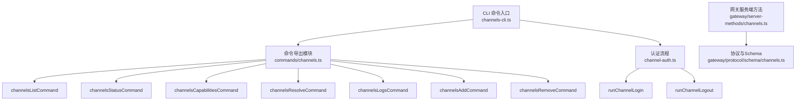
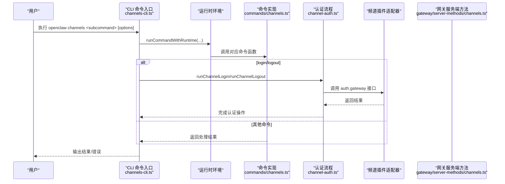
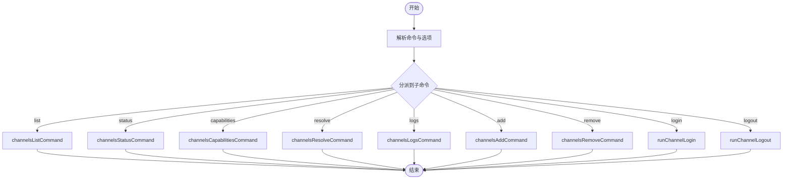
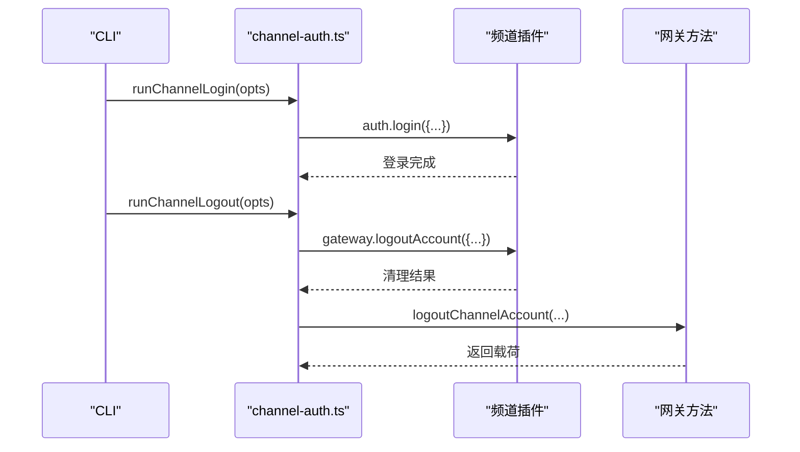
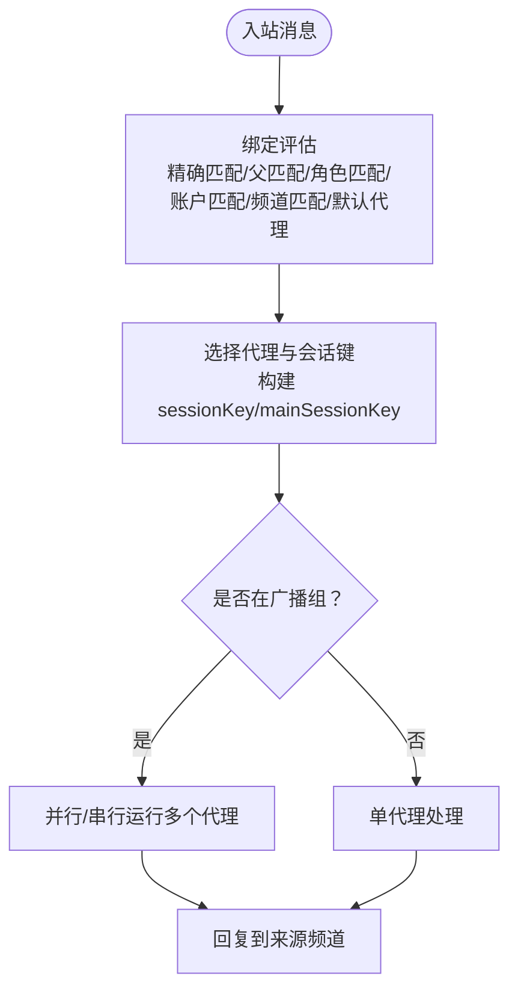
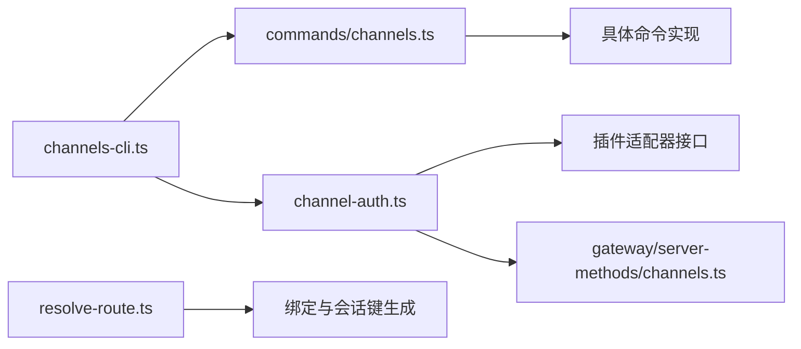

# 频道配置命令

<cite>
**本文档引用的文件**
- [channels-cli.ts](file://src/cli/channels-cli.ts)
- [channels.ts](file://src/commands/channels.ts)
- [channel-auth.ts](file://src/cli/channel-auth.ts)
- [channels.ts](file://src/gateway/server-methods/channels.ts)
- [channels.ts](file://src/gateway/protocol/schema/channels.ts)
- [channels.md](file://docs/cli/channels.md)
- [index.md](file://docs/channels/index.md)
- [channel-routing.md](file://docs/channels/channel-routing.md)
- [troubleshooting.md](file://docs/channels/troubleshooting.md)
- [health.md](file://docs/gateway/health.md)
- [health.md](file://docs/cli/health.md)
- [broadcast-groups.md](file://docs/channels/broadcast-groups.md)
- [types.adapters.ts](file://src/channels/plugins/types.adapters.ts)
- [channel-access.ts](file://src/channels/plugins/onboarding/channel-access.ts)
- [resolve-route.ts](file://src/routing/resolve-route.ts)
</cite>

## 目录

1. [简介](#简介)
2. [项目结构](#项目结构)
3. [核心组件](#核心组件)
4. [架构总览](#架构总览)
5. [详细组件分析](#详细组件分析)
6. [依赖关系分析](#依赖关系分析)
7. [性能考虑](#性能考虑)
8. [故障排查指南](#故障排查指南)
9. [结论](#结论)
10. [附录](#附录)

## 简介

本文件系统性梳理“频道配置命令”的完整使用与实现，覆盖频道添加、删除、登录/登出、状态与能力探测、名称解析、日志查看等操作；同时说明各消息平台的配置参数、认证方式与连接设置，以及频道别名管理、优先级与路由规则、健康检查、错误诊断与性能优化，并扩展到多频道协调、负载均衡与故障转移策略。

## 项目结构

- CLI 命令入口：定义并注册 `openclaw channels` 子命令族，包括 list、status、capabilities、resolve、logs、add、remove、login、logout。
- 命令实现：通过命令导出模块调用具体业务逻辑（如 channelsAddCommand、channelsStatusCommand 等）。
- 认证流程：login/logout 通过插件适配器执行二维码登录或会话清理。
- 网关协议：定义频道状态返回、登出参数、Web 登录参数等协议结构。
- 文档参考：官方 CLI 文档、通道支持矩阵、路由与广播组配置、健康检查与故障排查指南。

**图表来源**

- [channels-cli.ts:70-256](file://src/cli/channels-cli.ts#L70-L256)
- [channels.ts:1-15](file://src/commands/channels.ts#L1-L15)
- [channel-auth.ts:48-89](file://src/cli/channel-auth.ts#L48-L89)
- [channels.ts:33-67](file://src/gateway/server-methods/channels.ts#L33-L67)
- [channels.ts:143-192](file://src/gateway/protocol/schema/channels.ts#L143-L192)

**章节来源**

- [channels-cli.ts:70-256](file://src/cli/channels-cli.ts#L70-L256)
- [channels.ts:1-15](file://src/commands/channels.ts#L1-L15)

## 核心组件

- 频道命令子系统：提供 list/status/capabilities/resolve/logs/add/remove/login/logout 等子命令，统一通过运行时环境执行。
- 认证适配器：为支持二维码登录/登出的频道提供 loginWithQrStart/loginWithQrWait/logoutAccount 等接口。
- 网关交互：通过网关方法处理频道账户登出、状态快照与协议参数校验。
- 路由与广播：结合绑定规则、默认账户、会话键生成与广播组策略，实现多频道协调与多代理协作。

**章节来源**

- [channels-cli.ts:21-57](file://src/cli/channels-cli.ts#L21-L57)
- [types.adapters.ts:275-289](file://src/channels/plugins/types.adapters.ts#L275-L289)
- [channels.ts:33-67](file://src/gateway/server-methods/channels.ts#L33-L67)

## 架构总览

下图展示从 CLI 到命令实现、再到插件适配器与网关服务的整体调用链路。

**图表来源**

- [channels-cli.ts:59-68](file://src/cli/channels-cli.ts#L59-L68)
- [channels.ts:1-15](file://src/commands/channels.ts#L1-L15)
- [channel-auth.ts:48-89](file://src/cli/channel-auth.ts#L48-L89)
- [channels.ts:33-67](file://src/gateway/server-methods/channels.ts#L33-L67)

## 详细组件分析

### 频道命令子系统

- list：列出已配置频道与认证档案，支持跳过模型用量快照与 JSON 输出。
- status：显示网关频道状态，支持探测凭证、超时控制与 JSON 输出。
- capabilities：查询提供商能力提示（意图/作用域与特性支持），可指定频道、账号与目标。
- resolve：将频道/用户名称解析为 ID，支持强制类型与 JSON 输出。
- logs：从网关日志文件中查看最近频道日志，默认输出 200 行。
- add：添加或更新频道账户，支持多种平台的令牌与连接参数。
- remove：禁用或删除频道账户，支持删除配置项且无提示。
- login/logout：对支持二维码登录的频道进行登录/登出，支持详细连接日志。

**图表来源**

- [channels-cli.ts:92-256](file://src/cli/channels-cli.ts#L92-L256)
- [channels.ts:1-15](file://src/commands/channels.ts#L1-L15)

**章节来源**

- [channels-cli.ts:92-256](file://src/cli/channels-cli.ts#L92-L256)
- [channels.md:18-102](file://docs/cli/channels.md#L18-L102)

### 认证与会话管理

- login：解析频道插件与默认账户 ID，设置详细日志开关，调用插件 auth.login 执行登录。
- logout：解析账户上下文，调用插件 gateway.logoutAccount 清理会话状态。
- 网关登出：根据频道 ID 与账户 ID 解析账户，停止频道并执行插件登出，标记频道登出状态并返回载荷。

**图表来源**

- [channel-auth.ts:48-89](file://src/cli/channel-auth.ts#L48-L89)
- [channels.ts:33-67](file://src/gateway/server-methods/channels.ts#L33-L67)

**章节来源**

- [channel-auth.ts:48-89](file://src/cli/channel-auth.ts#L48-L89)
- [channels.ts:33-67](file://src/gateway/server-methods/channels.ts#L33-L67)

### 各消息平台配置参数与认证方法

- Telegram：bot 令牌、令牌文件、账号显示名。
- Slack：bot 令牌（xoxb-...）、应用令牌（xapp-...）。
- Signal：HTTP 守护进程地址、主机、端口、号码（E.164）。
- iMessage：数据库路径、服务（imessage|sms|auto）、区域、CLI 路径。
- Google Chat：webhook 路径、URL、受众类型（app-url|project-number）、受众值。
- Matrix：服务器 URL、用户 ID、访问令牌、密码、设备名、初始同步限制。
- Tlon：船号（~sampel-palnet）、URL、登录码、群组频道列表、DM 白名单、自动发现。
- WhatsApp：认证目录覆盖、QR 登录（login/logout 支持）。
- 其他：IRC、LINE、Feishu、Mattermost、Microsoft Teams、Nextcloud Talk、Nostr、Synology Chat、Twitch、Zalo、Zalo 个人等，详见支持矩阵与各平台文档。

**章节来源**

- [channels-cli.ts:164-206](file://src/cli/channels-cli.ts#L164-L206)
- [index.md:14-37](file://docs/channels/index.md#L14-L37)

### 频道别名管理、优先级与路由规则

- 默认账户：channels.<channel>.defaultAccount 决定未显式指定 accountId 时使用的账户。
- 绑定匹配顺序：精确对等体匹配、父对等体匹配、公会+角色匹配（Discord）、公会匹配、团队匹配（Slack）、账户匹配、频道匹配、默认代理。
- 会话键：直接消息使用主会话键；群组/频道使用带 channel/channelId 的键；线程/论坛主题附加 thread/topic。
- 广播组：同一消息可并行/串行触发多个代理，适用于 WhatsApp 群组与 DM。
- 分组策略：开放/白名单/禁用模式，支持按账户与频道维度配置。

**图表来源**

- [channel-routing.md:58-70](file://docs/channels/channel-routing.md#L58-L70)
- [channel-routing.md:24-44](file://docs/channels/channel-routing.md#L24-L44)
- [broadcast-groups.md:153-167](file://docs/channels/broadcast-groups.md#L153-L167)
- [resolve-route.ts:658-692](file://src/routing/resolve-route.ts#L658-L692)

**章节来源**

- [channel-routing.md:14-70](file://docs/channels/channel-routing.md#L14-L70)
- [channel-routing.md:93-110](file://docs/channels/channel-routing.md#L93-L110)
- [broadcast-groups.md:69-117](file://docs/channels/broadcast-groups.md#L69-L117)
- [resolve-route.ts:658-692](file://src/routing/resolve-route.ts#L658-L692)

### 健康检查、错误诊断与性能优化

- 健康检查：openclaw health 获取网关健康快照；openclaw status 提供本地摘要与深度探测；openclaw channels status --probe 进行凭证探测。
- 日志：openclaw channels logs 查看最近日志；tail 系统日志并过滤心跳、重连、自动回复、入站事件。
- 故障排查：按频道快速定位症状与修复步骤，如 WhatsApp 的配对列表、Telegram 的隐私模式、Discord 的权限与提及要求、Slack 的令牌与作用域、iMessage/BlueBubbles 的权限与 webhook、Signal 的守护进程与接收模式、Matrix 的加密与房间同步。
- 性能优化：合理设置会话存储路径、避免过多广播组代理、选择合适模型与工具集、监控路由缓存命中率。

**章节来源**

- [health.md:8-22](file://docs/cli/health.md#L8-L22)
- [health.md:8-36](file://docs/gateway/health.md#L8-L36)
- [troubleshooting.md:13-118](file://docs/channels/troubleshooting.md#L13-L118)

### 多频道协调、负载均衡与故障转移

- 多频道并行：配置多个频道并启用多账户，路由基于绑定与默认账户决定代理。
- 负载均衡：通过多账户与多代理组合实现请求分摊；广播组在 WhatsApp 中实现“并行/串行”处理。
- 故障转移：当出现“已登出”（状态 409–515）或网关不可达时，先执行 logout 再 login 重新建立连接；必要时切换默认账户或调整分组策略。

**章节来源**

- [channels.md:65-71](file://docs/cli/channels.md#L65-L71)
- [health.md:27-36](file://docs/gateway/health.md#L27-L36)
- [broadcast-groups.md:256-272](file://docs/channels/broadcast-groups.md#L256-L272)

## 依赖关系分析

- CLI 依赖命令导出模块；命令模块进一步依赖具体实现与运行时环境。
- 认证流程依赖频道插件适配器（auth.gateway）与网关方法。
- 路由与会话键生成依赖配置解析与绑定索引。

**图表来源**

- [channels-cli.ts:1-20](file://src/cli/channels-cli.ts#L1-L20)
- [channels.ts:1-15](file://src/commands/channels.ts#L1-L15)
- [channel-auth.ts:1-18](file://src/cli/channel-auth.ts#L1-L18)
- [channels.ts:1-25](file://src/gateway/server-methods/channels.ts#L1-L25)
- [resolve-route.ts:658-692](file://src/routing/resolve-route.ts#L658-L692)

**章节来源**

- [channels-cli.ts:1-20](file://src/cli/channels-cli.ts#L1-L20)
- [channels.ts:1-15](file://src/commands/channels.ts#L1-L15)
- [channel-auth.ts:1-18](file://src/cli/channel-auth.ts#L1-L18)
- [channels.ts:1-25](file://src/gateway/server-methods/channels.ts#L1-L25)
- [resolve-route.ts:658-692](file://src/routing/resolve-route.ts#L658-L692)

## 性能考虑

- 路由缓存：绑定评估与路由结果具备缓存机制，避免重复扫描全量绑定。
- 广播组策略：并行模式提升响应速度，但需控制代理数量与模型复杂度。
- 会话存储：自定义存储路径可减少 IO 压力，注意并发写入与锁竞争。
- 日志与探测：合理设置 --timeout 与 --lines，避免阻塞 CLI 交互。

**章节来源**

- [resolve-route.ts:684-692](file://src/routing/resolve-route.ts#L684-L692)
- [broadcast-groups.md:256-263](file://docs/channels/broadcast-groups.md#L256-L263)

## 故障排查指南

- 快速检查清单：status、gateway status、logs --follow、doctor、channels status --probe。
- 健康基线：运行时运行、RPC 探针正常、频道探针显示已连接/就绪。
- 频道特定问题：
  - WhatsApp：配对列表、提及要求、隐私模式。
  - Telegram：/start 后可用性、隐私模式、网络错误。
  - Discord：公会/频道权限、提及 gating。
  - Slack：Socket 模式、令牌与作用域、分组策略。
  - iMessage/BlueBubbles：webhook 可达性、macOS 权限。
  - Signal：守护进程可达性、接收模式、群组允许列表。
  - Matrix：房间允许列表、加密与同步。
- 深度诊断：凭据文件时间戳、会话存储位置、重新链接流程。

**章节来源**

- [troubleshooting.md:13-118](file://docs/channels/troubleshooting.md#L13-L118)
- [health.md:12-36](file://docs/gateway/health.md#L12-L36)

## 结论

“频道配置命令”提供了从添加、删除、认证到状态探测与日志查看的完整 CLI 能力。结合多账户、默认账户、绑定与会话键策略，可实现跨频道的确定性路由与多代理协作。通过健康检查与故障排查流程，能够快速定位并修复常见问题；借助广播组与合理的性能优化策略，可在保证稳定性的同时提升响应效率。

## 附录

- 支持的频道平台与特性概览参见支持矩阵。
- 路由与会话键规则、广播组策略与示例参见路由与广播组文档。
- CLI 使用示例与注意事项参见官方 CLI 文档。

**章节来源**

- [index.md:14-48](file://docs/channels/index.md#L14-L48)
- [channel-routing.md:93-135](file://docs/channels/channel-routing.md#L93-L135)
- [broadcast-groups.md:401-443](file://docs/channels/broadcast-groups.md#L401-L443)
- [channels.md:18-102](file://docs/cli/channels.md#L18-L102)
