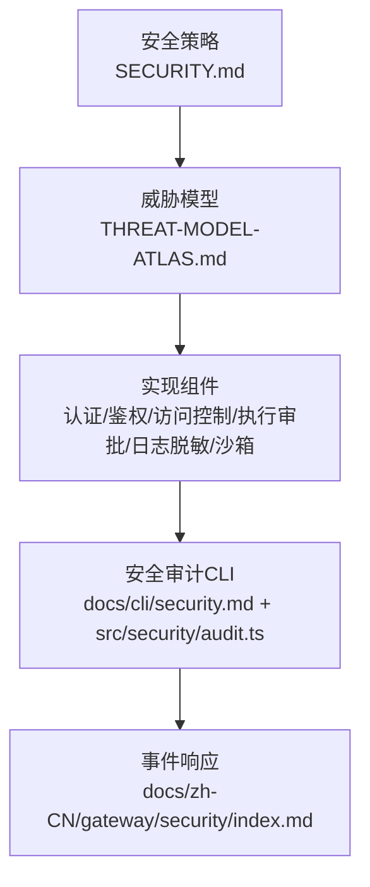
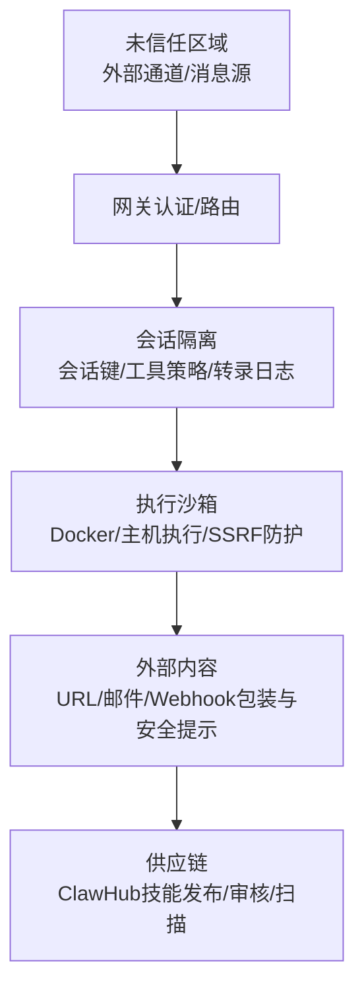
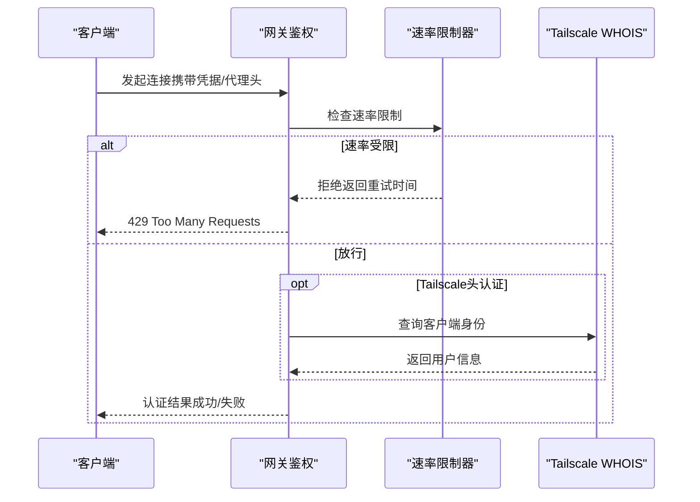
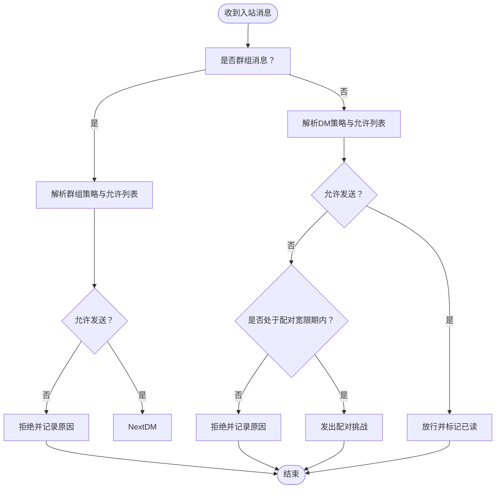
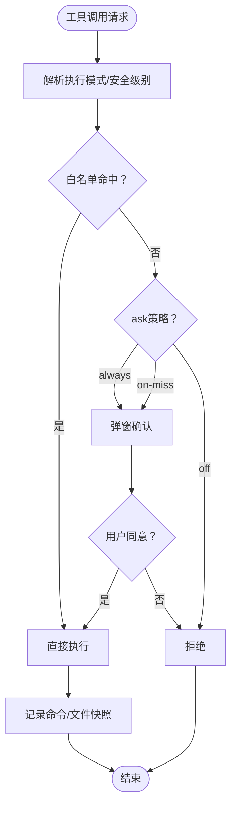
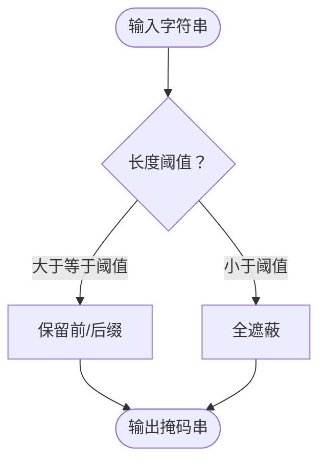
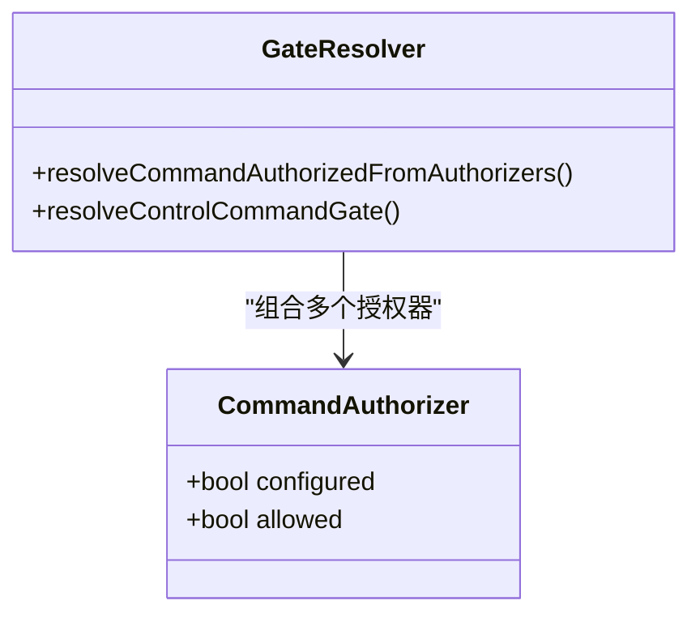
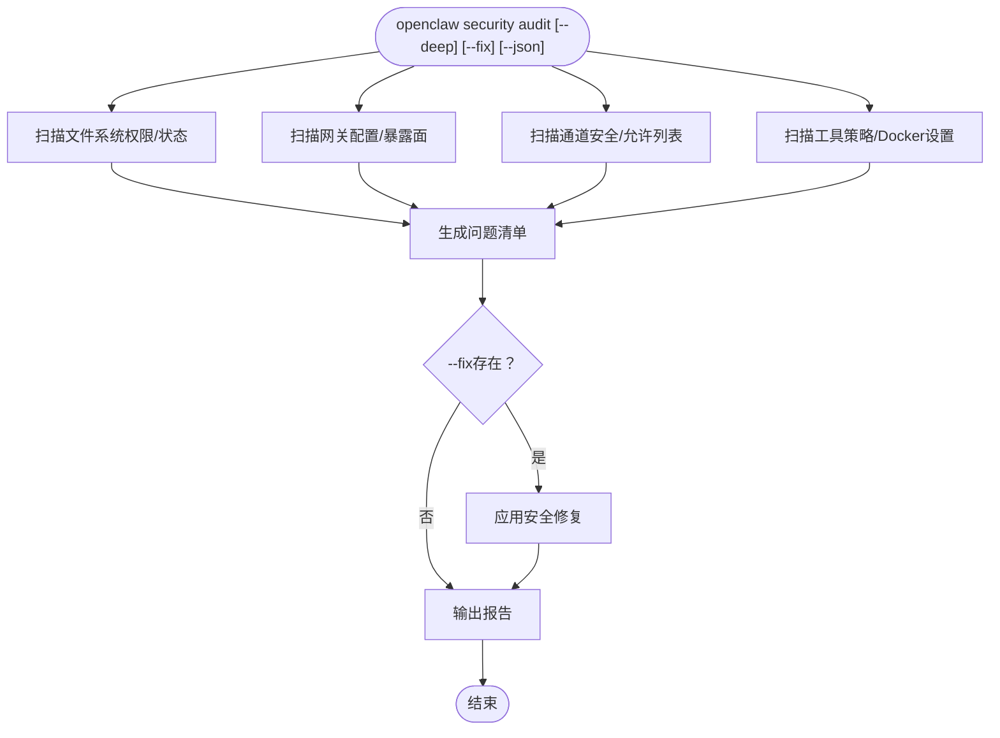
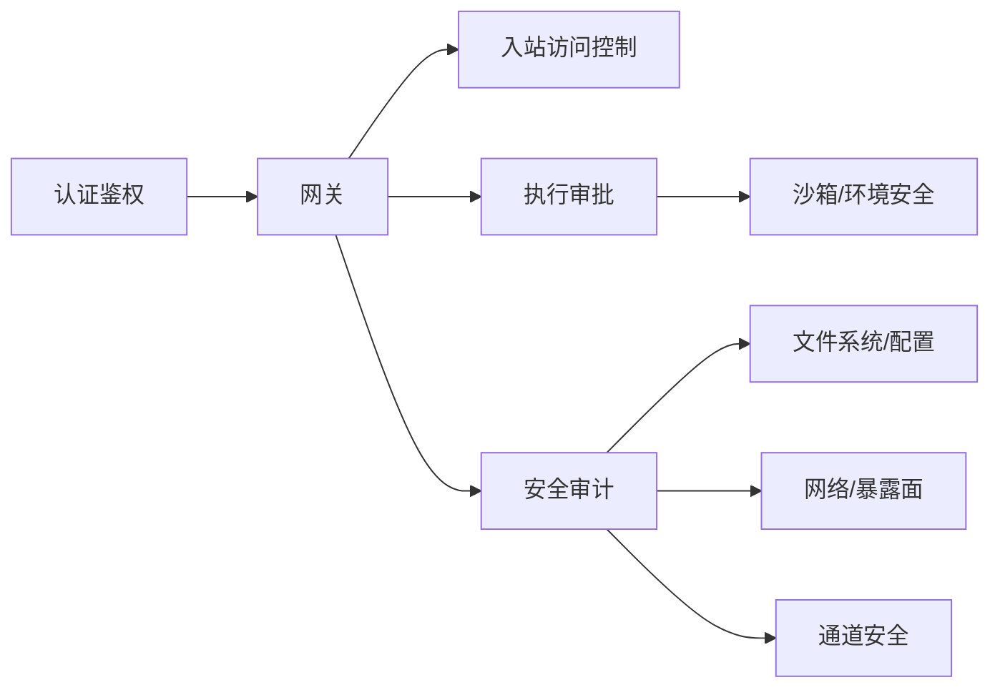

# 安全与合规

<cite>
**本文引用的文件**
- [SECURITY.md](file://SECURITY.md)
- [docs/security/README.md](file://docs/security/README.md)
- [docs/security/CONTRIBUTING-THREAT-MODEL.md](file://docs/security/CONTRIBUTING-THREAT-MODEL.md)
- [docs/security/THREAT-MODEL-ATLAS.md](file://docs/security/THREAT-MODEL-ATLAS.md)
- [docs/cli/security.md](file://docs/cli/security.md)
- [src/security/audit.ts](file://src/security/audit.ts)
- [src/gateway/auth.ts](file://src/gateway/auth.ts)
- [src/web/inbound/access-control.ts](file://src/web/inbound/access-control.ts)
- [src/infra/exec-approvals.ts](file://src/infra/exec-approvals.ts)
- [src/logging/redact.ts](file://src/logging/redact.ts)
- [src/config/redact-snapshot.ts](file://src/config/redact-snapshot.ts)
- [src/channels/command-gating.ts](file://src/channels/command-gating.ts)
- [src/daemon/service-audit.ts](file://src/daemon/service-audit.ts)
- [src/secrets/audit.ts](file://src/secrets/audit.ts)
- [src/gateway/control-plane-audit.ts](file://src/gateway/control-plane-audit.ts)
- [src/gateway/security-path.ts](file://src/gateway/security-path.ts)
- [src/agents/sandbox/validate-sandbox-security.ts](file://src/agents/sandbox/validate-sandbox-security.ts)
- [src/infra/host-env-security.ts](file://src/infra/host-env-security.ts)
- [docs/zh-CN/gateway/security/index.md](file://docs/zh-CN/gateway/security/index.md)
</cite>

## 目录

1. [引言](#引言)
2. [项目结构](#项目结构)
3. [核心组件](#核心组件)
4. [架构总览](#架构总览)
5. [详细组件分析](#详细组件分析)
6. [依赖关系分析](#依赖关系分析)
7. [性能考量](#性能考量)
8. [故障排查指南](#故障排查指南)
9. [结论](#结论)
10. [附录](#附录)

## 引言

本指南面向OpenClaw的安全与合规团队及运营人员，系统化阐述平台的安全最佳实践、权限管理、数据保护与合规要求，覆盖默认安全配置、权限控制系统、访问审计机制、威胁模型与风险缓解策略、数据加密与隐私保护、合规性实施路径以及安全事件响应流程。内容基于仓库内官方安全政策、威胁模型文档与核心实现模块，确保既符合技术标准又满足法律合规要求。

## 项目结构

OpenClaw的安全体系由“策略—模型—实现—审计—响应”五层构成：

- 策略层：安全政策与披露流程（含漏洞披露、可信模型、部署假设等）
- 模型层：MITRE ATLAS驱动的威胁模型与攻击链
- 实现层：认证鉴权、入站访问控制、执行审批、日志脱敏、沙箱与环境隔离
- 审计层：安全审计CLI与多维度扫描（文件系统、网关、通道、工具策略）
- 响应层：事件响应步骤与复盘固化

图示来源

- [SECURITY.md:1-288](file://SECURITY.md#L1-L288)
- [docs/security/THREAT-MODEL-ATLAS.md:1-604](file://docs/security/THREAT-MODEL-ATLAS.md#L1-L604)
- [docs/cli/security.md:1-72](file://docs/cli/security.md#L1-L72)
- [src/security/audit.ts:87-343](file://src/security/audit.ts#L87-L343)
- [docs/zh-CN/gateway/security/index.md:273-315](file://docs/zh-CN/gateway/security/index.md#L273-L315)

章节来源

- [SECURITY.md:1-288](file://SECURITY.md#L1-L288)
- [docs/security/README.md:1-18](file://docs/security/README.md#L1-L18)
- [docs/security/CONTRIBUTING-THREAT-MODEL.md:1-91](file://docs/security/CONTRIBUTING-THREAT-MODEL.md#L1-L91)
- [docs/security/THREAT-MODEL-ATLAS.md:1-604](file://docs/security/THREAT-MODEL-ATLAS.md#L1-L604)
- [docs/cli/security.md:1-72](file://docs/cli/security.md#L1-L72)

## 核心组件

- 认证与鉴权：支持token/password/trusted-proxy/tailscale模式，具备速率限制与代理信任校验
- 入站访问控制：按DM/群组策略与允许列表进行过滤，支持配对宽限期与自对话模式
- 执行审批：命令级白名单+交互式确认，结合沙箱与工具策略
- 日志与配置脱敏：令牌与敏感字段掩码、配置快照还原与恢复
- 沙箱与环境隔离：容器/主机执行、环境变量安全策略、路径解析与临时目录边界
- 安全审计：文件系统权限、网关暴露面、通道安全、工具策略与Docker设置检查

章节来源

- [src/gateway/auth.ts:217-504](file://src/gateway/auth.ts#L217-L504)
- [src/web/inbound/access-control.ts:41-228](file://src/web/inbound/access-control.ts#L41-L228)
- [src/infra/exec-approvals.ts:146-590](file://src/infra/exec-approvals.ts#L146-L590)
- [src/logging/redact.ts:47-83](file://src/logging/redact.ts#L47-L83)
- [src/config/redact-snapshot.ts:454-500](file://src/config/redact-snapshot.ts#L454-L500)
- [src/agents/sandbox/validate-sandbox-security.ts](file://src/agents/sandbox/validate-sandbox-security.ts)
- [src/infra/host-env-security.ts](file://src/infra/host-env-security.ts)
- [src/security/audit.ts:87-343](file://src/security/audit.ts#L87-L343)

## 架构总览

下图展示从通道入口到工具执行的关键信任边界与控制点，强调“路由与执行同属受信操作员边界”的设计原则。

图示来源

- [docs/security/THREAT-MODEL-ATLAS.md:56-123](file://docs/security/THREAT-MODEL-ATLAS.md#L56-L123)

章节来源

- [docs/security/THREAT-MODEL-ATLAS.md:56-123](file://docs/security/THREAT-MODEL-ATLAS.md#L56-L123)

## 详细组件分析

### 组件一：认证与鉴权（Gateway）

- 多模式认证：token/password/trusted-proxy/tailscale；默认优先token，支持速率限制与代理信任头校验
- 本地直连判定：区分loopback与代理转发，避免X-Real-IP误判
- Tailscale集成：通过反向代理头与WHOIS校验，实现免密登录
- 安全建议：默认绑定loopback，启用速率限制，谨慎开启trusted-proxy与none模式

图示来源

- [src/gateway/auth.ts:378-504](file://src/gateway/auth.ts#L378-L504)

章节来源

- [src/gateway/auth.ts:217-504](file://src/gateway/auth.ts#L217-L504)

### 组件二：入站访问控制（Channel Inbound）

- DM/群组策略：pairing/open/allowlist/disabled；默认DM为pairing，群组策略可回退至provider默认
- 允许列表匹配：支持通配符与E164标准化；自对话模式下允许同一手机号
- 配对宽限期：30秒内自动挑战配对，抑制历史消息回复
- 安全建议：优先使用allowlist；群组策略禁用或严格白名单；关闭open DM/群组除非必要

图示来源

- [src/web/inbound/access-control.ts:41-228](file://src/web/inbound/access-control.ts#L41-L228)

章节来源

- [src/web/inbound/access-control.ts:41-228](file://src/web/inbound/access-control.ts#L41-L228)

### 组件三：执行审批与工具策略

- 执行模式：sandbox/gateway/node；安全级别deny/allowlist/full；交互式ask=off/on-miss/always
- 白名单与快照：命令与文件快照绑定，支持UI确认与自动记录
- 默认策略：默认deny+on-miss，建议在高风险场景提升为always
- 安全建议：默认启用沙箱；严格工具策略；对危险命令启用交互式审批

图示来源

- [src/infra/exec-approvals.ts:484-590](file://src/infra/exec-approvals.ts#L484-L590)

章节来源

- [src/infra/exec-approvals.ts:146-590](file://src/infra/exec-approvals.ts#L146-L590)

### 组件四：日志与配置脱敏

- 令牌掩码：短令牌全遮蔽，长令牌保留前后缀
- PEM块脱敏：首尾行保留，中间脱敏
- 配置快照：脱敏后快照与还原流程，防止误恢复导致信息泄露
- 安全建议：默认启用敏感信息脱敏；定期审计日志与配置权限

图示来源

- [src/logging/redact.ts:47-83](file://src/logging/redact.ts#L47-L83)
- [src/config/redact-snapshot.ts:454-500](file://src/config/redact-snapshot.ts#L454-L500)

章节来源

- [src/logging/redact.ts:47-83](file://src/logging/redact.ts#L47-L83)
- [src/config/redact-snapshot.ts:454-500](file://src/config/redact-snapshot.ts#L454-L500)

### 组件五：通道命令授权与门控

- 授权器：支持多来源授权，当未启用访问组时可按模式（allow/deny/configured）决策
- 控制命令门控：文本命令与控制命令分离，未授权时可阻断
- 安全建议：默认关闭文本命令；明确授权来源；最小化允许列表

图示来源

- [src/channels/command-gating.ts:1-45](file://src/channels/command-gating.ts#L1-L45)

章节来源

- [src/channels/command-gating.ts:1-45](file://src/channels/command-gating.ts#L1-L45)

### 组件六：安全审计与修复

- 审计范围：文件系统权限、网关暴露面、通道安全、工具策略、Docker网络与标签
- 修复策略：自动收紧权限、切换敏感脱敏模式、修正常见不安全配置
- JSON输出：便于CI策略检查与自动化修复验证
- 安全建议：定期运行深度审计；结合--fix与--json进行合规基线治理

图示来源

- [docs/cli/security.md:17-72](file://docs/cli/security.md#L17-L72)
- [src/security/audit.ts:87-343](file://src/security/audit.ts#L87-L343)

章节来源

- [docs/cli/security.md:17-72](file://docs/cli/security.md#L17-L72)
- [src/security/audit.ts:87-343](file://src/security/audit.ts#L87-L343)

### 组件七：沙箱与环境安全

- 沙箱校验：容器/主机执行边界、路径解析与临时目录约束
- 主机环境安全：环境变量注入与命令行参数安全策略
- 安全建议：默认启用沙箱；限制Docker网络模式；使用专用临时根目录

章节来源

- [src/agents/sandbox/validate-sandbox-security.ts](file://src/agents/sandbox/validate-sandbox-security.ts)
- [src/infra/host-env-security.ts](file://src/infra/host-env-security.ts)

### 组件八：供应链与通道安全审计

- 供应链：ClawHub技能发布流程、审核与扫描（含计划中的VirusTotal集成）
- 通道安全：各渠道接入的允许列表、身份验证与响应策略
- 安全建议：启用账户年龄验证、路径清理、大小限制与模式化审核

章节来源

- [src/daemon/service-audit.ts](file://src/daemon/service-audit.ts)
- [src/secrets/audit.ts](file://src/secrets/audit.ts)
- [src/gateway/control-plane-audit.ts](file://src/gateway/control-plane-audit.ts)
- [src/gateway/security-path.ts](file://src/gateway/security-path.ts)

## 依赖关系分析

- 组件耦合：认证与鉴权贯穿HTTP/WS控制界面；入站访问控制依赖通道插件与允许列表；执行审批依赖工具策略与沙箱
- 外部依赖：Tailscale WHOIS、Docker运行时、通道提供商（如WhatsApp/Telegram/Discord等）
- 潜在环路：审计模块对配置与状态的读取需避免循环依赖；通道门控与授权器解耦

图示来源

- [src/gateway/auth.ts:217-504](file://src/gateway/auth.ts#L217-L504)
- [src/web/inbound/access-control.ts:41-228](file://src/web/inbound/access-control.ts#L41-L228)
- [src/infra/exec-approvals.ts:146-590](file://src/infra/exec-approvals.ts#L146-L590)
- [src/security/audit.ts:87-343](file://src/security/audit.ts#L87-L343)

章节来源

- [src/gateway/auth.ts:217-504](file://src/gateway/auth.ts#L217-L504)
- [src/web/inbound/access-control.ts:41-228](file://src/web/inbound/access-control.ts#L41-L228)
- [src/infra/exec-approvals.ts:146-590](file://src/infra/exec-approvals.ts#L146-L590)
- [src/security/audit.ts:87-343](file://src/security/audit.ts#L87-L343)

## 性能考量

- 审计性能：深度扫描增加IO与网络探测开销，建议在CI中按需启用--deep，并设置超时
- 速率限制：合理配置共享密钥作用域与IP作用域，避免误伤正常流量
- 执行审批：交互式审批可能引入延迟，建议在高吞吐场景优化UI与后端批处理
- 沙箱成本：容器启动与资源占用需平衡安全性与性能，建议按会话粒度动态调度

## 故障排查指南

- 审计告警定位：根据checkId与严重级别筛选；优先处理critical项
- 权限问题：核对配置文件与状态目录权限；在Windows使用icacls检查ACL
- 速率限制：确认IP解析与代理头配置；调整作用域与阈值
- 事件响应：立即禁用提权工具、轮换令牌、审查日志与扩展、重新运行深度审计

章节来源

- [docs/cli/security.md:43-72](file://docs/cli/security.md#L43-L72)
- [src/security/audit.ts:87-343](file://src/security/audit.ts#L87-L343)
- [docs/zh-CN/gateway/security/index.md:273-315](file://docs/zh-CN/gateway/security/index.md#L273-L315)

## 结论

OpenClaw的安全体系以“个人助理”可信模型为核心，强调操作员边界内的路由与执行统一受控。通过MITRE ATLAS威胁模型识别关键风险，结合认证鉴权、入站访问控制、执行审批、日志与配置脱敏、沙箱与环境隔离以及持续安全审计与事件响应，形成闭环的安全治理能力。建议在生产环境中默认启用沙箱、严格工具策略与速率限制，定期运行安全审计并落实修复建议，以满足技术与合规双重要求。

## 附录

### 安全威胁模型与风险矩阵摘要

- 关键威胁：提示注入、执行绕过、供应链污染、凭证窃取、资源耗尽、声誉损害
- 关键攻击链：技能型数据窃取、提示注入到RCE、间接注入经抓取内容传播
- 优先级：P0（立即）、P1（短期）、P2（中期）

章节来源

- [docs/security/THREAT-MODEL-ATLAS.md:485-527](file://docs/security/THREAT-MODEL-ATLAS.md#L485-L527)

### 安全事件响应流程（中文）

- 阻止影响范围：禁用提权工具/停止网关、锁定入站接口
- 轮换密钥：轮换网关令牌/密码、撤销可疑节点配对、轮换模型提供商凭证
- 审查产物：检查日志与会话记录、移除不可信扩展
- 重新审计：运行深度安全审计并确认清零

章节来源

- [docs/zh-CN/gateway/security/index.md:273-315](file://docs/zh-CN/gateway/security/index.md#L273-L315)
