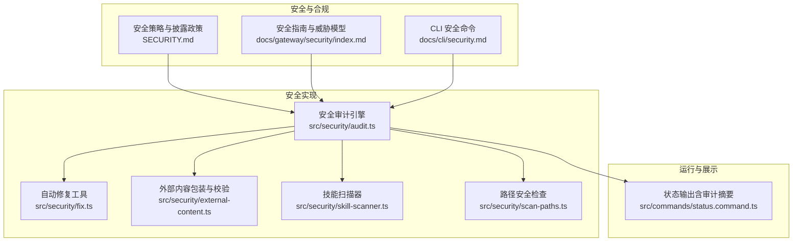
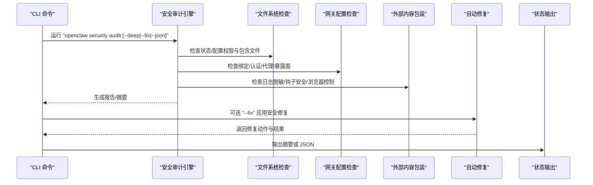
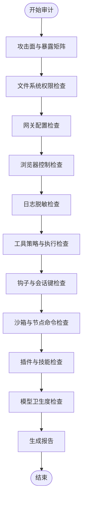
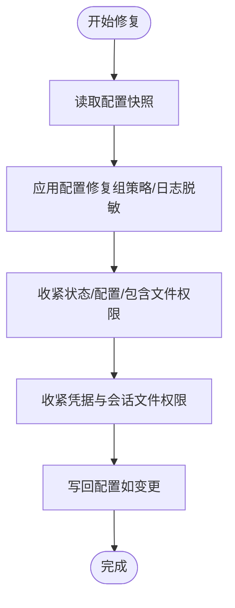
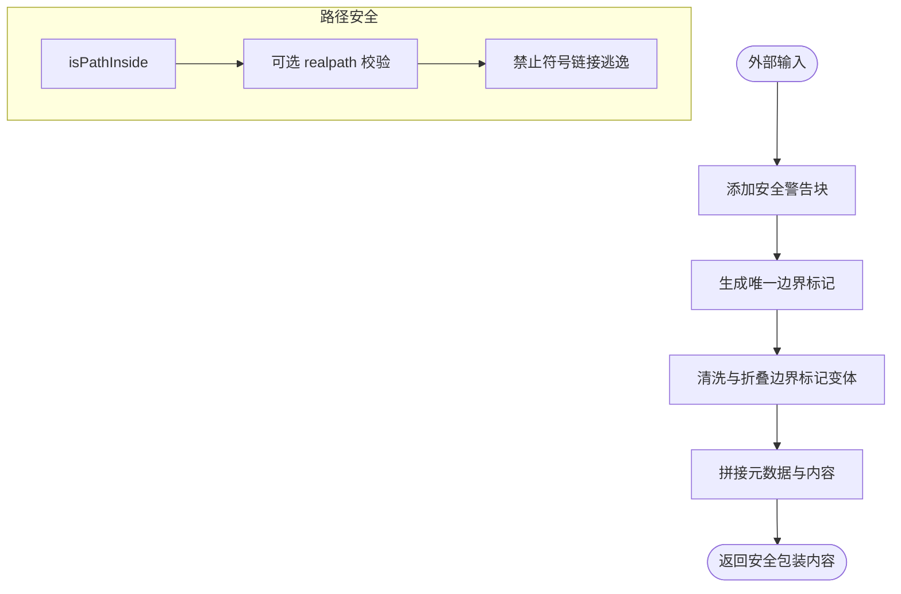
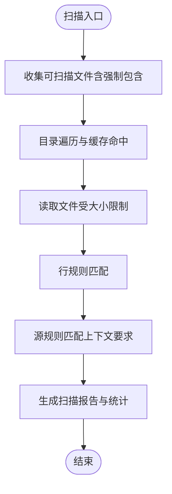
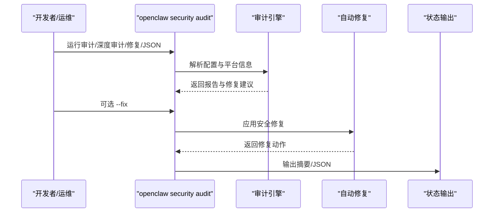
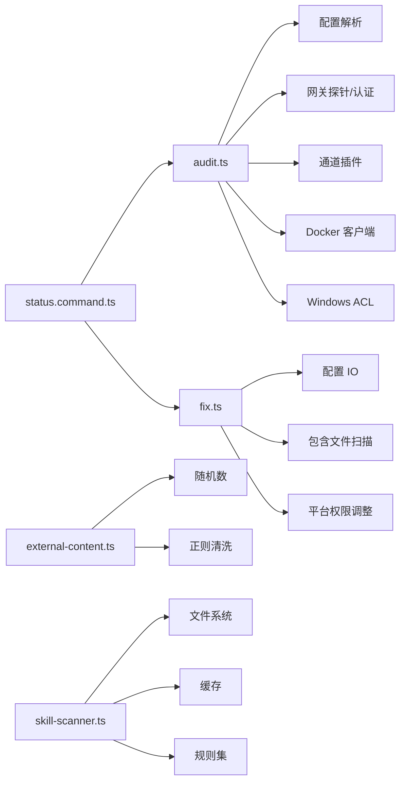

# 合规性与安全

<cite>
**本文引用的文件**
- [SECURITY.md](file://SECURITY.md)
- [docs/gateway/security/index.md](file://docs/gateway/security/index.md)
- [docs/cli/security.md](file://docs/cli/security.md)
- [src/security/audit.ts](file://src/security/audit.ts)
- [src/security/audit.test.ts](file://src/security/audit.test.ts)
- [src/security/fix.ts](file://src/security/fix.ts)
- [src/security/external-content.ts](file://src/security/external-content.ts)
- [src/security/scan-paths.ts](file://src/security/scan-paths.ts)
- [src/security/skill-scanner.ts](file://src/security/skill-scanner.ts)
- [src/commands/status.command.ts](file://src/commands/status.command.ts)
- [.detect-secrets.cfg](file://.detect-secrets.cfg)
- [.secrets.baseline](file://.secrets.baseline)
</cite>

## 目录

1. [简介](#简介)
2. [项目结构](#项目结构)
3. [核心组件](#核心组件)
4. [架构总览](#架构总览)
5. [详细组件分析](#详细组件分析)
6. [依赖关系分析](#依赖关系分析)
7. [性能考量](#性能考量)
8. [故障排查指南](#故障排查指南)
9. [结论](#结论)
10. [附录](#附录)

## 简介

本文件聚焦于 OpenClaw 的合规性与安全体系，系统阐述其安全模型、合规要求、风险控制与治理流程。内容覆盖数据保护、隐私合规、安全审计、漏洞管理、安全扫描、外部内容验证与路径安全检查，并提供合规性报告、安全监控与事件响应流程、合规检查清单、安全加固建议与最佳实践。

## 项目结构

围绕“安全即默认”的设计，OpenClaw 将安全能力内建到配置解析、运行时策略、工具执行与通道接入等关键环节，并通过 CLI 提供统一的安全审计与自动修复能力。

图示来源

- [SECURITY.md:1-288](file://SECURITY.md#L1-L288)
- [docs/gateway/security/index.md:1-800](file://docs/gateway/security/index.md#L1-L800)
- [docs/cli/security.md:43-72](file://docs/cli/security.md#L43-L72)
- [src/security/audit.ts:1131-1156](file://src/security/audit.ts#L1131-L1156)
- [src/security/fix.ts:387-478](file://src/security/fix.ts#L387-L478)
- [src/security/external-content.ts:239-346](file://src/security/external-content.ts#L239-L346)
- [src/security/skill-scanner.ts:521-584](file://src/security/skill-scanner.ts#L521-L584)
- [src/security/scan-paths.ts:4-43](file://src/security/scan-paths.ts#L4-L43)
- [src/commands/status.command.ts:473-508](file://src/commands/status.command.ts#L473-L508)

章节来源

- [SECURITY.md:1-288](file://SECURITY.md#L1-L288)
- [docs/gateway/security/index.md:1-800](file://docs/gateway/security/index.md#L1-L800)
- [docs/cli/security.md:43-72](file://docs/cli/security.md#L43-L72)
- [src/security/audit.ts:1131-1156](file://src/security/audit.ts#L1131-L1156)
- [src/security/fix.ts:387-478](file://src/security/fix.ts#L387-L478)
- [src/security/external-content.ts:239-346](file://src/security/external-content.ts#L239-L346)
- [src/security/skill-scanner.ts:521-584](file://src/security/skill-scanner.ts#L521-L584)
- [src/security/scan-paths.ts:4-43](file://src/security/scan-paths.ts#L4-L43)
- [src/commands/status.command.ts:473-508](file://src/commands/status.command.ts#L473-L508)

## 核心组件

- 安全策略与披露：明确漏洞上报流程、可接受范围、误报模式与信任模型，确保负责任披露与快速处置。
- 安全审计引擎：对网关暴露面、工具策略、浏览器控制、日志脱敏、沙箱配置、插件信任边界、工作区路径等进行系统性扫描与评分。
- 自动修复工具：在不改变网络暴露与权限策略的前提下，对常见高危配置进行安全修复（如组策略收紧、权限修正、日志脱敏）。
- 外部内容处理：对外部输入进行标记、警告与清洗，防止提示注入与边界绕过；支持多种来源类型与会话键识别。
- 技能扫描器：对技能源码进行静态扫描，识别危险调用、潜在数据外泄、混淆代码与环境变量读取等风险。
- 路径安全检查：提供路径包含判断与 realpath 校验，避免符号链接逃逸与目录遍历风险。
- CLI 与状态输出：提供安全审计命令、JSON 输出与摘要展示，便于 CI/CD 集成与运维监控。

章节来源

- [SECURITY.md:75-161](file://SECURITY.md#L75-L161)
- [src/security/audit.ts:56-113](file://src/security/audit.ts#L56-L113)
- [src/security/fix.ts:33-41](file://src/security/fix.ts#L33-L41)
- [src/security/external-content.ts:13-113](file://src/security/external-content.ts#L13-L113)
- [src/security/skill-scanner.ts:10-76](file://src/security/skill-scanner.ts#L10-L76)
- [src/security/scan-paths.ts:4-43](file://src/security/scan-paths.ts#L4-L43)
- [docs/cli/security.md:43-72](file://docs/cli/security.md#L43-L72)

## 架构总览

OpenClaw 的安全架构以“个人助理”信任模型为核心，强调最小授权、严格边界与纵深防御。安全审计贯穿配置解析、通道接入、工具执行与节点远程操作等关键路径。

图示来源

- [src/security/audit.ts:1131-1156](file://src/security/audit.ts#L1131-L1156)
- [src/security/fix.ts:387-478](file://src/security/fix.ts#L387-L478)
- [src/commands/status.command.ts:473-508](file://src/commands/status.command.ts#L473-L508)

章节来源

- [docs/gateway/security/index.md:15-48](file://docs/gateway/security/index.md#L15-L48)
- [src/security/audit.ts:1131-1156](file://src/security/audit.ts#L1131-L1156)
- [src/security/fix.ts:387-478](file://src/security/fix.ts#L387-L478)
- [src/commands/status.command.ts:473-508](file://src/commands/status.command.ts#L473-L508)

## 详细组件分析

### 安全审计引擎（Security Audit）

- 功能职责：收集攻击面、暴露矩阵、工具策略、日志脱敏、沙箱配置、节点命令、钩子安全、网关 HTTP 认证、会话键覆盖、模型卫生度、多用户启发式等发现项。
- 关键检查点：
  - 文件系统权限（状态目录、配置文件、包含文件、凭据目录与会话文件）。
  - 网关绑定与认证（bind/no-auth、loopback/no-auth、trusted-proxy、允许来源、Host 头回退、X-Real-IP 回退、mDNS 全量模式）。
  - 浏览器控制暴露（远程 CDP、无认证）。
  - 日志脱敏（logging.redactSensitive）。
  - 工具策略与执行（tools.profile、elevated、exec.host 与沙箱模式一致性、safeBins 配置）。
  - 插件与技能（插件可达工具、工作区 symlink 逃逸）。
  - 模型选择与小参数模型风险。
- 报告结构：包含时间戳、汇总统计（critical/warn/info）、逐条发现项（checkId、严重性、标题、详情、修复建议）以及深度探测结果（可选）。

图示来源

- [src/security/audit.ts:56-113](file://src/security/audit.ts#L56-L113)
- [src/security/audit.ts:208-337](file://src/security/audit.ts#L208-L337)
- [src/security/audit.ts:339-687](file://src/security/audit.ts#L339-L687)
- [src/security/audit.ts:1131-1156](file://src/security/audit.ts#L1131-L1156)

章节来源

- [src/security/audit.ts:56-113](file://src/security/audit.ts#L56-L113)
- [src/security/audit.ts:208-337](file://src/security/audit.ts#L208-L337)
- [src/security/audit.ts:339-687](file://src/security/audit.ts#L339-L687)
- [src/security/audit.ts:1131-1156](file://src/security/audit.ts#L1131-L1156)

### 自动修复工具（Security Fix）

- 功能职责：在不改变网络暴露与权限策略的前提下，对常见高危配置进行安全修复。
- 支持修复：
  - 组策略收紧（channels.\*.groupPolicy 从 open 切换为 allowlist）。
  - 日志脱敏（logging.redactSensitive 从 off 切换为 tools）。
  - 权限收紧（状态目录、配置文件、凭据目录、会话目录与会话文件）。
  - WhatsApp 分组允许来源回填（基于配对存储）。
- 行为特征：仅应用确定性、可逆且安全的修复；不旋转密钥、不禁用工具、不变更暴露面。

图示来源

- [src/security/fix.ts:276-303](file://src/security/fix.ts#L276-L303)
- [src/security/fix.ts:305-385](file://src/security/fix.ts#L305-L385)
- [src/security/fix.ts:387-478](file://src/security/fix.ts#L387-L478)

章节来源

- [src/security/fix.ts:276-303](file://src/security/fix.ts#L276-L303)
- [src/security/fix.ts:305-385](file://src/security/fix.ts#L305-L385)
- [src/security/fix.ts:387-478](file://src/security/fix.ts#L387-L478)

### 外部内容验证与路径安全

- 外部内容包装：
  - 使用唯一边界标记与安全警告块包裹外部输入（邮件、Webhook、API、浏览器、Web 搜索/抓取等）。
  - 对可能的边界标记伪造进行清洗与折叠（全角字符、角度括号同形异体）。
  - 支持根据会话键识别外部钩子来源（gmail/webhook 等）。
- 路径安全检查：
  - 判断候选路径是否位于目标基线路径内部，支持 realpath 校验与可选强制 realpath。
  - 扫描器跳过 node_modules 与隐藏目录，避免误报与性能问题。

图示来源

- [src/security/external-content.ts:239-346](file://src/security/external-content.ts#L239-L346)
- [src/security/scan-paths.ts:4-43](file://src/security/scan-paths.ts#L4-L43)

章节来源

- [src/security/external-content.ts:13-113](file://src/security/external-content.ts#L13-L113)
- [src/security/external-content.ts:239-346](file://src/security/external-content.ts#L239-L346)
- [src/security/scan-paths.ts:4-43](file://src/security/scan-paths.ts#L4-L43)

### 技能扫描器（Skill Scanner）

- 功能职责：对技能源码进行静态扫描，识别危险执行、动态代码执行、加密货币挖矿、可疑网络连接、潜在数据外泄、混淆代码与环境变量读取等风险。
- 规则分类：
  - 行规则：child_process 调用、eval/new Function、挖矿关键词、WebSocket 非标准端口。
  - 源规则：文件读取+网络发送组合、大段十六进制/编码负载、进程环境变量+网络发送组合。
- 性能优化：文件与目录条目缓存、最大扫描文件数与单文件大小限制、命中即止减少重复匹配。

图示来源

- [src/security/skill-scanner.ts:315-353](file://src/security/skill-scanner.ts#L315-L353)
- [src/security/skill-scanner.ts:433-457](file://src/security/skill-scanner.ts#L433-L457)
- [src/security/skill-scanner.ts:521-584](file://src/security/skill-scanner.ts#L521-L584)

章节来源

- [src/security/skill-scanner.ts:147-205](file://src/security/skill-scanner.ts#L147-L205)
- [src/security/skill-scanner.ts:218-309](file://src/security/skill-scanner.ts#L218-L309)
- [src/security/skill-scanner.ts:315-353](file://src/security/skill-scanner.ts#L315-L353)
- [src/security/skill-scanner.ts:433-457](file://src/security/skill-scanner.ts#L433-L457)
- [src/security/skill-scanner.ts:521-584](file://src/security/skill-scanner.ts#L521-L584)

### 安全监控与事件响应

- 安全审计命令：提供本地与深度探测、自动修复与 JSON 输出，便于 CI/CD 集成与自动化合规检查。
- 状态输出：在 CLI 中展示审计摘要与重要发现列表，便于快速定位高危项。
- 漏洞披露与处置：遵循安全策略中的披露流程、可接受门槛与误报判定，结合信任模型与风险分级进行处置。

图示来源

- [docs/cli/security.md:43-72](file://docs/cli/security.md#L43-L72)
- [src/commands/status.command.ts:473-508](file://src/commands/status.command.ts#L473-L508)
- [src/security/audit.ts:1131-1156](file://src/security/audit.ts#L1131-L1156)
- [src/security/fix.ts:387-478](file://src/security/fix.ts#L387-L478)

章节来源

- [docs/cli/security.md:43-72](file://docs/cli/security.md#L43-L72)
- [src/commands/status.command.ts:473-508](file://src/commands/status.command.ts#L473-L508)
- [src/security/audit.ts:1131-1156](file://src/security/audit.ts#L1131-L1156)
- [src/security/fix.ts:387-478](file://src/security/fix.ts#L387-L478)

## 依赖关系分析

- 审计引擎依赖配置解析、网关探针、通道插件、Docker 客户端与平台特定工具（Windows ACL），并通过选项注入支持测试隔离。
- 修复工具依赖配置 IO、包含文件扫描与平台权限调整（chmod/icacls）。
- 外部内容模块依赖随机数生成与正则表达式清洗。
- 技能扫描器依赖文件系统 API、缓存与规则集。
- CLI 与状态输出作为用户交互入口，串联审计与修复流程。

图示来源

- [src/security/audit.ts:1-56](file://src/security/audit.ts#L1-L56)
- [src/security/fix.ts:1-12](file://src/security/fix.ts#L1-L12)
- [src/security/external-content.ts:1-12](file://src/security/external-content.ts#L1-L12)
- [src/security/skill-scanner.ts:1-10](file://src/security/skill-scanner.ts#L1-L10)
- [src/commands/status.command.ts:473-508](file://src/commands/status.command.ts#L473-L508)

章节来源

- [src/security/audit.ts:1-56](file://src/security/audit.ts#L1-L56)
- [src/security/fix.ts:1-12](file://src/security/fix.ts#L1-L12)
- [src/security/external-content.ts:1-12](file://src/security/external-content.ts#L1-L12)
- [src/security/skill-scanner.ts:1-10](file://src/security/skill-scanner.ts#L1-L10)
- [src/commands/status.command.ts:473-508](file://src/commands/status.command.ts#L473-L508)

## 性能考量

- 审计引擎采用分层检查与可选深度探测，避免不必要的网络探测与资源消耗。
- 技能扫描器使用缓存与上限控制，减少磁盘 IO 与内存占用。
- 路径检查与 realpath 校验按需启用，降低跨文件系统开销。
- 自动修复工具仅对必要路径执行权限调整，避免冗余操作。

## 故障排查指南

- 常见误报与拒收：提示注入、多租户假设、Operator 控制面滥用、受信状态预置、HSTS 仅本地场景、签名验证已存在等情形通常被拒收。
- 审计摘要定位：优先处理“open + 工具启用”、“公网暴露”、“浏览器控制远程暴露”、“权限不当”、“插件/技能信任边界”、“模型选择”等高风险项。
- 修复优先级：先收紧组策略与日志脱敏，再处理权限与暴露面，最后考虑模型与策略微调。
- CI/CD 集成：使用 JSON 输出与严重级别过滤，结合自动修复与人工复核形成闭环。

章节来源

- [SECURITY.md:48-67](file://SECURITY.md#L48-L67)
- [docs/gateway/security/index.md:213-223](file://docs/gateway/security/index.md#L213-L223)
- [docs/cli/security.md:43-72](file://docs/cli/security.md#L43-L72)

## 结论

OpenClaw 以“个人助理”信任模型为基础，构建了从配置、通道、工具到节点的全链路安全控制体系。通过 CLI 安全审计与自动修复、外部内容包装、技能静态扫描与路径安全检查，实现了可观测、可修复、可演进的安全治理闭环。建议在生产环境中坚持最小授权、严格边界与纵深防御，配合定期审计与修复，持续提升整体安全态势。

## 附录

### 合规性检查清单（建议）

- 网络暴露与认证
  - 网关绑定仅 loopback 或尾网服务，未配置共享密钥则拒绝非本地访问
  - 非 loopback 场景必须配置可信代理与严格来源白名单
  - 控制 UI 明确允许来源，禁用 Host 头回退与设备身份豁免
- 工具与策略
  - 工具策略收紧至 messaging 或更严格档位，禁用 gateway/cron/sessions_spawn/sessions_send
  - 仅在必要时启用 elevated 工具，严格沙箱与执行审批
- 文件系统与凭据
  - 状态目录与配置文件权限收紧至 700/600
  - 凭据与会话文件权限收紧至 600
- 外部内容与输入
  - 钩子与 Web 输入默认启用安全包装，禁用 unsafe bypass 标志
  - 限制 web_search/web_fetch/browser 在工具启用场景下的使用
- 技能与插件
  - 仅加载可信插件，启用显式 allowlist
  - 定期扫描技能源码，识别危险调用与潜在泄露
- 模型与日志
  - 工具启用场景优先选用强模型，开启日志脱敏
  - 严格控制日志中敏感信息输出

### 安全加固建议

- 部署层面
  - 使用反向代理时正确配置 trustedProxies 与 X-Forwarded-\* 头
  - 限制容器能力与只读根文件系统，必要时启用 Docker 安全标签
  - 禁用 mDNS 全量模式或将其降级为 minimal
- 运行层面
  - 保持 Node.js 版本与安全补丁同步
  - 仅在受控网络内暴露网关，避免直接面向公网
  - 使用强令牌与速率限制，定期轮换密钥
- 开发与审计
  - 将安全审计纳入 CI/CD，结合 JSON 输出与严重级别过滤
  - 使用自动修复工具快速收敛常见高危配置
  - 对外部输入与第三方集成实施严格的内容包装与来源校验

### 合规性最佳实践

- 以“个人助理”模型为准绳，避免将共享网关用于多租户对抗场景
- 将“身份—范围—模型”作为访问控制三要素，优先锁定身份与范围
- 将提示注入视为软控制，硬控制由工具策略、沙箱与执行审批保障
- 将日志脱敏与最小化采集作为默认配置，避免敏感信息留存
- 将外部内容视为不受信输入，统一包装与溯源，避免直接拼接到系统提示
