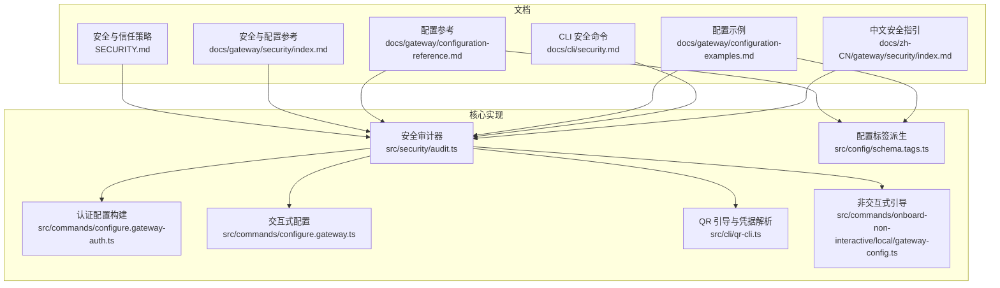
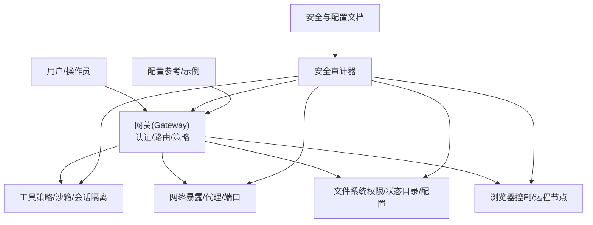
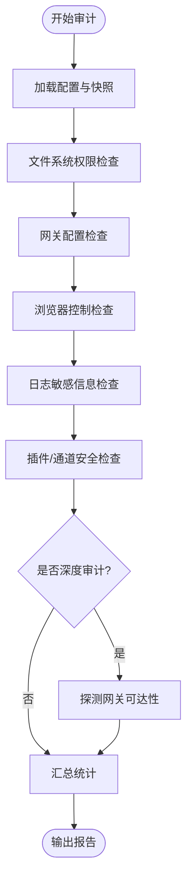
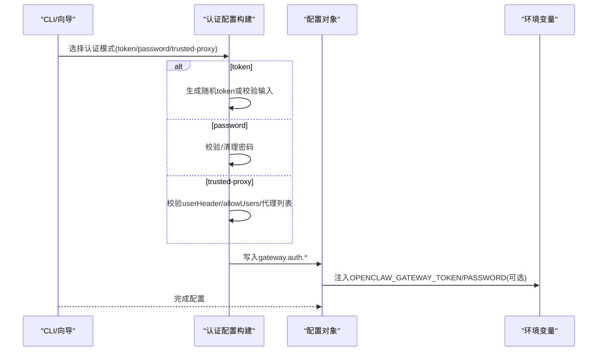
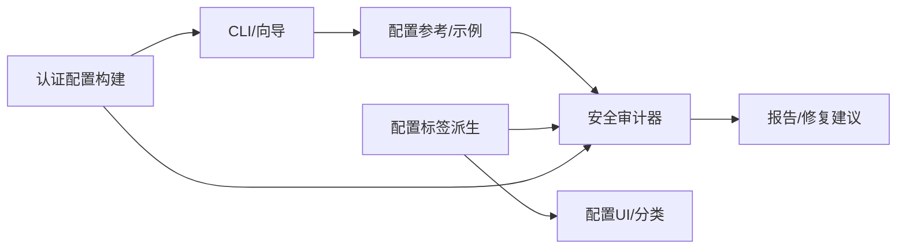

# 安全与配置

<cite>
**本文引用的文件**
- [SECURITY.md](file://SECURITY.md)
- [docs/gateway/security/index.md](file://docs/gateway/security/index.md)
- [docs/gateway/configuration-reference.md](file://docs/gateway/configuration-reference.md)
- [docs/gateway/configuration-examples.md](file://docs/gateway/configuration-examples.md)
- [src/security/audit.ts](file://src/security/audit.ts)
- [src/config/schema.tags.ts](file://src/config/schema.tags.ts)
- [src/commands/configure.gateway-auth.ts](file://src/commands/configure.gateway-auth.ts)
- [src/commands/configure.gateway.ts](file://src/commands/configure.gateway.ts)
- [src/cli/qr-cli.ts](file://src/cli/qr-cli.ts)
- [src/commands/onboard-non-interactive/local/gateway-config.ts](file://src/commands/onboard-non-interactive/local/gateway-config.ts)
- [docs/cli/security.md](file://docs/cli/security.md)
- [docs/zh-CN/gateway/security/index.md](file://docs/zh-CN/gateway/security/index.md)
- [.secrets.baseline](file://.secrets.baseline)
</cite>

## 目录

1. [简介](#简介)
2. [项目结构](#项目结构)
3. [核心组件](#核心组件)
4. [架构总览](#架构总览)
5. [详细组件分析](#详细组件分析)
6. [依赖关系分析](#依赖关系分析)
7. [性能考量](#性能考量)
8. [故障排除指南](#故障排除指南)
9. [结论](#结论)
10. [附录](#附录)

## 简介

本指南聚焦于 OpenClaw 的安全与配置体系，覆盖安全模型设计、权限控制机制、认证授权流程、配置文件结构与参数、安全审计与漏洞防护、合规性与最佳实践、多租户隔离与数据保护、访问控制与性能优化等内容。文档面向不同技术背景的读者，既提供高层概览，也给出可操作的配置示例与排障建议。

## 项目结构

OpenClaw 将安全与配置相关能力分布在多个层面：

- 文档层：官方安全与配置参考、中文本地化安全指引、CLI 安全命令说明
- 核心实现层：安全审计器、配置标签与派生逻辑、认证构建与解析
- 配置层：JSON5 配置文件、密钥与凭据管理、通道与工具策略

图表来源

- [SECURITY.md](file://SECURITY.md)
- [docs/gateway/security/index.md](file://docs/gateway/security/index.md)
- [docs/gateway/configuration-reference.md](file://docs/gateway/configuration-reference.md)
- [docs/gateway/configuration-examples.md](file://docs/gateway/configuration-examples.md)
- [docs/cli/security.md](file://docs/cli/security.md)
- [docs/zh-CN/gateway/security/index.md](file://docs/zh-CN/gateway/security/index.md)
- [src/security/audit.ts](file://src/security/audit.ts)
- [src/config/schema.tags.ts](file://src/config/schema.tags.ts)
- [src/commands/configure.gateway-auth.ts](file://src/commands/configure.gateway-auth.ts)
- [src/commands/configure.gateway.ts](file://src/commands/configure.gateway.ts)
- [src/cli/qr-cli.ts](file://src/cli/qr-cli.ts)
- [src/commands/onboard-non-interactive/local/gateway-config.ts](file://src/commands/onboard-non-interactive/local/gateway-config.ts)

章节来源

- [SECURITY.md](file://SECURITY.md)
- [docs/gateway/security/index.md](file://docs/gateway/security/index.md)
- [docs/gateway/configuration-reference.md](file://docs/gateway/configuration-reference.md)
- [docs/gateway/configuration-examples.md](file://docs/gateway/configuration-examples.md)
- [docs/cli/security.md](file://docs/cli/security.md)
- [docs/zh-CN/gateway/security/index.md](file://docs/zh-CN/gateway/security/index.md)
- [src/security/audit.ts](file://src/security/audit.ts)
- [src/config/schema.tags.ts](file://src/config/schema.tags.ts)
- [src/commands/configure.gateway-auth.ts](file://src/commands/configure.gateway-auth.ts)
- [src/commands/configure.gateway.ts](file://src/commands/configure.gateway.ts)
- [src/cli/qr-cli.ts](file://src/cli/qr-cli.ts)
- [src/commands/onboard-non-interactive/local/gateway-config.ts](file://src/commands/onboard-non-interactive/local/gateway-config.ts)

## 核心组件

- 安全审计器：扫描配置、网络暴露、权限、工具策略、浏览器控制、日志脱敏等，支持深度探测与自动修复建议
- 配置标签系统：为配置键派生“安全/认证/网络/访问/隐私/可观测性/性能/可靠性/存储/模型/媒体/自动化/通道/工具/高级”等标签，辅助 UI 分类与风险提示
- 认证配置构建：支持 token/password/trusted-proxy 三种模式，生成/校验/注入认证参数
- 配置示例与参考：提供最小可用、推荐入门、工作型、本地模型等配置模板，以及字段级参考
- 安全 CLI 命令：openclaw security audit 支持常规/深度/自动修复/JSON 输出
- 中文安全指引：补充本地化部署与风险处置要点

章节来源

- [src/security/audit.ts](file://src/security/audit.ts)
- [src/config/schema.tags.ts](file://src/config/schema.tags.ts)
- [src/commands/configure.gateway-auth.ts](file://src/commands/configure.gateway-auth.ts)
- [docs/gateway/configuration-reference.md](file://docs/gateway/configuration-reference.md)
- [docs/gateway/configuration-examples.md](file://docs/gateway/configuration-examples.md)
- [docs/cli/security.md](file://docs/cli/security.md)
- [docs/zh-CN/gateway/security/index.md](file://docs/zh-CN/gateway/security/index.md)

## 架构总览

OpenClaw 的安全与配置遵循“个人助理”信任模型：单用户/单网关边界，工具与策略决定可执行范围，模型行为通过策略与沙箱约束。安全审计器贯穿配置、网络、工具、浏览器控制、文件系统等多个面，形成闭环。

图表来源

- [src/security/audit.ts](file://src/security/audit.ts)
- [docs/gateway/security/index.md](file://docs/gateway/security/index.md)
- [docs/gateway/configuration-reference.md](file://docs/gateway/configuration-reference.md)
- [docs/gateway/configuration-examples.md](file://docs/gateway/configuration-examples.md)

## 详细组件分析

### 组件A：安全审计器

- 功能要点
  - 文件系统权限检查：状态目录、配置文件的可写/可读权限与符号链接风险
  - 网关配置检查：绑定模式、认证模式、受信代理、允许来源、Tailscale 模式、mDNS 模式、危险标志
  - 浏览器控制检查：远程 CDP 协议、认证缺失、无安全上下文
  - 日志敏感信息检查：redactSensitive 设置
  - 插件与通道安全：通道工具启用、文档/插件可达性
  - 深度探测：尝试探测网关可达性与安全上下文
- 处理流程

图表来源

- [src/security/audit.ts](file://src/security/audit.ts)

章节来源

- [src/security/audit.ts](file://src/security/audit.ts)

### 组件B：配置标签与派生

- 功能要点
  - 为配置键派生标签：如 security/auth/network/access/privacy/observability/performance/reliability/storage/models/media/automation/channels/tools/advanced
  - 关键字规则：token/password/secret/api-key/tlsfingerprint 等匹配 security/auth
  - 前缀规则：channels./tools./gateway./nodehost./discovery./auth./memory./models./diagnostics/logging./cron./talk./audio. 等映射到对应标签
  - 敏感性与高级标记：根据 UI 提示与关键字增强标签
- 使用场景
  - UI 分类与排序
  - 安全审计器快速定位高风险键
  - 配置变更影响面评估

章节来源

- [src/config/schema.tags.ts](file://src/config/schema.tags.ts)

### 组件C：认证配置构建与解析

- 功能要点
  - 支持三种认证模式：token/password/trusted-proxy
  - 从环境变量/SecretRef/明文生成/校验 token/password
  - trusted-proxy 模式要求 userHeader/allowUsers/受信代理列表
  - 与 QR 引导、非交互式引导配合，自动注入/解析远程凭据
- 流程图

图表来源

- [src/commands/configure.gateway-auth.ts](file://src/commands/configure.gateway-auth.ts)
- [src/commands/configure.gateway.ts](file://src/commands/configure.gateway.ts)
- [src/cli/qr-cli.ts](file://src/cli/qr-cli.ts)
- [src/commands/onboard-non-interactive/local/gateway-config.ts](file://src/commands/onboard-non-interactive/local/gateway-config.ts)

章节来源

- [src/commands/configure.gateway-auth.ts](file://src/commands/configure.gateway-auth.ts)
- [src/commands/configure.gateway.ts](file://src/commands/configure.gateway.ts)
- [src/cli/qr-cli.ts](file://src/cli/qr-cli.ts)
- [src/commands/onboard-non-interactive/local/gateway-config.ts](file://src/commands/onboard-non-interactive/local/gateway-config.ts)

### 组件D：配置参考与示例

- 字段级参考：通道、会话、工具、模型、网关、钩子、技能等
- 示例模板：最小可用、推荐入门、工作型、本地模型、多平台、安全 DM 模式等
- 关键安全建议
  - DM 策略：pairing/allowlist/open/disabled
  - 工具策略：tools.profile/messaging 或更严格；默认拒绝高危工具
  - 绑定与认证：gateway.bind=loopback；token/password；受信代理
  - 沙箱与工作区：agents.defaults.sandbox.mode；tools.fs.workspaceOnly
  - 日志脱敏：logging.redactSensitive

章节来源

- [docs/gateway/configuration-reference.md](file://docs/gateway/configuration-reference.md)
- [docs/gateway/configuration-examples.md](file://docs/gateway/configuration-examples.md)

### 组件E：中文安全指引

- 重点内容
  - 安全审计清单优先级：开放+工具 > 公网暴露 > 浏览器控制远程暴露 > 权限 > 插件 > 模型选择
  - 通过 HTTP 访问控制 UI 的安全上下文要求
  - 反向代理配置与受信代理
  - 危险标志与降级开关

章节来源

- [docs/zh-CN/gateway/security/index.md](file://docs/zh-CN/gateway/security/index.md)

## 依赖关系分析

- 安全审计器依赖配置解析、通道插件、浏览器配置、沙箱策略、Docker 标签检查等模块
- 配置标签系统被 UI 与审计器共同使用，提升分类与检索效率
- 认证构建器与 CLI 引导流程耦合，保证配置一致性与安全性

图表来源

- [src/security/audit.ts](file://src/security/audit.ts)
- [src/config/schema.tags.ts](file://src/config/schema.tags.ts)
- [src/commands/configure.gateway-auth.ts](file://src/commands/configure.gateway-auth.ts)
- [docs/gateway/configuration-reference.md](file://docs/gateway/configuration-reference.md)
- [docs/gateway/configuration-examples.md](file://docs/gateway/configuration-examples.md)

章节来源

- [src/security/audit.ts](file://src/security/audit.ts)
- [src/config/schema.tags.ts](file://src/config/schema.tags.ts)
- [src/commands/configure.gateway-auth.ts](file://src/commands/configure.gateway-auth.ts)
- [docs/gateway/configuration-reference.md](file://docs/gateway/configuration-reference.md)
- [docs/gateway/configuration-examples.md](file://docs/gateway/configuration-examples.md)

## 性能考量

- 安全审计的深度探测会增加耗时，建议在 CI 中使用 --json 与 --deep 结合阈值监控
- 工具策略与沙箱配置直接影响执行路径与资源占用，建议按需启用
- 日志脱敏级别影响 I/O 与内存，生产环境建议开启工具级脱敏
- 受信代理与 mDNS 模式对网络栈有额外开销，按需调整

## 故障排除指南

- 常见问题与定位
  - 网络暴露：gateway.bind 与 auth 缺失导致远程可访问且无认证
  - 浏览器控制：远程 CDP 使用 HTTP 未加密
  - 文件权限：配置/状态目录可写/可读
  - 工具策略：HTTP 暴露危险工具或通道工具未禁用
  - 受信代理：X-Forwarded-For 未正确设置或 allowRealIpFallback 导致源 IP 欺骗
- 自动修复
  - openclaw security audit --fix 会自动收紧 groupPolicy、redactSensitive、文件权限等
  - 不会旋转密钥、禁用工具、改变绑定/暴露策略
- CLI 输出
  - openclaw security audit --json 便于 CI 集成与阈值告警

章节来源

- [src/security/audit.ts](file://src/security/audit.ts)
- [docs/cli/security.md](file://docs/cli/security.md)
- [docs/gateway/security/index.md](file://docs/gateway/security/index.md)

## 结论

OpenClaw 的安全与配置体系以“个人助理”信任模型为核心，强调“身份优先、作用域次之、模型最后”。通过严格的工具策略、沙箱与会话隔离、受信代理与最小暴露、安全审计与自动修复，可在复杂运行环境中维持可控的安全基线。建议在生产环境采用最小权限原则、强认证、最小暴露与持续审计，并结合中文本地化指引与 CLI 工具形成闭环。

## 附录

### A. 安全模型与信任边界

- 网关与节点：网关为控制面，节点为远程执行扩展；经配对后节点动作视为受信操作
- 会话标识：sessionKey 为路由选择器，非授权令牌
- 多用户/多租户：不作为对抗性多租户边界；需要隔离时应拆分信任边界

章节来源

- [SECURITY.md](file://SECURITY.md)
- [docs/gateway/security/index.md](file://docs/gateway/security/index.md)

### B. 认证授权流程

- 模式选择：token/password/trusted-proxy
- 受信代理：要求 userHeader/allowUsers/受信代理列表
- 令牌轮换：doctor 与 CLI 支持生成新令牌并验证旧令牌失效

章节来源

- [src/commands/configure.gateway-auth.ts](file://src/commands/configure.gateway-auth.ts)
- [src/commands/configure.gateway.ts](file://src/commands/configure.gateway.ts)
- [src/cli/qr-cli.ts](file://src/cli/qr-cli.ts)
- [src/commands/onboard-non-interactive/local/gateway-config.ts](file://src/commands/onboard-non-interactive/local/gateway-config.ts)

### C. 配置示例与最佳实践

- 最小可用：仅启用必要通道与最小工具集
- 推荐入门：明确身份、模型与通道策略
- 工作型：限制工具、启用沙箱、最小暴露
- 本地模型：减少外部依赖，降低泄露面
- 安全 DM 模式：per-channel-peer 隔离跨用户上下文

章节来源

- [docs/gateway/configuration-examples.md](file://docs/gateway/configuration-examples.md)
- [docs/gateway/configuration-reference.md](file://docs/gateway/configuration-reference.md)

### D. 安全审计清单与优先级

- 优先级：开放+工具 > 公网暴露 > 浏览器控制远程暴露 > 权限 > 插件 > 模型选择
- 关键检查点：受信代理、allowedOrigins、device auth、mDNS full 模式、dangerous flags

章节来源

- [docs/zh-CN/gateway/security/index.md](file://docs/zh-CN/gateway/security/index.md)
- [src/security/audit.ts](file://src/security/audit.ts)

### E. 密钥与凭据管理

- SecretRef 与凭据矩阵：严格用户提供的凭据表面，避免运行时生成/轮转凭据
- 基线扫描：detect-secrets 基线与扫描脚本

章节来源

- [.secrets.baseline](file://.secrets.baseline)
