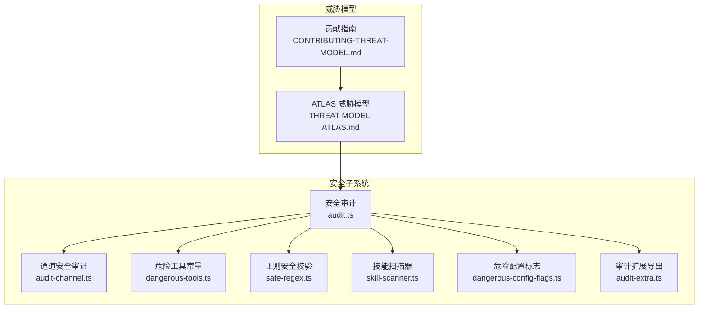
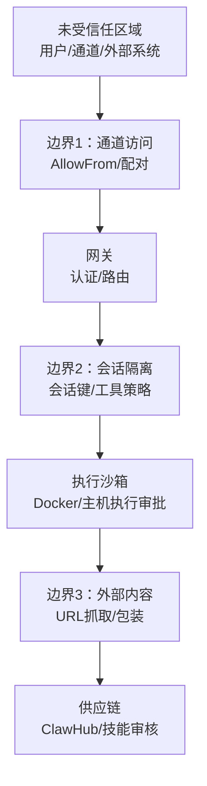
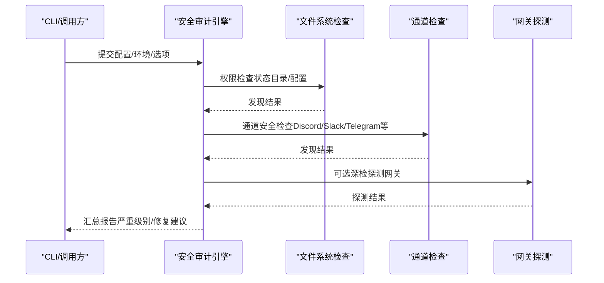
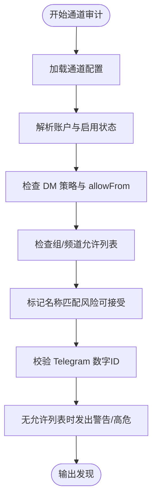
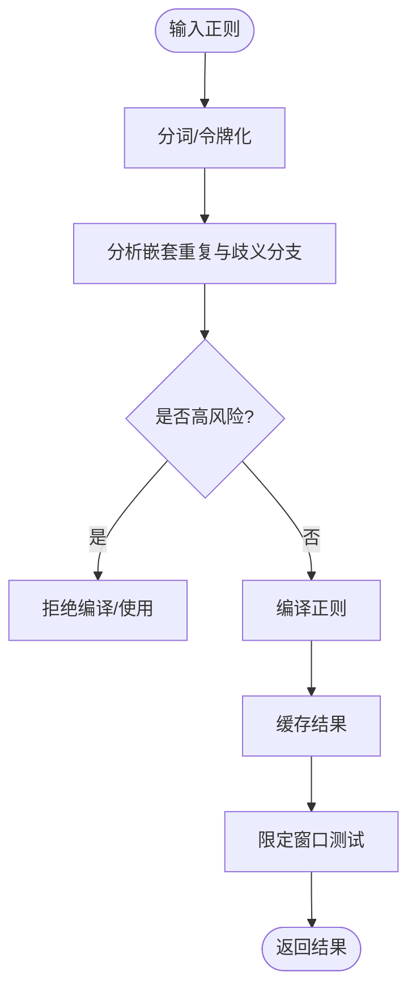
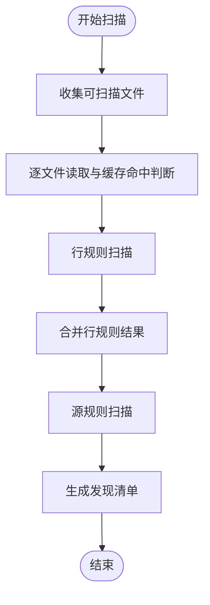
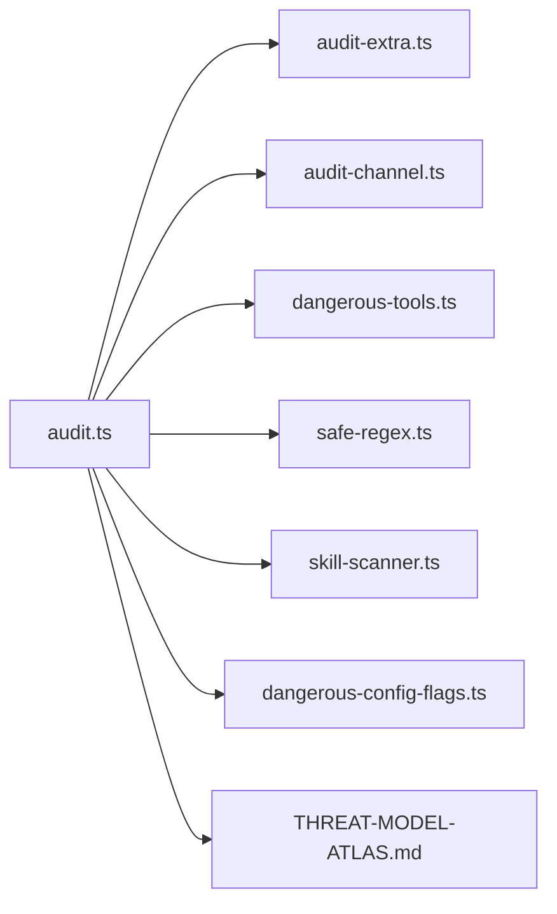

# 安全模型设计

<cite>
**本文档引用的文件**
- [SECURITY.md](file://SECURITY.md)
- [audit.ts](file://src/security/audit.ts)
- [audit-channel.ts](file://src/security/audit-channel.ts)
- [dangerous-tools.ts](file://src/security/dangerous-tools.ts)
- [safe-regex.ts](file://src/security/safe-regex.ts)
- [skill-scanner.ts](file://src/security/skill-scanner.ts)
- [THREAT-MODEL-ATLAS.md](file://docs/security/THREAT-MODEL-ATLAS.md)
- [CONTRIBUTING-THREAT-MODEL.md](file://docs/security/CONTRIBUTING-THREAT-MODEL.md)
- [dangerous-config-flags.ts](file://src/security/dangerous-config-flags.ts)
- [audit-extra.ts](file://src/security/audit-extra.ts)
- [audit.test.ts](file://src/security/audit.test.ts)
- [skill-scanner.test.ts](file://src/security/skill-scanner.test.ts)
</cite>

## 目录

1. [引言](#引言)
2. [项目结构](#项目结构)
3. [核心组件](#核心组件)
4. [架构总览](#架构总览)
5. [详细组件分析](#详细组件分析)
6. [依赖关系分析](#依赖关系分析)
7. [性能考虑](#性能考虑)
8. [故障排除指南](#故障排除指南)
9. [结论](#结论)
10. [附录](#附录)

## 引言

本文件系统性阐述 OpenClaw 的安全模型设计与实现，覆盖安全审计机制、危险工具检测、正则表达式安全验证、通道安全策略、安全扫描器工作原理、威胁检测算法与风险评估标准，并给出安全边界定义、威胁防护机制、配置示例、最佳实践与常见问题解决方案。OpenClaw 的安全模型以“受信任操作员”为核心假设，强调通过认证、授权、工具策略、沙箱与执行审批等多层边界构建纵深防御。

## 项目结构

OpenClaw 将安全能力按职责拆分到多个模块：

- 安全审计：集中于 src/security 下，提供网关、通道、文件系统、插件、技能等维度的审计与修复建议
- 威胁模型：以 MITRE ATLAS 框架描述攻击面、威胁与缓解
- 危险工具与正则：对高危工具进行默认拒绝与正则安全校验
- 技能扫描：对技能源码进行静态规则扫描，识别潜在危险模式

**图表来源**

- [audit.ts:1-1254](file://src/security/audit.ts#L1-L1254)
- [audit-channel.ts:1-726](file://src/security/audit-channel.ts#L1-L726)
- [dangerous-tools.ts:1-40](file://src/security/dangerous-tools.ts#L1-L40)
- [safe-regex.ts:1-333](file://src/security/safe-regex.ts#L1-L333)
- [skill-scanner.ts:1-584](file://src/security/skill-scanner.ts#L1-L584)
- [dangerous-config-flags.ts:1-29](file://src/security/dangerous-config-flags.ts#L1-L29)
- [audit-extra.ts:1-41](file://src/security/audit-extra.ts#L1-L41)
- [THREAT-MODEL-ATLAS.md:1-604](file://docs/security/THREAT-MODEL-ATLAS.md#L1-L604)
- [CONTRIBUTING-THREAT-MODEL.md:1-91](file://docs/security/CONTRIBUTING-THREAT-MODEL.md#L1-L91)

**章节来源**

- [audit.ts:1-1254](file://src/security/audit.ts#L1-L1254)
- [audit-channel.ts:1-726](file://src/security/audit-channel.ts#L1-L726)
- [dangerous-tools.ts:1-40](file://src/security/dangerous-tools.ts#L1-L40)
- [safe-regex.ts:1-333](file://src/security/safe-regex.ts#L1-L333)
- [skill-scanner.ts:1-584](file://src/security/skill-scanner.ts#L1-L584)
- [dangerous-config-flags.ts:1-29](file://src/security/dangerous-config-flags.ts#L1-L29)
- [audit-extra.ts:1-41](file://src/security/audit-extra.ts#L1-L41)
- [THREAT-MODEL-ATLAS.md:1-604](file://docs/security/THREAT-MODEL-ATLAS.md#L1-L604)
- [CONTRIBUTING-THREAT-MODEL.md:1-91](file://docs/security/CONTRIBUTING-THREAT-MODEL.md#L1-L91)

## 核心组件

- 安全审计引擎：统一收集与汇总各类安全发现，支持深检（deep）探测网关可达性与状态
- 通道安全审计：针对 Discord、Slack、Telegram 等通道的允许列表、DM 策略、名称匹配风险等进行检查
- 危险工具与通道：默认拒绝高危工具通过 HTTP 调用；通道命令启用时强制要求发送者白名单
- 正则安全校验：解析与分析正则表达式，避免嵌套重复导致的回溯膨胀（ReDoS）
- 技能扫描器：对技能源码进行静态扫描，识别动态代码执行、环境变量读取、可疑网络行为等
- 危险配置标志：检测控制界面与钩子中不安全或危险的开关配置
- 威胁模型：基于 MITRE ATLAS 的系统化威胁建模与风险矩阵

**章节来源**

- [audit.ts:1-1254](file://src/security/audit.ts#L1-L1254)
- [audit-channel.ts:1-726](file://src/security/audit-channel.ts#L1-L726)
- [dangerous-tools.ts:1-40](file://src/security/dangerous-tools.ts#L1-L40)
- [safe-regex.ts:1-333](file://src/security/safe-regex.ts#L1-L333)
- [skill-scanner.ts:1-584](file://src/security/skill-scanner.ts#L1-L584)
- [dangerous-config-flags.ts:1-29](file://src/security/dangerous-config-flags.ts#L1-L29)
- [THREAT-MODEL-ATLAS.md:1-604](file://docs/security/THREAT-MODEL-ATLAS.md#L1-L604)

## 架构总览

OpenClaw 的安全边界由“受信任操作员”模型驱动，围绕网关、会话、工具执行、外部内容与供应链五道防线构建：

**图表来源**

- [THREAT-MODEL-ATLAS.md:56-123](file://docs/security/THREAT-MODEL-ATLAS.md#L56-L123)

**章节来源**

- [THREAT-MODEL-ATLAS.md:56-123](file://docs/security/THREAT-MODEL-ATLAS.md#L56-L123)

## 详细组件分析

### 安全审计引擎（audit.ts）

- 统一入口：接收配置、环境、平台信息，按需执行文件系统、通道、网关等检查
- 深度探测：可选探测网关可达性、错误与关闭原因，输出深检报告
- 发现计数：按严重级别统计（critical/warn/info），便于快速定位
- 关键检查点：
  - 网关绑定与认证：非 loopback 绑定且无认证为高危；允许 Host 头 Origin 回退为高危
  - 控制界面安全：禁用设备认证、允许不安全认证等为高危
  - mDNS 全量模式、Tailscale 暴露模式等为高危
  - 浏览器控制端口鉴权缺失为高危
  - 配置文件与状态目录权限异常为严重
  - 危险配置标志检测

**图表来源**

- [audit.ts:1-1254](file://src/security/audit.ts#L1-L1254)

**章节来源**

- [audit.ts:1-1254](file://src/security/audit.ts#L1-L1254)

### 通道安全策略（audit-channel.ts）

- 允许列表与 DM 策略：对 Discord/Slack/Telegram 等通道检查 DM 策略、组策略、允许列表一致性
- 名称匹配风险：Discord 名称/标签匹配在危险模式下使用时标记为“可接受的风险”
- Telegram 数字 ID 校验：非数字 ID 的 allowFrom 条目视为无效
- Slack/Discord 原生命令：当启用原生命令但未配置允许列表时发出警告/高危提示
- DM 作用域：主会话共享 DM 会话可能造成上下文泄露，建议按发送者隔离

**图表来源**

- [audit-channel.ts:1-726](file://src/security/audit-channel.ts#L1-L726)

**章节来源**

- [audit-channel.ts:1-726](file://src/security/audit-channel.ts#L1-L726)

### 危险工具与通道（dangerous-tools.ts）

- 默认 HTTP 拒绝：对会话编排、跨会话注入、网关控制平面、交互式登录等高危工具，默认禁止通过 HTTP 调用
- ACP 工具审批：对 exec/spawn/shell/sessions\_\* 等工具要求显式用户审批
- 通道命令与允许列表：启用原生命令时必须配置允许列表，否则存在越权风险

**章节来源**

- [dangerous-tools.ts:1-40](file://src/security/dangerous-tools.ts#L1-L40)

### 正则表达式安全验证（safe-regex.ts）

- 解析与分析：将正则分解为令牌，识别嵌套重复与歧义分支，判定是否存在指数级回溯风险
- 缓存与窗口：带缓存的编译与测试，限制输入窗口以降低长输入带来的开销
- 安全编译：仅在通过“嵌套重复”检查后才尝试编译，避免 ReDoS

**图表来源**

- [safe-regex.ts:1-333](file://src/security/safe-regex.ts#L1-L333)

**章节来源**

- [safe-regex.ts:1-333](file://src/security/safe-regex.ts#L1-L333)

### 技能扫描器（skill-scanner.ts）

- 扫描范围：支持 JS/TS/JSX/TSX 等扩展名，内置文件大小与数量上限，带缓存优化
- 规则集：
  - 行规则：child_process 动态执行、eval/new Function、挖矿关键词、WebSocket 非标准端口
  - 源规则：文件读取+网络发送组合、十六进制/大长度 base64 解码、环境变量读取+网络发送
- 输出：每条发现包含规则ID、严重级别、文件路径、行号、证据片段

**图表来源**

- [skill-scanner.ts:1-584](file://src/security/skill-scanner.ts#L1-L584)

**章节来源**

- [skill-scanner.ts:1-584](file://src/security/skill-scanner.ts#L1-L584)

### 危险配置标志（dangerous-config-flags.ts）

- 控制界面：allowInsecureAuth、dangerouslyAllowHostHeaderOriginFallback、dangerouslyDisableDeviceAuth
- 钩子：gmail.allowUnsafeExternalContent、hooks.mappings[*].allowUnsafeExternalContent
- 工具：tools.exec.applyPatch.workspaceOnly=false
- 审计输出：列出所有启用的危险标志，指导关闭或限制暴露

**章节来源**

- [dangerous-config-flags.ts:1-29](file://src/security/dangerous-config-flags.ts#L1-L29)

### 威胁模型与风险评估（THREAT-MODEL-ATLAS.md）

- MITRE ATLAS 框架：从侦察、初始访问、执行、持久化、规避、发现、数据窃取与影响等维度建模
- 关键威胁与攻击链：
  - 直接/间接提示注入 → 执行审批绕过 → 远程命令执行
  - 技能发布 → 模式规避 → 凭证窃取
  - 伪装内容 → 外部抓取 → 数据外泄
- 风险矩阵：结合可能性与影响，给出优先级（P0/P1/P2）

**章节来源**

- [THREAT-MODEL-ATLAS.md:1-604](file://docs/security/THREAT-MODEL-ATLAS.md#L1-L604)

## 依赖关系分析

**图表来源**

- [audit.ts:1-1254](file://src/security/audit.ts#L1-L1254)
- [audit-extra.ts:1-41](file://src/security/audit-extra.ts#L1-L41)
- [audit-channel.ts:1-726](file://src/security/audit-channel.ts#L1-L726)
- [dangerous-tools.ts:1-40](file://src/security/dangerous-tools.ts#L1-L40)
- [safe-regex.ts:1-333](file://src/security/safe-regex.ts#L1-L333)
- [skill-scanner.ts:1-584](file://src/security/skill-scanner.ts#L1-L584)
- [dangerous-config-flags.ts:1-29](file://src/security/dangerous-config-flags.ts#L1-L29)
- [THREAT-MODEL-ATLAS.md:1-604](file://docs/security/THREAT-MODEL-ATLAS.md#L1-L604)

**章节来源**

- [audit.ts:1-1254](file://src/security/audit.ts#L1-L1254)
- [audit-extra.ts:1-41](file://src/security/audit-extra.ts#L1-L41)
- [audit-channel.ts:1-726](file://src/security/audit-channel.ts#L1-L726)
- [dangerous-tools.ts:1-40](file://src/security/dangerous-tools.ts#L1-L40)
- [safe-regex.ts:1-333](file://src/security/safe-regex.ts#L1-L333)
- [skill-scanner.ts:1-584](file://src/security/skill-scanner.ts#L1-L584)
- [dangerous-config-flags.ts:1-29](file://src/security/dangerous-config-flags.ts#L1-L29)
- [THREAT-MODEL-ATLAS.md:1-604](file://docs/security/THREAT-MODEL-ATLAS.md#L1-L604)

## 性能考虑

- 缓存与去重：文件扫描缓存、目录条目缓存、发现去重，显著降低重复扫描成本
- 输入窗口限制：正则测试限制窗口大小，避免超长输入导致的性能问题
- 并发与批处理：通道扫描支持批量处理，减少 I/O 开销
- 深度探测：深检仅在明确启用时执行，避免不必要的网络探测

[本节为通用性能讨论，无需特定文件引用]

## 故障排除指南

- 常见误报与不予受理场景：提示注入无边界绕过、受信任操作员触发本地动作、仅启发式差异等
- 审计发现核查：核对配置路径、状态目录权限、通道允许列表一致性、危险配置标志
- 通道问题定位：
  - Discord：名称匹配启用、无允许列表、组策略开放
  - Slack：useAccessGroups 关闭、无允许列表
  - Telegram：非数字 ID、通配符允许列表、无发送者允许列表
- 技能扫描：关注动态代码执行、环境变量读取+网络发送、可疑 WebSocket 端口

**章节来源**

- [SECURITY.md:48-131](file://SECURITY.md#L48-L131)
- [audit-channel.ts:200-726](file://src/security/audit-channel.ts#L200-L726)
- [skill-scanner.ts:147-205](file://src/security/skill-scanner.ts#L147-L205)

## 结论

OpenClaw 的安全模型以“受信任操作员”为基础，通过认证、授权、工具策略、沙箱与执行审批构建多层边界；同时以 MITRE ATLAS 为框架进行系统化威胁建模，配合安全审计、通道安全检查、正则安全校验与技能扫描器形成闭环。建议在生产环境中默认启用沙箱、严格限制通道允许列表、关闭危险配置标志，并定期运行安全审计与技能扫描。

[本节为总结性内容，无需特定文件引用]

## 附录

### 安全配置示例与最佳实践

- 网关绑定与认证
  - 默认绑定 loopback，启用强令牌或密码认证
  - 非 loopback 绑定时配置严格的速率限制与可信代理
- 控制界面安全
  - 禁用 allowInsecureAuth 与 Host 头 Origin 回退
  - 不要禁用设备认证（dangerouslyDisableDeviceAuth）
- 通道安全
  - 启用原生命令时必须配置 allowFrom 或 per-guild/channel 用户允许列表
  - Telegram 使用纯数字用户 ID，避免通配符
- 技能与工具
  - 限制 apply_patch 仅在工作区执行（workspaceOnly）
  - 对危险工具（exec/spawn/shell/sessions\_\*）要求显式审批
- 正则与输入
  - 使用 safe-regex 编写正则，避免嵌套重复与歧义分支
  - 对自定义正则设置输入窗口限制

**章节来源**

- [SECURITY.md:207-244](file://SECURITY.md#L207-L244)
- [dangerous-tools.ts:1-40](file://src/security/dangerous-tools.ts#L1-L40)
- [dangerous-config-flags.ts:1-29](file://src/security/dangerous-config-flags.ts#L1-L29)
- [safe-regex.ts:1-333](file://src/security/safe-regex.ts#L1-L333)

### 威胁检测算法与风险评估

- MITRE ATLAS 分类映射：将提示注入、供应链、执行、持久化、规避、发现、窃取与影响等归类
- 攻击链：直接/间接提示注入 → 执行审批绕过 → 远程命令执行；技能发布 → 模式规避 → 凭证窃取
- 风险矩阵：结合可能性与影响，给出 P0/P1/P2 优先级

**章节来源**

- [THREAT-MODEL-ATLAS.md:138-504](file://docs/security/THREAT-MODEL-ATLAS.md#L138-L504)

### 测试与验证参考

- 通道安全审计测试：验证 Slack/Discord 无允许列表时的告警行为
- 技能扫描测试：覆盖动态代码执行、环境变量读取+网络发送、可疑端口等规则

**章节来源**

- [audit.test.ts:1922-2120](file://src/security/audit.test.ts#L1922-L2120)
- [skill-scanner.test.ts:1-200](file://src/security/skill-scanner.test.ts#L1-L200)
