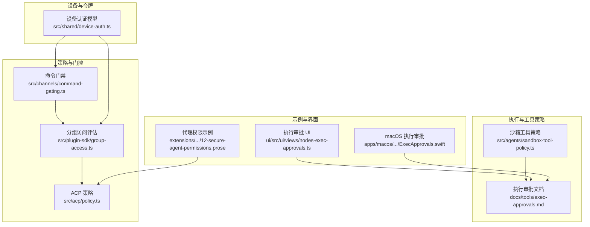
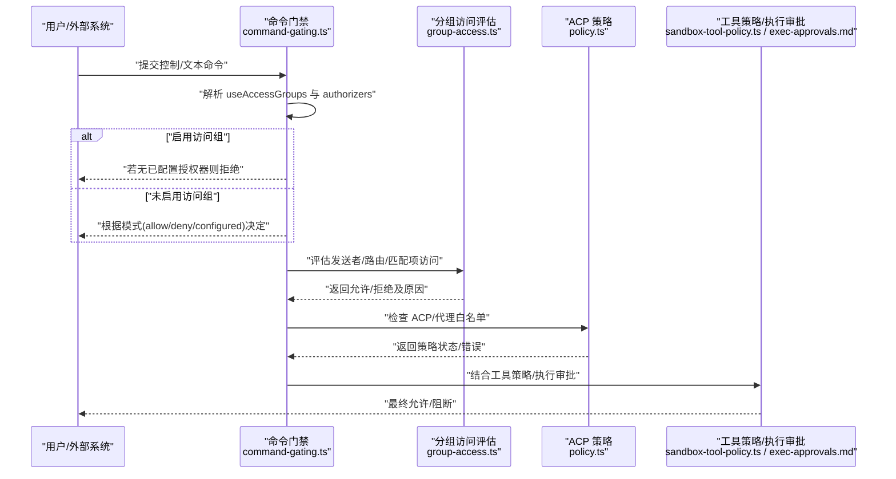
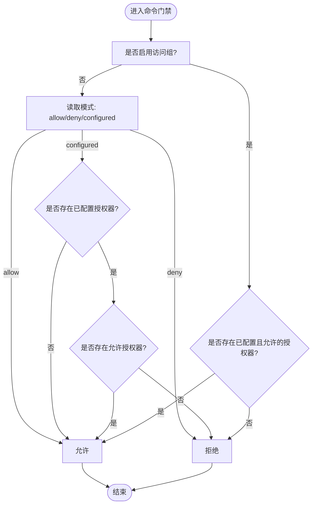
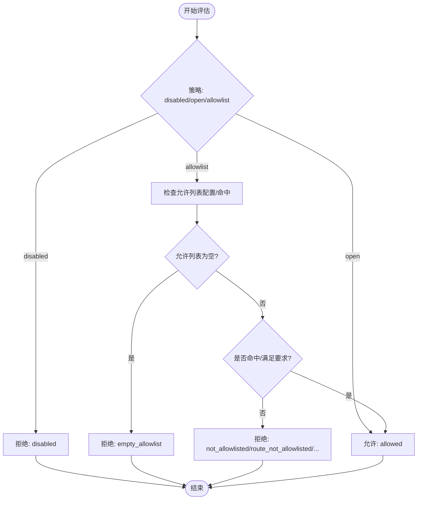
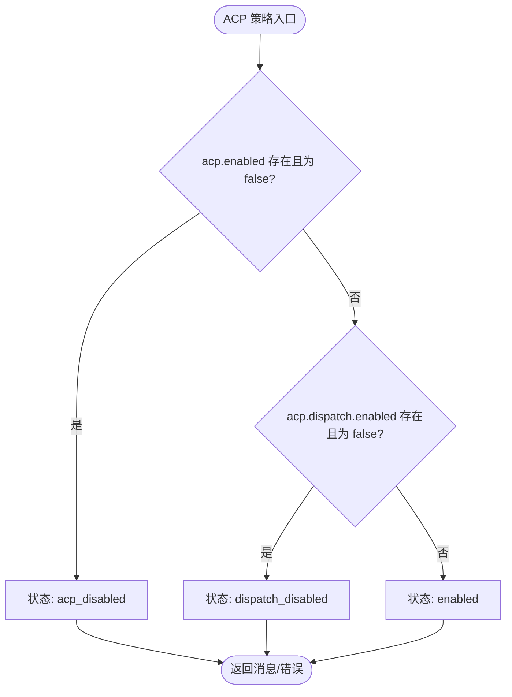
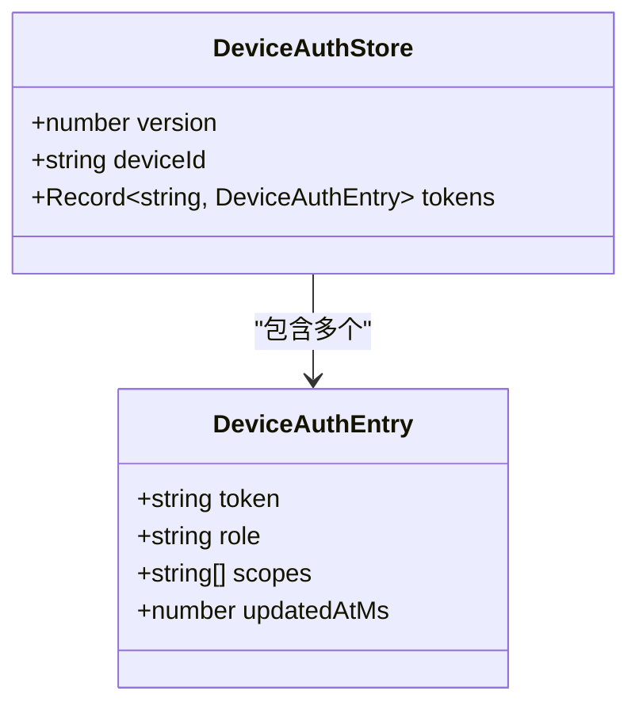
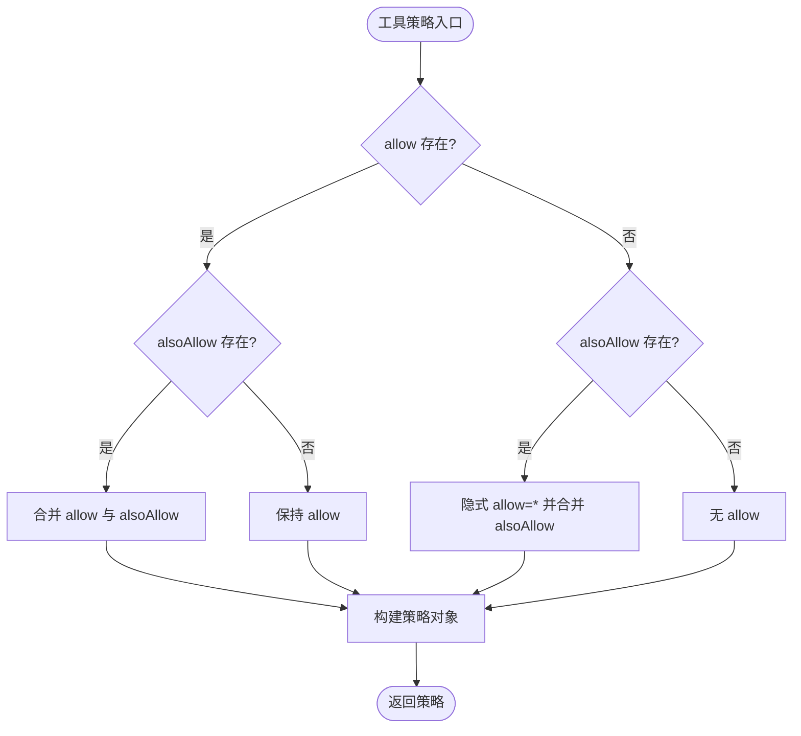
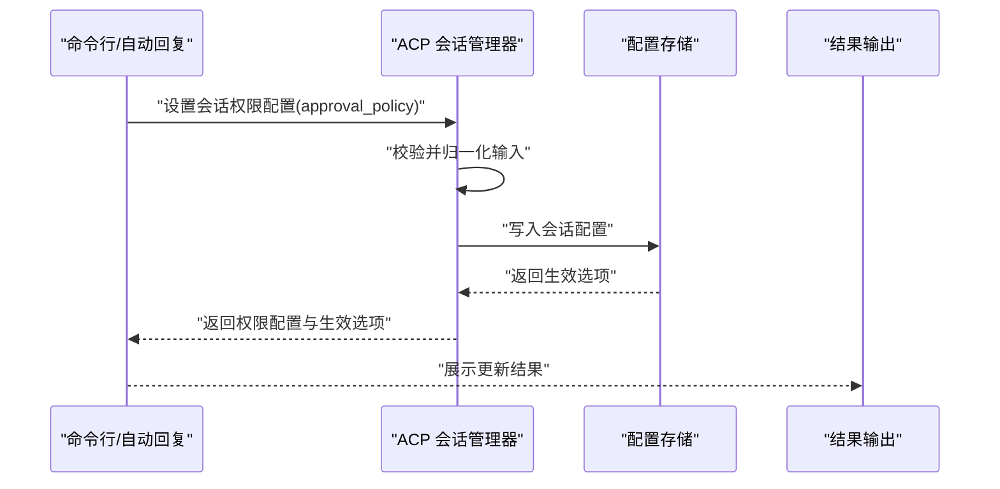
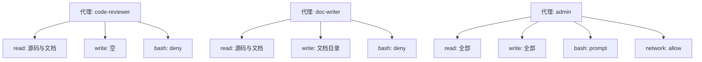
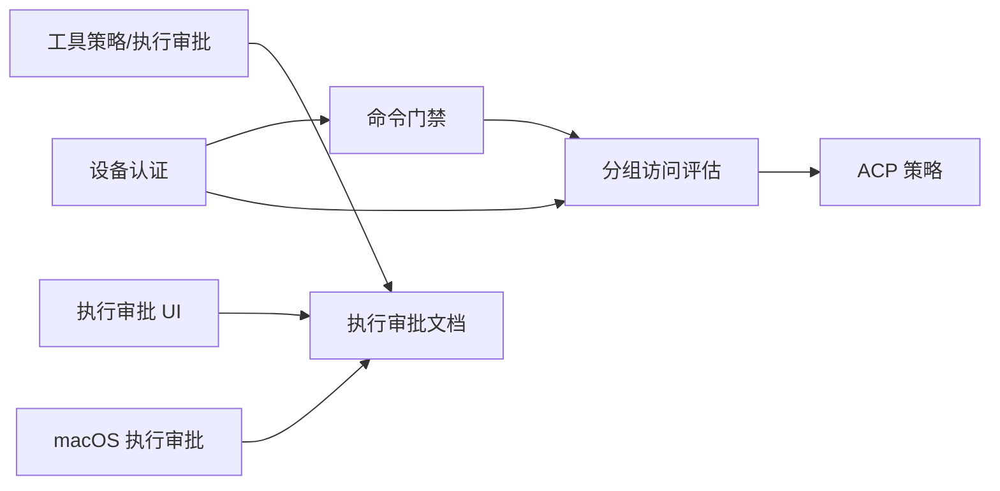

# 基于角色的访问控制

<cite>
**本文引用的文件**   
- [src/channels/command-gating.ts](file://src/channels/command-gating.ts)
- [src/channels/command-gating.test.ts](file://src/channels/command-gating.test.ts)
- [src/shared/device-auth.ts](file://src/shared/device-auth.ts)
- [src/acp/policy.ts](file://src/acp/policy.ts)
- [src/acp/policy.test.ts](file://src/acp/policy.test.ts)
- [src/acp/control-plane/runtime-options.ts](file://src/acp/control-plane/runtime-options.ts)
- [src/auto-reply/reply/commands-acp/runtime-options.ts](file://src/auto-reply/reply/commands-acp/runtime-options.ts)
- [src/plugin-sdk/group-access.ts](file://src/plugin-sdk/group-access.ts)
- [src/plugin-sdk/group-access.test.ts](file://src/plugin-sdk/group-access.test.ts)
- [src/security/dm-policy-shared.ts](file://src/security/dm-policy-shared.ts)
- [src/agents/sandbox-tool-policy.ts](file://src/agents/sandbox-tool-policy.ts)
- [src/agents/sandbox-explain.test.ts](file://src/agents/sandbox-explain.test.ts)
- [src/agents/pi-tools.policy.ts](file://src/agents/pi-tools.policy.ts)
- [docs/tools/exec-approvals.md](file://docs/tools/exec-approvals.md)
- [SECURITY.md](file://SECURITY.md)
- [extensions/open-prose/skills/prose/examples/12-secure-agent-permissions.prose](file://extensions/open-prose/skills/prose/examples/12-secure-agent-permissions.prose)
- [apps/macos/Sources/OpenClaw/PermissionsSettings.swift](file://apps/macos/Sources/OpenClaw/PermissionsSettings.swift)
- [apps/macos/Sources/OpenClaw/SystemRunSettingsView.swift](file://apps/macos/Sources/OpenClaw/SystemRunSettingsView.swift)
- [apps/macos/Sources/OpenClaw/ExecApprovals.swift](file://apps/macos/Sources/OpenClaw/ExecApprovals.swift)
- [ui/src/ui/views/nodes-exec-approvals.ts](file://ui/src/ui/views/nodes-exec-approvals.ts)
</cite>

## 目录

1. [简介](#简介)
2. [项目结构](#项目结构)
3. [核心组件](#核心组件)
4. [架构总览](#架构总览)
5. [详细组件分析](#详细组件分析)
6. [依赖关系分析](#依赖关系分析)
7. [性能考量](#性能考量)
8. [故障排查指南](#故障排查指南)
9. [结论](#结论)
10. [附录](#附录)

## 简介

本文件系统化梳理并阐述本仓库中的“基于角色的访问控制（RBAC）”相关设计与实现，重点覆盖以下方面：

- 角色与权限模型：角色、作用域（scopes）、设备令牌与访问组（access groups）的协同
- 权限分配与访问策略：策略解析、执行审批（exec approvals）、工具策略（sandbox tool policy）
- 访问控制列表与分组策略：允许列表、禁用策略、路由级策略
- 细粒度控制与动态调整：运行时选项签名、会话级权限配置、UI/应用侧的策略变更
- 审计与合规边界：安全范围与边界说明、策略状态与错误提示

本说明面向不同技术背景的读者，既提供高层概览，也给出可追溯到源码的参考路径。

## 项目结构

围绕 RBAC 的关键模块分布如下：

- 策略与门控：命令门禁、分组访问评估、ACP 策略
- 设备与令牌：设备认证条目、角色与作用域规范化
- 执行与工具策略：沙箱工具策略、执行审批与 UI 配置
- 示例与文档：代理权限示例、执行审批文档

**图表来源**

- [src/channels/command-gating.ts:1-46](file://src/channels/command-gating.ts#L1-L46)
- [src/plugin-sdk/group-access.ts:1-209](file://src/plugin-sdk/group-access.ts#L1-L209)
- [src/acp/policy.ts:1-71](file://src/acp/policy.ts#L1-L71)
- [src/shared/device-auth.ts:1-31](file://src/shared/device-auth.ts#L1-L31)
- [src/agents/sandbox-tool-policy.ts:1-37](file://src/agents/sandbox-tool-policy.ts#L1-L37)
- [docs/tools/exec-approvals.md:1-26](file://docs/tools/exec-approvals.md#L1-L26)
- [extensions/open-prose/skills/prose/examples/12-secure-agent-permissions.prose:1-44](file://extensions/open-prose/skills/prose/examples/12-secure-agent-permissions.prose#L1-L44)
- [ui/src/ui/views/nodes-exec-approvals.ts:173-213](file://ui/src/ui/views/nodes-exec-approvals.ts#L173-L213)
- [apps/macos/Sources/OpenClaw/ExecApprovals.swift:441-465](file://apps/macos/Sources/OpenClaw/ExecApprovals.swift#L441-L465)

**章节来源**

- [src/channels/command-gating.ts:1-46](file://src/channels/command-gating.ts#L1-L46)
- [src/plugin-sdk/group-access.ts:1-209](file://src/plugin-sdk/group-access.ts#L1-L209)
- [src/acp/policy.ts:1-71](file://src/acp/policy.ts#L1-L71)
- [src/shared/device-auth.ts:1-31](file://src/shared/device-auth.ts#L1-L31)
- [src/agents/sandbox-tool-policy.ts:1-37](file://src/agents/sandbox-tool-policy.ts#L1-L37)
- [docs/tools/exec-approvals.md:1-26](file://docs/tools/exec-approvals.md#L1-L26)
- [extensions/open-prose/skills/prose/examples/12-secure-agent-permissions.prose:1-44](file://extensions/open-prose/skills/prose/examples/12-secure-agent-permissions.prose#L1-L44)
- [ui/src/ui/views/nodes-exec-approvals.ts:173-213](file://ui/src/ui/views/nodes-exec-approvals.ts#L173-L213)
- [apps/macos/Sources/OpenClaw/ExecApprovals.swift:441-465](file://apps/macos/Sources/OpenClaw/ExecApprovals.swift#L441-L465)

## 核心组件

- 命令门禁与授权器
  - 通过授权器集合与“启用访问组”的开关，决定是否放行命令；支持“当未启用访问组时”的三种模式（允许/拒绝/取决于是否有已配置授权器）
  - 控制命令门禁还考虑文本命令、是否存在控制命令等上下文
  - 参考：[src/channels/command-gating.ts:1-46](file://src/channels/command-gating.ts#L1-L46)

- 分组访问策略
  - 提供发送者、路由、匹配项三类访问决策，支持“禁用/开放/允许列表”策略
  - 允许列表为空、未命中、或提供方缺失回退等场景均有明确原因码
  - 参考：[src/plugin-sdk/group-access.ts:1-209](file://src/plugin-sdk/group-access.ts#L1-L209)

- ACP 策略
  - 决定 ACP 与 ACP 调度是否启用，并对特定代理进行白名单校验
  - 提供策略状态、消息与运行时错误封装
  - 参考：[src/acp/policy.ts:1-71](file://src/acp/policy.ts#L1-L71)

- 设备认证与令牌
  - 定义设备令牌条目，包含角色与作用域；提供角色与作用域的规范化函数
  - 参考：[src/shared/device-auth.ts:1-31](file://src/shared/device-auth.ts#L1-L31)

- 沙箱工具策略与执行审批
  - 工具策略支持 allow/deny，以及 alsoAllow 的叠加逻辑
  - 执行审批是“沙箱/节点主机”的额外安全互锁，结合策略、允许列表与用户确认
  - 参考：
    - [src/agents/sandbox-tool-policy.ts:1-37](file://src/agents/sandbox-tool-policy.ts#L1-L37)
    - [docs/tools/exec-approvals.md:1-26](file://docs/tools/exec-approvals.md#L1-L26)

**章节来源**

- [src/channels/command-gating.ts:1-46](file://src/channels/command-gating.ts#L1-L46)
- [src/plugin-sdk/group-access.ts:1-209](file://src/plugin-sdk/group-access.ts#L1-L209)
- [src/acp/policy.ts:1-71](file://src/acp/policy.ts#L1-L71)
- [src/shared/device-auth.ts:1-31](file://src/shared/device-auth.ts#L1-L31)
- [src/agents/sandbox-tool-policy.ts:1-37](file://src/agents/sandbox-tool-policy.ts#L1-L37)
- [docs/tools/exec-approvals.md:1-26](file://docs/tools/exec-approvals.md#L1-L26)

## 架构总览

下图展示从“命令入口”到“策略评估”再到“执行”的整体流程，体现 RBAC 与策略门控的协作关系。

**图表来源**

- [src/channels/command-gating.ts:1-46](file://src/channels/command-gating.ts#L1-L46)
- [src/plugin-sdk/group-access.ts:1-209](file://src/plugin-sdk/group-access.ts#L1-L209)
- [src/acp/policy.ts:1-71](file://src/acp/policy.ts#L1-L71)
- [src/agents/sandbox-tool-policy.ts:1-37](file://src/agents/sandbox-tool-policy.ts#L1-L37)
- [docs/tools/exec-approvals.md:1-26](file://docs/tools/exec-approvals.md#L1-L26)

## 详细组件分析

### 命令门禁与授权器

- 关键点
  - 授权器数组中只要有一个“已配置且允许”，即判定为允许
  - 当未启用访问组时，支持三种模式：
    - allow：直接允许
    - deny：直接拒绝
    - configured：仅在存在已配置授权器且允许时才允许
  - 控制命令门禁还会考虑“是否允许文本命令”和“是否存在控制命令”
- 测试要点
  - 启用访问组且无授权器：拒绝
  - 启用访问组且任一授权器允许：允许
  - 未启用访问组：默认允许
  - 未启用访问组且模式为 deny：拒绝
- 参考路径
  - [src/channels/command-gating.ts:1-46](file://src/channels/command-gating.ts#L1-L46)
  - [src/channels/command-gating.test.ts:1-46](file://src/channels/command-gating.test.ts#L1-L46)

**图表来源**

- [src/channels/command-gating.ts:8-29](file://src/channels/command-gating.ts#L8-L29)

**章节来源**

- [src/channels/command-gating.ts:1-46](file://src/channels/command-gating.ts#L1-L46)
- [src/channels/command-gating.test.ts:1-46](file://src/channels/command-gating.test.ts#L1-L46)

### 分组访问策略

- 策略类型
  - disabled：禁用
  - open：开放
  - allowlist：允许列表
- 决策维度
  - 发送者：检查 senderId 是否在 groupAllowFrom 中
  - 路由：检查路由是否启用且匹配
  - 匹配项：检查是否满足“需要输入/允许列表已配置/是否命中”
- 原因码
  - disabled、empty_allowlist、sender_not_allowlisted、route_disabled、route_not_allowlisted、not_allowlisted、missing_match_input、allowed
- 参考路径
  - [src/plugin-sdk/group-access.ts:1-209](file://src/plugin-sdk/group-access.ts#L1-L209)
  - [src/plugin-sdk/group-access.test.ts:1-46](file://src/plugin-sdk/group-access.test.ts#L1-L46)
  - [src/security/dm-policy-shared.ts:125-161](file://src/security/dm-policy-shared.ts#L125-L161)

**图表来源**

- [src/plugin-sdk/group-access.ts:99-143](file://src/plugin-sdk/group-access.ts#L99-L143)
- [src/security/dm-policy-shared.ts:125-161](file://src/security/dm-policy-shared.ts#L125-L161)

**章节来源**

- [src/plugin-sdk/group-access.ts:1-209](file://src/plugin-sdk/group-access.ts#L1-L209)
- [src/plugin-sdk/group-access.test.ts:1-46](file://src/plugin-sdk/group-access.test.ts#L1-L46)
- [src/security/dm-policy-shared.ts:125-161](file://src/security/dm-policy-shared.ts#L125-L161)

### ACP 策略与代理白名单

- 功能
  - 判断 ACP 与 ACP 调度是否启用
  - 对代理 ID 进行白名单校验，不合法则返回运行时错误
- 行为
  - 默认启用；显式关闭时返回相应状态与错误
  - 代理白名单为空表示不限制
- 参考路径
  - [src/acp/policy.ts:1-71](file://src/acp/policy.ts#L1-L71)
  - [src/acp/policy.test.ts:1-31](file://src/acp/policy.test.ts#L1-L31)

**图表来源**

- [src/acp/policy.ts:15-28](file://src/acp/policy.ts#L15-L28)

**章节来源**

- [src/acp/policy.ts:1-71](file://src/acp/policy.ts#L1-L71)
- [src/acp/policy.test.ts:1-31](file://src/acp/policy.test.ts#L1-L31)

### 设备认证与令牌

- 数据结构
  - DeviceAuthEntry：token、role、scopes、更新时间
  - DeviceAuthStore：版本、设备 ID、令牌映射
- 规范化
  - 角色去空白
  - 作用域去空白并去重排序
- 参考路径
  - [src/shared/device-auth.ts:1-31](file://src/shared/device-auth.ts#L1-L31)

**图表来源**

- [src/shared/device-auth.ts:1-12](file://src/shared/device-auth.ts#L1-L12)

**章节来源**

- [src/shared/device-auth.ts:1-31](file://src/shared/device-auth.ts#L1-L31)

### 沙箱工具策略与执行审批

- 工具策略
  - 支持 allow/deny，alsoAllow 叠加
  - 若仅使用 alsoAllow 且无 allow，则视为对隐式“全部”追加
- 执行审批
  - 是“沙箱/节点主机”的额外互锁，策略+允许列表+(可选)用户确认共同决定
  - 在无配套 UI 时，按 ask fallback 处理
- 参考路径
  - [src/agents/sandbox-tool-policy.ts:1-37](file://src/agents/sandbox-tool-policy.ts#L1-L37)
  - [docs/tools/exec-approvals.md:1-26](file://docs/tools/exec-approvals.md#L1-L26)
  - [src/agents/sandbox-explain.test.ts:1-34](file://src/agents/sandbox-explain.test.ts#L1-L34)
  - [src/agents/pi-tools.policy.ts:287-323](file://src/agents/pi-tools.policy.ts#L287-L323)

**图表来源**

- [src/agents/sandbox-tool-policy.ts:9-37](file://src/agents/sandbox-tool-policy.ts#L9-L37)

**章节来源**

- [src/agents/sandbox-tool-policy.ts:1-37](file://src/agents/sandbox-tool-policy.ts#L1-L37)
- [docs/tools/exec-approvals.md:1-26](file://docs/tools/exec-approvals.md#L1-L26)
- [src/agents/sandbox-explain.test.ts:1-34](file://src/agents/sandbox-explain.test.ts#L1-L34)
- [src/agents/pi-tools.policy.ts:287-323](file://src/agents/pi-tools.policy.ts#L287-L323)

### 会话级权限配置与动态调整

- 运行时选项签名
  - 将运行时选项标准化并序列化，用于生成签名与配置键值对
- ACP 权限动作处理
  - 通过命令设置会话的 approval_policy（权限配置），并反馈生效后的选项
- 参考路径
  - [src/acp/control-plane/runtime-options.ts:286-320](file://src/acp/control-plane/runtime-options.ts#L286-L320)
  - [src/auto-reply/reply/commands-acp/runtime-options.ts:265-296](file://src/auto-reply/reply/commands-acp/runtime-options.ts#L265-L296)

**图表来源**

- [src/auto-reply/reply/commands-acp/runtime-options.ts:265-296](file://src/auto-reply/reply/commands-acp/runtime-options.ts#L265-L296)
- [src/acp/control-plane/runtime-options.ts:286-320](file://src/acp/control-plane/runtime-options.ts#L286-L320)

**章节来源**

- [src/acp/control-plane/runtime-options.ts:286-320](file://src/acp/control-plane/runtime-options.ts#L286-L320)
- [src/auto-reply/reply/commands-acp/runtime-options.ts:265-296](file://src/auto-reply/reply/commands-acp/runtime-options.ts#L265-L296)

### 示例：代理权限与访问矩阵

- 示例内容
  - 定义只读代码审查代理、受限文档写入代理、全权管理员代理
  - 使用 read/write/bash/network 等维度表达权限矩阵
- 参考路径
  - [extensions/open-prose/skills/prose/examples/12-secure-agent-permissions.prose:1-44](file://extensions/open-prose/skills/prose/examples/12-secure-agent-permissions.prose#L1-L44)

**图表来源**

- [extensions/open-prose/skills/prose/examples/12-secure-agent-permissions.prose:7-37](file://extensions/open-prose/skills/prose/examples/12-secure-agent-permissions.prose#L7-L37)

**章节来源**

- [extensions/open-prose/skills/prose/examples/12-secure-agent-permissions.prose:1-44](file://extensions/open-prose/skills/prose/examples/12-secure-agent-permissions.prose#L1-L44)

### macOS 应用侧的权限与执行审批

- 权限行视图
  - 展示能力、状态、待定标记与操作回调
- 执行审批 UI
  - 支持添加/编辑/删除允许列表条目，带模式校验与回退提示
- 参考路径
  - [apps/macos/Sources/OpenClaw/PermissionsSettings.swift:154-173](file://apps/macos/Sources/OpenClaw/PermissionsSettings.swift#L154-L173)
  - [apps/macos/Sources/OpenClaw/SystemRunSettingsView.swift:397-429](file://apps/macos/Sources/OpenClaw/SystemRunSettingsView.swift#L397-L429)
  - [apps/macos/Sources/OpenClaw/ExecApprovals.swift:441-465](file://apps/macos/Sources/OpenClaw/ExecApprovals.swift#L441-L465)

**章节来源**

- [apps/macos/Sources/OpenClaw/PermissionsSettings.swift:154-173](file://apps/macos/Sources/OpenClaw/PermissionsSettings.swift#L154-L173)
- [apps/macos/Sources/OpenClaw/SystemRunSettingsView.swift:397-429](file://apps/macos/Sources/OpenClaw/SystemRunSettingsView.swift#L397-L429)
- [apps/macos/Sources/OpenClaw/ExecApprovals.swift:441-465](file://apps/macos/Sources/OpenClaw/ExecApprovals.swift#L441-L465)

## 依赖关系分析

- 组件耦合
  - 命令门禁依赖授权器集合与“启用访问组”标志
  - 分组访问评估依赖策略类型、允许列表与匹配输入
  - ACP 策略依赖全局配置中的 ACP 开关与代理白名单
  - 设备认证为令牌与角色/作用域提供基础数据结构
  - 执行审批与工具策略共同构成“主机执行”的第二道防线
- 外部集成
  - UI 与 macOS 应用提供策略配置入口与可视化
  - 文档规范执行审批的行为边界与默认回退

**图表来源**

- [src/channels/command-gating.ts:1-46](file://src/channels/command-gating.ts#L1-L46)
- [src/plugin-sdk/group-access.ts:1-209](file://src/plugin-sdk/group-access.ts#L1-L209)
- [src/acp/policy.ts:1-71](file://src/acp/policy.ts#L1-L71)
- [src/shared/device-auth.ts:1-31](file://src/shared/device-auth.ts#L1-L31)
- [src/agents/sandbox-tool-policy.ts:1-37](file://src/agents/sandbox-tool-policy.ts#L1-L37)
- [docs/tools/exec-approvals.md:1-26](file://docs/tools/exec-approvals.md#L1-L26)
- [ui/src/ui/views/nodes-exec-approvals.ts:173-213](file://ui/src/ui/views/nodes-exec-approvals.ts#L173-L213)
- [apps/macos/Sources/OpenClaw/ExecApprovals.swift:441-465](file://apps/macos/Sources/OpenClaw/ExecApprovals.swift#L441-L465)

**章节来源**

- [src/channels/command-gating.ts:1-46](file://src/channels/command-gating.ts#L1-L46)
- [src/plugin-sdk/group-access.ts:1-209](file://src/plugin-sdk/group-access.ts#L1-L209)
- [src/acp/policy.ts:1-71](file://src/acp/policy.ts#L1-L71)
- [src/shared/device-auth.ts:1-31](file://src/shared/device-auth.ts#L1-L31)
- [src/agents/sandbox-tool-policy.ts:1-37](file://src/agents/sandbox-tool-policy.ts#L1-L37)
- [docs/tools/exec-approvals.md:1-26](file://docs/tools/exec-approvals.md#L1-L26)
- [ui/src/ui/views/nodes-exec-approvals.ts:173-213](file://ui/src/ui/views/nodes-exec-approvals.ts#L173-L213)
- [apps/macos/Sources/OpenClaw/ExecApprovals.swift:441-465](file://apps/macos/Sources/OpenClaw/ExecApprovals.swift#L441-L465)

## 性能考量

- 授权器与分组评估
  - 授权器检查采用短路逻辑（任一已配置且允许即允许），避免不必要的遍历
  - 允许列表命中通常为 O(n) 匹配，建议在允许列表规模较大时进行缓存或预计算
- 策略解析
  - ACP 策略与 UI 归一化逻辑简单，开销极低
- 工具策略
  - alsoAllow 的集合合并为去重与合并，复杂度与元素数量线性相关
- 建议
  - 在高频命令场景中，对“已配置授权器”集合进行缓存
  - 对允许列表进行前缀树或哈希索引优化以提升匹配性能

## 故障排查指南

- 命令被拒绝
  - 检查是否启用了访问组且存在已配置授权器
  - 若未启用访问组，确认模式配置（allow/deny/configured）
  - 参考测试用例与实现逻辑定位问题
  - 参考：[src/channels/command-gating.test.ts:1-46](file://src/channels/command-gating.test.ts#L1-L46)
- 分组访问被拒
  - 查看原因码：disabled、empty_allowlist、sender_not_allowlisted、route_disabled、route_not_allowlisted、not_allowlisted、missing_match_input
  - 确认策略类型、允许列表配置与匹配输入
  - 参考：[src/plugin-sdk/group-access.ts:1-209](file://src/plugin-sdk/group-access.ts#L1-L209)
- ACP 相关错误
  - 若 ACP 或调度被禁用，查看状态与错误信息
  - 代理不在白名单时会抛出运行时错误
  - 参考：[src/acp/policy.ts:1-71](file://src/acp/policy.ts#L1-L71)
- 执行审批问题
  - 无配套 UI 时，ask fallback 默认拒绝
  - 允许列表条目格式需符合校验规则
  - 参考：
    - [docs/tools/exec-approvals.md:1-26](file://docs/tools/exec-approvals.md#L1-L26)
    - [apps/macos/Sources/OpenClaw/ExecApprovals.swift:441-465](file://apps/macos/Sources/OpenClaw/ExecApprovals.swift#L441-L465)
    - [ui/src/ui/views/nodes-exec-approvals.ts:592-617](file://ui/src/ui/views/nodes-exec-approvals.ts#L592-L617)

**章节来源**

- [src/channels/command-gating.test.ts:1-46](file://src/channels/command-gating.test.ts#L1-L46)
- [src/plugin-sdk/group-access.ts:1-209](file://src/plugin-sdk/group-access.ts#L1-L209)
- [src/acp/policy.ts:1-71](file://src/acp/policy.ts#L1-L71)
- [docs/tools/exec-approvals.md:1-26](file://docs/tools/exec-approvals.md#L1-L26)
- [apps/macos/Sources/OpenClaw/ExecApprovals.swift:441-465](file://apps/macos/Sources/OpenClaw/ExecApprovals.swift#L441-L465)
- [ui/src/ui/views/nodes-exec-approvals.ts:592-617](file://ui/src/ui/views/nodes-exec-approvals.ts#L592-L617)

## 结论

本仓库的 RBAC 实现以“策略解析 + 分组访问 + 命令门禁 + 执行审批”为核心，辅以设备令牌的角色与作用域建模，形成从“入口控制”到“主机执行”的多层防护。其设计强调：

- 明确的策略状态与错误提示
- 可配置的允许列表与回退机制
- 会话级动态权限调整能力
- UI 与应用侧的可视化配置入口

在实际部署中，建议结合安全边界说明与合规要求，合理选择策略模式与默认回退，并持续审计策略有效性。

## 附录

- 安全边界与范围
  - 参考：[SECURITY.md:112-131](file://SECURITY.md#L112-L131)
- 代理权限示例
  - 参考：[extensions/open-prose/.../12-secure-agent-permissions.prose:1-44](file://extensions/open-prose/skills/prose/examples/12-secure-agent-permissions.prose#L1-L44)
- 执行审批 UI
  - 参考：[ui/src/ui/views/nodes-exec-approvals.ts:173-213](file://ui/src/ui/views/nodes-exec-approvals.ts#L173-L213)
