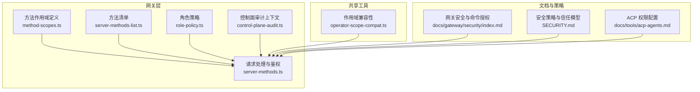
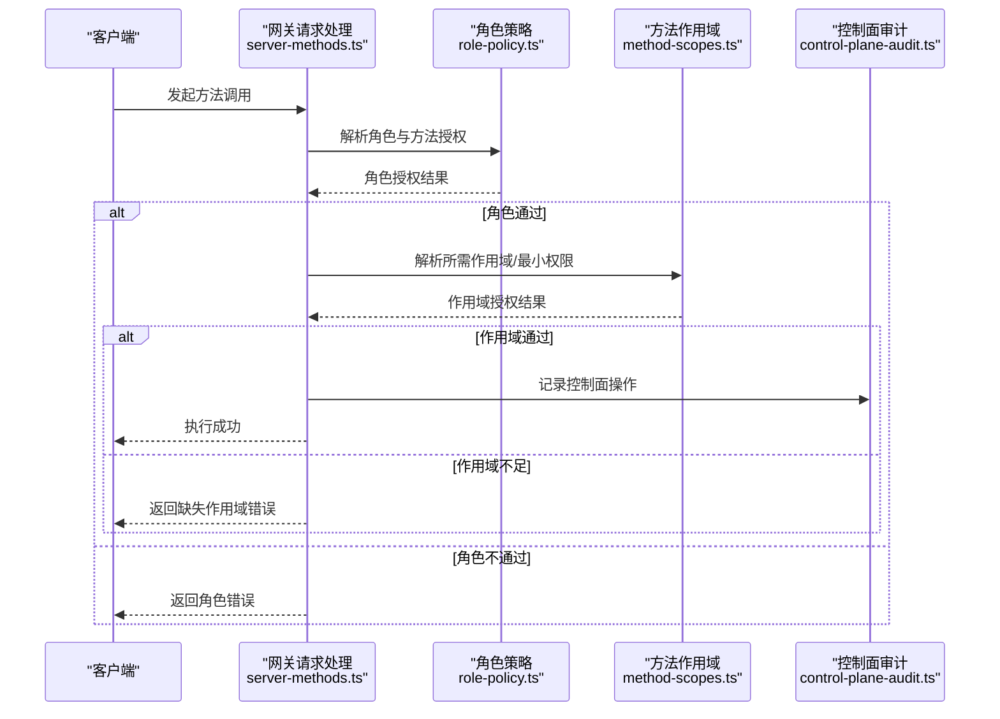
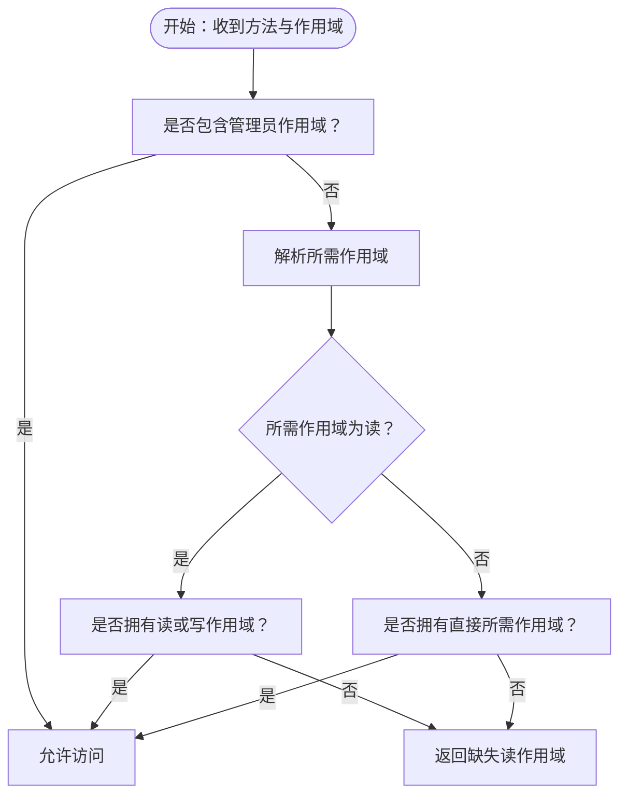
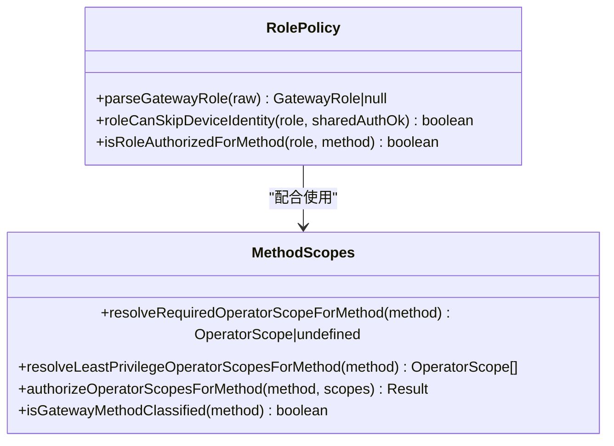
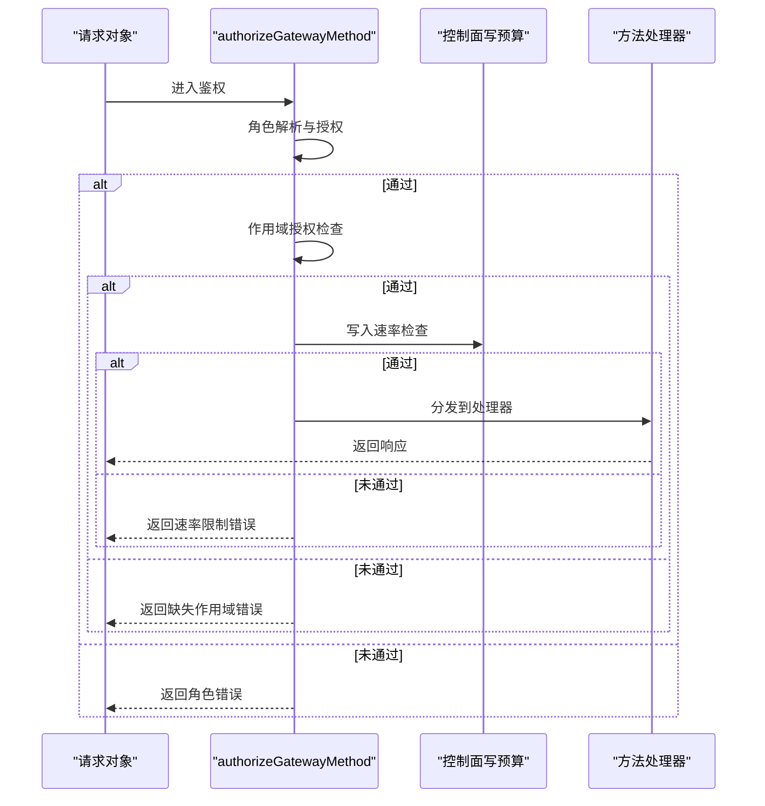
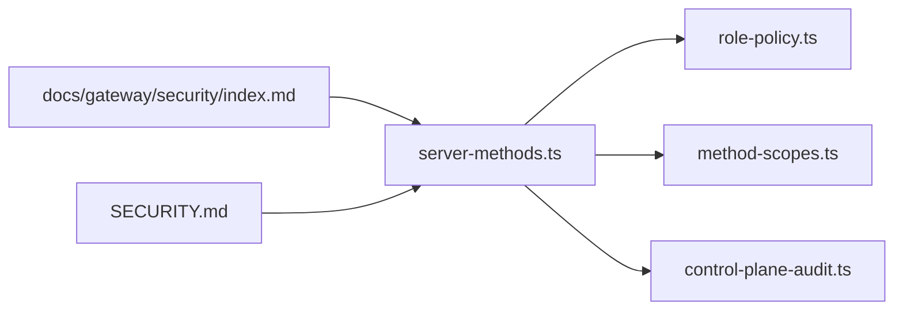

# 授权作用域

<cite>
**本文引用的文件**
- [src/gateway/method-scopes.ts](file://src/gateway/method-scopes.ts)
- [src/gateway/server-methods-list.ts](file://src/gateway/server-methods-list.ts)
- [src/gateway/server-methods.ts](file://src/gateway/server-methods.ts)
- [src/gateway/role-policy.ts](file://src/gateway/role-policy.ts)
- [src/gateway/control-plane-audit.ts](file://src/gateway/control-plane-audit.ts)
- [src/shared/operator-scope-compat.ts](file://src/shared/operator-scope-compat.ts)
- [src/gateway/server.canvas-auth.test.ts](file://src/gateway/server.canvas-auth.test.ts)
- [docs/gateway/security/index.md](file://docs/gateway/security/index.md)
- [SECURITY.md](file://SECURITY.md)
- [docs/tools/acp-agents.md](file://docs/tools/acp-agents.md)
- [src/channels/command-gating.ts](file://src/channels/command-gating.ts)
- [src/agents/bash-tools.exec-host-gateway.ts](file://src/agents/bash-tools.exec-host-gateway.ts)
- [src/browser/csrf.ts](file://src/browser/csrf.ts)
- [src/gateway/method-scopes.test.ts](file://src/gateway/method-scopes.test.ts)
</cite>

## 目录

1. [简介](#简介)
2. [项目结构](#项目结构)
3. [核心组件](#核心组件)
4. [架构总览](#架构总览)
5. [详细组件分析](#详细组件分析)
6. [依赖关系分析](#依赖关系分析)
7. [性能考量](#性能考量)
8. [故障排查指南](#故障排查指南)
9. [结论](#结论)
10. [附录](#附录)

## 简介

本文件系统化阐述 OpenClaw 的“授权作用域”体系，覆盖方法作用域的概念、定义与实现机制，解释不同 API 方法的权限要求、访问控制规则与安全边界。内容包括：

- 作用域配置选项与最小权限原则
- 权限继承与动态检查流程
- 最佳实践、权限粒度控制与安全审计
- 为新方法添加权限控制与自定义授权逻辑的方法

## 项目结构

授权作用域系统主要分布在网关层与共享工具模块：

- 网关层负责方法分类、作用域解析、角色授权与实时鉴权
- 共享工具模块提供作用域兼容性判断与通用作用域规范化
- 文档与安全策略提供信任边界与风险模型

图表来源

- [src/gateway/method-scopes.ts:1-217](file://src/gateway/method-scopes.ts#L1-L217)
- [src/gateway/server-methods-list.ts:1-133](file://src/gateway/server-methods-list.ts#L1-L133)
- [src/gateway/server-methods.ts:1-158](file://src/gateway/server-methods.ts#L1-L158)
- [src/gateway/role-policy.ts:1-24](file://src/gateway/role-policy.ts#L1-L24)
- [src/gateway/control-plane-audit.ts:1-41](file://src/gateway/control-plane-audit.ts#L1-L41)
- [src/shared/operator-scope-compat.ts:1-49](file://src/shared/operator-scope-compat.ts#L1-L49)
- [docs/gateway/security/index.md:405-438](file://docs/gateway/security/index.md#L405-L438)
- [SECURITY.md:88-102](file://SECURITY.md#L88-L102)
- [docs/tools/acp-agents.md:566-598](file://docs/tools/acp-agents.md#L566-L598)

章节来源

- [src/gateway/method-scopes.ts:1-217](file://src/gateway/method-scopes.ts#L1-L217)
- [src/gateway/server-methods-list.ts:1-133](file://src/gateway/server-methods-list.ts#L1-L133)
- [src/gateway/server-methods.ts:1-158](file://src/gateway/server-methods.ts#L1-L158)
- [src/gateway/role-policy.ts:1-24](file://src/gateway/role-policy.ts#L1-L24)
- [src/gateway/control-plane-audit.ts:1-41](file://src/gateway/control-plane-audit.ts#L1-L41)
- [src/shared/operator-scope-compat.ts:1-49](file://src/shared/operator-scope-compat.ts#L1-L49)
- [docs/gateway/security/index.md:405-438](file://docs/gateway/security/index.md#L405-L438)
- [SECURITY.md:88-102](file://SECURITY.md#L88-L102)
- [docs/tools/acp-agents.md:566-598](file://docs/tools/acp-agents.md#L566-L598)

## 核心组件

- 方法作用域定义与分类
  - 定义操作员作用域常量与分组，提供方法到作用域的映射与前缀匹配
  - 提供方法分类函数（读/写/审批/配对/管理）与最小权限解析
- 请求处理与鉴权
  - 在请求入口进行角色解析、节点专用方法判定、管理员作用域豁免与作用域授权检查
  - 控制面写入方法具备速率限制与审计日志
- 角色策略
  - 定义网关角色集合与角色到方法的授权规则
- 作用域兼容性
  - 提供非操作员角色的严格匹配与操作员角色的继承语义（admin 可满足 operator.\*）
- 文档与策略
  - 安全边界与命令授权模型、信任模型与风险假设
  - ACP 非交互权限模式与降级策略

章节来源

- [src/gateway/method-scopes.ts:1-217](file://src/gateway/method-scopes.ts#L1-L217)
- [src/gateway/server-methods.ts:38-66](file://src/gateway/server-methods.ts#L38-L66)
- [src/gateway/role-policy.ts:1-24](file://src/gateway/role-policy.ts#L1-L24)
- [src/shared/operator-scope-compat.ts:1-49](file://src/shared/operator-scope-compat.ts#L1-L49)
- [docs/gateway/security/index.md:405-438](file://docs/gateway/security/index.md#L405-L438)
- [SECURITY.md:88-102](file://SECURITY.md#L88-L102)

## 架构总览

授权作用域系统的关键流程如下：

图表来源

- [src/gateway/server-methods.ts:38-66](file://src/gateway/server-methods.ts#L38-L66)
- [src/gateway/role-policy.ts:18-23](file://src/gateway/role-policy.ts#L18-L23)
- [src/gateway/method-scopes.ts:178-209](file://src/gateway/method-scopes.ts#L178-L209)
- [src/gateway/control-plane-audit.ts:18-29](file://src/gateway/control-plane-audit.ts#L18-L29)

## 详细组件分析

### 方法作用域与最小权限

- 作用域常量与分组
  - 定义管理员、读取、写入、审批、配对等作用域
  - 将具体方法归类到对应作用域组，支持前缀匹配（如 config._、wizard._）
- 最小权限解析
  - 未分类方法默认拒绝
  - 读作用域可被写作用域满足
  - 管理员作用域可满足所有 operator.\* 方法
- 动态授权检查
  - 若已授予管理员作用域则放行
  - 否则按所需作用域逐项比对

图表来源

- [src/gateway/method-scopes.ts:178-209](file://src/gateway/method-scopes.ts#L178-L209)

章节来源

- [src/gateway/method-scopes.ts:1-217](file://src/gateway/method-scopes.ts#L1-L217)
- [src/gateway/method-scopes.test.ts:10-28](file://src/gateway/method-scopes.test.ts#L10-L28)

### 角色策略与方法分类

- 角色集合与解析
  - 支持 operator 与 node 两种角色
  - 非法角色直接拒绝
- 方法分类
  - 节点专用方法仅允许 node 角色
  - 其他方法仅允许 operator 角色
- 作用域兼容性
  - 非操作员角色采用严格匹配
  - 操作员角色支持 admin 继承满足 operator.\*

图表来源

- [src/gateway/role-policy.ts:1-24](file://src/gateway/role-policy.ts#L1-L24)
- [src/gateway/method-scopes.ts:178-216](file://src/gateway/method-scopes.ts#L178-L216)

章节来源

- [src/gateway/role-policy.ts:1-24](file://src/gateway/role-policy.ts#L1-L24)
- [src/shared/operator-scope-compat.ts:1-49](file://src/shared/operator-scope-compat.ts#L1-L49)

### 请求处理与鉴权流程

- 入口鉴权步骤
  - 校验连接信息与健康检查例外
  - 解析角色并校验角色授权
  - 节点角色与管理员作用域豁免
  - 作用域授权检查与错误返回
- 控制面写入保护
  - 对关键写入方法进行速率限制
  - 记录控制面操作审计信息

图表来源

- [src/gateway/server-methods.ts:38-66](file://src/gateway/server-methods.ts#L38-L66)
- [src/gateway/server-methods.ts:100-157](file://src/gateway/server-methods.ts#L100-L157)
- [src/gateway/control-plane-audit.ts:18-29](file://src/gateway/control-plane-audit.ts#L18-L29)

章节来源

- [src/gateway/server-methods.ts:1-158](file://src/gateway/server-methods.ts#L1-L158)
- [src/gateway/control-plane-audit.ts:1-41](file://src/gateway/control-plane-audit.ts#L1-L41)

### 命令授权与通道侧门控

- 命令授权器
  - 支持基于访问组的允许/拒绝判定
  - 支持在访问组关闭时的三种模式（允许/拒绝/按配置）
- 控制命令门控
  - 结合作者列表与模式决定是否拦截控制命令

章节来源

- [src/channels/command-gating.ts:1-45](file://src/channels/command-gating.ts#L1-L45)

### 浏览器 CSRF 与安全边界

- 浏览器变更型请求的跨站检测
  - 基于 Sec-Fetch-Site、Origin、Referer 判定
  - 仅对变更型方法启用检测
- 与网关安全边界的结合
  - 本地回环场景下的安全策略与鉴权

章节来源

- [src/browser/csrf.ts:1-55](file://src/browser/csrf.ts#L1-L55)

### Canvas 作用域与节点能力

- Canvas HTTP/WS 的节点作用域能力
  - 通过节点能力令牌限定路径范围
  - 未授权与畸形路径均返回 401
- 与作用域系统的协同
  - 能力令牌作为节点角色的补充边界

章节来源

- [src/gateway/server.canvas-auth.test.ts:196-226](file://src/gateway/server.canvas-auth.test.ts#L196-L226)

### ACP 非交互权限与降级策略

- permissionMode
  - approve-all：自动批准所有文件写入与 shell 命令
  - approve-reads：仅自动批准读取；写入与执行需提示
  - deny-all：禁止所有权限提示
- nonInteractivePermissions
  - fail：无交互时直接失败
  - deny：静默拒绝并优雅降级

章节来源

- [docs/tools/acp-agents.md:566-598](file://docs/tools/acp-agents.md#L566-L598)

## 依赖关系分析

- 方法作用域与请求处理的耦合
  - server-methods.ts 依赖 role-policy.ts 与 method-scopes.ts 进行角色与作用域授权
  - 通过最小权限解析与继承规则实现细粒度控制
- 控制面审计
  - control-plane-audit.ts 提供统一的审计上下文格式化与摘要
- 文档与策略支撑
  - docs/gateway/security/index.md 与 SECURITY.md 提供信任边界与风险模型，指导作用域设计

图表来源

- [src/gateway/server-methods.ts:1-158](file://src/gateway/server-methods.ts#L1-L158)
- [src/gateway/role-policy.ts:1-24](file://src/gateway/role-policy.ts#L1-L24)
- [src/gateway/method-scopes.ts:1-217](file://src/gateway/method-scopes.ts#L1-L217)
- [src/gateway/control-plane-audit.ts:1-41](file://src/gateway/control-plane-audit.ts#L1-L41)
- [docs/gateway/security/index.md:405-438](file://docs/gateway/security/index.md#L405-L438)
- [SECURITY.md:88-102](file://SECURITY.md#L88-L102)

章节来源

- [src/gateway/server-methods.ts:1-158](file://src/gateway/server-methods.ts#L1-L158)
- [src/gateway/role-policy.ts:1-24](file://src/gateway/role-policy.ts#L1-L24)
- [src/gateway/method-scopes.ts:1-217](file://src/gateway/method-scopes.ts#L1-L217)
- [src/gateway/control-plane-audit.ts:1-41](file://src/gateway/control-plane-audit.ts#L1-L41)
- [docs/gateway/security/index.md:405-438](file://docs/gateway/security/index.md#L405-L438)
- [SECURITY.md:88-102](file://SECURITY.md#L88-L102)

## 性能考量

- 作用域检查为内存查找与集合运算，时间复杂度低
- 方法分类与前缀匹配在启动时完成，运行时为 O(1) 查表
- 速率限制与审计日志为必要开销，建议在高并发场景下评估日志落盘与计数器实现

## 故障排查指南

- 常见错误类型
  - 角色错误：返回“角色无效”
  - 缺失作用域：返回“缺少作用域”
  - 速率限制：返回“超出限额，需要等待”
- 错误识别
  - 通过错误码与消息文本区分角色与作用域问题
  - 针对非交互场景，确认 ACP 的 permissionMode 与 nonInteractivePermissions 配置
- 审计与溯源
  - 使用控制面审计上下文定位操作者身份与设备信息
  - 结合安全文档中的信任边界与风险模型定位问题根因

章节来源

- [src/gateway/server-methods.ts:38-66](file://src/gateway/server-methods.ts#L38-L66)
- [src/gateway/server-methods.ts:100-157](file://src/gateway/server-methods.ts#L100-L157)
- [src/gateway/control-plane-audit.ts:18-29](file://src/gateway/control-plane-audit.ts#L18-L29)
- [docs/tools/acp-agents.md:566-598](file://docs/tools/acp-agents.md#L566-L598)

## 结论

OpenClaw 的授权作用域系统以“角色 + 作用域 + 最小权限”为核心，结合节点角色与管理员豁免，形成清晰的安全边界与可演进的授权模型。通过方法分类、继承规则与动态检查，既能满足细粒度控制，又便于扩展与审计。

## 附录

### 作用域配置与最佳实践

- 作用域配置
  - 在连接阶段注入角色与作用域，确保最小权限
  - 对控制面写入方法启用速率限制与审计
- 权限继承规则
  - 管理员作用域可满足所有 operator.\* 方法
  - 读作用域可满足读取类方法
- 动态权限检查
  - 在请求入口统一执行角色与作用域检查
  - 对节点专用方法单独判定
- 安全审计
  - 记录控制面操作的参与者与设备信息
  - 结合文档中的信任边界与风险模型进行合规评估

章节来源

- [src/gateway/method-scopes.ts:178-209](file://src/gateway/method-scopes.ts#L178-L209)
- [src/gateway/server-methods.ts:38-66](file://src/gateway/server-methods.ts#L38-L66)
- [src/gateway/control-plane-audit.ts:18-29](file://src/gateway/control-plane-audit.ts#L18-L29)
- [docs/gateway/security/index.md:405-438](file://docs/gateway/security/index.md#L405-L438)
- [SECURITY.md:88-102](file://SECURITY.md#L88-L102)

### 为新方法添加权限控制与自定义授权逻辑

- 步骤
  - 在方法清单中注册新方法
  - 在方法作用域映射中为新方法分配作用域或前缀
  - 如需节点专用能力，在角色策略中增加节点角色判定
  - 必要时在请求处理入口增加自定义授权逻辑
- 注意事项
  - 默认未分类方法将被拒绝，确保新方法有明确的作用域归属
  - 遵循最小权限原则，避免过度授权
  - 对控制面写入方法考虑速率限制与审计

章节来源

- [src/gateway/server-methods-list.ts:107-110](file://src/gateway/server-methods-list.ts#L107-L110)
- [src/gateway/method-scopes.ts:137-151](file://src/gateway/method-scopes.ts#L137-L151)
- [src/gateway/role-policy.ts:18-23](file://src/gateway/role-policy.ts#L18-L23)
- [src/gateway/server-methods.ts:38-66](file://src/gateway/server-methods.ts#L38-L66)
