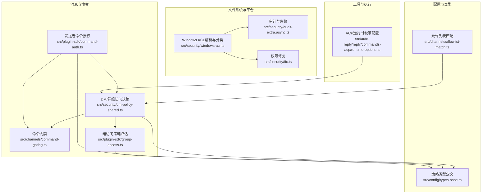
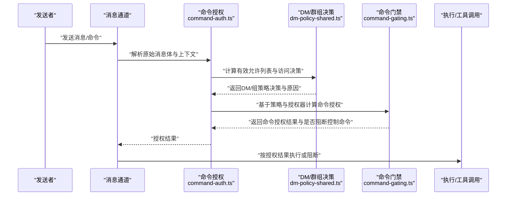
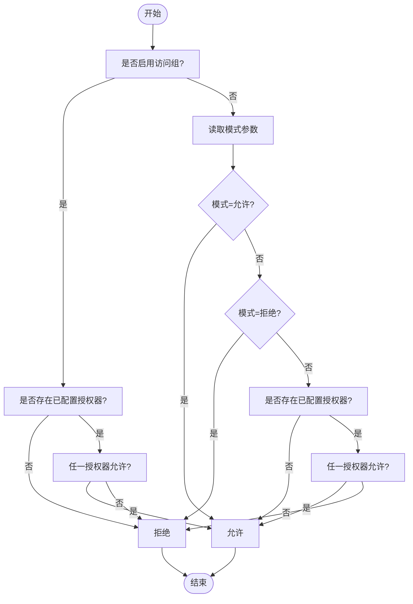
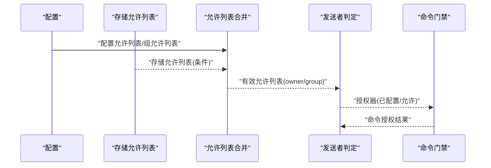
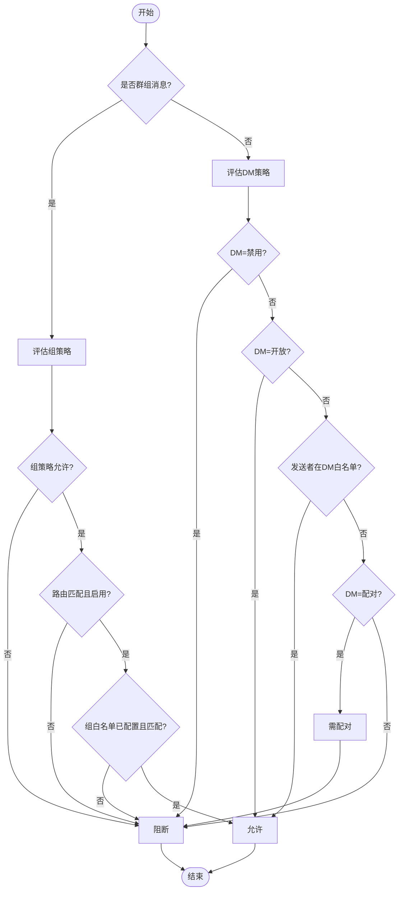
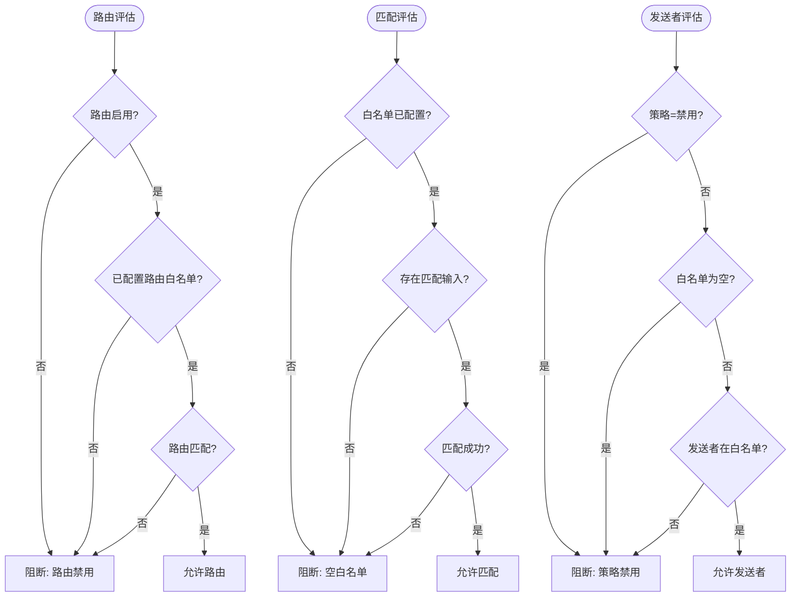
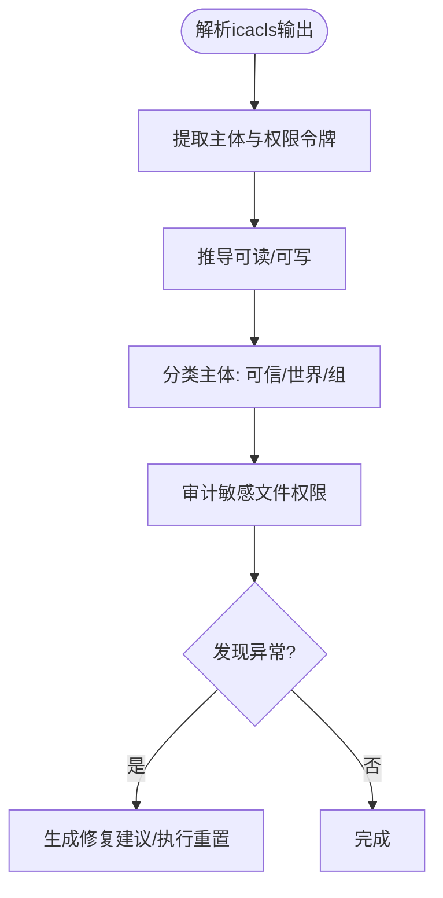
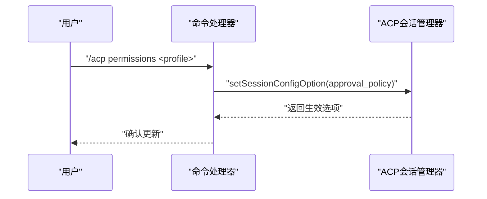
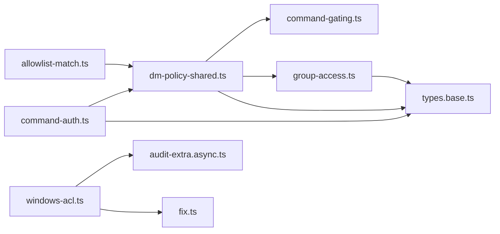

# 权限控制机制

<cite>
**本文档引用的文件**
- [src/channels/command-gating.ts](file://src/channels/command-gating.ts)
- [src/plugin-sdk/command-auth.ts](file://src/plugin-sdk/command-auth.ts)
- [src/security/dm-policy-shared.ts](file://src/security/dm-policy-shared.ts)
- [src/plugin-sdk/group-access.ts](file://src/plugin-sdk/group-access.ts)
- [src/security/windows-acl.ts](file://src/security/windows-acl.ts)
- [src/security/audit-extra.async.ts](file://src/security/audit-extra.async.ts)
- [src/security/fix.ts](file://src/security/fix.ts)
- [src/channels/allowlist-match.ts](file://src/channels/allowlist-match.ts)
- [src/config/types.base.ts](file://src/config/types.base.ts)
- [src/auto-reply/reply/commands-acp/runtime-options.ts](file://src/auto-reply/reply/commands-acp/runtime-options.ts)
- [SECURITY.md](file://SECURITY.md)
</cite>

## 目录

1. [简介](#简介)
2. [项目结构](#项目结构)
3. [核心组件](#核心组件)
4. [架构总览](#架构总览)
5. [详细组件分析](#详细组件分析)
6. [依赖关系分析](#依赖关系分析)
7. [性能考量](#性能考量)
8. [故障排查指南](#故障排查指南)
9. [结论](#结论)
10. [附录](#附录)

## 简介

本文件系统性梳理 OpenClaw 的权限控制机制，覆盖角色策略、方法作用域、访问控制列表（ACL）、权限继承与授权决策流程。重点解释认证与授权在消息通道、命令执行、工具调用与文件系统层面的落地方式；并提供权限配置选项、角色定义与分配策略、最佳实践、常见问题排查与安全加固建议。

## 项目结构

围绕权限控制的关键模块分布如下：

- 消息与命令级权限：命令门禁、发送者授权、组策略评估
- 数据与会话边界：DM/群组访问决策、有效允许列表合并
- 工具与执行边界：ACP 运行时权限配置、执行审批与沙箱
- 文件系统与平台边界：Windows ACL 解析与审计、权限修复
- 配置与类型：策略枚举、会话与工具策略类型定义

**图表来源**

- [src/channels/command-gating.ts:1-46](file://src/channels/command-gating.ts#L1-L46)
- [src/plugin-sdk/command-auth.ts:1-115](file://src/plugin-sdk/command-auth.ts#L1-L115)
- [src/security/dm-policy-shared.ts:1-333](file://src/security/dm-policy-shared.ts#L1-L333)
- [src/plugin-sdk/group-access.ts:1-209](file://src/plugin-sdk/group-access.ts#L1-L209)
- [src/auto-reply/reply/commands-acp/runtime-options.ts:265-296](file://src/auto-reply/reply/commands-acp/runtime-options.ts#L265-L296)
- [src/security/windows-acl.ts:1-200](file://src/security/windows-acl.ts#L1-L200)
- [src/security/audit-extra.async.ts:1028-1067](file://src/security/audit-extra.async.ts#L1028-L1067)
- [src/security/fix.ts:110-163](file://src/security/fix.ts#L110-L163)
- [src/channels/allowlist-match.ts:44-86](file://src/channels/allowlist-match.ts#L44-L86)
- [src/config/types.base.ts:1-239](file://src/config/types.base.ts#L1-L239)

**章节来源**

- [src/channels/command-gating.ts:1-46](file://src/channels/command-gating.ts#L1-L46)
- [src/plugin-sdk/command-auth.ts:1-115](file://src/plugin-sdk/command-auth.ts#L1-L115)
- [src/security/dm-policy-shared.ts:1-333](file://src/security/dm-policy-shared.ts#L1-L333)
- [src/plugin-sdk/group-access.ts:1-209](file://src/plugin-sdk/group-access.ts#L1-L209)
- [src/auto-reply/reply/commands-acp/runtime-options.ts:265-296](file://src/auto-reply/reply/commands-acp/runtime-options.ts#L265-L296)
- [src/security/windows-acl.ts:1-200](file://src/security/windows-acl.ts#L1-L200)
- [src/security/audit-extra.async.ts:1028-1067](file://src/security/audit-extra.async.ts#L1028-L1067)
- [src/security/fix.ts:110-163](file://src/security/fix.ts#L110-L163)
- [src/channels/allowlist-match.ts:44-86](file://src/channels/allowlist-match.ts#L44-L86)
- [src/config/types.base.ts:1-239](file://src/config/types.base.ts#L1-L239)

## 核心组件

- 命令门禁与授权决策
  - 基于“是否启用访问组”和多个授权器（owner/group）的布尔组合，决定命令是否放行，并支持对“控制类命令”的阻断策略。
- 发送者命令授权
  - 综合配置允许列表、存储允许列表、组允许列表与运行时判定，计算出“应否进行授权计算”“最终是否允许”等结果。
- DM/群组访问决策
  - 将 DM 策略（开放/白名单/配对/禁用）与组策略（开放/禁用/白名单）结合，给出允许/阻断/需配对的决策，并输出原因码。
- 组访问策略评估
  - 针对路由与匹配场景，分别评估“路由白名单”“匹配白名单”“发送者白名单”，支持“缺失输入”“空白名单”等细化原因。
- Windows ACL 解析与审计
  - 解析icacls输出，分类可信/世界/组主体，识别读写权限；提供审计与修复能力，确保敏感文件权限最小化。
- ACP 运行时权限配置
  - 支持通过命令更新会话的“批准策略”（权限配置文件），并与运行时选项联动生效。

**章节来源**

- [src/channels/command-gating.ts:8-46](file://src/channels/command-gating.ts#L8-L46)
- [src/plugin-sdk/command-auth.ts:63-115](file://src/plugin-sdk/command-auth.ts#L63-L115)
- [src/security/dm-policy-shared.ts:105-292](file://src/security/dm-policy-shared.ts#L105-L292)
- [src/plugin-sdk/group-access.ts:53-209](file://src/plugin-sdk/group-access.ts#L53-L209)
- [src/security/windows-acl.ts:100-148](file://src/security/windows-acl.ts#L100-L148)
- [src/auto-reply/reply/commands-acp/runtime-options.ts:265-296](file://src/auto-reply/reply/commands-acp/runtime-options.ts#L265-L296)

## 架构总览

下图展示从消息进入、到命令授权与执行的端到端流程，以及与ACL审计的衔接。

**图表来源**

- [src/plugin-sdk/command-auth.ts:63-115](file://src/plugin-sdk/command-auth.ts#L63-L115)
- [src/security/dm-policy-shared.ts:227-292](file://src/security/dm-policy-shared.ts#L227-L292)
- [src/channels/command-gating.ts:31-46](file://src/channels/command-gating.ts#L31-L46)

## 详细组件分析

### 命令门禁与授权决策

- 授权器模型
  - 多个授权器由“是否已配置”和“是否允许”构成，最终根据“是否启用访问组”和模式参数（允许/拒绝/按配置）决定授权。
- 控制命令阻断
  - 当允许文本命令且存在控制命令但未授权时，可选择阻断该请求，避免高风险操作被误触发。
- 模式策略
  - 当关闭访问组时，可通过模式参数控制默认行为（允许/拒绝/仅当已配置才允许）。

**图表来源**

- [src/channels/command-gating.ts:8-46](file://src/channels/command-gating.ts#L8-L46)

**章节来源**

- [src/channels/command-gating.ts:8-46](file://src/channels/command-gating.ts#L8-L46)

### 发送者命令授权与有效允许列表

- 计算路径
  - 判断是否需要进行授权计算；
  - 读取存储中的允许列表（针对非开放/非白名单DM策略）；
  - 合并配置允许列表、存储允许列表与组允许列表，形成有效允许列表；
  - 基于发送者身份与有效允许列表，判断是否允许命令；
  - 若需要授权计算，则使用授权器（owner/group）与门禁策略得出最终授权结果。
- 关键点
  - 群组消息绕过DM白名单限制；
  - 存储允许列表仅在特定DM策略下读取；
  - 有效允许列表用于区分“所有者”和“组”两类授权维度。

**图表来源**

- [src/plugin-sdk/command-auth.ts:71-115](file://src/plugin-sdk/command-auth.ts#L71-L115)

**章节来源**

- [src/plugin-sdk/command-auth.ts:63-115](file://src/plugin-sdk/command-auth.ts#L63-L115)

### DM/群组访问决策与权限继承

- 决策矩阵
  - DM策略：禁用/开放/白名单/配对；
  - 组策略：开放/禁用/白名单；
  - 群组消息优先走组策略评估；非群组消息遵循DM策略；
  - 白名单为空、未匹配、路由禁用等情况均导致阻断。
- 权限继承
  - 组命令授权不继承DM配对存储的批准；
  - 有效允许列表在DM与组之间分离，避免越权。

**图表来源**

- [src/security/dm-policy-shared.ts:105-196](file://src/security/dm-policy-shared.ts#L105-L196)
- [src/plugin-sdk/group-access.ts:53-97](file://src/plugin-sdk/group-access.ts#L53-L97)

**章节来源**

- [src/security/dm-policy-shared.ts:105-292](file://src/security/dm-policy-shared.ts#L105-L292)
- [src/plugin-sdk/group-access.ts:53-143](file://src/plugin-sdk/group-access.ts#L53-L143)

### 组访问策略评估（路由/匹配）

- 路由白名单
  - 路由未启用或未配置白名单即阻断；
- 匹配白名单
  - 缺少匹配输入、白名单为空、未匹配均阻断；
- 发送者白名单
  - 禁用策略直接阻断；白名单为空阻断；发送者不在白名单阻断。

**图表来源**

- [src/plugin-sdk/group-access.ts:53-185](file://src/plugin-sdk/group-access.ts#L53-L185)

**章节来源**

- [src/plugin-sdk/group-access.ts:53-209](file://src/plugin-sdk/group-access.ts#L53-L209)

### Windows ACL 解析、分类与审计

- 解析与分类
  - 解析icacls输出，提取主体、权限令牌，推导可读/可写；
  - 分类可信（系统/管理员/SID白名单）、世界（Everyone/Authenticated Users）、组三类主体；
- 审计与修复
  - 对敏感文件（如认证凭据）检查世界可读/可写，发现后生成修复建议；
  - 提供安全重置命令构建与执行，避免符号链接与类型不符目标。

**图表来源**

- [src/security/windows-acl.ts:182-247](file://src/security/windows-acl.ts#L182-L247)
- [src/security/audit-extra.async.ts:1028-1067](file://src/security/audit-extra.async.ts#L1028-L1067)
- [src/security/fix.ts:110-163](file://src/security/fix.ts#L110-L163)

**章节来源**

- [src/security/windows-acl.ts:100-148](file://src/security/windows-acl.ts#L100-L148)
- [src/security/audit-extra.async.ts:1028-1067](file://src/security/audit-extra.async.ts#L1028-L1067)
- [src/security/fix.ts:110-163](file://src/security/fix.ts#L110-L163)

### ACP 运行时权限配置

- 功能
  - 通过命令更新会话的“批准策略”（权限配置文件），并返回生效选项；
  - 支持将配置项映射为运行时选项（模型、超时、权限配置等）。
- 使用场景
  - 在非交互式会话中，若未配置批准策略，可能因无法弹窗而失败，建议设置非交互模式为“拒绝”。

**图表来源**

- [src/auto-reply/reply/commands-acp/runtime-options.ts:265-296](file://src/auto-reply/reply/commands-acp/runtime-options.ts#L265-L296)

**章节来源**

- [src/auto-reply/reply/commands-acp/runtime-options.ts:265-296](file://src/auto-reply/reply/commands-acp/runtime-options.ts#L265-L296)

## 依赖关系分析

- 组件耦合
  - 命令授权依赖DM/组策略与门禁逻辑，耦合度适中；
  - DM策略与组策略共享“有效允许列表”计算与“门禁”决策，内聚性良好；
  - Windows ACL与审计/修复模块独立，仅在文件系统层面产生影响。
- 外部依赖
  - 平台侧依赖icacls（Windows）解析输出；
  - 配置类型定义统一了策略枚举与会话/工具策略字段。

**图表来源**

- [src/plugin-sdk/command-auth.ts:1-115](file://src/plugin-sdk/command-auth.ts#L1-L115)
- [src/security/dm-policy-shared.ts:1-333](file://src/security/dm-policy-shared.ts#L1-L333)
- [src/channels/command-gating.ts:1-46](file://src/channels/command-gating.ts#L1-L46)
- [src/plugin-sdk/group-access.ts:1-209](file://src/plugin-sdk/group-access.ts#L1-L209)
- [src/security/windows-acl.ts:1-200](file://src/security/windows-acl.ts#L1-L200)
- [src/security/audit-extra.async.ts:1028-1067](file://src/security/audit-extra.async.ts#L1028-L1067)
- [src/security/fix.ts:110-163](file://src/security/fix.ts#L110-L163)
- [src/channels/allowlist-match.ts:44-86](file://src/channels/allowlist-match.ts#L44-L86)
- [src/config/types.base.ts:1-239](file://src/config/types.base.ts#L1-L239)

**章节来源**

- [src/plugin-sdk/command-auth.ts:1-115](file://src/plugin-sdk/command-auth.ts#L1-L115)
- [src/security/dm-policy-shared.ts:1-333](file://src/security/dm-policy-shared.ts#L1-L333)
- [src/channels/command-gating.ts:1-46](file://src/channels/command-gating.ts#L1-L46)
- [src/plugin-sdk/group-access.ts:1-209](file://src/plugin-sdk/group-access.ts#L1-L209)
- [src/security/windows-acl.ts:1-200](file://src/security/windows-acl.ts#L1-L200)
- [src/security/audit-extra.async.ts:1028-1067](file://src/security/audit-extra.async.ts#L1028-L1067)
- [src/security/fix.ts:110-163](file://src/security/fix.ts#L110-L163)
- [src/channels/allowlist-match.ts:44-86](file://src/channels/allowlist-match.ts#L44-L86)
- [src/config/types.base.ts:1-239](file://src/config/types.base.ts#L1-L239)

## 性能考量

- 允许列表匹配
  - 采用编译后的集合进行快速查找，避免线性扫描带来的复杂度上升；
- 授权计算
  - 仅在必要时读取存储允许列表，减少I/O开销；
- ACL解析
  - 一次性解析icacls输出并缓存主体分类，后续审计复用，降低重复解析成本。

[本节为通用性能讨论，无需具体文件分析]

## 故障排查指南

- 常见问题
  - 控制命令被阻断：检查门禁模式与授权器状态，确认是否启用了文本命令与控制命令阻断；
  - 群组消息未放行：检查组策略与路由白名单配置，确认路由启用与匹配；
  - 非交互式会话失败：在非交互模式下，写/执行类操作可能因无弹窗而失败，建议调整非交互权限模式为“拒绝”以优雅降级；
  - Windows权限异常：审计发现敏感文件对其他用户可读/可写，按修复建议调整权限。
- 排查步骤
  - 核对DM策略与组策略配置；
  - 检查有效允许列表来源（配置/存储/组）；
  - 查看门禁决策原因码与组访问原因；
  - 在Windows上使用ACL解析工具核对主体与权限；
  - 通过安全审计命令定位异常权限文件并修复。

**章节来源**

- [src/channels/command-gating.ts:31-46](file://src/channels/command-gating.ts#L31-L46)
- [src/security/dm-policy-shared.ts:105-196](file://src/security/dm-policy-shared.ts#L105-L196)
- [src/plugin-sdk/group-access.ts:53-143](file://src/plugin-sdk/group-access.ts#L53-L143)
- [src/auto-reply/reply/commands-acp/runtime-options.ts:265-296](file://src/auto-reply/reply/commands-acp/runtime-options.ts#L265-L296)
- [SECURITY.md:112-131](file://SECURITY.md#L112-L131)
- [src/security/audit-extra.async.ts:1028-1067](file://src/security/audit-extra.async.ts#L1028-L1067)
- [src/security/fix.ts:110-163](file://src/security/fix.ts#L110-L163)

## 结论

OpenClaw 的权限控制以“策略明确、边界清晰、最小授权”为核心设计原则。通过DM/组策略、命令门禁、有效允许列表合并与ACL审计修复，实现了从消息入口到执行层的多层防护。配合ACP运行时权限配置与安全加固建议，可在个人助理型部署中实现稳健的安全基线。

[本节为总结性内容，无需具体文件分析]

## 附录

### 权限配置选项与策略

- DM策略（DmPolicy）
  - 禁用、开放、白名单、配对；
- 组策略（GroupPolicy）
  - 禁用、开放、白名单；
- 命令门禁模式（当访问组关闭时）
  - 允许、拒绝、按配置（仅当存在已配置授权器时才允许）；
- 非交互权限模式
  - 在非交互式会话中，写/执行类操作可能失败，建议设为“拒绝”以优雅降级。

**章节来源**

- [src/config/types.base.ts:8-9](file://src/config/types.base.ts#L8-L9)
- [src/channels/command-gating.ts](file://src/channels/command-gating.ts#L6)
- [src/auto-reply/reply/commands-acp/runtime-options.ts:265-296](file://src/auto-reply/reply/commands-acp/runtime-options.ts#L265-L296)
- [SECURITY.md:599-603](file://SECURITY.md#L599-L603)

### 角色定义与权限分配策略

- 角色
  - 所有者（owner）：拥有DM范围内的命令执行权；
  - 组成员（group）：依据组策略与组白名单获得路由/匹配/发送者授权；
  - 世界（world）：默认不可写，敏感文件应禁止世界可读/可写。
- 分配策略
  - DM白名单：限定可执行命令的发送者；
  - 组白名单：限定路由/匹配/发送者的组成员；
  - 存储允许列表：在特定DM策略下动态补充允许者；
  - ACL最小化：敏感文件仅限可信主体读写。

**章节来源**

- [src/security/dm-policy-shared.ts:198-225](file://src/security/dm-policy-shared.ts#L198-L225)
- [src/plugin-sdk/group-access.ts:145-185](file://src/plugin-sdk/group-access.ts#L145-L185)
- [src/security/windows-acl.ts:100-148](file://src/security/windows-acl.ts#L100-L148)
- [src/security/audit-extra.async.ts:1028-1067](file://src/security/audit-extra.async.ts#L1028-L1067)

### 最佳实践

- 优先使用白名单策略，避免开放/配对策略带来的扩大攻击面；
- 明确区分DM与组授权维度，避免组授权继承DM存储批准；
- 在非交互式会话中，将非交互权限模式设为“拒绝”，防止静默失败；
- 定期运行安全审计，修复ACL异常，确保敏感文件权限最小化；
- 严格控制插件安装与扩展来源，避免跨信任边界的代码执行。

**章节来源**

- [SECURITY.md:207-244](file://SECURITY.md#L207-L244)
- [src/auto-reply/reply/commands-acp/runtime-options.ts:265-296](file://src/auto-reply/reply/commands-acp/runtime-options.ts#L265-L296)
- [src/security/audit-extra.async.ts:1028-1067](file://src/security/audit-extra.async.ts#L1028-L1067)
