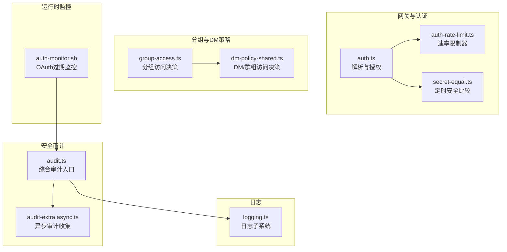
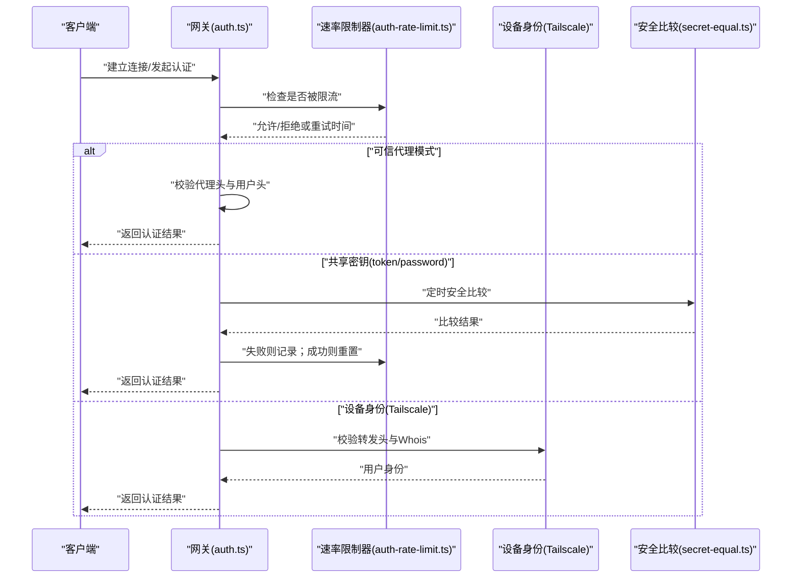
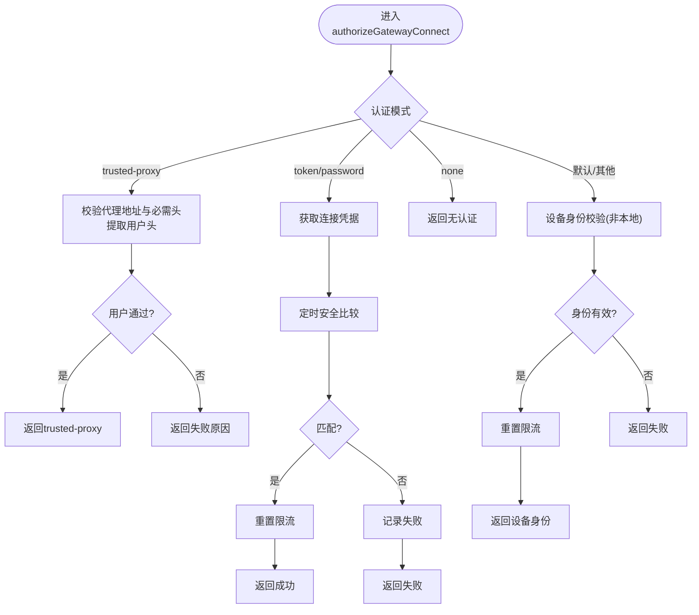
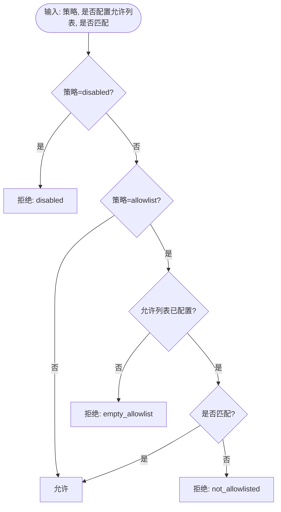
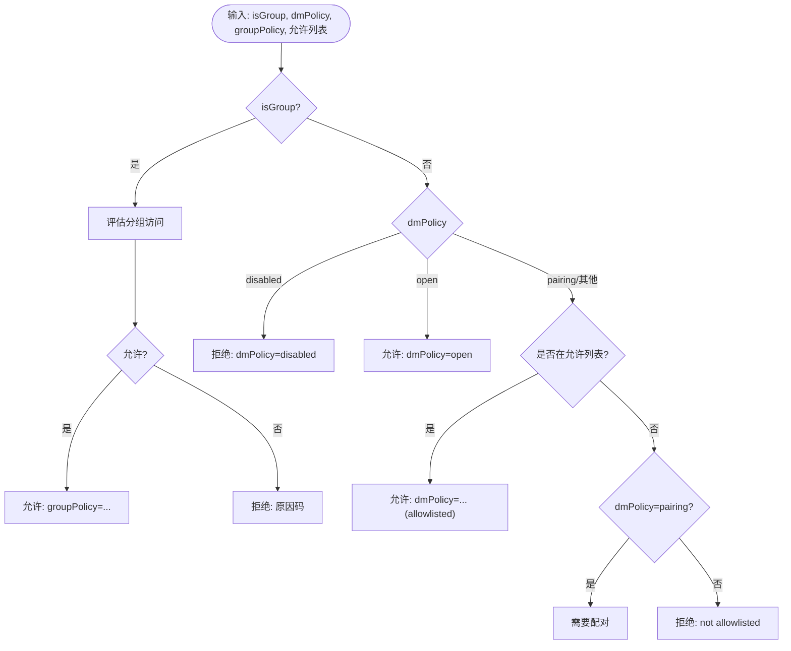
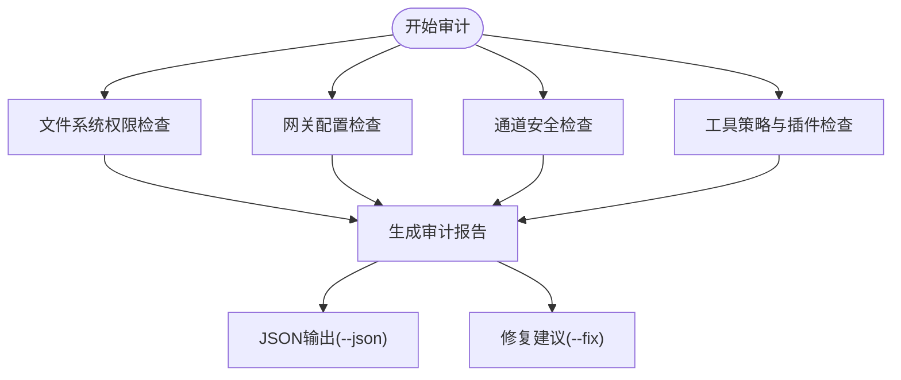
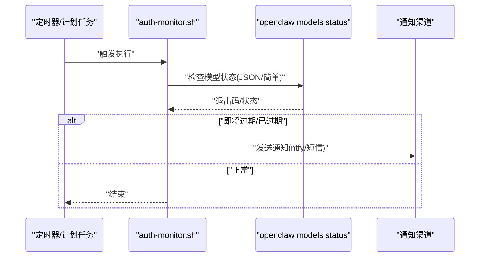
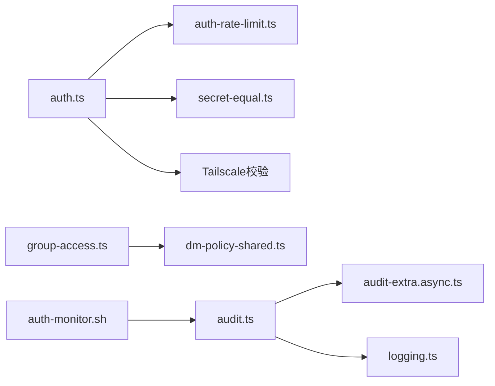

# 权限验证与审计

<cite>
**本文引用的文件**
- [src/security/audit.ts](file://src/security/audit.ts)
- [src/security/audit-extra.async.ts](file://src/security/audit-extra.async.ts)
- [src/gateway/auth.ts](file://src/gateway/auth.ts)
- [src/gateway/auth-rate-limit.ts](file://src/gateway/auth-rate-limit.ts)
- [src/plugin-sdk/group-access.ts](file://src/plugin-sdk/group-access.ts)
- [src/security/dm-policy-shared.ts](file://src/security/dm-policy-shared.ts)
- [src/security/secret-equal.ts](file://src/security/secret-equal.ts)
- [scripts/auth-monitor.sh](file://scripts/auth-monitor.sh)
- [docs/automation/auth-monitoring.md](file://docs/automation/auth-monitoring.md)
- [docs/cli/security.md](file://docs/cli/security.md)
- [src/logging.ts](file://src/logging.ts)
</cite>

## 目录

1. [简介](#简介)
2. [项目结构](#项目结构)
3. [核心组件](#核心组件)
4. [架构总览](#架构总览)
5. [详细组件分析](#详细组件分析)
6. [依赖关系分析](#依赖关系分析)
7. [性能考量](#性能考量)
8. [故障排查指南](#故障排查指南)
9. [结论](#结论)
10. [附录](#附录)

## 简介

本文件聚焦于权限验证与审计系统，覆盖以下主题：

- 权限验证流程：共享密钥（令牌/密码）、可信代理、设备身份（Tailscale）与速率限制
- 审计日志与安全监控：文件系统权限、配置暴露、通道安全、工具策略、日志脱敏
- 异常处理与告警：认证失败计数、锁定窗口、过期提醒脚本与自动化监控
- 合规与报告：审计报告结构、JSON 输出、修复建议与合规性检查
- 最佳实践：最小权限、速率限制、脱敏日志、分组访问控制与细粒度会话可见性

## 项目结构

围绕权限验证与审计的关键模块如下：

- 网关认证与授权：共享密钥、可信代理、设备身份、速率限制
- 分组访问控制：基于允许列表的路由与发送者授权
- 安全审计：文件系统权限、配置与通道安全、工具策略、日志与状态文件
- 运行时监控：OAuth 过期监控脚本与 CLI 检查
- 日志系统：日志级别、子系统日志与脱敏设置

**图表来源**

- [src/gateway/auth.ts:378-504](file://src/gateway/auth.ts#L378-L504)
- [src/gateway/auth-rate-limit.ts:95-233](file://src/gateway/auth-rate-limit.ts#L95-L233)
- [src/security/secret-equal.ts:3-12](file://src/security/secret-equal.ts#L3-L12)
- [src/plugin-sdk/group-access.ts:99-143](file://src/plugin-sdk/group-access.ts#L99-L143)
- [src/security/dm-policy-shared.ts:105-196](file://src/security/dm-policy-shared.ts#L105-L196)
- [src/security/audit.ts:1-120](file://src/security/audit.ts#L1-L120)
- [src/security/audit-extra.async.ts:1-120](file://src/security/audit-extra.async.ts#L1-L120)
- [scripts/auth-monitor.sh:1-90](file://scripts/auth-monitor.sh#L1-L90)
- [src/logging.ts:1-70](file://src/logging.ts#L1-L70)

**章节来源**

- [src/gateway/auth.ts:1-120](file://src/gateway/auth.ts#L1-L120)
- [src/gateway/auth-rate-limit.ts:1-80](file://src/gateway/auth-rate-limit.ts#L1-L80)
- [src/plugin-sdk/group-access.ts:1-60](file://src/plugin-sdk/group-access.ts#L1-L60)
- [src/security/dm-policy-shared.ts:1-60](file://src/security/dm-policy-shared.ts#L1-L60)
- [src/security/audit.ts:1-120](file://src/security/audit.ts#L1-L120)
- [src/security/audit-extra.async.ts:1-120](file://src/security/audit-extra.async.ts#L1-L120)
- [scripts/auth-monitor.sh:1-40](file://scripts/auth-monitor.sh#L1-L40)
- [src/logging.ts:1-40](file://src/logging.ts#L1-L40)

## 核心组件

- 共享密钥认证与授权：支持令牌与密码两种模式，按请求来源与速率限制执行校验
- 可信代理认证：通过反向代理注入的用户头进行身份判定，并可选白名单过滤
- 设备身份认证（Tailscale）：在非本地连接场景下，使用转发头与 Whois 校验设备身份
- 速率限制：滑动窗口计数，支持多作用域（共享密钥、设备令牌、钩子）
- 分组访问控制：基于“开放/允许列表/禁用”的策略，结合允许列表匹配与路由级控制
- DM/群组访问决策：合并多源允许列表，区分群组与私聊场景，支持命令门控
- 安全审计：文件系统权限、配置暴露、通道安全、工具策略与日志文件检查
- 运行时监控：OAuth 过期检查与通知脚本，CLI 健康检查
- 日志系统：子系统日志、级别控制与敏感信息脱敏

**章节来源**

- [src/gateway/auth.ts:217-292](file://src/gateway/auth.ts#L217-L292)
- [src/gateway/auth-rate-limit.ts:25-72](file://src/gateway/auth-rate-limit.ts#L25-L72)
- [src/plugin-sdk/group-access.ts:99-143](file://src/plugin-sdk/group-access.ts#L99-L143)
- [src/security/dm-policy-shared.ts:105-196](file://src/security/dm-policy-shared.ts#L105-L196)
- [src/security/audit.ts:208-337](file://src/security/audit.ts#L208-L337)
- [scripts/auth-monitor.sh:68-90](file://scripts/auth-monitor.sh#L68-L90)
- [src/logging.ts:1-70](file://src/logging.ts#L1-L70)

## 架构总览

下图展示从请求进入网关到完成权限验证与审计的整体流程。

**图表来源**

- [src/gateway/auth.ts:378-504](file://src/gateway/auth.ts#L378-L504)
- [src/gateway/auth-rate-limit.ts:141-172](file://src/gateway/auth-rate-limit.ts#L141-L172)
- [src/security/secret-equal.ts:3-12](file://src/security/secret-equal.ts#L3-L12)

## 详细组件分析

### 组件A：网关认证与授权（auth.ts）

- 解析认证模式：优先级为显式覆盖 > 配置 > 密码 > 令牌 > 默认（令牌）
- 支持三种模式：
  - 共享密钥：令牌或密码，失败计入限流
  - 可信代理：要求代理地址可信且具备指定用户头
  - 设备身份：仅在非本地连接时启用，校验 Tailscale 身份头与 Whois
- 速率限制：按 IP 与作用域统计失败次数，超过阈值进入锁定窗口
- 本地直连判断：严格区分本地回环与代理转发，避免误判

**图表来源**

- [src/gateway/auth.ts:378-504](file://src/gateway/auth.ts#L378-L504)
- [src/gateway/auth-rate-limit.ts:141-204](file://src/gateway/auth-rate-limit.ts#L141-L204)
- [src/security/secret-equal.ts:3-12](file://src/security/secret-equal.ts#L3-L12)

**章节来源**

- [src/gateway/auth.ts:217-292](file://src/gateway/auth.ts#L217-L292)
- [src/gateway/auth.ts:378-504](file://src/gateway/auth.ts#L378-L504)
- [src/gateway/auth-rate-limit.ts:95-233](file://src/gateway/auth-rate-limit.ts#L95-L233)
- [src/security/secret-equal.ts:3-12](file://src/security/secret-equal.ts#L3-L12)

### 组件B：分组访问控制（plugin-sdk/group-access.ts）

- 策略类型：disabled/open/allowlist
- 决策逻辑：
  - 若策略为 disabled：直接拒绝
  - 若策略为 allowlist：要求已配置允许列表且匹配输入
  - 可选要求必须提供匹配输入（如 sender_id）

**图表来源**

- [src/plugin-sdk/group-access.ts:99-143](file://src/plugin-sdk/group-access.ts#L99-L143)

**章节来源**

- [src/plugin-sdk/group-access.ts:1-209](file://src/plugin-sdk/group-access.ts#L1-L209)

### 组件C：DM/群组访问决策（security/dm-policy-shared.ts）

- 合并多源允许列表：allowFrom、groupAllowFrom、配对存储
- 群组场景：先评估分组访问，再根据 DM 策略决定允许/拒绝/需要配对
- 私聊场景：若允许列表为空则拒绝；否则按策略与允许列表判定
- 命令门控：区分 DM 与群组的授权来源，支持文本命令与控制命令

**图表来源**

- [src/security/dm-policy-shared.ts:105-196](file://src/security/dm-policy-shared.ts#L105-L196)

**章节来源**

- [src/security/dm-policy-shared.ts:1-333](file://src/security/dm-policy-shared.ts#L1-L333)

### 组件D：安全审计（security/audit.ts 与 audit-extra.async.ts）

- 文件系统检查：状态目录、配置文件、会话存储、日志文件的权限与可读性
- 网关配置检查：绑定方式、认证模式、受信代理、允许来源、mDNS、Tailscale 模式、速率限制
- 通道安全：特定通道工具启用风险、文档权限授予等
- 工具策略与插件：工具策略摘要缓存、插件安装与扩展扫描
- 报告输出：摘要统计、严重性分级、修复建议、深度探测（可选）

**图表来源**

- [src/security/audit.ts:208-337](file://src/security/audit.ts#L208-L337)
- [src/security/audit.ts:339-687](file://src/security/audit.ts#L339-L687)
- [src/security/audit-extra.async.ts:1069-1127](file://src/security/audit-extra.async.ts#L1069-L1127)
- [docs/cli/security.md:43-72](file://docs/cli/security.md#L43-L72)

**章节来源**

- [src/security/audit.ts:1-120](file://src/security/audit.ts#L1-L120)
- [src/security/audit.ts:208-337](file://src/security/audit.ts#L208-L337)
- [src/security/audit.ts:339-687](file://src/security/audit.ts#L339-L687)
- [src/security/audit-extra.async.ts:1069-1127](file://src/security/audit-extra.async.ts#L1069-L1127)
- [docs/cli/security.md:43-72](file://docs/cli/security.md#L43-L72)

### 组件E：运行时监控与告警（auth-monitor.sh 与 CLI）

- OAuth 过期监控：定期检查 Claude 凭证到期时间，支持 ntfy 推送与短信通知
- CLI 健康检查：通过 `openclaw models status --check` 获取退出码与 JSON 输出
- 自动化集成：systemd timer、cron 与脚本组合

**图表来源**

- [scripts/auth-monitor.sh:1-90](file://scripts/auth-monitor.sh#L1-L90)
- [docs/automation/auth-monitoring.md:14-45](file://docs/automation/auth-monitoring.md#L14-L45)

**章节来源**

- [scripts/auth-monitor.sh:1-90](file://scripts/auth-monitor.sh#L1-L90)
- [docs/automation/auth-monitoring.md:1-45](file://docs/automation/auth-monitoring.md#L1-L45)

### 组件F：日志与脱敏（logging.ts）

- 子系统日志：按模块/子系统输出，支持过滤与时间戳
- 日志级别：标准化级别与最小级别映射
- 脱敏设置：通过配置控制敏感信息输出，减少泄露风险

**章节来源**

- [src/logging.ts:1-70](file://src/logging.ts#L1-L70)

## 依赖关系分析

- 认证模块依赖：
  - 速率限制器：用于共享密钥与设备令牌的失败计数与锁定
  - 定时安全比较：防止时序攻击
  - 设备身份校验：在非本地连接时启用
- 分组与 DM 策略：
  - 合并多源允许列表，区分群组与私聊场景
  - 命令门控：根据策略与来源决定是否放行控制命令
- 审计模块：
  - 文件系统检查依赖平台权限查询与可执行工具
  - 报告输出依赖 CLI 命令格式化与 JSON 序列化

**图表来源**

- [src/gateway/auth.ts:378-504](file://src/gateway/auth.ts#L378-L504)
- [src/gateway/auth-rate-limit.ts:95-233](file://src/gateway/auth-rate-limit.ts#L95-L233)
- [src/security/secret-equal.ts:3-12](file://src/security/secret-equal.ts#L3-L12)
- [src/plugin-sdk/group-access.ts:99-143](file://src/plugin-sdk/group-access.ts#L99-L143)
- [src/security/dm-policy-shared.ts:105-196](file://src/security/dm-policy-shared.ts#L105-L196)
- [src/security/audit.ts:1-120](file://src/security/audit.ts#L1-L120)
- [src/security/audit-extra.async.ts:1-120](file://src/security/audit-extra.async.ts#L1-L120)
- [src/logging.ts:1-70](file://src/logging.ts#L1-L70)
- [scripts/auth-monitor.sh:1-90](file://scripts/auth-monitor.sh#L1-L90)

**章节来源**

- [src/gateway/auth.ts:1-120](file://src/gateway/auth.ts#L1-L120)
- [src/gateway/auth-rate-limit.ts:1-80](file://src/gateway/auth-rate-limit.ts#L1-L80)
- [src/plugin-sdk/group-access.ts:1-60](file://src/plugin-sdk/group-access.ts#L1-L60)
- [src/security/dm-policy-shared.ts:1-60](file://src/security/dm-policy-shared.ts#L1-L60)
- [src/security/audit.ts:1-120](file://src/security/audit.ts#L1-L120)
- [src/security/audit-extra.async.ts:1-120](file://src/security/audit-extra.async.ts#L1-L120)
- [src/logging.ts:1-40](file://src/logging.ts#L1-L40)
- [scripts/auth-monitor.sh:1-40](file://scripts/auth-monitor.sh#L1-L40)

## 性能考量

- 速率限制器采用内存 Map，带周期清理，适合单进程场景；注意在高并发下失败计数的内存占用
- 审计中的文件系统检查与工具策略扫描可能产生 I/O 开销，建议在 CI 或离线场景中使用
- 日志脱敏与子系统过滤可降低敏感数据写入成本，同时提升可观测性

[本节为通用指导，无需具体文件分析]

## 故障排查指南

- 认证失败频繁：
  - 检查速率限制是否触发，确认客户端 IP 是否被锁定
  - 核对令牌/密码是否正确，避免大小写与空白字符差异
- 可信代理认证失败：
  - 确认代理地址在受信列表中，且用户头存在
  - 检查允许用户列表是否包含当前用户
- 设备身份认证失败：
  - 确认请求来自非本地连接，且 Tailscale 身份头与 Whois 匹配
- 审计报告异常：
  - 使用 `--json` 获取结构化输出，结合 `--fix` 自动修复常见问题
  - 关注文件权限、配置暴露与通道工具启用风险
- OAuth 过期告警：
  - 使用 `openclaw models status --check` 获取健康状态
  - 配置通知渠道（ntfy/短信），确保脚本可执行与环境变量正确

**章节来源**

- [src/gateway/auth-rate-limit.ts:141-172](file://src/gateway/auth-rate-limit.ts#L141-L172)
- [src/gateway/auth.ts:378-504](file://src/gateway/auth.ts#L378-L504)
- [docs/cli/security.md:43-72](file://docs/cli/security.md#L43-L72)
- [scripts/auth-monitor.sh:68-90](file://scripts/auth-monitor.sh#L68-L90)

## 结论

该权限验证与审计系统通过多层防护（共享密钥、可信代理、设备身份、速率限制）与全面审计（文件系统、配置、通道、工具策略、日志）构建了稳健的安全基线。配合运行时监控与 CLI 健康检查，能够实现细粒度的权限监控与实时安全告警，满足合规与运营需求。

[本节为总结，无需具体文件分析]

## 附录

### 审计报告字段与严重性

- 字段：时间戳、摘要（严重性计数）、发现项（检查ID、严重性、标题、详情、修复建议）
- 严重性：info/warn/critical
- 深度探测：可选的网关可达性与错误信息

**章节来源**

- [src/security/audit.ts:72-85](file://src/security/audit.ts#L72-L85)

### 审计修复建议（示例）

- 将允许列表从“开放”切换为“允许列表”
- 设置日志脱敏级别为“工具”
- 严格权限：状态/配置与敏感文件（credentials/_.json、auth-profiles.json、sessions.json、session/_.jsonl）

**章节来源**

- [docs/cli/security.md:58-71](file://docs/cli/security.md#L58-L71)

### 权限验证最佳实践

- 最小权限：仅授予必要工具与通道能力
- 强认证：优先使用长随机令牌，避免弱密码
- 速率限制：对外暴露的网关必须配置速率限制
- 脱敏日志：生产环境开启敏感信息脱敏
- 分组访问：使用允许列表策略，避免开放策略
- 细粒度会话：限制跨会话可见性，仅在必要时放行

[本节为通用指导，无需具体文件分析]
