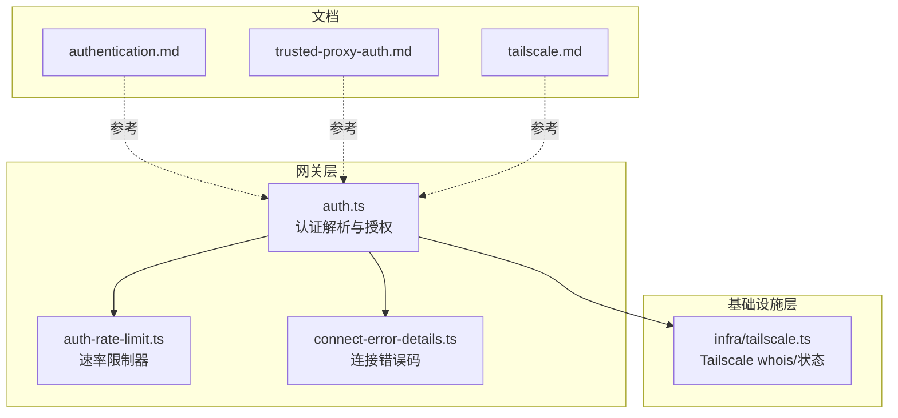
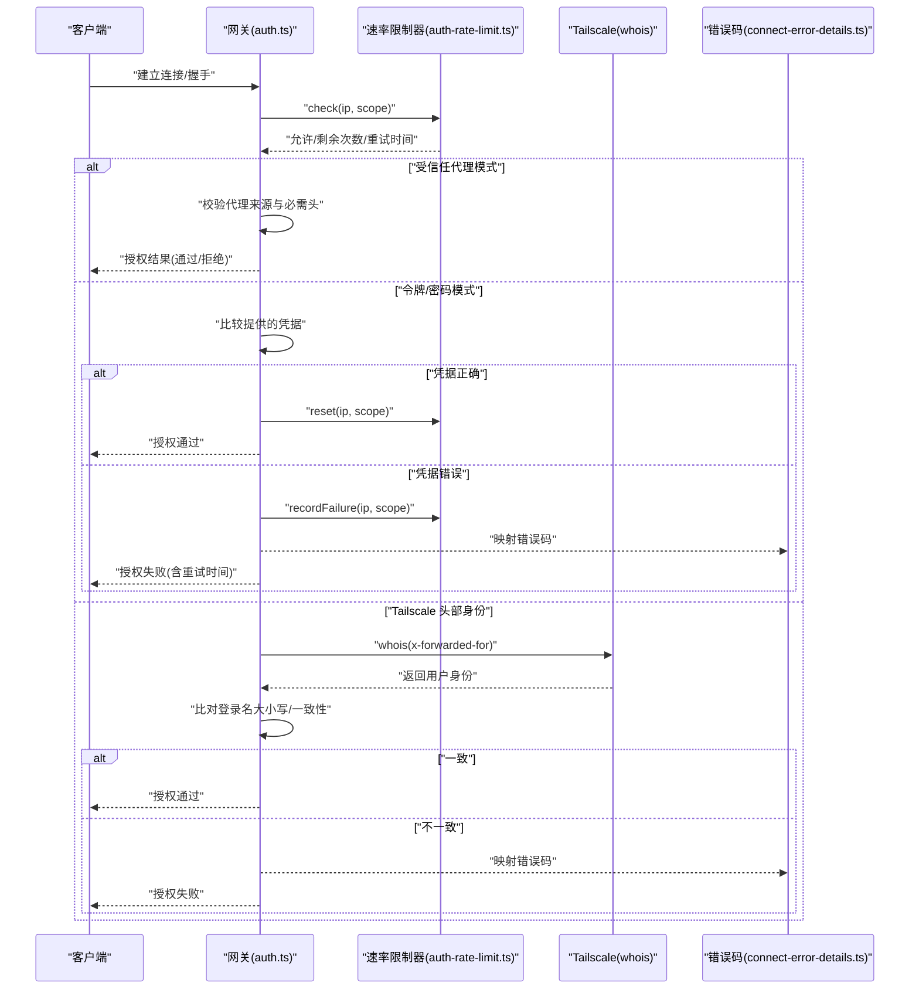
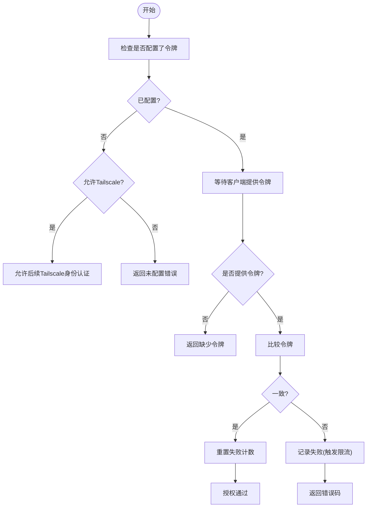
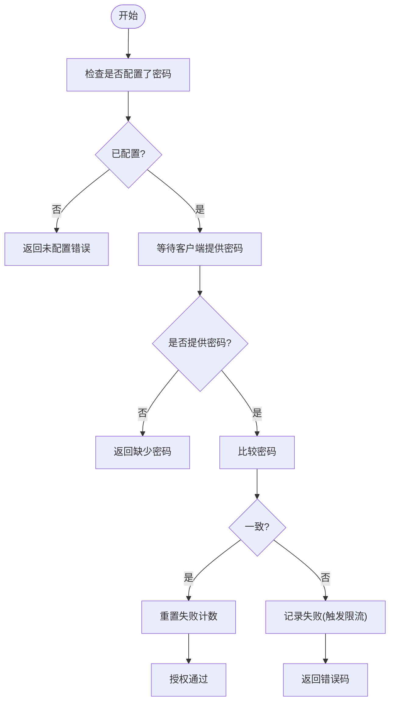
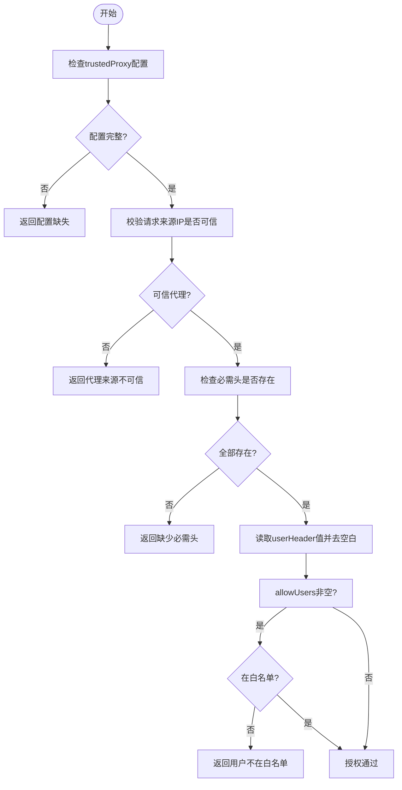
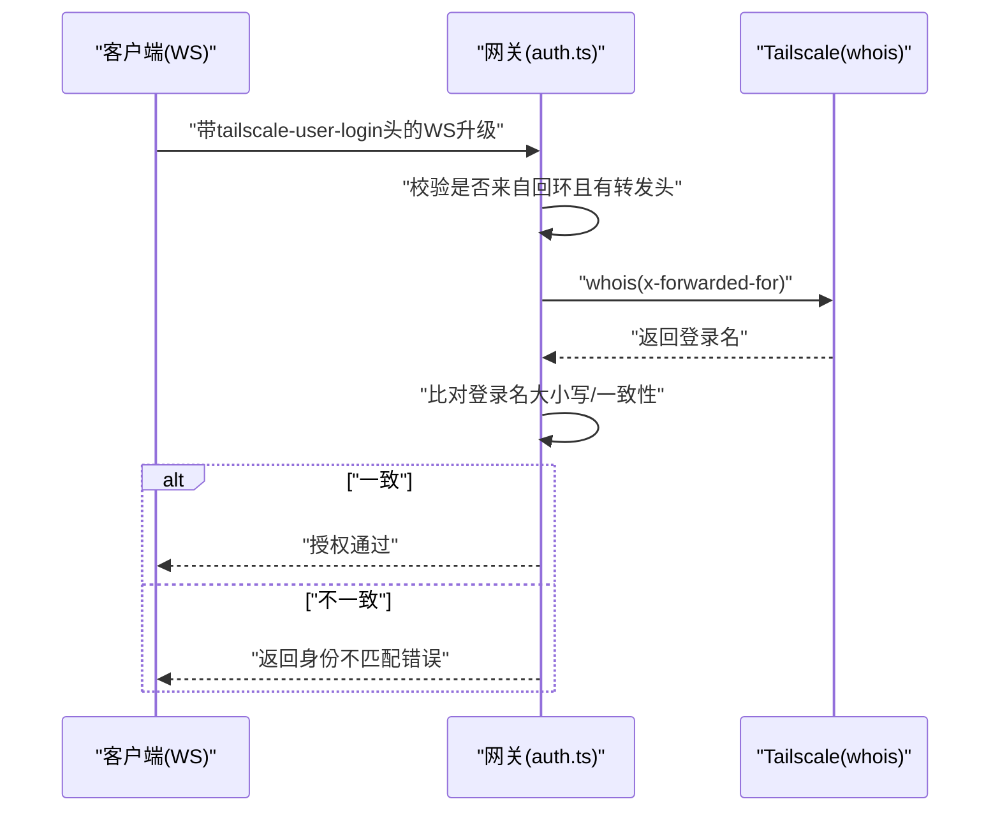
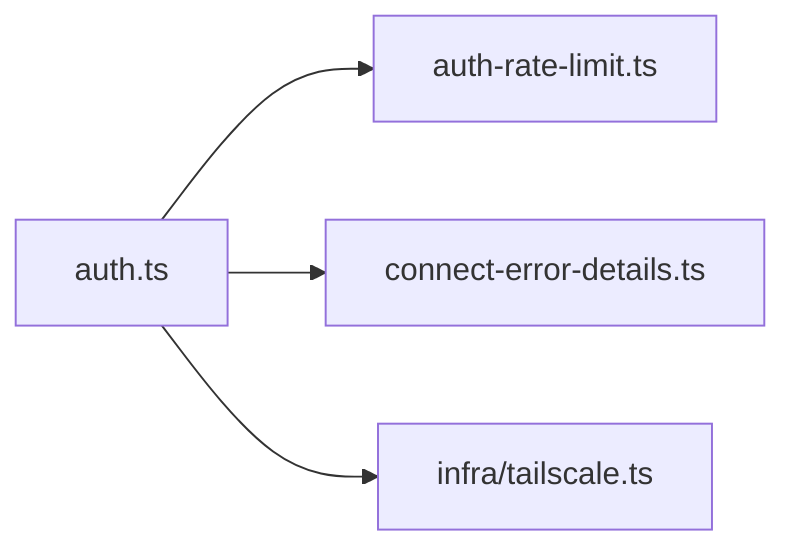

# 认证机制

<cite>
**本文引用的文件**
- [src/gateway/auth.ts](file://src/gateway/auth.ts)
- [src/gateway/auth.test.ts](file://src/gateway/auth.test.ts)
- [src/gateway/auth-rate-limit.ts](file://src/gateway/auth-rate-limit.ts)
- [src/gateway/auth-rate-limit.test.ts](file://src/gateway/auth-rate-limit.test.ts)
- [src/gateway/protocol/connect-error-details.ts](file://src/gateway/protocol/connect-error-details.ts)
- [src/infra/tailscale.ts](file://src/infra/tailscale.ts)
- [docs/gateway/authentication.md](file://docs/gateway/authentication.md)
- [docs/gateway/trusted-proxy-auth.md](file://docs/gateway/trusted-proxy-auth.md)
- [docs/gateway/tailscale.md](file://docs/gateway/tailscale.md)
</cite>

## 目录

1. [简介](#简介)
2. [项目结构](#项目结构)
3. [核心组件](#核心组件)
4. [架构总览](#架构总览)
5. [详细组件分析](#详细组件分析)
6. [依赖关系分析](#依赖关系分析)
7. [性能考量](#性能考量)
8. [故障排查指南](#故障排查指南)
9. [结论](#结论)
10. [附录](#附录)

## 简介

本文件系统化梳理 OpenClaw 网关的认证机制，覆盖以下认证方式：

- 令牌认证（Token）
- 密码认证（Password）
- 受信任代理认证（Trusted Proxy）
- Tailscale 身份认证（Tailscale）

内容包括：工作原理、配置方法、使用场景、安全检查、速率限制、错误处理、配置示例、最佳实践、常见问题与模式选择指南。

## 项目结构

认证相关代码主要集中在网关层与基础设施层：

- 网关认证主逻辑与授权流程：src/gateway/auth.ts
- 速率限制器：src/gateway/auth-rate-limit.ts
- 连接错误码映射：src/gateway/protocol/connect-error-details.ts
- Tailscale 集成与身份解析：src/infra/tailscale.ts
- 文档参考：
  - 模型认证与凭据管理：docs/gateway/authentication.md
  - 受信任代理认证：docs/gateway/trusted-proxy-auth.md
  - Tailscale 远程访问：docs/gateway/tailscale.md

**图表来源**

- [src/gateway/auth.ts:1-504](file://src/gateway/auth.ts#L1-L504)
- [src/gateway/auth-rate-limit.ts:1-233](file://src/gateway/auth-rate-limit.ts#L1-L233)
- [src/gateway/protocol/connect-error-details.ts:1-137](file://src/gateway/protocol/connect-error-details.ts#L1-L137)
- [src/infra/tailscale.ts:1-501](file://src/infra/tailscale.ts#L1-L501)
- [docs/gateway/authentication.md:1-180](file://docs/gateway/authentication.md#L1-L180)
- [docs/gateway/trusted-proxy-auth.md:1-330](file://docs/gateway/trusted-proxy-auth.md#L1-L330)
- [docs/gateway/tailscale.md:1-133](file://docs/gateway/tailscale.md#L1-L133)

**章节来源**

- [src/gateway/auth.ts:1-504](file://src/gateway/auth.ts#L1-L504)
- [src/gateway/auth-rate-limit.ts:1-233](file://src/gateway/auth-rate-limit.ts#L1-L233)
- [src/gateway/protocol/connect-error-details.ts:1-137](file://src/gateway/protocol/connect-error-details.ts#L1-L137)
- [src/infra/tailscale.ts:1-501](file://src/infra/tailscale.ts#L1-L501)
- [docs/gateway/authentication.md:1-180](file://docs/gateway/authentication.md#L1-L180)
- [docs/gateway/trusted-proxy-auth.md:1-330](file://docs/gateway/trusted-proxy-auth.md#L1-L330)
- [docs/gateway/tailscale.md:1-133](file://docs/gateway/tailscale.md#L1-L133)

## 核心组件

- 认证解析与授权（authorizeGatewayConnect）：根据配置决定认证模式，执行令牌/密码校验或受信任代理校验；在允许的情况下启用 Tailscale 头部身份验证。
- 速率限制器（AuthRateLimiter）：基于滑动窗口的内存计数器，按客户端 IP 和作用域统计失败次数并实施锁定期。
- 错误码映射：将内部授权原因映射为标准化的连接错误码，便于前端提示与自动化处理。
- Tailscale 集成：通过本地 tailscale 命令查询远端 IP 的用户身份，校验头部转发信息一致性。

**章节来源**

- [src/gateway/auth.ts:217-485](file://src/gateway/auth.ts#L217-L485)
- [src/gateway/auth-rate-limit.ts:59-232](file://src/gateway/auth-rate-limit.ts#L59-L232)
- [src/gateway/protocol/connect-error-details.ts:51-84](file://src/gateway/protocol/connect-error-details.ts#L51-L84)
- [src/infra/tailscale.ts:469-500](file://src/infra/tailscale.ts#L469-L500)

## 架构总览

下图展示从请求进入网关到完成认证的关键步骤与模块交互。

**图表来源**

- [src/gateway/auth.ts:378-485](file://src/gateway/auth.ts#L378-L485)
- [src/gateway/auth-rate-limit.ts:141-204](file://src/gateway/auth-rate-limit.ts#L141-L204)
- [src/infra/tailscale.ts:469-500](file://src/infra/tailscale.ts#L469-L500)
- [src/gateway/protocol/connect-error-details.ts:51-84](file://src/gateway/protocol/connect-error-details.ts#L51-L84)

## 详细组件分析

### 令牌认证（Token）

- 工作原理
  - 网关启动时解析配置或环境变量，确定令牌值。
  - 客户端在握手阶段提供令牌；服务端进行恒等比较，失败则记录一次失败并可能触发速率限制锁定期。
  - 成功后重置该 IP 的失败计数。
- 配置方法
  - 支持在配置中设置 gateway.auth.token 或通过环境变量 OPENCLAW_GATEWAY_TOKEN 注入。
  - 若未配置且允许 Tailscale，则可降级为 Tailscale 身份认证（见下节）。
- 使用场景
  - 通用远程访问控制，适合大多数对外暴露的网关。
- 安全检查
  - 缺少令牌或令牌不匹配会触发速率限制；缺失凭据（尚未提供）不计入失败。
- 速率限制
  - 错误凭据触发 recordFailure；成功触发 reset。
- 错误处理
  - 映射错误码：AUTH_TOKEN_MISSING、AUTH_TOKEN_MISMATCH、AUTH_TOKEN_NOT_CONFIGURED。

**图表来源**

- [src/gateway/auth.ts:448-464](file://src/gateway/auth.ts#L448-L464)
- [src/gateway/auth-rate-limit.ts:174-204](file://src/gateway/auth-rate-limit.ts#L174-L204)
- [src/gateway/protocol/connect-error-details.ts:55-60](file://src/gateway/protocol/connect-error-details.ts#L55-L60)

**章节来源**

- [src/gateway/auth.ts:217-292](file://src/gateway/auth.ts#L217-L292)
- [src/gateway/auth.ts:448-464](file://src/gateway/auth.ts#L448-L464)
- [src/gateway/protocol/connect-error-details.ts:55-60](file://src/gateway/protocol/connect-error-details.ts#L55-L60)
- [docs/gateway/authentication.md:21-56](file://docs/gateway/authentication.md#L21-L56)

### 密码认证（Password）

- 工作原理
  - 类似令牌认证，但比较的是共享密码。
  - 启动时可从配置或环境变量 OPENCLAW_GATEWAY_PASSWORD 解析密码。
- 配置方法
  - 在配置中设置 gateway.auth.password；或通过环境变量注入。
- 使用场景
  - 本地或内网环境的简单访问控制；不适合公网暴露。
- 安全检查
  - 缺少密码或密码不匹配触发速率限制；缺失凭据不计入失败。
- 速率限制
  - 错误凭据触发 recordFailure；成功触发 reset。
- 错误处理
  - 映射错误码：AUTH_PASSWORD_MISSING、AUTH_PASSWORD_MISMATCH、AUTH_PASSWORD_NOT_CONFIGURED。

**图表来源**

- [src/gateway/auth.ts:466-481](file://src/gateway/auth.ts#L466-L481)
- [src/gateway/auth-rate-limit.ts:174-204](file://src/gateway/auth-rate-limit.ts#L174-L204)
- [src/gateway/protocol/connect-error-details.ts:61-66](file://src/gateway/protocol/connect-error-details.ts#L61-L66)

**章节来源**

- [src/gateway/auth.ts:217-292](file://src/gateway/auth.ts#L217-L292)
- [src/gateway/auth.ts:466-481](file://src/gateway/auth.ts#L466-L481)
- [src/gateway/protocol/connect-error-details.ts:61-66](file://src/gateway/protocol/connect-error-details.ts#L61-L66)

### 受信任代理认证（Trusted Proxy）

- 工作原理
  - 将认证完全委托给前置反向代理；网关仅校验请求来自可信代理 IP，并从指定头提取用户身份。
  - 可选要求某些头存在以增强校验；可选白名单限制特定用户。
- 配置方法
  - gateway.auth.mode 设为 "trusted-proxy"。
  - gateway.auth.trustedProxy.userHeader 指定包含已认证用户标识的头名称。
  - gateway.auth.trustedProxy.requiredHeaders 指定必须存在的附加头列表。
  - gateway.auth.trustedProxy.allowUsers 限制允许的用户集合（为空表示允许所有已认证用户）。
  - gateway.trustedProxies 列出可信代理的 IP 地址。
- 使用场景
  - 在容器/Kubernetes 环境中由代理统一处理 OAuth/单点登录；浏览器无法在 WebSocket 中携带令牌时尤为适用。
- 安全检查
  - 必须来自 gateway.trustedProxies 中的 IP；否则拒绝。
  - 必须包含 userHeader；否则拒绝。
  - requiredHeaders 中的每个头都必须存在；否则拒绝。
  - allowUsers 非空时，用户必须在白名单中；否则拒绝。
- 速率限制
  - 仅对“凭据错误”类失败计数；缺失凭据不计。
- 错误处理
  - 映射错误码：trusted*proxy*\* 系列。

**图表来源**

- [src/gateway/auth.ts:335-372](file://src/gateway/auth.ts#L335-L372)
- [src/gateway/auth.ts:391-409](file://src/gateway/auth.ts#L391-L409)
- [docs/gateway/trusted-proxy-auth.md:50-90](file://docs/gateway/trusted-proxy-auth.md#L50-L90)

**章节来源**

- [src/gateway/auth.ts:335-372](file://src/gateway/auth.ts#L335-L372)
- [src/gateway/auth.ts:391-409](file://src/gateway/auth.ts#L391-L409)
- [src/gateway/auth.test.ts:466-652](file://src/gateway/auth.test.ts#L466-L652)
- [docs/gateway/trusted-proxy-auth.md:14-50](file://docs/gateway/trusted-proxy-auth.md#L14-L50)
- [docs/gateway/trusted-proxy-auth.md:50-90](file://docs/gateway/trusted-proxy-auth.md#L50-L90)

### Tailscale 身份认证（Tailscale）

- 工作原理
  - 当 gateway.auth.allowTailscale 为真时，允许通过 Tailscale 注入的头部进行无令牌登录（仅限 WS 控制界面）。
  - 网关校验请求来自回环且带有 Tailscale 的转发头；随后通过本地 tailscale whois 查询远端 IP 的用户身份，并与头部登录名比对。
- 配置方法
  - tailscale.mode 为 "serve" 时，若 allowTailscale 为真，则允许 WS 控制界面使用 Tailscale 头部身份登录。
  - 公网 Funnel 模式需要共享密码（password），因为 Funnel 不注入身份头。
- 使用场景
  - 仅限尾网访问（Serve）或需要简化远程访问的场景。
- 安全检查
  - 请求必须来自回环且具备 Tailscale 转发头；否则拒绝。
  - whois 查询失败或登录名不一致时拒绝。
- 速率限制
  - 通过 Tailscale 身份认证成功后会重置失败计数。
- 错误处理
  - 映射错误码：AUTH*TAILSCALE*\* 系列。

**图表来源**

- [src/gateway/auth.ts:184-215](file://src/gateway/auth.ts#L184-L215)
- [src/infra/tailscale.ts:469-500](file://src/infra/tailscale.ts#L469-L500)
- [docs/gateway/tailscale.md:28-42](file://docs/gateway/tailscale.md#L28-L42)

**章节来源**

- [src/gateway/auth.ts:184-215](file://src/gateway/auth.ts#L184-L215)
- [src/infra/tailscale.ts:469-500](file://src/infra/tailscale.ts#L469-L500)
- [docs/gateway/tailscale.md:21-42](file://docs/gateway/tailscale.md#L21-L42)

## 依赖关系分析

- 模块耦合
  - auth.ts 依赖 auth-rate-limit.ts 进行失败计数与锁定期控制；依赖 connect-error-details.ts 将内部原因映射为标准化错误码；依赖 infra/tailscale.ts 进行 Tailscale 身份解析。
- 外部依赖
  - Tailscale 命令行工具（tailscale whois/status）用于身份解析与状态查询。
- 潜在循环依赖
  - 未发现循环依赖；各模块职责清晰，接口稳定。

**图表来源**

- [src/gateway/auth.ts:1-21](file://src/gateway/auth.ts#L1-L21)
- [src/gateway/auth-rate-limit.ts:1-19](file://src/gateway/auth-rate-limit.ts#L1-L19)
- [src/gateway/protocol/connect-error-details.ts:1-1](file://src/gateway/protocol/connect-error-details.ts#L1-L1)
- [src/infra/tailscale.ts:1-8](file://src/infra/tailscale.ts#L1-L8)

**章节来源**

- [src/gateway/auth.ts:1-21](file://src/gateway/auth.ts#L1-L21)
- [src/gateway/auth-rate-limit.ts:1-19](file://src/gateway/auth-rate-limit.ts#L1-L19)
- [src/gateway/protocol/connect-error-details.ts:1-1](file://src/gateway/protocol/connect-error-details.ts#L1-L1)
- [src/infra/tailscale.ts:1-8](file://src/infra/tailscale.ts#L1-L8)

## 性能考量

- 速率限制器
  - 默认最大尝试次数、滑动窗口与锁定期均可配置；默认对回环地址豁免，避免本地调试被锁死。
  - 内存中维护 Map，周期性清理过期条目，避免无限增长。
- Tailscale whois
  - 带缓存（默认 TTL 60 秒），失败也有短 TTL，减少频繁调用带来的开销。
- IP 归一化
  - 统一使用代理感知的客户端 IP（优先 x-forwarded-for，其次 x-real-ip，可选启用），确保计数准确。

**章节来源**

- [src/gateway/auth-rate-limit.ts:25-82](file://src/gateway/auth-rate-limit.ts#L25-L82)
- [src/gateway/auth-rate-limit.ts:206-232](file://src/gateway/auth-rate-limit.ts#L206-L232)
- [src/infra/tailscale.ts:465-467](file://src/infra/tailscale.ts#L465-L467)
- [src/gateway/auth.ts:108-123](file://src/gateway/auth.ts#L108-L123)

## 故障排查指南

- 常见错误与定位
  - 令牌/密码错误：检查配置与环境变量是否正确注入；确认未将“缺失凭据”误判为暴力破解尝试。
  - 速率限制：查看返回的 retryAfterMs；确认是否命中了错误凭据的失败计数。
  - 受信任代理：
    - 代理来源不可信：核对 gateway.trustedProxies 是否包含代理真实 IP。
    - 缺少必需头：确认代理是否传递了 requiredHeaders。
    - 用户不在白名单：调整 allowUsers 或添加用户。
  - Tailscale：
    - 身份缺失/不匹配：确认请求来自回环且带有转发头；检查 whois 查询是否成功。
- 自动化诊断
  - 使用错误码映射函数将内部原因转换为标准化错误码，便于前端提示与自动化处理。

**章节来源**

- [src/gateway/auth.test.ts:200-276](file://src/gateway/auth.test.ts#L200-L276)
- [src/gateway/auth.test.ts:498-652](file://src/gateway/auth.test.ts#L498-L652)
- [src/gateway/protocol/connect-error-details.ts:51-84](file://src/gateway/protocol/connect-error-details.ts#L51-L84)
- [docs/gateway/trusted-proxy-auth.md:276-322](file://docs/gateway/trusted-proxy-auth.md#L276-L322)

## 结论

OpenClaw 提供了灵活而安全的多模式认证能力：

- 对外暴露场景优先推荐令牌认证；
- 局域网或内网场景可采用密码认证；
- 在容器/K8s 等统一入口环境中，受信任代理认证可实现与现有身份系统的无缝集成；
- Tailscale 适用于尾网访问与简化远程控制。

通过速率限制与严格的错误码映射，系统在易用性与安全性之间取得平衡。建议结合部署环境选择合适模式，并遵循各模式的安全检查清单与最佳实践。

## 附录

### 配置示例与参考

- 令牌认证（模型凭据）：参见文档中的 API Key 与订阅令牌设置流程。
- 受信任代理认证：参见文档中的配置参考与代理示例（Pomerium、Caddy、nginx+oauth2-proxy、Traefik）。
- Tailscale：参见文档中的 Serve/Funnel 模式与身份认证说明。

**章节来源**

- [docs/gateway/authentication.md:21-98](file://docs/gateway/authentication.md#L21-L98)
- [docs/gateway/trusted-proxy-auth.md:50-330](file://docs/gateway/trusted-proxy-auth.md#L50-L330)
- [docs/gateway/tailscale.md:21-133](file://docs/gateway/tailscale.md#L21-L133)

### 最佳实践

- 令牌认证
  - 使用环境变量注入，避免将明文写入配置文件。
  - 为不同环境设置独立令牌，便于轮换与审计。
- 密码认证
  - 仅用于内网或本地场景；避免在公网暴露。
  - 使用强口令并定期轮换。
- 受信任代理认证
  - 严格限定 gateway.trustedProxies；确保代理正确覆盖而非追加转发头。
  - 设置 allowUsers 并启用 requiredHeaders。
  - 仅在代理负责 TLS 终止时开启此模式。
- Tailscale
  - Serve 模式下无需令牌；Funnel 模式需配合共享密码。
  - 仅在可信主机上启用 allowTailscale，避免本地不受信代码影响。

**章节来源**

- [docs/gateway/trusted-proxy-auth.md:256-268](file://docs/gateway/trusted-proxy-auth.md#L256-L268)
- [docs/gateway/tailscale.md:28-42](file://docs/gateway/tailscale.md#L28-L42)

### 模式选择指南

- 仅个人/内网使用：密码认证或 Tailscale Serve。
- 统一身份系统：受信任代理认证（对接 OAuth/SSO）。
- 对外公开访问：令牌认证；必要时结合速率限制与防火墙。
- 容器/K8s 环境：受信任代理认证（由 ingress/proxy 统一鉴权）。

**章节来源**

- [docs/gateway/trusted-proxy-auth.md:14-28](file://docs/gateway/trusted-proxy-auth.md#L14-L28)
- [docs/gateway/tailscale.md:15-20](file://docs/gateway/tailscale.md#L15-L20)
