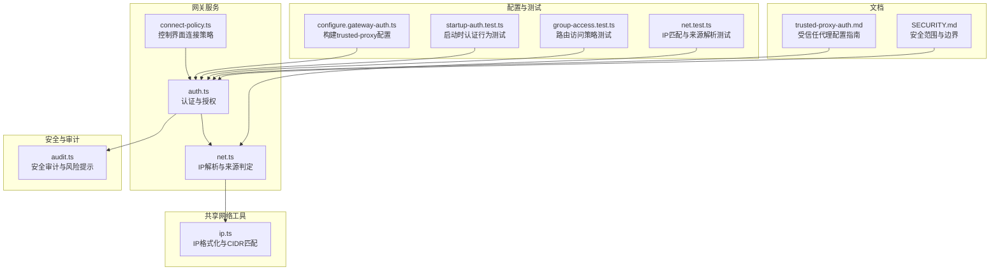
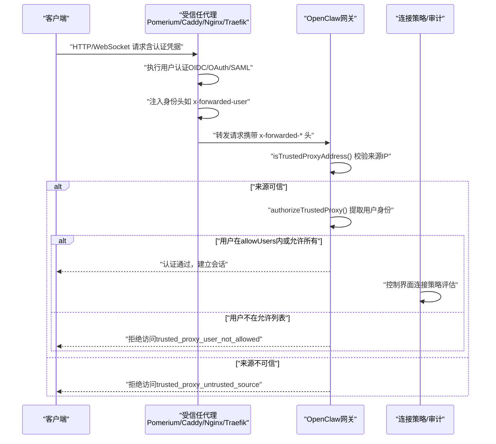
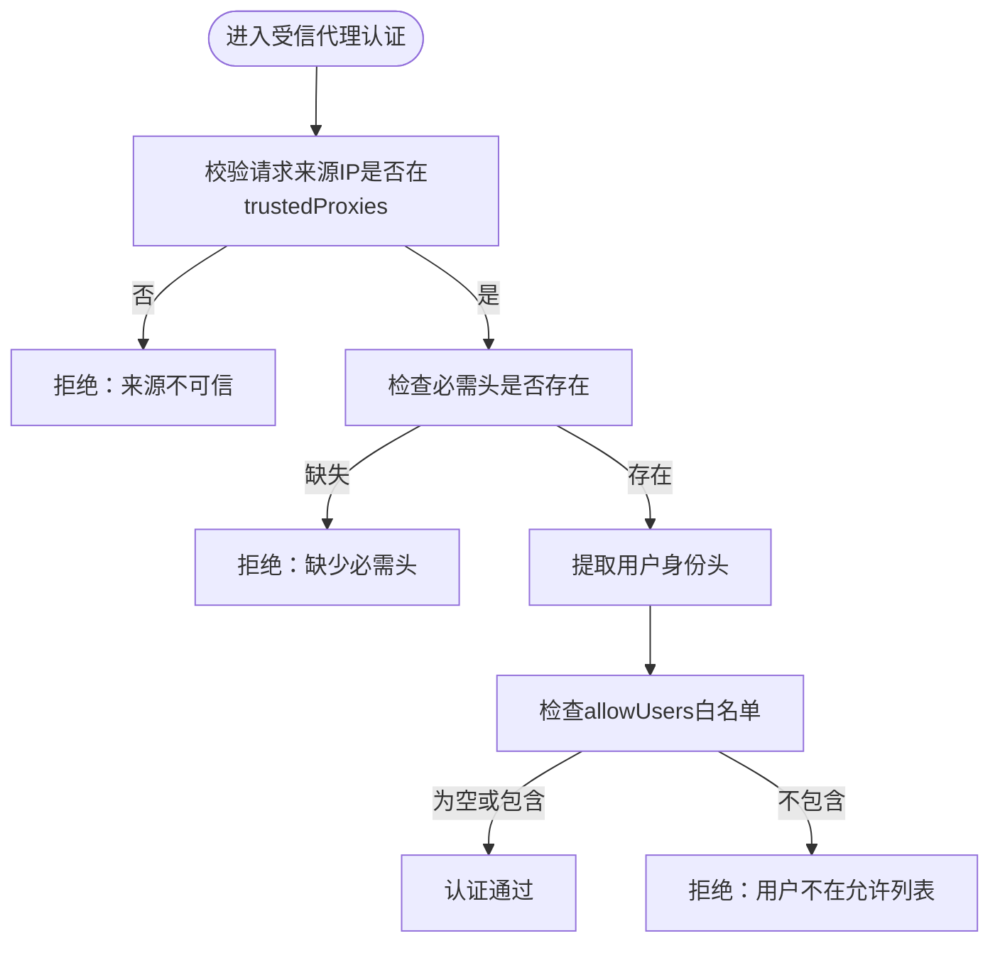
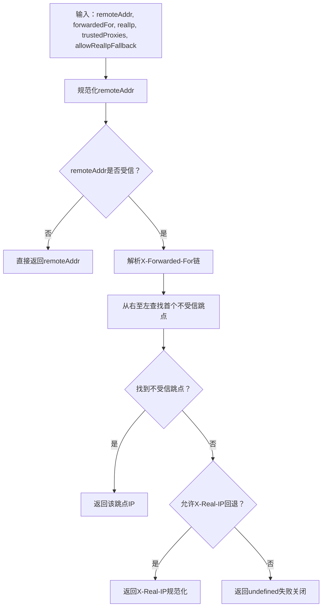
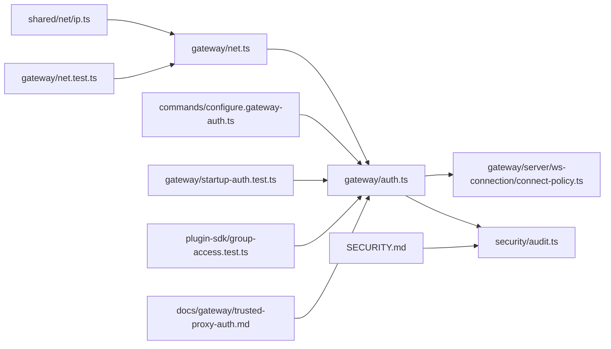

# 访问控制列表

<cite>
**本文档引用的文件**
- [trusted-proxy-auth.md](file://docs/gateway/trusted-proxy-auth.md)
- [net.ts](file://src/gateway/net.ts)
- [auth.ts](file://src/gateway/auth.ts)
- [connect-policy.ts](file://src/gateway/server/ws-connection/connect-policy.ts)
- [ip.ts](file://src/shared/net/ip.ts)
- [audit.ts](file://src/security/audit.ts)
- [net.test.ts](file://src/gateway/net.test.ts)
- [configure.gateway-auth.ts](file://src/commands/configure.gateway-auth.ts)
- [startup-auth.test.ts](file://src/gateway/startup-auth.test.ts)
- [group-access.test.ts](file://src/plugin-sdk/group-access.test.ts)
- [SECURITY.md](file://SECURITY.md)
</cite>

## 目录

1. [简介](#简介)
2. [项目结构](#项目结构)
3. [核心组件](#核心组件)
4. [架构总览](#架构总览)
5. [详细组件分析](#详细组件分析)
6. [依赖关系分析](#依赖关系分析)
7. [性能考量](#性能考量)
8. [故障排查指南](#故障排查指南)
9. [结论](#结论)
10. [附录](#附录)

## 简介

本文件系统化阐述本项目的访问控制列表（ACL）体系，重点覆盖以下方面：

- 受信任代理（Trusted Proxy）认证与授权流程
- IP 白名单与代理信任机制
- 网络访问控制与客户端来源解析
- 安全审计与风险提示
- 多层网络防护与动态访问控制建议
- 配置示例、网络拓扑与最佳实践

该系统通过“受信任代理”模式将身份认证委托给前置反向代理（如 Pomerium、Caddy、nginx+oauth2-proxy、Traefik），由代理负责用户认证并将身份信息以标准头传递给网关；网关仅校验请求来源是否来自已配置的受信代理，并从指定头中提取用户身份，从而实现集中式认证与细粒度访问控制。

## 项目结构

围绕 ACL 的核心代码分布在以下模块：

- 网络与 IP 解析：src/gateway/net.ts、src/shared/net/ip.ts
- 认证与授权：src/gateway/auth.ts
- 控制界面连接策略：src/gateway/server/ws-connection/connect-policy.ts
- 安全审计：src/security/audit.ts
- 配置构建与迁移：src/commands/configure.gateway-auth.ts
- 测试用例：src/gateway/net.test.ts、src/gateway/startup-auth.test.ts、src/plugin-sdk/group-access.test.ts
- 文档参考：docs/gateway/trusted-proxy-auth.md
- 安全范围与边界：SECURITY.md

**图表来源**

- [auth.ts:1-504](file://src/gateway/auth.ts#L1-L504)
- [net.ts:1-457](file://src/gateway/net.ts#L1-L457)
- [connect-policy.ts:1-103](file://src/gateway/server/ws-connection/connect-policy.ts#L1-L103)
- [ip.ts:1-345](file://src/shared/net/ip.ts#L1-L345)
- [audit.ts:1-800](file://src/security/audit.ts#L1-L800)
- [configure.gateway-auth.ts:40-76](file://src/commands/configure.gateway-auth.ts#L40-L76)
- [net.test.ts:1-491](file://src/gateway/net.test.ts#L1-L491)
- [startup-auth.test.ts:308-360](file://src/gateway/startup-auth.test.ts#L308-L360)
- [group-access.test.ts:94-151](file://src/plugin-sdk/group-access.test.ts#L94-L151)
- [trusted-proxy-auth.md:1-330](file://docs/gateway/trusted-proxy-auth.md#L1-L330)
- [SECURITY.md:112-131](file://SECURITY.md#L112-L131)

**章节来源**

- [auth.ts:1-504](file://src/gateway/auth.ts#L1-L504)
- [net.ts:1-457](file://src/gateway/net.ts#L1-L457)
- [connect-policy.ts:1-103](file://src/gateway/server/ws-connection/connect-policy.ts#L1-L103)
- [ip.ts:1-345](file://src/shared/net/ip.ts#L1-L345)
- [audit.ts:1-800](file://src/security/audit.ts#L1-L800)
- [configure.gateway-auth.ts:40-76](file://src/commands/configure.gateway-auth.ts#L40-L76)
- [net.test.ts:1-491](file://src/gateway/net.test.ts#L1-L491)
- [startup-auth.test.ts:308-360](file://src/gateway/startup-auth.test.ts#L308-L360)
- [group-access.test.ts:94-151](file://src/plugin-sdk/group-access.test.ts#L94-L151)
- [trusted-proxy-auth.md:1-330](file://docs/gateway/trusted-proxy-auth.md#L1-L330)
- [SECURITY.md:112-131](file://SECURITY.md#L112-L131)

## 核心组件

- 受信任代理认证器：在 trusted-proxy 模式下，基于前置代理提供的身份头进行认证，并可选地对允许访问的用户集合进行限制。
- IP 来源解析器：根据 X-Forwarded-For、X-Real-IP 等头部与受信代理列表，解析真实客户端 IP，支持精确 IP 与 CIDR 匹配。
- 控制界面连接策略：在受信代理模式下，允许控制界面 WebSocket 在缺少设备身份时建立连接，但保留本地直连与角色权限检查。
- 安全审计器：对配置进行扫描，识别受信任代理模式下的关键风险点（如未配置受信代理、缺失用户头、空允许列表等）并给出严重性评估。
- 配置构建器：在 CLI 或自动化流程中生成受信任代理认证配置，确保必要字段齐全且与现有配置兼容。

**章节来源**

- [auth.ts:331-485](file://src/gateway/auth.ts#L331-L485)
- [net.ts:141-185](file://src/gateway/net.ts#L141-L185)
- [connect-policy.ts:35-103](file://src/gateway/server/ws-connection/connect-policy.ts#L35-L103)
- [audit.ts:614-671](file://src/security/audit.ts#L614-L671)
- [configure.gateway-auth.ts:40-76](file://src/commands/configure.gateway-auth.ts#L40-L76)

## 架构总览

下图展示了受信任代理模式下的端到端访问控制流程：

**图表来源**

- [auth.ts:335-409](file://src/gateway/auth.ts#L335-L409)
- [net.ts:141-154](file://src/gateway/net.ts#L141-L154)
- [connect-policy.ts:35-60](file://src/gateway/server/ws-connection/connect-policy.ts#L35-L60)
- [trusted-proxy-auth.md:30-76](file://docs/gateway/trusted-proxy-auth.md#L30-L76)

## 详细组件分析

### 组件A：受信任代理认证与授权

- 功能要点
  - 仅当请求来自受信代理 IP 列表时才信任其提供的身份头。
  - 支持必需头校验，防止中间链路篡改或遗漏。
  - 可选用户白名单，进一步限制可访问的已认证用户。
  - 在控制界面 WebSocket 中，若满足受信代理条件，可跳过设备身份要求。
- 关键实现路径
  - 受信代理来源校验：[isTrustedProxyAddress:141-154](file://src/gateway/net.ts#L141-L154)
  - 受信代理认证流程：[authorizeTrustedProxy:335-372](file://src/gateway/auth.ts#L335-L372)
  - 控制界面连接策略：[isTrustedProxyControlUiOperatorAuth:46-60](file://src/gateway/server/ws-connection/connect-policy.ts#L46-L60)

**图表来源**

- [auth.ts:335-372](file://src/gateway/auth.ts#L335-L372)
- [net.ts:141-154](file://src/gateway/net.ts#L141-L154)
- [connect-policy.ts:46-60](file://src/gateway/server/ws-connection/connect-policy.ts#L46-L60)

**章节来源**

- [auth.ts:331-485](file://src/gateway/auth.ts#L331-L485)
- [net.ts:141-185](file://src/gateway/net.ts#L141-L185)
- [connect-policy.ts:35-103](file://src/gateway/server/ws-connection/connect-policy.ts#L35-L103)

### 组件B：IP 白名单与代理信任

- 功能要点
  - 支持精确 IP 与 CIDR 表达式（如 192.168.1.1、10.0.0.0/24、2001:db8::/32）。
  - 自动规范化 IPv4 映射 IPv6 地址与括号包裹的 IPv6。
  - 基于 X-Forwarded-For 链路从右至左遍历，返回首个不受信跳点作为真实客户端 IP。
  - 默认不信任 X-Real-IP，除非显式启用 allowRealIpFallback。
- 关键实现路径
  - IP 规范化与 CIDR 匹配：[normalizeIpAddress:167-174](file://src/shared/net/ip.ts#L167-L174)、[isIpInCidr:299-344](file://src/shared/net/ip.ts#L299-L344)
  - 受信代理判断：[isTrustedProxyAddress:141-154](file://src/gateway/net.ts#L141-L154)
  - 客户端 IP 解析：[resolveClientIp:163-185](file://src/gateway/net.ts#L163-L185)

**图表来源**

- [net.ts:111-185](file://src/gateway/net.ts#L111-L185)
- [ip.ts:167-174](file://src/shared/net/ip.ts#L167-L174)

**章节来源**

- [net.ts:111-185](file://src/gateway/net.ts#L111-L185)
- [ip.ts:167-174](file://src/shared/net/ip.ts#L167-L174)

### 组件C：控制界面连接策略

- 功能要点
  - 在受信代理模式下，控制界面 WebSocket 可在无设备身份时建立连接。
  - 仍保留本地直连与角色权限检查，避免在非本地环境放宽安全边界。
  - 允许策略可由配置开关决定，支持“危险放宽”场景下的最小化使用。
- 关键实现路径
  - 连接策略评估：[shouldSkipControlUiPairing:35-44](file://src/gateway/server/ws-connection/connect-policy.ts#L35-L44)
  - 设备身份缺失决策：[evaluateMissingDeviceIdentity:68-102](file://src/gateway/server/ws-connection/connect-policy.ts#L68-L102)

**章节来源**

- [connect-policy.ts:35-103](file://src/gateway/server/ws-connection/connect-policy.ts#L35-L103)

### 组件D：安全审计与风险提示

- 功能要点
  - 对受信任代理模式进行“关键”严重性提示，提醒将认证委托给代理的风险。
  - 检测未配置受信代理、缺失用户头、空允许列表等常见错误。
  - 针对 loopback 绑定与非 loopback 绑定的不同场景，给出差异化的严重性评估。
- 关键实现路径
  - 审计入口与严重性汇总：[collectGatewayConfigFindings:339-686](file://src/security/audit.ts#L339-L686)
  - 受信代理相关发现项：[gateway.trusted_proxy_auth 等:614-671](file://src/security/audit.ts#L614-L671)

**章节来源**

- [audit.ts:339-686](file://src/security/audit.ts#L339-L686)
- [audit.ts:614-671](file://src/security/audit.ts#L614-L671)

### 组件E：配置构建与迁移

- 功能要点
  - 在切换到受信代理模式时，自动清理或忽略不再适用的令牌/密码配置。
  - 保留 allowTailscale 等其他配置项，确保平滑迁移。
- 关键实现路径
  - 配置构建逻辑：[buildGatewayAuthConfig:40-76](file://src/commands/configure.gateway-auth.ts#L40-L76)

**章节来源**

- [configure.gateway-auth.ts:40-76](file://src/commands/configure.gateway-auth.ts#L40-L76)

## 依赖关系分析

**图表来源**

- [ip.ts:1-345](file://src/shared/net/ip.ts#L1-L345)
- [net.ts:1-457](file://src/gateway/net.ts#L1-L457)
- [auth.ts:1-504](file://src/gateway/auth.ts#L1-L504)
- [connect-policy.ts:1-103](file://src/gateway/server/ws-connection/connect-policy.ts#L1-L103)
- [audit.ts:1-800](file://src/security/audit.ts#L1-L800)
- [configure.gateway-auth.ts:40-76](file://src/commands/configure.gateway-auth.ts#L40-L76)
- [net.test.ts:1-491](file://src/gateway/net.test.ts#L1-L491)
- [startup-auth.test.ts:308-360](file://src/gateway/startup-auth.test.ts#L308-L360)
- [group-access.test.ts:94-151](file://src/plugin-sdk/group-access.test.ts#L94-L151)
- [trusted-proxy-auth.md:1-330](file://docs/gateway/trusted-proxy-auth.md#L1-L330)
- [SECURITY.md:112-131](file://SECURITY.md#L112-L131)

**章节来源**

- [auth.ts:1-504](file://src/gateway/auth.ts#L1-L504)
- [net.ts:1-457](file://src/gateway/net.ts#L1-L457)
- [ip.ts:1-345](file://src/shared/net/ip.ts#L1-L345)
- [audit.ts:1-800](file://src/security/audit.ts#L1-L800)
- [connect-policy.ts:1-103](file://src/gateway/server/ws-connection/connect-policy.ts#L1-L103)
- [configure.gateway-auth.ts:40-76](file://src/commands/configure.gateway-auth.ts#L40-L76)
- [net.test.ts:1-491](file://src/gateway/net.test.ts#L1-L491)
- [startup-auth.test.ts:308-360](file://src/gateway/startup-auth.test.ts#L308-L360)
- [group-access.test.ts:94-151](file://src/plugin-sdk/group-access.test.ts#L94-L151)
- [trusted-proxy-auth.md:1-330](file://docs/gateway/trusted-proxy-auth.md#L1-L330)
- [SECURITY.md:112-131](file://SECURITY.md#L112-L131)

## 性能考量

- IP 解析与 CIDR 匹配：采用 ipaddr.js 进行标准化与匹配，复杂度与输入数量线性相关；建议将受信代理列表保持精简，减少逐项匹配开销。
- 认证流程：受信代理模式下，认证主要为头字段检查与白名单比对，CPU 开销较低；若启用速率限制，需注意限流状态存储与查询的性能影响。
- WebSocket 连接：在控制界面场景下，受信代理模式可避免设备配对带来的额外握手成本，提升用户体验。

[本节为通用指导，无需特定文件引用]

## 故障排查指南

- “trusted_proxy_untrusted_source”
  - 排查要点：确认代理 IP 是否正确（容器 IP 可能变化）、是否存在多级负载均衡导致源 IP 不一致。
  - 参考：[auth.ts:347-349](file://src/gateway/auth.ts#L347-L349)
- “trusted_proxy_user_missing”
  - 排查要点：代理是否正确注入用户身份头、头名称拼写是否准确、用户是否已在代理侧完成认证。
  - 参考：[auth.ts:360-362](file://src/gateway/auth.ts#L360-L362)
- “trusted*proxy_missing_header*\*”
  - 排查要点：检查代理是否传递必需头（如 x-forwarded-proto、x-forwarded-host）。
  - 参考：[auth.ts:352-357](file://src/gateway/auth.ts#L352-L357)
- “trusted_proxy_user_not_allowed”
  - 排查要点：allowUsers 是否包含该用户，或是否应移除白名单限制。
  - 参考：[auth.ts:367-369](file://src/gateway/auth.ts#L367-L369)
- “trusted_proxy_no_proxies_configured”
  - 排查要点：确认 gateway.trustedProxies 是否已配置，且包含代理的真实 IP。
  - 参考：[auth.ts:395-397](file://src/gateway/auth.ts#L395-L397)
- “trusted_proxy_config_missing”
  - 排查要点：trusted-proxy 模式必须提供 trustedProxy 配置对象。
  - 参考：[auth.ts:392-394](file://src/gateway/auth.ts#L392-L394)

**章节来源**

- [auth.ts:335-409](file://src/gateway/auth.ts#L335-L409)

## 结论

本项目的 ACL 体系以“受信任代理”为核心，将认证职责前移到前置代理，网关侧专注于来源校验与身份提取，形成清晰的职责分离与可审计的访问控制链路。通过严格的 IP 白名单、CIDR 匹配与来源解析策略，以及配套的安全审计与控制界面连接策略，系统在保证可用性的同时强化了边界保护。建议在生产环境中：

- 将受信代理列表严格限定为代理的真实 IP，避免使用过大子网。
- 启用必需头校验，防止中间链路伪造。
- 使用 allowUsers 对已认证用户进行二次白名单控制。
- 结合防火墙策略，确保网关端口仅对代理开放。
- 定期运行安全审计，及时发现配置风险。

[本节为总结性内容，无需特定文件引用]

## 附录

### ACL 配置示例与最佳实践

- 受信代理模式配置要点
  - 必填：gateway.auth.mode = "trusted-proxy"
  - 必填：gateway.auth.trustedProxy.userHeader（如 x-forwarded-user）
  - 建议：gateway.auth.trustedProxy.requiredHeaders（如 x-forwarded-proto、x-forwarded-host）
  - 建议：gateway.auth.trustedProxy.allowUsers（限制可访问用户）
  - 参考：[trusted-proxy-auth.md:50-76](file://docs/gateway/trusted-proxy-auth.md#L50-L76)
- IP 白名单与 CIDR
  - 支持精确 IP 与 CIDR（如 192.168.1.1、10.0.0.0/24、2001:db8::/32）。
  - 参考：[net.test.ts:72-113](file://src/gateway/net.test.ts#L72-L113)、[ip.ts:299-344](file://src/shared/net/ip.ts#L299-L344)
- 网络拓扑与安全策略
  - 网关绑定策略：loopback 适合本地/同机代理；lan 适合跨主机代理。
  - 参考：[trusted-proxy-auth.md:78-79](file://docs/gateway/trusted-proxy-auth.md#L78-L79)
- 最佳实践清单
  - 仅允许代理访问网关端口（防火墙）
  - 代理负责 TLS 终止与认证（如 Pomerium、Caddy、nginx+oauth2-proxy、Traefik）
  - 禁用 X-Real-IP 回退（除非代理明确覆盖）
  - 启用速率限制（非受信代理模式）
  - 参考：[audit.ts:673-684](file://src/security/audit.ts#L673-L684)

**章节来源**

- [trusted-proxy-auth.md:50-76](file://docs/gateway/trusted-proxy-auth.md#L50-L76)
- [net.test.ts:72-113](file://src/gateway/net.test.ts#L72-L113)
- [ip.ts:299-344](file://src/shared/net/ip.ts#L299-L344)
- [audit.ts:673-684](file://src/security/audit.ts#L673-L684)

### 多层网络防护与动态访问控制

- 多层防护建议
  - 边界层：防火墙仅放行代理 IP；反向代理统一认证与 TLS。
  - 应用层：受信代理模式 + allowUsers 白名单 + 必需头校验。
  - 传输层：优先使用 wss；ws 仅限 loopback 或经允许的私有网络。
  - 参考：[trusted-proxy-auth.md:91-135](file://docs/gateway/trusted-proxy-auth.md#L91-L135)、[net.ts:411-456](file://src/gateway/net.ts#L411-L456)
- 动态访问控制
  - 通过 allowUsers 实现按用户动态授权。
  - 通过 requiredHeaders 强制代理链完整性。
  - 参考：[auth.ts:351-357](file://src/gateway/auth.ts#L351-L357)、[auth.ts:366-369](file://src/gateway/auth.ts#L366-L369)

**章节来源**

- [trusted-proxy-auth.md:91-135](file://docs/gateway/trusted-proxy-auth.md#L91-L135)
- [net.ts:411-456](file://src/gateway/net.ts#L411-L456)
- [auth.ts:351-357](file://src/gateway/auth.ts#L351-L357)
- [auth.ts:366-369](file://src/gateway/auth.ts#L366-L369)

### 路由与组访问控制（补充）

- 路由访问策略测试覆盖了“允许列表”、“禁用”、“未配置”等场景，体现对路由级别的访问控制。
- 参考：[group-access.test.ts:94-151](file://src/plugin-sdk/group-access.test.ts#L94-L151)

**章节来源**

- [group-access.test.ts:94-151](file://src/plugin-sdk/group-access.test.ts#L94-L151)
