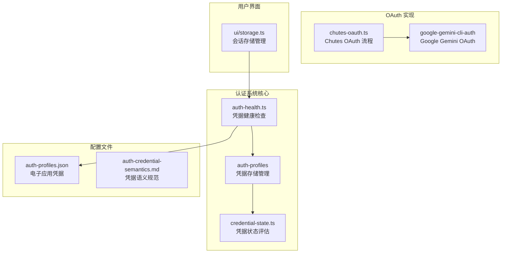
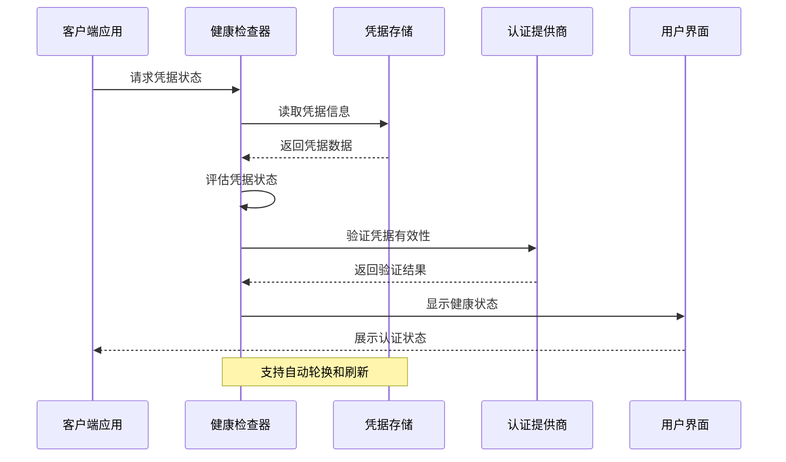
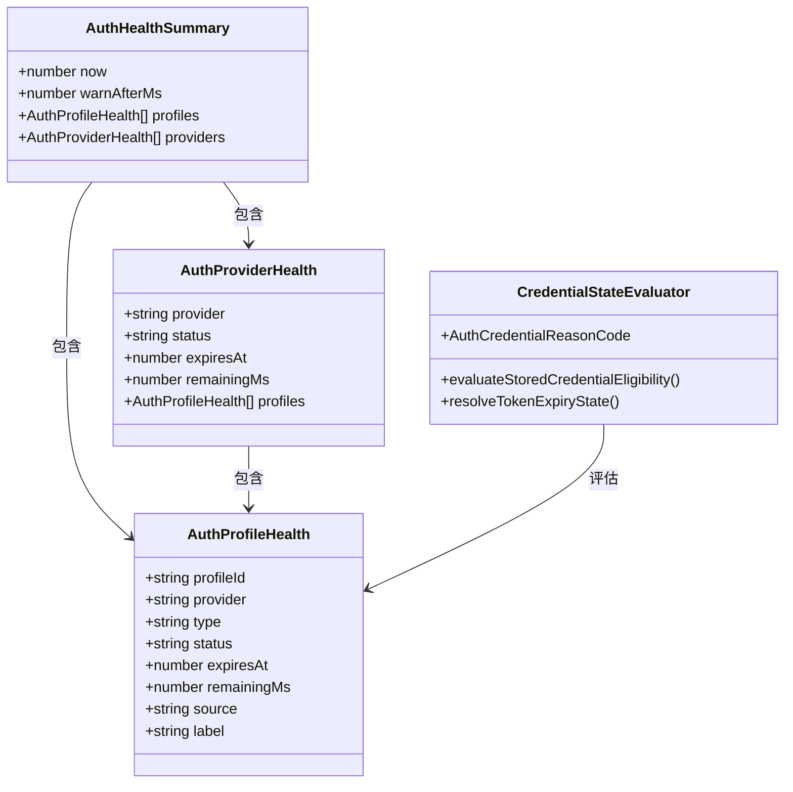
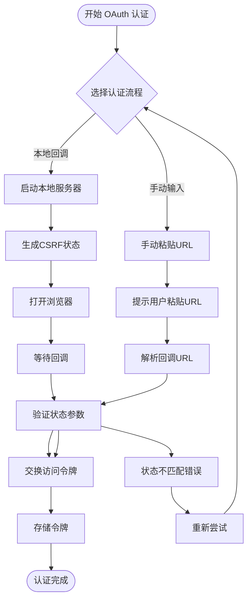
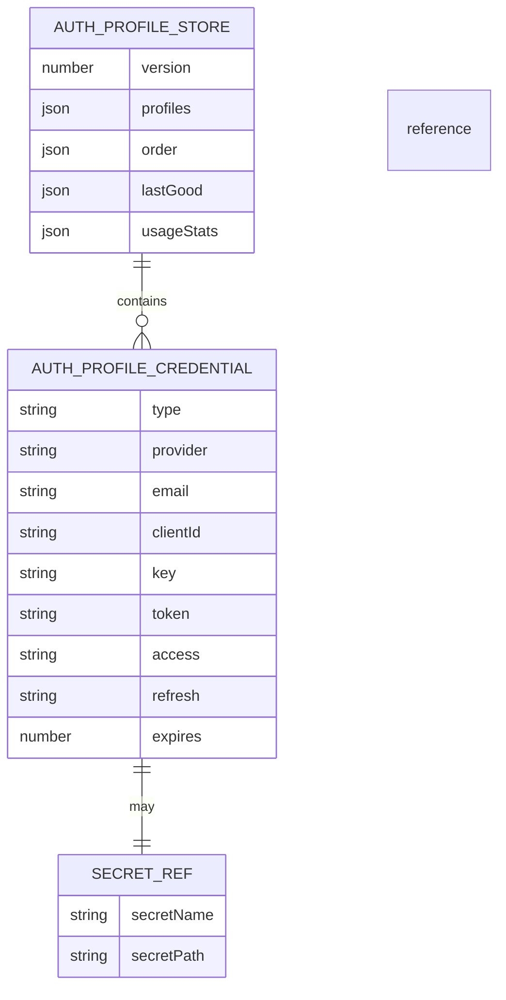

# 认证系统

<cite>
**本文档引用的文件**
- [src/agents/auth-health.ts](file://src/agents/auth-health.ts)
- [src/agents/auth-profiles/types.ts](file://src/agents/auth-profiles/types.ts)
- [src/agents/auth-profiles/credential-state.ts](file://src/agents/auth-profiles/credential-state.ts)
- [apps/electron/auth-profiles.json](file://apps/electron/auth-profiles.json)
- [docs/auth-credential-semantics.md](file://docs/auth-credential-semantics.md)
- [src/agents/chutes-oauth.ts](file://src/agents/chutes-oauth.ts)
- [extensions/google-gemini-cli-auth/oauth.ts](file://extensions/google-gemini-cli-auth/oauth.ts)
- [ui/src/ui/storage.ts](file://ui/src/ui/storage.ts)
</cite>

## 目录
1. [简介](#简介)
2. [项目结构](#项目结构)
3. [核心组件](#核心组件)
4. [架构概览](#架构概览)
5. [详细组件分析](#详细组件分析)
6. [依赖关系分析](#依赖关系分析)
7. [性能考虑](#性能考虑)
8. [故障排除指南](#故障排除指南)
9. [结论](#结论)

## 简介

OpenClaw 认证系统是一个完整的多提供商凭据管理解决方案，支持 OAuth、API 密钥和令牌等多种认证方式。该系统提供了凭据健康检查、自动轮换、状态监控和安全验证等功能，确保应用程序能够可靠地使用各种外部服务。

系统的核心设计目标是提供统一的凭据抽象层，简化不同认证提供商之间的差异，并确保凭据的安全存储和使用。

## 项目结构

认证系统在代码库中的组织结构如下：



**图表来源**
- [src/agents/auth-health.ts:1-284](file://src/agents/auth-health.ts#L1-L284)
- [src/agents/auth-profiles/types.ts:1-82](file://src/agents/auth-profiles/types.ts#L1-L82)
- [src/agents/auth-profiles/credential-state.ts:1-75](file://src/agents/auth-profiles/credential-state.ts#L1-L75)

**章节来源**
- [src/agents/auth-health.ts:1-284](file://src/agents/auth-health.ts#L1-L284)
- [src/agents/auth-profiles/types.ts:1-82](file://src/agents/auth-profiles/types.ts#L1-L82)
- [src/agents/auth-profiles/credential-state.ts:1-75](file://src/agents/auth-profiles/credential-state.ts#L1-L75)

## 核心组件

### 凭据类型系统

认证系统定义了三种主要的凭据类型：

1. **API 密钥凭据**：静态密钥，适用于不需要刷新机制的服务
2. **令牌凭据**：Bearer 令牌，通常用于 OAuth 访问令牌或个人访问令牌
3. **OAuth 凭据**：完整的 OAuth 2.0 凭据集，包含访问令牌、刷新令牌和过期时间

### 健康检查系统

系统提供全面的凭据健康检查功能，包括：
- 过期时间监控
- 凭据有效性验证
- 提供商状态汇总
- 自动轮换支持

### 存储管理

凭据存储采用 JSON 格式，支持版本化管理和持久化存储。

**章节来源**
- [src/agents/auth-profiles/types.ts:5-36](file://src/agents/auth-profiles/types.ts#L5-L36)
- [src/agents/auth-health.ts:17-44](file://src/agents/auth-health.ts#L17-L44)
- [apps/electron/auth-profiles.json:1-13](file://apps/electron/auth-profiles.json#L1-L13)

## 架构概览



**图表来源**
- [src/agents/auth-health.ts:187-283](file://src/agents/auth-health.ts#L187-L283)
- [src/agents/auth-profiles/credential-state.ts:34-74](file://src/agents/auth-profiles/credential-state.ts#L34-L74)

## 详细组件分析

### 凭据健康检查模块

健康检查模块负责监控所有已配置凭据的状态，并提供统一的健康报告：



**图表来源**
- [src/agents/auth-health.ts:17-44](file://src/agents/auth-health.ts#L17-L44)
- [src/agents/auth-health.ts:98-185](file://src/agents/auth-health.ts#L98-L185)
- [src/agents/auth-profiles/credential-state.ts:4-11](file://src/agents/auth-profiles/credential-state.ts#L4-L11)

### OAuth 认证流程

系统支持多种 OAuth 认证流程，包括本地回调和手动输入两种模式：



**图表来源**
- [src/agents/chutes-oauth.ts:45-86](file://src/agents/chutes-oauth.ts#L45-L86)
- [extensions/google-gemini-cli-auth/oauth.ts:305-344](file://extensions/google-gemini-cli-auth/oauth.ts#L305-L344)

### 凭据存储管理

凭据存储系统提供了完整的 CRUD 操作和版本管理：



**图表来源**
- [src/agents/auth-profiles/types.ts:61-73](file://src/agents/auth-profiles/types.ts#L61-L73)
- [apps/electron/auth-profiles.json:1-13](file://apps/electron/auth-profiles.json#L1-L13)

**章节来源**
- [src/agents/auth-health.ts:1-284](file://src/agents/auth-health.ts#L1-L284)
- [src/agents/auth-profiles/types.ts:1-82](file://src/agents/auth-profiles/types.ts#L1-L82)
- [src/agents/auth-profiles/credential-state.ts:1-75](file://src/agents/auth-profiles/credential-state.ts#L1-L75)

## 依赖关系分析

```mermaid
graph LR
subgraph "核心依赖"
TS[TypeScript 类型系统]
FS[文件系统操作]
HTTP[HTTP 客户端]
end
subgraph "第三方库"
PI[@mariozechner/pi-ai<br/>OAuth 2.0 实现]
SECRETS[秘密管理]
end
subgraph "内部模块"
HEALTH[认证健康检查]
STORE[凭据存储]
STATE[状态评估]
OAUTH[OAuth 处理]
end
TS --> HEALTH
FS --> STORE
HTTP --> OAUTH
PI --> OAUTH
SECRETS --> STORE
HEALTH --> STORE
HEALTH --> STATE
STORE --> STATE
OAUTH --> STORE
```

**图表来源**
- [src/agents/auth-health.ts:1-12](file://src/agents/auth-health.ts#L1-L12)
- [src/agents/auth-profiles/types.ts:1-4](file://src/agents/auth-profiles/types.ts#L1-L4)

**章节来源**
- [src/agents/auth-health.ts:1-12](file://src/agents/auth-health.ts#L1-L12)
- [src/agents/auth-profiles/types.ts:1-4](file://src/agents/auth-profiles/types.ts#L1-L4)

## 性能考虑

认证系统的性能优化主要体现在以下几个方面：

1. **缓存策略**：凭据状态在内存中缓存，减少重复验证开销
2. **批量处理**：支持批量健康检查和状态更新
3. **异步操作**：所有网络请求都采用异步非阻塞方式
4. **智能轮换**：基于使用统计的智能凭据轮换策略

## 故障排除指南

### 常见问题及解决方案

| 问题类型 | 症状 | 解决方案 |
|---------|------|----------|
| 凭据过期 | 认证失败，状态显示 expired | 更新凭据或执行轮换 |
| CSRF 验证失败 | OAuth 状态不匹配错误 | 重新发起认证流程 |
| 令牌无效 | 访问被拒绝 | 检查令牌格式和权限范围 |
| 存储损坏 | 凭据无法读取 | 恢复备份或重新配置 |

### 调试工具

系统提供了多种调试工具来帮助诊断认证问题：
- `models status --probe`：检查凭据状态和可用性
- `doctor-auth`：全面的认证健康检查
- 详细的日志记录和错误报告

**章节来源**
- [docs/auth-credential-semantics.md:12-46](file://docs/auth-credential-semantics.md#L12-L46)
- [src/agents/auth-health.ts:80-96](file://src/agents/auth-health.ts#L80-L96)

## 结论

OpenClaw 认证系统通过其模块化的架构设计，为多提供商认证场景提供了强大而灵活的解决方案。系统的核心优势包括：

1. **统一抽象**：通过标准化的数据模型简化了不同认证提供商的集成
2. **完整生命周期管理**：从创建到轮换的全生命周期凭据管理
3. **安全保证**：严格的验证机制和安全的存储实践
4. **可扩展性**：模块化设计支持新认证提供商的轻松集成

该系统为构建可靠的 AI 应用程序提供了坚实的基础设施，确保开发者可以专注于业务逻辑而非认证细节。