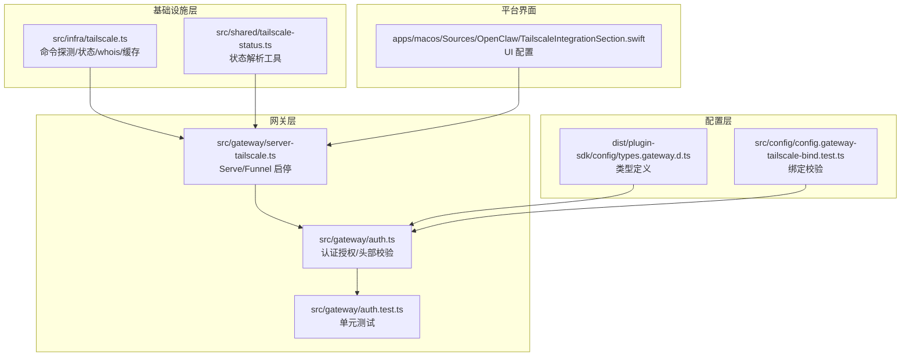
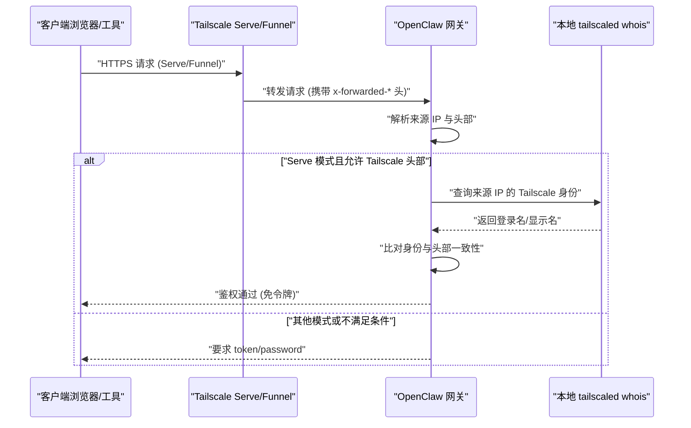
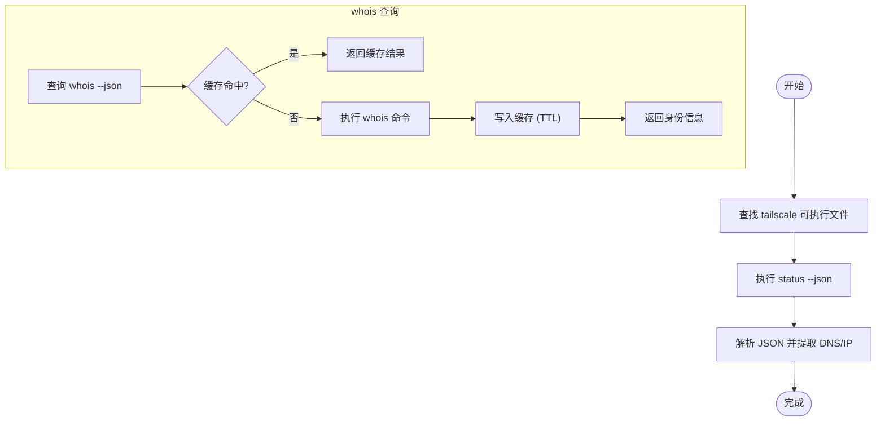
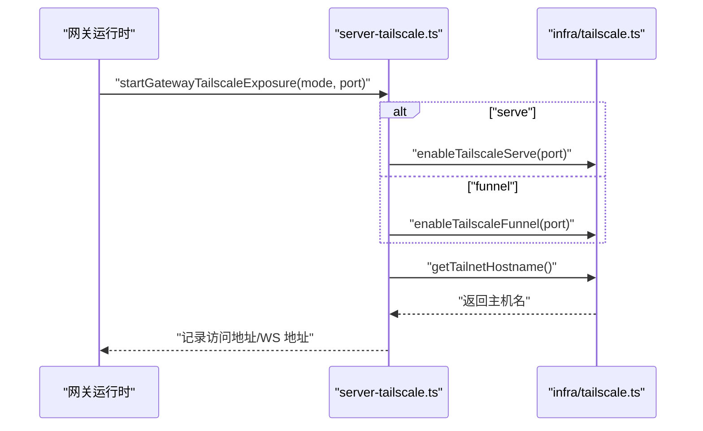
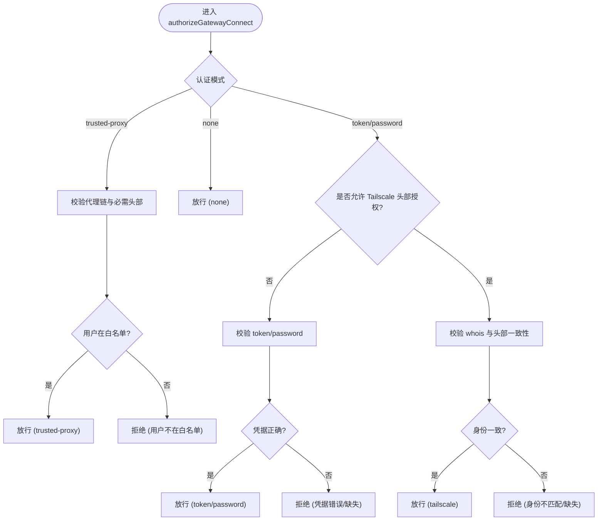
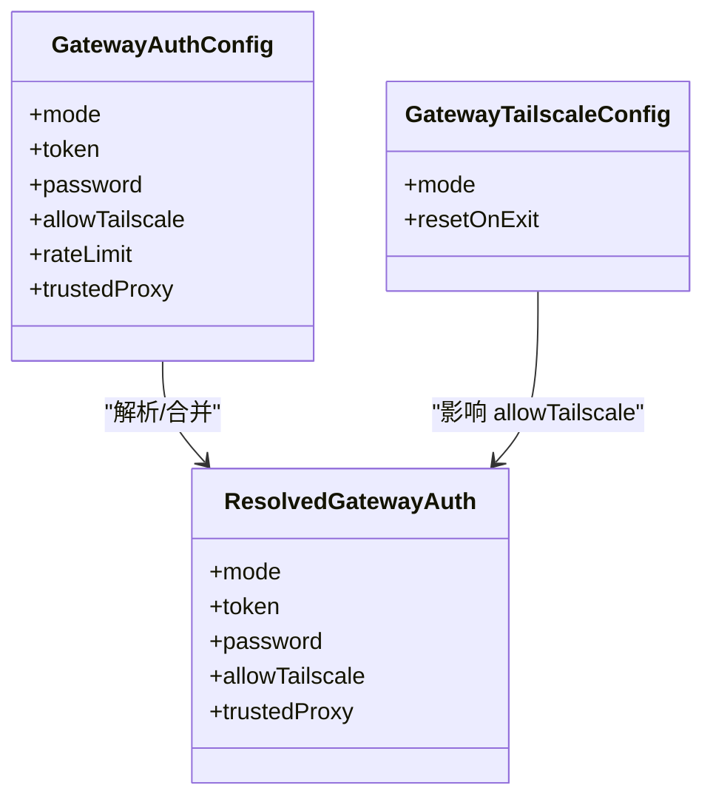
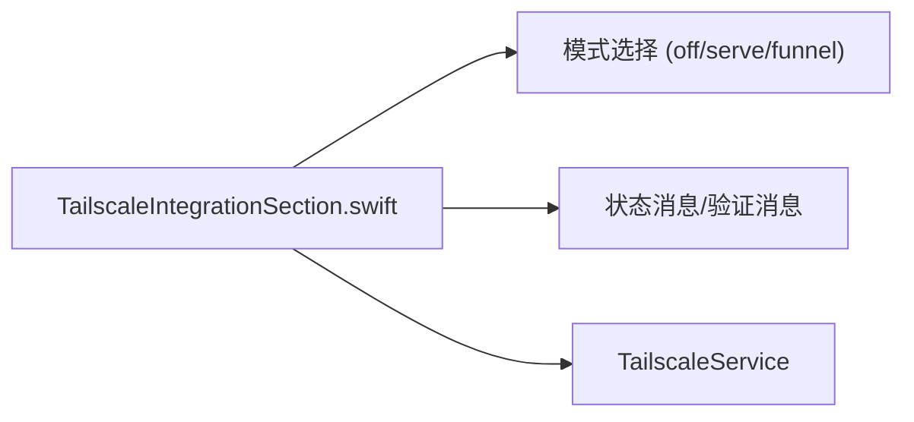
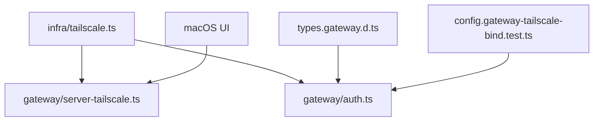

# Tailscale集成

<cite>
**本文引用的文件**
- [docs/gateway/tailscale.md](file://docs/gateway/tailscale.md)
- [src/infra/tailscale.ts](file://src/infra/tailscale.ts)
- [src/gateway/server-tailscale.ts](file://src/gateway/server-tailscale.ts)
- [src/shared/tailscale-status.ts](file://src/shared/tailscale-status.ts)
- [src/gateway/auth.ts](file://src/gateway/auth.ts)
- [src/gateway/auth.test.ts](file://src/gateway/auth.test.ts)
- [src/config/config.gateway-tailscale-bind.test.ts](file://src/config/config.gateway-tailscale-bind.test.ts)
- [dist/plugin-sdk/config/types.gateway.d.ts](file://dist/plugin-sdk/config/types.gateway.d.ts)
- [apps/macos/Sources/OpenClaw/TailscaleIntegrationSection.swift](file://apps/macos/Sources/OpenClaw/TailscaleIntegrationSection.swift)
</cite>

## 目录

1. [简介](#简介)
2. [项目结构](#项目结构)
3. [核心组件](#核心组件)
4. [架构总览](#架构总览)
5. [详细组件分析](#详细组件分析)
6. [依赖关系分析](#依赖关系分析)
7. [性能考量](#性能考量)
8. [故障排除指南](#故障排除指南)
9. [结论](#结论)
10. [附录](#附录)

## 简介

本文件系统性阐述 OpenClaw 与 Tailscale 的集成方案，重点覆盖以下方面：

- Tailscale 用户身份验证：通过 Serve/Funnel 注入的身份头进行可信身份解析
- 反向代理头部处理：对 x-forwarded-\* 头部的识别与校验
- 身份验证流程：在不同暴露模式下的授权路径与安全边界
- 配置项与部署要求：模式选择、绑定策略、重置行为与环境变量
- 最佳实践与安全考虑：最小权限原则、本地信任假设与风险控制

## 项目结构

围绕 Tailscale 集成的关键代码分布在如下模块：

- 基础设施层（infra）：Tailscale 命令探测、状态解析、whois 查询与缓存
- 网关层（gateway）：暴露模式启动/关闭、认证授权、错误码映射
- 配置层（config）：类型定义、配置校验与默认值推导
- 平台界面（macOS）：可视化配置入口与交互

**图表来源**

- [src/infra/tailscale.ts:1-501](file://src/infra/tailscale.ts#L1-L501)
- [src/shared/tailscale-status.ts:1-71](file://src/shared/tailscale-status.ts#L1-L71)
- [src/gateway/server-tailscale.ts:1-59](file://src/gateway/server-tailscale.ts#L1-L59)
- [src/gateway/auth.ts:1-504](file://src/gateway/auth.ts#L1-L504)
- [src/gateway/auth.test.ts:288-595](file://src/gateway/auth.test.ts#L288-L595)
- [src/config/config.gateway-tailscale-bind.test.ts:1-80](file://src/config/config.gateway-tailscale-bind.test.ts#L1-L80)
- [dist/plugin-sdk/config/types.gateway.d.ts:130-329](file://dist/plugin-sdk/config/types.gateway.d.ts#L130-L329)
- [apps/macos/Sources/OpenClaw/TailscaleIntegrationSection.swift:1-55](file://apps/macos/Sources/OpenClaw/TailscaleIntegrationSection.swift#L1-L55)

**章节来源**

- [src/infra/tailscale.ts:1-501](file://src/infra/tailscale.ts#L1-L501)
- [src/gateway/server-tailscale.ts:1-59](file://src/gateway/server-tailscale.ts#L1-L59)
- [src/gateway/auth.ts:1-504](file://src/gateway/auth.ts#L1-L504)
- [src/shared/tailscale-status.ts:1-71](file://src/shared/tailscale-status.ts#L1-L71)
- [src/config/config.gateway-tailscale-bind.test.ts:1-80](file://src/config/config.gateway-tailscale-bind.test.ts#L1-L80)
- [dist/plugin-sdk/config/types.gateway.d.ts:130-329](file://dist/plugin-sdk/config/types.gateway.d.ts#L130-L329)
- [apps/macos/Sources/OpenClaw/TailscaleIntegrationSection.swift:1-55](file://apps/macos/Sources/OpenClaw/TailscaleIntegrationSection.swift#L1-L55)

## 核心组件

- Tailscale 命令与状态管理
  - 自动定位 tailscale 可执行文件，支持多候选路径
  - 解析 status --json 输出，提取 DNS 名称或 IP
  - whois 查询并缓存身份信息，降低重复调用成本
- 网关暴露服务
  - Serve 模式：启用本地 HTTPS，自动输出访问地址
  - Funnel 模式：启用公网 HTTPS，支持用户态 tailscaled
  - 支持退出时自动清理 Serve/Funnel 配置
- 认证与授权
  - 在 Serve 模式下，允许基于 Tailscale 身份头的免令牌登录
  - 仅在特定表面（如 WebSocket 控制 UI）启用该能力
  - 对请求来源进行严格校验，确保来自受信的反向代理链路
- 配置与约束
  - Serve/Funnel 模式下强制 loopback 绑定
  - 提供类型定义与配置校验，防止无效组合导致重启循环

**章节来源**

- [src/infra/tailscale.ts:106-144](file://src/infra/tailscale.ts#L106-L144)
- [src/infra/tailscale.ts:469-500](file://src/infra/tailscale.ts#L469-L500)
- [src/gateway/server-tailscale.ts:9-58](file://src/gateway/server-tailscale.ts#L9-L58)
- [src/gateway/auth.ts:374-376](file://src/gateway/auth.ts#L374-L376)
- [src/gateway/auth.ts:433-446](file://src/gateway/auth.ts#L433-L446)
- [src/config/config.gateway-tailscale-bind.test.ts:4-80](file://src/config/config.gateway-tailscale-bind.test.ts#L4-L80)
- [dist/plugin-sdk/config/types.gateway.d.ts:134-167](file://dist/plugin-sdk/config/types.gateway.d.ts#L134-L167)

## 架构总览

下图展示从客户端到网关的典型访问路径，以及在不同暴露模式下的身份验证流程。

**图表来源**

- [src/gateway/auth.ts:378-485](file://src/gateway/auth.ts#L378-L485)
- [src/infra/tailscale.ts:469-500](file://src/infra/tailscale.ts#L469-L500)
- [docs/gateway/tailscale.md:21-42](file://docs/gateway/tailscale.md#L21-L42)

**章节来源**

- [src/gateway/auth.ts:378-485](file://src/gateway/auth.ts#L378-L485)
- [src/infra/tailscale.ts:469-500](file://src/infra/tailscale.ts#L469-L500)
- [docs/gateway/tailscale.md:21-42](file://docs/gateway/tailscale.md#L21-L42)

## 详细组件分析

### Tailscale 命令与状态解析

- 命令探测：优先 PATH 查找，回退至已知应用路径与 locate 结果
- 状态解析：从 status --json 中提取 Self.DNSName 或 TailscaleIPs
- whois 缓存：对查询结果按 TTL 进行缓存，减少重复调用
- 权限降级：若命令失败且提示权限不足，尝试使用 sudo 重试

**图表来源**

- [src/infra/tailscale.ts:29-104](file://src/infra/tailscale.ts#L29-L104)
- [src/infra/tailscale.ts:165-175](file://src/infra/tailscale.ts#L165-L175)
- [src/infra/tailscale.ts:469-500](file://src/infra/tailscale.ts#L469-L500)

**章节来源**

- [src/infra/tailscale.ts:29-104](file://src/infra/tailscale.ts#L29-L104)
- [src/infra/tailscale.ts:165-175](file://src/infra/tailscale.ts#L165-L175)
- [src/infra/tailscale.ts:469-500](file://src/infra/tailscale.ts#L469-L500)

### 网关暴露服务（Serve/Funnel）

- 启动：根据模式调用 tailscale serve/funnel，输出可访问地址
- 清理：支持在退出时自动 reset Serve/Funnel
- 主机解析：通过 getTailnetHostname 获取尾网主机名用于日志输出

**图表来源**

- [src/gateway/server-tailscale.ts:9-58](file://src/gateway/server-tailscale.ts#L9-L58)
- [src/infra/tailscale.ts:392-422](file://src/infra/tailscale.ts#L392-L422)
- [src/infra/tailscale.ts:106-144](file://src/infra/tailscale.ts#L106-L144)

**章节来源**

- [src/gateway/server-tailscale.ts:9-58](file://src/gateway/server-tailscale.ts#L9-L58)
- [src/infra/tailscale.ts:392-422](file://src/infra/tailscale.ts#L392-L422)
- [src/infra/tailscale.ts:106-144](file://src/infra/tailscale.ts#L106-L144)

### 认证与授权（含 Tailscale 身份头）

- 授权入口
  - authorizeGatewayConnect：统一入口，区分 HTTP 与 WebSocket 控制 UI 表面
  - authorizeHttpGatewayConnect：HTTP 包装器，禁用 Tailscale 头部授权
  - authorizeWsControlUiGatewayConnect：WebSocket 控制 UI 包装器，允许 Tailscale 头部授权
- 身份验证流程
  - 若为受信代理模式，先校验代理链与必需头部，再提取用户
  - 若为 none 模式，直接放行
  - 若允许 Tailscale 头部授权且请求非直连本地，则进行 whois 校验
  - 其他模式按 token/password 流程校验
- 错误码映射
  - 将具体原因映射为标准化错误码，便于前端提示与诊断

**图表来源**

- [src/gateway/auth.ts:378-485](file://src/gateway/auth.ts#L378-L485)
- [src/gateway/auth.ts:487-503](file://src/gateway/auth.ts#L487-L503)

**章节来源**

- [src/gateway/auth.ts:378-485](file://src/gateway/auth.ts#L378-L485)
- [src/gateway/auth.ts:487-503](file://src/gateway/auth.ts#L487-L503)
- [src/gateway/auth.test.ts:288-330](file://src/gateway/auth.test.ts#L288-L330)

### 配置与约束

- 类型定义
  - GatewayAuthConfig：mode/token/password/allowTailscale/rateLimit/trustedProxy
  - GatewayTailscaleConfig：mode/resetOnExit
- 绑定约束
  - Serve/Funnel 模式下必须绑定 loopback；否则拒绝配置
  - 不允许使用 IPv6 loopback 作为自定义绑定
- 默认行为
  - 当 tailscale.mode 为 serve 且非 password/trusted-proxy 模式时，默认允许 Tailscale 头部授权

**图表来源**

- [dist/plugin-sdk/config/types.gateway.d.ts:134-167](file://dist/plugin-sdk/config/types.gateway.d.ts#L134-L167)
- [src/gateway/auth.ts:217-292](file://src/gateway/auth.ts#L217-L292)

**章节来源**

- [dist/plugin-sdk/config/types.gateway.d.ts:134-167](file://dist/plugin-sdk/config/types.gateway.d.ts#L134-L167)
- [src/gateway/auth.ts:217-292](file://src/gateway/auth.ts#L217-L292)
- [src/config/config.gateway-tailscale-bind.test.ts:4-80](file://src/config/config.gateway-tailscale-bind.test.ts#L4-L80)

### 平台界面（macOS）

- UI 展示三种模式：Off、Tailnet (Serve)、Public (Funnel)
- 提供状态提示与验证消息，支持调试定时器刷新
- 与后端服务协作，动态更新状态与提示

**图表来源**

- [apps/macos/Sources/OpenClaw/TailscaleIntegrationSection.swift:32-55](file://apps/macos/Sources/OpenClaw/TailscaleIntegrationSection.swift#L32-L55)

**章节来源**

- [apps/macos/Sources/OpenClaw/TailscaleIntegrationSection.swift:32-55](file://apps/macos/Sources/OpenClaw/TailscaleIntegrationSection.swift#L32-L55)

## 依赖关系分析

- 网关暴露服务依赖基础设施层的命令执行与状态解析
- 认证授权依赖 whois 查询与头部校验，同时受配置层约束
- UI 层与网关层通过服务接口交互，驱动状态更新

**图表来源**

- [src/infra/tailscale.ts:1-501](file://src/infra/tailscale.ts#L1-L501)
- [src/gateway/server-tailscale.ts:1-59](file://src/gateway/server-tailscale.ts#L1-L59)
- [src/gateway/auth.ts:1-504](file://src/gateway/auth.ts#L1-L504)
- [src/config/config.gateway-tailscale-bind.test.ts:1-80](file://src/config/config.gateway-tailscale-bind.test.ts#L1-L80)
- [dist/plugin-sdk/config/types.gateway.d.ts:134-167](file://dist/plugin-sdk/config/types.gateway.d.ts#L134-L167)
- [apps/macos/Sources/OpenClaw/TailscaleIntegrationSection.swift:32-55](file://apps/macos/Sources/OpenClaw/TailscaleIntegrationSection.swift#L32-L55)

**章节来源**

- [src/infra/tailscale.ts:1-501](file://src/infra/tailscale.ts#L1-L501)
- [src/gateway/server-tailscale.ts:1-59](file://src/gateway/server-tailscale.ts#L1-L59)
- [src/gateway/auth.ts:1-504](file://src/gateway/auth.ts#L1-L504)
- [src/config/config.gateway-tailscale-bind.test.ts:1-80](file://src/config/config.gateway-tailscale-bind.test.ts#L1-L80)
- [dist/plugin-sdk/config/types.gateway.d.ts:134-167](file://dist/plugin-sdk/config/types.gateway.d.ts#L134-L167)
- [apps/macos/Sources/OpenClaw/TailscaleIntegrationSection.swift:32-55](file://apps/macos/Sources/OpenClaw/TailscaleIntegrationSection.swift#L32-L55)

## 性能考量

- whois 查询缓存：默认缓存 60 秒，错误项缓存 5 秒，降低频繁查询开销
- 命令超时与缓冲区限制：避免长时间阻塞与内存占用过高
- 仅在必要表面启用 Tailscale 头部授权，减少额外校验成本

**章节来源**

- [src/infra/tailscale.ts:465-467](file://src/infra/tailscale.ts#L465-L467)
- [src/infra/tailscale.ts:168-175](file://src/infra/tailscale.ts#L168-L175)
- [src/gateway/auth.ts:374-376](file://src/gateway/auth.ts#L374-L376)

## 故障排除指南

- 无法找到 tailscale 可执行文件
  - 检查 PATH 与应用路径；确认已安装 Tailscale CLI
  - 参考命令探测策略与回退路径
- whois 查询失败
  - 确认本地 tailscaled 正常运行
  - 检查网络与权限；必要时使用 sudo 重试
- Serve/Funnel 启用失败
  - 确认 tailnet 已启用 HTTPS；检查 Funnel 版本与节点属性
  - 在 macOS 上使用开源版本 Tailscale 应用
- 绑定配置被拒绝
  - Serve/Funnel 模式必须绑定 loopback；禁止非 loopback 绑定
  - 不支持 IPv6 loopback 作为自定义绑定
- 身份验证失败
  - 确保请求来自 loopback 并携带正确的 x-forwarded-\* 头
  - 核对 allowTailscale 配置与 authSurface（仅 WebSocket 控制 UI 启用）

**章节来源**

- [src/infra/tailscale.ts:29-104](file://src/infra/tailscale.ts#L29-L104)
- [src/infra/tailscale.ts:275-300](file://src/infra/tailscale.ts#L275-L300)
- [docs/gateway/tailscale.md:100-126](file://docs/gateway/tailscale.md#L100-L126)
- [src/config/config.gateway-tailscale-bind.test.ts:48-78](file://src/config/config.gateway-tailscale-bind.test.ts#L48-L78)
- [src/gateway/auth.ts:433-446](file://src/gateway/auth.ts#L433-L446)

## 结论

OpenClaw 的 Tailscale 集成通过“本地绑定 + 远程暴露”的方式，在保证安全性的同时提供了灵活的远程访问能力。其关键在于：

- 明确的模式边界（serve/funnel/off）
- 严格的来源校验与身份头信任策略
- 完善的配置约束与错误码映射
- 可选的退出清理与缓存优化

建议在生产环境中遵循最小权限原则，谨慎开启 allowTailscale，并结合速率限制与白名单策略进一步加固。

## 附录

### 配置示例与要点

- Tailnet-only（Serve）
  - gateway.bind: loopback
  - gateway.tailscale.mode: serve
  - 访问：MagicDNS 或自定义 basePath
- Tailnet-only（绑定 Tailnet IP）
  - gateway.bind: tailnet
  - gateway.auth.mode: token/password
  - 注意：loopback 不可用，需从 Tailnet 设备访问
- Public（Funnel + 共享密码）
  - gateway.bind: loopback
  - gateway.tailscale.mode: funnel
  - gateway.auth.mode: password
  - Funnel 仅支持特定端口与平台要求

**章节来源**

- [docs/gateway/tailscale.md:44-98](file://docs/gateway/tailscale.md#L44-L98)

### 安全最佳实践

- 仅在受信主机上启用免令牌登录（Serve 模式）
- 禁止在不受信主机上使用 allowTailscale
- 使用共享密码（Funnel）而非明文 token
- 启用速率限制与白名单
- 在退出时启用 resetOnExit，避免残留暴露

**章节来源**

- [docs/gateway/tailscale.md:28-42](file://docs/gateway/tailscale.md#L28-L42)
- [src/gateway/auth.ts:280-282](file://src/gateway/auth.ts#L280-L282)
