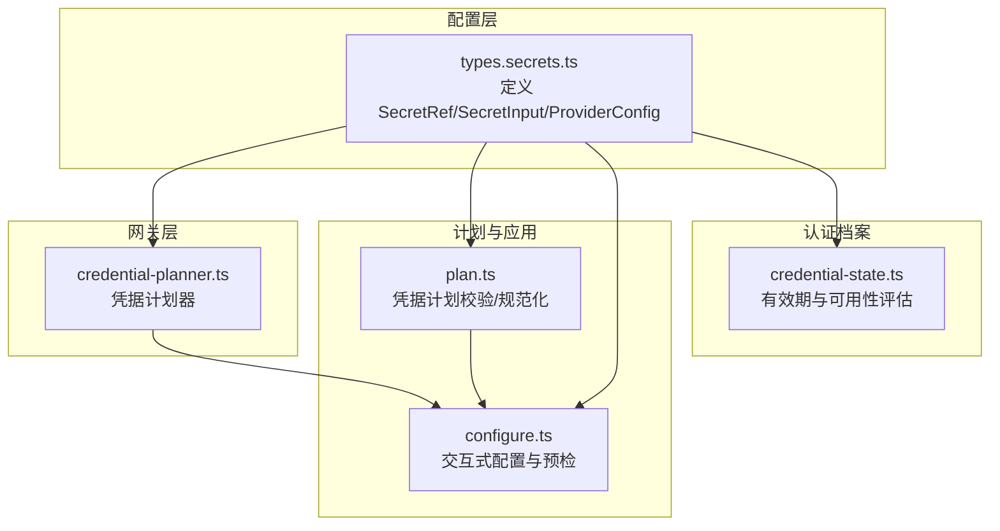
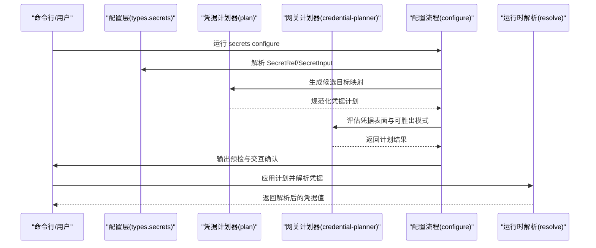
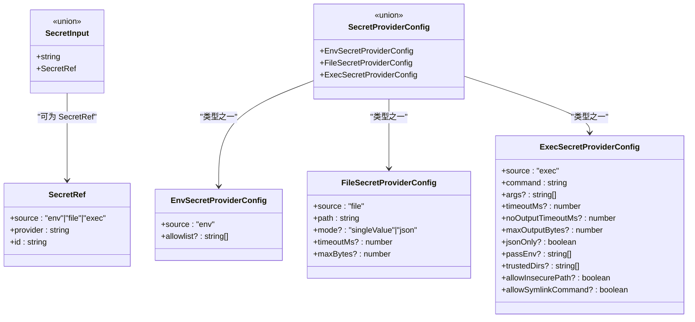
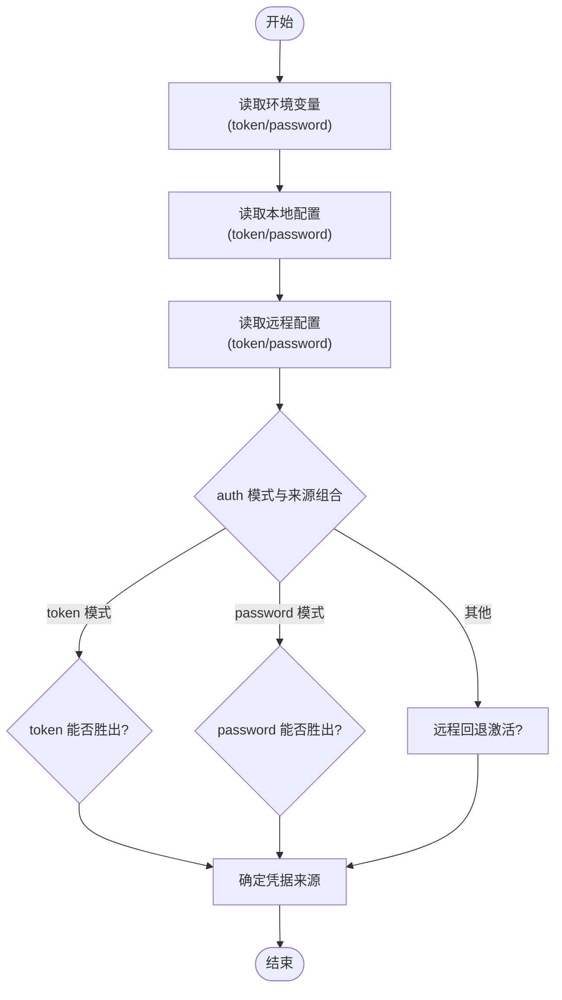
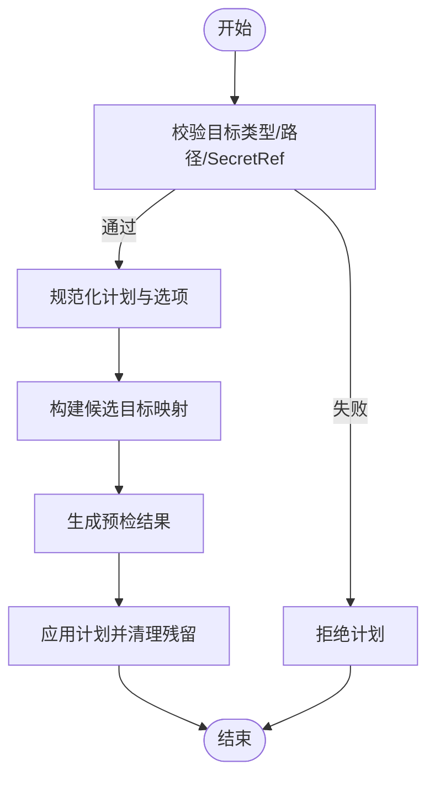
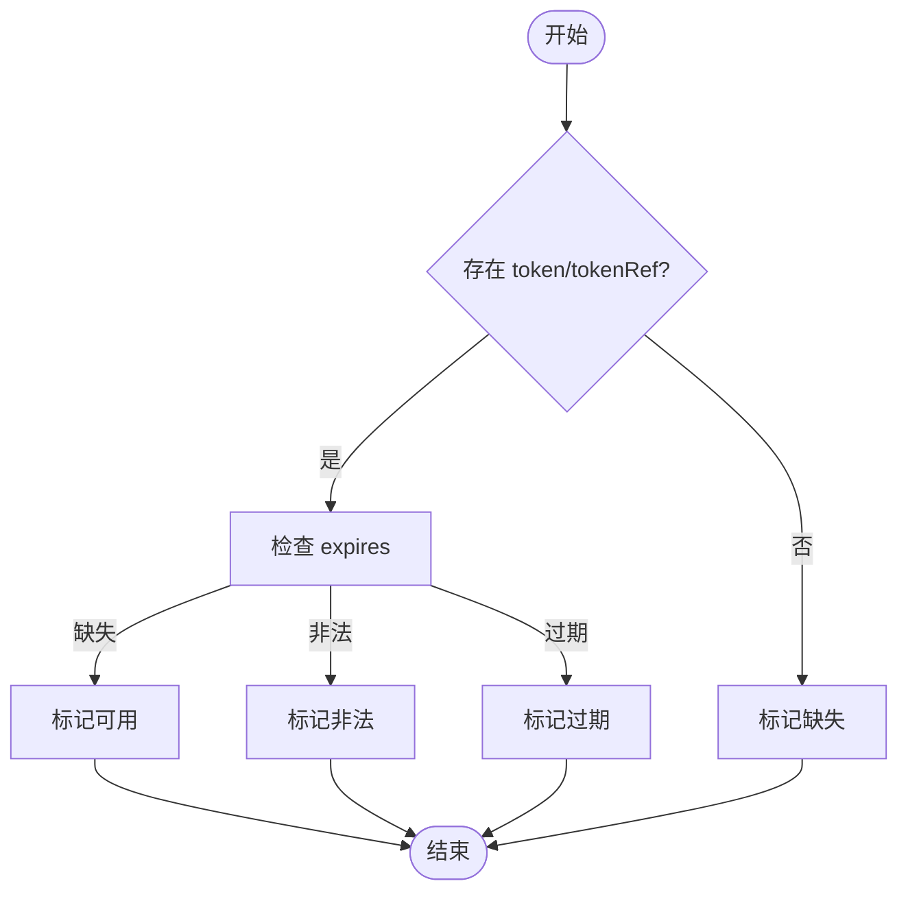
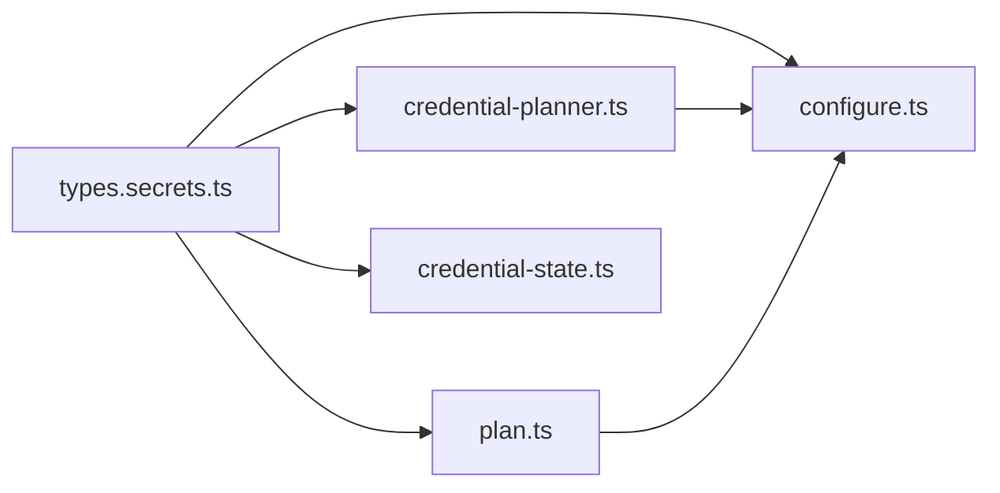

# 凭据管理

<cite>
**本文引用的文件**
- [src/config/types.secrets.ts](file://src/config/types.secrets.ts)
- [src/gateway/credential-planner.ts](file://src/gateway/credential-planner.ts)
- [src/secrets/plan.ts](file://src/secrets/plan.ts)
- [src/secrets/configure.ts](file://src/secrets/configure.ts)
- [src/agents/auth-profiles/credential-state.ts](file://src/agents/auth-profiles/credential-state.ts)
- [docs/auth-credential-semantics.md](file://docs/auth-credential-semantics.md)
- [docs/reference/secretref-credential-surface.md](file://docs/reference/secretref-credential-surface.md)
</cite>

## 目录

1. [简介](#简介)
2. [项目结构](#项目结构)
3. [核心组件](#核心组件)
4. [架构总览](#架构总览)
5. [详细组件分析](#详细组件分析)
6. [依赖关系分析](#依赖关系分析)
7. [性能考量](#性能考量)
8. [故障排除指南](#故障排除指南)
9. [结论](#结论)
10. [附录](#附录)

## 简介

本文件系统化阐述 OpenClaw 的凭据管理体系，覆盖凭据存储、解析与管理机制；解释凭据来源优先级（环境变量、文件、可执行脚本）与凭据计划器的工作原理；详述凭据验证规则、过期状态判定与错误处理；并提供配置最佳实践、安全建议与故障排除清单。

## 项目结构

凭据相关能力主要分布在以下模块：

- 配置层：定义 SecretRef、SecretInput、SecretProviderConfig 及默认值解析逻辑
- 网关层：凭据计划器，用于评估网关本地/远程凭据表面与可胜出模式
- 凭据计划与应用：凭据计划构建、校验与应用选项
- 凭据配置流程：交互式配置凭据提供者与目标映射
- 认证档案与有效期：认证档案凭据的可用性与过期状态评估

**图表来源**

- [src/config/types.secrets.ts:1-225](file://src/config/types.secrets.ts#L1-L225)
- [src/gateway/credential-planner.ts:1-217](file://src/gateway/credential-planner.ts#L1-L217)
- [src/secrets/plan.ts:1-197](file://src/secrets/plan.ts#L1-L197)
- [src/secrets/configure.ts:1-992](file://src/secrets/configure.ts#L1-L992)
- [src/agents/auth-profiles/credential-state.ts:1-39](file://src/agents/auth-profiles/credential-state.ts#L1-L39)

**章节来源**

- [src/config/types.secrets.ts:1-225](file://src/config/types.secrets.ts#L1-L225)
- [src/gateway/credential-planner.ts:1-217](file://src/gateway/credential-planner.ts#L1-L217)
- [src/secrets/plan.ts:1-197](file://src/secrets/plan.ts#L1-L197)
- [src/secrets/configure.ts:1-992](file://src/secrets/configure.ts#L1-L992)
- [src/agents/auth-profiles/credential-state.ts:1-39](file://src/agents/auth-profiles/credential-state.ts#L1-L39)

## 核心组件

- SecretRef 与 SecretInput
  - 支持三种来源：env、file、exec
  - 兼容旧版无 provider 的 SecretRef 表达，按默认来源推断 provider
  - 支持环境模板字符串解析为 SecretRef
- 凭据计划器（GatewayCredentialPlan）
  - 综合环境变量、本地配置与远程配置，计算“可胜出”凭据面与生效模式
  - 区分 token/password 模式，支持遗留环境变量兼容
- 凭据计划（SecretsApplyPlan）
  - 规范化目标路径、校验 SecretRef 结构与来源合法性
  - 提供清理策略开关（如清理环境变量、认证档案残留等）
- 交互式配置（runSecretsConfigureInteractive）
  - 定义/编辑/删除提供者，选择来源类型与参数
  - 构建候选目标映射，生成预检结果与最终应用计划
- 认证档案凭据评估
  - 判断凭据是否可用、过期或引用未解析
  - 提供稳定原因码，便于诊断与自动化输出

**章节来源**

- [src/config/types.secrets.ts:10-119](file://src/config/types.secrets.ts#L10-L119)
- [src/gateway/credential-planner.ts:19-216](file://src/gateway/credential-planner.ts#L19-L216)
- [src/secrets/plan.ts:48-197](file://src/secrets/plan.ts#L48-L197)
- [src/secrets/configure.ts:745-992](file://src/secrets/configure.ts#L745-L992)
- [src/agents/auth-profiles/credential-state.ts:4-39](file://src/agents/auth-profiles/credential-state.ts#L4-L39)

## 架构总览

凭据从“配置输入”到“运行时解析”的端到端流程如下：

**图表来源**

- [src/config/types.secrets.ts:158-174](file://src/config/types.secrets.ts#L158-L174)
- [src/secrets/plan.ts:77-106](file://src/secrets/plan.ts#L77-L106)
- [src/gateway/credential-planner.ts:137-216](file://src/gateway/credential-planner.ts#L137-L216)
- [src/secrets/configure.ts:745-992](file://src/secrets/configure.ts#L745-L992)

## 详细组件分析

### 配置层：SecretRef 与 SecretInput

- 来源与标识
  - env：以大写常量形式的环境变量名作为 id
  - file：以 JSON 或单值模式读取的绝对路径作为 id
  - exec：以可执行命令及其参数作为 id，支持超时、输出大小限制与仅 JSON 响应
- 默认提供者别名与模板解析
  - 支持通过默认字段自动补齐 provider
  - 支持环境模板字符串解析为 SecretRef
- 输入归一化与引用解析
  - 归一化去除空白，保留非空字符串
  - 解析显式/内联 SecretRef，若引用未解析则抛错提示

**图表来源**

- [src/config/types.secrets.ts:10-24, 176-224:10-24](file://src/config/types.secrets.ts#L10-L24)
- [src/config/types.secrets.ts:176-224](file://src/config/types.secrets.ts#L176-L224)

**章节来源**

- [src/config/types.secrets.ts:10-119](file://src/config/types.secrets.ts#L10-L119)
- [src/config/types.secrets.ts:158-174](file://src/config/types.secrets.ts#L158-L174)

### 网关凭据计划器：来源优先级与生效判定

- 优先级来源
  - 环境变量（token/password，含遗留键名）
  - 本地配置（gateway.auth.token/password）
  - 远程配置（gateway.remote.token/password）
- 生效判定
  - 根据 auth 模式与各来源是否配置，决定 token 或 password 能否胜出
  - 当处于远程模式或暴露远程 URL/Tailscale 时，远程凭据可激活回退路径
- 关键行为
  - 对环境变量值进行“去空白且剔除未解析占位符”处理，避免将占位符字符串误认有效
  - 将本地/远程凭据的“是否已配置”与“引用是否存在”分别标注，便于诊断

**图表来源**

- [src/gateway/credential-planner.ts:137-216](file://src/gateway/credential-planner.ts#L137-L216)

**章节来源**

- [src/gateway/credential-planner.ts:45-117](file://src/gateway/credential-planner.ts#L45-L117)
- [src/gateway/credential-planner.ts:137-216](file://src/gateway/credential-planner.ts#L137-L216)

### 凭据计划与应用：目标校验与清理策略

- 目标校验
  - 类型、路径与路径段必须合法，禁止危险路径段
  - SecretRef 必须包含合法来源、provider 与 id，exec 类型需满足执行 ID 合法性
  - 针对认证档案目标，要求 agentId 与可选 provider 信息完整
- 计划规范化
  - 默认启用清理策略：清理环境变量、认证档案残留、旧式 auth.json
- 交互式配置
  - 支持添加/编辑/删除提供者，选择来源类型与参数
  - 构建候选目标映射，生成预检结果与最终应用计划

**图表来源**

- [src/secrets/plan.ts:77-197](file://src/secrets/plan.ts#L77-L197)
- [src/secrets/configure.ts:745-992](file://src/secrets/configure.ts#L745-L992)

**章节来源**

- [src/secrets/plan.ts:48-197](file://src/secrets/plan.ts#L48-L197)
- [src/secrets/configure.ts:745-992](file://src/secrets/configure.ts#L745-L992)

### 认证档案凭据评估：有效期与可用性

- 评估维度
  - 是否存在凭据
  - expires 字段是否有效（数值、正数、有限）
  - 是否已过期
  - 引用是否可解析
- 稳定原因码
  - ok、missing_credential、invalid_expires、expired、unresolved_ref
- 与诊断工具协同
  - 与 models status --probe、doctor-auth 等工具保持语义一致

**图表来源**

- [src/agents/auth-profiles/credential-state.ts:13-39](file://src/agents/auth-profiles/credential-state.ts#L13-L39)
- [docs/auth-credential-semantics.md:12-46](file://docs/auth-credential-semantics.md#L12-L46)

**章节来源**

- [src/agents/auth-profiles/credential-state.ts:4-39](file://src/agents/auth-profiles/credential-state.ts#L4-L39)
- [docs/auth-credential-semantics.md:12-46](file://docs/auth-credential-semantics.md#L12-L46)

## 依赖关系分析

- 配置层为上层模块提供统一的 SecretRef/SecretInput 语义与解析函数
- 凭据计划器依赖配置层的 SecretInput 解析与默认值策略
- 交互式配置流程依赖计划器与配置层，完成候选目标构建与预检
- 认证档案评估独立于运行时解析，但与配置层的 SecretInput 语义保持一致

**图表来源**

- [src/config/types.secrets.ts:1-225](file://src/config/types.secrets.ts#L1-L225)
- [src/gateway/credential-planner.ts:1-217](file://src/gateway/credential-planner.ts#L1-L217)
- [src/secrets/plan.ts:1-197](file://src/secrets/plan.ts#L1-L197)
- [src/secrets/configure.ts:1-992](file://src/secrets/configure.ts#L1-L992)
- [src/agents/auth-profiles/credential-state.ts:1-39](file://src/agents/auth-profiles/credential-state.ts#L1-L39)

**章节来源**

- [src/config/types.secrets.ts:1-225](file://src/config/types.secrets.ts#L1-L225)
- [src/gateway/credential-planner.ts:1-217](file://src/gateway/credential-planner.ts#L1-L217)
- [src/secrets/plan.ts:1-197](file://src/secrets/plan.ts#L1-L197)
- [src/secrets/configure.ts:1-992](file://src/secrets/configure.ts#L1-L992)
- [src/agents/auth-profiles/credential-state.ts:1-39](file://src/agents/auth-profiles/credential-state.ts#L1-L39)

## 性能考量

- 并发与批处理
  - 配置层提供 resolution 并发与批大小上限参数，避免一次性解析过多引用导致资源压力
- I/O 限制
  - 文件提供者支持超时与最大字节数限制；exec 提供者支持超时、无输出超时与最大输出字节限制
- 路径与引用校验
  - 在计划阶段严格校验路径段与引用合法性，减少运行时错误重试成本

**章节来源**

- [src/config/types.secrets.ts:212-224](file://src/config/types.secrets.ts#L212-L224)
- [src/secrets/plan.ts:63-75](file://src/secrets/plan.ts#L63-L75)

## 故障排除指南

- “凭据缺失或已过期”
  - 使用 models status --probe 或 doctor-auth 获取稳定原因码与人类可读详情
  - 参考稳定原因码定位问题：缺失、非法 expires、过期、未解析引用
- 环境变量占位符误判
  - 确保环境变量值不包含未解析的占位符（如 ${VAR}），计划器会将其视为无效
- exec 提供者安全限制
  - 确保命令路径为绝对路径且符合安全策略；必要时允许不受信路径或符号链接需谨慎
- 认证档案过期
  - 更新 expires 或重新配置认证档案；确保引用可解析
- 凭据表面冲突
  - 检查 auth 模式与来源配置，确认 token/password 能否胜出；在远程模式下注意回退路径

**章节来源**

- [docs/auth-credential-semantics.md:12-46](file://docs/auth-credential-semantics.md#L12-L46)
- [src/gateway/credential-planner.ts:75-81](file://src/gateway/credential-planner.ts#L75-L81)
- [src/secrets/configure.ts:495-622](file://src/secrets/configure.ts#L495-L622)
- [src/agents/auth-profiles/credential-state.ts:13-39](file://src/agents/auth-profiles/credential-state.ts#L13-L39)

## 结论

OpenClaw 的凭据管理以“配置层语义 + 计划器 + 交互式配置 + 评估与诊断”为主线，形成从“输入—计划—应用—验证”的闭环。通过明确的来源优先级、严格的计划校验与清理策略、以及稳定的诊断语义，系统在安全性与可用性之间取得平衡。建议在生产中遵循最小暴露原则、定期轮换密钥、使用 exec/file 提供者并设置合理超时与大小限制。

## 附录

- 凭据表面范围参考
  - 支持与不支持的 SecretRef 凭据面参考文档，用于审计凭据是否可由 secrets configure/apply 处理
- 最佳实践摘要
  - 优先使用 env/file/exec 提供者而非硬编码明文
  - 为不同提供商配置独立别名，便于切换与审计
  - 启用默认清理策略，避免残留敏感信息
  - 为 exec 提供者设置 jsonOnly、超时与输出限制
  - 定期更新 expires，避免过期导致服务中断

**章节来源**

- [docs/reference/secretref-credential-surface.md:1-24](file://docs/reference/secretref-credential-surface.md#L1-L24)
