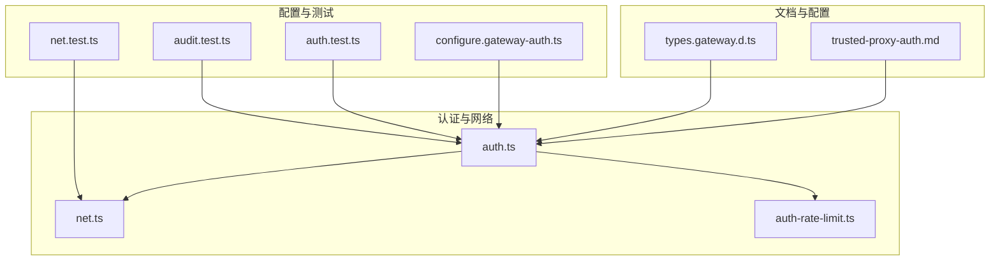
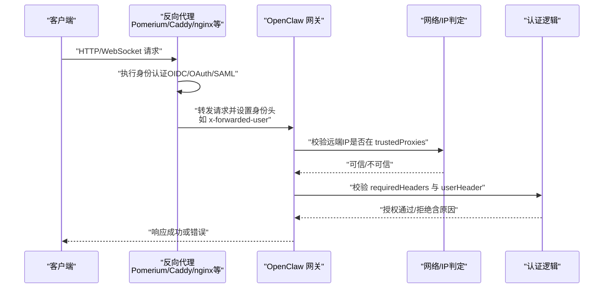
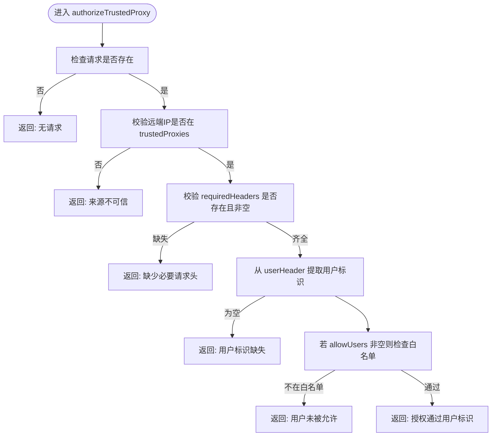
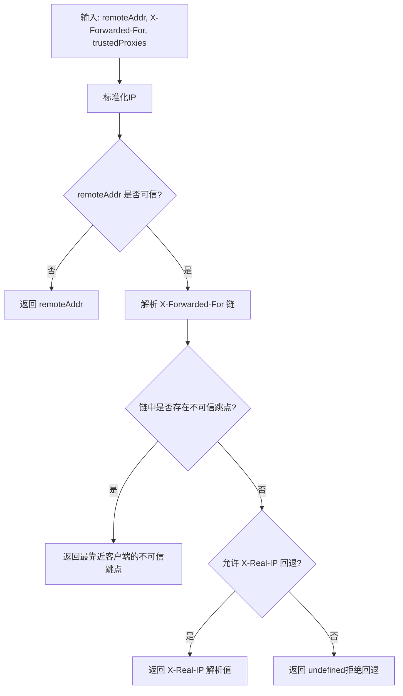
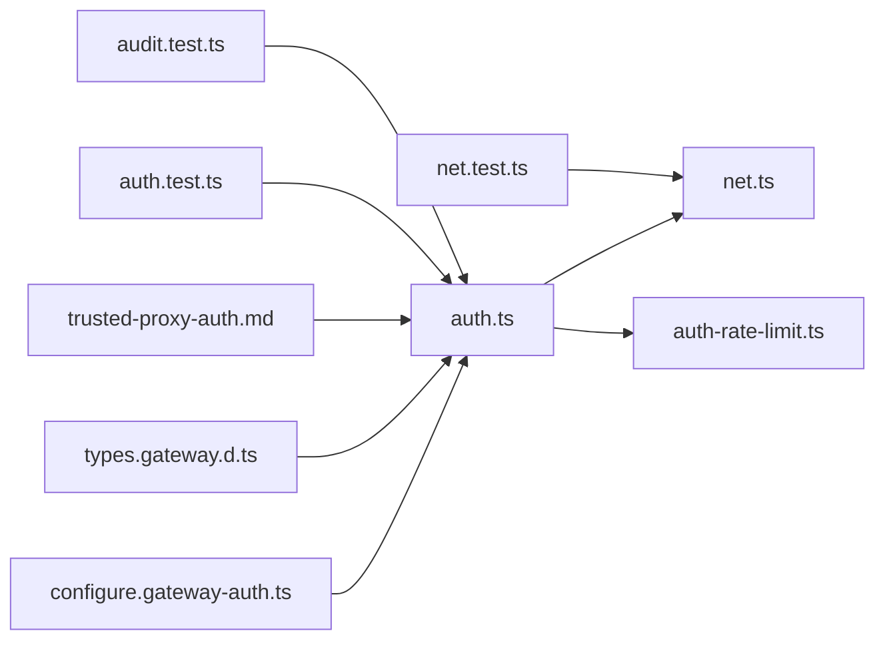

# 受信任代理认证

<cite>
**本文档引用的文件**
- [trusted-proxy-auth.md](file://docs/gateway/trusted-proxy-auth.md)
- [auth.ts](file://src/gateway/auth.ts)
- [net.ts](file://src/gateway/net.ts)
- [auth-rate-limit.ts](file://src/gateway/auth-rate-limit.ts)
- [configure.gateway-auth.ts](file://src/commands/configure.gateway-auth.ts)
- [types.gateway.d.ts](file://dist/plugin-sdk/config/types.gateway.d.ts)
- [auth.test.ts](file://src/gateway/auth.test.ts)
- [net.test.ts](file://src/gateway/net.test.ts)
- [audit.test.ts](file://src/security/audit.test.ts)
</cite>

## 目录

1. [简介](#简介)
2. [项目结构](#项目结构)
3. [核心组件](#核心组件)
4. [架构总览](#架构总览)
5. [详细组件分析](#详细组件分析)
6. [依赖关系分析](#依赖关系分析)
7. [性能考量](#性能考量)
8. [故障排除指南](#故障排除指南)
9. [结论](#结论)
10. [附录](#附录)

## 简介

本文件系统性阐述 OpenClaw 的“受信任代理认证”（trusted-proxy）机制：如何通过反向代理集中处理身份认证，并由 OpenClaw 在已知可信来源的基础上信任代理传递的身份信息；涵盖代理服务器配置、用户身份提取与请求头验证、配置参数、用户白名单与安全策略、部署架构、配置示例、安全最佳实践、故障排除与性能优化建议。

## 项目结构

与受信任代理认证直接相关的核心文件分布如下：

- 文档：trusted-proxy-auth.md 提供配置参考、示例与安全检查清单
- 认证核心：auth.ts 实现授权流程、模式解析与错误原因返回
- 网络与IP判定：net.ts 提供代理可信度判断、客户端IP解析与本地地址判定
- 速率限制：auth-rate-limit.ts 提供共享凭据的滑动窗口限流
- 配置构建：configure.gateway-auth.ts 支持交互式构建 trusted-proxy 配置
- 类型定义：types.gateway.d.ts 定义 trusted-proxy 配置的数据结构
- 测试：auth.test.ts、net.test.ts、audit.test.ts 提供行为与安全审计覆盖

图表来源

- [auth.ts:331-372](file://src/gateway/auth.ts#L331-L372)
- [net.ts:141-185](file://src/gateway/net.ts#L141-L185)
- [auth-rate-limit.ts:95-232](file://src/gateway/auth-rate-limit.ts#L95-L232)
- [configure.gateway-auth.ts:40-76](file://src/commands/configure.gateway-auth.ts#L40-L76)
- [types.gateway.d.ts:110-150](file://dist/plugin-sdk/config/types.gateway.d.ts#L110-L150)
- [auth.test.ts:506-544](file://src/gateway/auth.test.ts#L506-L544)
- [net.test.ts:84-113](file://src/gateway/net.test.ts#L84-L113)
- [audit.test.ts:1669-1741](file://src/security/audit.test.ts#L1669-L1741)

章节来源

- [trusted-proxy-auth.md:1-330](file://docs/gateway/trusted-proxy-auth.md#L1-L330)
- [auth.ts:1-504](file://src/gateway/auth.ts#L1-L504)
- [net.ts:1-457](file://src/gateway/net.ts#L1-L457)
- [auth-rate-limit.ts:1-233](file://src/gateway/auth-rate-limit.ts#L1-L233)
- [configure.gateway-auth.ts:1-139](file://src/commands/configure.gateway-auth.ts#L1-L139)
- [types.gateway.d.ts:110-150](file://dist/plugin-sdk/config/types.gateway.d.ts#L110-L150)
- [auth.test.ts:506-544](file://src/gateway/auth.test.ts#L506-L544)
- [net.test.ts:84-113](file://src/gateway/net.test.ts#L84-L113)
- [audit.test.ts:1669-1741](file://src/security/audit.test.ts#L1669-L1741)

## 核心组件

- 受信任代理配置模型
  - userHeader：必需，承载经代理认证后的用户标识
  - requiredHeaders：可选，必须存在的附加请求头，用于校验请求确经代理转发
  - allowUsers：可选，允许访问的用户白名单；为空表示放行所有经代理认证的用户
- 授权流程
  - 检查远端地址是否在 trustedProxies 列表中
  - 校验 requiredHeaders 是否存在且非空
  - 从 userHeader 提取用户标识并进行白名单过滤
  - 返回授权结果或具体拒绝原因
- 速率限制
  - 对共享凭据类认证失败进行滑动窗口限流，支持按作用域区分计数
- 配置构建与交互
  - 支持交互式选择 trusted-proxy 模式并生成相应配置
  - 切换到 trusted-proxy 时自动清理 token/password 字段，保留 allowTailscale

章节来源

- [types.gateway.d.ts:110-150](file://dist/plugin-sdk/config/types.gateway.d.ts#L110-L150)
- [auth.ts:331-372](file://src/gateway/auth.ts#L331-L372)
- [auth-rate-limit.ts:95-232](file://src/gateway/auth-rate-limit.ts#L95-L232)
- [configure.gateway-auth.ts:40-76](file://src/commands/configure.gateway-auth.ts#L40-L76)

## 架构总览

下图展示受信任代理认证在 OpenClaw 中的端到端工作流：

图表来源

- [auth.ts:331-372](file://src/gateway/auth.ts#L331-L372)
- [net.ts:141-185](file://src/gateway/net.ts#L141-L185)
- [trusted-proxy-auth.md:30-36](file://docs/gateway/trusted-proxy-auth.md#L30-L36)

## 详细组件分析

### 组件A：受信任代理授权器

- 输入
  - 请求对象 req
  - trustedProxies：可信代理IP列表（支持CIDR）
  - trustedProxyConfig：包含 userHeader、requiredHeaders、allowUsers
- 处理步骤
  - 校验请求是否存在
  - 使用 isTrustedProxyAddress 判断远端IP是否可信
  - 逐个校验 requiredHeaders 是否存在且非空
  - 从 userHeader 提取用户标识并去除空白
  - 若 allowUsers 非空，检查用户是否在白名单内
- 输出
  - 授权通过：返回 { user }
  - 授权失败：返回 { reason }，包含具体失败原因

图表来源

- [auth.ts:331-372](file://src/gateway/auth.ts#L331-L372)

章节来源

- [auth.ts:331-372](file://src/gateway/auth.ts#L331-L372)
- [auth.test.ts:506-544](file://src/gateway/auth.test.ts#L506-L544)

### 组件B：网络与IP判定

- isTrustedProxyAddress
  - 将输入IP标准化后与 trustedProxies 进行CIDR匹配
  - 支持混合精确IP与CIDR组合
- resolveClientIp
  - 当请求来自可信代理时，优先使用 X-Forwarded-For 链中的首个不可信跳点作为真实客户端IP
  - 若缺少必要头部则拒绝回退，避免将代理自身IP误判为真实来源
- isLocalDirectRequest
  - 结合 Host 与转发头判断是否为本地直连请求，用于控制 UI 登录策略

图表来源

- [net.ts:141-185](file://src/gateway/net.ts#L141-L185)

章节来源

- [net.ts:141-185](file://src/gateway/net.ts#L141-L185)
- [net.test.ts:84-113](file://src/gateway/net.test.ts#L84-L113)

### 组件C：速率限制（共享凭据）

- 作用域
  - AUTH_RATE_LIMIT_SCOPE_SHARED_SECRET：共享凭据类失败尝试
- 行为
  - 滑动窗口统计失败次数，超过阈值进入锁定期
  - 默认对本地回环地址豁免，避免本地调试被锁
  - 支持按作用域隔离计数，便于多类凭据并存场景
- 与受信任代理的关系
  - 受信任代理模式下，失败尝试通常不计入共享凭据限流（由代理侧统一处理），但网关仍可按需启用限流以抵御暴力破解

章节来源

- [auth-rate-limit.ts:95-232](file://src/gateway/auth-rate-limit.ts#L95-L232)

### 组件D：配置构建与交互

- buildGatewayAuthConfig
  - trusted-proxy 模式要求提供 trustedProxy 子配置
  - 切换到 trusted-proxy 时会丢弃 token/password 字段，确保仅依赖代理认证
- 交互式配置
  - promptAuthConfig 与 promptTrustedProxyPrompt 支持逐步输入 userHeader、requiredHeaders、allowUsers 与 trustedProxies
  - 自动推断 bind 模式与最小化 trustedProxies 列表

章节来源

- [configure.gateway-auth.ts:40-76](file://src/commands/configure.gateway-auth.ts#L40-L76)
- [configure.gateway-auth.ts:123-156](file://src/commands/configure.gateway-auth.ts#L123-L156)

## 依赖关系分析

- 认证模块依赖网络模块进行代理可信度与客户端IP解析
- 速率限制模块独立于认证模式，但可与认证流程结合使用
- 配置构建模块依赖类型定义与交互提示器
- 文档与测试共同保证配置正确性与行为一致性

图表来源

- [auth.ts:1-504](file://src/gateway/auth.ts#L1-L504)
- [net.ts:1-457](file://src/gateway/net.ts#L1-L457)
- [auth-rate-limit.ts:1-233](file://src/gateway/auth-rate-limit.ts#L1-L233)
- [configure.gateway-auth.ts:1-139](file://src/commands/configure.gateway-auth.ts#L1-L139)
- [types.gateway.d.ts:110-150](file://dist/plugin-sdk/config/types.gateway.d.ts#L110-L150)
- [auth.test.ts:506-544](file://src/gateway/auth.test.ts#L506-L544)
- [net.test.ts:84-113](file://src/gateway/net.test.ts#L84-L113)
- [audit.test.ts:1669-1741](file://src/security/audit.test.ts#L1669-L1741)

## 性能考量

- 代理前置认证的优势
  - 减少网关侧认证开销，提升吞吐
  - WebSocket 升级时可复用代理的认证上下文，降低握手失败率
- 代理链与头部处理
  - 确保代理仅覆写而非追加 X-Forwarded-\* 头部，避免链路污染
  - 必要时使用 requiredHeaders 作为额外校验，减少误判
- IP解析与SSRF防护
  - resolveClientIp 在代理可信前提下才解析 X-Forwarded-For，缺失时拒绝回退，防止伪造来源
- 速率限制
  - 合理设置 maxAttempts/windowMs/lockoutMs，兼顾安全与可用性
  - 对本地回环豁免可避免开发调试被误伤

[本节为通用指导，无需特定文件引用]

## 故障排除指南

常见错误与排查要点：

- 来源不可信（trusted_proxy_untrusted_source）
  - 检查 trustedProxies 是否包含代理实际IP（容器IP可能变化）
  - 前置负载均衡器是否导致远端IP不匹配
- 用户标识缺失（trusted_proxy_user_missing）
  - 代理是否正确传递 userHeader
  - 头名称拼写是否正确（大小写不敏感，但拼写必须一致）
  - 用户是否已在代理处完成认证
- 缺少必要请求头（trusted*proxy_missing_header*\*）
  - 检查代理配置是否注入 requiredHeaders
  - 验证代理链上中间层未剥离这些头部
- 用户未被允许（trusted_proxy_user_not_allowed）
  - 将用户加入 allowUsers 白名单或移除白名单限制
- WebSocket 仍然失败
  - 确认代理支持 WebSocket 升级（Upgrade: websocket, Connection: upgrade）
  - 确保代理在 WebSocket 升级路径同样传递身份头
  - 避免 WebSocket 与 HTTP 走不同认证路径

章节来源

- [trusted-proxy-auth.md:276-311](file://docs/gateway/trusted-proxy-auth.md#L276-L311)
- [auth.ts:331-372](file://src/gateway/auth.ts#L331-L372)

## 结论

受信任代理认证将 OpenClaw 的认证责任委托给前置反向代理，通过严格的来源校验、请求头验证与可选白名单实现安全可控的访问控制。配合必要的 TLS 终止策略、安全审计与速率限制，可在多环境（Kubernetes、容器、单机）中稳定运行。部署前务必完成代理链路验证与安全检查清单核对。

[本节为总结性内容，无需特定文件引用]

## 附录

### A. 配置参数与示例

- 关键字段
  - gateway.auth.mode：必须设为 "trusted-proxy"
  - gateway.auth.trustedProxy.userHeader：必需，承载用户标识的请求头
  - gateway.auth.trustedProxy.requiredHeaders：可选，必须存在的附加请求头
  - gateway.auth.trustedProxy.allowUsers：可选，用户白名单
  - gateway.trustedProxies：可信代理IP列表（支持CIDR）
- 示例参考
  - Pomerium、Caddy、nginx+oauth2-proxy、Traefik 的配置片段与对应 userHeader

章节来源

- [trusted-proxy-auth.md:50-254](file://docs/gateway/trusted-proxy-auth.md#L50-L254)
- [types.gateway.d.ts:110-150](file://dist/plugin-sdk/config/types.gateway.d.ts#L110-L150)

### B. 安全审计与合规

- 安全审计会针对以下问题发出严重告警
  - 未配置 trustedProxies
  - 未配置 userHeader
  - allowUsers 为空（允许任何经代理认证的用户）
- 建议
  - 明确最小化可信代理IP集合
  - 为 userHeader 与关键业务接口设置 HSTS（推荐在代理层统一处理）

章节来源

- [trusted-proxy-auth.md:266-275](file://docs/gateway/trusted-proxy-auth.md#L266-L275)
- [audit.test.ts:1669-1741](file://src/security/audit.test.ts#L1669-L1741)

### C. 部署架构建议

- 互联网暴露面
  - 反向代理负责 TLS 终止与 HSTS 设置
  - OpenClaw 保持在受控网络内部（loopback 或受限 LAN）
- 内部网络
  - 仅允许代理出口访问网关端口
  - 严格防火墙策略，禁止绕过代理的直连
- WebSocket
  - 确保代理在升级阶段也传递身份头
  - 避免代理对 WebSocket 与 HTTP 使用不同的认证路径

章节来源

- [trusted-proxy-auth.md:91-135](file://docs/gateway/trusted-proxy-auth.md#L91-L135)
- [trusted-proxy-auth.md:305-311](file://docs/gateway/trusted-proxy-auth.md#L305-L311)
