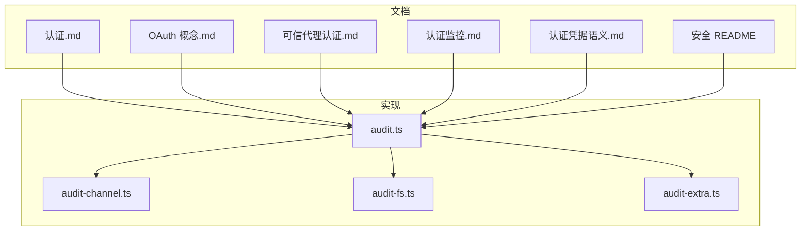
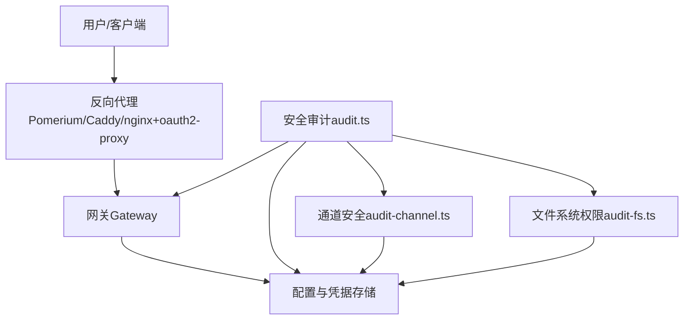
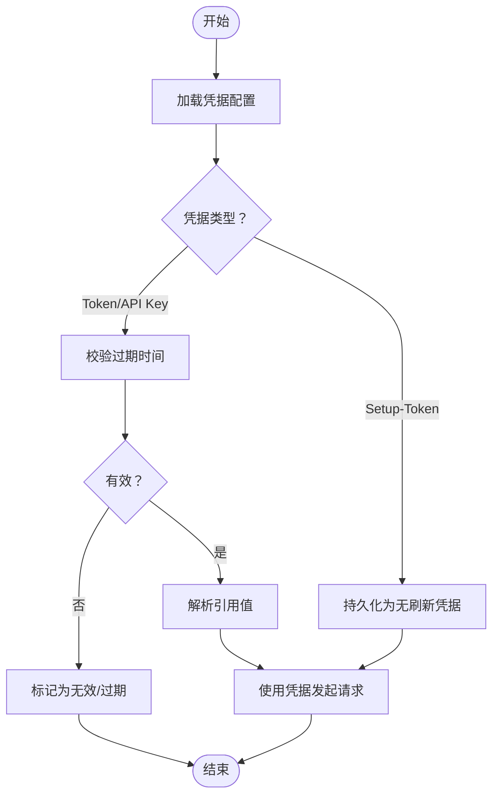
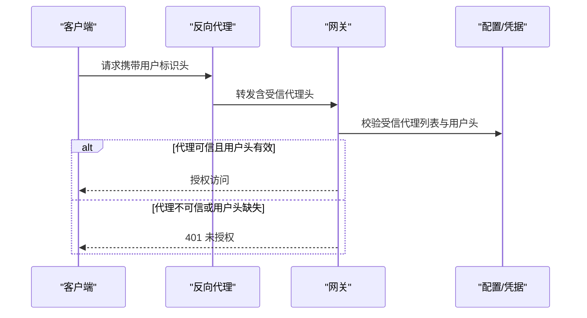
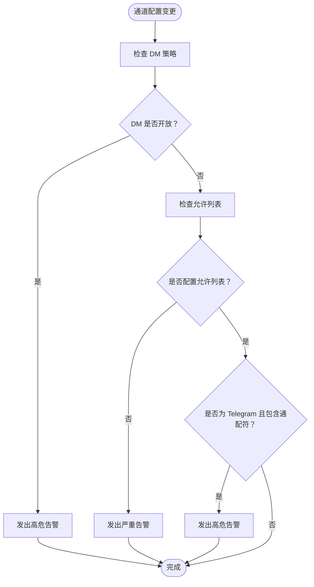
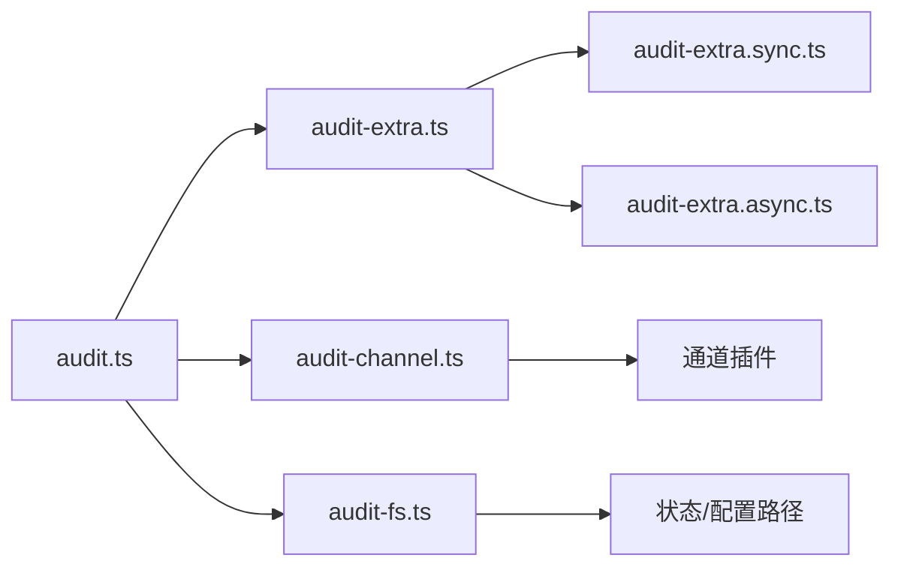

# 认证安全

<cite>
**本文引用的文件**
- [认证.md](file://docs/gateway/authentication.md)
- [OAuth 概念.md](file://docs/concepts/oauth.md)
- [可信代理认证.md](file://docs/gateway/trusted-proxy-auth.md)
- [认证监控.md](file://docs/automation/auth-monitoring.md)
- [认证凭据语义.md](file://docs/auth-credential-semantics.md)
- [安全审计入口 audit.ts](file://src/security/audit.ts)
- [安全审计通道检查 audit-channel.ts](file://src/security/audit-channel.ts)
- [安全审计文件系统检查 audit-fs.ts](file://src/security/audit-fs.ts)
- [安全审计汇总导出 audit-extra.ts](file://src/security/audit-extra.ts)
- [安全 README](file://docs/security/README.md)
</cite>

## 目录

1. [简介](#简介)
2. [项目结构](#项目结构)
3. [核心组件](#核心组件)
4. [架构总览](#架构总览)
5. [详细组件分析](#详细组件分析)
6. [依赖关系分析](#依赖关系分析)
7. [性能考量](#性能考量)
8. [故障排查指南](#故障排查指南)
9. [结论](#结论)
10. [附录](#附录)

## 简介

本文件聚焦 OpenClaw 的认证安全机制，覆盖以下方面：

- 安全传输：HTTPS/TLS、反向代理与 HSTS 配置要点
- 防重放攻击：会话令牌强度、速率限制与来源校验
- IP 地址验证：受信代理列表、真实来源 IP 提取策略
- 安全头处理：严格来源策略、主机头回退风险与控制界面加固
- 认证流程中的安全检查、威胁防护与漏洞缓解
- 配置建议、安全审计与合规性考虑
- 最佳实践与安全事件响应指南

## 项目结构

围绕认证安全的关键文档与实现分布在如下位置：

- 文档侧：认证、OAuth、可信代理认证、认证监控、凭据语义、安全总览
- 实现侧：安全审计入口、通道安全检查、文件系统权限检查、审计汇总导出

**图表来源**

- [认证.md](file://docs/gateway/authentication.md)
- [OAuth 概念.md](file://docs/concepts/oauth.md)
- [可信代理认证.md](file://docs/gateway/trusted-proxy-auth.md)
- [认证监控.md](file://docs/automation/auth-monitoring.md)
- [认证凭据语义.md](file://docs/auth-credential-semantics.md)
- [安全 README](file://docs/security/README.md)
- [安全审计入口 audit.ts](file://src/security/audit.ts)
- [安全审计通道检查 audit-channel.ts](file://src/security/audit-channel.ts)
- [安全审计文件系统检查 audit-fs.ts](file://src/security/audit-fs.ts)
- [安全审计汇总导出 audit-extra.ts](file://src/security/audit-extra.ts)

**章节来源**

- [认证.md](file://docs/gateway/authentication.md)
- [OAuth 概念.md](file://docs/concepts/oauth.md)
- [可信代理认证.md](file://docs/gateway/trusted-proxy-auth.md)
- [认证监控.md](file://docs/automation/auth-monitoring.md)
- [认证凭据语义.md](file://docs/auth-credential-semantics.md)
- [安全 README](file://docs/security/README.md)
- [安全审计入口 audit.ts](file://src/security/audit.ts)
- [安全审计通道检查 audit-channel.ts](file://src/security/audit-channel.ts)
- [安全审计文件系统检查 audit-fs.ts](file://src/security/audit-fs.ts)
- [安全审计汇总导出 audit-extra.ts](file://src/security/audit-extra.ts)

## 核心组件

- 凭据管理与解析：支持 API Key、OAuth（PKCE）、订阅型 setup-token；凭据有效期与解析规则明确，避免过期或无效凭据生效。
- 网关认证模式：共享密钥（token/password）、受信代理（trusted-proxy）与无认证（none），并结合速率限制与来源校验。
- 控制界面安全：严格来源策略（allowedOrigins）、可选主机头回退开关、设备身份校验开关与 HSTS 策略。
- 反向代理集成：通过受信代理模式将认证委托给外部代理（如 Pomerium、Caddy、nginx + oauth2-proxy），要求仅代理可达且正确传递用户标识头。
- 文件系统与通道安全审计：对状态目录、配置文件权限进行检查，并对各通道的 DM/群组访问策略与允许列表进行风险评估。

**章节来源**

- [认证凭据语义.md](file://docs/auth-credential-semantics.md)
- [认证.md](file://docs/gateway/authentication.md)
- [OAuth 概念.md](file://docs/concepts/oauth.md)
- [可信代理认证.md](file://docs/gateway/trusted-proxy-auth.md)
- [认证监控.md](file://docs/automation/auth-monitoring.md)
- [安全审计入口 audit.ts](file://src/security/audit.ts)
- [安全审计通道检查 audit-channel.ts](file://src/security/audit-channel.ts)
- [安全审计文件系统检查 audit-fs.ts](file://src/security/audit-fs.ts)

## 架构总览

下图展示认证安全在系统中的交互关系与关键检查点：

**图表来源**

- [安全审计入口 audit.ts](file://src/security/audit.ts)
- [安全审计通道检查 audit-channel.ts](file://src/security/audit-channel.ts)
- [安全审计文件系统检查 audit-fs.ts](file://src/security/audit-fs.ts)
- [认证.md](file://docs/gateway/authentication.md)
- [OAuth 概念.md](file://docs/concepts/oauth.md)
- [可信代理认证.md](file://docs/gateway/trusted-proxy-auth.md)

## 详细组件分析

### 组件一：凭据生命周期与有效性校验

- 支持凭据类型：token、API Key、订阅型 setup-token
- 有效期与解析：凭据可内联或通过引用解析；若存在过期时间，必须为有限正数；过期或无效将被判定为不可用
- 多账户/多配置：支持 per-agent 与 per-session 的凭据选择与覆盖
- 自动刷新：OAuth 刷新由运行时自动完成，无需手工干预

**图表来源**

- [认证凭据语义.md](file://docs/auth-credential-semantics.md)
- [OAuth 概念.md](file://docs/concepts/oauth.md)
- [认证.md](file://docs/gateway/authentication.md)

**章节来源**

- [认证凭据语义.md](file://docs/auth-credential-semantics.md)
- [OAuth 概念.md](file://docs/concepts/oauth.md)
- [认证.md](file://docs/gateway/authentication.md)

### 组件二：网关认证模式与来源校验

- 共享密钥模式（token/password）
  - 建议使用长随机 token
  - 非 loopback 绑定需启用速率限制以抵御暴力破解
- 受信代理模式（trusted-proxy）
  - 仅当代理负责认证且仅代理可达时启用
  - 必须配置受信代理 IP 列表与用户标识头
  - 可选要求额外头（如协议/主机）以增强可信度
- 控制界面安全
  - 非 loopback 绑定时必须设置 allowedOrigins
  - 不推荐启用主机头来源回退
  - 可禁用设备身份校验仅限短时应急场景

**图表来源**

- [可信代理认证.md](file://docs/gateway/trusted-proxy-auth.md)
- [认证.md](file://docs/gateway/authentication.md)

**章节来源**

- [可信代理认证.md](file://docs/gateway/trusted-proxy-auth.md)
- [认证.md](file://docs/gateway/authentication.md)

### 组件三：安全传输与 HSTS

- 推荐在代理层终止 TLS 并统一应用 HSTS
- HSTS 建议从短时 max-age 开始，逐步提升
- 禁止在 loopback 本地开发中滥用 HSTS

**章节来源**

- [可信代理认证.md](file://docs/gateway/trusted-proxy-auth.md)

### 组件四：防重放攻击与速率限制

- 对非 loopback 绑定的网关启用速率限制，降低暴力破解风险
- 通过受信代理模式与严格的 allowedOrigins 降低跨域重放风险
- 控制界面设备身份校验可在必要时禁用，但应谨慎

**章节来源**

- [认证.md](file://docs/gateway/authentication.md)
- [可信代理认证.md](file://docs/gateway/trusted-proxy-auth.md)

### 组件五：IP 地址验证与真实来源提取

- 受信代理列表必须精确到代理 IP，避免整段子网
- 当代理不提供 X-Forwarded-For 时，谨慎启用 X-Real-IP 回退
- 严格区分“严格环回代理条目”与普通环回地址，仅前者视为本地信任边界

**章节来源**

- [安全审计入口 audit.ts](file://src/security/audit.ts)
- [可信代理认证.md](file://docs/gateway/trusted-proxy-auth.md)

### 组件六：安全头处理与来源策略

- 控制界面必须显式配置 allowedOrigins，禁止通配符
- 不推荐启用 Host 头来源回退，除非明确了解 DNS 重绑定风险
- 设备身份校验可在短时应急场景禁用，但应尽快恢复

**章节来源**

- [认证.md](file://docs/gateway/authentication.md)
- [可信代理认证.md](file://docs/gateway/trusted-proxy-auth.md)

### 组件七：通道安全与发送者授权

- 各通道（Discord、Slack、Telegram 等）的 DM/群组策略与允许列表需严格配置
- Telegram 群组允许列表不得包含通配符；未配置允许列表将导致任意成员可执行命令
- Discord/Slack 的斜杠命令在未配置允许列表时可能被任意成员触发，需开启访问组或配置 per-guild/channel 用户白名单

**图表来源**

- [安全审计通道检查 audit-channel.ts](file://src/security/audit-channel.ts)

**章节来源**

- [安全审计通道检查 audit-channel.ts](file://src/security/audit-channel.ts)

### 组件八：文件系统与配置安全

- 状态目录与配置文件权限必须严格限制（建议 700/600）
- 避免符号链接指向不受控目标
- Windows 环境下使用 ACL 检查与修复命令

**章节来源**

- [安全审计文件系统检查 audit-fs.ts](file://src/security/audit-fs.ts)

### 组件九：认证监控与到期预警

- 使用 `models status --check` 获取退出码判断凭据状态（0 正常、1 缺失/过期、2 即将过期）
- 可结合 systemd/timer 或脚本实现自动化告警与一键重认证

**章节来源**

- [认证监控.md](file://docs/automation/auth-monitoring.md)
- [认证.md](file://docs/gateway/authentication.md)

## 依赖关系分析

- 安全审计入口集中调用各子模块收集器，形成“配置/网关/通道/文件系统”多维度检查
- 通道安全检查依赖各插件的配置解析与账户快照
- 文件系统检查独立于运行时配置，直接读取路径权限

**图表来源**

- [安全审计入口 audit.ts](file://src/security/audit.ts)
- [安全审计汇总导出 audit-extra.ts](file://src/security/audit-extra.ts)
- [安全审计通道检查 audit-channel.ts](file://src/security/audit-channel.ts)
- [安全审计文件系统检查 audit-fs.ts](file://src/security/audit-fs.ts)

**章节来源**

- [安全审计入口 audit.ts](file://src/security/audit.ts)
- [安全审计汇总导出 audit-extra.ts](file://src/security/audit-extra.ts)
- [安全审计通道检查 audit-channel.ts](file://src/security/audit-channel.ts)
- [安全审计文件系统检查 audit-fs.ts](file://src/security/audit-fs.ts)

## 性能考量

- 安全审计默认为轻量配置检查；深度审计（如网关探测）可通过超时参数控制
- 通道与插件扫描为异步 I/O，建议在批量审计时复用缓存以减少重复计算
- 受信代理模式下的请求头校验开销极低，主要成本在代理链路与网络往返

[本节为通用指导，无需特定文件引用]

## 故障排查指南

- 受信代理错误
  - 代理来源不可信：确认 `trustedProxies` 是否包含代理实际 IP
  - 用户标识头缺失：确认代理是否正确转发用户头，名称拼写是否一致
  - 未配置允许用户：根据策略设置 `allowUsers`
- 控制界面无法访问
  - allowedOrigins 为空或包含通配符：按需设置受信来源或移除通配符
  - Host 头来源回退启用：关闭该危险选项并显式配置 allowedOrigins
- 文件权限问题
  - 状态目录/配置文件可读/可写：调整权限至 700/600，并在 Windows 下使用 ACL 修复命令
- 通道命令未生效
  - 未配置允许列表：为 Telegram/Discord/Slack 配置 owner 允许列表或 per-guild/channel 用户白名单

**章节来源**

- [可信代理认证.md](file://docs/gateway/trusted-proxy-auth.md)
- [认证.md](file://docs/gateway/authentication.md)
- [安全审计文件系统检查 audit-fs.ts](file://src/security/audit-fs.ts)
- [安全审计通道检查 audit-channel.ts](file://src/security/audit-channel.ts)

## 结论

OpenClaw 的认证安全体系以“最小暴露面、强凭据、严格来源与可控代理”为核心原则。通过明确的凭据生命周期管理、受信代理模式与严格的控制界面安全策略，配合持续的安全审计与监控，可有效降低凭据泄露、跨域重放与未授权访问等风险。部署时务必遵循本文最佳实践与配置建议，并定期进行安全审计与合规性检查。

[本节为总结性内容，无需特定文件引用]

## 附录

### 配置建议清单

- 网关
  - loopback 绑定优先；非 loopback 绑定必须启用共享密钥（token）并设置速率限制
  - 控制界面：显式配置 allowedOrigins，禁用通配符与 Host 头来源回退
  - 受信代理模式：仅在代理负责认证且仅代理可达时启用；严格限定 trustedProxies 与用户标识头
- 传输与 HSTS
  - 在代理层终止 TLS 并统一应用 HSTS，从短时 max-age 开始
- 凭据
  - 优先使用长随机 token；API Key 与 OAuth 自动刷新；定期轮换并监控到期
- 通道
  - 为所有通道配置明确的 DM/群组策略与允许列表；Telegram 禁止通配符

**章节来源**

- [认证.md](file://docs/gateway/authentication.md)
- [可信代理认证.md](file://docs/gateway/trusted-proxy-auth.md)
- [认证监控.md](file://docs/automation/auth-monitoring.md)
- [安全 README](file://docs/security/README.md)

### 安全审计与合规

- 使用 `openclaw security audit` 进行常规审计；必要时启用深度审计并设置超时
- 关注文件系统权限、通道允许列表、控制界面来源策略与受信代理配置
- 将安全审计纳入 CI/CD 与运维巡检流程，确保配置变更后及时复核

**章节来源**

- [安全审计入口 audit.ts](file://src/security/audit.ts)
- [安全 README](file://docs/security/README.md)

### 最佳实践

- 采用“最小权限”原则：仅授予必要的通道与工具权限
- 引入多因素与短期令牌策略（如适用）
- 定期轮换凭据并启用到期预警
- 对生产环境启用 TLS 与 HSTS，并在代理层统一管理证书与安全头

**章节来源**

- [认证.md](file://docs/gateway/authentication.md)
- [可信代理认证.md](file://docs/gateway/trusted-proxy-auth.md)
- [认证监控.md](file://docs/automation/auth-monitoring.md)

### 安全事件响应

- 发生凭据泄露或越权访问
  - 立即轮换受影响凭据（API Key/OAuth/Token）
  - 检查并收紧 allowedOrigins、受信代理列表与通道允许列表
  - 启用更严格的速率限制与日志审计
  - 对外发布安全通告并引导用户重新认证
- 配置回归
  - 使用 `openclaw security audit` 快速定位问题
  - 回滚最近配置变更并复核权限与来源策略

**章节来源**

- [认证监控.md](file://docs/automation/auth-monitoring.md)
- [安全审计入口 audit.ts](file://src/security/audit.ts)
