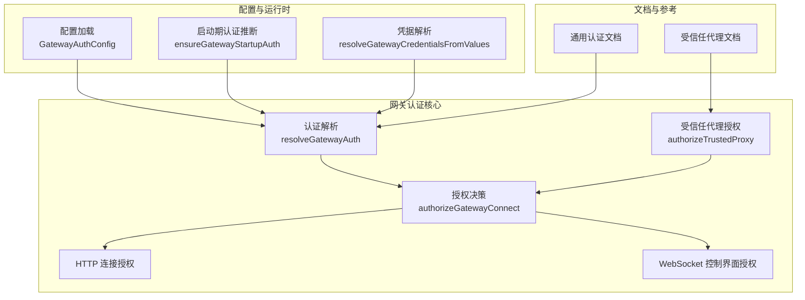
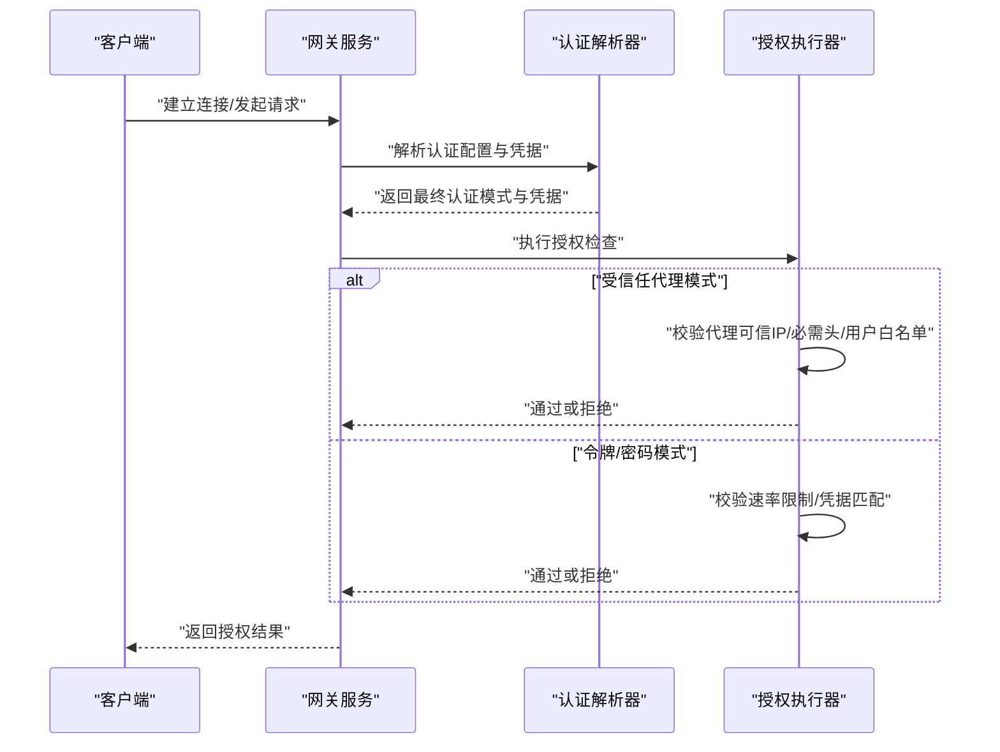
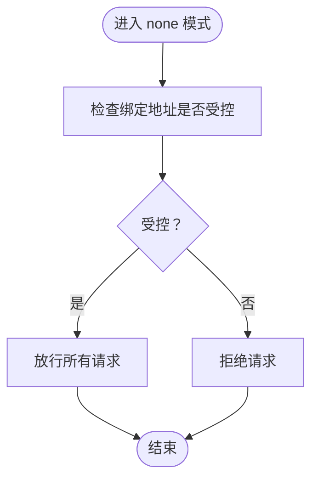
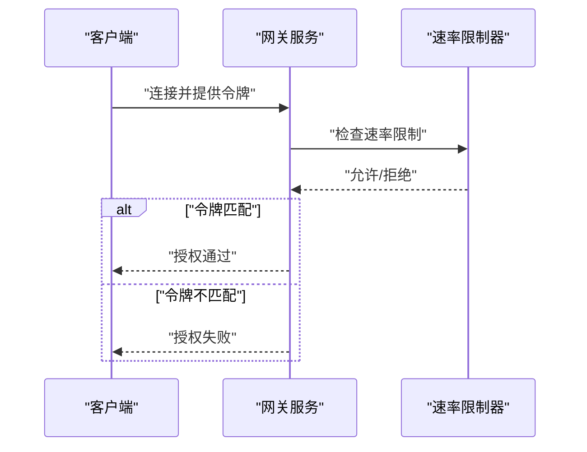
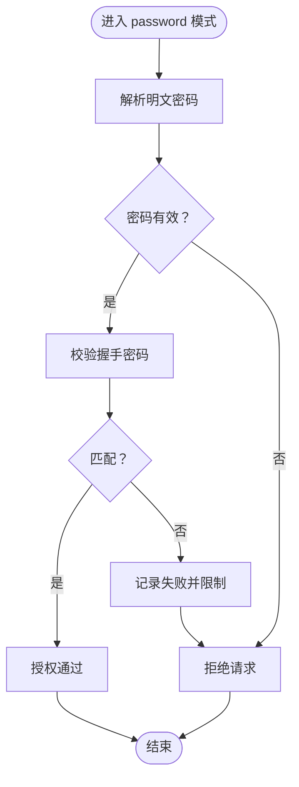
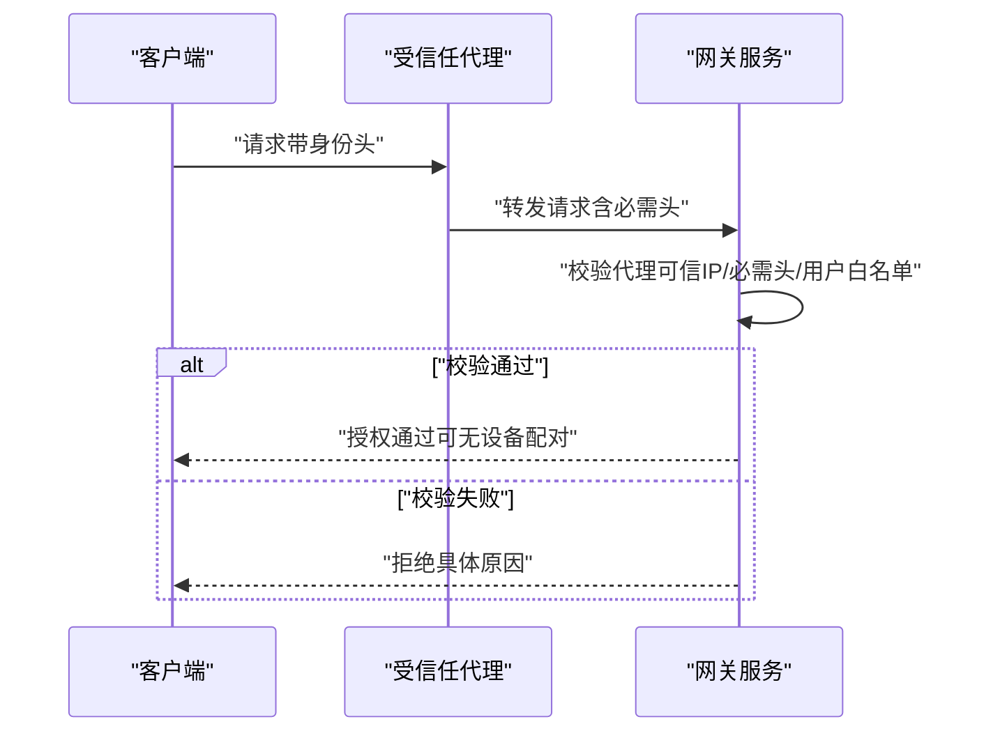
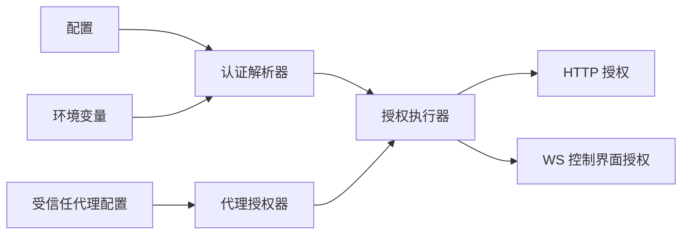

# 认证模式

<cite>
**本文档引用的文件**
- [src/gateway/auth.ts](file://src/gateway/auth.ts)
- [docs/gateway/authentication.md](file://docs/gateway/authentication.md)
- [docs/gateway/trusted-proxy-auth.md](file://docs/gateway/trusted-proxy-auth.md)
- [src/gateway/server.auth.compat-baseline.test.ts](file://src/gateway/server.auth.compat-baseline.test.ts)
- [src/gateway/startup-auth.test.ts](file://src/gateway/startup-auth.test.ts)
- [src/secrets/runtime-gateway-auth-surfaces.ts](file://src/secrets/runtime-gateway-auth-surfaces.ts)
- [src/secrets/runtime.test.ts](file://src/secrets/runtime.test.ts)
</cite>

## 目录

1. [简介](#简介)
2. [项目结构](#项目结构)
3. [核心组件](#核心组件)
4. [架构总览](#架构总览)
5. [详细组件分析](#详细组件分析)
6. [依赖关系分析](#依赖关系分析)
7. [性能考量](#性能考量)
8. [故障排查指南](#故障排查指南)
9. [结论](#结论)
10. [附录](#附录)

## 简介

本文件系统性阐述 OpenClaw 支持的四种认证模式：无认证（none）、令牌认证（token）、密码认证（password）与受信任代理（trusted-proxy）。内容涵盖各模式工作原理、适用场景、配置方法、切换机制、安全考虑，并提供实际配置示例与最佳实践建议。读者可据此在不同部署环境与安全需求下选择合适的认证模式。

## 项目结构

OpenClaw 的认证逻辑集中在网关模块中，核心实现位于网关认证解析与授权流程，同时配套文档提供了受信任代理模式的详细配置与安全审计指引。

图表来源

- [src/gateway/auth.ts:217-292](file://src/gateway/auth.ts#L217-L292)
- [src/gateway/auth.ts:378-504](file://src/gateway/auth.ts#L378-L504)
- [docs/gateway/authentication.md:1-180](file://docs/gateway/authentication.md#L1-L180)
- [docs/gateway/trusted-proxy-auth.md:1-330](file://docs/gateway/trusted-proxy-auth.md#L1-L330)

章节来源

- [src/gateway/auth.ts:1-504](file://src/gateway/auth.ts#L1-L504)
- [docs/gateway/authentication.md:1-180](file://docs/gateway/authentication.md#L1-L180)
- [docs/gateway/trusted-proxy-auth.md:1-330](file://docs/gateway/trusted-proxy-auth.md#L1-L330)

## 核心组件

- 认证模式类型与结果
  - 模式类型：none、token、password、trusted-proxy
  - 授权结果：成功/失败、原因码、重试等待时间等
- 认证解析器
  - 从配置、环境变量与密钥引用中解析最终使用的凭据
  - 基于优先级与覆盖规则确定最终模式
- 授权执行器
  - 针对 HTTP 与 WebSocket 控制界面分别进行授权
  - 支持速率限制与客户端 IP 解析
- 受信任代理授权器
  - 校验请求来源是否为可信代理 IP
  - 提取并校验用户身份头、可选的必需头与允许用户白名单

章节来源

- [src/gateway/auth.ts:23-50](file://src/gateway/auth.ts#L23-L50)
- [src/gateway/auth.ts:217-292](file://src/gateway/auth.ts#L217-L292)
- [src/gateway/auth.ts:378-504](file://src/gateway/auth.ts#L378-L504)

## 架构总览

OpenClaw 在启动阶段根据配置与环境推断认证模式；运行时根据请求来源与协议类型执行相应授权流程。受信任代理模式将认证委托给前置代理，要求严格的代理可信度与头部管理。

图表来源

- [src/gateway/auth.ts:217-292](file://src/gateway/auth.ts#L217-L292)
- [src/gateway/auth.ts:378-504](file://src/gateway/auth.ts#L378-L504)

## 详细组件分析

### 无认证（none）

- 工作原理
  - 不强制任何凭据，直接放行
  - 适合本地开发或内网隔离环境
- 适用场景
  - 仅限 loopback 或内网访问
  - 无外部暴露需求
- 配置要点
  - 在配置中显式设置认证模式为 none
  - 确保绑定地址为 loopback 或受控网络
- 安全风险
  - 无任何访问控制，极易被滥用
  - 不应在公网或共享网络中使用
- 切换机制
  - 通过配置覆盖或启动参数切换
  - 启动期测试用例验证了 none 模式不会生成令牌

图表来源

- [src/gateway/auth.ts:411-413](file://src/gateway/auth.ts#L411-L413)
- [src/gateway/startup-auth.test.ts:319-331](file://src/gateway/startup-auth.test.ts#L319-L331)

章节来源

- [src/gateway/auth.ts:411-413](file://src/gateway/auth.ts#L411-L413)
- [src/gateway/startup-auth.test.ts:319-331](file://src/gateway/startup-auth.test.ts#L319-L331)

### 令牌认证（token）

- 工作原理
  - 使用共享令牌进行连接握手
  - 支持速率限制与错误重试策略
- 适用场景
  - 长期运行的网关主机
  - 无需频繁轮换的稳定部署
- 配置要点
  - 在配置中设置 gateway.auth.token
  - 可通过环境变量或密钥引用注入
- 安全考虑
  - 令牌泄露将导致完整访问
  - 建议定期轮换并限制传播范围
- 切换机制
  - 默认模式，若未显式指定则采用 token
  - 启动期测试用例验证了 token 模式下的令牌生成与持久化行为

图表来源

- [src/gateway/auth.ts:448-464](file://src/gateway/auth.ts#L448-L464)
- [src/gateway/auth.ts:415-431](file://src/gateway/auth.ts#L415-L431)

章节来源

- [src/gateway/auth.ts:448-464](file://src/gateway/auth.ts#L448-L464)
- [src/gateway/auth.ts:415-431](file://src/gateway/auth.ts#L415-L431)
- [src/gateway/startup-auth.test.ts:308-317](file://src/gateway/startup-auth.test.ts#L308-L317)

### 密码认证（password）

- 工作原理
  - 使用共享密码进行连接握手
  - 与令牌模式类似，具备速率限制与错误处理
- 适用场景
  - 小规模个人使用或临时部署
  - 对易记忆口令有偏好
- 配置要点
  - 在配置中设置 gateway.auth.password
  - 启动期需为明文字符串，不可使用密钥引用
- 安全考虑
  - 明文密码存储存在风险
  - 不建议在生产环境长期使用
- 切换机制
  - 若配置中存在密码凭据，则优先采用 password 模式
  - 运行时测试用例验证了密码模式下的凭据解析与警告提示

图表来源

- [src/gateway/auth.ts:466-481](file://src/gateway/auth.ts#L466-L481)
- [src/gateway/auth.ts:294-329](file://src/gateway/auth.ts#L294-L329)
- [src/secrets/runtime.test.ts:1160-1183](file://src/secrets/runtime.test.ts#L1160-L1183)

章节来源

- [src/gateway/auth.ts:466-481](file://src/gateway/auth.ts#L466-L481)
- [src/gateway/auth.ts:294-329](file://src/gateway/auth.ts#L294-L329)
- [src/secrets/runtime.test.ts:1160-1183](file://src/secrets/runtime.test.ts#L1160-L1183)

### 受信任代理（trusted-proxy）

- 工作原理
  - 将认证完全委托给前置代理
  - 通过可信代理 IP 白名单、必需头与用户身份头进行校验
- 适用场景
  - 企业内部通过反向代理统一认证
  - 需要处理 WebSocket 升级且无法携带令牌的场景
- 配置要点
  - 设置 gateway.auth.mode 为 trusted-proxy
  - 配置 gateway.auth.trustedProxy.userHeader
  - 可选配置 requiredHeaders 与 allowUsers
  - 严格限制 gateway.trustedProxies 仅包含代理 IP
- 安全考虑
  - 代理必须正确剥离/覆盖转发头
  - 必须确保代理为唯一入口，避免绕过
  - 建议启用 HSTS 并在代理层终止 TLS
- 切换机制
  - 通过配置覆盖强制启用受信任代理模式
  - 启动期测试用例验证了该模式下不会生成令牌

图表来源

- [src/gateway/auth.ts:335-372](file://src/gateway/auth.ts#L335-L372)
- [src/gateway/auth.ts:391-409](file://src/gateway/auth.ts#L391-L409)
- [docs/gateway/trusted-proxy-auth.md:1-330](file://docs/gateway/trusted-proxy-auth.md#L1-L330)

章节来源

- [src/gateway/auth.ts:335-372](file://src/gateway/auth.ts#L335-L372)
- [src/gateway/auth.ts:391-409](file://src/gateway/auth.ts#L391-L409)
- [docs/gateway/trusted-proxy-auth.md:1-330](file://docs/gateway/trusted-proxy-auth.md#L1-L330)
- [src/gateway/startup-auth.test.ts:319-331](file://src/gateway/startup-auth.test.ts#L319-L331)

## 依赖关系分析

- 组件耦合
  - 认证解析器与授权执行器紧密耦合，共同决定最终授权结果
  - 受信任代理授权器作为独立分支参与授权流程
- 外部依赖
  - 速率限制器用于 token/password 模式的失败计数与冷却
  - 客户端 IP 解析器用于代理链路中的真实来源识别
- 循环依赖
  - 未发现循环依赖，模块职责清晰

图表来源

- [src/gateway/auth.ts:217-292](file://src/gateway/auth.ts#L217-L292)
- [src/gateway/auth.ts:378-504](file://src/gateway/auth.ts#L378-L504)

章节来源

- [src/gateway/auth.ts:217-292](file://src/gateway/auth.ts#L217-L292)
- [src/gateway/auth.ts:378-504](file://src/gateway/auth.ts#L378-L504)

## 性能考量

- 速率限制
  - token/password 模式在失败时会触发速率限制，降低重试频率
- 客户端 IP 解析
  - 支持基于代理链的 IP 解析，避免伪造来源
- 受信任代理
  - 通过代理集中认证可减少网关侧认证开销
- 建议
  - 在高并发场景优先使用令牌认证并配合速率限制
  - 受信任代理模式下确保代理层具备足够的并发处理能力

[本节为通用指导，不直接分析具体文件]

## 故障排查指南

- 常见错误与定位
  - 令牌缺失/不匹配：检查客户端是否提供令牌以及令牌是否正确
  - 密码缺失/不匹配：检查握手密码是否提供及是否正确
  - 受信任代理来源不可信：检查 gateway.trustedProxies 是否包含代理 IP
  - 用户身份缺失：检查代理是否正确传递 userHeader
  - 缺少必需头：检查代理是否传递 requiredHeaders
  - 允许用户列表：确认 allowUsers 中包含当前用户
- 安全审计
  - openclaw security audit 会对受信任代理模式给出严重告警
  - 建议在启用前完成安全检查清单

章节来源

- [src/gateway/auth.ts:335-372](file://src/gateway/auth.ts#L335-L372)
- [src/gateway/auth.ts:415-484](file://src/gateway/auth.ts#L415-L484)
- [docs/gateway/trusted-proxy-auth.md:266-329](file://docs/gateway/trusted-proxy-auth.md#L266-L329)

## 结论

- none 模式最简单但风险最高，仅适用于受控环境
- token 模式适合长期运行的网关主机，便于自动化与运维
- password 模式适合小规模或临时场景，但安全性较低
- trusted-proxy 模式将认证委托给代理，适合企业统一认证与复杂网络拓扑，但对代理配置与网络安全要求极高
- 建议在生产环境中优先采用令牌认证或受信任代理模式，并结合速率限制与安全审计工具

[本节为总结性内容，不直接分析具体文件]

## 附录

### 认证模式选择策略

- 评估网络暴露面与安全边界
- 考虑运维复杂度与自动化程度
- 依据合规与审计要求选择合适模式
- 在受信任代理模式下，务必完成安全检查清单

章节来源

- [docs/gateway/trusted-proxy-auth.md:256-269](file://docs/gateway/trusted-proxy-auth.md#L256-L269)

### 实际配置示例与最佳实践

- 令牌认证（API Key）
  - 在配置中设置 gateway.auth.token
  - 通过环境变量或密钥引用注入
  - 建议定期轮换并限制传播范围
- 受信任代理（Pomerium/Caddy/Nginx）
  - 配置 userHeader、requiredHeaders、allowUsers
  - 严格限制 gateway.trustedProxies
  - 在代理层终止 TLS 并应用 HSTS
- 密码认证
  - 仅限小规模或临时使用
  - 启动期需为明文，避免密钥引用

章节来源

- [docs/gateway/authentication.md:21-113](file://docs/gateway/authentication.md#L21-L113)
- [docs/gateway/trusted-proxy-auth.md:50-90](file://docs/gateway/trusted-proxy-auth.md#L50-L90)
- [src/gateway/auth.ts:294-329](file://src/gateway/auth.ts#L294-L329)
