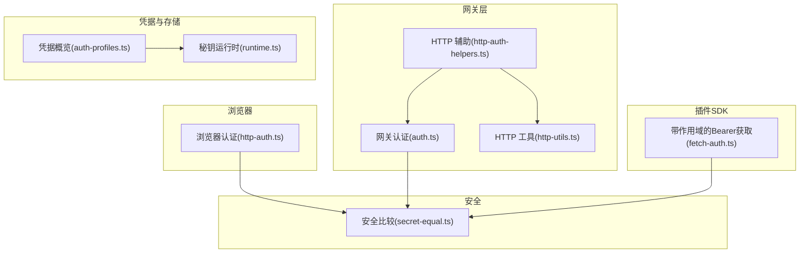
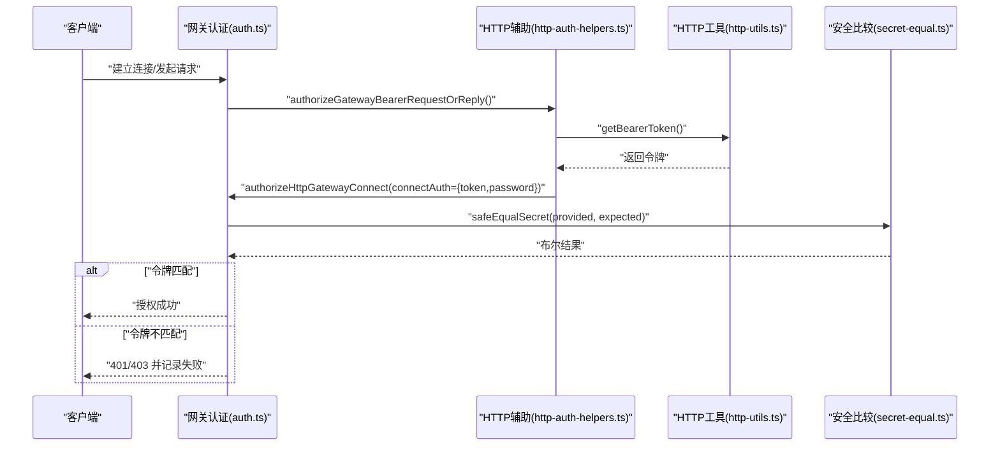
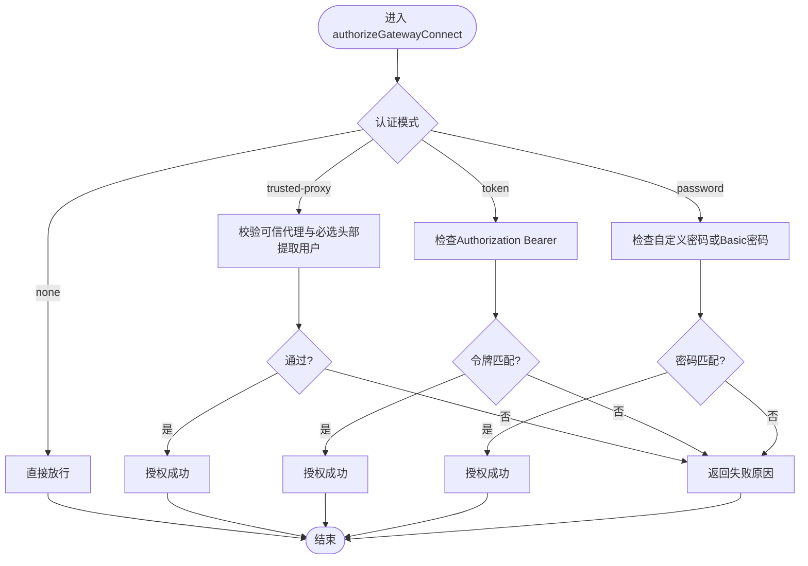
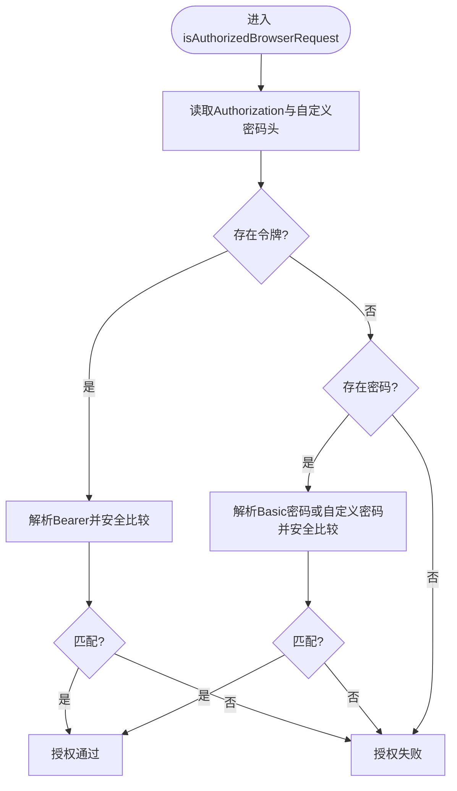
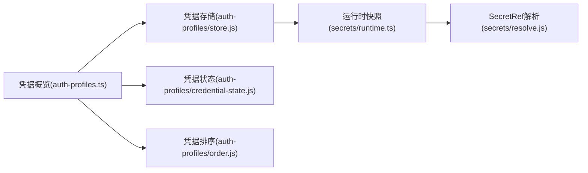
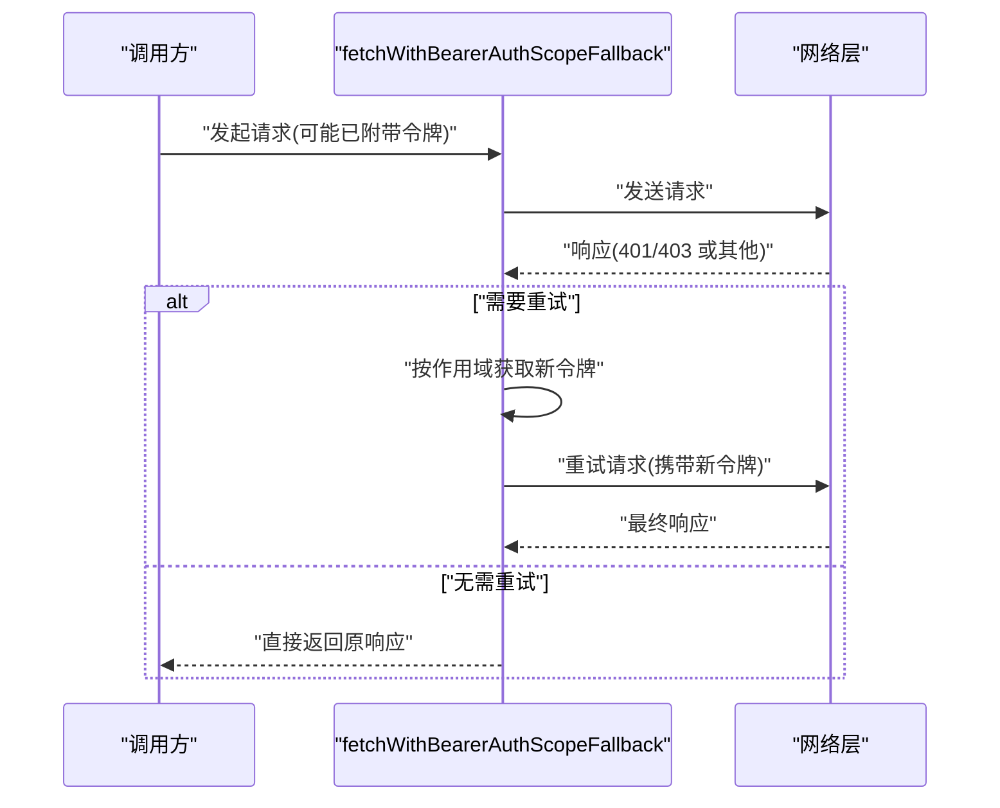
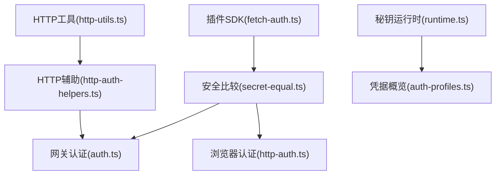

# 认证系统

<cite>
**本文档引用的文件**
- [authentication.md](file://docs/gateway/authentication.md)
- [oauth.md](file://docs/concepts/oauth.md)
- [auth-credential-semantics.md](file://docs/auth-credential-semantics.md)
- [auth.ts](file://src/gateway/auth.ts)
- [http-auth-helpers.ts](file://src/gateway/http-auth-helpers.ts)
- [http-utils.ts](file://src/gateway/http-utils.ts)
- [http-auth.ts](file://src/browser/http-auth.ts)
- [secret-equal.ts](file://src/security/secret-equal.ts)
- [runtime.ts](file://src/secrets/runtime.ts)
- [auth.ts](file://src/commands/models/auth.ts)
- [auth-profiles.ts](file://src/agents/auth-profiles.ts)
- [startup-auth.test.ts](file://src/gateway/startup-auth.test.ts)
- [fetch-auth.ts](file://src/plugin-sdk/fetch-auth.ts)
</cite>

## 目录

1. [简介](#简介)
2. [项目结构](#项目结构)
3. [核心组件](#核心组件)
4. [架构总览](#架构总览)
5. [详细组件分析](#详细组件分析)
6. [依赖关系分析](#依赖关系分析)
7. [性能考量](#性能考量)
8. [故障排除指南](#故障排除指南)
9. [结论](#结论)
10. [附录](#附录)

## 简介

本文件系统性阐述 OpenClaw 的认证体系，覆盖连接认证、凭据管理、令牌验证与多因素（多因素：在当前代码库中未发现专门的“多因素认证”实现，但支持多种凭据来源与组合使用，可视为广义的多因子策略）认证支持。内容包括认证流程、凭据存储、认证策略与安全传输机制；并提供认证配置选项、凭据轮换与故障排除建议，以及安全配置最佳实践。

## 项目结构

OpenClaw 的认证能力由以下模块协同实现：

- 网关层认证：解析与校验请求头中的令牌或密码，支持受信任代理与 Tailscale 身份识别。
- 浏览器端认证：对浏览器请求进行 Bearer 令牌与 Basic 密码校验。
- 凭据管理：提供 OAuth、API Key、Token 等凭据类型与存储路径。
- 安全工具：定时安全比较函数，防止时序攻击。
- 秘钥运行时：集中解析与激活 SecretRef 引用，统一凭据表面。
- 插件 SDK：在 HTTP 请求中自动附加 Bearer 令牌并处理鉴权失败重试。

**图表来源**

- [auth.ts:1-504](file://src/gateway/auth.ts#L1-L504)
- [http-auth-helpers.ts:1-30](file://src/gateway/http-auth-helpers.ts#L1-L30)
- [http-utils.ts:1-105](file://src/gateway/http-utils.ts#L1-L105)
- [http-auth.ts:1-64](file://src/browser/http-auth.ts#L1-L64)
- [auth-profiles.ts:1-55](file://src/agents/auth-profiles.ts#L1-L55)
- [runtime.ts:1-251](file://src/secrets/runtime.ts#L1-L251)
- [secret-equal.ts:1-13](file://src/security/secret-equal.ts#L1-L13)
- [fetch-auth.ts:1-51](file://src/plugin-sdk/fetch-auth.ts#L1-L51)

**章节来源**

- [authentication.md:1-180](file://docs/gateway/authentication.md#L1-L180)
- [oauth.md:1-159](file://docs/concepts/oauth.md#L1-L159)
- [auth-credential-semantics.md:1-46](file://docs/auth-credential-semantics.md#L1-L46)

## 核心组件

- 网关认证与模式选择
  - 支持模式：无认证、令牌、密码、受信任代理、默认令牌。
  - 模式来源：显式覆盖、配置、密码存在、令牌存在、默认。
  - 受信任代理：从指定头部提取用户身份，支持白名单用户与必选头部。
  - Tailscale：通过代理转发头与 WhoIS 校验实现免密登录。
- 浏览器请求认证
  - 支持 Bearer 令牌与 Basic 密码，使用安全比较函数避免时序攻击。
  - 允许通过自定义头部传递密码作为补充校验。
- 凭据管理与存储
  - 支持 OAuth、API Key、Token 三种凭据类型。
  - 存储位置：按 Agent 隔离，支持迁移与兼容文件。
  - 多账户/多配置：通过 profileId 与 auth.order 实现路由。
- 秘钥运行时与 SecretRef
  - 统一解析 env/file/exec 等来源的凭据引用，激活到运行时快照。
  - 对未激活的引用发出警告，便于诊断。
- 插件 SDK 的 Bearer 自动注入
  - 在 HTTP 请求中自动附加 Bearer，并在 401/403 时按作用域回退获取新令牌。

**章节来源**

- [auth.ts:23-292](file://src/gateway/auth.ts#L23-L292)
- [http-auth.ts:37-64](file://src/browser/http-auth.ts#L37-L64)
- [auth-profiles.ts:1-55](file://src/agents/auth-profiles.ts#L1-L55)
- [runtime.ts:102-166](file://src/secrets/runtime.ts#L102-L166)
- [fetch-auth.ts:9-51](file://src/plugin-sdk/fetch-auth.ts#L9-L51)

## 架构总览

下图展示从客户端到网关的认证交互，涵盖令牌校验、受信任代理与 Tailscale 身份识别。

**图表来源**

- [auth.ts:378-485](file://src/gateway/auth.ts#L378-L485)
- [http-auth-helpers.ts:7-29](file://src/gateway/http-auth-helpers.ts#L7-L29)
- [http-utils.ts:17-24](file://src/gateway/http-utils.ts#L17-L24)
- [secret-equal.ts:3-12](file://src/security/secret-equal.ts#L3-L12)

## 详细组件分析

### 网关认证与模式选择

- 模式解析
  - 优先级：显式覆盖 > 配置 > 密码存在 > 令牌存在 > 默认令牌。
  - 受信任代理模式需提供 userHeader 与可信代理列表。
  - Tailscale 模式在非本地直连且允许时，通过代理头与 WhoIS 校验用户身份。
- 授权流程
  - 受信任代理：校验必选头部与用户白名单。
  - 令牌模式：要求 Authorization 头为 Bearer 且与配置一致。
  - 密码模式：支持自定义头部或 Basic 密码，均使用安全比较。
  - 速率限制：对错误尝试进行限流，成功后重置。
- 启动时认证生成
  - 在特定模式下不会自动生成令牌，以确保明确的凭据来源。

**图表来源**

- [auth.ts:378-485](file://src/gateway/auth.ts#L378-L485)

**章节来源**

- [auth.ts:217-292](file://src/gateway/auth.ts#L217-L292)
- [auth.ts:378-485](file://src/gateway/auth.ts#L378-L485)
- [startup-auth.test.ts:308-360](file://src/gateway/startup-auth.test.ts#L308-L360)

### 浏览器请求认证

- 支持 Bearer 令牌与 Basic 密码两种方式。
- 使用安全比较函数避免时序攻击。
- 允许通过自定义头部传递密码作为补充校验。

**图表来源**

- [http-auth.ts:37-64](file://src/browser/http-auth.ts#L37-L64)
- [secret-equal.ts:3-12](file://src/security/secret-equal.ts#L3-L12)

**章节来源**

- [http-auth.ts:1-64](file://src/browser/http-auth.ts#L1-L64)
- [secret-equal.ts:1-13](file://src/security/secret-equal.ts#L1-L13)

### 凭据管理与存储

- 类型与语义
  - Token 凭据支持 inline 值或 tokenRef，expires 可选但需有效。
  - OAuth 凭据存储 refresh_token 与 expires，支持自动刷新。
  - API Key 凭据用于模型提供商。
- 存储布局
  - 按 Agent 隔离存储，兼容历史文件与导入。
  - 支持 SecretRef 引用，运行时激活。
- 多账户与路由
  - 通过 profileId 与 auth.order 控制使用顺序。
  - 支持会话级覆盖（如 /model ...@<profileId>）。

**图表来源**

- [auth-profiles.ts:1-55](file://src/agents/auth-profiles.ts#L1-L55)
- [runtime.ts:102-166](file://src/secrets/runtime.ts#L102-L166)

**章节来源**

- [auth-credential-semantics.md:20-38](file://docs/auth-credential-semantics.md#L20-L38)
- [oauth.md:41-56](file://docs/concepts/oauth.md#L41-L56)
- [auth.ts:145-185](file://src/commands/models/auth.ts#L145-L185)

### 插件 SDK 的 Bearer 自动注入

- 自动附加 Bearer 到请求头。
- 对 401/403 错误进行重试，必要时按作用域重新获取令牌。
- 可强制要求 HTTPS，避免明文传输泄露。

**图表来源**

- [fetch-auth.ts:9-51](file://src/plugin-sdk/fetch-auth.ts#L9-L51)

**章节来源**

- [fetch-auth.ts:1-51](file://src/plugin-sdk/fetch-auth.ts#L1-L51)

## 依赖关系分析

- 组件耦合
  - 网关认证依赖安全比较与 HTTP 工具，形成清晰边界。
  - 浏览器认证与网关认证共享安全比较逻辑，保证一致性。
  - 凭据管理通过运行时统一解析 SecretRef，降低各模块对密钥来源的感知。
- 外部依赖
  - 受信任代理依赖上游反向代理正确设置转发头。
  - Tailscale 身份识别依赖代理正确透传用户头与 WhoIS 服务可用性。

**图表来源**

- [auth.ts:1-504](file://src/gateway/auth.ts#L1-L504)
- [http-auth.ts:1-64](file://src/browser/http-auth.ts#L1-L64)
- [http-auth-helpers.ts:1-30](file://src/gateway/http-auth-helpers.ts#L1-L30)
- [http-utils.ts:1-105](file://src/gateway/http-utils.ts#L1-L105)
- [runtime.ts:1-251](file://src/secrets/runtime.ts#L1-L251)
- [auth-profiles.ts:1-55](file://src/agents/auth-profiles.ts#L1-L55)
- [fetch-auth.ts:1-51](file://src/plugin-sdk/fetch-auth.ts#L1-L51)

**章节来源**

- [auth.ts:1-504](file://src/gateway/auth.ts#L1-L504)
- [http-auth.ts:1-64](file://src/browser/http-auth.ts#L1-L64)
- [http-auth-helpers.ts:1-30](file://src/gateway/http-auth-helpers.ts#L1-L30)
- [http-utils.ts:1-105](file://src/gateway/http-utils.ts#L1-L105)
- [runtime.ts:1-251](file://src/secrets/runtime.ts#L1-L251)
- [auth-profiles.ts:1-55](file://src/agents/auth-profiles.ts#L1-L55)
- [fetch-auth.ts:1-51](file://src/plugin-sdk/fetch-auth.ts#L1-L51)

## 性能考量

- 速率限制
  - 对失败的认证尝试进行限流，减少暴力破解风险。
  - 成功认证后重置计数，避免误伤合法请求。
- 安全比较
  - 使用恒定时序比较，避免侧信道攻击。
- 运行时快照
  - SecretRef 解析与激活采用快照机制，减少重复计算与并发冲突。

**章节来源**

- [auth.ts:415-431](file://src/gateway/auth.ts#L415-L431)
- [secret-equal.ts:1-13](file://src/security/secret-equal.ts#L1-L13)
- [runtime.ts:168-197](file://src/secrets/runtime.ts#L168-L197)

## 故障排除指南

- “未找到凭据”
  - 确认已通过向导或命令写入对应 provider 的凭据。
  - 对于 Anthropic setup-token，需在网关主机上执行相应命令并粘贴。
- “令牌即将过期/已过期”
  - 使用健康检查命令确认具体过期 profile。
  - 重新登录或更新令牌，必要时清理过期条目。
- “受信任代理未配置/用户缺失”
  - 检查上游代理是否正确设置转发头与 userHeader。
  - 确认允许的用户列表包含当前用户。
- “Tailscale 用户不匹配”
  - 检查代理是否正确透传用户头。
  - 确保 WhoIS 查询返回的用户与请求头一致。
- “HTTPS 要求”
  - 插件 SDK 可强制要求 HTTPS，若目标站点不支持请调整配置。

**章节来源**

- [authentication.md:160-180](file://docs/gateway/authentication.md#L160-L180)
- [oauth.md:123-159](file://docs/concepts/oauth.md#L123-L159)
- [auth.ts:335-372](file://src/gateway/auth.ts#L335-L372)
- [fetch-auth.ts:26-28](file://src/plugin-sdk/fetch-auth.ts#L26-L28)

## 结论

OpenClaw 的认证系统以“最小暴露面、强安全基线、可运维性”为目标，提供多模式认证、细粒度凭据管理与安全传输保障。通过 SecretRef 统一解析、运行时快照与速率限制等机制，既满足复杂场景下的灵活配置，又保持了较低的维护成本与较高的安全性。

## 附录

### 认证配置选项速览

- 网关认证模式
  - 无认证、令牌、密码、受信任代理、默认令牌。
- 受信任代理
  - 必选头部、用户白名单、可信代理列表。
- Tailscale
  - 仅在非本地直连且允许时启用，依赖代理头与 WhoIS。
- 凭据来源
  - SecretRef（env/file/exec），按 Agent 隔离存储。
- 插件 SDK
  - 自动附加 Bearer，支持作用域回退与 HTTPS 强制。

**章节来源**

- [authentication.md:1-180](file://docs/gateway/authentication.md#L1-L180)
- [oauth.md:1-159](file://docs/concepts/oauth.md#L1-L159)
- [auth.ts:217-292](file://src/gateway/auth.ts#L217-L292)
- [runtime.ts:102-166](file://src/secrets/runtime.ts#L102-L166)
- [fetch-auth.ts:1-51](file://src/plugin-sdk/fetch-auth.ts#L1-L51)
