# 认证系统

<cite>
**本文档引用的文件**
- [authentication.md](file://docs/gateway/authentication.md)
- [oauth.md](file://docs/concepts/oauth.md)
- [auth-credential-semantics.md](file://docs/auth-credential-semantics.md)
- [oauth-device-flow.ts](file://apps/electron/src/main/oauth-device-flow.ts)
- [oauth-utils.ts](file://apps/electron/src/main/oauth-utils.ts)
- [onboarding-oauth.ts](file://apps/electron/src/main/onboarding-oauth.ts)
- [oauth-flows.md](file://apps/electron/docs/oauth-flows.md)
- [oauth-flow.ts](file://src/commands/oauth-flow.ts)
- [types.d.ts](file://dist/plugin-sdk/plugins/types.d.ts)
- [auth.ts](file://src/gateway/auth.ts)
- [http-auth-helpers.ts](file://src/gateway/http-auth-helpers.ts)
- [http-utils.ts](file://src/gateway/http-utils.ts)
- [http-auth.ts](file://src/browser/http-auth.ts)
- [secret-equal.ts](file://src/security/secret-equal.ts)
- [runtime.ts](file://src/secrets/runtime.ts)
- [auth.ts](file://src/commands/models/auth.ts)
- [auth-profiles.ts](file://src/agents/auth-profiles.ts)
- [startup-auth.test.ts](file://src/gateway/startup-auth.test.ts)
- [fetch-auth.ts](file://src/plugin-sdk/fetch-auth.ts)
- [index.ts](file://extensions/minimax-portal-auth/index.ts)
- [oauth.ts](file://extensions/minimax-portal-auth/oauth.ts)
- [minimax.md](file://docs/providers/minimax.md)
- [onboard-auth.models.ts](file://src/commands/onboard-auth.models.ts)
- [auth-choice-groups.ts](file://ui-react/src/data/auth-choice-groups.ts)
- [constants.ts](file://ui-react/src/components/setup-wizard/steps/api-key-step/constants.ts)
- [auth-choice-options.ts](file://src/commands/auth-choice-options.ts)
- [onboard-provider-auth-flags.ts](file://src/commands/onboard-provider-auth-flags.ts)
- [provider-capabilities.ts](file://src/agents/provider-capabilities.ts)
</cite>

## 更新摘要
**所做更改**
- 重构认证提供者组系统，增强PROVIDER_EMOJI、PROVIDER_LOGO和PROVIDER_MODEL_CANDIDATES映射
- 移除多个提供者条目，简化认证架构
- 更新MiniMax认证系统的模型标识符，修正默认模型ID从M2.7到M2.5
- 新增M2.5和M2.7高速模型支持，包括高性能推理变体
- 增强了M2.7 Lightning模型支持，提供更灵活的定价选项
- 更新了认证配置选项，反映最新的模型可用性
- 完善了设备代码流认证的模型选择机制

## 目录
1. [简介](#简介)
2. [项目结构](#项目结构)
3. [核心组件](#核心组件)
4. [架构总览](#架构总览)
5. [详细组件分析](#详细组件分析)
6. [OAuth设备代码流](#oauth设备代码流)
7. [PKCE安全机制](#pkce安全机制)
8. [CSRF保护机制](#csrf保护机制)
9. [认证提供者组系统](#认证提供者组系统)
10. [MiniMax认证系统](#minimax认证系统)
11. [依赖关系分析](#依赖关系分析)
12. [性能考量](#性能考量)
13. [故障排除指南](#故障排除指南)
14. [结论](#结论)
15. [附录](#附录)

## 简介
本文件系统性阐述 OpenClaw 的认证体系，覆盖连接认证、凭据管理、令牌验证与多因素（多因素：在当前代码库中未发现专门的"多因素认证"实现，但支持多种凭据来源与组合使用，可视为广义的多因子策略）认证支持。**最新更新**包括认证提供者组系统的重大重组，增强了PROVIDER_EMOJI、PROVIDER_LOGO和PROVIDER_MODEL_CANDIDATES映射，移除了多个提供者条目，简化了架构。同时，增加了对OAuth设备代码流的重大增强，包括设备代码流支持、PKCE安全机制、CSRF保护等新特性，以及MiniMax认证系统的模型标识符更新。内容包括认证流程、凭据存储、认证策略与安全传输机制；并提供认证配置选项、凭据轮换与故障排除建议，以及安全配置最佳实践。

## 项目结构
OpenClaw 的认证能力由以下模块协同实现：
- 网关层认证：解析与校验请求头中的令牌或密码，支持受信任代理与 Tailscale 身份识别。
- 浏览器端认证：对浏览器请求进行 Bearer 令牌与 Basic 密码校验。
- 凭据管理：提供 OAuth、API Key、Token、设备代码等凭据类型与存储路径。
- 安全工具：定时安全比较函数，防止时序攻击。
- 秘钥运行时：集中解析与激活 SecretRef 引用，统一凭据表面。
- 插件 SDK：在 HTTP 请求中自动附加 Bearer 令牌并处理鉴权失败重试。
- 设备代码流认证：支持OAuth设备代码流，提供安全的用户授权机制。
- **认证提供者组系统**：重构后的提供者分类与元数据管理，支持emoji、logo和模型候选映射。
- **MiniMax认证系统**：支持M2.5和M2.7模型族的OAuth认证，包括高速推理变体。

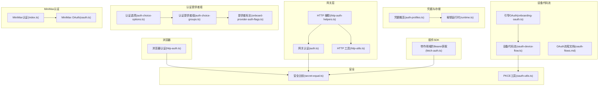
```mermaid
graph TB
subgraph "网关层"
GA["网关认证(auth.ts)"]
GHU["HTTP 工具(http-utils.ts)"]
GAH["HTTP 辅助(http-auth-helpers.ts)"]
end
subgraph "浏览器"
BA["浏览器认证(http-auth.ts)"]
end
subgraph "凭据与存储"
AP["凭据概览(auth-profiles.ts)"]
RT["秘钥运行时(runtime.ts)"]
end
subgraph "安全"
SE["安全比较(secret-equal.ts)"]
PU["PKCE工具(oauth-utils.ts)"]
end
subgraph "插件SDK"
FA["带作用域的Bearer获取(fetch-auth.ts)"]
end
subgraph "设备代码流"
ODF["设备代码流(oauth-device-flow.ts)"]
OOA["引导OAuth(onboarding-oauth.ts)"]
OFD["OAuth流程文档(oauth-flows.md)"]
end
subgraph "认证提供者组"
ACG["认证提供者组(auth-choice-groups.ts)"]
ACO["认证选项(auth-choice-options.ts)"]
OPF["提供者标志(onboard-provider-auth-flags.ts)"]
end
subgraph "MiniMax认证"
MMA["MiniMax认证(index.ts)"]
MMO["MiniMax OAuth(oauth.ts)"]
end
BA --> SE
GA --> SE
GAH --> GA
GAH --> GHU
AP --> RT
FA --> SE
ODF --> PU
OOA --> ODF
ACG --> OPF
ACO --> ACG
MMA --> MMO
```

**图表来源**
- [auth.ts:1-504](file://src/gateway/auth.ts#L1-L504)
- [http-auth-helpers.ts:1-30](file://src/gateway/http-auth-helpers.ts#L1-L30)
- [http-utils.ts:1-105](file://src/gateway/http-utils.ts#L1-L105)
- [http-auth.ts:1-64](file://src/browser/http-auth.ts#L1-L64)
- [auth-profiles.ts:1-55](file://src/agents/auth-profiles.ts#L1-L55)
- [runtime.ts:1-251](file://src/secrets/runtime.ts#L1-L251)
- [secret-equal.ts:1-13](file://src/security/secret-equal.ts#L1-L13)
- [fetch-auth.ts:1-51](file://src/plugin-sdk/fetch-auth.ts#L1-L51)
- [oauth-device-flow.ts:1-329](file://apps/electron/src/main/oauth-device-flow.ts#L1-L329)
- [oauth-utils.ts:1-34](file://apps/electron/src/main/oauth-utils.ts#L1-L34)
- [onboarding-oauth.ts:1-234](file://apps/electron/src/main/onboarding-oauth.ts#L1-L234)
- [oauth-flows.md:1-297](file://apps/electron/docs/oauth-flows.md#L1-L297)
- [auth-choice-groups.ts:1-744](file://ui-react/src/data/auth-choice-groups.ts#L1-L744)
- [auth-choice-options.ts:1-391](file://src/commands/auth-choice-options.ts#L1-L391)
- [onboard-provider-auth-flags.ts:1-234](file://src/commands/onboard-provider-auth-flags.ts#L1-L234)
- [index.ts:1-176](file://extensions/minimax-portal-auth/index.ts#L1-L176)
- [oauth.ts:1-245](file://extensions/minimax-portal-auth/oauth.ts#L1-L245)

**章节来源**
- [authentication.md:1-180](file://docs/gateway/authentication.md#L1-L180)
- [oauth.md:1-159](file://docs/concepts/oauth.md#L1-L159)
- [auth-credential-semantics.md:1-46](file://docs/auth-credential-semantics.md#L1-L46)

## 核心组件
- 网关认证与模式选择
  - 支持模式：无认证、令牌、密码、受信任代理、默认令牌。
  - 模式来源：显式覆盖、配置、密码存在、令牌存在、默认。
  - 受信任代理：从指定头部提取用户身份，支持白名单用户与必选头部。
  - Tailscale：通过代理转发头与 WhoIS 校验实现免密登录。
- 浏览器请求认证
  - 支持 Bearer 令牌与 Basic 密码，使用安全比较函数避免时序攻击。
  - 允许通过自定义头部传递密码作为补充校验。
- 凭据管理与存储
  - 支持 OAuth、API Key、Token、设备代码等凭据类型。
  - 存储位置：按 Agent 隔离，支持迁移与兼容文件。
  - 多账户/多配置：通过 profileId 与 auth.order 实现路由。
  - 设备代码认证：支持MiniMax等提供商的设备代码流认证。
- 秘钥运行时与 SecretRef
  - 统一解析 env/file/exec 等来源的凭据引用，激活到运行时快照。
  - 对未激活的引用发出警告，便于诊断。
- 插件 SDK 的 Bearer 自动注入
  - 在 HTTP 请求中自动附加 Bearer，并在 401/403 时按作用域回退获取新令牌。
- 设备代码流认证
  - 实现OAuth设备代码流（RFC 8628），支持用户代码输入授权。
  - 集成PKCE安全机制，提供证明密钥交换保护。
  - 包含CSRF保护，验证状态参数的一致性。
- **认证提供者组系统**
  - 重构后的提供者分类与元数据管理，支持emoji、logo和模型候选映射。
  - 移除了多个不再使用的提供者条目，简化了架构。
  - 增强了PROVIDER_EMOJI、PROVIDER_LOGO和PROVIDER_MODEL_CANDIDATES映射。
- **MiniMax认证系统**
  - 支持M2.5和M2.7模型族的OAuth认证，包括基础版和高速推理变体。
  - 提供M2.7 Lightning模型的特殊定价支持。
  - 统一的模型定义和别名管理。

**章节来源**
- [auth.ts:23-292](file://src/gateway/auth.ts#L23-L292)
- [http-auth.ts:37-64](file://src/browser/http-auth.ts#L37-L64)
- [auth-profiles.ts:1-55](file://src/agents/auth-profiles.ts#L1-L55)
- [runtime.ts:102-166](file://src/secrets/runtime.ts#L102-L166)
- [fetch-auth.ts:9-51](file://src/plugin-sdk/fetch-auth.ts#L9-L51)
- [types.d.ts:80-95](file://dist/plugin-sdk/plugins/types.d.ts#L80-L95)
- [index.ts:10-176](file://extensions/minimax-portal-auth/index.ts#L10-L176)
- [auth-choice-groups.ts:52-114](file://ui-react/src/data/auth-choice-groups.ts#L52-L114)

## 架构总览
下图展示从客户端到网关的认证交互，涵盖令牌校验、受信任代理与 Tailscale 身份识别，以及新增的设备代码流认证、认证提供者组系统和MiniMax认证系统。

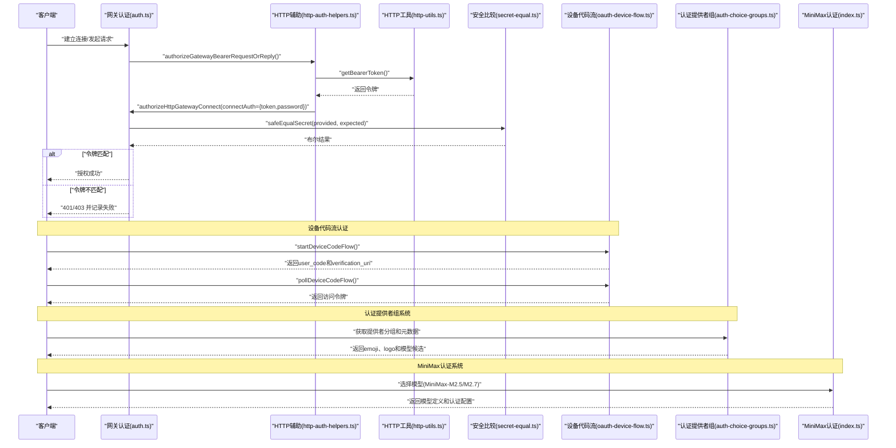
```mermaid
sequenceDiagram
participant C as "客户端"
participant GW as "网关认证(auth.ts)"
participant HL as "HTTP辅助(http-auth-helpers.ts)"
participant UT as "HTTP工具(http-utils.ts)"
participant SEC as "安全比较(secret-equal.ts)"
participant ODF as "设备代码流(oauth-device-flow.ts)"
participant ACG as "认证提供者组(auth-choice-groups.ts)"
participant MMA as "MiniMax认证(index.ts)"
C->>GW : "建立连接/发起请求"
GW->>HL : "authorizeGatewayBearerRequestOrReply()"
HL->>UT : "getBearerToken()"
UT-->>HL : "返回令牌"
HL->>GW : "authorizeHttpGatewayConnect(connectAuth={token,password})"
GW->>SEC : "safeEqualSecret(provided, expected)"
SEC-->>GW : "布尔结果"
alt "令牌匹配"
GW-->>C : "授权成功"
else "令牌不匹配"
GW-->>C : "401/403 并记录失败"
end
Note over ODF,C : 设备代码流认证
C->>ODF : "startDeviceCodeFlow()"
ODF-->>C : "返回user_code和verification_uri"
C->>ODF : "pollDeviceCodeFlow()"
ODF-->>C : "返回访问令牌"
Note over ACG,C : 认证提供者组系统
C->>ACG : "获取提供者分组和元数据"
ACG-->>C : "返回emoji、logo和模型候选"
Note over MMA,C : MiniMax认证系统
C->>MMA : "选择模型(MiniMax-M2.5/M2.7)"
MMA-->>C : "返回模型定义和认证配置"
```

**图表来源**
- [auth.ts:378-485](file://src/gateway/auth.ts#L378-L485)
- [http-auth-helpers.ts:7-29](file://src/gateway/http-auth-helpers.ts#L7-L29)
- [http-utils.ts:17-24](file://src/gateway/http-utils.ts#L17-L24)
- [secret-equal.ts:3-12](file://src/security/secret-equal.ts#L3-L12)
- [oauth-device-flow.ts:99-182](file://apps/electron/src/main/oauth-device-flow.ts#L99-L182)
- [auth-choice-groups.ts:52-114](file://ui-react/src/data/auth-choice-groups.ts#L52-L114)
- [index.ts:82-122](file://extensions/minimax-portal-auth/index.ts#L82-L122)

## 详细组件分析

### 网关认证与模式选择
- 模式解析
  - 优先级：显式覆盖 > 配置 > 密码存在 > 令牌存在 > 默认令牌。
  - 受信任代理模式需提供 userHeader 与可信代理列表。
  - Tailscale 模式在非本地直连且允许时，通过代理头与 WhoIS 校验用户身份。
- 授权流程
  - 受信任代理：校验必选头部与用户白名单。
  - 令牌模式：要求 Authorization 头为 Bearer 且与配置一致。
  - 密码模式：支持自定义头部或 Basic 密码，均使用安全比较。
  - 速率限制：对错误尝试进行限流，成功后重置。
- 启动时认证生成
  - 在特定模式下不会自动生成令牌，以确保明确的凭据来源。

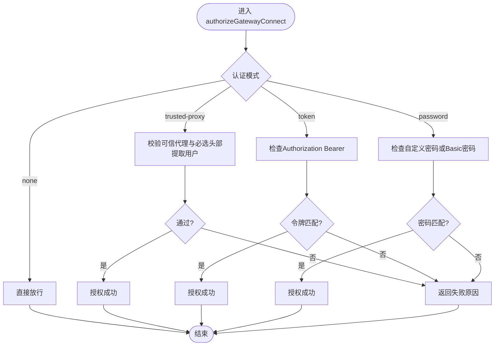
```mermaid
flowchart TD
Start(["进入 authorizeGatewayConnect"]) --> Mode{"认证模式"}
Mode --> |trusted-proxy| TP["校验可信代理与必选头部<br/>提取用户"]
Mode --> |none| OK1["直接放行"]
Mode --> |token| TK["检查Authorization Bearer"]
Mode --> |password| PW["检查自定义密码或Basic密码"]
TP --> TPRes{"通过?"}
TK --> TKRes{"令牌匹配?"}
PW --> PWRes{"密码匹配?"}
TPRes --> |是| OK2["授权成功"]
TPRes --> |否| RL["返回失败原因"]
TKRes --> |是| OK3["授权成功"]
TKRes --> |否| RL
PWRes --> |是| OK4["授权成功"]
PWRes --> |否| RL
OK1 --> End(["结束"])
OK2 --> End
OK3 --> End
OK4 --> End
RL --> End
```

**图表来源**
- [auth.ts:378-485](file://src/gateway/auth.ts#L378-L485)

**章节来源**
- [auth.ts:217-292](file://src/gateway/auth.ts#L217-L292)
- [auth.ts:378-485](file://src/gateway/auth.ts#L378-L485)
- [startup-auth.test.ts:308-360](file://src/gateway/startup-auth.test.ts#L308-L360)

### 浏览器请求认证
- 支持 Bearer 令牌与 Basic 密码两种方式。
- 使用安全比较函数避免时序攻击。
- 允许通过自定义头部传递密码作为补充校验。

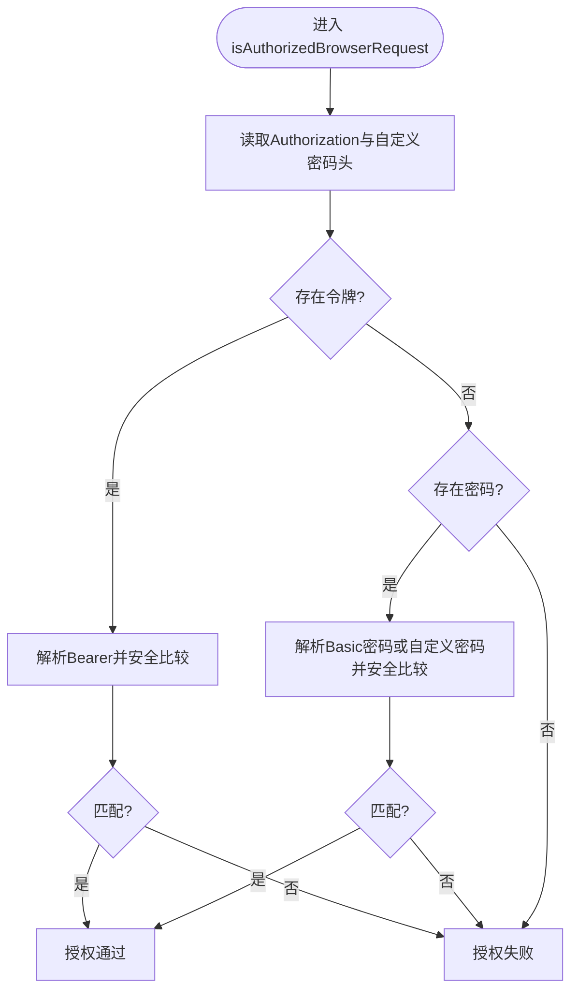
```mermaid
flowchart TD
BStart(["进入 isAuthorizedBrowserRequest"]) --> Hdr["读取Authorization与自定义密码头"]
Hdr --> HasToken{"存在令牌?"}
HasToken --> |是| BEAR["解析Bearer并安全比较"]
HasToken --> |否| HasPwd{"存在密码?"}
BEAR --> BEAROK{"匹配?"}
BEAROK --> |是| BOK["授权通过"]
BEAROK --> |否| BFail["授权失败"]
HasPwd --> |是| PWD["解析Basic密码或自定义密码并安全比较"]
PWD --> PWDOK{"匹配?"}
PWDOK --> |是| BOK
PWDOK --> |否| BFail
HasPwd --> |否| BFail
```

**图表来源**
- [http-auth.ts:37-64](file://src/browser/http-auth.ts#L37-L64)
- [secret-equal.ts:3-12](file://src/security/secret-equal.ts#L3-L12)

**章节来源**
- [http-auth.ts:1-64](file://src/browser/http-auth.ts#L1-L64)
- [secret-equal.ts:1-13](file://src/security/secret-equal.ts#L1-L13)

### 凭据管理与存储
- 类型与语义
  - Token 凭据支持 inline 值或 tokenRef，expires 可选但需有效。
  - OAuth 凭据存储 refresh_token 与 expires，支持自动刷新。
  - API Key 凭据用于模型提供商。
  - 设备代码凭据：存储用户代码和验证URI，支持设备代码流认证。
- 存储布局
  - 按 Agent 隔离存储，兼容历史文件与导入。
  - 支持 SecretRef 引用，运行时激活。
- 多账户与路由
  - 通过 profileId 与 auth.order 控制使用顺序。
  - 支持会话级覆盖（如 /model ...@<profileId>）。
  - 设备代码认证：通过设备代码流获取的令牌存储在凭据中。

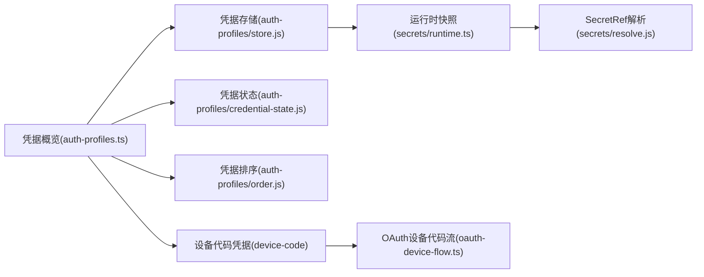
```mermaid
graph LR
A["凭据概览(auth-profiles.ts)"] --> B["凭据存储(auth-profiles/store.js)"]
A --> C["凭据状态(auth-profiles/credential-state.js)"]
A --> D["凭据排序(auth-profiles/order.js)"]
B --> E["运行时快照(secrets/runtime.ts)"]
E --> F["SecretRef解析(secrets/resolve.js)"]
A --> G["设备代码凭据(device-code)"]
G --> H["OAuth设备代码流(oauth-device-flow.ts)"]
```

**图表来源**
- [auth-profiles.ts:1-55](file://src/agents/auth-profiles.ts#L1-L55)
- [runtime.ts:102-166](file://src/secrets/runtime.ts#L102-L166)
- [oauth-device-flow.ts:60-90](file://apps/electron/src/main/oauth-device-flow.ts#L60-L90)

**章节来源**
- [auth-credential-semantics.md:20-38](file://docs/auth-credential-semantics.md#L20-L38)
- [oauth.md:41-56](file://docs/concepts/oauth.md#L41-L56)
- [auth.ts:145-185](file://src/commands/models/auth.ts#L145-L185)
- [types.d.ts:80-95](file://dist/plugin-sdk/plugins/types.d.ts#L80-L95)

### 插件 SDK 的 Bearer 自动注入
- 自动附加 Bearer 到请求头。
- 对 401/403 错误进行重试，必要时按作用域重新获取令牌。
- 可强制要求 HTTPS，避免明文传输泄露。

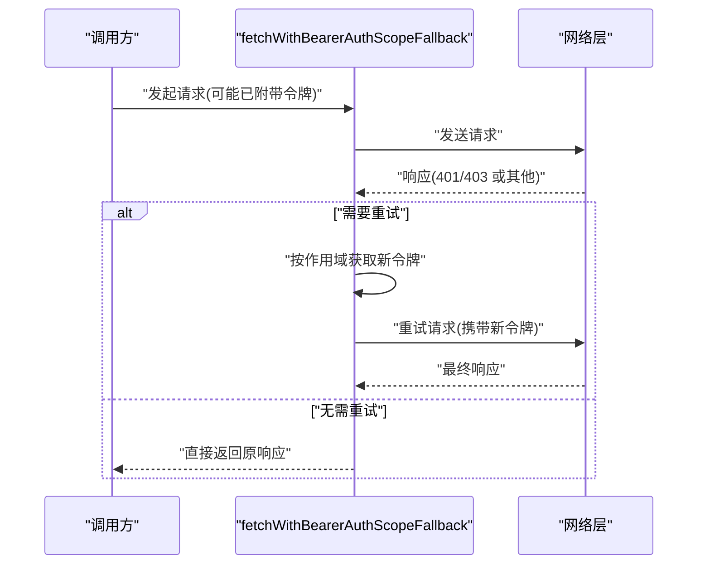
```mermaid
sequenceDiagram
participant S as "调用方"
participant SDK as "fetchWithBearerAuthScopeFallback"
participant NET as "网络层"
S->>SDK : "发起请求(可能已附带令牌)"
SDK->>NET : "发送请求"
NET-->>SDK : "响应(401/403 或其他)"
alt "需要重试"
SDK->>SDK : "按作用域获取新令牌"
SDK->>NET : "重试请求(携带新令牌)"
NET-->>SDK : "最终响应"
else "无需重试"
SDK-->>S : "直接返回原响应"
end
```

**图表来源**
- [fetch-auth.ts:9-51](file://src/plugin-sdk/fetch-auth.ts#L9-L51)

**章节来源**
- [fetch-auth.ts:1-51](file://src/plugin-sdk/fetch-auth.ts#L1-L51)

## OAuth设备代码流

### 设备代码流概述
OpenClaw 实现了完整的 OAuth 设备代码流（RFC 8628），为无法使用传统重定向回调的场景提供安全的用户授权机制。该流程适用于移动设备、智能电视或其他没有浏览器环境的设备。

### 设备代码流工作原理
设备代码流分为两个主要阶段：

1. **设备授权阶段**：设备向授权服务器请求设备代码
2. **用户授权阶段**：用户在另一台设备上完成授权

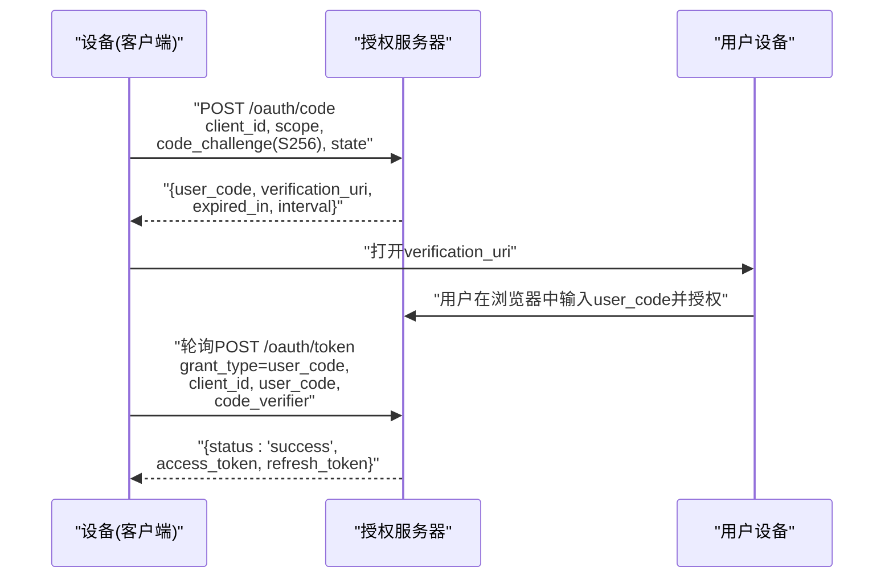
```mermaid
sequenceDiagram
participant D as "设备(客户端)"
participant A as "授权服务器"
participant U as "用户设备"
D->>A : "POST /oauth/code<br/>client_id, scope,<br/>code_challenge(S256), state"
A-->>D : "{user_code, verification_uri,<br/>expired_in, interval}"
D->>U : "打开verification_uri"
U->>A : "用户在浏览器中输入user_code并授权"
D->>A : "轮询POST /oauth/token<br/>grant_type=user_code,<br/>client_id, user_code,<br/>code_verifier"
A-->>D : "{status : 'success',<br/>access_token, refresh_token}"
```

**图表来源**
- [oauth-device-flow.ts:99-182](file://apps/electron/src/main/oauth-device-flow.ts#L99-L182)
- [oauth-device-flow.ts:190-258](file://apps/electron/src/main/oauth-device-flow.ts#L190-L258)

### 设备代码流配置
设备代码流通过配置对象实现，支持不同提供商的特定需求：

- **通用配置**：codeEndpoint、tokenEndpoint、clientId、scope、grantType、usePKCE
- **解析器**：parseCodeResponse、parseTokenResponse
- **额外头部**：extraCodeHeaders（如x-request-id）

**章节来源**
- [oauth-device-flow.ts:20-58](file://apps/electron/src/main/oauth-device-flow.ts#L20-L58)
- [oauth-device-flow.ts:266-328](file://apps/electron/src/main/oauth-device-flow.ts#L266-L328)

### MiniMax设备代码流实现
OpenClaw 为 MiniMax 提供了完整的设备代码流实现，包括：

- **全球版**：api.minimax.io
- **中国版**：api.minimaxi.com
- **特殊要求**：必须包含state参数，支持x-request-id头部

**章节来源**
- [oauth-device-flow.ts:266-318](file://apps/electron/src/main/oauth-device-flow.ts#L266-L318)
- [oauth-flows.md:153-161](file://apps/electron/docs/oauth-flows.md#L153-L161)

## PKCE安全机制

### PKCE概述
Proof Key for Code Exchange (PKCE) 是 OAuth 2.0 的安全扩展，专门用于保护授权码流程中的客户端凭证。在设备代码流中，PKCE 提供了额外的安全层，防止授权码拦截攻击。

### PKCE工作机制
PKCE 通过以下三个组件实现安全保护：

1. **verifier（证明者）**：高熵随机字符串，客户端持有
2. **challenge（挑战）**：verifier的SHA-256哈希，base64url编码，发送给授权服务器
3. **state（状态）**：随机值，用于CSRF保护

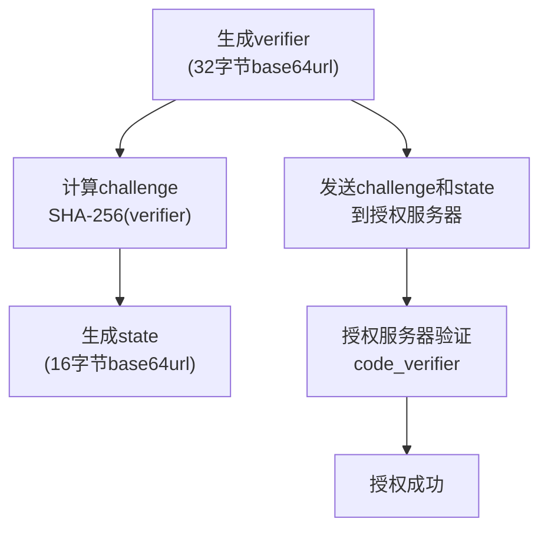
```mermaid
flowchart TD
V["生成verifier<br/>(32字节base64url)"] --> C["计算challenge<br/>SHA-256(verifier)"]
C --> S["生成state<br/>(16字节base64url)"]
V --> R["发送challenge和state<br/>到授权服务器"]
R --> T["授权服务器验证<br/>code_verifier"]
T --> OK["授权成功"]
```

**图表来源**
- [oauth-utils.ts:19-24](file://apps/electron/src/main/oauth-utils.ts#L19-L24)

### PKCE在设备代码流中的应用
在设备代码流中，PKCE通过以下方式增强安全性：

- **挑战-响应验证**：确保授权码只能由原始客户端兑换
- **防止中间人攻击**：即使授权码被截获，没有verifier也无法兑换
- **CSRF保护**：state参数防止跨站请求伪造

**章节来源**
- [oauth-utils.ts:11-24](file://apps/electron/src/main/oauth-utils.ts#L11-L24)
- [oauth-device-flow.ts:102-116](file://apps/electron/src/main/oauth-device-flow.ts#L102-L116)

## CSRF保护机制

### CSRF威胁概述
跨站请求伪造（CSRF）是一种常见的Web安全攻击，攻击者诱使用户在已认证的网站上执行非预期操作。在OAuth流程中，CSRF攻击可能导致恶意用户获得访问令牌。

### CSRF防护策略
OpenClaw 采用多重CSRF防护机制：

1. **随机state参数**：每次授权请求生成唯一state值
2. **state回显验证**：授权服务器必须在回调中返回相同的state
3. **会话状态管理**：在服务器端存储期望的state值

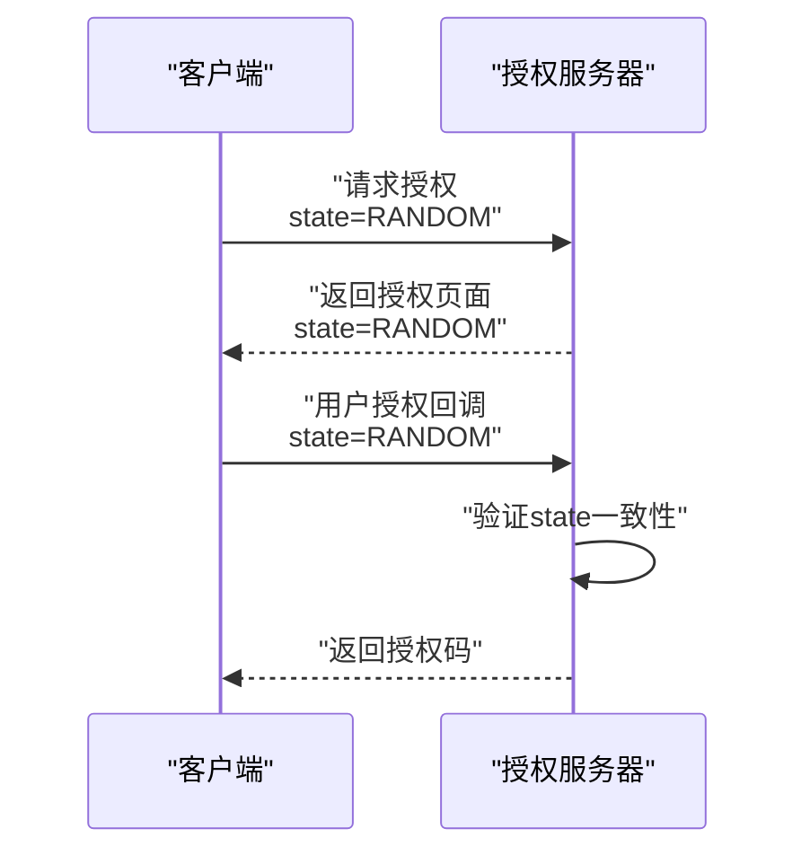
```mermaid
sequenceDiagram
participant C as "客户端"
participant AS as "授权服务器"
C->>AS : "请求授权<br/>state=RANDOM"
AS-->>C : "返回授权页面<br/>state=RANDOM"
C->>AS : "用户授权回调<br/>state=RANDOM"
AS->>AS : "验证state一致性"
AS-->>C : "返回授权码"
```

**图表来源**
- [onboarding-oauth.ts:116-122](file://apps/electron/src/main/onboarding-oauth.ts#L116-L122)
- [oauth-device-flow.ts:155-159](file://apps/electron/src/main/oauth-device-flow.ts#L155-L159)

### CSRF防护实现细节
- **state生成**：使用16字节随机数生成base64url编码的状态值
- **state验证**：在授权回调时严格验证state参数的一致性
- **错误处理**：state不匹配时拒绝授权并记录潜在的CSRF攻击

**章节来源**
- [onboarding-oauth.ts:164-170](file://apps/electron/src/main/onboarding-oauth.ts#L164-L170)
- [oauth-device-flow.ts:155-159](file://apps/electron/src/main/oauth-device-flow.ts#L155-L159)

## 认证提供者组系统

### 系统重构概述
OpenClaw 的认证提供者组系统经历了重大重组，主要变化包括：

- **增强的元数据映射**：PROVIDER_EMOJI、PROVIDER_LOGO和PROVIDER_MODEL_CANDIDATES映射得到增强
- **提供者条目精简**：移除了多个不再使用的提供者条目，简化了架构
- **统一的静态定义**：认证提供者组现在使用静态定义文件，便于维护和同步

### PROVIDER_EMOJI 映射增强
新的emoji映射支持更多提供者，提供更好的视觉识别：

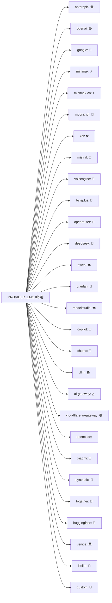
```mermaid
graph LR
PE["PROVIDER_EMOJI映射"] --> AN["anthropic: 🟠"]
PE --> OP["openai: 🟢"]
PE --> GO["google: 🔵"]
PE --> MM["minimax: ⚡"]
PE --> MC["minimax-cn: ⚡"]
PE --> MO["moonshot: 🌙"]
PE --> XA["xai: ✖️"]
PE --> MI["mistral: 🌊"]
PE --> VE["volcengine: 🌋"]
PE --> BP["byteplus: 🔶"]
PE --> OR["openrouter: 🔀"]
PE --> DS["deepseek: 🐋"]
PE --> QW["qwen: ☁️"]
PE --> QF["qianfan: 🦅"]
PE --> MS["modelstudio: ☁️"]
PE --> CP["copilot: 🐙"]
PE --> CH["chutes: 🧵"]
PE --> VL["vllm: 🏠"]
PE --> AG["ai-gateway: △"]
PE --> CF["cloudflare-ai-gateway: 🟠"]
PE --> OC["opencode: </>"]
PE --> XM["xiaomi: 📱"]
PE --> SY["synthetic: 🧪"]
PE --> TG["together: 🤝"]
PE --> HF["huggingface: 🤗"]
PE --> VN["venice: 🏛️"]
PE --> LT["litellm: 🔗"]
PE --> CU["custom: 🔧"]
```

**图表来源**
- [auth-choice-groups.ts:52-82](file://ui-react/src/data/auth-choice-groups.ts#L52-L82)
- [constants.ts:1-11](file://ui-react/src/components/setup-wizard/steps/api-key-step/constants.ts#L1-L11)

### PROVIDER_LOGO 映射
提供者logo映射支持可视化界面中的图标显示：

- **标准提供者**：anthropic、openai、google、deepseek、minimax、moonshot、xai、openrouter、opencode、qwen、zai
- **图标资源**：每个提供者都有对应的logo文件

### PROVIDER_MODEL_CANDIDATES 映射
模型候选映射为设置界面提供默认模型选择：

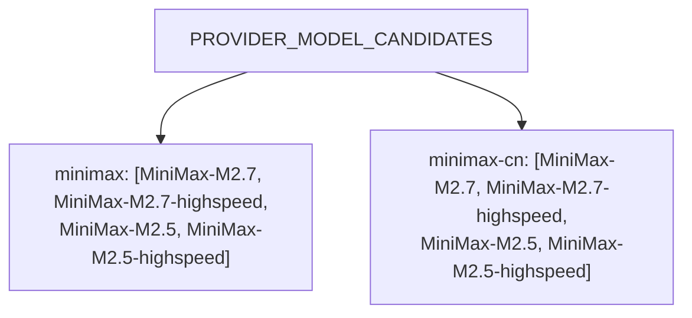
```mermaid
graph TB
PMC["PROVIDER_MODEL_CANDIDATES"] --> MM["minimax: [MiniMax-M2.7, MiniMax-M2.7-highspeed,<br/>MiniMax-M2.5, MiniMax-M2.5-highspeed]"]
PMC --> MC["minimax-cn: [MiniMax-M2.7, MiniMax-M2.7-highspeed,<br/>MiniMax-M2.5, MiniMax-M2.5-highspeed]"]
```

**图表来源**
- [auth-choice-groups.ts:100-114](file://ui-react/src/data/auth-choice-groups.ts#L100-L114)

### 认证提供者分组
认证提供者现在按功能分组，支持特色卡片显示：

- **特色提供者**：anthropic、openai、google、deepseek、minimax、minimax-cn、openrouter、zai
- **其他提供者**：moonshot、xiaomi、xai、qwen、opencode、volcengine、byteplus、mistral、qianfan、modelstudio、copilot、chutes、vllm、ai-gateway、cloudflare-ai-gateway、synthetic、together、huggingface、venice、litellm、custom

### 认证选项与标志
系统还包含认证选项构建器和提供者认证标志：

- **认证选项构建**：从静态定义生成CLI和UI使用的认证选项
- **提供者认证标志**：定义CLI标志、描述和认证选择映射

**章节来源**
- [auth-choice-groups.ts:1-744](file://ui-react/src/data/auth-choice-groups.ts#L1-L744)
- [auth-choice-options.ts:1-391](file://src/commands/auth-choice-options.ts#L1-L391)
- [onboard-provider-auth-flags.ts:1-234](file://src/commands/onboard-provider-auth-flags.ts#L1-L234)
- [constants.ts:1-11](file://ui-react/src/components/setup-wizard/steps/api-key-step/constants.ts#L1-L11)

## MiniMax认证系统

### 模型标识符更新
**更新** MiniMax认证系统已更新模型标识符，修正默认模型ID从M2.7到M2.5，同时保持对M2.7模型的支持。

- **默认模型**：`MiniMax-M2.5`（从之前的`MiniMax-M2.7`修正）
- **支持的模型族**：M2.5和M2.7系列
- **高速推理变体**：M2.5-highspeed和M2.7-highspeed
- **特殊定价模型**：M2.7-Lightning

### 模型配置与别名
MiniMax认证系统提供了完整的模型配置支持：

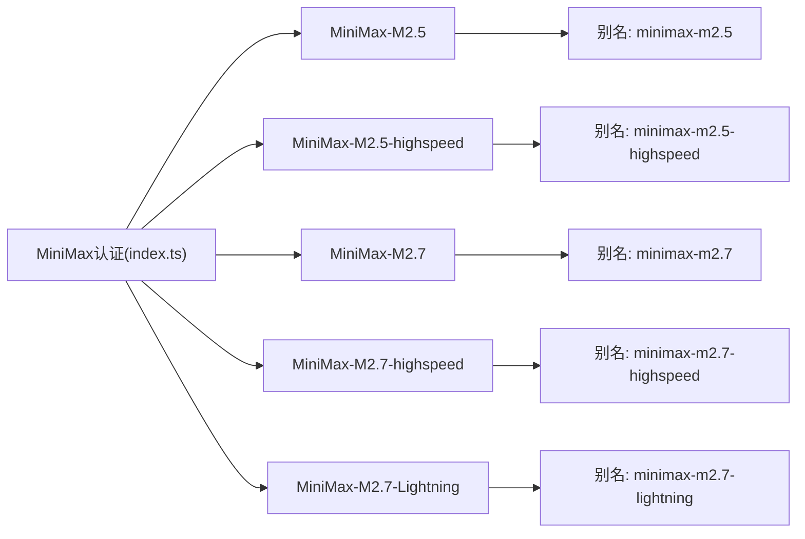
```mermaid
graph LR
MMA["MiniMax认证(index.ts)"] --> MD1["MiniMax-M2.5"]
MMA --> MD2["MiniMax-M2.5-highspeed"]
MMA --> MD3["MiniMax-M2.7"]
MMA --> MD4["MiniMax-M2.7-highspeed"]
MMA --> MD5["MiniMax-M2.7-Lightning"]
MD1 --> AL1["别名: minimax-m2.5"]
MD2 --> AL2["别名: minimax-m2.5-highspeed"]
MD3 --> AL3["别名: minimax-m2.7"]
MD4 --> AL4["别名: minimax-m2.7-highspeed"]
MD5 --> AL5["别名: minimax-m2.7-lightning"]
```

**图表来源**
- [index.ts:82-122](file://extensions/minimax-portal-auth/index.ts#L82-L122)

### 认证流程
MiniMax认证系统支持多种认证方式：

1. **OAuth认证**：通过设备代码流进行用户授权
2. **API Key认证**：直接使用API密钥进行认证
3. **模型选择**：支持M2.5和M2.7系列的模型选择

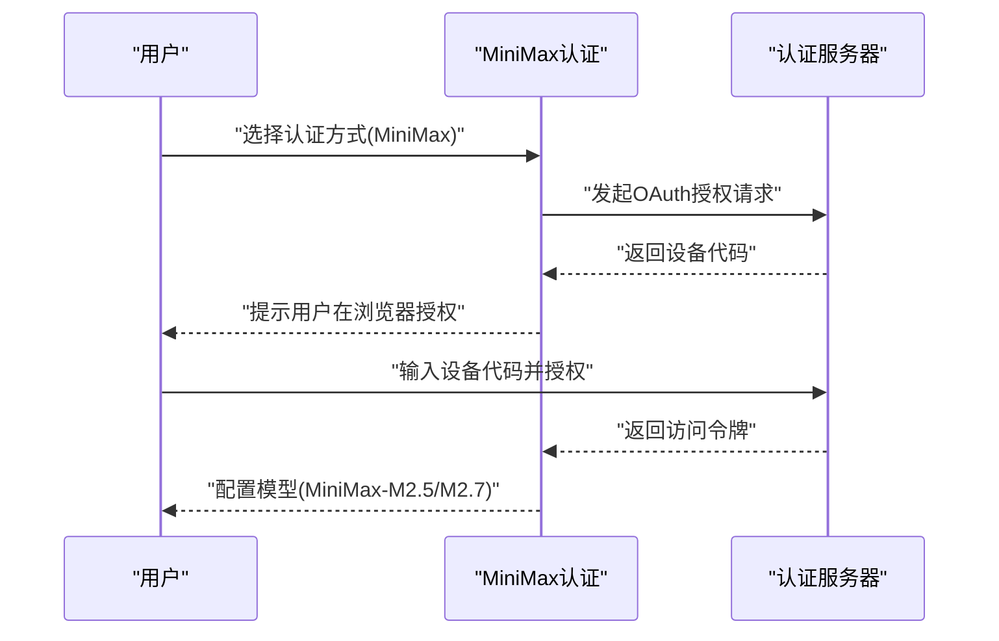
```mermaid
sequenceDiagram
participant U as "用户"
participant MMA as "MiniMax认证"
participant AS as "认证服务器"
U->>MMA : "选择认证方式(MiniMax)"
MMA->>AS : "发起OAuth授权请求"
AS-->>MMA : "返回设备代码"
MMA-->>U : "提示用户在浏览器授权"
U->>AS : "输入设备代码并授权"
AS-->>MMA : "返回访问令牌"
MMA-->>U : "配置模型(MiniMax-M2.5/M2.7)"
```

**图表来源**
- [oauth.ts:184-244](file://extensions/minimax-portal-auth/oauth.ts#L184-L244)
- [index.ts:48-141](file://extensions/minimax-portal-auth/index.ts#L48-L141)

### 配置选项
MiniMax认证系统提供了丰富的配置选项：

- **基础配置**：baseUrl、apiKey、api类型
- **模型配置**：支持多种模型变体和推理模式
- **别名配置**：提供简化的模型引用别名
- **成本配置**：支持不同的定价模型

**章节来源**
- [index.ts:10-176](file://extensions/minimax-portal-auth/index.ts#L10-L176)
- [oauth.ts:9-245](file://extensions/minimax-portal-auth/oauth.ts#L9-L245)
- [minimax.md:1-218](file://docs/providers/minimax.md#L1-L218)
- [onboard-auth.models.ts:95-131](file://src/commands/onboard-auth.models.ts#L95-L131)
- [auth-choice-groups.ts:114-163](file://ui-react/src/data/auth-choice-groups.ts#L114-L163)

## 依赖关系分析
- 组件耦合
  - 网关认证依赖安全比较与 HTTP 工具，形成清晰边界。
  - 浏览器认证与网关认证共享安全比较逻辑，保证一致性。
  - 凭据管理通过运行时统一解析 SecretRef，降低各模块对密钥来源的感知。
  - 设备代码流独立于网关认证，通过Electron主进程实现。
  - **认证提供者组系统**独立于其他认证模块，通过静态定义文件管理。
  - **MiniMax认证系统**独立于其他认证模块，通过插件形式集成。
- 外部依赖
  - 受信任代理依赖上游反向代理正确设置转发头。
  - Tailscale 身份识别依赖代理正确透传用户头与 WhoIS 服务可用性。
  - 设备代码流依赖提供商的OAuth端点和网络连接。
  - **认证提供者组系统**依赖静态定义文件的同步。
  - **MiniMax认证系统**依赖MiniMax的OAuth端点和模型配置。

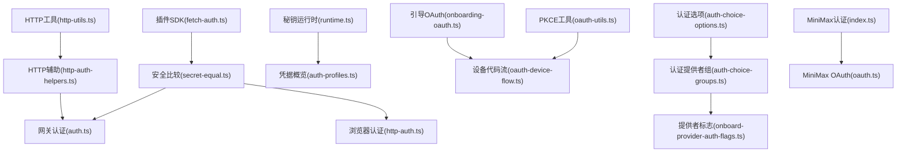
```mermaid
graph TB
SEC["安全比较(secret-equal.ts)"] --> GA["网关认证(auth.ts)"]
SEC --> BA["浏览器认证(http-auth.ts)"]
UT["HTTP工具(http-utils.ts)"] --> GAH["HTTP辅助(http-auth-helpers.ts)"]
GAH --> GA
RT["秘钥运行时(runtime.ts)"] --> AP["凭据概览(auth-profiles.ts)"]
FA["插件SDK(fetch-auth.ts)"] --> SEC
PU["PKCE工具(oauth-utils.ts)"] --> ODF["设备代码流(oauth-device-flow.ts)"]
OOA["引导OAuth(onboarding-oauth.ts)"] --> ODF
ACG["认证提供者组(auth-choice-groups.ts)"] --> OPF["提供者标志(onboard-provider-auth-flags.ts)"]
ACO["认证选项(auth-choice-options.ts)"] --> ACG
MMA["MiniMax认证(index.ts)"] --> MMO["MiniMax OAuth(oauth.ts)"]
```

**图表来源**
- [auth.ts:1-504](file://src/gateway/auth.ts#L1-L504)
- [http-auth.ts:1-64](file://src/browser/http-auth.ts#L1-L64)
- [http-auth-helpers.ts:1-30](file://src/gateway/http-auth-helpers.ts#L1-L30)
- [http-utils.ts:1-105](file://src/gateway/http-utils.ts#L1-L105)
- [runtime.ts:1-251](file://src/secrets/runtime.ts#L1-L251)
- [auth-profiles.ts:1-55](file://src/agents/auth-profiles.ts#L1-L55)
- [fetch-auth.ts:1-51](file://src/plugin-sdk/fetch-auth.ts#L1-L51)
- [oauth-utils.ts:1-34](file://apps/electron/src/main/oauth-utils.ts#L1-L34)
- [oauth-device-flow.ts:1-329](file://apps/electron/src/main/oauth-device-flow.ts#L1-L329)
- [onboarding-oauth.ts:1-234](file://apps/electron/src/main/onboarding-oauth.ts#L1-L234)
- [auth-choice-groups.ts:1-744](file://ui-react/src/data/auth-choice-groups.ts#L1-L744)
- [auth-choice-options.ts:1-391](file://src/commands/auth-choice-options.ts#L1-L391)
- [onboard-provider-auth-flags.ts:1-234](file://src/commands/onboard-provider-auth-flags.ts#L1-L234)
- [index.ts:1-176](file://extensions/minimax-portal-auth/index.ts#L1-L176)
- [oauth.ts:1-245](file://extensions/minimax-portal-auth/oauth.ts#L1-L245)

**章节来源**
- [auth.ts:1-504](file://src/gateway/auth.ts#L1-L504)
- [http-auth.ts:1-64](file://src/browser/http-auth.ts#L1-L64)
- [http-auth-helpers.ts:1-30](file://src/gateway/http-auth-helpers.ts#L1-L30)
- [http-utils.ts:1-105](file://src/gateway/http-utils.ts#L1-L105)
- [runtime.ts:1-251](file://src/secrets/runtime.ts#L1-L251)
- [auth-profiles.ts:1-55](file://src/agents/auth-profiles.ts#L1-L55)
- [fetch-auth.ts:1-51](file://src/plugin-sdk/fetch-auth.ts#L1-L51)
- [oauth-utils.ts:1-34](file://apps/electron/src/main/oauth-utils.ts#L1-L34)
- [oauth-device-flow.ts:1-329](file://apps/electron/src/main/oauth-device-flow.ts#L1-L329)
- [onboarding-oauth.ts:1-234](file://apps/electron/src/main/onboarding-oauth.ts#L1-L234)
- [auth-choice-groups.ts:1-744](file://ui-react/src/data/auth-choice-groups.ts#L1-L744)
- [auth-choice-options.ts:1-391](file://src/commands/auth-choice-options.ts#L1-L391)
- [onboard-provider-auth-flags.ts:1-234](file://src/commands/onboard-provider-auth-flags.ts#L1-L234)
- [index.ts:1-176](file://extensions/minimax-portal-auth/index.ts#L1-L176)
- [oauth.ts:1-245](file://extensions/minimax-portal-auth/oauth.ts#L1-L245)

## 性能考量
- 速率限制
  - 对失败的认证尝试进行限流，减少暴力破解风险。
  - 成功认证后重置计数，避免误伤合法请求。
- 安全比较
  - 使用恒定时序比较，避免侧信道攻击。
- 运行时快照
  - SecretRef 解析与激活采用快照机制，减少重复计算与并发冲突。
- 设备代码流优化
  - 轮询间隔调节：根据提供商响应动态调整轮询间隔，最长不超过10秒。
  - 超时管理：设备代码过期时间严格控制，避免无限轮询。
  - 网络错误处理：设备代码流对网络异常具有良好的容错性。
- **认证提供者组系统优化**
  - **静态定义缓存**：认证提供者组使用静态定义文件，减少运行时计算开销。
  - **映射优化**：PROVIDER_EMOJI、PROVIDER_LOGO和PROVIDER_MODEL_CANDIDATES映射经过优化，提供快速查找。
  - **条件加载**：部分提供者条目被移除，减少了内存占用和初始化时间。
- **MiniMax认证优化**
  - **模型缓存**：支持模型定义的缓存，减少重复配置开销。
  - **别名解析**：提供快速的模型别名解析机制。
  - **并发处理**：支持多个MiniMax认证实例的并发处理。

**章节来源**
- [auth.ts:415-431](file://src/gateway/auth.ts#L415-L431)
- [secret-equal.ts:1-13](file://src/security/secret-equal.ts#L1-L13)
- [runtime.ts:168-197](file://src/secrets/runtime.ts#L168-L197)
- [oauth-device-flow.ts:234-257](file://apps/electron/src/main/oauth-device-flow.ts#L234-L257)
- [auth-choice-groups.ts:52-114](file://ui-react/src/data/auth-choice-groups.ts#L52-L114)
- [index.ts:27-42](file://extensions/minimax-portal-auth/index.ts#L27-L42)

## 故障排除指南
- "未找到凭据"
  - 确认已通过向导或命令写入对应 provider 的凭据。
  - 对于 Anthropic setup-token，需在网关主机上执行相应命令并粘贴。
- "令牌即将过期/已过期"
  - 使用健康检查命令确认具体过期 profile。
  - 重新登录或更新令牌，必要时清理过期条目。
- "受信任代理未配置/用户缺失"
  - 检查上游代理是否正确设置转发头与 userHeader。
  - 确认允许的用户列表包含当前用户。
- "Tailscale 用户不匹配"
  - 检查代理是否正确透传用户头。
  - 确保 WhoIS 查询返回的用户与请求头一致。
- "HTTPS 要求"
  - 插件 SDK 可强制要求 HTTPS，若目标站点不支持请调整配置。
- **设备代码流相关问题**
  - 状态不匹配：检查CSRF state参数是否正确传递和验证。
  - 设备代码过期：设备代码通常有5-10分钟有效期，需要及时完成授权。
  - 轮询超时：如果轮询超过设备代码有效期，需要重新开始授权流程。
  - PKCE验证失败：确保code_verifier与code_challenge正确对应。
  - 提供商特定错误：如MiniMax的2013错误，检查必需参数是否完整。
- **认证提供者组系统相关问题**
  - **提供者未显示**：检查认证提供者组定义文件是否正确同步。
  - **emoji或logo不显示**：确认PROVIDER_EMOJI和PROVIDER_LOGO映射是否正确配置。
  - **模型候选不正确**：验证PROVIDER_MODEL_CANDIDATES映射是否包含正确的模型列表。
- **MiniMax认证相关问题**
  - **模型ID错误**：确认使用的模型ID格式正确（MiniMax-M2.5/M2.7）。
  - **默认模型不匹配**：检查配置中的默认模型是否符合预期。
  - **高速模型不可用**：确认对应的高速推理变体是否已正确配置。
  - **M2.7 Lightning模型**：确认Lightning变体的特殊配置要求。

**章节来源**
- [authentication.md:160-180](file://docs/gateway/authentication.md#L160-L180)
- [oauth.md:123-159](file://docs/concepts/oauth.md#L123-L159)
- [auth.ts:335-372](file://src/gateway/auth.ts#L335-L372)
- [fetch-auth.ts:26-28](file://src/plugin-sdk/fetch-auth.ts#L26-L28)
- [oauth-flows.md:219-297](file://apps/electron/docs/oauth-flows.md#L219-L297)
- [auth-choice-groups.ts:52-114](file://ui-react/src/data/auth-choice-groups.ts#L52-L114)
- [index.ts:190-244](file://extensions/minimax-portal-auth/index.ts#L190-L244)

## 结论
OpenClaw 的认证系统以"最小暴露面、强安全基线、可运维性"为目标，提供多模式认证、细粒度凭据管理与安全传输保障。**最新增强**包括OAuth设备代码流支持、PKCE安全机制、CSRF保护，以及认证提供者组系统的重大重组。通过增强的PROVIDER_EMOJI、PROVIDER_LOGO和PROVIDER_MODEL_CANDIDATES映射，简化了架构并提高了用户体验。通过 SecretRef 统一解析、运行时快照、速率限制、设备代码流、认证提供者组系统和MiniMax认证系统等机制，既满足复杂场景下的灵活配置，又保持了较低的维护成本与较高的安全性。

## 附录

### 认证配置选项速览
- 网关认证模式
  - 无认证、令牌、密码、受信任代理、默认令牌。
- 受信任代理
  - 必选头部、用户白名单、可信代理列表。
- Tailscale
  - 仅在非本地直连且允许时启用，依赖代理头与 WhoIS。
- 凭据来源
  - SecretRef（env/file/exec），按 Agent 隔离存储。
  - 设备代码凭据：支持MiniMax等提供商的设备代码流认证。
- 插件 SDK
  - 自动附加 Bearer，支持作用域回退与 HTTPS 强制。
- 设备代码流配置
  - usePKCE：启用PKCE安全机制
  - extraCodeHeaders：提供商特定的请求头
  - parseCodeResponse：设备代码响应解析
  - parseTokenResponse：令牌响应解析
- **认证提供者组配置**
  - **PROVIDER_EMOJI**：提供者emoji映射，支持视觉识别
  - **PROVIDER_LOGO**：提供者logo映射，支持图标显示
  - **PROVIDER_MODEL_CANDIDATES**：提供者模型候选映射，支持默认模型选择
  - **认证分组**：按功能分组的提供者列表
- **MiniMax认证配置**
  - **默认模型**：MiniMax-M2.5（已修正）
  - **支持模型**：M2.5、M2.5-highspeed、M2.7、M2.7-highspeed、M2.7-Lightning
  - **认证方式**：OAuth设备代码流、API Key
  - **模型别名**：minimax-m2.5、minimax-m2.7、minimax-m2.7-highspeed、minimax-m2.7-lightning

**章节来源**
- [authentication.md:1-180](file://docs/gateway/authentication.md#L1-L180)
- [oauth.md:1-159](file://docs/concepts/oauth.md#L1-L159)
- [auth.ts:217-292](file://src/gateway/auth.ts#L217-L292)
- [runtime.ts:102-166](file://src/secrets/runtime.ts#L102-L166)
- [fetch-auth.ts:1-51](file://src/plugin-sdk/fetch-auth.ts#L1-L51)
- [oauth-device-flow.ts:20-58](file://apps/electron/src/main/oauth-device-flow.ts#L20-L58)
- [types.d.ts:80-95](file://dist/plugin-sdk/plugins/types.d.ts#L80-L95)
- [auth-choice-groups.ts:52-114](file://ui-react/src/data/auth-choice-groups.ts#L52-L114)
- [index.ts:10-176](file://extensions/minimax-portal-auth/index.ts#L10-L176)

### OAuth认证流程图
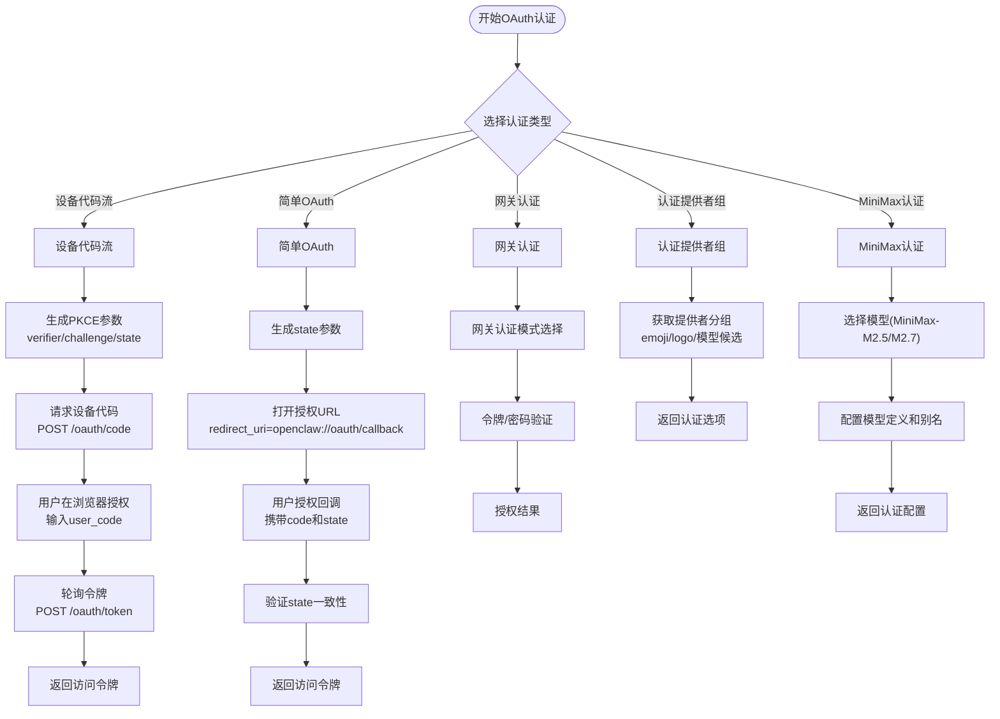
```mermaid
flowchart TD
Start(["开始OAuth认证"]) --> Choice{"选择认证类型"}
Choice --> |设备代码流| DC["设备代码流"]
Choice --> |简单OAuth| SO["简单OAuth"]
Choice --> |网关认证| GA["网关认证"]
Choice --> |认证提供者组| ACG["认证提供者组"]
Choice --> |MiniMax认证| MMA["MiniMax认证"]
DC --> DCC["生成PKCE参数<br/>verifier/challenge/state"]
DCC --> DCR["请求设备代码<br/>POST /oauth/code"]
DCR --> DCA["用户在浏览器授权<br/>输入user_code"]
DCA --> DCP["轮询令牌<br/>POST /oauth/token"]
DCP --> DCS["返回访问令牌"]
SO --> SOR["生成state参数"]
SOR --> SOP["打开授权URL<br/>redirect_uri=openclaw://oauth/callback"]
SOP --> SOA["用户授权回调<br/>携带code和state"]
SOA --> SOC["验证state一致性"]
SOC --> SOT["返回访问令牌"]
GA --> GAR["网关认证模式选择"]
GAR --> GAS["令牌/密码验证"]
GAS --> GAT["授权结果"]
ACG --> ACGE["获取提供者分组<br/>emoji/logo/模型候选"]
ACGE --> ACGR["返回认证选项"]
MMA --> MMAC["选择模型(MiniMax-M2.5/M2.7)"]
MMAC --> MMAD["配置模型定义和别名"]
MMAD --> MMAE["返回认证配置"]
```

**图表来源**
- [oauth-flows.md:15-60](file://apps/electron/docs/oauth-flows.md#L15-L60)
- [onboarding-oauth.ts:141-228](file://apps/electron/src/main/onboarding-oauth.ts#L141-L228)
- [auth.ts:217-292](file://src/gateway/auth.ts#L217-L292)
- [auth-choice-groups.ts:52-114](file://ui-react/src/data/auth-choice-groups.ts#L52-L114)
- [index.ts:48-141](file://extensions/minimax-portal-auth/index.ts#L48-L141)