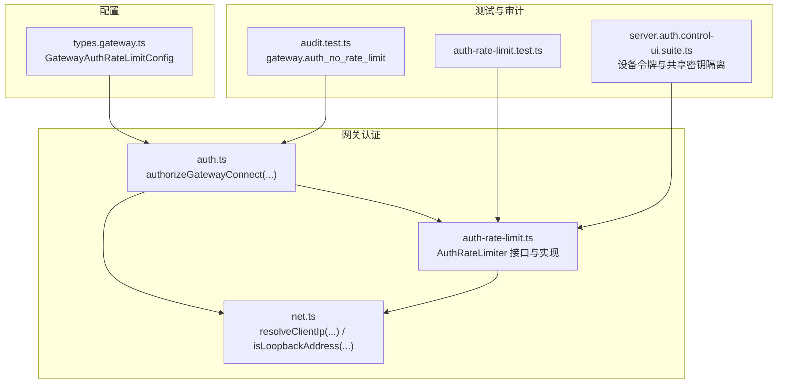
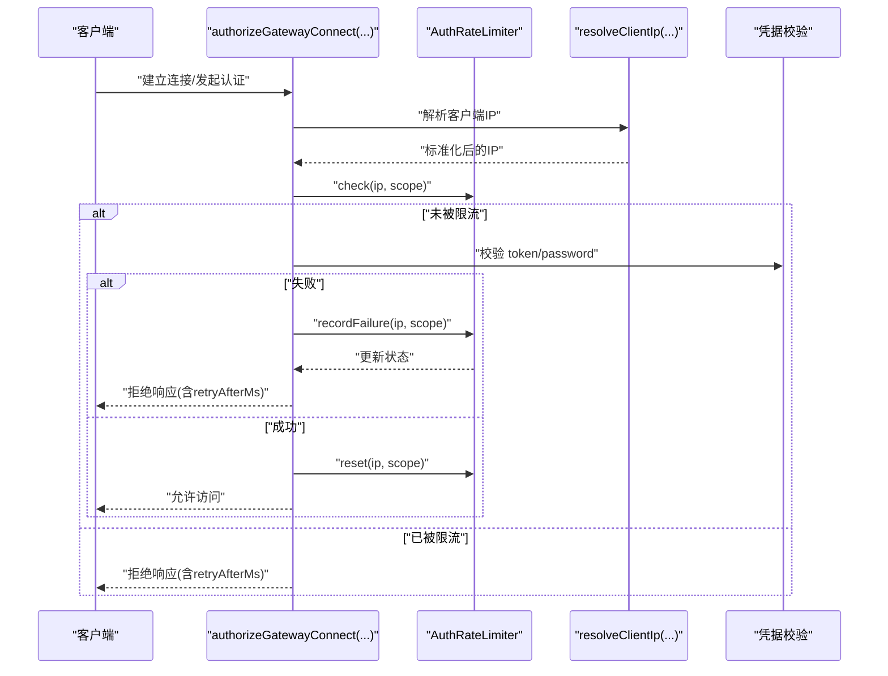
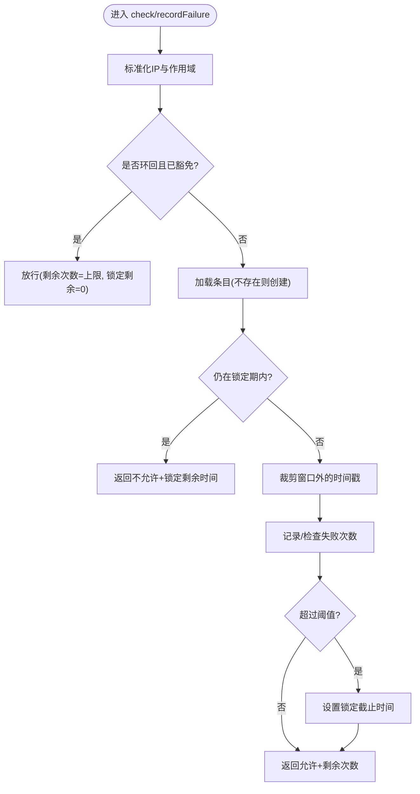
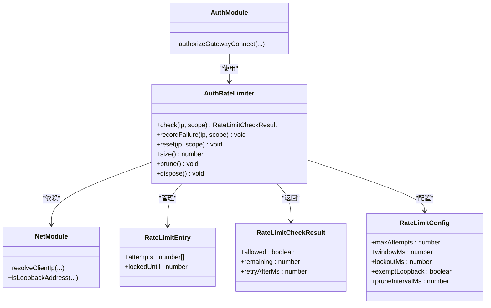

# 速率限制

<cite>
**本文引用的文件**
- [auth-rate-limit.ts](file://src/gateway/auth-rate-limit.ts)
- [auth-rate-limit.test.ts](file://src/gateway/auth-rate-limit.test.ts)
- [auth.ts](file://src/gateway/auth.ts)
- [net.ts](file://src/gateway/net.ts)
- [types.gateway.ts](file://src/config/types.gateway.ts)
- [audit.test.ts](file://src/security/audit.test.ts)
- [http-auth-helpers.ts](file://src/gateway/http-auth-helpers.ts)
- [server.auth.control-ui.suite.ts](file://src/gateway/server.auth.control-ui.suite.ts)
</cite>

## 目录

1. [简介](#简介)
2. [项目结构](#项目结构)
3. [核心组件](#核心组件)
4. [架构总览](#架构总览)
5. [详细组件分析](#详细组件分析)
6. [依赖关系分析](#依赖关系分析)
7. [性能考量](#性能考量)
8. [故障排除指南](#故障排除指南)
9. [结论](#结论)
10. [附录](#附录)

## 简介

本文件系统性阐述 OpenClaw 网关的认证速率限制机制，覆盖失败尝试计数、滑动窗口与锁定期计算、IP 归一化与作用域隔离、配置参数与默认值、性能影响与监控方法，并提供多场景策略与最佳实践。该机制以纯内存滑动窗口实现，支持按作用域（scope）独立计数，具备周期清理与环回豁免等特性。

## 项目结构

与速率限制直接相关的代码分布在以下模块：

- 认证速率限制器：实现滑动窗口、锁定期、作用域隔离与周期清理
- 认证流程：在握手阶段调用速率限制器进行检查与记录
- 网络层：负责客户端 IP 解析与归一化
- 配置类型：定义速率限制配置项与默认值
- 测试与审计：验证行为、边界条件与安全建议

图表来源

- [auth.ts:415-484](file://src/gateway/auth.ts#L415-L484)
- [auth-rate-limit.ts:95-232](file://src/gateway/auth-rate-limit.ts#L95-L232)
- [net.ts:156-185](file://src/gateway/net.ts#L156-L185)
- [types.gateway.ts:168-177](file://src/config/types.gateway.ts#L168-L177)
- [auth-rate-limit.test.ts:1-220](file://src/gateway/auth-rate-limit.test.ts#L1-L220)
- [audit.test.ts:328-366](file://src/security/audit.test.ts#L328-L366)
- [server.auth.control-ui.suite.ts:466-498](file://src/gateway/server.auth.control-ui.suite.ts#L466-L498)

章节来源

- [auth.ts:415-484](file://src/gateway/auth.ts#L415-L484)
- [auth-rate-limit.ts:95-232](file://src/gateway/auth-rate-limit.ts#L95-L232)
- [net.ts:156-185](file://src/gateway/net.ts#L156-L185)
- [types.gateway.ts:168-177](file://src/config/types.gateway.ts#L168-L177)
- [auth-rate-limit.test.ts:1-220](file://src/gateway/auth-rate-limit.test.ts#L1-L220)
- [audit.test.ts:328-366](file://src/security/audit.test.ts#L328-L366)
- [server.auth.control-ui.suite.ts:466-498](file://src/gateway/server.auth.control-ui.suite.ts#L466-L498)

## 核心组件

- 速率限制器接口与实现
  - 提供 check、recordFailure、reset、size、prune、dispose 等能力
  - 使用 Map 存储每个 {scope, ip} 的条目，按滑动窗口统计失败次数并设置锁定期
- 认证流程集成
  - 在握手前先执行 check；若被限流则返回带 retryAfterMs 的拒绝响应
  - 失败时调用 recordFailure；成功时调用 reset
- IP 解析与归一化
  - 通过 resolveClientIp 统一处理 X-Forwarded-For、X-Real-IP、远端 socket 地址
  - 支持 IPv4/IPv6 映射形式归一化，环回地址默认豁免
- 配置与默认值
  - 支持最大失败次数、滑动窗口、锁定期、环回豁免、自动清理间隔等
  - 默认值为：maxAttempts=10、windowMs=60000、lockoutMs=300000、exemptLoopback=true、pruneIntervalMs=60000

章节来源

- [auth-rate-limit.ts:59-72](file://src/gateway/auth-rate-limit.ts#L59-L72)
- [auth.ts:415-484](file://src/gateway/auth.ts#L415-L484)
- [net.ts:156-185](file://src/gateway/net.ts#L156-L185)
- [types.gateway.ts:168-177](file://src/config/types.gateway.ts#L168-L177)

## 架构总览

下图展示从请求进入网关到认证速率限制检查与记录的整体流程：

图表来源

- [auth.ts:415-484](file://src/gateway/auth.ts#L415-L484)
- [auth-rate-limit.ts:141-172](file://src/gateway/auth-rate-limit.ts#L141-L172)
- [net.ts:156-185](file://src/gateway/net.ts#L156-L185)

## 详细组件分析

### 滑动窗口与锁定期算法

- 滑动窗口
  - 每个条目维护最近一次失败时间戳数组，每次检查或记录前先裁剪掉超出窗口的旧时间戳
- 锁定期
  - 达到 maxAttempts 后进入锁定期，锁定截止时间 = 当前时间 + lockoutMs
  - 在锁定期内，check 返回不允许且携带剩余锁定时长
  - 锁定期结束后自动清除锁定状态并清空窗口
- 环回豁免
  - 默认对 127.0.0.1 与 ::1 豁免，避免本地 CLI 会话被锁死
  - 可通过配置关闭豁免

图表来源

- [auth-rate-limit.ts:135-199](file://src/gateway/auth-rate-limit.ts#L135-L199)

章节来源

- [auth-rate-limit.ts:135-199](file://src/gateway/auth-rate-limit.ts#L135-L199)

### IP 归一化与代理链解析

- 归一化
  - 将输入 IP 规范化为标准形式，兼容 IPv4/IPv6 与映射形式
- 代理链解析
  - 优先信任可信代理链末端的 X-Forwarded-For
  - 默认不信任 X-Real-IP，除非显式允许
  - 若来自可信代理但缺少客户端头，则闭门（返回 undefined）
- 环回与私有网络判断
  - isLoopbackAddress 与 isPrivateOrLoopbackAddress 用于安全判定

章节来源

- [net.ts:156-185](file://src/gateway/net.ts#L156-L185)
- [net.ts:58-68](file://src/gateway/net.ts#L58-L68)

### 作用域隔离与独立计数

- 作用域常量
  - default、shared-secret、device-token、hook-auth
- 计数隔离
  - 不同作用域在同一 IP 下拥有独立计数，互不影响
- 典型场景
  - 设备令牌与共享密钥分别计数，避免互相干扰

章节来源

- [auth-rate-limit.ts:38-41](file://src/gateway/auth-rate-limit.ts#L38-L41)
- [auth-rate-limit.test.ts:102-107](file://src/gateway/auth-rate-limit.test.ts#L102-L107)
- [server.auth.control-ui.suite.ts:466-498](file://src/gateway/server.auth.control-ui.suite.ts#L466-L498)

### 认证流程中的速率限制集成

- 检查时机
  - 在校验 token/password 前先执行 check，避免无效尝试占用配额
- 失败与成功处理
  - 失败：recordFailure
  - 成功：reset
- 特殊模式
  - Tailscale 身份认证：通过身份头放行后同样 reset

章节来源

- [auth.ts:415-484](file://src/gateway/auth.ts#L415-L484)

### 配置参数与默认值

- GatewayAuthRateLimitConfig
  - maxAttempts：最大失败次数，默认 10
  - windowMs：滑动窗口毫秒数，默认 60000（1 分钟）
  - lockoutMs：锁定期毫秒数，默认 300000（5 分钟）
  - exemptLoopback：环回豁免，默认 true
- RateLimitConfig（运行时）
  - 额外支持 pruneIntervalMs：后台清理间隔，默认 60000（1 分钟）

章节来源

- [types.gateway.ts:168-177](file://src/config/types.gateway.ts#L168-L177)
- [auth-rate-limit.ts:78-81](file://src/gateway/auth-rate-limit.ts#L78-L81)
- [auth-rate-limit.ts:25-36](file://src/gateway/auth-rate-limit.ts#L25-L36)

### 监控与诊断

- size()：返回当前被跟踪的 IP 数量，便于诊断内存占用与活跃度
- prune()：手动清理过期条目（定时器也会周期执行）
- dispose()：释放定时器并清空所有数据，适合优雅退出

章节来源

- [auth-rate-limit.ts:220-229](file://src/gateway/auth-rate-limit.ts#L220-L229)

### 行为验证与边界条件

- 基本滑动窗口：无失败时允许；失败递减剩余；达到阈值后锁定
- 锁定期到期：自动解锁并清空窗口
- 窗口过期：超出窗口的旧失败被裁剪
- IP 隔离：不同 IP 各自独立
- IPv4/IPv6 映射：::ffff:1.2.3.4 与 1.2.3.4 视为同一客户端
- 作用域隔离：相同 IP 在不同作用域下独立计数
- 环回豁免：127.0.0.1 与 ::1 默认放行，可配置关闭
- 重置与清理：reset 清除指定 IP 的全部/指定作用域；prune 清理过期条目
- 未知/空 IP：统一归一化为 "unknown"

章节来源

- [auth-rate-limit.test.ts:18-208](file://src/gateway/auth-rate-limit.test.ts#L18-L208)

## 依赖关系分析

- 认证流程依赖速率限制器与网络层
- 速率限制器依赖网络层进行 IP 归一化与环回判断
- 配置类型定义了速率限制参数，驱动运行时行为
- 审计测试确保在特定配置下给出速率限制警告

图表来源

- [auth.ts:415-484](file://src/gateway/auth.ts#L415-L484)
- [auth-rate-limit.ts:59-72](file://src/gateway/auth-rate-limit.ts#L59-L72)
- [net.ts:156-185](file://src/gateway/net.ts#L156-L185)

章节来源

- [auth.ts:415-484](file://src/gateway/auth.ts#L415-L484)
- [auth-rate-limit.ts:59-72](file://src/gateway/auth-rate-limit.ts#L59-L72)
- [net.ts:156-185](file://src/gateway/net.ts#L156-L185)

## 性能考量

- 时间复杂度
  - check/recordFailure：O(k)，k 为窗口内失败次数（通常很小）
  - prune：O(n)，n 为当前条目数量，定期执行
- 空间复杂度
  - O(n) 存储每个 {scope, ip} 的条目；通过 pruneIntervalMs 控制增长
- 内存与 GC
  - 默认每分钟清理一次；在高并发场景下可适当缩短清理间隔
- CPU 开销
  - 主要开销在时间戳裁剪与 Map 查询；整体开销极低
- 并发一致性
  - 单进程内无锁 Map；若部署多实例，需外部共享存储（本实现为单进程内存）

章节来源

- [auth-rate-limit.ts:104-109](file://src/gateway/auth-rate-limit.ts#L104-L109)
- [auth-rate-limit.ts:206-218](file://src/gateway/auth-rate-limit.ts#L206-L218)

## 故障排除指南

- 症状：本地 CLI 一直被锁
  - 检查配置是否关闭了环回豁免（exemptLoopback=false）
  - 默认应保持 true，避免本地会话被锁
- 症状：代理后 IP 显示为代理地址而非真实客户端
  - 确认 X-Forwarded-For 是否存在且可信代理列表正确
  - 默认不信任 X-Real-IP，除非 allowRealIpFallback=true
- 症状：设备令牌与共享密钥互相影响
  - 确保使用不同作用域（device-token 与 shared-secret）
  - 测试用例验证了作用域隔离
- 症状：长时间占用内存
  - 检查 pruneIntervalMs 设置；默认 60000ms，可按需缩短
  - 使用 size() 观察条目数量
- 症状：审计报告提示未配置速率限制
  - 在网关绑定到 LAN 时应启用速率限制
  - 审计测试验证了该告警逻辑

章节来源

- [auth-rate-limit.test.ts:111-133](file://src/gateway/auth-rate-limit.test.ts#L111-L133)
- [auth-rate-limit.test.ts:102-107](file://src/gateway/auth-rate-limit.test.ts#L102-L107)
- [audit.test.ts:328-366](file://src/security/audit.test.ts#L328-L366)
- [net.ts:156-185](file://src/gateway/net.ts#L156-L185)

## 结论

OpenClaw 的认证速率限制采用轻量级滑动窗口与锁定期设计，结合 IP 归一化与作用域隔离，在保证安全性的同时尽量降低对正常用户的影响。默认环回豁免与合理的清理策略使其适用于大多数部署场景。通过配置项与内置监控接口，可在生产中灵活调优并持续观察其运行状态。

## 附录

### 配置选项速查

- 最大失败次数（maxAttempts）：默认 10
- 滑动窗口（windowMs）：默认 60000（1 分钟）
- 锁定期（lockoutMs）：默认 300000（5 分钟）
- 环回豁免（exemptLoopback）：默认 true
- 自动清理间隔（pruneIntervalMs）：默认 60000（1 分钟）

章节来源

- [types.gateway.ts:168-177](file://src/config/types.gateway.ts#L168-L177)
- [auth-rate-limit.ts:78-81](file://src/gateway/auth-rate-limit.ts#L78-L81)

### 监控与运维建议

- 定期检查 size()，评估活跃客户端规模
- 在高风险网络（如 LAN）部署时开启速率限制
- 对于需要跨实例共享的部署，考虑引入外部存储（本实现为内存）

章节来源

- [auth-rate-limit.ts:220-229](file://src/gateway/auth-rate-limit.ts#L220-L229)
- [audit.test.ts:328-366](file://src/security/audit.test.ts#L328-L366)

### 不同场景策略与最佳实践

- 本地开发/环回
  - 保持 exemptLoopback=true，避免 CLI 交互被锁
- 生产 LAN
  - 启用速率限制；根据业务流量调整 maxAttempts 与 windowMs
- 代理前置
  - 明确可信代理列表；默认不信任 X-Real-IP，必要时启用 allowRealIpFallback
- 设备令牌与共享密钥
  - 使用不同作用域，确保彼此独立计数
- HTTP 与 WebSocket
  - HTTP 请求通过 bearer 令牌路径集成；WebSocket 控制 UI 支持基于身份头的快速登录

章节来源

- [http-auth-helpers.ts:1-29](file://src/gateway/http-auth-helpers.ts#L1-L29)
- [auth.ts:487-503](file://src/gateway/auth.ts#L487-L503)
- [server.auth.control-ui.suite.ts:466-498](file://src/gateway/server.auth.control-ui.suite.ts#L466-L498)
