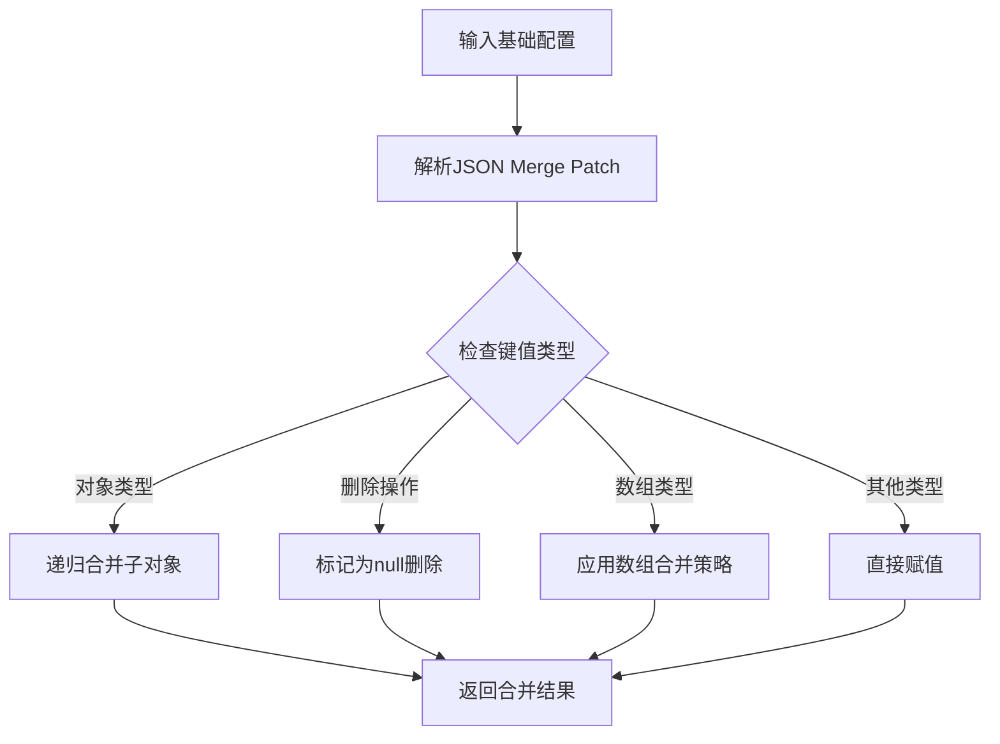
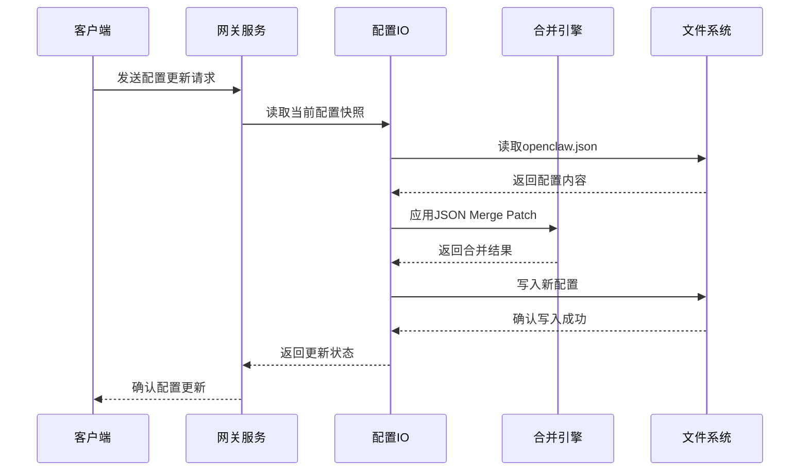
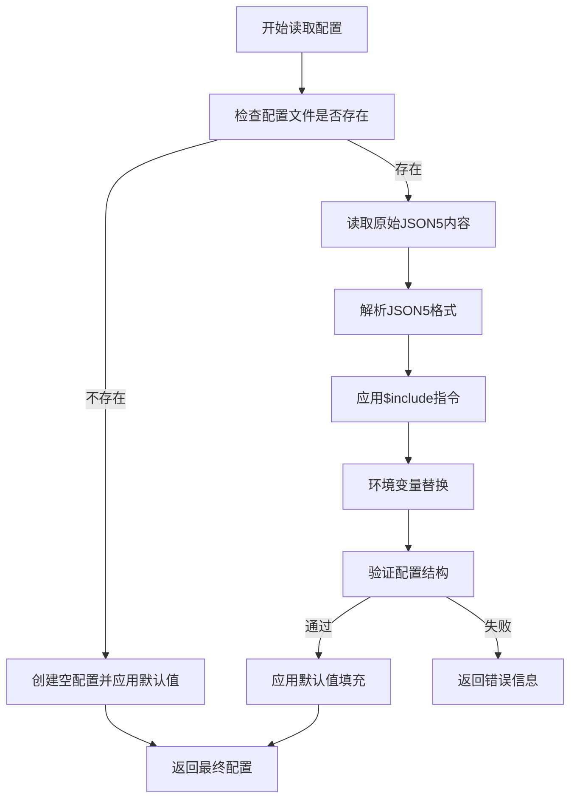
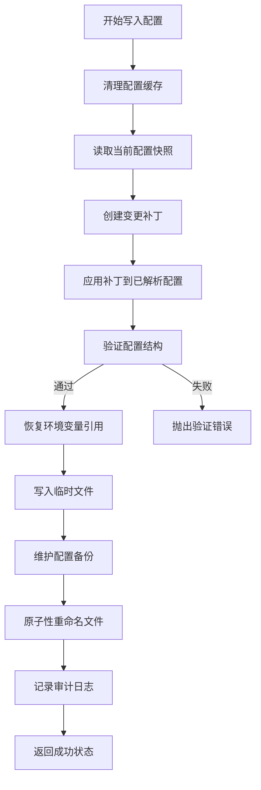
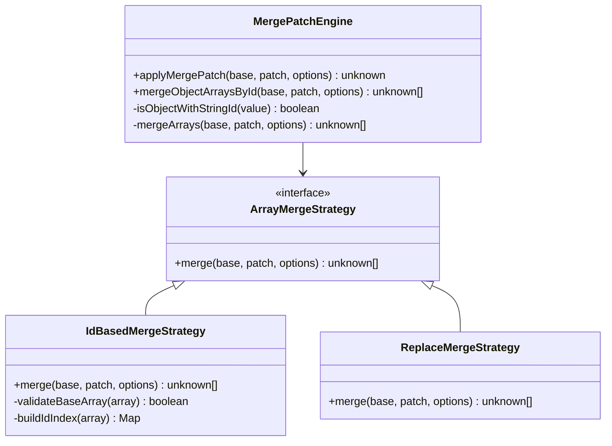
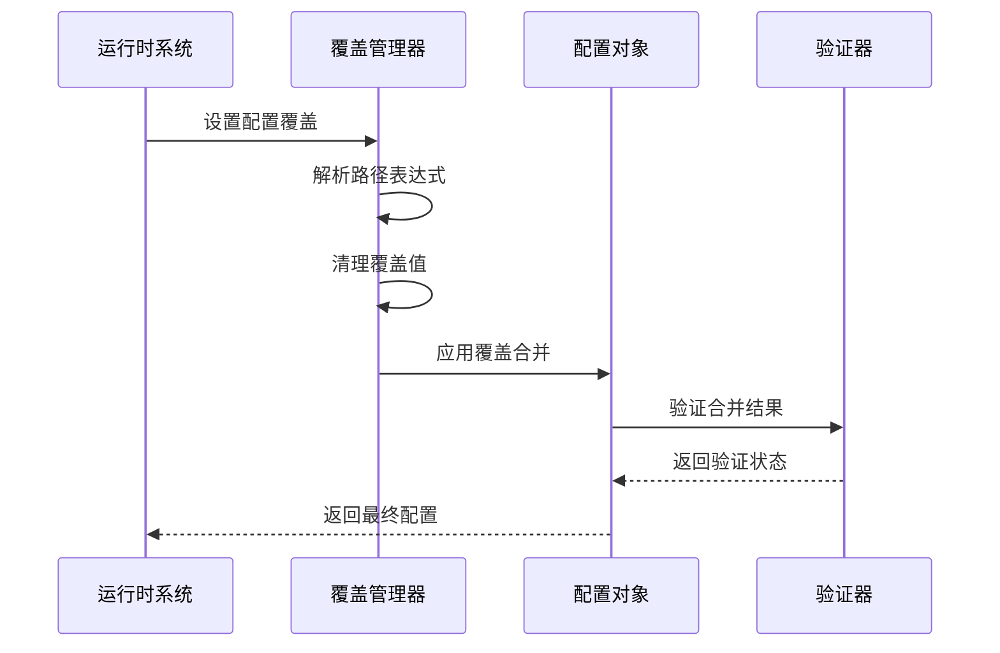
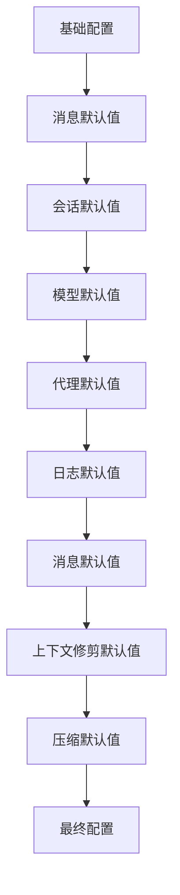
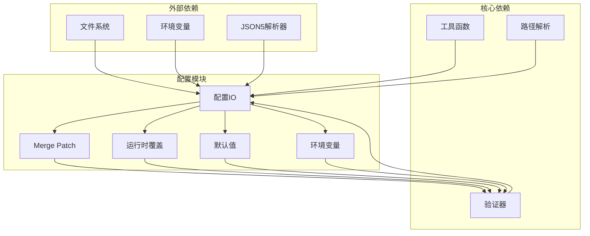
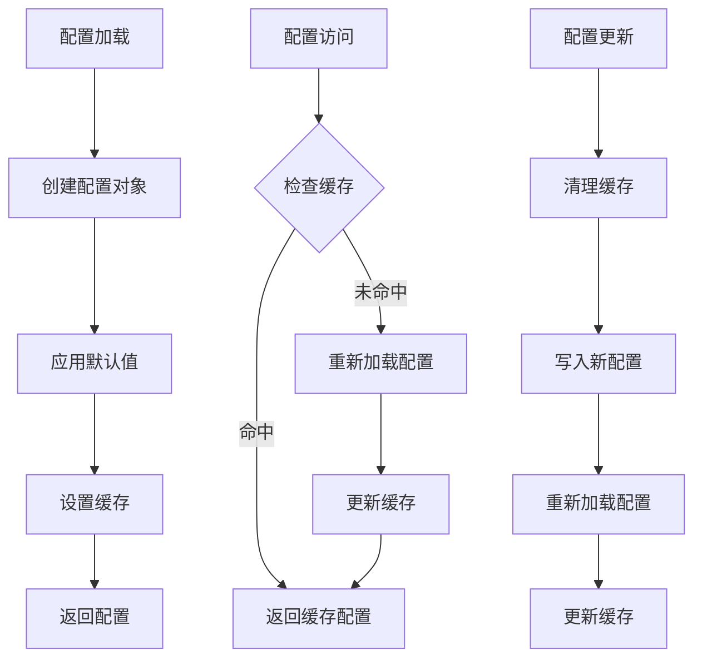
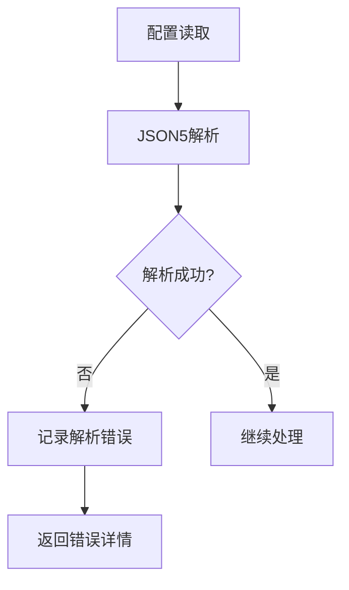

# 配置合并策略

<cite>
**本文档引用的文件**
- [src/config/io.ts](file://src/config/io.ts)
- [src/config/merge-patch.ts](file://src/config/merge-patch.ts)
- [src/config/runtime-overrides.ts](file://src/config/runtime-overrides.ts)
- [src/config/defaults.ts](file://src/config/defaults.ts)
- [src/config/env-substitution.ts](file://src/config/env-substitution.ts)
- [src/config/config.ts](file://src/config/config.ts)
- [src/gateway/server-methods/config.ts](file://src/gateway/server-methods/config.ts)
- [docs/gateway/configuration.md](file://docs/gateway/configuration.md)
- [docs/gateway/configuration-reference.md](file://docs/gateway/configuration-reference.md)
</cite>

## 目录

1. [简介](#简介)
2. [项目结构](#项目结构)
3. [核心组件](#核心组件)
4. [架构概览](#架构概览)
5. [详细组件分析](#详细组件分析)
6. [依赖关系分析](#依赖关系分析)
7. [性能考虑](#性能考虑)
8. [故障排除指南](#故障排除指南)
9. [结论](#结论)

## 简介

配置合并策略是 OpenClaw 系统中的关键机制，负责将多个来源的配置进行合并、优先级处理和最终应用。该系统实现了复杂的配置层次结构，包括默认配置、用户配置和运行时配置的优先级规则，以及配置补丁的应用、配置覆盖和配置继承的实现细节。

本文档深入分析了 OpenClaw 的配置合并机制，提供了完整的架构图、流程图和最佳实践指南，帮助开发者和运维人员理解和使用这一强大的配置管理系统。

## 项目结构

OpenClaw 的配置系统主要分布在以下模块中：

```mermaid
graph TB
subgraph "配置核心模块"
IO[配置输入输出(io.ts)]
MP[Merge Patch(merge-patch.ts)]
RO[运行时覆盖(runtime-overrides.ts)]
DEF[默认值(defaults.ts)]
ES[环境变量(env-substitution.ts)]
end
subgraph "配置接口层"
CFG[配置导出(config.ts)]
GW[网关方法(server-methods/config.ts)]
end
subgraph "文档支持"
DOC1[配置指南(configuration.md)]
DOC2[配置参考(configuration-reference.md)]
end
IO --> MP
IO --> RO
IO --> DEF
IO --> ES
CFG --> IO
GW --> IO
DOC1 --> CFG
DOC2 --> CFG
```

**图表来源**

- [src/config/io.ts:1-1528](file://src/config/io.ts#L1-L1528)
- [src/config/merge-patch.ts:1-98](file://src/config/merge-patch.ts#L1-L98)
- [src/config/runtime-overrides.ts:1-92](file://src/config/runtime-overrides.ts#L1-L92)

**章节来源**

- [src/config/io.ts:1-1528](file://src/config/io.ts#L1-L1528)
- [src/config/config.ts:1-29](file://src/config/config.ts#L1-L29)

## 核心组件

### 配置层次结构

OpenClaw 实现了多层配置合并机制：

1. **默认配置层**：系统内置的安全默认值
2. **用户配置层**：用户在 `openclaw.json` 中定义的配置
3. **运行时配置层**：动态生成或修改的配置
4. **覆盖配置层**：临时性的配置覆盖

### 配置合并算法

系统采用 JSON Merge Patch 规范，结合自定义的数组合并策略：



**图表来源**

- [src/config/merge-patch.ts:62-97](file://src/config/merge-patch.ts#L62-L97)

**章节来源**

- [src/config/merge-patch.ts:1-98](file://src/config/merge-patch.ts#L1-L98)
- [src/config/io.ts:347-380](file://src/config/io.ts#L347-L380)

## 架构概览

OpenClaw 的配置合并架构采用了分层设计，确保配置的正确性和性能：



**图表来源**

- [src/gateway/server-methods/config.ts:335-412](file://src/gateway/server-methods/config.ts#L335-L412)
- [src/config/io.ts:1060-1301](file://src/config/io.ts#L1060-L1301)

**章节来源**

- [src/gateway/server-methods/config.ts:1-500](file://src/gateway/server-methods/config.ts#L1-L500)
- [src/config/io.ts:1435-1528](file://src/config/io.ts#L1435-L1528)

## 详细组件分析

### 配置输入输出模块

配置输入输出模块是整个配置系统的核心，负责处理配置的读取、解析、验证和写入：

#### 配置读取流程



**图表来源**

- [src/config/io.ts:859-1042](file://src/config/io.ts#L859-L1042)

#### 配置写入流程

配置写入过程采用了原子性写入和备份机制：



**图表来源**

- [src/config/io.ts:1060-1301](file://src/config/io.ts#L1060-L1301)

**章节来源**

- [src/config/io.ts:699-1310](file://src/config/io.ts#L699-L1310)

### Merge Patch 引擎

Merge Patch 引擎实现了标准的 JSON Merge Patch 规范，并添加了自定义的数组合并功能：

#### 数组合并策略

系统支持两种数组合并模式：

1. **按ID合并模式**：适用于具有唯一标识符的对象数组
2. **替换模式**：标准的数组替换行为



**图表来源**

- [src/config/merge-patch.ts:62-97](file://src/config/merge-patch.ts#L62-L97)

**章节来源**

- [src/config/merge-patch.ts:1-98](file://src/config/merge-patch.ts#L1-L98)

### 运行时覆盖机制

运行时覆盖机制允许在不修改配置文件的情况下临时修改配置：

#### 覆盖应用流程



**图表来源**

- [src/config/runtime-overrides.ts:54-91](file://src/config/runtime-overrides.ts#L54-L91)

**章节来源**

- [src/config/runtime-overrides.ts:1-92](file://src/config/runtime-overrides.ts#L1-L92)

### 默认值应用系统

默认值应用系统确保配置的完整性和一致性：

#### 默认值应用顺序



**图表来源**

- [src/config/defaults.ts:131-532](file://src/config/defaults.ts#L131-L532)

**章节来源**

- [src/config/defaults.ts:1-537](file://src/config/defaults.ts#L1-L537)

### 环境变量处理

环境变量处理模块提供了灵活的环境变量替换和验证机制：

#### 环境变量替换流程

```mermaid
flowchart TD
A[配置字符串] --> B{检查$符号}
B --> |无|$符号| C[返回原字符串]
B --> |有| D[解析环境变量引用]
D --> E{变量名有效?}
E --> |否| F[抛出解析错误]
E --> |是| G{变量存在?}
G --> |是| H[替换为变量值]
G --> |否| I{回调函数存在?}
I --> |是| J[调用回调函数]
I --> |否| K[抛出缺失错误]
H --> L[返回替换结果]
J --> L
F --> M[错误处理]
K --> M
```

**图表来源**

- [src/config/env-substitution.ts:88-203](file://src/config/env-substitution.ts#L88-L203)

**章节来源**

- [src/config/env-substitution.ts:1-204](file://src/config/env-substitution.ts#L1-L204)

## 依赖关系分析

配置系统的依赖关系体现了清晰的分层架构：



**图表来源**

- [src/config/io.ts:1-100](file://src/config/io.ts#L1-L100)
- [src/config/config.ts:1-29](file://src/config/config.ts#L1-L29)

**章节来源**

- [src/config/config.ts:1-29](file://src/config/config.ts#L1-L29)

## 性能考虑

### 缓存策略

系统实现了多层次的缓存机制以提高性能：

1. **配置缓存**：基于时间的配置对象缓存
2. **路径解析缓存**：配置路径解析结果缓存
3. **验证结果缓存**：配置验证结果缓存

### 内存管理



**图表来源**

- [src/config/io.ts:1315-1460](file://src/config/io.ts#L1315-L1460)

### 性能优化建议

1. **合理设置缓存时间**：根据配置变化频率调整缓存过期时间
2. **批量配置操作**：避免频繁的小规模配置更新
3. **异步处理**：对于大型配置文件使用异步读取和写入
4. **内存监控**：定期监控配置对象的内存使用情况

## 故障排除指南

### 常见配置错误

#### JSON5 解析错误

当配置文件包含语法错误时，系统会返回详细的解析错误信息：



**图表来源**

- [src/config/io.ts:894-913](file://src/config/io.ts#L894-L913)

#### 配置验证失败

配置验证失败时，系统会提供具体的错误位置和修复建议：

**章节来源**

- [src/config/io.ts:956-973](file://src/config/io.ts#L956-L973)

### 调试技巧

1. **启用详细日志**：使用调试模式查看配置处理的详细步骤
2. **检查配置快照**：通过配置快照了解当前配置状态
3. **验证环境变量**：确认环境变量是否正确解析
4. **测试合并补丁**：使用简单的配置补丁测试合并逻辑

## 结论

OpenClaw 的配置合并策略展现了现代配置管理系统的最佳实践。通过多层配置合并、智能的缓存机制和完善的错误处理，系统为用户提供了强大而可靠的配置管理能力。

关键特性包括：

1. **层次化配置管理**：清晰的配置层次结构和优先级规则
2. **灵活的合并策略**：支持多种合并模式和自定义数组处理
3. **高性能设计**：多层缓存和优化的内存管理
4. **完善的错误处理**：详细的错误信息和恢复机制
5. **安全的配置更新**：原子性写入和备份保护

这些特性使得 OpenClaw 的配置系统既适合开发者的高级需求，也满足了普通用户的日常使用场景。通过遵循本文档提供的最佳实践，用户可以充分利用配置合并策略的强大功能，构建稳定可靠的配置管理体系。
