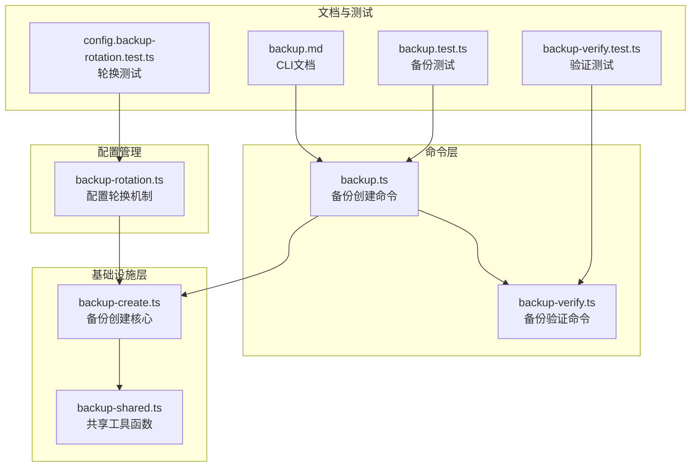
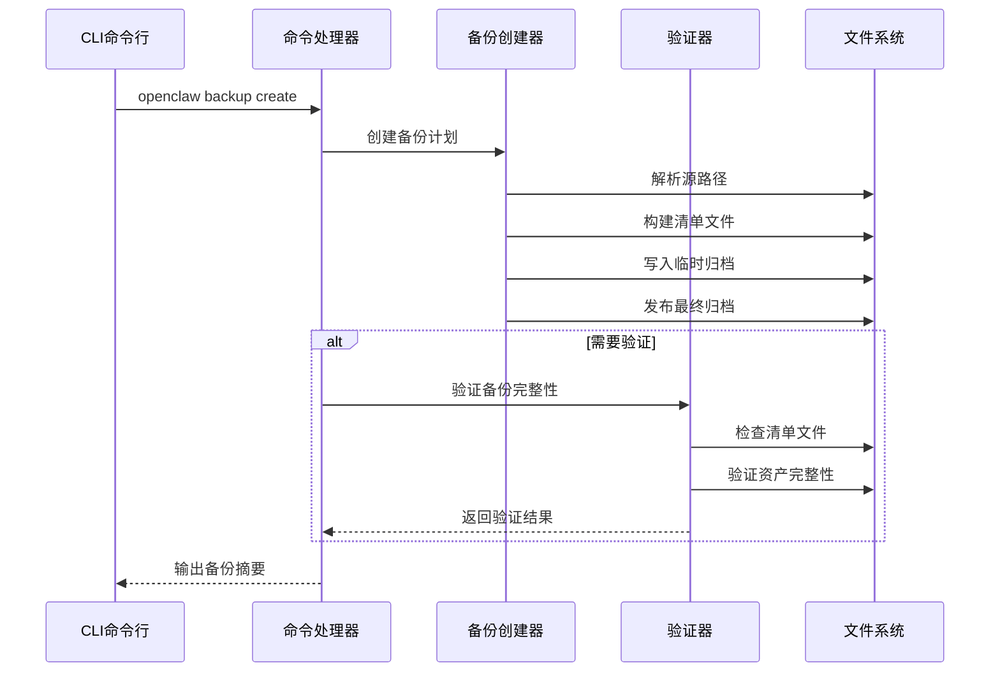
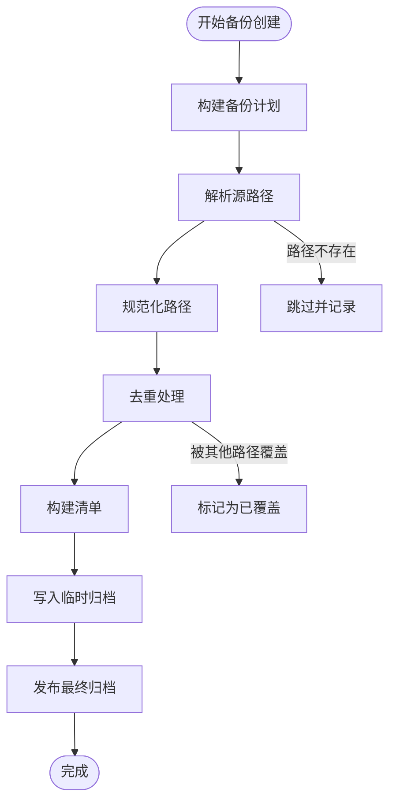
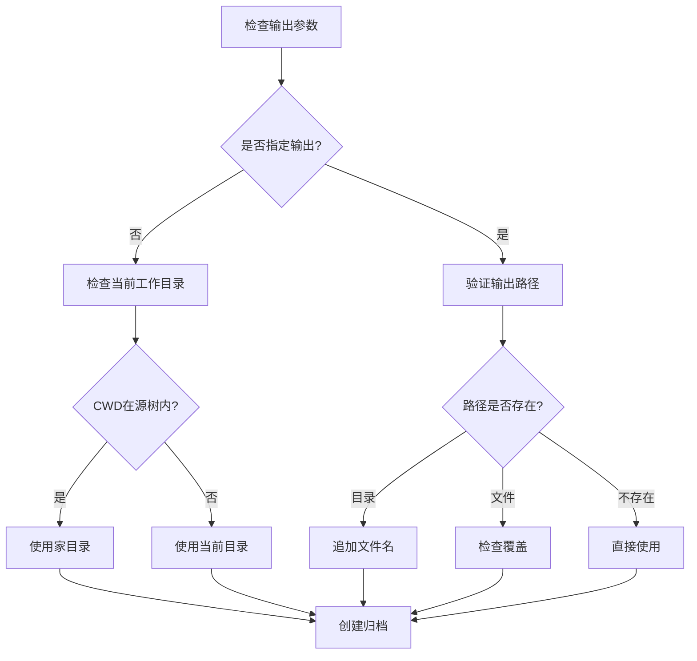
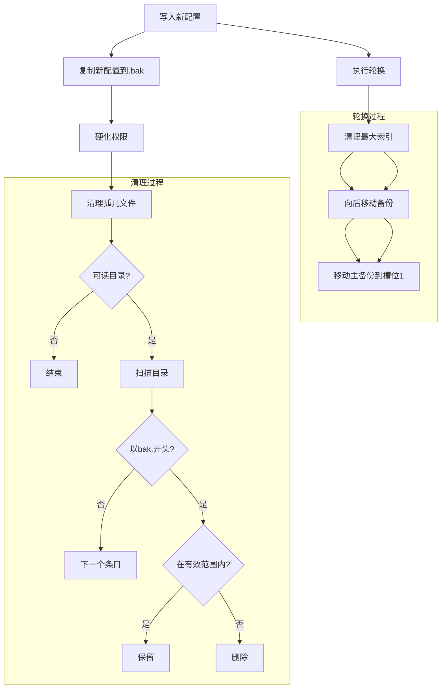
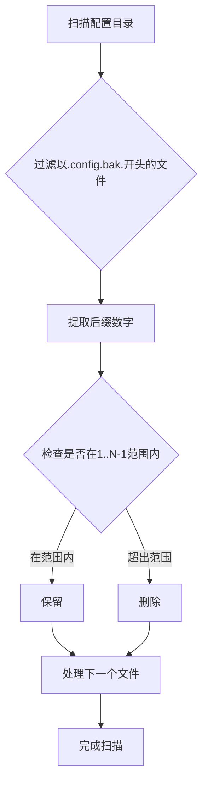
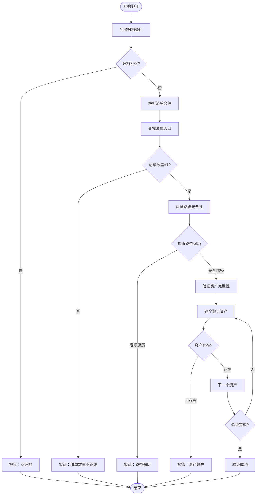
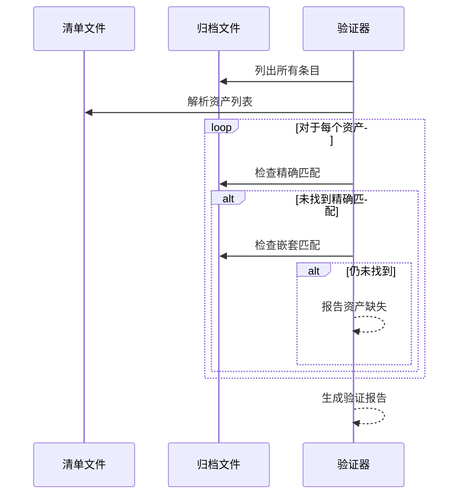
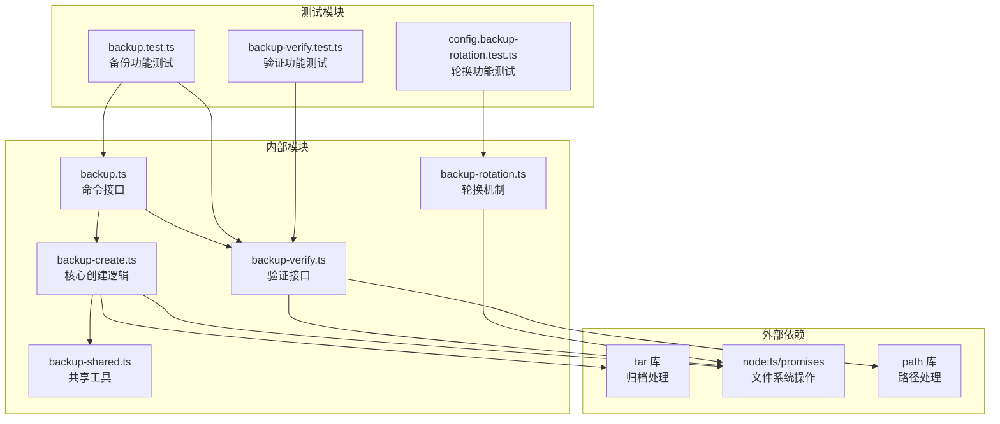
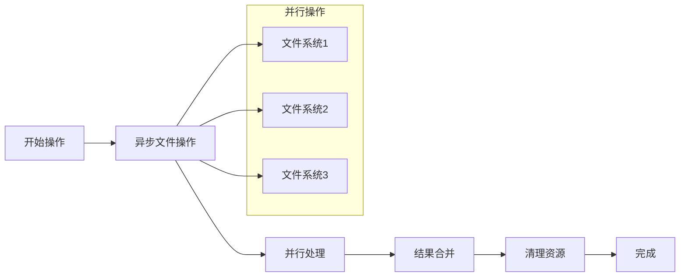

# 配置备份与恢复

<cite>
**本文档引用的文件**
- [src/commands/backup.ts](file://src/commands/backup.ts)
- [src/commands/backup-verify.ts](file://src/commands/backup-verify.ts)
- [src/infra/backup-create.ts](file://src/infra/backup-create.ts)
- [src/commands/backup-shared.ts](file://src/commands/backup-shared.ts)
- [src/config/backup-rotation.ts](file://src/config/backup-rotation.ts)
- [docs/cli/backup.md](file://docs/cli/backup.md)
- [src/commands/backup.test.ts](file://src/commands/backup.test.ts)
- [src/commands/backup-verify.test.ts](file://src/commands/backup-verify.test.ts)
- [src/config/config.backup-rotation.test.ts](file://src/config/config.backup-rotation.test.ts)
</cite>

## 目录

1. [简介](#简介)
2. [项目结构](#项目结构)
3. [核心组件](#核心组件)
4. [架构概览](#架构概览)
5. [详细组件分析](#详细组件分析)
6. [依赖关系分析](#依赖关系分析)
7. [性能考虑](#性能考虑)
8. [故障排除指南](#故障排除指南)
9. [结论](#结论)
10. [附录](#附录)

## 简介

本文件详细阐述了 OpenClaw 项目的配置备份与恢复系统。该系统提供了完整的本地备份归档创建、完整性验证和回滚机制，支持自动轮换的配置备份文件管理，并确保在各种异常情况下都能保持数据完整性。

系统采用多层防护设计：通过自动轮换机制维护配置文件的历史版本，通过完整性验证确保备份文件的正确性，通过回滚机制提供快速的数据恢复能力。所有操作都经过严格的测试覆盖，确保在生产环境中的可靠性。

## 项目结构

OpenClaw 的备份与恢复系统主要由以下模块组成：



**图表来源**

- [src/commands/backup.ts:1-32](file://src/commands/backup.ts#L1-L32)
- [src/infra/backup-create.ts:1-369](file://src/infra/backup-create.ts#L1-L369)
- [src/config/backup-rotation.ts:1-126](file://src/config/backup-rotation.ts#L1-L126)

**章节来源**

- [src/commands/backup.ts:1-32](file://src/commands/backup.ts#L1-L32)
- [src/infra/backup-create.ts:1-369](file://src/infra/backup-create.ts#L1-L369)
- [src/config/backup-rotation.ts:1-126](file://src/config/backup-rotation.ts#L1-L126)

## 核心组件

### 备份创建系统

备份创建系统是整个备份与恢复的核心，负责将配置文件、状态目录、凭据和工作空间等数据打包成压缩归档文件。

**主要特性：**

- 支持完整备份和仅配置备份模式
- 自动路径解析和去重处理
- 完整的输出路径验证
- 硬链接优先的发布策略

### 配置轮换机制

配置轮换机制专门用于管理配置文件的历史版本，采用环形备份策略确保历史版本的有序管理。

**关键特性：**

- 5层深度的环形备份轮换
- 自动权限硬化（owner-only）
- 孤儿文件清理
- 平台兼容性处理

### 备份验证系统

备份验证系统确保备份文件的完整性和正确性，防止损坏或篡改的备份文件被使用。

**验证内容：**

- 清单文件存在性检查
- 路径遍历保护
- 资产完整性验证
- 重复条目检测

**章节来源**

- [src/infra/backup-create.ts:272-369](file://src/infra/backup-create.ts#L272-L369)
- [src/config/backup-rotation.ts:16-125](file://src/config/backup-rotation.ts#L16-L125)
- [src/commands/backup-verify.ts:279-325](file://src/commands/backup-verify.ts#L279-L325)

## 架构概览

OpenClaw 的备份与恢复系统采用分层架构设计，确保各组件职责清晰、耦合度低：



**图表来源**

- [src/commands/backup.ts:11-31](file://src/commands/backup.ts#L11-L31)
- [src/infra/backup-create.ts:272-369](file://src/infra/backup-create.ts#L272-L369)

系统架构的关键优势：

- **模块化设计**：每个组件都有明确的职责边界
- **错误隔离**：失败场景有完善的错误处理机制
- **平台兼容**：针对不同操作系统进行适配
- **性能优化**：采用硬链接和临时文件策略减少I/O开销

## 详细组件分析

### 备份创建器 (Backup Creator)

备份创建器是系统的核心执行组件，负责将选定的数据源打包成标准格式的归档文件。

#### 数据源解析流程



**图表来源**

- [src/commands/backup-shared.ts:106-254](file://src/commands/backup-shared.ts#L106-L254)
- [src/infra/backup-create.ts:272-369](file://src/infra/backup-create.ts#L272-L369)

#### 归档布局设计

备份归档采用标准化的内部布局，确保跨平台兼容性和可解析性：

```
YYYY-MM-DDTHH-mm-ss.sssZ-openclaw-backup/
├── manifest.json           # 备份清单
└── payload/               # 资产存储目录
    ├── posix/             # POSIX路径编码
    │   └── tmp/.openclaw/ # 实际文件内容
    ├── windows/           # Windows路径编码
    │   └── C/            # 驱动器号
    │       └── Users/    # 用户目录
    └── relative/          # 相对路径编码
        └── ./config.json  # 相对路径文件
```

#### 输出路径策略

系统采用智能的输出路径选择策略：



**图表来源**

- [src/infra/backup-create.ts:78-124](file://src/infra/backup-create.ts#L78-L124)

**章节来源**

- [src/infra/backup-create.ts:18-76](file://src/infra/backup-create.ts#L18-L76)
- [src/commands/backup-shared.ts:60-84](file://src/commands/backup-shared.ts#L60-L84)

### 配置轮换机制 (Config Rotation)

配置轮换机制实现了5层深度的环形备份策略，确保配置文件历史版本的有效管理。

#### 轮换算法实现



**图表来源**

- [src/config/backup-rotation.ts:16-125](file://src/config/backup-rotation.ts#L16-L125)

#### 权限硬化策略

配置轮换机制特别关注文件权限的安全性：

| 文件类型                | 目标权限 | 设置原因                       |
| ----------------------- | -------- | ------------------------------ |
| 主备份文件 (.bak)       | 0o600    | 仅所有者可读写，防止未授权访问 |
| 编号备份文件 (.bak.1-N) | 0o600    | 与主备份一致的安全级别         |
| 原始配置文件            | 0o600    | 保持与备份相同的访问控制       |

#### 孤儿文件清理

系统能够识别并清理不符合轮换规则的孤儿备份文件：



**图表来源**

- [src/config/backup-rotation.ts:72-109](file://src/config/backup-rotation.ts#L72-L109)

**章节来源**

- [src/config/backup-rotation.ts:3-62](file://src/config/backup-rotation.ts#L3-L62)
- [src/config/backup-rotation.ts:64-109](file://src/config/backup-rotation.ts#L64-L109)

### 备份验证器 (Backup Verifier)

备份验证器提供了多层次的完整性检查，确保备份文件的可靠性和可用性。

#### 验证流程



**图表来源**

- [src/commands/backup-verify.ts:279-325](file://src/commands/backup-verify.ts#L279-L325)

#### 路径安全验证

验证器实施严格的安全检查，防止路径遍历攻击：

| 检查项目     | 验证规则                            | 防护效果         |
| ------------ | ----------------------------------- | ---------------- |
| 绝对路径检查 | 不允许Windows绝对路径或Unix绝对路径 | 防止目录穿越     |
| 分隔符验证   | 仅允许正斜杠，不允许反斜杠          | 统一路径格式     |
| 路径段检查   | 不允许'.'或'..'段                   | 防止父目录引用   |
| 根目录验证   | 最终路径必须位于归档根目录内        | 确保文件定位正确 |

#### 资产完整性检查

验证器确保清单中声明的所有资产都在归档中存在：



**图表来源**

- [src/commands/backup-verify.ts:223-253](file://src/commands/backup-verify.ts#L223-L253)

**章节来源**

- [src/commands/backup-verify.ts:97-171](file://src/commands/backup-verify.ts#L97-L171)
- [src/commands/backup-verify.ts:223-325](file://src/commands/backup-verify.ts#L223-L325)

## 依赖关系分析

备份与恢复系统的依赖关系呈现清晰的层次结构：



**图表来源**

- [src/commands/backup.ts:1-32](file://src/commands/backup.ts#L1-L32)
- [src/infra/backup-create.ts:1-17](file://src/infra/backup-create.ts#L1-L17)

系统的主要依赖特点：

- **最小外部依赖**：仅依赖标准库和必要的第三方库
- **清晰的接口定义**：所有依赖都通过接口抽象层进行管理
- **可测试性**：所有外部依赖都可以通过模拟进行测试

**章节来源**

- [src/commands/backup.ts:1-9](file://src/commands/backup.ts#L1-L9)
- [src/infra/backup-create.ts:1-17](file://src/infra/backup-create.ts#L1-L17)

## 性能考虑

备份与恢复系统在设计时充分考虑了性能优化：

### I/O 操作优化

1. **临时文件策略**：使用UUID命名的临时文件避免竞态条件
2. **硬链接优先**：在支持的文件系统上优先使用硬链接减少磁盘I/O
3. **流式处理**：使用tar的流式API减少内存占用

### 内存使用优化

1. **增量处理**：只在必要时加载文件内容到内存
2. **批量操作**：合并多个文件系统操作减少系统调用
3. **及时清理**：使用finally块确保临时文件及时清理

### 并发处理

系统支持异步操作，避免阻塞主线程：



## 故障排除指南

### 常见问题及解决方案

#### 备份创建失败

**问题现象：** `Refusing to overwrite existing backup archive`

**可能原因：**

- 目标文件已存在
- 输出路径位于源路径内部

**解决步骤：**

1. 检查输出路径是否已存在
2. 修改输出目录或文件名
3. 确保输出路径不在任何源路径内部

#### 配置轮换异常

**问题现象：** 配置文件权限不正确或轮换失败

**可能原因：**

- 文件系统不支持chmod操作
- 权限设置失败

**解决步骤：**

1. 检查文件系统类型和权限支持
2. 手动设置文件权限为0o600
3. 确认有足够的磁盘空间

#### 备份验证失败

**问题现象：** 验证过程中出现路径遍历或资产缺失错误

**解决步骤：**

1. 检查备份文件是否被意外修改
2. 重新创建备份文件
3. 验证归档完整性

### 调试建议

1. **启用详细日志**：使用`--json`选项获取详细的调试信息
2. **检查系统资源**：确保有足够的磁盘空间和内存
3. **验证文件系统**：确认目标文件系统支持所需的文件操作

**章节来源**

- [src/infra/backup-create.ts:113-124](file://src/infra/backup-create.ts#L113-L124)
- [src/config/backup-rotation.ts:44-62](file://src/config/backup-rotation.ts#L44-L62)
- [src/commands/backup-verify.ts:279-325](file://src/commands/backup-verify.ts#L279-L325)

## 结论

OpenClaw 的配置备份与恢复系统提供了企业级的数据保护能力。通过自动轮换机制、完整性验证和回滚支持，系统确保了配置数据的安全性和可恢复性。

系统的主要优势包括：

- **全面的数据保护**：支持配置文件、状态目录、凭据和工作空间的完整备份
- **强大的验证机制**：多层次的完整性检查确保备份文件的可靠性
- **优雅的错误处理**：完善的错误处理和恢复机制
- **优秀的性能表现**：优化的I/O操作和内存使用策略
- **良好的可维护性**：清晰的架构设计和全面的测试覆盖

该系统为用户提供了可靠的配置数据保护方案，适用于各种规模的部署场景。

## 附录

### CLI 使用参考

| 命令                                   | 功能描述           | 使用示例                                 |
| -------------------------------------- | ------------------ | ---------------------------------------- |
| `openclaw backup create`               | 创建完整备份归档   | `openclaw backup create`                 |
| `openclaw backup create --only-config` | 仅备份配置文件     | `openclaw backup create --only-config`   |
| `openclaw backup create --verify`      | 创建后立即验证     | `openclaw backup create --verify`        |
| `openclaw backup verify <archive>`     | 验证备份文件完整性 | `openclaw backup verify ./backup.tar.gz` |

### 配置选项说明

| 选项                  | 类型   | 默认值   | 描述                           |
| --------------------- | ------ | -------- | ------------------------------ |
| `--output`            | 字符串 | 当前目录 | 指定备份文件输出目录或完整路径 |
| `--dry-run`           | 布尔值 | false    | 预览备份计划但不实际创建       |
| `--include-workspace` | 布尔值 | true     | 包含工作空间目录（默认启用）   |
| `--only-config`       | 布尔值 | false    | 仅备份配置文件                 |
| `--verify`            | 布尔值 | false    | 创建后立即验证备份文件         |
| `--json`              | 布尔值 | false    | 以JSON格式输出结果             |

### 监控和维护建议

1. **定期检查**：定期运行备份验证命令确保备份文件完整性
2. **容量监控**：监控备份文件大小增长趋势
3. **存储策略**：制定备份文件的长期保存和轮换策略
4. **测试恢复**：定期进行恢复测试验证备份文件可用性
