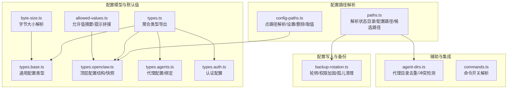
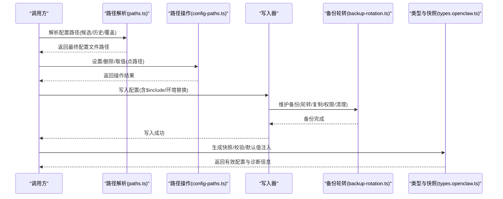
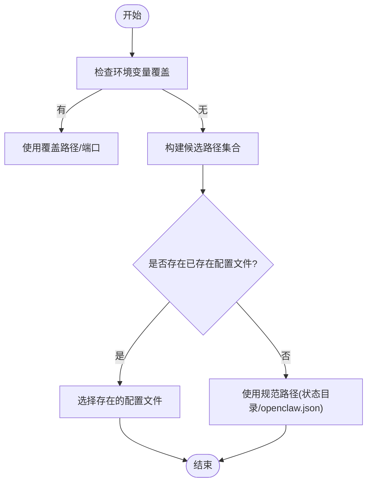
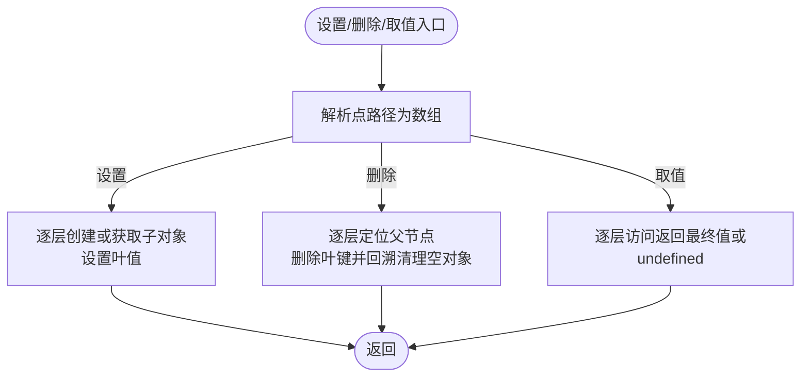
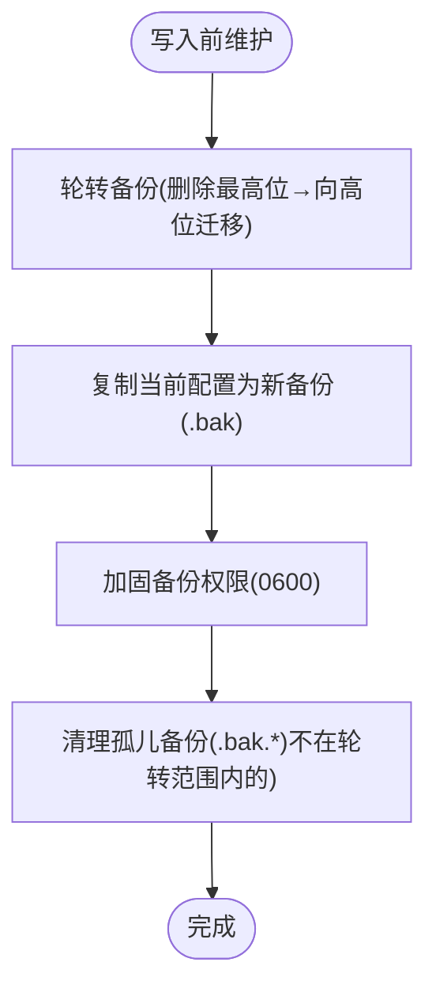
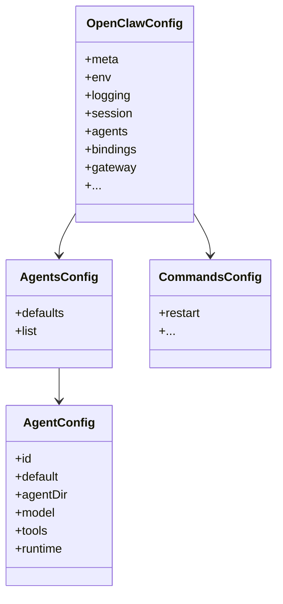
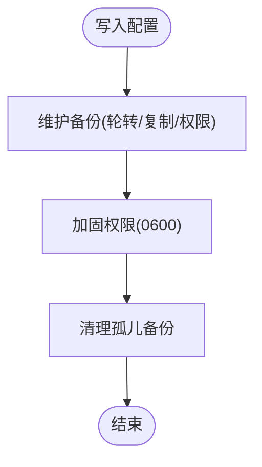
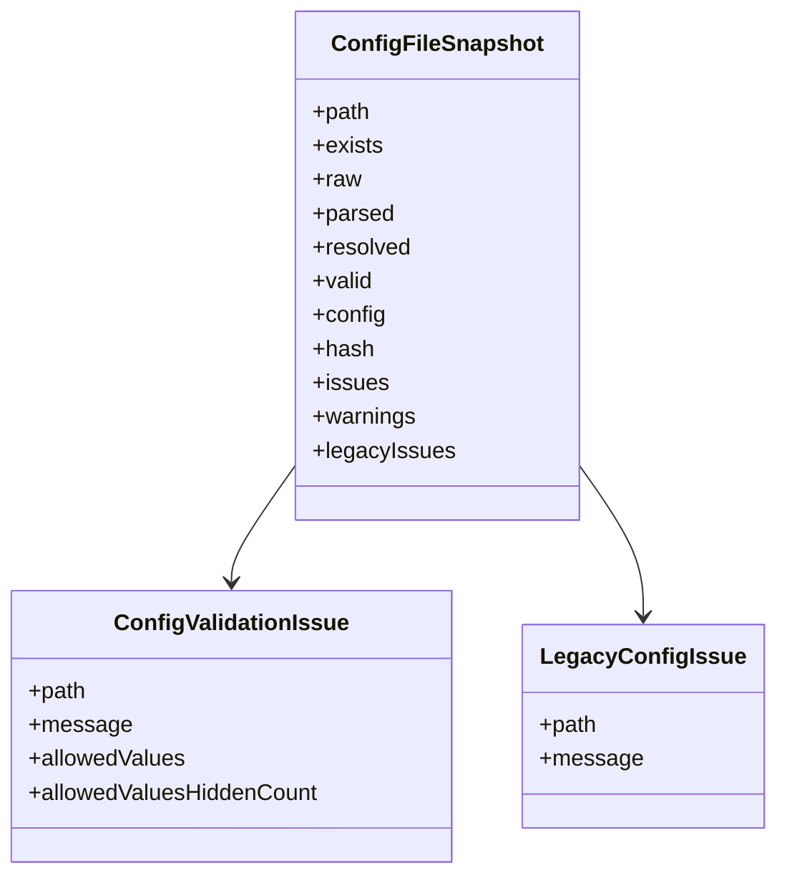
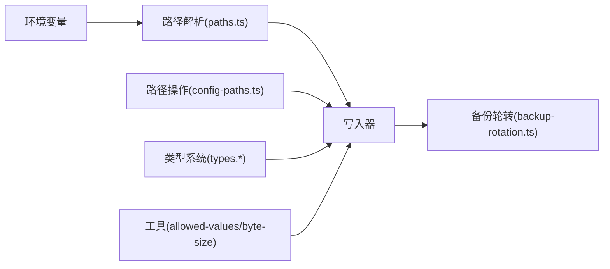

# 配置文件输入输出

<cite>
**本文引用的文件**
- [src/config/paths.ts](file://src/config/paths.ts)
- [src/config/config-paths.ts](file://src/config/config-paths.ts)
- [src/config/backup-rotation.ts](file://src/config/backup-rotation.ts)
- [src/config/agent-dirs.ts](file://src/config/agent-dirs.ts)
- [src/config/allowed-values.ts](file://src/config/allowed-values.ts)
- [src/config/byte-size.ts](file://src/config/byte-size.ts)
- [src/config/types.ts](file://src/config/types.ts)
- [src/config/types.base.ts](file://src/config/types.base.ts)
- [src/config/types.openclaw.ts](file://src/config/types.openclaw.ts)
- [src/config/types.agents.ts](file://src/config/types.agents.ts)
- [src/config/types.auth.ts](file://src/config/types.auth.ts)
- [src/config/commands.ts](file://src/config/commands.ts)
</cite>

## 目录

1. [简介](#简介)
2. [项目结构](#项目结构)
3. [核心组件](#核心组件)
4. [架构总览](#架构总览)
5. [详细组件分析](#详细组件分析)
6. [依赖关系分析](#依赖关系分析)
7. [性能考量](#性能考量)
8. [故障排除指南](#故障排除指南)
9. [结论](#结论)
10. [附录](#附录)

## 简介

本文件系统性阐述配置文件的输入输出与序列化机制，覆盖以下主题：

- 文件路径解析：状态目录、配置文件候选路径、历史兼容与优先级
- 环境变量替换：运行时变量注入与安全限制
- 配置备份与恢复：轮转策略、权限加固、孤儿文件清理
- 配置格式与默认值：JSON/JSON5、默认值注入时机与继承规则
- 安全性与权限管理：备份文件权限、敏感信息提示
- 错误处理与可诊断性：校验问题、遗留问题、快照与哈希
- 实用示例与排障：常见场景与定位方法

## 项目结构

配置相关能力主要集中在 src/config 目录，围绕“路径解析—配置读取—写入与备份—序列化—校验与默认值”形成闭环。

图表来源

- [src/config/paths.ts:118-194](file://src/config/paths.ts#L118-L194)
- [src/config/config-paths.ts:6-82](file://src/config/config-paths.ts#L6-L82)
- [src/config/backup-rotation.ts:16-125](file://src/config/backup-rotation.ts#L16-L125)
- [src/config/types.ts:1-36](file://src/config/types.ts#L1-L36)
- [src/config/types.base.ts:105-166](file://src/config/types.base.ts#L105-L166)
- [src/config/types.openclaw.ts:31-155](file://src/config/types.openclaw.ts#L31-L155)
- [src/config/types.agents.ts:61-96](file://src/config/types.agents.ts#L61-L96)
- [src/config/types.auth.ts:13-30](file://src/config/types.auth.ts#L13-L30)
- [src/config/allowed-values.ts:54-99](file://src/config/allowed-values.ts#L54-L99)
- [src/config/byte-size.ts:7-30](file://src/config/byte-size.ts#L7-L30)
- [src/config/agent-dirs.ts:80-113](file://src/config/agent-dirs.ts#L80-L113)
- [src/config/commands.ts:24-91](file://src/config/commands.ts#L24-L91)

章节来源

- [src/config/paths.ts:118-194](file://src/config/paths.ts#L118-L194)
- [src/config/backup-rotation.ts:16-125](file://src/config/backup-rotation.ts#L16-L125)
- [src/config/types.openclaw.ts:31-155](file://src/config/types.openclaw.ts#L31-L155)

## 核心组件

- 路径解析器：负责状态目录、配置文件路径、候选路径与历史兼容解析，支持环境变量覆盖与用户路径展开。
- 配置路径操作：对嵌套对象进行点语法路径的设置、删除、取值，保障写入/修改的原子性与安全性。
- 备份轮转：在写入前执行轮转、创建新备份、加固权限、清理孤儿备份，确保可恢复性与安全性。
- 类型与默认值：通过类型定义约束配置结构，配合运行时默认值注入与校验，保证配置一致性与可诊断性。
- 辅助工具：允许值摘要、字节大小解析、代理目录去重、命令开关解析等，提升可用性与安全性。

章节来源

- [src/config/paths.ts:118-194](file://src/config/paths.ts#L118-L194)
- [src/config/config-paths.ts:31-82](file://src/config/config-paths.ts#L31-L82)
- [src/config/backup-rotation.ts:16-125](file://src/config/backup-rotation.ts#L16-L125)
- [src/config/types.base.ts:105-166](file://src/config/types.base.ts#L105-L166)
- [src/config/allowed-values.ts:54-99](file://src/config/allowed-values.ts#L54-L99)
- [src/config/byte-size.ts:7-30](file://src/config/byte-size.ts#L7-L30)
- [src/config/agent-dirs.ts:80-113](file://src/config/agent-dirs.ts#L80-L113)
- [src/config/commands.ts:24-91](file://src/config/commands.ts#L24-L91)

## 架构总览

下图展示从“解析配置路径”到“写入并维护备份”的端到端流程，以及与类型系统、路径操作、备份轮转的关系。

图表来源

- [src/config/paths.ts:118-194](file://src/config/paths.ts#L118-L194)
- [src/config/config-paths.ts:31-82](file://src/config/config-paths.ts#L31-L82)
- [src/config/backup-rotation.ts:115-125](file://src/config/backup-rotation.ts#L115-L125)
- [src/config/types.openclaw.ts:137-155](file://src/config/types.openclaw.ts#L137-L155)

## 详细组件分析

### 路径解析与配置文件定位

- 状态目录解析：支持 OPENCLAW_STATE_DIR、历史目录兼容（.clawdbot/.moldbot/.moltbot）与测试模式快速路径。
- 配置文件路径：默认位于状态目录下的 openclaw.json；支持 OPENCLAW_CONFIG_PATH 显式覆盖；候选路径包含历史文件名以提升兼容性。
- 用户路径展开：支持 ~ 前缀与环境变量参与的绝对路径解析。
- 端口解析：网关端口优先取环境变量，其次取配置项，最后回退默认值。

图表来源

- [src/config/paths.ts:118-194](file://src/config/paths.ts#L118-L194)

章节来源

- [src/config/paths.ts:60-89](file://src/config/paths.ts#L60-L89)
- [src/config/paths.ts:118-194](file://src/config/paths.ts#L118-L194)
- [src/config/paths.ts:266-284](file://src/config/paths.ts#L266-L284)

### 配置路径操作（点路径）

- 支持对任意嵌套对象进行点语法路径的设置、删除与取值。
- 删除时会回溯清理空对象，避免产生残留空节点。
- 提供严格键名校验，防止原型污染与非法键段。

图表来源

- [src/config/config-paths.ts:6-82](file://src/config/config-paths.ts#L6-L82)

章节来源

- [src/config/config-paths.ts:31-82](file://src/config/config-paths.ts#L31-L82)

### 配置备份轮转与恢复

- 轮转策略：固定数量环形备份，最高索引文件先删除，其余依次向高位迁移。
- 权限加固：复制备份后对所有 .bak 及编号备份执行仅属主可读权限，降低泄露风险。
- 孤儿清理：扫描目录中匹配模式的多余备份并删除，避免历史中断写入导致的垃圾堆积。
- 维护顺序：轮转→复制→加固→清理，确保一致性与可恢复性。

图表来源

- [src/config/backup-rotation.ts:16-125](file://src/config/backup-rotation.ts#L16-L125)

章节来源

- [src/config/backup-rotation.ts:16-125](file://src/config/backup-rotation.ts#L16-L125)

### 配置格式、默认值与继承规则

- 格式：配置文件为 JSON/JSON5，支持 $include 引入与 ${ENV} 环境变量替换。
- 默认值注入：在解析阶段应用运行时默认值，但不写回配置文件，以避免泄漏默认值。
- 继承与覆盖：全局设置可被通道/代理级别设置覆盖；命令开关解析遵循“显式覆盖优先，否则自动推断”。

图表来源

- [src/config/types.openclaw.ts:31-123](file://src/config/types.openclaw.ts#L31-L123)
- [src/config/types.agents.ts:61-96](file://src/config/types.agents.ts#L61-L96)
- [src/config/commands.ts:24-91](file://src/config/commands.ts#L24-L91)

章节来源

- [src/config/types.openclaw.ts:31-155](file://src/config/types.openclaw.ts#L31-L155)
- [src/config/types.base.ts:105-166](file://src/config/types.base.ts#L105-L166)
- [src/config/commands.ts:24-91](file://src/config/commands.ts#L24-L91)

### 安全性与权限管理

- 备份文件权限：复制后统一设置为仅属主可读，减少敏感信息暴露面。
- 敏感信息提示：允许值摘要与提示拼接，避免在错误消息中重复列出相同内容。
- 字节大小解析：对非负字节大小字符串进行安全解析，拒绝无效输入。
- 代理目录去重：检测多代理共享 agentDir 的冲突，避免认证/会话状态碰撞。

图表来源

- [src/config/backup-rotation.ts:44-109](file://src/config/backup-rotation.ts#L44-L109)
- [src/config/allowed-values.ts:54-99](file://src/config/allowed-values.ts#L54-L99)
- [src/config/byte-size.ts:7-30](file://src/config/byte-size.ts#L7-L30)
- [src/config/agent-dirs.ts:80-113](file://src/config/agent-dirs.ts#L80-L113)

章节来源

- [src/config/backup-rotation.ts:44-109](file://src/config/backup-rotation.ts#L44-L109)
- [src/config/allowed-values.ts:54-99](file://src/config/allowed-values.ts#L54-L99)
- [src/config/byte-size.ts:7-30](file://src/config/byte-size.ts#L7-L30)
- [src/config/agent-dirs.ts:80-113](file://src/config/agent-dirs.ts#L80-L113)

### 错误处理与可诊断性

- 配置快照：记录原始文本、解析结果、已解析但未注入默认值的配置、有效性、问题与警告、遗留问题等。
- 校验问题：支持将允许值列表附加到错误消息，帮助用户快速定位可选值。
- 遗留问题：对历史字段与兼容性问题单独标注，便于逐步迁移。

图表来源

- [src/config/types.openclaw.ts:137-155](file://src/config/types.openclaw.ts#L137-L155)

章节来源

- [src/config/types.openclaw.ts:137-155](file://src/config/types.openclaw.ts#L137-L155)

## 依赖关系分析

- 路径解析依赖环境变量与用户路径展开，为后续写入与备份提供稳定锚点。
- 配置路径操作与类型系统解耦，通过点路径实现对任意配置片段的原子操作。
- 备份轮转独立于写入逻辑，通过接口抽象适配不同平台文件系统行为。
- 默认值注入与校验在写入后进行，避免污染原始配置文件。

图表来源

- [src/config/paths.ts:118-194](file://src/config/paths.ts#L118-L194)
- [src/config/config-paths.ts:31-82](file://src/config/config-paths.ts#L31-L82)
- [src/config/backup-rotation.ts:16-125](file://src/config/backup-rotation.ts#L16-L125)
- [src/config/types.openclaw.ts:31-155](file://src/config/types.openclaw.ts#L31-L155)
- [src/config/allowed-values.ts:54-99](file://src/config/allowed-values.ts#L54-L99)
- [src/config/byte-size.ts:7-30](file://src/config/byte-size.ts#L7-L30)

章节来源

- [src/config/paths.ts:118-194](file://src/config/paths.ts#L118-L194)
- [src/config/config-paths.ts:31-82](file://src/config/config-paths.ts#L31-L82)
- [src/config/backup-rotation.ts:16-125](file://src/config/backup-rotation.ts#L16-L125)
- [src/config/types.openclaw.ts:31-155](file://src/config/types.openclaw.ts#L31-L155)
- [src/config/allowed-values.ts:54-99](file://src/config/allowed-values.ts#L54-L99)
- [src/config/byte-size.ts:7-30](file://src/config/byte-size.ts#L7-L30)

## 性能考量

- 路径解析与候选遍历：候选路径数量有限且为常数级，开销可忽略。
- 备份轮转：涉及多次文件系统操作，建议在批量写入时合并为一次维护周期。
- 允许值摘要：去重与截断在小规模集合上开销极低，适合频繁显示。
- 字节大小解析：仅在解析配置时触发，避免在热路径重复计算。

## 故障排除指南

- 找不到配置文件
  - 检查 OPENCLAW_CONFIG_PATH 是否正确覆盖；确认候选路径是否存在。
  - 若状态目录被覆盖，确认 OPENCLAW_STATE_DIR 下存在 openclaw.json 或历史文件名。
- 写入失败或权限问题
  - 确认目标路径可写；备份轮转可能因权限不足而部分失败，检查 .bak 权限是否为 0600。
- 多代理冲突
  - 使用代理目录去重检测，避免多个代理共享 agentDir 导致认证/会话冲突。
- 命令开关未生效
  - 检查 provider 级别与全局级别的显式覆盖；自动推断仅在未显式指定时启用。
- 允许值提示缺失
  - 确保错误消息未包含“允许值”字样；系统会在必要时追加允许值摘要。

章节来源

- [src/config/paths.ts:118-194](file://src/config/paths.ts#L118-L194)
- [src/config/backup-rotation.ts:44-109](file://src/config/backup-rotation.ts#L44-L109)
- [src/config/agent-dirs.ts:80-113](file://src/config/agent-dirs.ts#L80-L113)
- [src/config/commands.ts:24-91](file://src/config/commands.ts#L24-L91)
- [src/config/allowed-values.ts:54-99](file://src/config/allowed-values.ts#L54-L99)

## 结论

该配置系统通过清晰的路径解析、稳健的备份轮转、严格的类型与默认值注入，以及完善的错误与安全策略，实现了高可靠、可诊断、易维护的配置输入输出能力。建议在生产环境中：

- 明确覆盖策略，避免多代理共享 agentDir；
- 在批量变更配置时合并备份维护周期；
- 对敏感信息进行最小化暴露，确保备份权限符合最小权限原则；
- 利用快照与诊断信息快速定位配置问题。

## 附录

- 实用示例（步骤说明）
  - 读取配置：解析配置路径 → 读取文件 → 进行 $include 与环境变量替换 → 应用运行时默认值 → 生成快照。
  - 修改配置：解析点路径 → 设置/删除/取值 → 写入前维护备份 → 写入新配置 → 重新生成快照。
  - 恢复配置：从最近的 .bak 或编号备份复制回 openclaw.json，必要时手动加固权限。
- 关键接口参考
  - 路径解析：[src/config/paths.ts:118-194](file://src/config/paths.ts#L118-L194)
  - 点路径操作：[src/config/config-paths.ts:31-82](file://src/config/config-paths.ts#L31-L82)
  - 备份维护：[src/config/backup-rotation.ts:115-125](file://src/config/backup-rotation.ts#L115-L125)
  - 类型与快照：[src/config/types.openclaw.ts:31-155](file://src/config/types.openclaw.ts#L31-L155)
  - 允许值摘要：[src/config/allowed-values.ts:54-99](file://src/config/allowed-values.ts#L54-L99)
  - 字节大小解析：[src/config/byte-size.ts:7-30](file://src/config/byte-size.ts#L7-L30)
  - 代理目录去重：[src/config/agent-dirs.ts:80-113](file://src/config/agent-dirs.ts#L80-L113)
  - 命令开关解析：[src/config/commands.ts:24-91](file://src/config/commands.ts#L24-L91)
