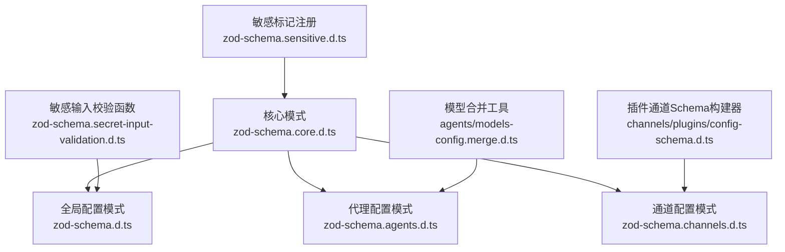
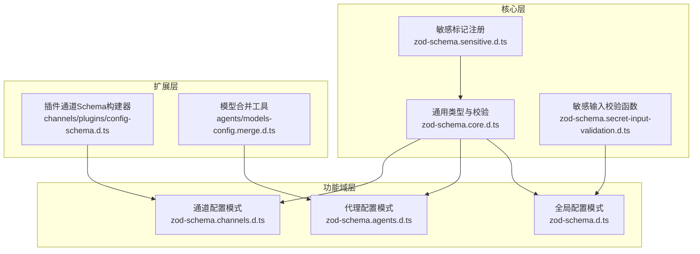
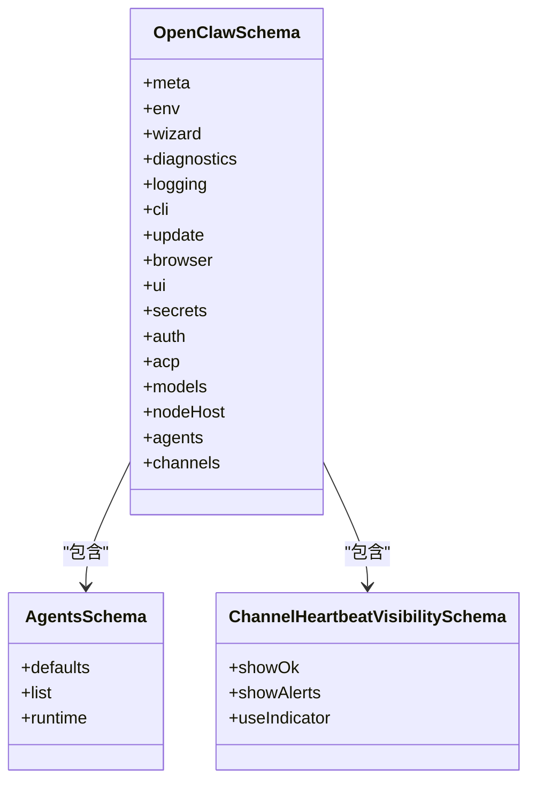
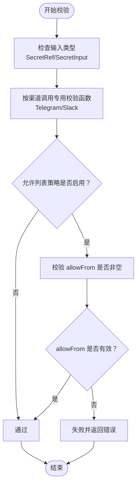
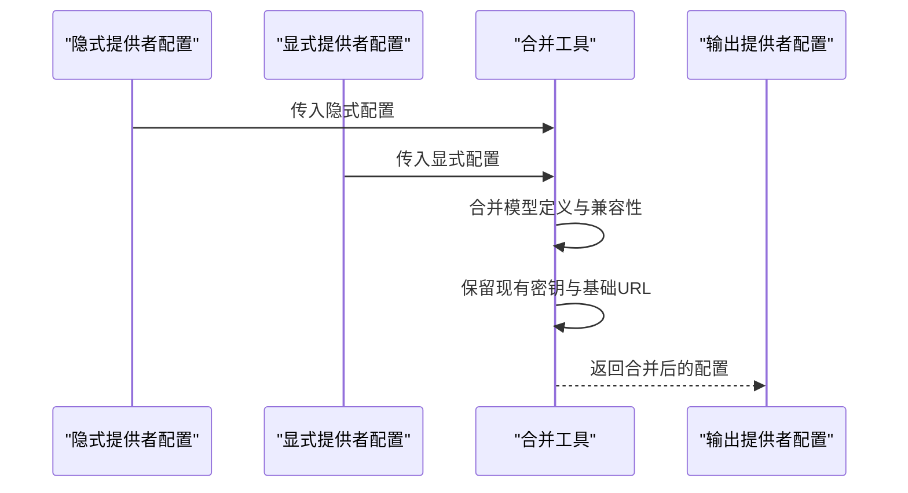
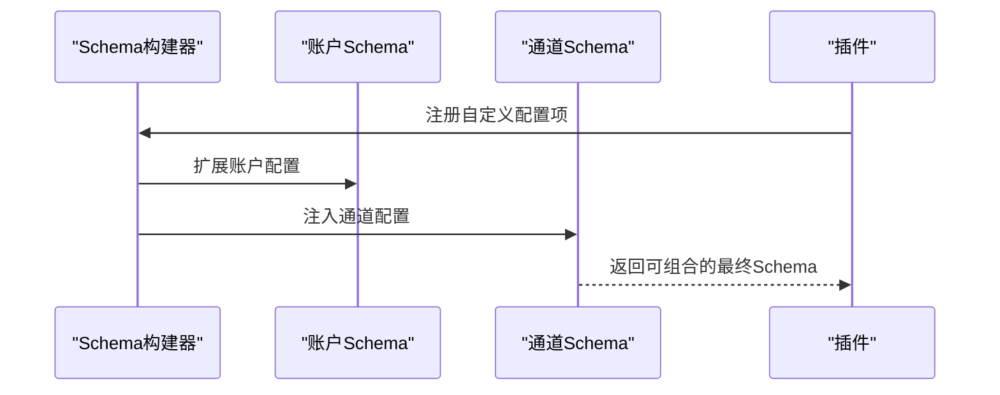
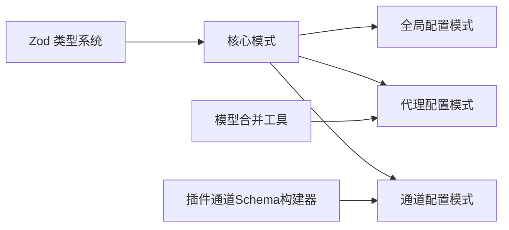

# 配置模式定义

<cite>
**本文档引用的文件**
- [zod-schema.d.ts](file://apps/electron/release/mac/OpenClaw.app/Contents/Resources/openclaw/dist/plugin-sdk/config/zod-schema.d.ts)
- [zod-schema.core.d.ts](file://apps/electron/release/mac/OpenClaw.app/Contents/Resources/openclaw/dist/plugin-sdk/config/zod-schema.core.d.ts)
- [zod-schema.agents.d.ts](file://apps/electron/release/mac/OpenClaw.app/Contents/Resources/openclaw/dist/plugin-sdk/config/zod-schema.agents.d.ts)
- [zod-schema.channels.d.ts](file://apps/electron/release/mac/OpenClaw.app/Contents/Resources/openclaw/dist/plugin-sdk/config/zod-schema.channels.d.ts)
- [zod-schema.sensitive.d.ts](file://apps/electron/release/mac/OpenClaw.app/Contents/Resources/openclaw/dist/plugin-sdk/config/zod-schema.sensitive.d.ts)
- [zod-schema.secret-input-validation.d.ts](file://apps/electron/release/mac/OpenClaw.app/Contents/Resources/openclaw/dist/plugin-sdk/config/zod-schema.secret-input-validation.d.ts)
- [config-schema.d.ts](file://apps/electron/release/mac/OpenClaw.app/Contents/Resources/openclaw/dist/plugin-sdk/channels/plugins/config-schema.d.ts)
- [models-config.merge.d.ts](file://apps/electron/release/mac/OpenClaw.app/Contents/Resources/openclaw/dist/plugin-sdk/agents/models-config.merge.d.ts)
</cite>

## 目录

1. [简介](#简介)
2. [项目结构](#项目结构)
3. [核心组件](#核心组件)
4. [架构总览](#架构总览)
5. [详细组件分析](#详细组件分析)
6. [依赖关系分析](#依赖关系分析)
7. [性能考量](#性能考量)
8. [故障排除指南](#故障排除指南)
9. [结论](#结论)
10. [附录](#附录)

## 简介

本文件系统性阐述 OpenClaw 的配置模式定义与实现，围绕 Zod 模式定义、配置验证机制、模式合并策略展开，覆盖配置模式的构建流程、插件与通道的模式扩展、UI 提示系统以及敏感信息处理。同时说明模式查找、路径解析与配置补丁的应用机制，并给出配置模式开发的最佳实践与扩展指南。

## 项目结构

OpenClaw 的配置模式体系以 Zod Schema 为核心，按功能域拆分多个子模式文件，形成“核心基础 + 功能域扩展”的层次化结构：

- 核心模式：定义通用类型、敏感标记与通用校验规则（如 SecretRef、模型兼容性等）
- 功能域模式：按模块划分（如 agents、channels、models 等），描述具体配置项
- 插件与通道扩展：通过可组合的 Schema 构建器，支持插件对通道配置进行扩展
- 敏感信息与校验：内置敏感标记与输入校验函数，确保安全合规

图表来源

- [zod-schema.core.d.ts:1-962](file://apps/electron/release/mac/OpenClaw.app/Contents/Resources/openclaw/dist/plugin-sdk/config/zod-schema.core.d.ts#L1-L962)
- [zod-schema.d.ts:1-4934](file://apps/electron/release/mac/OpenClaw.app/Contents/Resources/openclaw/dist/plugin-sdk/config/zod-schema.d.ts#L1-L4934)
- [zod-schema.agents.d.ts:1-661](file://apps/electron/release/mac/OpenClaw.app/Contents/Resources/openclaw/dist/plugin-sdk/config/zod-schema.agents.d.ts#L1-L661)
- [zod-schema.channels.d.ts:1-7](file://apps/electron/release/mac/OpenClaw.app/Contents/Resources/openclaw/dist/plugin-sdk/config/zod-schema.channels.d.ts#L1-L7)
- [config-schema.d.ts:1-21](file://apps/electron/release/mac/OpenClaw.app/Contents/Resources/openclaw/dist/plugin-sdk/channels/plugins/config-schema.d.ts#L1-L21)
- [models-config.merge.d.ts:1-18](file://apps/electron/release/mac/OpenClaw.app/Contents/Resources/openclaw/dist/plugin-sdk/agents/models-config.merge.d.ts#L1-L18)

章节来源

- [zod-schema.core.d.ts:1-962](file://apps/electron/release/mac/OpenClaw.app/Contents/Resources/openclaw/dist/plugin-sdk/config/zod-schema.core.d.ts#L1-L962)
- [zod-schema.d.ts:1-4934](file://apps/electron/release/mac/OpenClaw.app/Contents/Resources/openclaw/dist/plugin-sdk/config/zod-schema.d.ts#L1-L4934)
- [zod-schema.agents.d.ts:1-661](file://apps/electron/release/mac/OpenClaw.app/Contents/Resources/openclaw/dist/plugin-sdk/config/zod-schema.agents.d.ts#L1-L661)
- [zod-schema.channels.d.ts:1-7](file://apps/electron/release/mac/OpenClaw.app/Contents/Resources/openclaw/dist/plugin-sdk/config/zod-schema.channels.d.ts#L1-L7)
- [config-schema.d.ts:1-21](file://apps/electron/release/mac/OpenClaw.app/Contents/Resources/openclaw/dist/plugin-sdk/channels/plugins/config-schema.d.ts#L1-L21)
- [models-config.merge.d.ts:1-18](file://apps/electron/release/mac/OpenClaw.app/Contents/Resources/openclaw/dist/plugin-sdk/agents/models-config.merge.d.ts#L1-L18)

## 核心组件

- Zod 模式定义：以强类型方式描述配置结构，支持嵌套对象、数组、枚举与可选字段，确保配置在编译期与运行期均具备明确的数据契约
- 敏感信息标记与处理：通过敏感标记注册表与专用 Schema，标识并隔离敏感字段，结合日志脱敏策略降低泄露风险
- 通用校验与约束：提供 Refinement 函数与条件校验，确保配置在逻辑层面满足业务约束（如允许列表非空、特定渠道密钥要求等）
- 模型配置合并：针对模型提供者配置，提供隐式与显式合并策略，保留已有密钥与基础 URL，避免重复输入与误覆盖
- 插件与通道扩展：通过 Schema 构建器，允许插件在不修改核心 Schema 的前提下，动态扩展通道配置项

章节来源

- [zod-schema.core.d.ts:1-962](file://apps/electron/release/mac/OpenClaw.app/Contents/Resources/openclaw/dist/plugin-sdk/config/zod-schema.core.d.ts#L1-L962)
- [zod-schema.sensitive.d.ts:1-3](file://apps/electron/release/mac/OpenClaw.app/Contents/Resources/openclaw/dist/plugin-sdk/config/zod-schema.sensitive.d.ts#L1-L3)
- [zod-schema.secret-input-validation.d.ts:1-25](file://apps/electron/release/mac/OpenClaw.app/Contents/Resources/openclaw/dist/plugin-sdk/config/zod-schema.secret-input-validation.d.ts#L1-L25)
- [models-config.merge.d.ts:1-18](file://apps/electron/release/mac/OpenClaw.app/Contents/Resources/openclaw/dist/plugin-sdk/agents/models-config.merge.d.ts#L1-L18)
- [config-schema.d.ts:1-21](file://apps/electron/release/mac/OpenClaw.app/Contents/Resources/openclaw/dist/plugin-sdk/channels/plugins/config-schema.d.ts#L1-L21)

## 架构总览

OpenClaw 的配置模式架构采用“分层 + 可组合”的设计：

- 分层：核心层提供通用类型与校验；功能域层细化到代理、通道、模型等；插件层负责扩展
- 可组合：通过 Schema 构建器与合并工具，实现配置的增量扩展与安全合并
- 安全：敏感标记与输入校验贯穿全局，配合日志脱敏策略，保障敏感信息不出界

图表来源

- [zod-schema.core.d.ts:1-962](file://apps/electron/release/mac/OpenClaw.app/Contents/Resources/openclaw/dist/plugin-sdk/config/zod-schema.core.d.ts#L1-L962)
- [zod-schema.sensitive.d.ts:1-3](file://apps/electron/release/mac/OpenClaw.app/Contents/Resources/openclaw/dist/plugin-sdk/config/zod-schema.sensitive.d.ts#L1-L3)
- [zod-schema.secret-input-validation.d.ts:1-25](file://apps/electron/release/mac/OpenClaw.app/Contents/Resources/openclaw/dist/plugin-sdk/config/zod-schema.secret-input-validation.d.ts#L1-L25)
- [zod-schema.d.ts:1-4934](file://apps/electron/release/mac/OpenClaw.app/Contents/Resources/openclaw/dist/plugin-sdk/config/zod-schema.d.ts#L1-L4934)
- [zod-schema.agents.d.ts:1-661](file://apps/electron/release/mac/OpenClaw.app/Contents/Resources/openclaw/dist/plugin-sdk/config/zod-schema.agents.d.ts#L1-L661)
- [zod-schema.channels.d.ts:1-7](file://apps/electron/release/mac/OpenClaw.app/Contents/Resources/openclaw/dist/plugin-sdk/config/zod-schema.channels.d.ts#L1-L7)
- [config-schema.d.ts:1-21](file://apps/electron/release/mac/OpenClaw.app/Contents/Resources/openclaw/dist/plugin-sdk/channels/plugins/config-schema.d.ts#L1-L21)
- [models-config.merge.d.ts:1-18](file://apps/electron/release/mac/OpenClaw.app/Contents/Resources/openclaw/dist/plugin-sdk/agents/models-config.merge.d.ts#L1-L18)

## 详细组件分析

### Zod 模式定义与数据结构

- 全局配置模式：涵盖元数据、环境变量、向导状态、诊断、日志、更新、浏览器、UI、机密、认证、ACP、模型、节点主机、代理等配置域
- 代理配置模式：包含默认代理参数、代理列表、心跳、人类延迟、沙箱、工具集、运行时等
- 通道配置模式：提供通道级心跳可见性等基础配置项
- 核心类型与校验：定义 SecretRef、SecretInput、SecretProvider、模型 API、兼容性、队列、媒体理解、工具等通用类型与校验函数

图表来源

- [zod-schema.d.ts:1-4934](file://apps/electron/release/mac/OpenClaw.app/Contents/Resources/openclaw/dist/plugin-sdk/config/zod-schema.d.ts#L1-L4934)
- [zod-schema.agents.d.ts:1-661](file://apps/electron/release/mac/OpenClaw.app/Contents/Resources/openclaw/dist/plugin-sdk/config/zod-schema.agents.d.ts#L1-L661)
- [zod-schema.channels.d.ts:1-7](file://apps/electron/release/mac/OpenClaw.app/Contents/Resources/openclaw/dist/plugin-sdk/config/zod-schema.channels.d.ts#L1-L7)

章节来源

- [zod-schema.d.ts:1-4934](file://apps/electron/release/mac/OpenClaw.app/Contents/Resources/openclaw/dist/plugin-sdk/config/zod-schema.d.ts#L1-L4934)
- [zod-schema.agents.d.ts:1-661](file://apps/electron/release/mac/OpenClaw.app/Contents/Resources/openclaw/dist/plugin-sdk/config/zod-schema.agents.d.ts#L1-L661)
- [zod-schema.channels.d.ts:1-7](file://apps/electron/release/mac/OpenClaw.app/Contents/Resources/openclaw/dist/plugin-sdk/config/zod-schema.channels.d.ts#L1-L7)

### 配置验证机制

- Refinement 校验：为不同渠道（如 Telegram、Slack）提供专用校验函数，确保必要密钥与配置项满足前置条件
- 条件约束：如允许列表策略需配合非空 allowFrom 列表，避免静默丢弃消息
- 输入类型：SecretRef 与 SecretInput 支持从环境变量、文件或执行命令中获取密钥，统一抽象敏感输入来源

图表来源

- [zod-schema.secret-input-validation.d.ts:1-25](file://apps/electron/release/mac/OpenClaw.app/Contents/Resources/openclaw/dist/plugin-sdk/config/zod-schema.secret-input-validation.d.ts#L1-L25)
- [zod-schema.core.d.ts:558-576](file://apps/electron/release/mac/OpenClaw.app/Contents/Resources/openclaw/dist/plugin-sdk/config/zod-schema.core.d.ts#L558-L576)

章节来源

- [zod-schema.secret-input-validation.d.ts:1-25](file://apps/electron/release/mac/OpenClaw.app/Contents/Resources/openclaw/dist/plugin-sdk/config/zod-schema.secret-input-validation.d.ts#L1-L25)
- [zod-schema.core.d.ts:558-576](file://apps/electron/release/mac/OpenClaw.app/Contents/Resources/openclaw/dist/plugin-sdk/config/zod-schema.core.d.ts#L558-L576)

### 模式合并策略

- 模型提供者合并：支持隐式与显式提供者的合并，保留现有密钥与基础 URL，避免重复输入
- 提供者覆盖策略：可选择“合并”或“替换”，控制模式的覆盖行为
- 密钥与 URL 管理：区分受管理的密钥提供者与显式基础 URL 提供者，确保安全与灵活性

图表来源

- [models-config.merge.d.ts:1-18](file://apps/electron/release/mac/OpenClaw.app/Contents/Resources/openclaw/dist/plugin-sdk/agents/models-config.merge.d.ts#L1-L18)
- [zod-schema.core.d.ts:241-333](file://apps/electron/release/mac/OpenClaw.app/Contents/Resources/openclaw/dist/plugin-sdk/config/zod-schema.core.d.ts#L241-L333)

章节来源

- [models-config.merge.d.ts:1-18](file://apps/electron/release/mac/OpenClaw.app/Contents/Resources/openclaw/dist/plugin-sdk/agents/models-config.merge.d.ts#L1-L18)
- [zod-schema.core.d.ts:241-333](file://apps/electron/release/mac/OpenClaw.app/Contents/Resources/openclaw/dist/plugin-sdk/config/zod-schema.core.d.ts#L241-L333)

### 插件与通道的模式扩展

- Schema 构建器：提供可扩展的 Schema 组合能力，支持为多账户通道构建嵌套配置
- 通道配置扩展：通过构建器将插件定义的配置项安全地注入到通道 Schema 中，保持与核心 Schema 的解耦
- 可组合性：允许插件在不直接修改核心 Schema 的情况下，动态扩展通道配置项

图表来源

- [config-schema.d.ts:1-21](file://apps/electron/release/mac/OpenClaw.app/Contents/Resources/openclaw/dist/plugin-sdk/channels/plugins/config-schema.d.ts#L1-L21)

章节来源

- [config-schema.d.ts:1-21](file://apps/electron/release/mac/OpenClaw.app/Contents/Resources/openclaw/dist/plugin-sdk/channels/plugins/config-schema.d.ts#L1-L21)

### UI 提示系统与敏感信息处理

- 敏感标记注册：通过敏感标记注册表标识敏感字段，便于后续日志脱敏与 UI 展示
- 日志脱敏策略：在日志级别与模式中提供脱敏开关，确保敏感信息不会被不当记录
- UI 提示：结合 Schema 的可选字段与枚举值，为 UI 提供可读性强的配置提示与默认值

章节来源

- [zod-schema.sensitive.d.ts:1-3](file://apps/electron/release/mac/OpenClaw.app/Contents/Resources/openclaw/dist/plugin-sdk/config/zod-schema.sensitive.d.ts#L1-L3)
- [zod-schema.d.ts:46-54](file://apps/electron/release/mac/OpenClaw.app/Contents/Resources/openclaw/dist/plugin-sdk/config/zod-schema.d.ts#L46-L54)

### 模式查找、路径解析与配置补丁应用

- 模式查找：通过 Zod Schema 的层级结构与命名空间，定位到具体配置域（如 agents、channels、models）
- 路径解析：利用 Schema 的嵌套对象与数组结构，解析配置路径，支持键名与索引访问
- 补丁应用：在模型配置合并过程中，将补丁应用于现有提供者配置，确保最小变更与安全覆盖

章节来源

- [zod-schema.agents.d.ts:1-661](file://apps/electron/release/mac/OpenClaw.app/Contents/Resources/openclaw/dist/plugin-sdk/config/zod-schema.agents.d.ts#L1-L661)
- [models-config.merge.d.ts:1-18](file://apps/electron/release/mac/OpenClaw.app/Contents/Resources/openclaw/dist/plugin-sdk/agents/models-config.merge.d.ts#L1-L18)

## 依赖关系分析

- 模块内聚：各功能域模式独立定义，仅通过核心类型与校验函数耦合
- 外部依赖：Zod 作为类型系统与校验框架，提供强类型与运行时校验能力
- 插件耦合：插件通过 Schema 构建器与合并工具与核心模式交互，保持低耦合高扩展

图表来源

- [zod-schema.core.d.ts:1-962](file://apps/electron/release/mac/OpenClaw.app/Contents/Resources/openclaw/dist/plugin-sdk/config/zod-schema.core.d.ts#L1-L962)
- [zod-schema.d.ts:1-4934](file://apps/electron/release/mac/OpenClaw.app/Contents/Resources/openclaw/dist/plugin-sdk/config/zod-schema.d.ts#L1-L4934)
- [zod-schema.agents.d.ts:1-661](file://apps/electron/release/mac/OpenClaw.app/Contents/Resources/openclaw/dist/plugin-sdk/config/zod-schema.agents.d.ts#L1-L661)
- [zod-schema.channels.d.ts:1-7](file://apps/electron/release/mac/OpenClaw.app/Contents/Resources/openclaw/dist/plugin-sdk/config/zod-schema.channels.d.ts#L1-L7)
- [models-config.merge.d.ts:1-18](file://apps/electron/release/mac/OpenClaw.app/Contents/Resources/openclaw/dist/plugin-sdk/agents/models-config.merge.d.ts#L1-L18)
- [config-schema.d.ts:1-21](file://apps/electron/release/mac/OpenClaw.app/Contents/Resources/openclaw/dist/plugin-sdk/channels/plugins/config-schema.d.ts#L1-L21)

章节来源

- [zod-schema.core.d.ts:1-962](file://apps/electron/release/mac/OpenClaw.app/Contents/Resources/openclaw/dist/plugin-sdk/config/zod-schema.core.d.ts#L1-L962)
- [zod-schema.d.ts:1-4934](file://apps/electron/release/mac/OpenClaw.app/Contents/Resources/openclaw/dist/plugin-sdk/config/zod-schema.d.ts#L1-L4934)
- [zod-schema.agents.d.ts:1-661](file://apps/electron/release/mac/OpenClaw.app/Contents/Resources/openclaw/dist/plugin-sdk/config/zod-schema.agents.d.ts#L1-L661)
- [zod-schema.channels.d.ts:1-7](file://apps/electron/release/mac/OpenClaw.app/Contents/Resources/openclaw/dist/plugin-sdk/config/zod-schema.channels.d.ts#L1-L7)
- [models-config.merge.d.ts:1-18](file://apps/electron/release/mac/OpenClaw.app/Contents/Resources/openclaw/dist/plugin-sdk/agents/models-config.merge.d.ts#L1-L18)
- [config-schema.d.ts:1-21](file://apps/electron/release/mac/OpenClaw.app/Contents/Resources/openclaw/dist/plugin-sdk/channels/plugins/config-schema.d.ts#L1-L21)

## 性能考量

- 编译期类型检查：Zod Schema 在编译期即可发现配置错误，减少运行时开销
- 最小化合并成本：模型合并工具仅在需要时进行深度合并，避免不必要的计算
- 可组合性优化：通过 Schema 构建器按需扩展，避免一次性加载过多配置项

## 故障排除指南

- 渠道密钥缺失：当启用允许列表策略但未配置 allowFrom 时，将触发校验失败，需补充允许的发送方列表
- Telegram/Slack 密钥要求：需满足各自渠道的签名密钥或 Webhook 密钥要求，否则校验失败
- 模型提供者合并冲突：若显式配置与隐式配置存在冲突，优先使用显式配置；若需保留隐式密钥，请使用合并工具的安全合并策略

章节来源

- [zod-schema.secret-input-validation.d.ts:1-25](file://apps/electron/release/mac/OpenClaw.app/Contents/Resources/openclaw/dist/plugin-sdk/config/zod-schema.secret-input-validation.d.ts#L1-L25)
- [zod-schema.core.d.ts:558-576](file://apps/electron/release/mac/OpenClaw.app/Contents/Resources/openclaw/dist/plugin-sdk/config/zod-schema.core.d.ts#L558-L576)
- [models-config.merge.d.ts:1-18](file://apps/electron/release/mac/OpenClaw.app/Contents/Resources/openclaw/dist/plugin-sdk/agents/models-config.merge.d.ts#L1-L18)

## 结论

OpenClaw 的配置模式系统以 Zod 为核心，通过分层与可组合的设计，实现了强类型、可扩展且安全的配置管理。核心类型与校验函数确保配置在逻辑与结构上的正确性；模型合并与插件扩展机制提供了灵活的配置演进能力；敏感信息处理与日志脱敏策略则保障了安全性。该体系为开发者提供了清晰的开发路径与最佳实践，便于在不破坏现有配置的前提下进行扩展与迭代。

## 附录

- 开发最佳实践
  - 使用强类型 Schema 明确配置边界，避免魔法字符串与隐式假设
  - 对敏感信息使用 SecretRef/SecretInput 抽象，集中管理密钥来源
  - 通过 Refinement 函数与条件校验，提前暴露配置问题
  - 优先采用合并而非替换，保留历史配置中的安全信息
  - 插件扩展应遵循 Schema 构建器约定，避免直接修改核心 Schema
- 扩展指南
  - 新增功能域配置：在对应域的 Schema 文件中定义新字段，并提供默认值与校验
  - 插件扩展通道配置：使用 Schema 构建器为多账户通道添加自定义配置项
  - 模型提供者扩展：通过合并工具安全地集成新的提供者与模型定义
