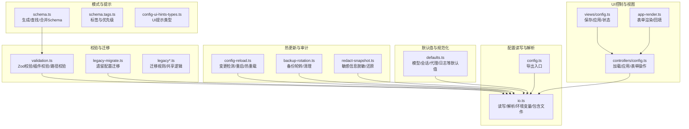
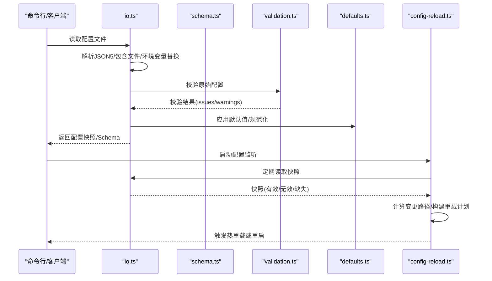
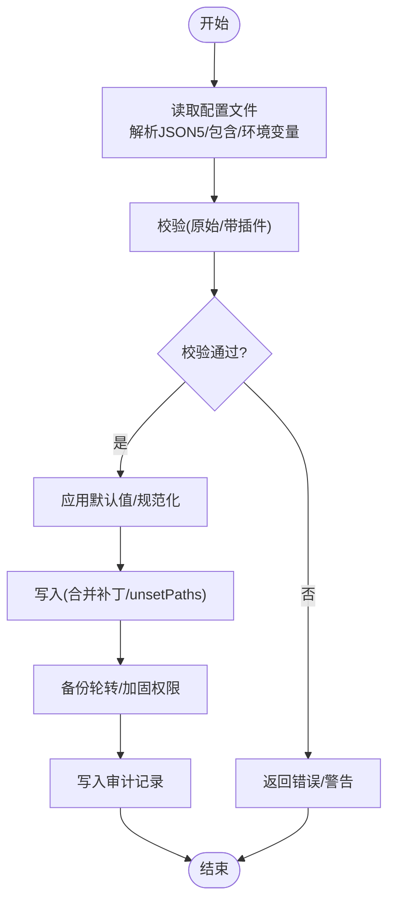
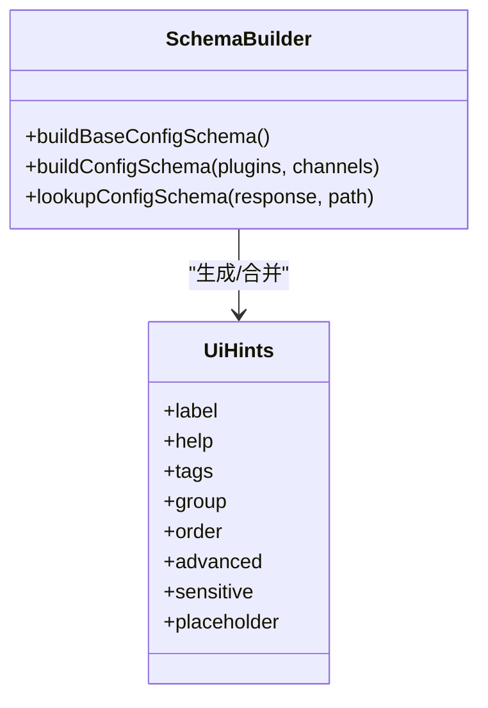
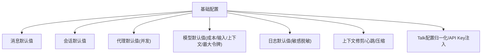
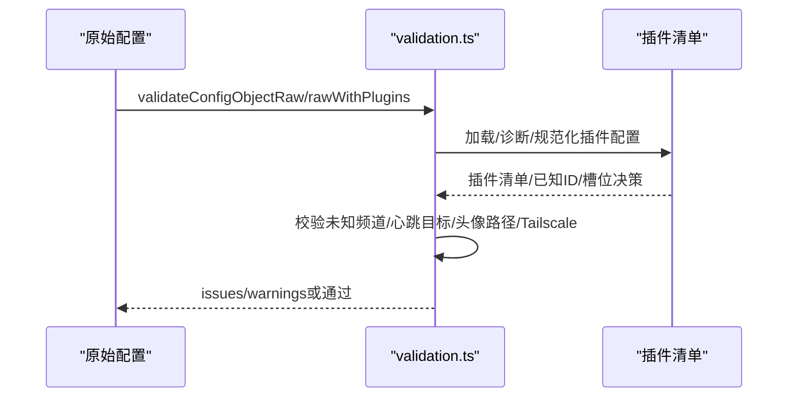
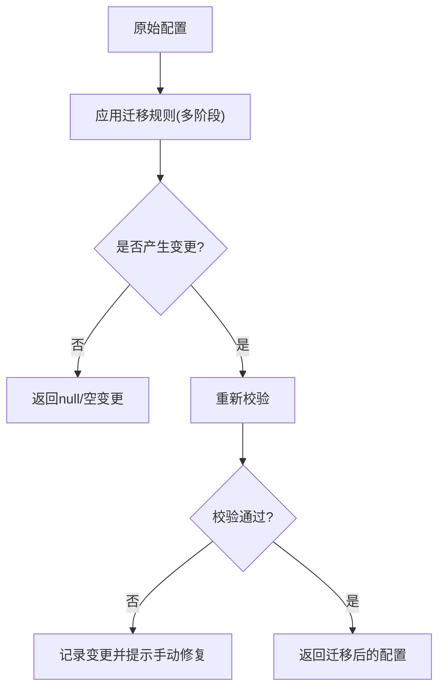
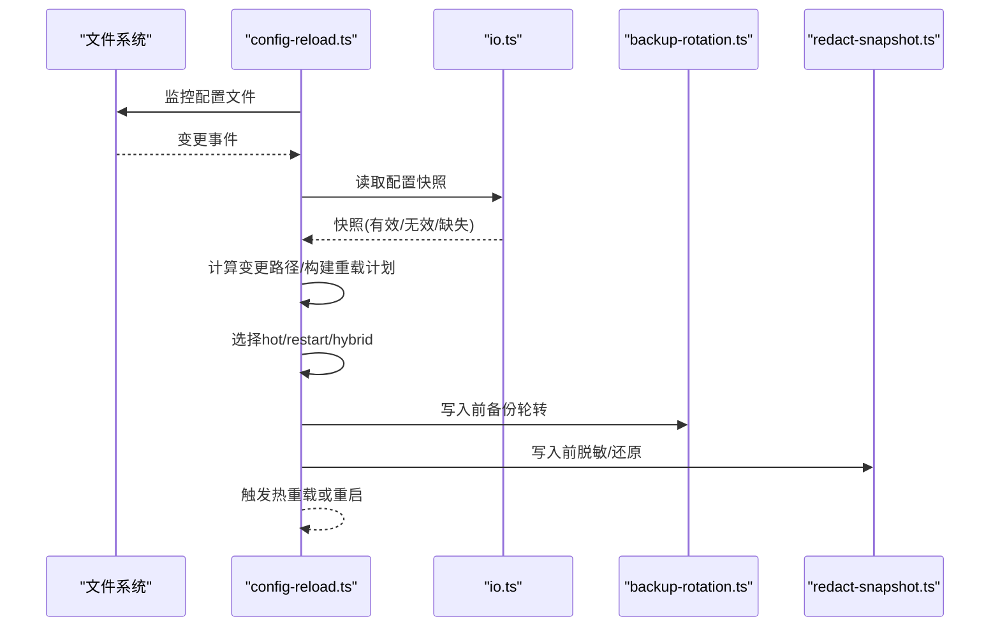
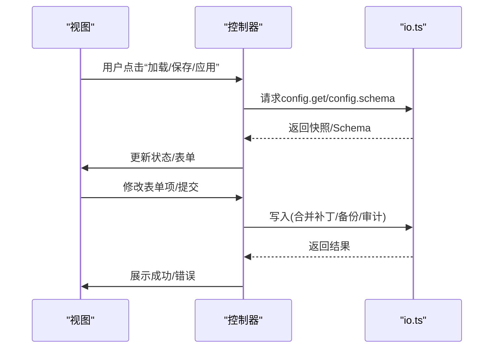
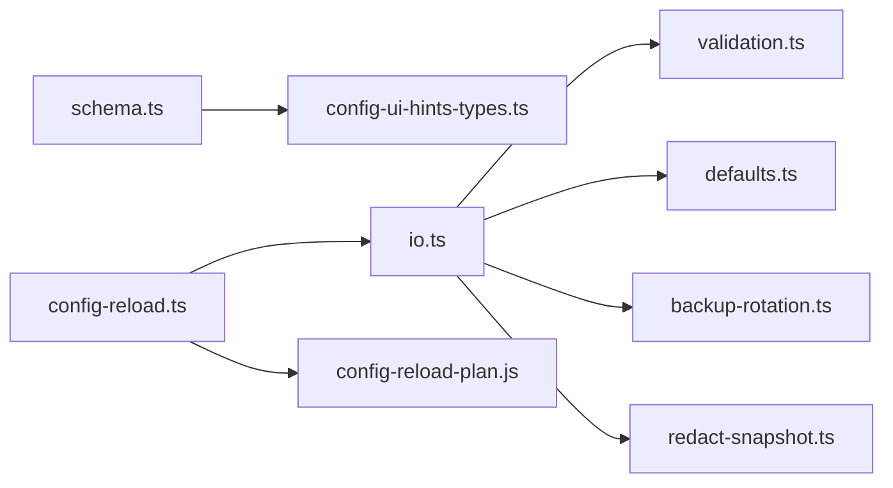

# 配置管理

<cite>
**本文档引用的文件**
- [src/config/io.ts](file://src/config/io.ts)
- [src/config/config.ts](file://src/config/config.ts)
- [src/config/schema.ts](file://src/config/schema.ts)
- [src/config/defaults.ts](file://src/config/defaults.ts)
- [src/config/validation.ts](file://src/config/validation.ts)
- [src/config/backup-rotation.ts](file://src/config/backup-rotation.ts)
- [src/config/redact-snapshot.ts](file://src/config/redact-snapshot.ts)
- [src/gateway/config-reload.ts](file://src/gateway/config-reload.ts)
- [src/config/legacy-migrate.ts](file://src/config/legacy-migrate.ts)
- [src/config/legacy.ts](file://src/config/legacy.ts)
- [src/config/legacy.migrations.ts](file://src/config/legacy.migrations.ts)
- [src/config/legacy.migrations.part-1.ts](file://src/config/legacy.migrations.part-1.ts)
- [src/config/legacy.migrations.part-2.ts](file://src/config/legacy.migrations.part-2.ts)
- [src/config/legacy.migrations.part-3.ts](file://src/config/legacy.migrations.part-3.ts)
- [src/config/legacy.rules.ts](file://src/config/legacy.rules.ts)
- [src/config/legacy.shared.ts](file://src/config/legacy.shared.ts)
- [src/config/schema.tags.ts](file://src/config/schema.tags.ts)
- [src/shared/config-ui-hints-types.ts](file://src/shared/config-ui-hints-types.ts)
- [ui/src/ui/controllers/config.ts](file://ui/src/ui/controllers/config.ts)
- [ui/src/ui/views/config.ts](file://ui/src/ui/views/config.ts)
- [ui/src/ui/app-render.ts](file://ui/src/ui/app-render.ts)
</cite>

## 目录

1. [简介](#简介)
2. [项目结构](#项目结构)
3. [核心组件](#核心组件)
4. [架构总览](#架构总览)
5. [详细组件分析](#详细组件分析)
6. [依赖关系分析](#依赖关系分析)
7. [性能考虑](#性能考虑)
8. [故障排除指南](#故障排除指南)
9. [结论](#结论)
10. [附录](#附录)

## 简介

本指南系统性阐述 OpenClaw 的配置管理系统，覆盖配置文件格式、参数验证、热更新机制、备份与恢复、配置层次与默认值处理、配置优先级、配置模板与迁移、配置审计、最佳实践与安全策略，以及常见问题排查方法。目标是帮助开发者与运维人员在不同平台与场景下高效、安全地管理 OpenClaw 的运行时配置。

## 项目结构

OpenClaw 的配置管理由“读写与解析层”“模式与提示层”“默认值与规范化层”“校验与迁移层”“热更新与审计层”“UI 控制器与视图层”六大模块协同完成。核心文件分布如下：

- 读写与解析：src/config/io.ts、src/config/config.ts
- 模式与提示：src/config/schema.ts、src/config/schema.tags.ts、src/shared/config-ui-hints-types.ts
- 默认值与规范化：src/config/defaults.ts
- 校验与迁移：src/config/validation.ts、src/config/legacy-migrate.ts、src/config/legacy\*.ts
- 热更新与审计：src/gateway/config-reload.ts、src/config/backup-rotation.ts、src/config/redact-snapshot.ts
- UI 控制器与视图：ui/src/ui/controllers/config.ts、ui/src/ui/views/config.ts、ui/src/ui/app-render.ts

图表来源

- [src/config/io.ts:1-800](file://src/config/io.ts#L1-L800)
- [src/config/schema.ts:1-712](file://src/config/schema.ts#L1-L712)
- [src/config/defaults.ts:1-537](file://src/config/defaults.ts#L1-L537)
- [src/config/validation.ts:1-605](file://src/config/validation.ts#L1-L605)
- [src/config/legacy-migrate.ts:1-20](file://src/config/legacy-migrate.ts#L1-L20)
- [src/gateway/config-reload.ts:1-248](file://src/gateway/config-reload.ts#L1-L248)
- [src/config/backup-rotation.ts:1-125](file://src/config/backup-rotation.ts#L1-L125)
- [src/config/redact-snapshot.ts:1-689](file://src/config/redact-snapshot.ts#L1-L689)
- [ui/src/ui/controllers/config.ts:39-257](file://ui/src/ui/controllers/config.ts#L39-L257)
- [ui/src/ui/views/config.ts:450-655](file://ui/src/ui/views/config.ts#L450-L655)
- [ui/src/ui/app-render.ts:824-852](file://ui/src/ui/app-render.ts#L824-L852)

章节来源

- [src/config/io.ts:1-800](file://src/config/io.ts#L1-L800)
- [src/config/config.ts:1-29](file://src/config/config.ts#L1-L29)

## 核心组件

- 配置读写与解析（io.ts）
  - 支持 JSON5 解析、include 文件合并、环境变量替换、默认值注入、路径规范化、写入前合并补丁、写入审计与备份轮转。
  - 提供只读快照读取、写入选项（含环境快照用于恢复）、哈希计算、变更路径收集等能力。
- 配置模式与提示（schema.ts）
  - 基于 Zod Schema 生成可编辑 Schema，动态合并插件与频道 Schema，构建 UI 提示（标签、分组、顺序、敏感标记）。
  - 提供路径查找、子节点枚举、派生标签与敏感路径映射。
- 默认值与规范化（defaults.ts）
  - 应用消息、会话、代理、模型、日志、上下文修剪、压缩等默认值；对 Talk 配置进行归一化与 API Key 注入。
- 参数验证（validation.ts）
  - 使用 Zod 进行强类型校验，扩展校验插件配置、未知频道、心跳目标、头像路径、Tailscale 绑定约束等。
- 遗留配置迁移（legacy-migrate.ts、legacy\*.ts）
  - 对历史配置进行迁移并重新校验，确保平滑升级。
- 热更新与审计（config-reload.ts、backup-rotation.ts、redact-snapshot.ts）
  - 基于文件监控的变更检测，支持 hot/restart/hybrid 模式；写入时自动备份轮转；读写过程对敏感信息进行脱敏与还原。
- UI 控制与视图（controllers/config.ts、views/config.ts、app-render.ts）
  - 负责从后端获取配置快照与 Schema，维护表单状态，执行保存/应用/撤销等操作，并在前端渲染与回填。

章节来源

- [src/config/io.ts:1-800](file://src/config/io.ts#L1-L800)
- [src/config/schema.ts:1-712](file://src/config/schema.ts#L1-L712)
- [src/config/defaults.ts:1-537](file://src/config/defaults.ts#L1-L537)
- [src/config/validation.ts:1-605](file://src/config/validation.ts#L1-L605)
- [src/config/legacy-migrate.ts:1-20](file://src/config/legacy-migrate.ts#L1-L20)
- [src/gateway/config-reload.ts:1-248](file://src/gateway/config-reload.ts#L1-L248)
- [src/config/backup-rotation.ts:1-125](file://src/config/backup-rotation.ts#L1-L125)
- [src/config/redact-snapshot.ts:1-689](file://src/config/redact-snapshot.ts#L1-L689)
- [ui/src/ui/controllers/config.ts:39-257](file://ui/src/ui/controllers/config.ts#L39-L257)
- [ui/src/ui/views/config.ts:450-655](file://ui/src/ui/views/config.ts#L450-L655)
- [ui/src/ui/app-render.ts:824-852](file://ui/src/ui/app-render.ts#L824-L852)

## 架构总览

OpenClaw 的配置系统采用“声明式 Schema + 强类型校验 + 动态默认值 + 环境变量替换 + 文件监控热更新”的架构。读取流程从 io.ts 开始，经过 schema.ts 生成 UI 友好的 Schema，validation.ts 执行严格校验，defaults.ts 注入默认值，最终形成可用于运行时的配置对象。写入流程通过合并补丁、备份轮转、审计记录保障安全与可追溯。

图表来源

- [src/config/io.ts:699-800](file://src/config/io.ts#L699-L800)
- [src/config/validation.ts:229-286](file://src/config/validation.ts#L229-L286)
- [src/config/defaults.ts:213-347](file://src/config/defaults.ts#L213-L347)
- [src/gateway/config-reload.ts:72-215](file://src/gateway/config-reload.ts#L72-L215)

## 详细组件分析

### 配置读写与解析（io.ts）

- 文件读取与解析
  - 支持候选路径解析、dotenv 加载、include 文件合并、环境变量替换（含缺失警告）、校验 Miskeys 提示。
- 写入与合并补丁
  - 通过合并补丁算法仅写出变更字段，支持 unsetPaths 显式移除字段，避免默认值回灌。
- 备份轮转与权限加固
  - 写入前进行环形备份轮转，复制新备份，必要时调整权限，清理孤儿备份。
- 审计日志
  - 记录写入事件、前后哈希、字节数、元数据存在性、网关模式变化、可疑行为等，落地到状态目录下的日志文件。
- 哈希与变更路径
  - 提供快照哈希计算与变更路径集合，用于热更新决策与审计。

图表来源

- [src/config/io.ts:699-800](file://src/config/io.ts#L699-L800)
- [src/config/backup-rotation.ts:115-125](file://src/config/backup-rotation.ts#L115-L125)
- [src/config/io.ts:541-555](file://src/config/io.ts#L541-L555)

章节来源

- [src/config/io.ts:1-800](file://src/config/io.ts#L1-L800)
- [src/config/backup-rotation.ts:1-125](file://src/config/backup-rotation.ts#L1-L125)

### 配置模式与提示（schema.ts）

- Schema 生成与缓存
  - 基于 Zod Schema 生成 Draft-07 JSON Schema，构建 UI 提示（标签、分组、顺序、敏感标记），并按插件/频道动态合并。
- 路径查找与子节点枚举
  - 支持通配符路径匹配、最大深度限制、禁止段过滤，输出子节点类型、是否必填、是否有子节点及 UI 提示。
- 派生标签与敏感路径
  - 自动为敏感键添加标签与高级标记，结合 UI 提示类型定义，统一前端渲染与校验。

图表来源

- [src/config/schema.ts:429-484](file://src/config/schema.ts#L429-L484)
- [src/config/schema.ts:678-711](file://src/config/schema.ts#L678-L711)
- [src/shared/config-ui-hints-types.ts:1-13](file://src/shared/config-ui-hints-types.ts#L1-L13)

章节来源

- [src/config/schema.ts:1-712](file://src/config/schema.ts#L1-L712)
- [src/config/schema.tags.ts:1-53](file://src/config/schema.tags.ts#L1-L53)
- [src/shared/config-ui-hints-types.ts:1-13](file://src/shared/config-ui-hints-types.ts#L1-L13)

### 默认值与规范化（defaults.ts）

- 默认值覆盖范围
  - 消息 ackReactionScope、会话 mainKey 归一、代理并发限制、模型成本/输入/上下文窗口/maxTokens、日志敏感信息脱敏策略、上下文修剪模式与心跳周期、压缩模式等。
- Talk 配置归一化与 API Key 注入
  - 归一化 Talk Provider 配置，按默认 Provider 注入 API Key，避免重复配置。

图表来源

- [src/config/defaults.ts:131-347](file://src/config/defaults.ts#L131-L347)

章节来源

- [src/config/defaults.ts:1-537](file://src/config/defaults.ts#L1-L537)

### 参数验证（validation.ts）

- Zod 校验与扩展校验
  - 原始校验（不应用默认值）与完整校验（应用默认值）；扩展校验插件配置、未知频道、心跳目标、头像路径合法性、Tailscale 绑定约束。
- 插件配置校验
  - 加载插件清单，校验允许/拒绝列表与内存槽位，对启用或显式配置的插件执行 Schema 校验，收集 issues 与 warnings。

图表来源

- [src/config/validation.ts:229-286](file://src/config/validation.ts#L229-L286)
- [src/config/validation.ts:308-604](file://src/config/validation.ts#L308-L604)

章节来源

- [src/config/validation.ts:1-605](file://src/config/validation.ts#L1-L605)

### 遗留配置迁移（legacy-migrate.ts、legacy\*.ts）

- 迁移流程
  - 应用多阶段迁移规则，对历史键名与结构进行转换，再进行校验，若仍有问题则提示手动修复。
- 迁移规则组织
  - 分为三个部分文件与共享逻辑，便于维护与扩展。

图表来源

- [src/config/legacy-migrate.ts:5-19](file://src/config/legacy-migrate.ts#L5-L19)
- [src/config/legacy.ts:42-58](file://src/config/legacy.ts#L42-L58)
- [src/config/legacy.migrations.ts:1-9](file://src/config/legacy.migrations.ts#L1-L9)

章节来源

- [src/config/legacy-migrate.ts:1-20](file://src/config/legacy-migrate.ts#L1-L20)
- [src/config/legacy.ts:1-58](file://src/config/legacy.ts#L1-L58)
- [src/config/legacy.migrations.ts:1-9](file://src/config/legacy.migrations.ts#L1-L9)

### 热更新与审计（config-reload.ts、backup-rotation.ts、redact-snapshot.ts）

- 变更检测与重载计划
  - 通过深比较计算变更路径，构建重载计划；根据配置决定 off/restart/hot/hybrid 模式；对需要重启的变更进行队列化处理。
- 备份轮转与清理
  - 写入前环形轮转旧备份，复制新备份，必要时调整权限，清理孤儿备份。
- 敏感信息脱敏与还原
  - 在读取/写入过程中对敏感路径进行脱敏，写入前使用原始值还原，保证 UI 回填不丢失凭据。

图表来源

- [src/gateway/config-reload.ts:72-215](file://src/gateway/config-reload.ts#L72-L215)
- [src/config/backup-rotation.ts:115-125](file://src/config/backup-rotation.ts#L115-L125)
- [src/config/redact-snapshot.ts:353-402](file://src/config/redact-snapshot.ts#L353-L402)

章节来源

- [src/gateway/config-reload.ts:1-248](file://src/gateway/config-reload.ts#L1-L248)
- [src/config/backup-rotation.ts:1-125](file://src/config/backup-rotation.ts#L1-L125)
- [src/config/redact-snapshot.ts:1-689](file://src/config/redact-snapshot.ts#L1-L689)

### UI 控制与视图（controllers/config.ts、views/config.ts、app-render.ts）

- 加载与应用
  - 通过 RPC 获取配置快照与 Schema，应用到前端状态；支持表单模式与原始模式切换，维护脏状态与差异统计。
- 表单操作
  - 支持增删改配置项、移除路径值、序列化表单、查找/确保代理条目等。
- 渲染与回填
  - 基于 UI 提示与 Schema 动态渲染表单，支持主备回填与空值处理。

图表来源

- [ui/src/ui/controllers/config.ts:39-71](file://ui/src/ui/controllers/config.ts#L39-L71)
- [ui/src/ui/views/config.ts:450-655](file://ui/src/ui/views/config.ts#L450-L655)
- [ui/src/ui/app-render.ts:824-852](file://ui/src/ui/app-render.ts#L824-L852)

章节来源

- [ui/src/ui/controllers/config.ts:39-257](file://ui/src/ui/controllers/config.ts#L39-L257)
- [ui/src/ui/views/config.ts:450-655](file://ui/src/ui/views/config.ts#L450-L655)
- [ui/src/ui/app-render.ts:824-852](file://ui/src/ui/app-render.ts#L824-L852)

## 依赖关系分析

- 模块耦合
  - io.ts 依赖 defaults.ts、validation.ts、backup-rotation.ts、redact-snapshot.ts；schema.ts 依赖 zod-schema 与 UI 提示类型；config-reload.ts 依赖 io.ts 与 issue-format 工具。
- 关键依赖链
  - 读取：io.ts → validation.ts → defaults.ts → schema.ts（生成 UI Schema）
  - 写入：io.ts → backup-rotation.ts → redact-snapshot.ts
  - 热更新：config-reload.ts → io.ts → config-reload-plan（内部模块）

图表来源

- [src/config/io.ts:19-56](file://src/config/io.ts#L19-L56)
- [src/gateway/config-reload.ts:1-10](file://src/gateway/config-reload.ts#L1-L10)
- [src/config/schema.ts:1-13](file://src/config/schema.ts#L1-L13)

章节来源

- [src/config/io.ts:19-56](file://src/config/io.ts#L19-L56)
- [src/gateway/config-reload.ts:1-10](file://src/gateway/config-reload.ts#L1-L10)
- [src/config/schema.ts:1-13](file://src/config/schema.ts#L1-L13)

## 性能考虑

- 缓存与去重
  - Schema 合成与缓存（按插件/频道排序后的哈希键），限制缓存数量，避免重复构建。
- 写入优化
  - 合并补丁仅写出变更字段，减少磁盘写入与备份压力；写入前备份轮转与权限加固采用异步与最佳努力策略。
- 热更新节流
  - 文件监控事件去抖动，避免频繁触发重载；对缺失配置进行有限次重试，降低误报。

章节来源

- [src/config/schema.ts:356-406](file://src/config/schema.ts#L356-L406)
- [src/config/io.ts:207-294](file://src/config/io.ts#L207-L294)
- [src/gateway/config-reload.ts:93-106](file://src/gateway/config-reload.ts#L93-L106)

## 故障排除指南

- 配置无效或校验失败
  - 查看校验 issues 与 warnings，关注路径与允许值提示；修复后重新加载。
- 环境变量缺失
  - 环境变量替换会产生缺失警告，确认变量是否正确设置或使用 dotenv；必要时启用 Shell 环境回退。
- 权限问题
  - 写入失败时检查文件所有者与权限，按提示修正；容器/一键部署场景需确保 chown 正确。
- 热更新未生效
  - 检查 gateway.reload.mode 设置与变更路径；hot 模式下某些变更会降级为重启；查看日志中的重载计划与原因。
- 敏感信息泄露
  - 确认脱敏策略与 UI 提示中的敏感标记；写入前应进行脱敏，读取时还原以保证 UI 体验。

章节来源

- [src/config/validation.ts:229-286](file://src/config/validation.ts#L229-L286)
- [src/config/io.ts:1011-1042](file://src/config/io.ts#L1011-L1042)
- [src/gateway/config-reload.ts:141-182](file://src/gateway/config-reload.ts#L141-L182)
- [src/config/redact-snapshot.ts:353-402](file://src/config/redact-snapshot.ts#L353-L402)

## 结论

OpenClaw 的配置管理以强类型 Schema 为基础，结合严格的校验、完善的默认值与规范化、安全的备份与审计、灵活的热更新策略，以及友好的 UI 提示与表单操作，形成了高可用、可观测、可迁移的配置体系。遵循本文档的最佳实践与安全建议，可在多平台环境下稳定地管理配置生命周期。

## 附录

- 配置文件格式
  - JSON5 支持注释与尾随逗号；支持 include 文件与环境变量占位符替换。
- 配置层次与默认值
  - 读取时应用默认值与规范化；写入时通过合并补丁仅写出变更，避免默认值回灌。
- 配置优先级
  - include 文件合并遵循顺序；环境变量替换在配置 env 后执行；最终以规范化后的配置为准。
- 配置热更新
  - 支持 off/restart/hot/hybrid 模式；变更路径驱动重载计划；对不可热重载的变更自动重启。
- 配置备份与恢复
  - 写入前进行环形备份轮转；可通过 .bak.\* 文件进行恢复；审计日志记录关键事件。
- 配置模板与迁移
  - 使用 Schema 生成 UI 模板；遗留配置迁移后重新校验，必要时人工修复。
- 配置审计
  - 写入审计记录包含时间戳、进程信息、前后哈希、字节数、元数据与网关模式变化等。
- 最佳实践
  - 使用 UI 提示与 Schema 进行可视化配置；定期备份；启用审计日志；谨慎修改敏感字段；遵循热更新模式与变更路径策略。
- 配置安全
  - 脱敏敏感字段；仅在必要时暴露高级选项；使用最小权限原则；定期审查插件与频道配置。
