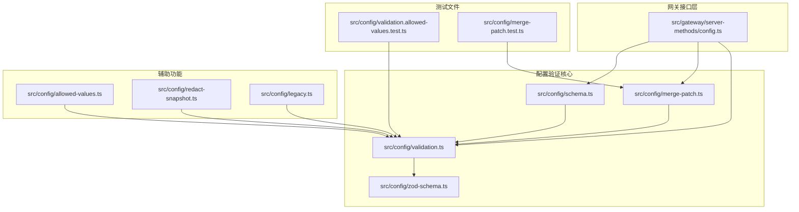
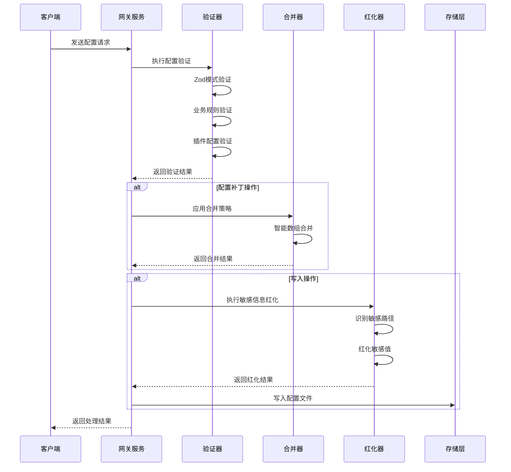
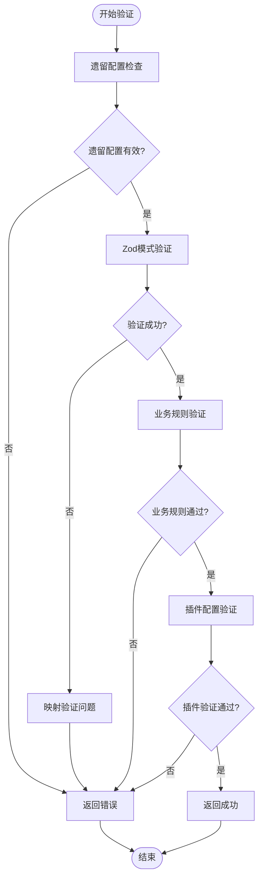
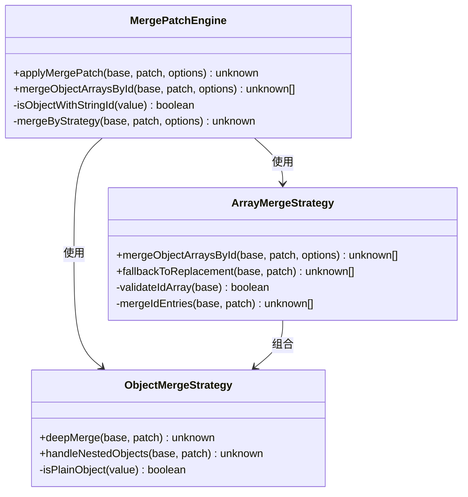
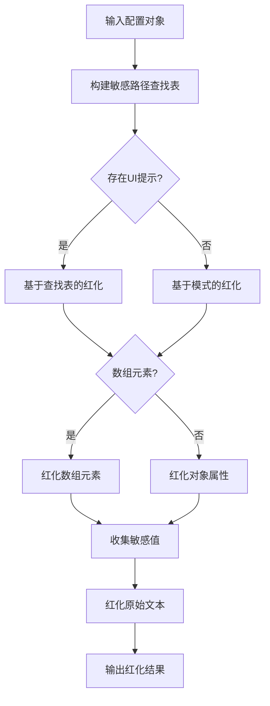
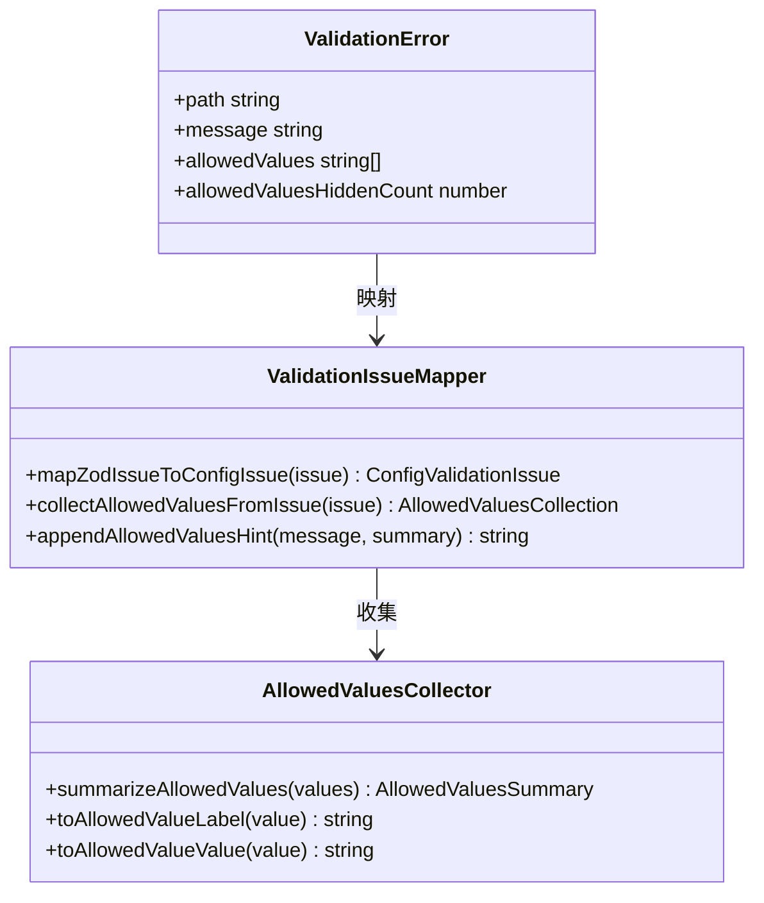
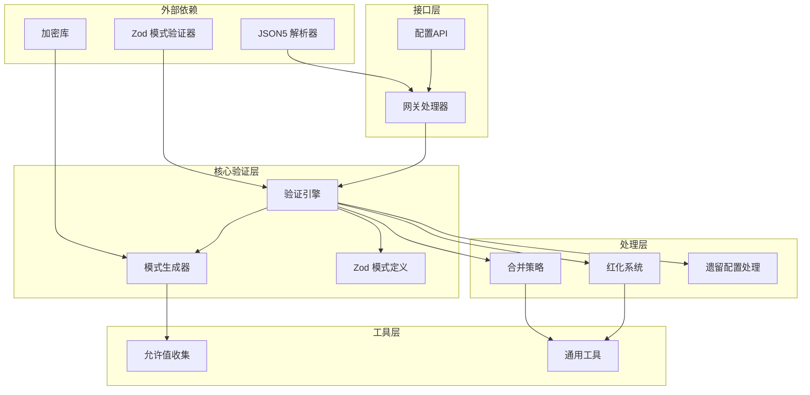

# 配置验证系统

<cite>
**本文档引用的文件**
- [src/config/validation.ts](file://src/config/validation.ts)
- [src/config/merge-patch.ts](file://src/config/merge-patch.ts)
- [src/gateway/server-methods/config.ts](file://src/gateway/server-methods/config.ts)
- [src/config/schema.ts](file://src/config/schema.ts)
- [src/config/zod-schema.ts](file://src/config/zod-schema.ts)
- [src/config/allowed-values.ts](file://src/config/allowed-values.ts)
- [src/config/redact-snapshot.ts](file://src/config/redact-snapshot.ts)
- [src/config/legacy.ts](file://src/config/legacy.ts)
- [src/config/validation.allowed-values.test.ts](file://src/config/validation.allowed-values.test.ts)
- [src/config/merge-patch.test.ts](file://src/config/merge-patch.test.ts)
</cite>

## 目录

1. [简介](#简介)
2. [项目结构](#项目结构)
3. [核心组件](#核心组件)
4. [架构概览](#架构概览)
5. [详细组件分析](#详细组件分析)
6. [依赖关系分析](#依赖关系分析)
7. [性能考虑](#性能考虑)
8. [故障排除指南](#故障排除指南)
9. [结论](#结论)

## 简介

配置验证系统是 OpenClaw 项目中的关键基础设施，负责确保配置文件的完整性、一致性和安全性。该系统提供了多层次的验证机制，包括值范围检查、类型验证、依赖关系验证以及配置合并策略。

系统采用模块化设计，通过 Zod 模式验证器进行基础类型检查，结合自定义验证逻辑处理复杂的业务规则。配置验证不仅确保数据格式正确，还验证配置之间的相互依赖关系，防止无效或冲突的配置组合。

## 项目结构

配置验证系统主要分布在以下核心文件中：

**图表来源**

- [src/config/validation.ts:1-605](file://src/config/validation.ts#L1-L605)
- [src/config/merge-patch.ts:1-98](file://src/config/merge-patch.ts#L1-L98)
- [src/gateway/server-methods/config.ts:1-516](file://src/gateway/server-methods/config.ts#L1-L516)

**章节来源**

- [src/config/validation.ts:1-605](file://src/config/validation.ts#L1-L605)
- [src/config/merge-patch.ts:1-98](file://src/config/merge-patch.ts#L1-L98)
- [src/gateway/server-methods/config.ts:1-516](file://src/gateway/server-methods/config.ts#L1-L516)

## 核心组件

### 验证引擎 (Validation Engine)

验证引擎是整个系统的核心，负责执行多层次的配置验证：

- **基础类型验证**: 使用 Zod 模式验证器进行严格的类型检查
- **业务规则验证**: 实现特定的业务逻辑验证，如代理目录重复检查、头像路径验证等
- **插件配置验证**: 动态加载插件并验证其配置模式
- **遗留配置迁移**: 处理旧版本配置的自动迁移

### 合并策略引擎 (Merge Strategy Engine)

专门处理配置合并的复杂逻辑：

- **智能数组合并**: 支持基于 ID 的对象数组智能合并
- **嵌套对象深度合并**: 递归处理嵌套配置对象
- **冲突检测与解决**: 自动检测并解决配置冲突
- **回退机制**: 当智能合并不可用时自动回退到简单替换

### 安全红化系统 (Security Redaction System)

保护敏感配置信息的安全机制：

- **敏感路径识别**: 基于配置模式识别敏感字段
- **多层红化**: 同时红化解析后的对象和原始文本
- **安全恢复**: 在写入时安全地恢复敏感值
- **环境变量处理**: 特殊处理环境变量占位符

**章节来源**

- [src/config/validation.ts:225-273](file://src/config/validation.ts#L225-L273)
- [src/config/merge-patch.ts:62-98](file://src/config/merge-patch.ts#L62-L98)
- [src/config/redact-snapshot.ts:418-452](file://src/config/redact-snapshot.ts#L418-L452)

## 架构概览

配置验证系统采用分层架构设计，确保各组件职责清晰且可扩展：

**图表来源**

- [src/gateway/server-methods/config.ts:333-454](file://src/gateway/server-methods/config.ts#L333-L454)
- [src/config/validation.ts:308-306](file://src/config/validation.ts#L308-L306)
- [src/config/merge-patch.ts:62-98](file://src/config/merge-patch.ts#L62-L98)

## 详细组件分析

### 验证流程组件

验证流程是配置系统的核心处理管道，包含多个验证阶段：

**图表来源**

- [src/config/validation.ts:229-273](file://src/config/validation.ts#L229-L273)
- [src/config/validation.ts:308-306](file://src/config/validation.ts#L308-L306)

#### 验证流程详细步骤

1. **遗留配置检查**: 检测并报告已废弃的配置项
2. **Zod模式验证**: 使用预定义的模式进行严格的数据类型检查
3. **业务规则验证**: 执行特定的业务逻辑验证
4. **插件配置验证**: 验证所有已启用插件的配置

**章节来源**

- [src/config/validation.ts:229-273](file://src/config/validation.ts#L229-L273)
- [src/config/validation.ts:308-306](file://src/config/validation.ts#L308-L306)

### 合并策略组件

合并策略组件实现了智能的配置合并算法：

**图表来源**

- [src/config/merge-patch.ts:62-98](file://src/config/merge-patch.ts#L62-L98)
- [src/config/merge-patch.ts:25-60](file://src/config/merge-patch.ts#L25-L60)

#### 合并策略详细实现

1. **智能数组合并**: 对于具有 `id` 字段的对象数组，按 ID 进行智能合并
2. **回退机制**: 当智能合并不可用时，自动回退到简单替换策略
3. **嵌套对象处理**: 递归处理嵌套的配置对象结构

**章节来源**

- [src/config/merge-patch.ts:62-98](file://src/config/merge-patch.ts#L62-L98)
- [src/config/merge-patch.test.ts:33-53](file://src/config/merge-patch.test.ts#L33-L53)

### 安全红化组件

安全红化组件提供了多层的安全保护机制：

**图表来源**

- [src/config/redact-snapshot.ts:116-125](file://src/config/redact-snapshot.ts#L116-L125)
- [src/config/redact-snapshot.ts:312-319](file://src/config/redact-snapshot.ts#L312-L319)

#### 红化机制详细流程

1. **敏感路径识别**: 基于配置模式和 UI 提示识别敏感字段
2. **多层红化**: 同时对解析后的对象和原始文本进行红化
3. **安全恢复**: 在写入时安全地恢复敏感值
4. **环境变量处理**: 特殊处理环境变量占位符

**章节来源**

- [src/config/redact-snapshot.ts:116-125](file://src/config/redact-snapshot.ts#L116-L125)
- [src/config/redact-snapshot.ts:418-452](file://src/config/redact-snapshot.ts#L418-L452)

### 错误处理与用户反馈组件

系统提供了丰富的错误处理和用户友好的错误消息：

**图表来源**

- [src/config/validation.ts:117-140](file://src/config/validation.ts#L117-L140)
- [src/config/allowed-values.ts:54-86](file://src/config/allowed-values.ts#L54-L86)

#### 错误处理特性

1. **详细的错误信息**: 提供具体的错误路径和问题描述
2. **允许值提示**: 自动收集并显示允许的值列表
3. **用户友好格式**: 将技术错误转换为用户可理解的消息
4. **配置修复建议**: 提供具体的修复指导

**章节来源**

- [src/config/validation.ts:117-140](file://src/config/validation.ts#L117-L140)
- [src/config/allowed-values.ts:54-86](file://src/config/allowed-values.ts#L54-L86)

## 依赖关系分析

配置验证系统具有清晰的依赖层次结构：

**图表来源**

- [src/config/validation.ts:1-25](file://src/config/validation.ts#L1-L25)
- [src/gateway/server-methods/config.ts:1-55](file://src/gateway/server-methods/config.ts#L1-L55)

**章节来源**

- [src/config/validation.ts:1-25](file://src/config/validation.ts#L1-L25)
- [src/gateway/server-methods/config.ts:1-55](file://src/gateway/server-methods/config.ts#L1-L55)

## 性能考虑

配置验证系统在设计时充分考虑了性能优化：

### 缓存策略

- **模式缓存**: Zod 模式和生成的配置模式被缓存以避免重复计算
- **插件注册表缓存**: 插件注册表和 UI 提示被缓存以提高查询效率
- **合并结果缓存**: 配置合并结果在合理范围内缓存

### 异步处理

- **非阻塞验证**: 验证过程设计为非阻塞，避免长时间占用主线程
- **渐进式验证**: 支持部分验证和增量验证，提高响应速度

### 内存优化

- **流式处理**: 大型配置文件采用流式处理减少内存占用
- **延迟加载**: 插件和相关资源按需加载，避免不必要的内存分配

## 故障排除指南

### 常见验证错误及解决方案

#### 类型验证失败

**症状**: 配置验证返回类型不匹配错误
**原因**: 配置值类型不符合预期
**解决方案**:

1. 检查配置值的数据类型
2. 参考配置模式文档确认正确的值格式
3. 使用配置验证工具检查具体错误位置

#### 业务规则验证失败

**症状**: 返回业务规则相关的验证错误
**原因**: 配置违反了特定的业务约束
**解决方案**:

1. 检查相关业务规则的要求
2. 确认配置值在允许的范围内
3. 参考错误消息中的具体指导

#### 插件配置验证失败

**症状**: 插件配置验证返回错误
**原因**: 插件配置不符合插件要求
**解决方案**:

1. 检查插件的配置模式
2. 确认插件版本兼容性
3. 查看插件文档了解正确的配置格式

### 调试技巧

1. **启用详细日志**: 启用调试模式获取更详细的错误信息
2. **使用配置验证工具**: 利用内置的配置验证工具进行诊断
3. **检查配置文件**: 确保配置文件语法正确且格式规范

**章节来源**

- [src/config/validation.ts:117-140](file://src/config/validation.ts#L117-L140)
- [src/config/validation.allowed-values.test.ts:5-34](file://src/config/validation.allowed-values.test.ts#L5-L34)

## 结论

配置验证系统通过其模块化的架构设计和多层次的验证机制，为 OpenClaw 项目提供了强大而灵活的配置管理能力。系统不仅确保了配置的正确性和一致性，还提供了优秀的用户体验和扩展性。

### 主要优势

1. **全面的验证覆盖**: 从基础类型验证到复杂的业务规则验证
2. **智能的合并策略**: 支持复杂的配置合并场景
3. **强大的安全性**: 多层红化机制保护敏感配置信息
4. **良好的扩展性**: 模块化设计便于添加新的验证规则和功能

### 未来发展方向

1. **性能优化**: 进一步优化大型配置文件的处理性能
2. **用户体验改进**: 提供更直观的错误消息和修复建议
3. **自动化程度提升**: 增强配置自动修复和迁移能力
4. **监控和诊断**: 加强配置系统的监控和诊断功能

该系统为 OpenClaw 项目的稳定运行提供了坚实的基础，是现代配置管理系统的一个优秀范例。
