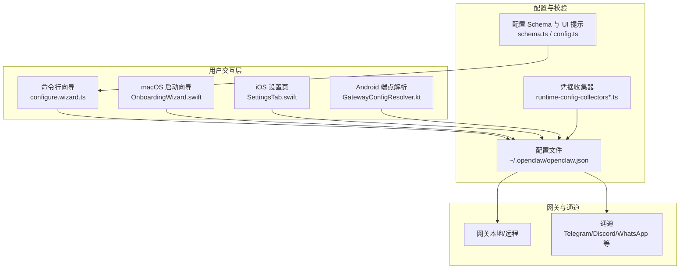
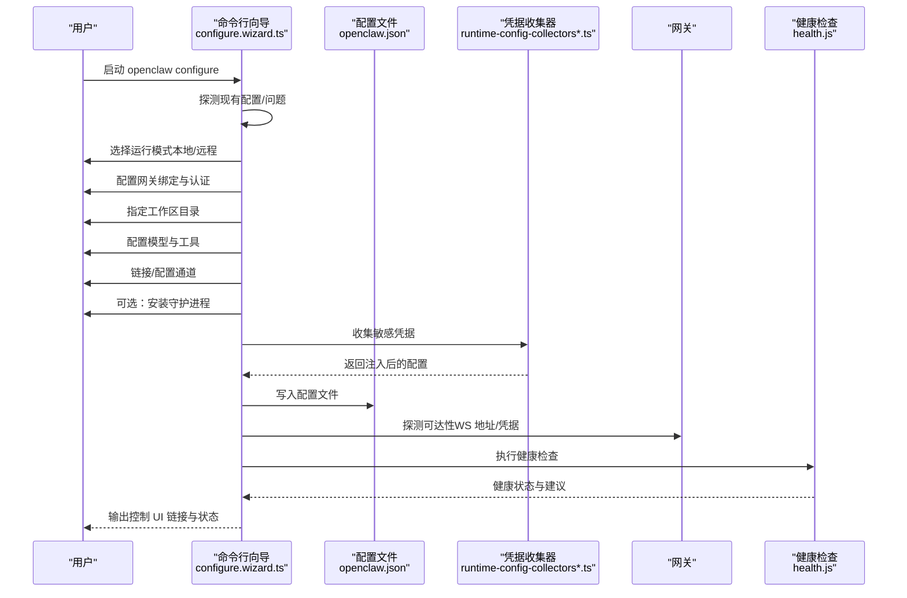
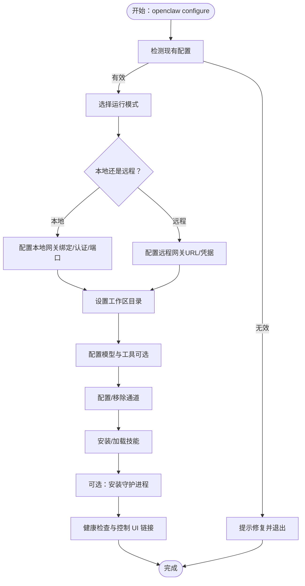
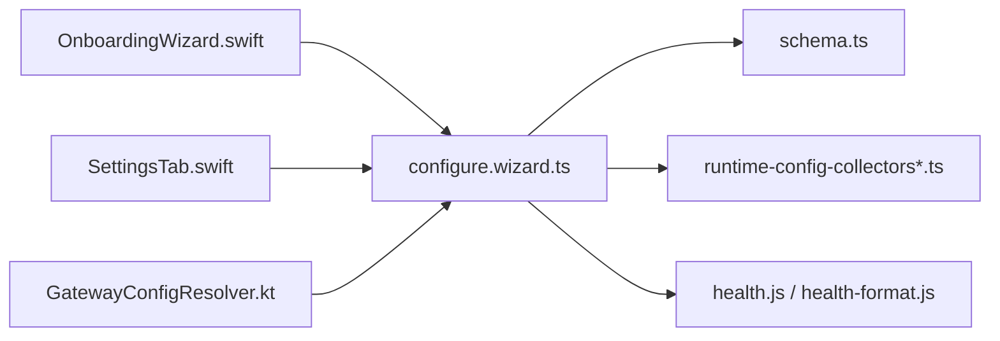

# 初始配置

<cite>
**本文引用的文件**
- [configure.wizard.ts](file://src/commands/configure.wizard.ts)
- [configure.commands.ts](file://src/commands/configure.commands.ts)
- [onboarding.ts](file://src/wizard/onboarding.ts)
- [onboarding.gateway-config.ts](file://src/wizard/onboarding.gateway-config.ts)
- [onboarding.md](file://docs/start/onboarding.md)
- [setup.md](file://docs/start/setup.md)
- [configuration-examples.md](file://docs/gateway/configuration-examples.md)
- [configuration-reference.md](file://docs/gateway/configuration-reference.md)
- [config.ts](file://src/gateway/protocol/schema/config.ts)
- [schema.ts](file://src/config/schema.ts)
- [runtime-config-collectors.ts](file://src/secrets/runtime-config-collectors.ts)
- [runtime-config-collectors-core.ts](file://src/secrets/runtime-config-collectors-core.ts)
- [GatewayConfigResolver.kt](file://apps/android/app/src/main/java/ai/openclaw/app/ui/GatewayConfigResolver.kt)
- [OnboardingWizard.swift](file://apps/macos/Sources/OpenClaw/OnboardingWizard.swift)
- [SettingsTab.swift](file://apps/ios/Sources/Settings/SettingsTab.swift)
- [qr-cli.ts](file://src/cli/qr-cli.ts)
- [config.ts](file://src/config/config.ts)
- [config.ts](file://src/commands/configure.gateway-auth.ts)
- [config.ts](file://src/commands/configure.gateway.ts)
- [config.ts](file://src/commands/configure.channels.ts)
- [config.ts](file://src/commands/configure.daemon.ts)
- [config.ts](file://src/commands/health.js)
- [config.ts](file://src/commands/health-format.js)
- [config.ts](file://src/commands/onboard-helpers.js)
- [config.ts](file://src/commands/onboard-remote.js)
- [config.ts](file://src/commands/onboard-search.js)
- [config.ts](file://src/commands/onboard-skills.js)
- [config.ts](file://src/commands/onboard-channels.js)
- [config.ts](file://src/commands/configure.shared.js)
- [config.ts](file://src/commands/configure.wizard.js)
- [config.ts](file://src/commands/configure.commands.js)
- [config.ts](file://src/commands/configure.ts)
- [config.ts](file://src/secrets/configure.ts)
</cite>

## 目录

1. [简介](#简介)
2. [项目结构](#项目结构)
3. [核心组件](#核心组件)
4. [架构总览](#架构总览)
5. [详细组件分析](#详细组件分析)
6. [依赖关系分析](#依赖关系分析)
7. [性能考量](#性能考量)
8. [故障排查指南](#故障排查指南)
9. [结论](#结论)
10. [附录](#附录)

## 简介

本指南面向首次部署与使用 OpenClaw 的用户，提供从零开始的初始配置路径：包括向导式配置流程、手动配置选项、以及配置验证步骤。内容覆盖网关配置、通道配置、代理配置与安全配置的初始设置，并给出配置模板、预设配置与自定义配置的创建方法，帮助新用户快速完成基础配置并开始使用。

## 项目结构

OpenClaw 的初始配置由“命令行向导 + 配置文件 + 平台 UI（macOS/iOS/Android）”三部分协同完成。核心流程如下：

- 命令行向导负责引导用户选择运行模式（本地/远程）、网关绑定与认证方式、工作区目录、模型与工具、通道链接、守护进程安装与健康检查。
- 配置文件采用 JSON5 格式，位于用户主目录下的工作区中，支持分节管理（gateway、channels、agents、tools 等）。
- 平台 UI（macOS/iOS/Android）提供图形化入口与辅助解析（如 Android 的端点解析、iOS 的凭据持久化），并与命令行向导保持一致的配置语义。



图示来源

- [configure.wizard.ts:1-706](file://src/commands/configure.wizard.ts#L1-L706)
- [schema.ts:398-447](file://src/config/schema.ts#L398-L447)
- [config.ts:53-100](file://src/gateway/protocol/schema/config.ts#L53-L100)
- [runtime-config-collectors.ts:1-23](file://src/secrets/runtime-config-collectors.ts#L1-L23)
- [GatewayConfigResolver.kt:56-100](file://apps/android/app/src/main/java/ai/openclaw/app/ui/GatewayConfigResolver.kt#L56-L100)
- [OnboardingWizard.swift:144-232](file://apps/macos/Sources/OpenClaw/OnboardingWizard.swift#L144-L232)
- [SettingsTab.swift:457-483](file://apps/ios/Sources/Settings/SettingsTab.swift#L457-L483)

章节来源

- [configure.wizard.ts:1-706](file://src/commands/configure.wizard.ts#L1-L706)
- [setup.md:1-166](file://docs/start/setup.md#L1-L166)
- [onboarding.md:1-92](file://docs/start/onboarding.md#L1-L92)

## 核心组件

- 命令行配置向导：负责引导用户完成“工作区、网关、通道、技能、守护进程、健康检查”等关键步骤，并写入配置文件。
- 配置 Schema 与 UI 提示：为控制界面与向导提供字段级提示、分组、敏感标记与顺序信息。
- 凭据收集器：在运行时按需收集敏感配置（如 token/password），并将其注入到最终配置中。
- 平台 UI 辅助：macOS/iOS/Android 分别提供启动向导与端点解析/凭据持久化能力，保证跨平台一致性。

章节来源

- [configure.wizard.ts:306-706](file://src/commands/configure.wizard.ts#L306-L706)
- [schema.ts:429-447](file://src/config/schema.ts#L429-L447)
- [config.ts:53-100](file://src/gateway/protocol/schema/config.ts#L53-L100)
- [runtime-config-collectors.ts:1-23](file://src/secrets/runtime-config-collectors.ts#L1-L23)

## 架构总览

下图展示从用户输入到配置落盘与健康验证的整体流程：



图示来源

- [configure.wizard.ts:306-706](file://src/commands/configure.wizard.ts#L306-L706)
- [health.js](file://src/commands/health.js)
- [health-format.js](file://src/commands/health-format.js)
- [onboard-helpers.js](file://src/commands/onboard-helpers.js)
- [runtime-config-collectors-core.ts:245-276](file://src/secrets/runtime-config-collectors-core.ts#L245-L276)

## 详细组件分析

### 向导配置流程（命令行）

- 首次运行检测：若存在有效配置，向导会提示保留/修改/重置策略；若无效则引导修复后重试。
- 运行模式选择：本地（默认 127.0.0.1:18789）或远程（通过配置的远端地址）。
- 网关配置：绑定地址（回环/LAN/Tailnet/自动/自定义）、认证模式（Token/密码）与端口。
- 工作区与守护进程：指定工作区目录，可选安装系统服务（守护进程）。
- 模型与工具：启用/配置网络搜索与抓取工具，设定默认模型与别名。
- 通道配置：进入通道链接/移除流程，支持多账户与群组策略。
- 技能与资源：安装/加载技能包与额外目录。
- 健康检查：等待网关可达并执行健康检查，输出控制 UI 链接与状态。



图示来源

- [configure.wizard.ts:306-706](file://src/commands/configure.wizard.ts#L306-L706)
- [configure.commands.ts:1-37](file://src/commands/configure.commands.ts#L1-L37)
- [onboarding.ts:141-176](file://src/wizard/onboarding.ts#L141-L176)
- [onboarding.gateway-config.ts:72-114](file://src/wizard/onboarding.gateway-config.ts#L72-L114)

章节来源

- [configure.wizard.ts:306-706](file://src/commands/configure.wizard.ts#L306-L706)
- [configure.commands.ts:1-37](file://src/commands/configure.commands.ts#L1-L37)
- [onboarding.ts:141-176](file://src/wizard/onboarding.ts#L141-L176)
- [onboarding.gateway-config.ts:72-114](file://src/wizard/onboarding.gateway-config.ts#L72-L114)

### 平台向导与辅助（macOS/iOS/Android）

- macOS 启动向导：在应用首次运行时引导用户完成权限与网关模式选择，并生成初始配置。
- iOS 设置页：支持保存网关 Token/Password，并在切换网关实例时同步状态。
- Android 端点解析：将用户输入的主机/端口/TLS 组合解析为可用的网关端点配置，支持 Base64 解码的“设置码”。

```mermaid
sequenceDiagram
participant Mac as "macOS 启动向导<br/>OnboardingWizard.swift"
participant iOS as "iOS 设置页<br/>SettingsTab.swift"
participant And as "Android 端点解析<br/>GatewayConfigResolver.kt"
participant CFG as "配置文件"
Mac->>CFG : 写入初始配置含网关与安全提示
iOS->>CFG : 保存 Token/Password按实例隔离
And->>CFG : 解析用户输入为端点配置含设置码
```

图示来源

- [OnboardingWizard.swift:144-232](file://apps/macos/Sources/OpenClaw/OnboardingWizard.swift#L144-L232)
- [SettingsTab.swift:457-483](file://apps/ios/Sources/Settings/SettingsTab.swift#L457-L483)
- [GatewayConfigResolver.kt:56-100](file://apps/android/app/src/main/java/ai/openclaw/app/ui/GatewayConfigResolver.kt#L56-L100)

章节来源

- [onboarding.md:1-92](file://docs/start/onboarding.md#L1-L92)
- [OnboardingWizard.swift:144-232](file://apps/macos/Sources/OpenClaw/OnboardingWizard.swift#L144-L232)
- [SettingsTab.swift:457-483](file://apps/ios/Sources/Settings/SettingsTab.swift#L457-L483)
- [GatewayConfigResolver.kt:56-100](file://apps/android/app/src/main/java/ai/openclaw/app/ui/GatewayConfigResolver.kt#L56-L100)

### 网关配置（绑定、认证与远程）

- 绑定模式：回环（仅本机）、LAN（局域网）、Tailnet（Tailscale）、自动（回环→LAN）、自定义 IP。
- 认证模式：Token 或密码；向导会生成 Token 以确保本地 WebSocket 客户端具备身份。
- 远程访问：配置远端 URL 与凭据，向导会探测可达性并提示健康检查。
- 端口与控制 UI：默认端口 18789，支持自定义端口与控制 UI 路径前缀。

章节来源

- [onboarding.gateway-config.ts:72-114](file://src/wizard/onboarding.gateway-config.ts#L72-L114)
- [configure.wizard.ts:375-410](file://src/commands/configure.wizard.ts#L375-L410)
- [qr-cli.ts:162-196](file://src/cli/qr-cli.ts#L162-L196)

### 通道配置（Telegram/Discord/WhatsApp 等）

- 通道启用与策略：每个通道在配置存在时自动启动（除非显式禁用）。支持 DM 策略（配对/白名单/开放/禁用）与群组策略（白名单/开放/禁用）。
- 多账户支持：通过 accounts 节点为不同账号分配独立凭据与策略。
- 群组与提及：可针对特定群组开启/关闭“必须提及”等规则。
- 其他扩展通道：如 Feishu、Matrix、LINE、Nostr、Zalo、Nextcloud Talk、Synology Chat、Twitch 等，均以 channels.<id> 形式配置。

章节来源

- [configuration-reference.md:18-655](file://docs/gateway/configuration-reference.md#L18-L655)
- [configure.wizard.ts:487-500](file://src/commands/configure.wizard.ts#L487-L500)

### 代理配置与远程访问

- 代理与网络：部分通道支持代理（如 Telegram 的 socks5）、DNS 选择与网络参数。
- 远程访问：通过远端 URL 与共享令牌实现跨网络访问；迁移时可从 Token 认证切换到受信代理认证。
- Tailnet：可结合 Tailscale 实现更简化的内网穿透访问。

章节来源

- [configuration-reference.md:152-204](file://docs/gateway/configuration-reference.md#L152-L204)
- [configuration-reference.md:214-304](file://docs/gateway/configuration-reference.md#L214-L304)
- [configuration-reference.md:330-357](file://docs/gateway/configuration-reference.md#L330-L357)
- [configuration-reference.md:365-419](file://docs/gateway/configuration-reference.md#L365-L419)
- [configuration-reference.md:442-468](file://docs/gateway/configuration-reference.md#L442-L468)
- [configuration-reference.md:483-500](file://docs/gateway/configuration-reference.md#L483-L500)
- [configuration-reference.md:508-527](file://docs/gateway/configuration-reference.md#L508-L527)
- [configuration-reference.md:529-553](file://docs/gateway/configuration-reference.md#L529-L553)
- [configuration-reference.md:573-588](file://docs/gateway/configuration-reference.md#L573-L588)
- [configuration-reference.md:593-614](file://docs/gateway/configuration-reference.md#L593-L614)
- [configuration-reference.md:620-641](file://docs/gateway/configuration-reference.md#L620-L641)
- [configuration-reference.md:651-655](file://docs/gateway/configuration-reference.md#L651-L655)
- [trusted-proxy-auth.md:313-329](file://docs/gateway/trusted-proxy-auth.md#L313-L329)

### 安全配置（认证、凭据与审计）

- 认证模式：推荐使用 Token；在多机器或多非回环绑定场景下尤为必要。
- 凭据存储：支持环境变量、SecretRef、文件等多种来源；敏感字段在 UI 中有标记。
- 审计与迁移：可通过安全审计命令检查配置风险；从 Token 迁移到受信代理时需按步骤更新配置并重启网关。

章节来源

- [onboarding.md:33-61](file://docs/start/onboarding.md#L33-L61)
- [configuration-reference.md:68-91](file://docs/gateway/configuration-reference.md#L68-L91)
- [runtime-config-collectors-core.ts:245-276](file://src/secrets/runtime-config-collectors-core.ts#L245-L276)
- [trusted-proxy-auth.md:313-329](file://docs/gateway/trusted-proxy-auth.md#L313-L329)

### 配置验证与健康检查

- 可达性探测：向导会尝试连接 WebSocket 地址并携带 Token/密码进行握手。
- 健康检查：执行健康命令，输出错误格式化信息与相关文档链接。
- 控制 UI：输出 Web UI 与 WS 地址，便于后续调试。

章节来源

- [configure.wizard.ts:68-118](file://src/commands/configure.wizard.ts#L68-L118)
- [health.js](file://src/commands/health.js)
- [health-format.js](file://src/commands/health-format.js)

## 依赖关系分析

- 配置向导依赖于配置 Schema 与 UI 提示，以确保表单字段与提示一致。
- 凭据收集器在运行时根据上下文与默认值注入敏感配置，避免明文硬编码。
- 平台 UI 与命令行向导共享相同的配置语义，保证跨平台一致性。



图示来源

- [configure.wizard.ts:1-706](file://src/commands/configure.wizard.ts#L1-L706)
- [schema.ts:398-447](file://src/config/schema.ts#L398-L447)
- [runtime-config-collectors.ts:1-23](file://src/secrets/runtime-config-collectors.ts#L1-L23)
- [health.js](file://src/commands/health.js)
- [health-format.js](file://src/commands/health-format.js)
- [OnboardingWizard.swift:144-232](file://apps/macos/Sources/OpenClaw/OnboardingWizard.swift#L144-L232)
- [SettingsTab.swift:457-483](file://apps/ios/Sources/Settings/SettingsTab.swift#L457-L483)
- [GatewayConfigResolver.kt:56-100](file://apps/android/app/src/main/java/ai/openclaw/app/ui/GatewayConfigResolver.kt#L56-L100)

## 性能考量

- 建议优先使用 Token 认证以减少握手开销与兼容性问题。
- 合理设置通道的重连与限流策略，避免频繁重连导致资源浪费。
- 使用 Tailnet 或受信代理可降低公网穿透带来的延迟与不稳定。

## 故障排查指南

- 配置无效：运行诊断命令修复后重试配置。
- 网关不可达：确认绑定地址、端口与认证信息正确；检查防火墙与代理设置。
- 通道无法登录：核对各通道的令牌/密钥与允许列表；必要时清理旧配置并重新授权。
- 健康检查失败：根据错误提示查看相关文档，逐步排查网络、认证与资源限制。

章节来源

- [configure.wizard.ts:318-338](file://src/commands/configure.wizard.ts#L318-L338)
- [configure.wizard.ts:68-118](file://src/commands/configure.wizard.ts#L68-L118)

## 结论

通过命令行向导与平台 UI 的协同，OpenClaw 为新用户提供了一条从零到一的清晰配置路径。遵循本指南中的步骤，您可以快速完成网关、通道、代理与安全的初始设置，并通过健康检查确保系统稳定运行。随后可根据需要扩展模型、工具与技能，逐步完善个人或团队的工作流。

## 附录

### 配置模板与示例

- 快速起步最小配置：包含工作区与单个通道的基本设置。
- 推荐入门配置：包含身份、模型与通道策略的示例。
- 扩展示例：涵盖环境变量、日志、路由、工具、会话、通道、代理、Webhook、网关与技能等全面配置。

章节来源

- [configuration-examples.md:14-446](file://docs/gateway/configuration-examples.md#L14-L446)

### 字段参考与最佳实践

- 通道字段：DM/群组策略、多账户、提及规则、历史限制等。
- Agent 默认项：工作区、仓库根、引导文件、模型别名与超时等。
- 安全与凭据：认证模式、敏感字段标记、凭据来源与 SecretRef。

章节来源

- [configuration-reference.md:18-800](file://docs/gateway/configuration-reference.md#L18-L800)
