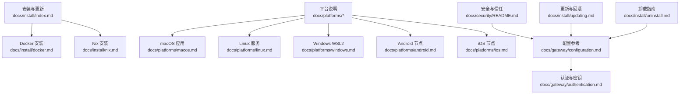
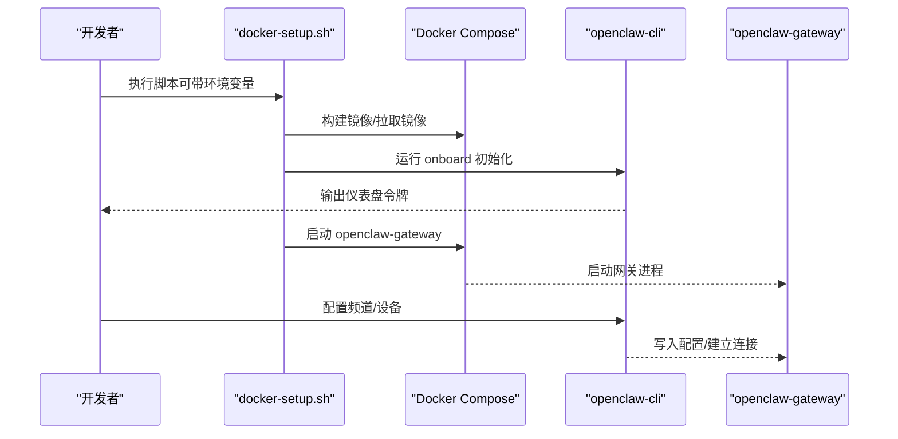
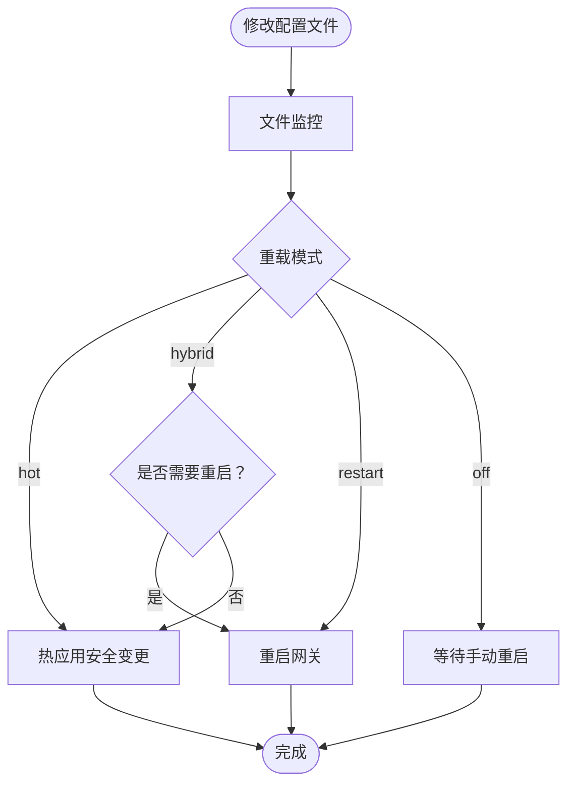
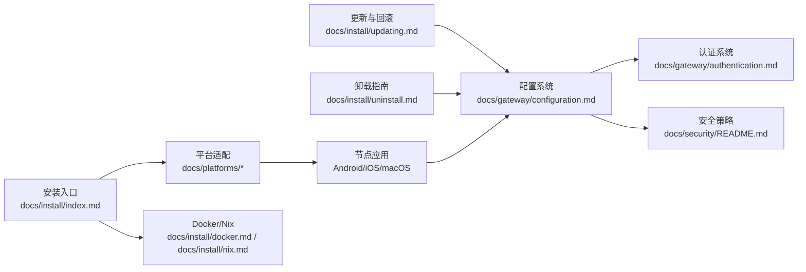

# 安装与配置

<cite>
**本文引用的文件**
- [README.md](file://README.md)
- [docs/install/index.md](file://docs/install/index.md)
- [docs/install/docker.md](file://docs/install/docker.md)
- [docs/install/nix.md](file://docs/install/nix.md)
- [docs/platforms/macos.md](file://docs/platforms/macos.md)
- [docs/platforms/linux.md](file://docs/platforms/linux.md)
- [docs/platforms/windows.md](file://docs/platforms/windows.md)
- [docs/platforms/android.md](file://docs/platforms/android.md)
- [docs/platforms/ios.md](file://docs/platforms/ios.md)
- [docs/gateway/configuration.md](file://docs/gateway/configuration.md)
- [docs/gateway/authentication.md](file://docs/gateway/authentication.md)
- [docs/security/README.md](file://docs/security/README.md)
- [docs/install/updating.md](file://docs/install/updating.md)
- [docs/install/uninstall.md](file://docs/install/uninstall.md)
</cite>

## 目录

1. [简介](#简介)
2. [项目结构](#项目结构)
3. [核心组件](#核心组件)
4. [架构总览](#架构总览)
5. [详细组件分析](#详细组件分析)
6. [依赖关系分析](#依赖关系分析)
7. [性能考虑](#性能考虑)
8. [故障排查指南](#故障排查指南)
9. [结论](#结论)
10. [附录](#附录)

## 简介

本指南面向从开发环境到生产环境的全场景用户，系统性讲解 OpenClaw 的安装与配置方法，覆盖以下主题：

- 多种安装方式：官方安装脚本、包管理器（npm/pnpm）、源码构建、Docker、Nix、Bun 等
- 平台适配：macOS、Linux、Windows（WSL2）、iOS、Android
- 配置体系：JSON5 配置、环境变量、密钥与凭据管理、认证策略
- 生产部署：服务化运行、远程访问、安全加固、健康检查与可观测性
- 常见问题诊断与性能优化

## 项目结构

OpenClaw 采用多模块、多语言混合的工程组织方式，核心 CLI 与网关在 TypeScript 中实现，配套文档与平台应用分别位于 docs/ 与 apps/ 目录中。安装与配置相关的关键位置包括：

- 安装与更新：docs/install/\*
- 平台说明：docs/platforms/\*
- 网关配置：docs/gateway/configuration.md
- 认证与密钥：docs/gateway/authentication.md
- 安全与信任：docs/security/\*



图表来源

- [docs/install/index.md](file://docs/install/index.md)
- [docs/install/docker.md](file://docs/install/docker.md)
- [docs/install/nix.md](file://docs/install/nix.md)
- [docs/platforms/macos.md](file://docs/platforms/macos.md)
- [docs/platforms/linux.md](file://docs/platforms/linux.md)
- [docs/platforms/windows.md](file://docs/platforms/windows.md)
- [docs/platforms/android.md](file://docs/platforms/android.md)
- [docs/platforms/ios.md](file://docs/platforms/ios.md)
- [docs/gateway/configuration.md](file://docs/gateway/configuration.md)
- [docs/gateway/authentication.md](file://docs/gateway/authentication.md)
- [docs/security/README.md](file://docs/security/README.md)
- [docs/install/updating.md](file://docs/install/updating.md)
- [docs/install/uninstall.md](file://docs/install/uninstall.md)

章节来源

- [README.md](file://README.md)
- [docs/install/index.md](file://docs/install/index.md)

## 核心组件

- 网关（Gateway）：WebSocket 控制面，承载会话、通道、工具与事件；支持本地或远程模式
- CLI：命令行工具，提供 onboarding、配置、设备管理、健康检查等能力
- 平台节点（Node）：Android/iOS/macOS 上的节点应用，负责设备能力调用与连接
- 配置系统：JSON5 配置文件、环境变量、密钥引用与动态注入
- 认证系统：模型提供商 API Key、OAuth、订阅令牌与凭据轮换
- 容器化与沙箱：Docker 镜像与 per-session 沙箱隔离执行

章节来源

- [README.md](file://README.md)
- [docs/gateway/configuration.md](file://docs/gateway/configuration.md)
- [docs/gateway/authentication.md](file://docs/gateway/authentication.md)

## 架构总览

下图展示 OpenClaw 的端到端架构：客户端通过 WebSocket 连接网关，网关根据配置路由到代理与工具，平台节点提供设备能力。

```mermaid
graph TB
subgraph "客户端"
U["用户终端<br/>浏览器/CLI/移动端"]
end
subgraph "网关控制面"
GW["Gateway<br/>WebSocket + HTTP"]
CFG["配置系统<br/>JSON5/环境变量/密钥"]
AUTH["认证系统<br/>API Key/OAuth/订阅令牌"]
end
subgraph "平台节点"
AND["Android 节点"]
IOS["iOS 节点"]
MAC["macOS 节点"]
end
subgraph "外部系统"
CH["消息通道<br/>WhatsApp/Telegram/Discord/..."]
MOD["模型提供商<br/>Anthropic/OpenAI/..."]
end
U --> GW
GW --> CFG
GW --> AUTH
GW <- --> AND
GW <- --> IOS
GW <- --> MAC
GW --> CH
GW --> MOD
```

图表来源

- [README.md](file://README.md)
- [docs/gateway/configuration.md](file://docs/gateway/configuration.md)
- [docs/gateway/authentication.md](file://docs/gateway/authentication.md)
- [docs/platforms/android.md](file://docs/platforms/android.md)
- [docs/platforms/ios.md](file://docs/platforms/ios.md)
- [docs/platforms/macos.md](file://docs/platforms/macos.md)

## 详细组件分析

### 安装方式与平台适配

- 官方安装脚本（推荐）
  - macOS/Linux/WSL2：curl 安装脚本一键安装 CLI 并引导向导
  - Windows：PowerShell 下载并执行安装脚本
  - 支持跳过向导仅安装二进制
  - 参考：[安装入口](file://docs/install/index.md)

- 包管理器安装
  - npm/pnpm 全局安装后运行向导安装守护进程
  - pnpm 需要批准构建脚本
  - 参考：[安装入口](file://docs/install/index.md)

- 源码安装（贡献者/开发者）
  - 克隆仓库 → 安装依赖 → UI 构建 → 编译 → 运行向导
  - 参考：[安装入口](file://docs/install/index.md)

- Docker（容器化网关）
  - 提供一键脚本完成镜像构建、向导、启动与令牌生成
  - 支持启用 per-session 沙箱（需要 Docker CLI）
  - 支持额外挂载、持久化 home 目录、预装扩展依赖
  - 参考：[Docker 指南](file://docs/install/docker.md)

- Nix（声明式安装）
  - 使用 nix-openclaw 模块，自动安装、服务化、回滚友好
  - Nix 模式下禁用自举安装流程，使用明确路径
  - 参考：[Nix 指南](file://docs/install/nix.md)

- Bun（实验性）
  - 仅 CLI 使用，不推荐用于网关运行（存在兼容性问题）

章节来源

- [docs/install/index.md](file://docs/install/index.md)
- [docs/install/docker.md](file://docs/install/docker.md)
- [docs/install/nix.md](file://docs/install/nix.md)

### 平台特定配置

- macOS
  - 菜单栏应用负责权限与网关生命周期管理
  - 支持本地/远程模式，LaunchAgent 管理
  - 状态目录避免放在 iCloud 同步路径
  - 参考：[macOS 平台](file://docs/platforms/macos.md)

- Linux
  - 网关完全支持，推荐 Node 运行时
  - systemd 用户服务默认安装，也可使用系统服务
  - VPS 快速路径：SSH 本地转发 + 令牌登录
  - 参考：[Linux 平台](file://docs/platforms/linux.md)

- Windows（WSL2）
  - 强烈推荐在 WSL2 中安装与运行
  - 支持开机自启链路：linger + 用户服务 + WSL 自启动任务
  - 可选将 WSL 服务映射到本机网络（portproxy）
  - 参考：[Windows 平台](file://docs/platforms/windows.md)

- Android 节点
  - 通过 mDNS/NSD 或 Tailscale Wide-Area Bonjour 发现网关
  - 设备配对后自动重连；支持 Canvas、相机、语音等命令
  - 参考：[Android 平台](file://docs/platforms/android.md)

- iOS 节点
  - 通过 Bonjour 或跨网络 DNS-SD 发现网关
  - 支持 Canvas、屏幕快照、相机、位置、语音唤醒/讲模式
  - 参考：[iOS 平台](file://docs/platforms/ios.md)

章节来源

- [docs/platforms/macos.md](file://docs/platforms/macos.md)
- [docs/platforms/linux.md](file://docs/platforms/linux.md)
- [docs/platforms/windows.md](file://docs/platforms/windows.md)
- [docs/platforms/android.md](file://docs/platforms/android.md)
- [docs/platforms/ios.md](file://docs/platforms/ios.md)

### 配置系统与环境变量

- 配置文件
  - 默认位置：~/.openclaw/openclaw.json（JSON5）
  - 支持分段 include、热重载、RPC 动态更新
  - 参考：[配置概览](file://docs/gateway/configuration.md)

- 环境变量与密钥
  - 支持从当前工作目录 .env、全局 ~/.openclaw/.env 注入
  - 支持在配置中引用 ${VAR}，或使用 SecretRef（env/file/exec）
  - 参考：[配置与环境变量](file://docs/gateway/configuration.md)

- 认证与模型
  - API Key 优先级与轮换行为
  - OAuth 与订阅令牌（Anthropic setup-token）
  - 参考：[认证](file://docs/gateway/authentication.md)

章节来源

- [docs/gateway/configuration.md](file://docs/gateway/configuration.md)
- [docs/gateway/authentication.md](file://docs/gateway/authentication.md)

### 生产部署最佳实践

- 服务化运行
  - macOS：LaunchAgent（菜单栏应用安装）
  - Linux：systemd 用户服务
  - Windows：计划任务 + WSL 自启动
  - 参考：[Linux 平台](file://docs/platforms/linux.md)、[Windows 平台](file://docs/platforms/windows.md)

- 远程访问与暴露
  - Tailscale Serve/Funnel（尾道内网/公网 HTTPS）
  - SSH 隧道（本地转发）
  - 参考：[README 中的远程网关说明](file://README.md)

- 安全加固
  - 默认 DM 策略为“配对”，群组可按需开启提及门控
  - 工具沙箱（非主会话）隔离执行
  - 参考：[README 安全默认](file://README.md)、[配置-沙箱](file://docs/gateway/configuration.md)

- 健康检查与可观测性
  - /healthz /readyz 探针
  - Doctor 诊断与迁移
  - 参考：[Docker 健康检查](file://docs/install/docker.md)、[更新与 Doctor](file://docs/install/updating.md)

章节来源

- [README.md](file://README.md)
- [docs/gateway/configuration.md](file://docs/gateway/configuration.md)
- [docs/install/docker.md](file://docs/install/docker.md)
- [docs/install/updating.md](file://docs/install/updating.md)

### Docker 流程与参数



图表来源

- [docs/install/docker.md](file://docs/install/docker.md)

章节来源

- [docs/install/docker.md](file://docs/install/docker.md)

### 配置热重载与 RPC 更新



图表来源

- [docs/gateway/configuration.md](file://docs/gateway/configuration.md)

章节来源

- [docs/gateway/configuration.md](file://docs/gateway/configuration.md)

## 依赖关系分析



图表来源

- [docs/install/index.md](file://docs/install/index.md)
- [docs/install/docker.md](file://docs/install/docker.md)
- [docs/install/nix.md](file://docs/install/nix.md)
- [docs/platforms/macos.md](file://docs/platforms/macos.md)
- [docs/platforms/linux.md](file://docs/platforms/linux.md)
- [docs/platforms/windows.md](file://docs/platforms/windows.md)
- [docs/platforms/android.md](file://docs/platforms/android.md)
- [docs/platforms/ios.md](file://docs/platforms/ios.md)
- [docs/gateway/configuration.md](file://docs/gateway/configuration.md)
- [docs/gateway/authentication.md](file://docs/gateway/authentication.md)
- [docs/security/README.md](file://docs/security/README.md)
- [docs/install/updating.md](file://docs/install/updating.md)
- [docs/install/uninstall.md](file://docs/install/uninstall.md)

章节来源

- [docs/install/index.md](file://docs/install/index.md)
- [docs/gateway/configuration.md](file://docs/gateway/configuration.md)
- [docs/gateway/authentication.md](file://docs/gateway/authentication.md)
- [docs/security/README.md](file://docs/security/README.md)
- [docs/install/updating.md](file://docs/install/updating.md)
- [docs/install/uninstall.md](file://docs/install/uninstall.md)

## 性能考虑

- 选择合适的安装方式：本地安装以获得更快的开发迭代；容器化适合验证与部署
- 在 Docker 中合理设置缓存层顺序，避免不必要的依赖重装
- 使用 per-session 沙箱隔离高风险工具，减少主机侧依赖
- 合理配置会话与媒体处理参数，降低视觉输入开销
- 在 Linux/Windows 上使用 systemd/WSL 自启动，确保低延迟可用性

## 故障排查指南

- “openclaw”未找到
  - 检查 npm prefix -g 与 PATH 是否包含全局 bin 目录
  - 参考：[安装入口-故障排查](file://docs/install/index.md)

- Docker 权限与挂载
  - 非 root 用户运行时注意 UID/GID 与挂载权限
  - HOME 目录持久化与额外挂载的命名规范
  - 参考：[Docker 权限与挂载](file://docs/install/docker.md)

- 配置校验失败
  - 使用 doctor 修复；严格模式下未知键或类型错误会导致启动拒绝
  - 参考：[配置-严格校验](file://docs/gateway/configuration.md)

- 更新后异常
  - 运行 doctor + health；必要时回滚到已知版本
  - 参考：[更新与回滚](file://docs/install/updating.md)

- 卸载残留
  - 按平台移除服务与状态目录；如 CLI 不可用，使用手动服务移除
  - 参考：[卸载指南](file://docs/install/uninstall.md)

章节来源

- [docs/install/index.md](file://docs/install/index.md)
- [docs/install/docker.md](file://docs/install/docker.md)
- [docs/gateway/configuration.md](file://docs/gateway/configuration.md)
- [docs/install/updating.md](file://docs/install/updating.md)
- [docs/install/uninstall.md](file://docs/install/uninstall.md)

## 结论

通过本指南，您可以在任意平台快速完成 OpenClaw 的安装与配置，并依据生产需求选择合适的服务化与安全策略。建议从官方安装脚本入手，结合平台文档与配置参考，逐步完善频道接入、认证与沙箱策略，最终形成稳定可靠的个人 AI 助手体系。

## 附录

### 常用命令速查

- 安装与更新
  - curl 安装脚本、npm/pnpm 安装、源码构建、Docker、Nix
  - 参考：[安装入口](file://docs/install/index.md)、[更新](file://docs/install/updating.md)

- 网关与服务
  - onboarding、gateway install/stop/restart、status/doctor/health
  - 参考：[Linux 平台服务](file://docs/platforms/linux.md)、[Windows 平台服务](file://docs/platforms/windows.md)

- 配置与认证
  - openclaw config set/get/unset、models status/auth
  - 参考：[配置](file://docs/gateway/configuration.md)、[认证](file://docs/gateway/authentication.md)
