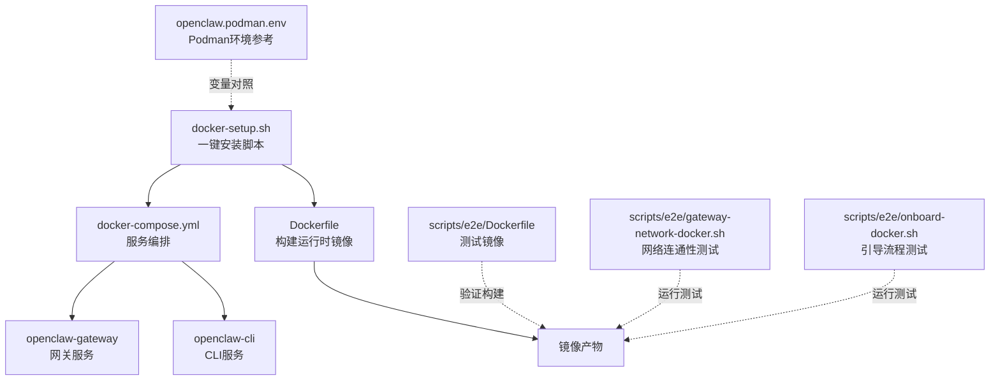
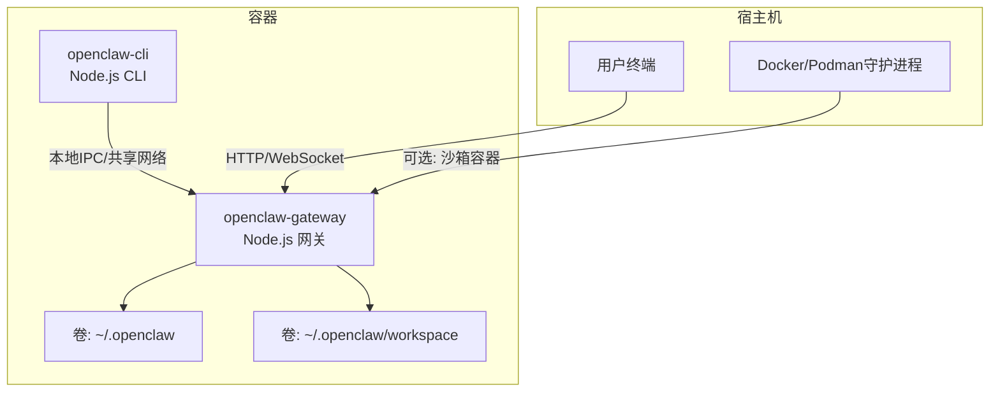
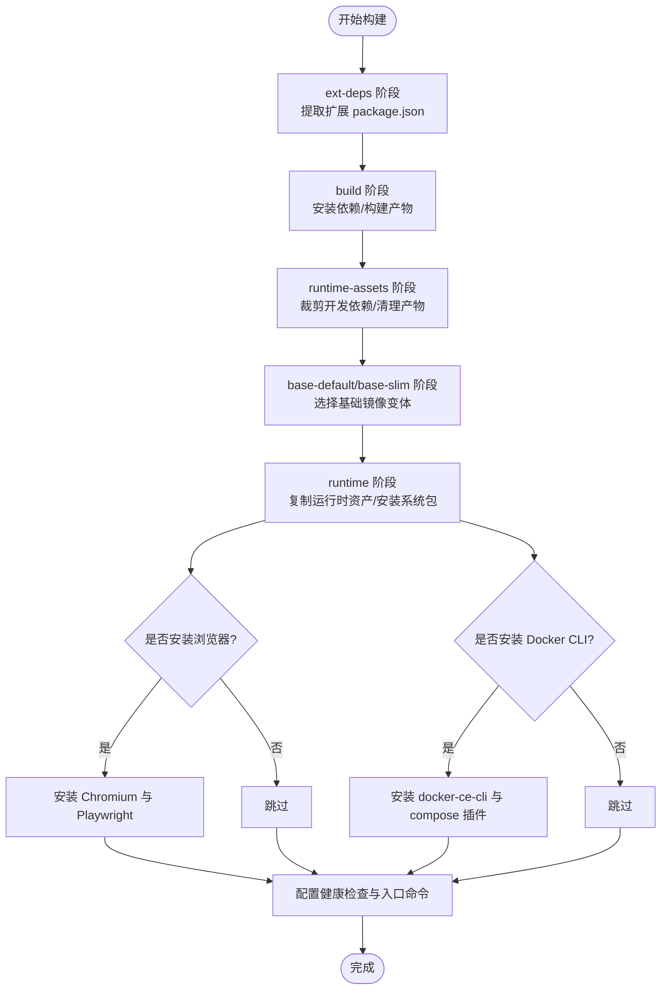
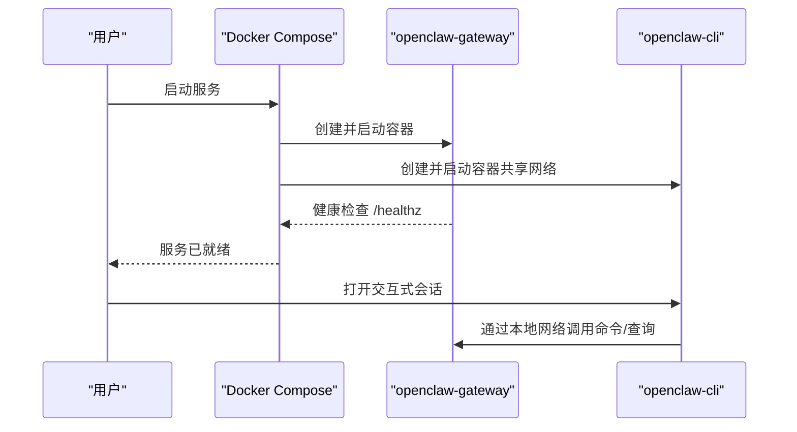
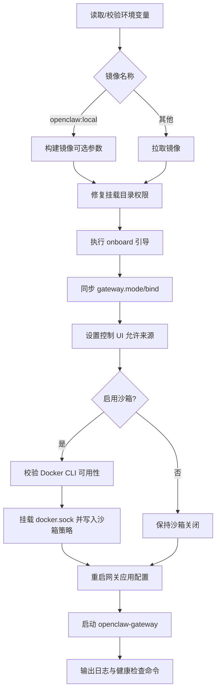
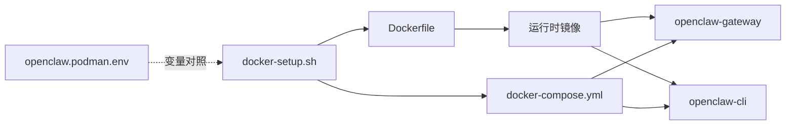

# Docker安装

<cite>
**本文引用的文件**
- [Dockerfile](file://Dockerfile)
- [docker-compose.yml](file://docker-compose.yml)
- [docker-setup.sh](file://docker-setup.sh)
- [openclaw.podman.env](file://openclaw.podman.env)
- [scripts/e2e/Dockerfile](file://scripts/e2e/Dockerfile)
- [scripts/e2e/gateway-network-docker.sh](file://scripts/e2e/gateway-network-docker.sh)
- [scripts/e2e/onboard-docker.sh](file://scripts/e2e/onboard-docker.sh)
</cite>

## 目录

1. [简介](#简介)
2. [项目结构](#项目结构)
3. [核心组件](#核心组件)
4. [架构总览](#架构总览)
5. [详细组件分析](#详细组件分析)
6. [依赖关系分析](#依赖关系分析)
7. [性能与安全考量](#性能与安全考量)
8. [容器管理与运维](#容器管理与运维)
9. [故障排除指南](#故障排除指南)
10. [结论](#结论)

## 简介

本指南面向希望使用Docker（或兼容工具）部署 OpenClaw 的用户，覆盖从镜像构建到容器运行、卷挂载、端口映射、环境变量、数据持久化、健康检查、日志查看与常见问题排查的全流程。文档同时提供 docker-compose 编排与一键脚本两种安装方式，并给出 Podman 环境下的参考配置。

## 项目结构

OpenClaw 提供了多处与容器化相关的文件与脚本，核心包括：

- 单体 Dockerfile：用于构建生产级运行时镜像，支持可选的浏览器与 Docker CLI 安装参数，内置健康检查与非 root 用户运行。
- docker-compose.yml：定义网关与 CLI 服务，包含默认端口映射、卷挂载、健康检查与网络模式。
- docker-setup.sh：一键安装脚本，负责镜像拉取/构建、环境变量注入、权限修复、引导向导、沙箱可选启用与组合编排。
- openclaw.podman.env：Podman 环境参考，便于在 Podman 场景下复用相同变量体系。
- 测试用 Dockerfile 与脚本：用于端到端测试场景的镜像构建与网络连通性验证。

**图表来源**

- [Dockerfile:1-231](file://Dockerfile#L1-L231)
- [docker-compose.yml:1-77](file://docker-compose.yml#L1-L77)
- [docker-setup.sh:1-598](file://docker-setup.sh#L1-L598)
- [openclaw.podman.env:1-25](file://openclaw.podman.env#L1-L25)
- [scripts/e2e/Dockerfile:1-39](file://scripts/e2e/Dockerfile#L1-L39)
- [scripts/e2e/gateway-network-docker.sh:1-146](file://scripts/e2e/gateway-network-docker.sh#L1-L146)
- [scripts/e2e/onboard-docker.sh:1-571](file://scripts/e2e/onboard-docker.sh#L1-L571)

**章节来源**

- [Dockerfile:1-231](file://Dockerfile#L1-L231)
- [docker-compose.yml:1-77](file://docker-compose.yml#L1-L77)
- [docker-setup.sh:1-598](file://docker-setup.sh#L1-L598)
- [openclaw.podman.env:1-25](file://openclaw.podman.env#L1-L25)
- [scripts/e2e/Dockerfile:1-39](file://scripts/e2e/Dockerfile#L1-L39)
- [scripts/e2e/gateway-network-docker.sh:1-146](file://scripts/e2e/gateway-network-docker.sh#L1-L146)
- [scripts/e2e/onboard-docker.sh:1-571](file://scripts/e2e/onboard-docker.sh#L1-L571)

## 核心组件

- 运行时镜像（Dockerfile）
  - 多阶段构建，最终镜像不含构建工具与源码，仅包含运行所需资源。
  - 支持通过构建参数选择变体（默认/精简）、安装浏览器与 Playwright、安装 Docker CLI 以支持沙箱。
  - 健康检查端点：/healthz（存活）与 /readyz（就绪），别名 /health 与 /ready。
  - 默认以非 root 用户运行，降低攻击面。
- 服务编排（docker-compose.yml）
  - openclaw-gateway：网关服务，默认绑定 127.0.0.1，需通过端口映射或 host 网络暴露。
  - openclaw-cli：与网关共享网络，提供交互式 CLI 能力。
  - 卷挂载：配置目录与工作区目录挂载至 /home/node/.openclaw 与 /home/node/.openclaw/workspace。
  - 环境变量：令牌、私有 WS 允许、第三方 Provider 凭据等。
- 一键安装脚本（docker-setup.sh）
  - 自动检测并写入 .env，生成/复用网关令牌，确保宿主挂载目录权限正确。
  - 支持沙箱模式：可选安装 Docker CLI 并挂载宿主 Docker 套接字，按策略配置 agents.defaults.sandbox。
  - 引导向导与控制 UI 允许列表自动配置，随后启动服务。

**章节来源**

- [Dockerfile:103-231](file://Dockerfile#L103-L231)
- [docker-compose.yml:1-77](file://docker-compose.yml#L1-L77)
- [docker-setup.sh:357-598](file://docker-setup.sh#L357-L598)

## 架构总览

下图展示容器化部署的整体架构与关键交互路径。

**图表来源**

- [docker-compose.yml:1-77](file://docker-compose.yml#L1-L77)
- [Dockerfile:216-231](file://Dockerfile#L216-L231)

## 详细组件分析

### 组件A：Dockerfile 构建与运行时特性

- 多阶段构建与变体
  - 支持 OPENCLAW_VARIANT 为 default 或 slim；默认基于 node:22-bookworm，精简版基于 node:22-bookworm-slim。
  - 通过 OPENCLAW_EXTENSIONS 注入扩展依赖解析层，避免无关变更导致缓存失效。
- 运行时增强
  - 可选安装 Chromium 与 Playwright，减少容器启动时的下载开销。
  - 可选安装 Docker CLI，配合沙箱功能启用容器内执行能力。
  - 健康检查：/healthz 与 /readyz，适合容器编排平台的探针。
  - 非 root 用户运行，提升安全性。
- 系统包与工具
  - 在精简镜像上按需安装 procps、hostname、curl、git、openssl 等常用工具。
  - 保留 pnpm 与 Corepack，便于容器内本地工作流。

**图表来源**

- [Dockerfile:27-231](file://Dockerfile#L27-L231)

**章节来源**

- [Dockerfile:1-231](file://Dockerfile#L1-L231)

### 组件B：docker-compose.yml 服务编排

- 服务定义
  - openclaw-gateway：默认绑定 127.0.0.1，需通过端口映射或 host 网络对外暴露；健康检查通过探针访问 /healthz。
  - openclaw-cli：与网关共享网络，提供交互式 CLI 会话。
- 卷挂载
  - 配置目录与工作区目录分别挂载到 /home/node/.openclaw 与 /home/node/.openclaw/workspace。
- 环境变量
  - 包含 HOME、TERM、OPENCLAW_GATEWAY_TOKEN、OPENCLAW_ALLOW_INSECURE_PRIVATE_WS、Provider 凭据等。
- 端口映射
  - 默认映射 18789（网关）、18790（桥接/备用）；可通过环境变量覆盖。

**图表来源**

- [docker-compose.yml:1-77](file://docker-compose.yml#L1-L77)

**章节来源**

- [docker-compose.yml:1-77](file://docker-compose.yml#L1-L77)

### 组件C：docker-setup.sh 一键安装流程

- 功能概览
  - 自动写入 .env，生成/复用网关令牌，确保挂载目录权限正确。
  - 可选启用沙箱：安装 Docker CLI、挂载宿主 Docker 套接字、按策略配置 agents.defaults.sandbox。
  - 引导向导与控制 UI 允许列表自动配置，随后启动网关。
- 关键步骤
  - 参数校验与环境准备：校验挂载路径、命名卷格式、沙箱前置条件。
  - 镜像处理：若镜像名为 openclaw:local 则构建，否则拉取。
  - 权限修复：以 root 身份进入容器修正挂载目录属主，避免 EACCES。
  - 引导与配置：执行 onboard、同步 gateway.mode 与 bind、设置控制 UI 允许来源。
  - 沙箱启用：验证 Docker CLI 可用后挂载 docker.sock 并写入沙箱策略，失败则回滚。
  - 启动服务：启动 openclaw-gateway，并输出日志与健康检查命令提示。

**图表来源**

- [docker-setup.sh:357-598](file://docker-setup.sh#L357-L598)

**章节来源**

- [docker-setup.sh:1-598](file://docker-setup.sh#L1-L598)

### 组件D：Podman 环境参考（openclaw.podman.env）

- 用途：为 Podman 场景提供与 Docker 环境一致的变量命名与默认值，便于跨平台迁移。
- 关键变量：OPENCLAW_GATEWAY_TOKEN、Provider 凭据、宿主端口映射、网关绑定模式等。

**章节来源**

- [openclaw.podman.env:1-25](file://openclaw.podman.env#L1-L25)

### 组件E：端到端测试镜像与脚本

- scripts/e2e/Dockerfile：最小化构建测试镜像，便于在容器中运行端到端测试。
- scripts/e2e/gateway-network-docker.sh：创建独立网络，启动网关容器并验证连接与健康状态。
- scripts/e2e/onboard-docker.sh：在容器中运行引导流程测试，覆盖多种向导场景。

**章节来源**

- [scripts/e2e/Dockerfile:1-39](file://scripts/e2e/Dockerfile#L1-L39)
- [scripts/e2e/gateway-network-docker.sh:1-146](file://scripts/e2e/gateway-network-docker.sh#L1-L146)
- [scripts/e2e/onboard-docker.sh:1-571](file://scripts/e2e/onboard-docker.sh#L1-L571)

## 依赖关系分析

- 构建期依赖
  - Node.js 22（bookworm/bookworm-slim）作为基础镜像。
  - pnpm 与 Corepack 用于依赖安装与包管理器激活。
  - 可选：Chromium/Playwright、Docker CLI。
- 运行期依赖
  - Node.js 运行时与构建产物。
  - 可选：浏览器运行时、Docker 守护进程（沙箱）。
- 编排依赖
  - docker-compose 与 Docker/Podman 守护进程。
  - 可选：宿主 docker.sock 权限组 GID。

**图表来源**

- [Dockerfile:1-231](file://Dockerfile#L1-L231)
- [docker-compose.yml:1-77](file://docker-compose.yml#L1-L77)
- [docker-setup.sh:1-598](file://docker-setup.sh#L1-L598)
- [openclaw.podman.env:1-25](file://openclaw.podman.env#L1-L25)

**章节来源**

- [Dockerfile:1-231](file://Dockerfile#L1-L231)
- [docker-compose.yml:1-77](file://docker-compose.yml#L1-L77)
- [docker-setup.sh:1-598](file://docker-setup.sh#L1-L598)
- [openclaw.podman.env:1-25](file://openclaw.podman.env#L1-L25)

## 性能与安全考量

- 性能
  - 浏览器安装：通过构建参数安装 Chromium 与 Playwright，可显著减少容器首次启动时的下载时间。
  - Docker CLI：在容器内直接使用 docker 命令进行沙箱管理，避免外部依赖。
  - 精简镜像：使用 slim 变体可减小镜像体积，但需注意额外安装系统包的成本。
- 安全
  - 非 root 用户运行，降低逃逸风险。
  - 健康检查端点仅监听本地回环，建议通过 host 网络或显式绑定 0.0.0.0 并配置认证后暴露。
  - 沙箱启用需谨慎：仅在必要时挂载 docker.sock，并严格限制策略（如 workspaceAccess=none）。

[本节为通用指导，无需列出具体文件来源]

## 容器管理与运维

- 拉取镜像
  - 使用 docker-setup.sh（推荐）或直接 docker pull 指定镜像名。
- 构建镜像
  - 若镜像名为 openclaw:local，则通过 docker build 构建；可传入 OPENCLAW_VARIANT、OPENCLAW_EXTENSIONS、OPENCLAW_INSTALL_BROWSER、OPENCLAW_INSTALL_DOCKER_CLI 等参数。
- 启动容器
  - 使用 docker-compose 启动 openclaw-gateway 与 openclaw-cli；或使用 docker-setup.sh 一键完成。
- 卷挂载
  - 配置目录与工作区目录分别挂载到 /home/node/.openclaw 与 /home/node/.openclaw/workspace。
- 端口映射
  - 默认映射 18789（网关）、18790（桥接/备用）；可通过环境变量覆盖。
- 环境变量
  - OPENCLAW_GATEWAY_TOKEN：网关访问令牌。
  - OPENCLAW_ALLOW_INSECURE_PRIVATE_WS：允许不安全私有 WebSocket。
  - Provider 凭据：如 CLAUDE_AI_SESSION_KEY、CLAUDE_WEB_SESSION_KEY、CLAUDE_WEB_COOKIE 等。
- 数据持久化
  - 将宿主目录挂载到 /home/node/.openclaw 与 /home/node/.openclaw/workspace，确保重启后配置与工作区数据不丢失。
- 健康检查
  - 访问 /healthz（存活）与 /readyz（就绪）；或使用 docker compose 健康检查配置。
- 日志查看
  - docker compose logs -f openclaw-gateway 实时查看网关日志。
  - docker compose exec openclaw-gateway 查看健康检查命令示例。

**章节来源**

- [docker-setup.sh:413-428](file://docker-setup.sh#L413-L428)
- [docker-compose.yml:1-77](file://docker-compose.yml#L1-L77)
- [Dockerfile:224-231](file://Dockerfile#L224-L231)

## 故障排除指南

- 网关无法从宿主访问
  - 默认绑定为 127.0.0.1，需通过端口映射或 host 网络暴露；或在 docker-compose 中将 bind 设置为 lan 并配置认证。
- 权限错误（EACCES）
  - 使用 docker-setup.sh 自动修复挂载目录属主；确保宿主目录由 node 用户可写。
- 沙箱不可用
  - 确认镜像已安装 Docker CLI（构建参数 OPENCLAW_INSTALL_DOCKER_CLI=1）；确认宿主 docker.sock 存在且可访问。
- 健康检查失败
  - 检查 /healthz 与 /readyz 端点可达性；核对网关端口映射与防火墙设置。
- 端到端测试失败
  - 使用 scripts/e2e/gateway-network-docker.sh 与 scripts/e2e/onboard-docker.sh 快速定位问题。

**章节来源**

- [docker-setup.sh:430-444](file://docker-setup.sh#L430-L444)
- [docker-setup.sh:497-506](file://docker-setup.sh#L497-L506)
- [scripts/e2e/gateway-network-docker.sh:1-146](file://scripts/e2e/gateway-network-docker.sh#L1-L146)
- [scripts/e2e/onboard-docker.sh:1-571](file://scripts/e2e/onboard-docker.sh#L1-L571)

## 结论

通过 Dockerfile、docker-compose.yml 与 docker-setup.sh 的协同，OpenClaw 提供了从镜像构建到服务编排的一站式容器化安装体验。结合卷挂载与环境变量，用户可在不同平台上快速部署并稳定运行网关与 CLI；在需要时启用沙箱以提升隔离性。建议在生产环境中使用 host 网络或显式绑定 0.0.0.0 并配置强认证，同时定期更新镜像与系统包以保障安全与性能。
