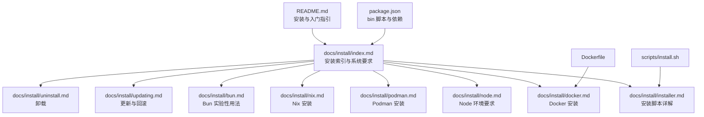
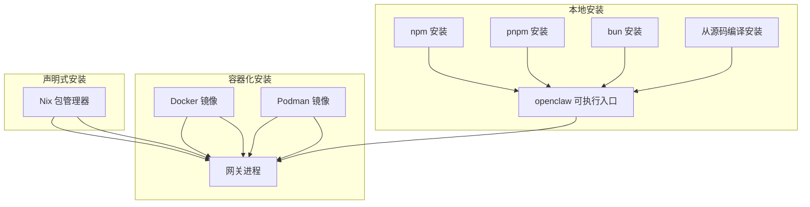
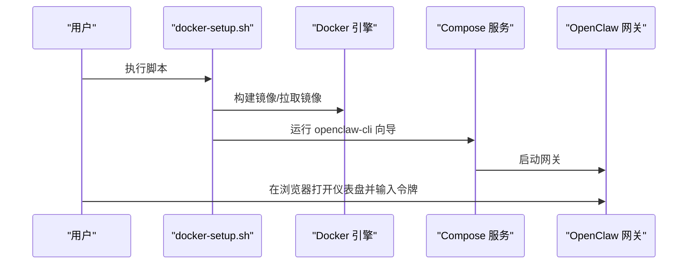
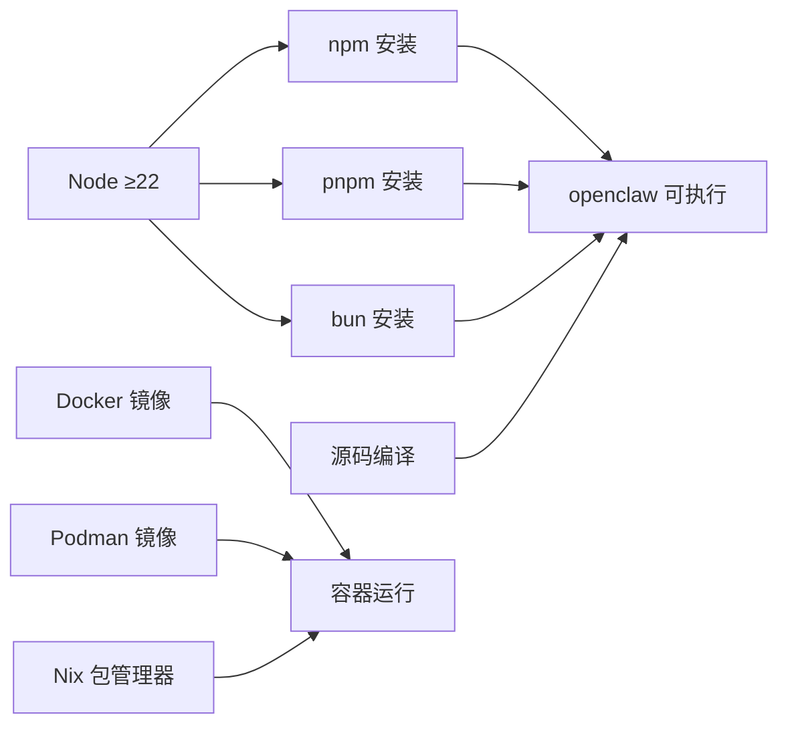

# 安装方法

<cite>
**本文引用的文件**
- [README.md](file://README.md)
- [package.json](file://package.json)
- [docs/install/index.md](file://docs/install/index.md)
- [docs/install/docker.md](file://docs/install/docker.md)
- [docs/install/nix.md](file://docs/install/nix.md)
- [docs/install/bun.md](file://docs/install/bun.md)
- [docs/install/node.md](file://docs/install/node.md)
- [docs/install/installer.md](file://docs/install/installer.md)
- [docs/install/updating.md](file://docs/install/updating.md)
- [docs/install/uninstall.md](file://docs/install/uninstall.md)
- [docs/install/podman.md](file://docs/install/podman.md)
- [Dockerfile](file://Dockerfile)
- [scripts/install.sh](file://scripts/install.sh)
</cite>

## 目录

1. [简介](#简介)
2. [项目结构](#项目结构)
3. [核心组件](#核心组件)
4. [架构总览](#架构总览)
5. [详细组件分析](#详细组件分析)
6. [依赖分析](#依赖分析)
7. [性能考虑](#性能考虑)
8. [故障排查指南](#故障排查指南)
9. [结论](#结论)
10. [附录](#附录)

## 简介

本指南面向不同技术水平的用户，系统梳理 OpenClaw 的多种安装方式与最佳实践，包括包管理器安装（npm、pnpm、bun）、Docker/Podman 容器化安装、Nix 声明式安装、从源码编译安装等。同时提供安装验证、版本选择与升级策略、以及常见问题排查建议，帮助你在本地或服务器环境中快速、稳定地部署 OpenClaw。

## 项目结构

- 核心入口与运行时：通过 CLI 入口脚本与打包产物提供命令行能力；包管理器安装后可直接使用 openclaw 命令。
- 文档与安装指引：docs/install 下包含各平台与方式的安装说明与进阶用法。
- 容器化支持：Dockerfile 提供多阶段构建与运行时镜像，支持 Docker 与 Podman。
- 安装脚本：scripts/install.sh 提供交互式安装流程，自动处理 Node 检测、依赖安装与向导引导。

图表来源

- [README.md](file://README.md)
- [docs/install/index.md](file://docs/install/index.md)
- [docs/install/installer.md](file://docs/install/installer.md)
- [docs/install/node.md](file://docs/install/node.md)
- [docs/install/docker.md](file://docs/install/docker.md)
- [docs/install/podman.md](file://docs/install/podman.md)
- [docs/install/nix.md](file://docs/install/nix.md)
- [docs/install/bun.md](file://docs/install/bun.md)
- [docs/install/updating.md](file://docs/install/updating.md)
- [docs/install/uninstall.md](file://docs/install/uninstall.md)
- [Dockerfile](file://Dockerfile)
- [scripts/install.sh](file://scripts/install.sh)
- [package.json](file://package.json)

章节来源

- [README.md](file://README.md)
- [docs/install/index.md](file://docs/install/index.md)

## 核心组件

- CLI 入口与二进制分发
  - package.json 中定义了 openclaw 的可执行入口与打包产物路径，便于通过 npm/pnpm/bun 安装后直接调用。
- 安装脚本
  - scripts/install.sh 支持 macOS/Linux/WSL 平台，自动检测 Node 版本、必要工具与包管理器，提供交互式与非交互式安装模式。
- 容器镜像
  - Dockerfile 使用多阶段构建，产出基于 node:22-bookworm 的轻量运行时镜像，并内置健康检查与启动参数。

章节来源

- [package.json](file://package.json)
- [scripts/install.sh](file://scripts/install.sh)
- [Dockerfile](file://Dockerfile)

## 架构总览

下图展示 OpenClaw 的安装与运行架构，涵盖本地安装、容器化部署与声明式安装三条主线：

图表来源

- [package.json](file://package.json)
- [docs/install/docker.md](file://docs/install/docker.md)
- [docs/install/podman.md](file://docs/install/podman.md)
- [docs/install/nix.md](file://docs/install/nix.md)

## 详细组件分析

### 包管理器安装（npm、pnpm、bun）

- npm 安装
  - 优点：生态成熟、广泛支持、一键全局安装。
  - 适用场景：大多数开发者与生产环境首选。
  - 步骤要点：确保 Node ≥22；若 sharp 构建失败，可设置 SHARP_IGNORE_GLOBAL_LIBVIPS=1 或安装构建工具。
- pnpm 安装
  - 优点：磁盘占用小、安装速度快、严格锁定。
  - 适用场景：对依赖体积敏感的开发与 CI 环境。
  - 步骤要点：首次安装会提示构建脚本批准，按提示执行 approve-builds。
- bun 安装
  - 说明：仓库文档标注为实验性，不推荐用于 Gateway 运行（WhatsApp/Telegram 存在兼容问题）。
  - 适用场景：仅限本地 TypeScript 直跑与快速迭代。

安装验证

- 执行 openclaw doctor、status、dashboard，确认服务状态与控制界面可用。

升级与版本选择

- 通过 openclaw update 切换通道（stable/beta/dev），或指定 dist-tag/版本号。
- 更新后运行 doctor 与健康检查，必要时重启网关。

章节来源

- [docs/install/index.md](file://docs/install/index.md)
- [docs/install/bun.md](file://docs/install/bun.md)
- [docs/install/updating.md](file://docs/install/updating.md)

### Docker 安装

- 适用场景
  - 需要隔离环境、快速验证、CI/CD 流水线、无本地依赖的主机。
- 快速开始
  - 使用仓库提供的 docker-setup.sh 脚本完成镜像构建、向导引导、网关启动与令牌生成。
  - 支持启用代理沙箱（agents.defaults.sandbox），并可挂载额外目录与持久化家目录。
- 运行时行为
  - 默认以非 root 用户运行，内置健康检查端点；支持通过环境变量注入系统依赖与浏览器缓存。
- 注意事项
  - Docker 桥接网络下，loopback 绑定可能无法从宿主访问；可通过 host 网络或将 bind 设为 lan 并配置认证。
  - 权限问题需确保宿主挂载目录属主匹配容器内 node 用户（uid 1000）。

图表来源

- [docs/install/docker.md](file://docs/install/docker.md)
- [Dockerfile](file://Dockerfile)

章节来源

- [docs/install/docker.md](file://docs/install/docker.md)
- [Dockerfile](file://Dockerfile)

### Podman 安装

- 适用场景
  - 偏好 rootless 容器、无需守护进程的环境。
- 快速开始
  - 通过 setup-podman.sh 创建专用 openclaw 用户、构建镜像、生成启动脚本与可选 systemd Quadlet 单元。
  - 支持以 openclaw 用户或自定义用户运行容器，映射宿主配置与工作区。
- 运行时行为
  - 默认使用 --userns=keep-id，容器内进程 UID/GID 与宿主一致；注意权限与子 UID/GID 范围配置。

章节来源

- [docs/install/podman.md](file://docs/install/podman.md)

### Nix 安装

- 适用场景
  - 已使用 Nix/NixOS/Home Manager 的用户，追求可复现、可回滚的声明式安装。
- 快速开始
  - 推荐使用 nix-openclaw 仓库提供的模块，一键生成模板、配置密钥与 Home Manager 切换。
  - 通过 OPENCLAW_NIX_MODE=1 或 macOS defaults 开启 Nix 模式，禁用自动安装与自更新流程。
- 行为差异
  - 配置与状态路径需显式指向 Nix 管理位置；运行时显示只读 Nix 模式提示。

章节来源

- [docs/install/nix.md](file://docs/install/nix.md)

### 从源码编译安装

- 适用场景
  - 贡献者、需要定制化修改或本地开发调试的用户。
- 步骤要点
  - 克隆仓库后使用 pnpm 安装依赖、构建 UI 与主程序，再进行链接或直接通过 pnpm openclaw ... 调用。
  - 首次运行需执行 openclaw onboard 并安装守护进程服务。

章节来源

- [docs/install/index.md](file://docs/install/index.md)
- [README.md](file://README.md)

### 安装验证、版本选择与升级

- 安装验证
  - openclaw doctor：修复迁移、审计配置、健康检查与服务迁移。
  - openclaw status/dashboard：确认网关状态与控制界面。
- 版本选择
  - 通道：stable（发布标签）、beta（预发布标签）、dev（main 分支 HEAD）。
  - 通过 openclaw update --channel 或 npm/pnpm 指定 dist-tag/版本号。
- 升级策略
  - 优先重跑官网安装脚本进行就地升级；源码安装使用 openclaw update 或 git pull + 重新构建。
  - 更新后运行 doctor 与健康检查，必要时重启网关。

章节来源

- [docs/install/index.md](file://docs/install/index.md)
- [docs/install/updating.md](file://docs/install/updating.md)

## 依赖分析

- Node 运行时
  - 最低版本要求：Node ≥22；安装脚本会自动检测与安装。
- 包管理器
  - npm：最简路径；pnpm：更严格的依赖锁定；bun：实验性，不建议用于生产网关。
- 容器运行时
  - Docker/Podman：Dockerfile 提供多阶段构建与运行时镜像；Podman 使用相同镜像，支持 rootless 与 systemd Quadlet。
- 依赖安装辅助
  - 安装脚本可自动识别缺失的构建工具并尝试安装（Linux/macOS），减少首次安装阻塞。

图表来源

- [docs/install/node.md](file://docs/install/node.md)
- [docs/install/index.md](file://docs/install/index.md)
- [docs/install/docker.md](file://docs/install/docker.md)
- [docs/install/podman.md](file://docs/install/podman.md)
- [docs/install/nix.md](file://docs/install/nix.md)
- [scripts/install.sh](file://scripts/install.sh)

章节来源

- [docs/install/node.md](file://docs/install/node.md)
- [docs/install/index.md](file://docs/install/index.md)
- [scripts/install.sh](file://scripts/install.sh)

## 性能考虑

- 容器镜像
  - 多阶段构建减少运行时体积；默认非 root 用户降低攻击面；可按需预装系统依赖与浏览器缓存以避免启动时下载。
- 包管理器
  - pnpm 依赖复用与缓存提升安装速度；bun 适合本地 TypeScript 直跑但不建议用于生产网关。
- 源码安装
  - 首次构建耗时较长，后续增量编译与热重载可加速开发迭代。

## 故障排查指南

- openclaw 命令未找到
  - 检查 npm prefix -g 输出是否在 PATH 中；在 macOS/Linux 添加到 ~/.zshrc 或 ~/.bashrc；Windows 在系统环境变量中添加。
- npm 权限错误（Linux）
  - 将 npm 全局前缀切换至用户可写目录并追加到 PATH。
- sharp/libvips 构建失败
  - 设置 SHARP_IGNORE_GLOBAL_LIBVIPS=1 或安装构建工具链。
- Docker/Podman 权限与绑定
  - 确保宿主挂载目录属主匹配容器内 node 用户（uid 1000）；如需从宿主访问网关，将 bind 设为 lan 并配置认证。
- 安装脚本问题
  - 使用 --verbose 查看详细日志；必要时手动安装构建工具或调整环境变量。

章节来源

- [docs/install/node.md](file://docs/install/node.md)
- [docs/install/docker.md](file://docs/install/docker.md)
- [docs/install/podman.md](file://docs/install/podman.md)
- [docs/install/installer.md](file://docs/install/installer.md)

## 结论

- 对普通用户：推荐使用官网安装脚本（install.sh）或包管理器（npm/pnpm）进行本地安装，快速完成向导与服务安装。
- 对运维与 CI：优先采用 Docker/Podman 容器化部署，结合健康检查与持久化存储，确保一致性与可维护性。
- 对高级用户：Nix 声明式安装适合追求可复现与可回滚的环境；从源码安装适合贡献者与深度定制场景。
- 无论采用哪种方式，都应遵循安装验证、版本选择与升级策略的最佳实践，定期运行 doctor 与健康检查，保障系统稳定运行。

## 附录

- 卸载
  - 若 CLI 仍可用，使用 openclaw uninstall；否则根据操作系统手动移除服务与数据目录。
- 常用命令参考
  - openclaw doctor、status、gateway restart、logs --follow、dashboard。

章节来源

- [docs/install/uninstall.md](file://docs/install/uninstall.md)
- [docs/install/index.md](file://docs/install/index.md)
