# 安装验证与测试

<cite>
**本文档引用的文件**
- [README.md](file://README.md)
- [install/index.md](file://docs/install/index.md)
- [install/installer.md](file://docs/install/installer.md)
- [install.sh](file://scripts/install.sh)
- [install.ps1](file://scripts/install.ps1)
- [cli/index.md](file://docs/cli/index.md)
- [cli/doctor.md](file://docs/cli/doctor.md)
- [cli/status.md](file://docs/cli/status.md)
- [cli/logs.md](file://docs/cli/logs.md)
- [cli/gateway.md](file://docs/cli/gateway.md)
- [systemd/openclaw-auth-monitor.service](file://scripts/systemd/openclaw-auth-monitor.service)
- [systemd/openclaw-auth-monitor.timer](file://scripts/systemd/openclaw-auth-monitor.timer)
- [uninstall.md](file://docs/install/uninstall.md)
</cite>

## 目录

1. [简介](#简介)
2. [项目结构](#项目结构)
3. [核心组件](#核心组件)
4. [架构总览](#架构总览)
5. [详细组件分析](#详细组件分析)
6. [依赖关系分析](#依赖关系分析)
7. [性能考虑](#性能考虑)
8. [故障排除指南](#故障排除指南)
9. [结论](#结论)
10. [附录](#附录)

## 简介

本指南面向安装后的OpenClaw用户，提供系统化的验证与测试流程，涵盖安装正确性确认、基础功能测试、配置验证、常用CLI命令验证、服务状态检查、日志查看以及常见安装问题的诊断与修复步骤。目标是帮助你在最短时间内确认OpenClaw已正确安装并可正常运行。

## 项目结构

OpenClaw通过统一的CLI入口提供安装、运行、诊断与维护能力。安装验证涉及以下关键路径：

- 安装脚本：支持macOS/Linux/WSL与Windows，自动检测并安装Node.js、Git，执行npm或git安装，并可选择运行向导。
- CLI参考：提供doctor、status、logs、gateway等子命令用于健康检查、状态查询与日志追踪。
- 系统服务：在Linux上使用systemd管理Gateway服务；提供定时任务监控认证过期。
- 卸载文档：提供一键卸载与手动清理步骤。

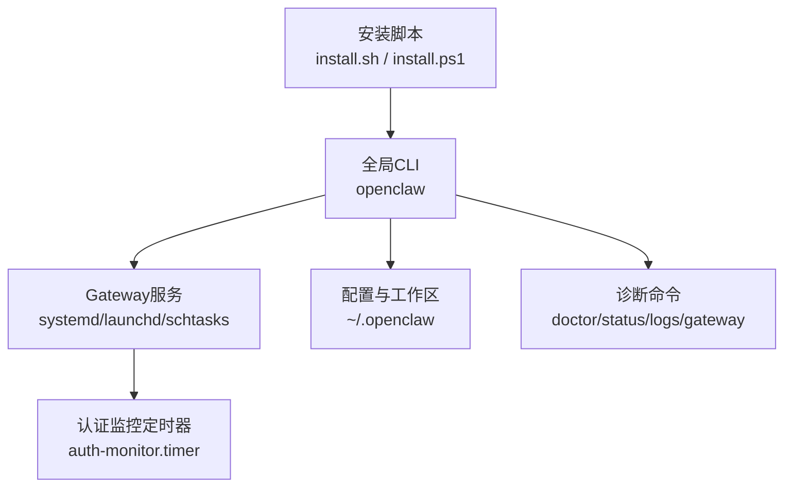

图表来源

- [install.sh:1-800](file://scripts/install.sh#L1-L800)
- [install.ps1:1-330](file://scripts/install.ps1#L1-L330)
- [cli/index.md:1-800](file://docs/cli/index.md#L1-L800)
- [systemd/openclaw-auth-monitor.timer:1-11](file://scripts/systemd/openclaw-auth-monitor.timer#L1-L11)

章节来源

- [README.md:1-560](file://README.md#L1-L560)
- [install/index.md:1-219](file://docs/install/index.md#L1-L219)
- [install/installer.md:1-406](file://docs/install/installer.md#L1-L406)

## 核心组件

- 安装脚本（install.sh / install.ps1）：负责Node.js/Git检测与安装、OpenClaw安装（npm或git）、环境变量设置、PATH修正与可选的向导启动。
- CLI命令集：doctor（健康检查与快速修复）、status（通道与会话诊断）、logs（远程文件日志跟踪）、gateway（运行、查询、发现与服务管理）。
- 系统服务与定时任务：Linux下systemd用户服务与定时器，监控认证令牌过期。
- 卸载工具：一键卸载与手动清理指南，确保服务、状态、工作区与CLI完全移除。

章节来源

- [install.sh:1-800](file://scripts/install.sh#L1-L800)
- [install.ps1:1-330](file://scripts/install.ps1#L1-L330)
- [cli/index.md:1-800](file://docs/cli/index.md#L1-L800)
- [systemd/openclaw-auth-monitor.timer:1-11](file://scripts/systemd/openclaw-auth-monitor.timer#L1-L11)

## 架构总览

OpenClaw的安装验证围绕“CLI → Gateway服务 → 配置/工作区”的链路展开。安装脚本完成环境准备与CLI安装；doctor/status/logs/gateway命令用于验证服务状态与运行状况；systemd定时器辅助监控认证有效性。

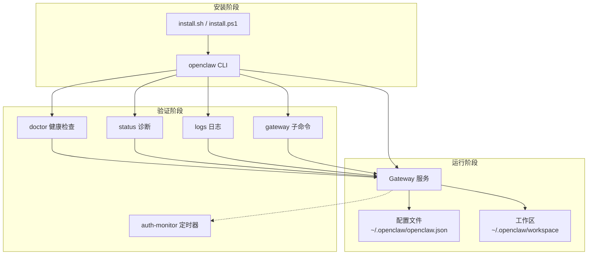

图表来源

- [install.sh:1-800](file://scripts/install.sh#L1-L800)
- [install.ps1:1-330](file://scripts/install.ps1#L1-L330)
- [cli/index.md:1-800](file://docs/cli/index.md#L1-L800)
- [systemd/openclaw-auth-monitor.timer:1-11](file://scripts/systemd/openclaw-auth-monitor.timer#L1-L11)

## 详细组件分析

### 安装脚本验证（install.sh）

- 自动检测操作系统与架构，必要时安装Node.js（macOS通过Homebrew，Linux通过包管理器脚本，WSL支持），并安装Git。
- 支持npm与git两种安装方式，默认npm；git方式会在本地构建并生成包装器。
- 提供非交互模式（--no-prompt/--no-onboard）与调试模式（--verbose），便于自动化部署。
- 在升级或git安装后尝试运行doctor进行健康检查。

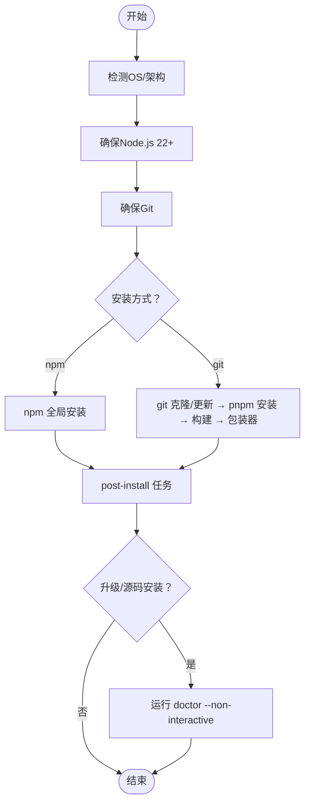

图表来源

- [install.sh:67-88](file://scripts/install.sh#L67-L88)
- [install/installer.md:67-124](file://docs/install/installer.md#L67-L124)

章节来源

- [install.sh:1-800](file://scripts/install.sh#L1-L800)
- [install/installer.md:61-164](file://docs/install/installer.md#L61-L164)

### Windows安装脚本验证（install.ps1）

- 检测PowerShell执行策略，必要时临时提升为RemoteSigned以允许npm脚本运行。
- 自动安装Node.js（winget → Chocolatey → Scoop），并安装Git。
- 支持npm与git两种安装方式；git方式在Windows下同样生成.cmd包装器。
- 将npm全局bin目录加入用户PATH，并在升级或git安装后尝试doctor。

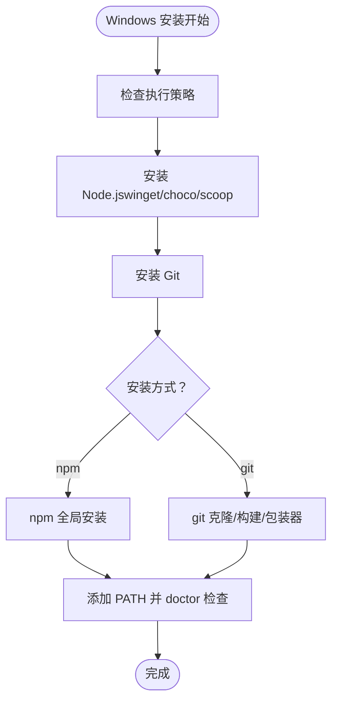

图表来源

- [install.ps1:56-327](file://scripts/install.ps1#L56-L327)
- [install/installer.md:246-324](file://docs/install/installer.md#L246-L324)

章节来源

- [install.ps1:1-330](file://scripts/install.ps1#L1-L330)
- [install/installer.md:246-324](file://docs/install/installer.md#L246-L324)

### CLI健康检查与诊断（doctor）

- 作用：对配置、网关与通道进行健康检查，并提供快速修复建议。
- 常用选项：--repair/--fix（写入备份并清理未知键）、--deep（扫描系统服务）、--non-interactive（自动化场景）。
- 注意：在TTY环境下才显示交互提示；macOS launchctl环境变量可能覆盖配置导致“未授权”错误，需检查并清理。

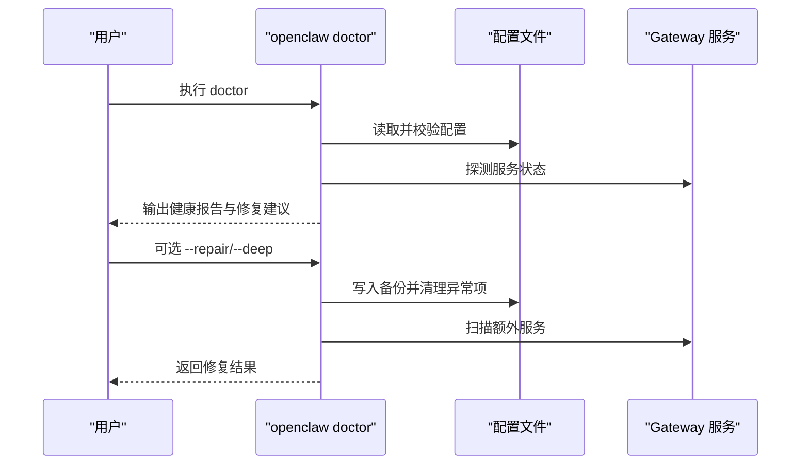

图表来源

- [cli/doctor.md:1-46](file://docs/cli/doctor.md#L1-L46)
- [cli/index.md:401-411](file://docs/cli/index.md#L401-L411)

章节来源

- [cli/doctor.md:1-46](file://docs/cli/doctor.md#L1-L46)
- [cli/index.md:401-411](file://docs/cli/index.md#L401-L411)

### 状态与通道诊断（status）

- 作用：快速诊断通道与会话健康，支持--deep进行实时探测，--usage显示模型提供商用量。
- 输出包含网关与节点主机服务状态概览，多代理配置下的会话存储信息，以及更新通道与版本信息。

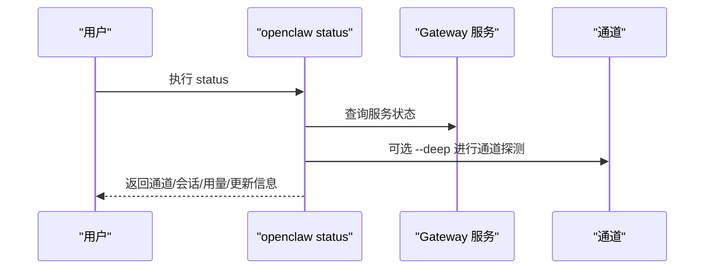

图表来源

- [cli/status.md:1-29](file://docs/cli/status.md#L1-L29)
- [cli/index.md:648-661](file://docs/cli/index.md#L648-L661)

章节来源

- [cli/status.md:1-29](file://docs/cli/status.md#L1-L29)
- [cli/index.md:648-661](file://docs/cli/index.md#L648-L661)

### 日志查看（logs）

- 作用：通过RPC远程跟踪Gateway文件日志，支持--json输出结构化日志，--local-time按本地时区显示时间戳。
- 适用于远程环境无需SSH即可查看日志。

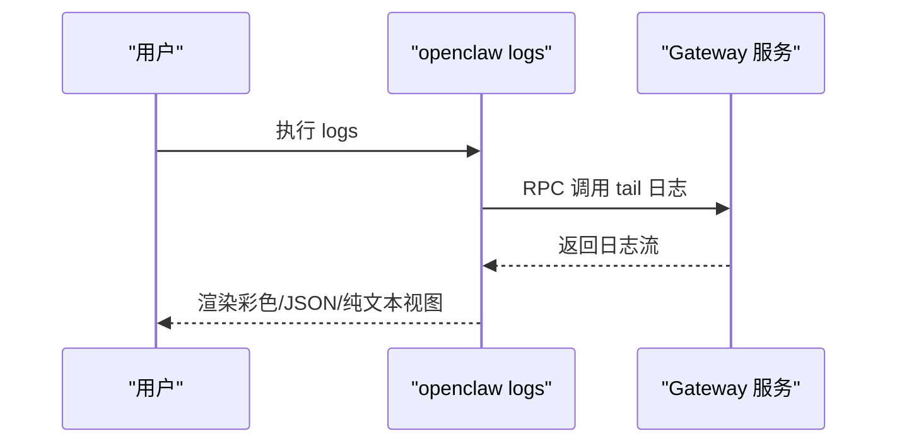

图表来源

- [cli/logs.md:1-29](file://docs/cli/logs.md#L1-L29)
- [cli/index.md:791-799](file://docs/cli/index.md#L791-L799)

章节来源

- [cli/logs.md:1-29](file://docs/cli/logs.md#L1-L29)
- [cli/index.md:791-799](file://docs/cli/index.md#L791-L799)

### Gateway服务管理与发现（gateway）

- 作用：运行、查询、发现Gateway服务，管理服务生命周期（install/start/stop/restart/uninstall），支持Bonjour发现与SSH隧道探测。
- 常用子命令：health/status/probe/call/discover/service管理。

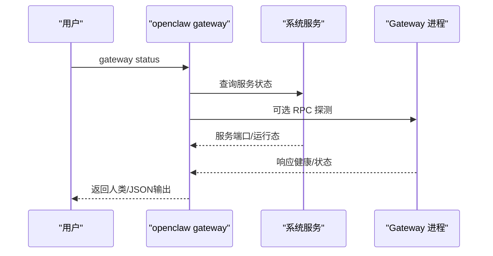

图表来源

- [cli/gateway.md:85-127](file://docs/cli/gateway.md#L85-L127)
- [cli/index.md:740-790](file://docs/cli/index.md#L740-L790)

章节来源

- [cli/gateway.md:1-215](file://docs/cli/gateway.md#L1-L215)
- [cli/index.md:740-790](file://docs/cli/index.md#L740-L790)

### 认证监控定时任务（systemd）

- 作用：每30分钟检查一次认证令牌过期情况，开机后5分钟开始计时。
- 适用于Linux用户态服务，确保长期运行稳定性。

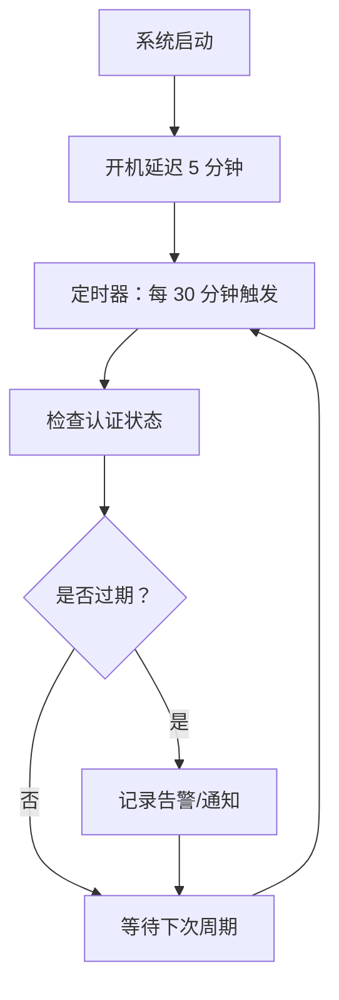

图表来源

- [systemd/openclaw-auth-monitor.timer:1-11](file://scripts/systemd/openclaw-auth-monitor.timer#L1-L11)
- [systemd/openclaw-auth-monitor.service](file://scripts/systemd/openclaw-auth-monitor.service)

章节来源

- [systemd/openclaw-auth-monitor.timer:1-11](file://scripts/systemd/openclaw-auth-monitor.timer#L1-L11)

### 卸载与清理（uninstall）

- 一键卸载：停止服务、卸载服务、删除状态与工作区、移除CLI安装。
- 手动清理：针对CLI缺失但服务仍在运行的情况，提供macOS/Linux/Windows平台的清理步骤。

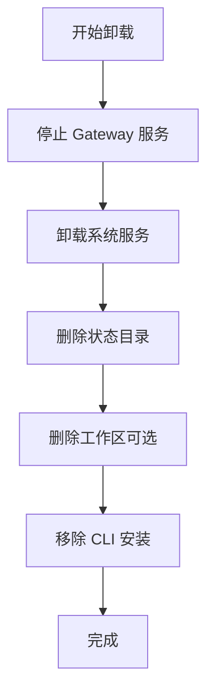

图表来源

- [uninstall.md:16-76](file://docs/install/uninstall.md#L16-L76)

章节来源

- [uninstall.md:1-129](file://docs/install/uninstall.md#L1-L129)

## 依赖关系分析

- 安装脚本依赖Node.js与Git；Windows脚本还依赖PowerShell执行策略。
- CLI命令依赖Gateway服务可达（默认本地回环），可通过--url/--token/--password覆盖探测参数。
- doctor/status/logs/gateway等命令均通过WebSocket RPC与Gateway通信，需要正确的认证配置。
- systemd定时器与服务配合，确保认证状态持续监控。

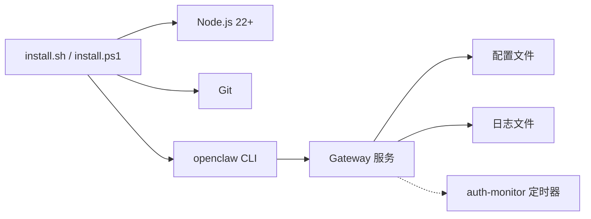

图表来源

- [install.sh:67-88](file://scripts/install.sh#L67-L88)
- [install.ps1:102-200](file://scripts/install.ps1#L102-L200)
- [cli/index.md:740-790](file://docs/cli/index.md#L740-L790)
- [systemd/openclaw-auth-monitor.timer:1-11](file://scripts/systemd/openclaw-auth-monitor.timer#L1-L11)

章节来源

- [install.sh:1-800](file://scripts/install.sh#L1-L800)
- [install.ps1:1-330](file://scripts/install.ps1#L1-L330)
- [cli/index.md:1-800](file://docs/cli/index.md#L1-L800)

## 性能考虑

- 使用--json与--no-color可减少TTY渲染开销，适合自动化与日志处理。
- doctor/status/logs等命令在TTY与非TTY环境采用不同输出样式，避免不必要的ANSI转义。
- gateway子命令支持超时控制与期望最终响应，避免长时间阻塞。

## 故障排除指南

- openclaw命令不可用（PATH问题）
  - macOS/Linux：确认npm前缀bin在PATH中，或在shell启动文件追加export PATH="$(npm prefix -g)/bin:$PATH"。
  - Windows：执行npm config get prefix，将输出目录加入用户PATH。
- macOS：launchctl环境变量覆盖导致“未授权”
  - 使用launchctl getenv检查OPENCLAW_GATEWAY_TOKEN/PASSWORD，必要时unsetenv清除。
- Windows：执行策略限制
  - install.ps1会尝试将当前进程执行策略设为RemoteSigned；若失败，请以管理员身份设置LocalMachine级别。
- 安装失败（sharp/libvips）
  - install.sh默认设置SHARP_IGNORE_GLOBAL_LIBVIPS=1；如需系统libvips，请显式设置为0并安装构建工具。
- 升级后健康检查
  - 使用openclaw doctor --deep扫描系统服务与配置，doctor会自动备份并清理未知键。

章节来源

- [install/index.md:181-204](file://docs/install/index.md#L181-L204)
- [cli/doctor.md:35-45](file://docs/cli/doctor.md#L35-L45)
- [install/installer.md:362-405](file://docs/install/installer.md#L362-L405)

## 结论

通过安装脚本、CLI命令与系统服务的协同，OpenClaw提供了完整的安装验证与运维能力。建议按“安装→doctor→status→logs→gateway”的顺序进行验证，结合systemd定时器与卸载文档，确保长期稳定运行。

## 附录

### 常用CLI命令清单与用途

- openclaw doctor：健康检查与快速修复
- openclaw status：通道与会话诊断（支持--deep/--usage）
- openclaw logs：远程文件日志跟踪（支持--json/--local-time）
- openclaw gateway health/status/probe：服务健康与发现
- openclaw gateway install/start/stop/restart/uninstall：服务生命周期管理
- openclaw uninstall：一键卸载（含服务与数据）

章节来源

- [cli/index.md:1-800](file://docs/cli/index.md#L1-L800)
- [uninstall.md:1-129](file://docs/install/uninstall.md#L1-L129)
