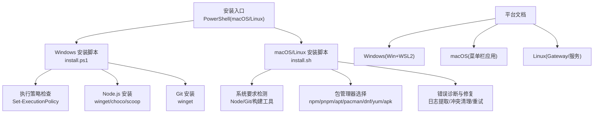
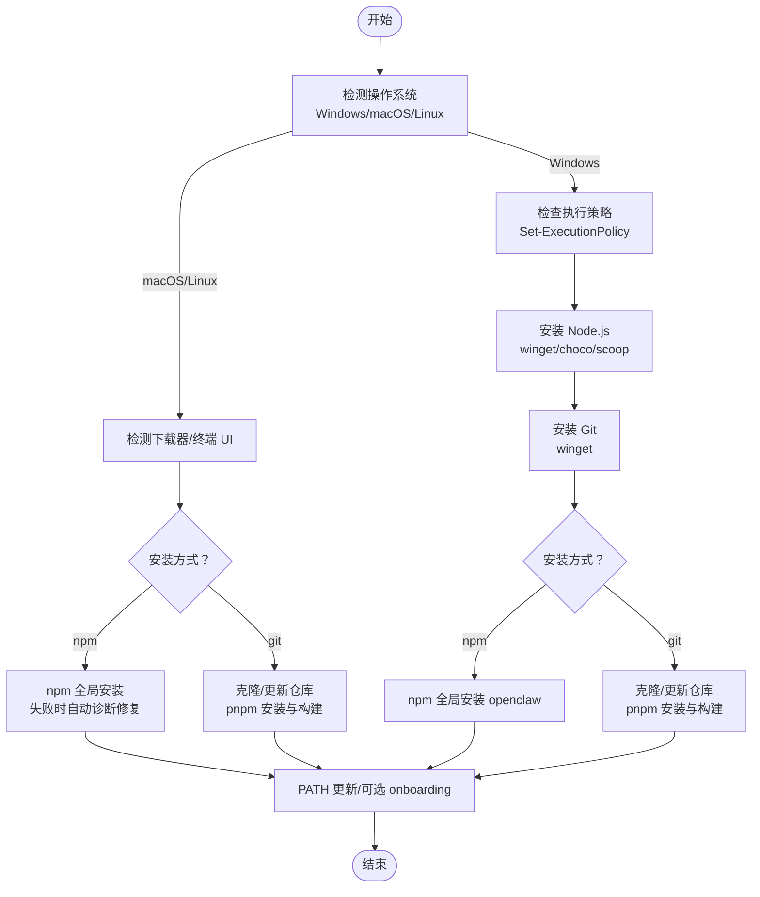
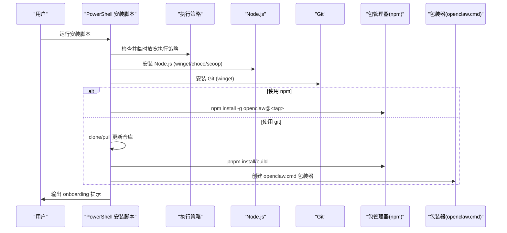
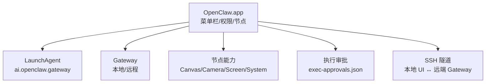
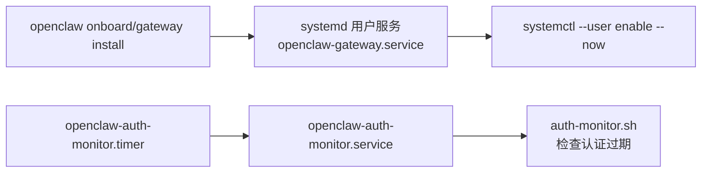
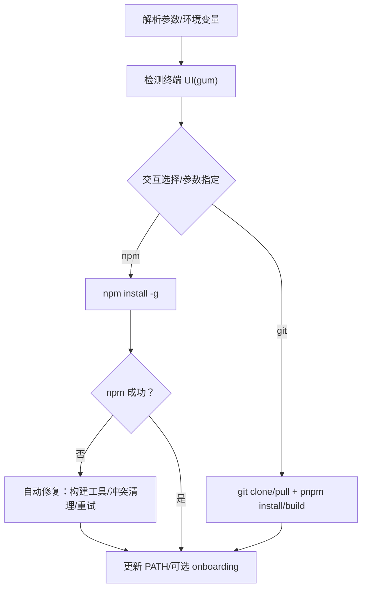
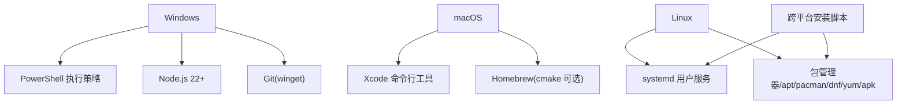

# 平台特定安装

<cite>
**本文档引用的文件**
- [scripts/install.ps1](file://scripts/install.ps1)
- [scripts/install.sh](file://scripts/install.sh)
- [docs/platforms/windows.md](file://docs/platforms/windows.md)
- [docs/platforms/macos.md](file://docs/platforms/macos.md)
- [docs/platforms/linux.md](file://docs/platforms/linux.md)
- [scripts/systemd/openclaw-auth-monitor.service](file://scripts/systemd/openclaw-auth-monitor.service)
- [scripts/systemd/openclaw-auth-monitor.timer](file://scripts/systemd/openclaw-auth-monitor.timer)
- [src/daemon/systemd.ts](file://src/daemon/systemd.ts)
</cite>

## 目录

1. [简介](#简介)
2. [项目结构](#项目结构)
3. [核心组件](#核心组件)
4. [架构总览](#架构总览)
5. [详细组件分析](#详细组件分析)
6. [依赖关系分析](#依赖关系分析)
7. [性能考虑](#性能考虑)
8. [故障排除指南](#故障排除指南)
9. [结论](#结论)

## 简介

本指南聚焦于各平台特定的安装与配置方法，覆盖 Windows PowerShell 安装、macOS 应用与系统集成、以及 Linux 发行版安装与服务管理。内容基于仓库中的官方安装脚本与平台文档，提供可操作的步骤、平台特有配置项、权限与服务注册要点，帮助用户在不同操作系统上完成 OpenClaw 的安装与运行。

## 项目结构

围绕平台安装的关键文件与文档分布如下：

- Windows：PowerShell 安装脚本与平台说明文档
- macOS：应用功能、LaunchAgent 管理、权限与节点能力说明
- Linux：安装流程、Gateway 服务安装与 systemd 用户服务
- 跨平台：通用安装脚本（macOS/Linux），包含包管理器检测、构建工具自动安装、错误诊断等

图表来源

- [scripts/install.ps1:1-330](file://scripts/install.ps1#L1-L330)
- [scripts/install.sh:1-1200](file://scripts/install.sh#L1-L1200)
- [docs/platforms/windows.md:1-204](file://docs/platforms/windows.md#L1-L204)
- [docs/platforms/macos.md:1-227](file://docs/platforms/macos.md#L1-L227)
- [docs/platforms/linux.md:1-95](file://docs/platforms/linux.md#L1-L95)

章节来源

- [scripts/install.ps1:1-330](file://scripts/install.ps1#L1-L330)
- [scripts/install.sh:1-1200](file://scripts/install.sh#L1-L1200)
- [docs/platforms/windows.md:1-204](file://docs/platforms/windows.md#L1-L204)
- [docs/platforms/macos.md:1-227](file://docs/platforms/macos.md#L1-L227)
- [docs/platforms/linux.md:1-95](file://docs/platforms/linux.md#L1-L95)

## 核心组件

- Windows 安装脚本（PowerShell）
  - 执行策略检查与临时放宽
  - 自动安装 Node.js（winget/choco/scoop）与 Git
  - 支持 npm 与 git 源两种安装方式
  - 将全局 npm bin 写入 PATH
- macOS/Linux 安装脚本（Bash）
  - 自动检测 OS/架构，下载并校验 gum（可选 UI）
  - 交互式安装方法选择（git/npm）
  - 包管理器检测与构建工具自动安装（apt/pacman/dnf/yum/apk/macOS）
  - npm 失败时的诊断与自动修复（清理冲突、重试、提示）
- 平台文档
  - Windows：WSL2 推荐、Gateway 服务安装与开机自启链路
  - macOS：菜单栏应用、LaunchAgent、权限与节点能力、远程连接
  - Linux：Gateway 服务安装、systemd 用户服务最小示例

章节来源

- [scripts/install.ps1:42-330](file://scripts/install.ps1#L42-L330)
- [scripts/install.sh:108-1200](file://scripts/install.sh#L108-L1200)
- [docs/platforms/windows.md:19-204](file://docs/platforms/windows.md#L19-L204)
- [docs/platforms/macos.md:1-227](file://docs/platforms/macos.md#L1-L227)
- [docs/platforms/linux.md:1-95](file://docs/platforms/linux.md#L1-L95)

## 架构总览

下图展示跨平台安装的整体流程与关键决策点，包括环境检测、依赖安装、包管理器选择与错误处理。

图表来源

- [scripts/install.ps1:270-330](file://scripts/install.ps1#L270-L330)
- [scripts/install.sh:1001-1200](file://scripts/install.sh#L1001-L1200)

章节来源

- [scripts/install.ps1:270-330](file://scripts/install.ps1#L270-L330)
- [scripts/install.sh:1001-1200](file://scripts/install.sh#L1001-L1200)

## 详细组件分析

### Windows PowerShell 安装

- 执行策略处理
  - 在调用 npm 前先尝试将当前进程执行策略设为 RemoteSigned；若受限则提示手动设置或以管理员身份执行 LocalMachine 策略
- Node.js 与 Git 安装
  - 优先使用 winget，其次 choco，最后 scoop；均会刷新 PATH
  - Git 通过 winget 安装，失败时提示从官网手动安装
- 安装方式
  - npm：直接 npm install -g openclaw@<tag>，支持 dry-run
  - git：clone 或 pull 更新，安装 pnpm 后安装依赖并构建，生成 openclaw.cmd 包装器到 %USERPROFILE%\.local\bin
- PATH 与引导
  - 尝试将 npm prefix/bin 追加到用户 PATH
  - 可选跳过 onboarding，结束后提示 openclaw onboard

图表来源

- [scripts/install.ps1:56-330](file://scripts/install.ps1#L56-L330)

章节来源

- [scripts/install.ps1:42-330](file://scripts/install.ps1#L42-L330)

### macOS 安装与系统集成

- 应用职责
  - 菜单栏状态与通知、TCC 权限集中管理、本地/远程 Gateway 管理、macOS 特有能力暴露为节点
- LaunchAgent 控制
  - 默认标签 ai.openclaw.gateway（支持 profile 切换），可通过 launchctl kickstart/bootout 控制
- 节点能力与安全
  - Canvas/Camera/Screen/System 等节点能力；system.run 受“执行审批”控制，策略存储于本地 JSON
- 远程连接（SSH 隧道）
  - 本地 UI 组件通过 SSH 隧道访问远端 Gateway，控制面端口复用，IP 报告为 127.0.0.1
- 安装与引导
  - 先安装应用并通过权限检查，再确保本地模式下 Gateway 正常运行，CLI 可选安装

图表来源

- [docs/platforms/macos.md:1-227](file://docs/platforms/macos.md#L1-L227)

章节来源

- [docs/platforms/macos.md:1-227](file://docs/platforms/macos.md#L1-L227)

### Linux 发行版安装与服务管理

- 安装路径
  - 推荐 Node 22+ 与 npm 全局安装；也可使用 Bun/Nix/Docker 等替代方案
  - Gateway 服务可通过 CLI 安装并配合 systemd 用户服务
- systemd 用户服务
  - 默认安装用户级服务；共享/始终开机场景建议使用系统级服务
  - 提供最小单元示例（描述、ExecStart、重启策略、启用）
- 认证监控（systemd timer）
  - 提供一次性服务与定时器示例，用于定期检查认证过期并触发通知

图表来源

- [docs/platforms/linux.md:37-95](file://docs/platforms/linux.md#L37-L95)
- [scripts/systemd/openclaw-auth-monitor.service:1-15](file://scripts/systemd/openclaw-auth-monitor.service#L1-L15)
- [scripts/systemd/openclaw-auth-monitor.timer:1-11](file://scripts/systemd/openclaw-auth-monitor.timer#L1-L11)

章节来源

- [docs/platforms/linux.md:1-95](file://docs/platforms/linux.md#L1-L95)
- [scripts/systemd/openclaw-auth-monitor.service:1-15](file://scripts/systemd/openclaw-auth-monitor.service#L1-L15)
- [scripts/systemd/openclaw-auth-monitor.timer:1-11](file://scripts/systemd/openclaw-auth-monitor.timer#L1-L11)

### 跨平台安装脚本（macOS/Linux）

- 功能概览
  - 下载器检测（curl/wget）、临时 UI（gum）下载与校验
  - 交互式安装方法选择（git/npm），支持 dry-run/verbose/no-prompt
  - 包管理器检测与构建工具自动安装（apt/pacman/dnf/yum/apk/macOS）
  - npm 失败时的诊断与修复（清理冲突、重试、打印调试信息）
- 关键参数与环境变量
  - --install-method/--method、--version、--beta、--git-dir、--no-git-update、--no-onboard、--no-prompt、--dry-run、--verbose
  - OPENCLAW\_\* 系列环境变量映射（兼容旧变量名）

图表来源

- [scripts/install.sh:1001-1200](file://scripts/install.sh#L1001-L1200)

章节来源

- [scripts/install.sh:1001-1200](file://scripts/install.sh#L1001-L1200)

## 依赖关系分析

- Windows
  - 依赖 PowerShell 执行策略、winget/choco/scoop、Node.js 22+、Git
  - 安装后通过 npm 全局安装或 git 源构建
- macOS
  - 依赖 Xcode 命令行工具与可选 cmake；应用负责 LaunchAgent 生命周期
- Linux
  - 依赖 systemd 用户服务可用性；按发行版包管理器安装构建工具
- 跨平台
  - 安装脚本内置包管理器与构建工具检测逻辑，失败时提供诊断与自动修复

图表来源

- [scripts/install.ps1:56-200](file://scripts/install.ps1#L56-L200)
- [scripts/install.sh:622-672](file://scripts/install.sh#L622-L672)
- [src/daemon/systemd.ts:433-473](file://src/daemon/systemd.ts#L433-L473)

章节来源

- [scripts/install.ps1:56-200](file://scripts/install.ps1#L56-L200)
- [scripts/install.sh:622-672](file://scripts/install.sh#L622-L672)
- [src/daemon/systemd.ts:433-473](file://src/daemon/systemd.ts#L433-L473)

## 性能考虑

- 优先使用 winget/choco/scoop 等系统包管理器安装 Node.js 与 Git，减少网络与解压开销
- macOS/Linux 安装脚本在 npm 失败时自动尝试安装构建工具并重试，避免长时间卡顿
- Linux 使用 systemd 用户服务可降低系统级资源占用，适合个人或轻量服务

## 故障排除指南

- Windows
  - 执行策略受限：临时使用 Process 级别放宽或以管理员身份设置 LocalMachine
  - Node.js 未找到：脚本会尝试 winget/choco/scoop 安装，失败时提示手动安装
- macOS
  - LaunchAgent 未安装：通过应用或 openclaw gateway install 安装；使用 launchctl 控制
  - system.run 被拒绝：检查 exec-approvals.json 中的策略与允许列表
- Linux
  - systemctl --user 不可用：确认 systemd 用户作用域可用；必要时切换到系统级服务
  - 认证过期：启用 openclaw-auth-monitor.timer 触发服务进行检查与通知

章节来源

- [scripts/install.ps1:56-149](file://scripts/install.ps1#L56-L149)
- [docs/platforms/macos.md:35-111](file://docs/platforms/macos.md#L35-L111)
- [docs/platforms/linux.md:65-95](file://docs/platforms/linux.md#L65-L95)
- [scripts/systemd/openclaw-auth-monitor.service:1-15](file://scripts/systemd/openclaw-auth-monitor.service#L1-L15)
- [scripts/systemd/openclaw-auth-monitor.timer:1-11](file://scripts/systemd/openclaw-auth-monitor.timer#L1-L11)

## 结论

通过官方安装脚本与平台文档，用户可在 Windows、macOS 与 Linux 上完成 OpenClaw 的安装与配置。Windows 强烈推荐 WSL2 环境；macOS 提供菜单栏应用与完善的权限/节点能力；Linux 则以 systemd 用户服务为核心实现 Gateway 的稳定运行。遇到问题时，可参考脚本内置的诊断与自动修复逻辑，或查阅对应平台文档获取更详细的排错指引。
