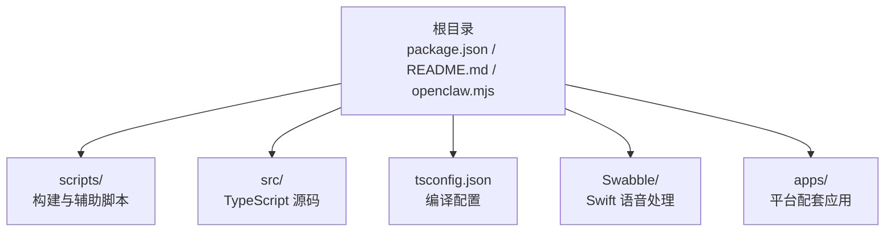
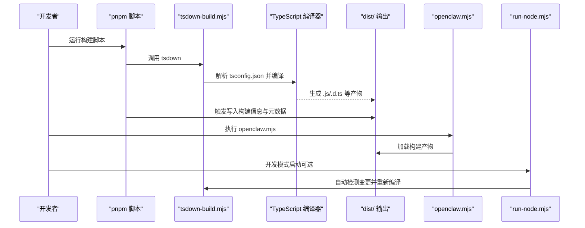
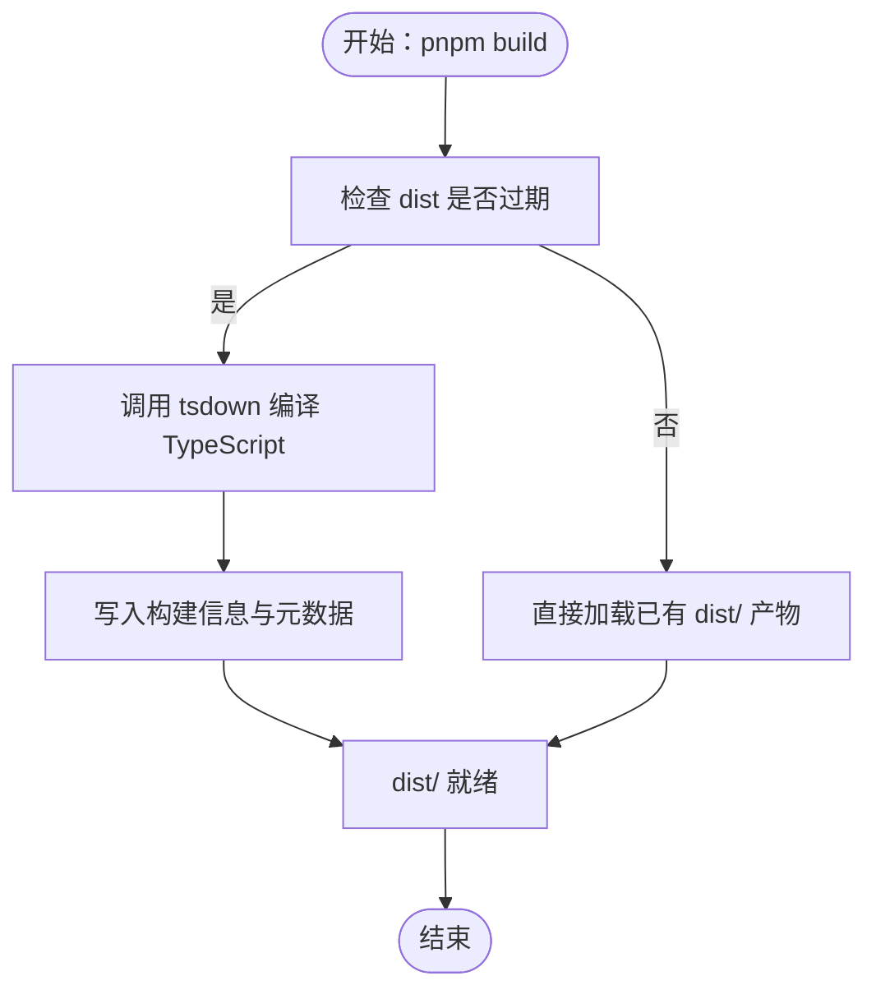
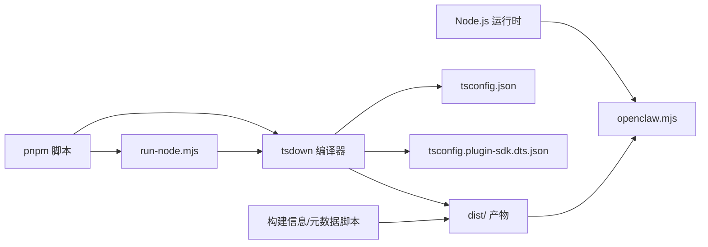

# 源码编译安装

<cite>
**本文引用的文件**
- [package.json](file://package.json)
- [README.md](file://README.md)
- [openclaw.mjs](file://openclaw.mjs)
- [scripts/tsdown-build.mjs](file://scripts/tsdown-build.mjs)
- [scripts/run-node.mjs](file://scripts/run-node.mjs)
- [tsconfig.json](file://tsconfig.json)
- [tsconfig.plugin-sdk.dts.json](file://tsconfig.plugin-sdk.dts.json)
- [scripts/write-build-info.ts](file://scripts/write-build-info.ts)
- [scripts/write-cli-startup-metadata.ts](file://scripts/write-cli-startup-metadata.ts)
- [scripts/write-cli-compat.ts](file://scripts/write-cli-compat.ts)
- [Swabble/Package.swift](file://Swabble/Package.swift)
- [apps/macos/Package.swift](file://apps/macos/Package.swift)
</cite>

## 目录

1. [简介](#简介)
2. [项目结构](#项目结构)
3. [核心组件](#核心组件)
4. [架构总览](#架构总览)
5. [详细组件分析](#详细组件分析)
6. [依赖关系分析](#依赖关系分析)
7. [性能考虑](#性能考虑)
8. [故障排查指南](#故障排查指南)
9. [结论](#结论)
10. [附录](#附录)

## 简介

本指南面向希望从源码编译并安装 OpenClaw 的开发者与高级用户，覆盖以下内容：

- Node.js 版本要求与环境准备
- 构建依赖安装与工具链
- 编译流程与产物生成
- 安装与运行步骤
- 常见编译错误诊断与修复建议

OpenClaw 提供了基于 TypeScript 的核心运行时与插件 SDK，以及多平台（macOS/iOS/Android）配套应用与 Swift 组件。从源码构建主要通过 pnpm 管理依赖与脚本，使用 tsdown 进行 TypeScript 编译，并在构建阶段生成运行所需的元数据与兼容层。

## 项目结构

OpenClaw 仓库采用多包工作区布局，核心目录与职责概览如下：

- 根目录：包管理与顶层脚本（package.json、README.md、openclaw.mjs）
- scripts：构建与辅助脚本（tsdown-build.mjs、run-node.mjs、write-\* 系列）
- src：TypeScript 源码根目录
- tsconfig.json：TypeScript 编译配置
- Swabble：独立的 Swift 语音处理子项目（可选）
- apps：各平台配套应用（macOS、iOS、Android 等）

**图表来源**

- [package.json](file://package.json)
- [README.md](file://README.md)
- [tsconfig.json](file://tsconfig.json)
- [Swabble/Package.swift](file://Swabble/Package.swift)
- [apps/macos/Package.swift](file://apps/macos/Package.swift)

**章节来源**

- [README.md:92-111](file://README.md#L92-L111)
- [package.json:217-338](file://package.json#L217-L338)

## 核心组件

- 运行入口与版本校验：openclaw.mjs 负责检查 Node.js 版本并加载构建产物。
- 构建管线：scripts/tsdown-build.mjs 调用 tsdown 执行编译；scripts/run-node.mjs 提供开发模式下的自动构建与热重载。
- 类型与声明：tsconfig.json 控制 TypeScript 编译选项；tsconfig.plugin-sdk.dts.json 用于生成插件 SDK 的类型声明。
- 元数据生成：write-build-info.ts 写入版本与提交信息；write-cli-startup-metadata.ts 生成 CLI 启动所需通道目录；write-cli-compat.ts 生成旧版 CLI 兼容导出。
- 平台集成：Swabble/Package.swift 与 apps/macos/Package.swift 定义 Swift 子项目与 macOS 应用的构建目标。

**章节来源**

- [openclaw.mjs:1-90](file://openclaw.mjs#L1-L90)
- [scripts/tsdown-build.mjs:1-20](file://scripts/tsdown-build.mjs#L1-L20)
- [scripts/run-node.mjs:1-264](file://scripts/run-node.mjs#L1-L264)
- [tsconfig.json:1-29](file://tsconfig.json#L1-L29)
- [tsconfig.plugin-sdk.dts.json:1-62](file://tsconfig.plugin-sdk.dts.json#L1-L62)
- [scripts/write-build-info.ts:1-48](file://scripts/write-build-info.ts#L1-L48)
- [scripts/write-cli-startup-metadata.ts:1-94](file://scripts/write-cli-startup-metadata.ts#L1-L94)
- [scripts/write-cli-compat.ts:1-75](file://scripts/write-cli-compat.ts#L1-L75)
- [Swabble/Package.swift:1-56](file://Swabble/Package.swift#L1-L56)
- [apps/macos/Package.swift:1-93](file://apps/macos/Package.swift#L1-L93)

## 架构总览

下图展示了从源码到可执行的总体流程：开发者通过 pnpm 脚本触发编译，生成 dist/ 目录中的运行产物与元数据，随后通过 openclaw.mjs 或 run-node.mjs 启动服务。

**图表来源**

- [scripts/tsdown-build.mjs:1-20](file://scripts/tsdown-build.mjs#L1-L20)
- [tsconfig.json:1-29](file://tsconfig.json#L1-L29)
- [scripts/write-build-info.ts:1-48](file://scripts/write-build-info.ts#L1-L48)
- [scripts/write-cli-startup-metadata.ts:1-94](file://scripts/write-cli-startup-metadata.ts#L1-L94)
- [openclaw.mjs:1-90](file://openclaw.mjs#L1-L90)
- [scripts/run-node.mjs:1-264](file://scripts/run-node.mjs#L1-L264)

## 详细组件分析

### Node.js 版本要求与环境准备

- 最低版本：Node.js ≥ 22.12
- 推荐工具链：pnpm（项目内脚本以 pnpm 为主）
- 其他依赖：根据平台可能需要系统级依赖（如构建二进制扩展时），但本节聚焦于 Node.js 与包管理器层面的要求

建议步骤：

- 使用 nvm 切换到推荐版本
- 安装 pnpm（项目已声明 engines 与 packageManager）

**章节来源**

- [openclaw.mjs:5-34](file://openclaw.mjs#L5-L34)
- [package.json:422-426](file://package.json#L422-L426)
- [README.md:52-59](file://README.md#L52-L59)

### 构建依赖安装

- 包管理器：pnpm（项目内脚本与依赖均以 pnpm 为基准）
- UI 依赖：首次运行 UI 构建会自动安装
- 开发脚本：通过 package.json 中的 scripts 字段统一调用

常用命令（来自 README 与 package.json）：

- 安装依赖：pnpm install
- UI 构建：pnpm ui:build
- 核心构建：pnpm build
- 开发模式：pnpm gateway:watch

**章节来源**

- [README.md:96-111](file://README.md#L96-L111)
- [package.json:217-338](file://package.json#L217-L338)

### 编译流程与产物

- 编译器：tsdown（由 scripts/tsdown-build.mjs 调用）
- 配置：tsconfig.json 控制模块解析、目标语言版本、严格模式等
- 插件 SDK 类型：tsconfig.plugin-sdk.dts.json 生成独立的 d.ts 输出
- 元数据：构建信息（版本/提交/时间）、CLI 启动元数据、旧版 CLI 兼容导出

**图表来源**

- [scripts/tsdown-build.mjs:1-20](file://scripts/tsdown-build.mjs#L1-L20)
- [tsconfig.json:1-29](file://tsconfig.json#L1-L29)
- [tsconfig.plugin-sdk.dts.json:1-62](file://tsconfig.plugin-sdk.dts.json#L1-L62)
- [scripts/write-build-info.ts:1-48](file://scripts/write-build-info.ts#L1-L48)
- [scripts/write-cli-startup-metadata.ts:1-94](file://scripts/write-cli-startup-metadata.ts#L1-L94)
- [scripts/write-cli-compat.ts:1-75](file://scripts/write-cli-compat.ts#L1-L75)

**章节来源**

- [scripts/tsdown-build.mjs:1-20](file://scripts/tsdown-build.mjs#L1-L20)
- [tsconfig.json:1-29](file://tsconfig.json#L1-L29)
- [tsconfig.plugin-sdk.dts.json:1-62](file://tsconfig.plugin-sdk.dts.json#L1-L62)
- [scripts/write-build-info.ts:1-48](file://scripts/write-build-info.ts#L1-L48)
- [scripts/write-cli-startup-metadata.ts:1-94](file://scripts/write-cli-startup-metadata.ts#L1-L94)
- [scripts/write-cli-compat.ts:1-75](file://scripts/write-cli-compat.ts#L1-L75)

### 安装与运行

- 全局安装（可选）：npm/pnpm/bun 均可安装全局包后使用 openclaw 命令
- 本地开发安装：克隆仓库后执行 pnpm install 与 pnpm build，再运行 openclaw onboard 完成向导安装
- 开发调试：pnpm gateway:watch 支持热重载与自动构建

**章节来源**

- [README.md:50-79](file://README.md#L50-L79)
- [README.md:96-111](file://README.md#L96-L111)

### 平台与 Swift 组件

- Swabble：独立的 Swift 项目，提供语音处理能力，定义了 macOS/iOS 平台的最低系统版本
- macOS 应用：OpenClaw macOS 包含 IPC、发现、菜单栏控制等目标

这些组件与 Node.js 构建相互独立，但共同构成 OpenClaw 的完整生态。

**章节来源**

- [Swabble/Package.swift:1-56](file://Swabble/Package.swift#L1-L56)
- [apps/macos/Package.swift:1-93](file://apps/macos/Package.swift#L1-L93)

## 依赖关系分析

- Node.js 运行时：openclaw.mjs 在启动前进行版本校验
- 构建工具链：pnpm 脚本驱动 tsdown 编译，配合写入脚本生成元数据
- TypeScript 配置：tsconfig.json 与 tsconfig.plugin-sdk.dts.json 分别服务于主程序与插件 SDK
- 平台子项目：Swabble 与 macOS 应用通过各自的 Package.swift 管理 Swift 依赖与目标

**图表来源**

- [openclaw.mjs:1-90](file://openclaw.mjs#L1-L90)
- [scripts/tsdown-build.mjs:1-20](file://scripts/tsdown-build.mjs#L1-L20)
- [tsconfig.json:1-29](file://tsconfig.json#L1-L29)
- [tsconfig.plugin-sdk.dts.json:1-62](file://tsconfig.plugin-sdk.dts.json#L1-L62)
- [scripts/write-build-info.ts:1-48](file://scripts/write-build-info.ts#L1-L48)
- [scripts/write-cli-startup-metadata.ts:1-94](file://scripts/write-cli-startup-metadata.ts#L1-L94)
- [scripts/run-node.mjs:1-264](file://scripts/run-node.mjs#L1-L264)

**章节来源**

- [openclaw.mjs:1-90](file://openclaw.mjs#L1-L90)
- [scripts/tsdown-build.mjs:1-20](file://scripts/tsdown-build.mjs#L1-L20)
- [tsconfig.json:1-29](file://tsconfig.json#L1-L29)
- [tsconfig.plugin-sdk.dts.json:1-62](file://tsconfig.plugin-sdk.dts.json#L1-L62)
- [scripts/write-build-info.ts:1-48](file://scripts/write-build-info.ts#L1-L48)
- [scripts/write-cli-startup-metadata.ts:1-94](file://scripts/write-cli-startup-metadata.ts#L1-L94)
- [scripts/run-node.mjs:1-264](file://scripts/run-node.mjs#L1-L264)

## 性能考虑

- 编译缓存：openclaw.mjs 在满足条件时启用编译缓存以加速启动
- 开发模式：run-node.mjs 会监控源码变更并按需重建，避免全量编译
- 并行与增量：pnpm 脚本与 tsdown 的组合在多数情况下支持增量构建

**章节来源**

- [openclaw.mjs:38-45](file://openclaw.mjs#L38-L45)
- [scripts/run-node.mjs:130-170](file://scripts/run-node.mjs#L130-L170)

## 故障排查指南

- Node.js 版本不匹配
  - 现象：启动时报错提示需要更高版本的 Node.js
  - 处理：使用 nvm 安装并切换到 ≥ 22.12 的版本
  - 参考：openclaw.mjs 的版本校验逻辑

- 缺少 dist/ 产物或构建失败
  - 现象：openclaw.mjs 报告缺失 dist/entry.(m)js
  - 处理：先执行 pnpm build，确保 dist/ 生成；若失败，查看 tsdown 输出与 tsconfig 配置
  - 参考：openclaw.mjs 对 dist/entry 的加载逻辑

- 构建信息或元数据缺失
  - 现象：缺少版本/提交/时间信息或 CLI 启动元数据
  - 处理：确认构建脚本已执行；检查 write-build-info.ts 与 write-cli-startup-metadata.ts 的输出
  - 参考：对应写入脚本

- 开发模式无法自动构建
  - 现象：修改源码后未触发重新编译
  - 处理：检查 run-node.mjs 的变更检测逻辑；必要时设置 OPENCLAW_FORCE_BUILD=1 强制构建
  - 参考：run-node.mjs 的 shouldBuild 与相关环境变量

- 旧版 CLI 导出不可用
  - 现象：导入某些旧版导出会报错
  - 处理：确认已生成 write-cli-compat.ts 的兼容层；升级到最新版本以获得完整导出
  - 参考：write-cli-compat.ts 的生成逻辑

**章节来源**

- [openclaw.mjs:21-34](file://openclaw.mjs#L21-L34)
- [openclaw.mjs:83-89](file://openclaw.mjs#L83-L89)
- [scripts/write-build-info.ts:37-47](file://scripts/write-build-info.ts#L37-L47)
- [scripts/write-cli-startup-metadata.ts:78-93](file://scripts/write-cli-startup-metadata.ts#L78-L93)
- [scripts/run-node.mjs:130-170](file://scripts/run-node.mjs#L130-L170)
- [scripts/write-cli-compat.ts:32-49](file://scripts/write-cli-compat.ts#L32-L49)

## 结论

从源码编译安装 OpenClaw 的关键在于：

- 准备 Node.js ≥ 22.12 与 pnpm 工具链
- 正确执行 pnpm install 与 pnpm build
- 通过 openclaw.mjs 或 run-node.mjs 启动服务
- 若遇到问题，优先检查 Node.js 版本、dist/ 产物完整性与构建元数据生成情况

## 附录

### 环境准备清单

- Node.js：≥ 22.12（建议使用 nvm 管理）
- 包管理器：pnpm（项目内脚本以 pnpm 为主）
- 可选：UI 构建依赖会在首次运行 UI 构建时自动安装
- 平台相关：如需 Swift 组件，需准备 Xcode 与相应平台 SDK（Swabble 与 macOS 应用）

**章节来源**

- [openclaw.mjs:5-34](file://openclaw.mjs#L5-L34)
- [package.json:422-426](file://package.json#L422-L426)
- [README.md:96-111](file://README.md#L96-L111)

### 编译命令与安装路径

- 安装依赖：pnpm install
- UI 构建：pnpm ui:build
- 核心构建：pnpm build
- 产物目录：dist/
- 入口脚本：openclaw.mjs
- 开发模式：pnpm gateway:watch

**章节来源**

- [README.md:96-111](file://README.md#L96-L111)
- [package.json:217-338](file://package.json#L217-L338)
