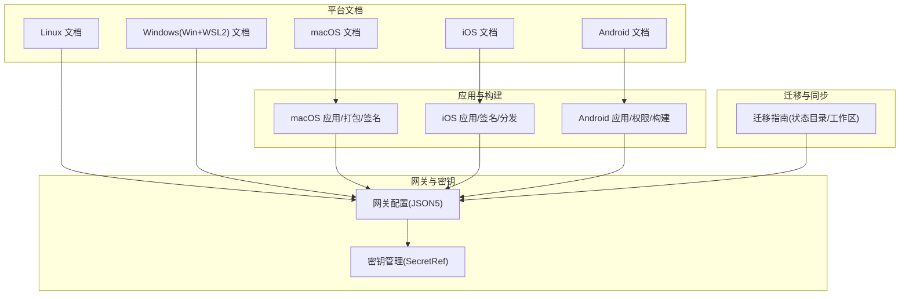
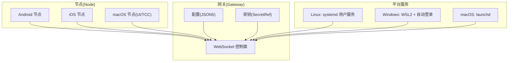
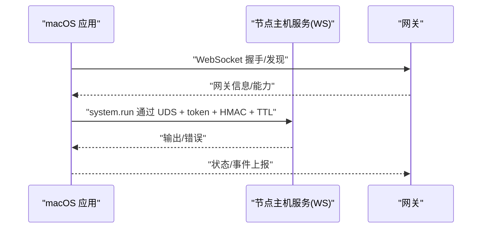
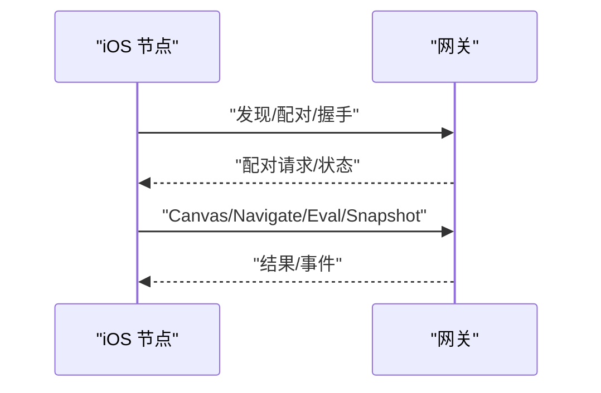
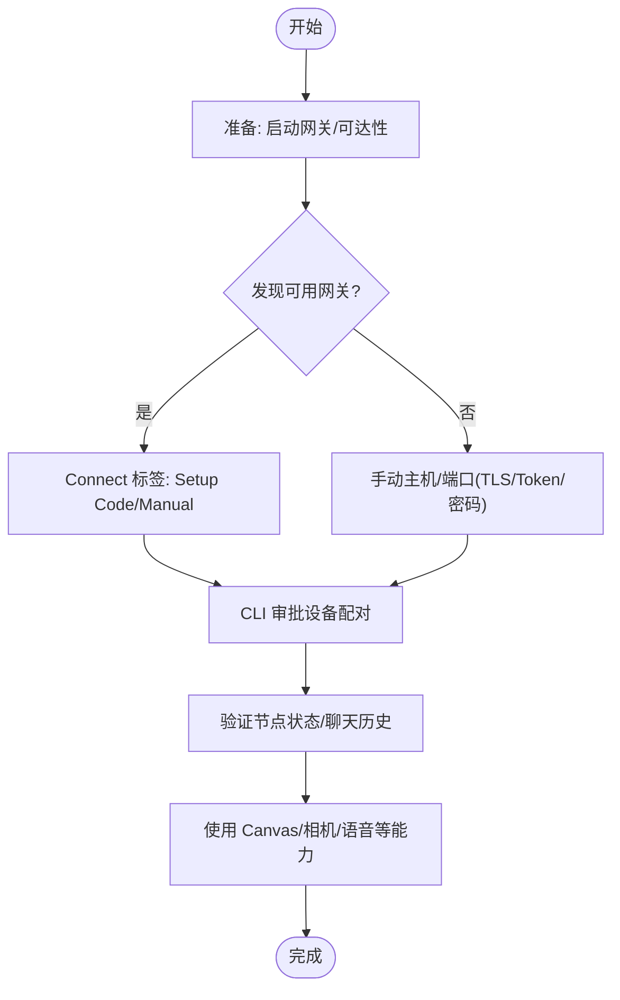
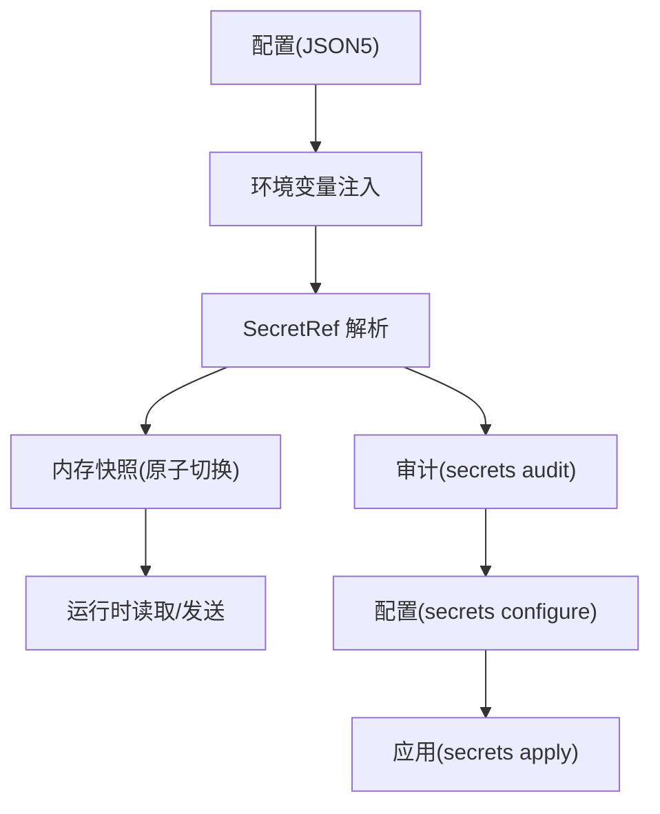
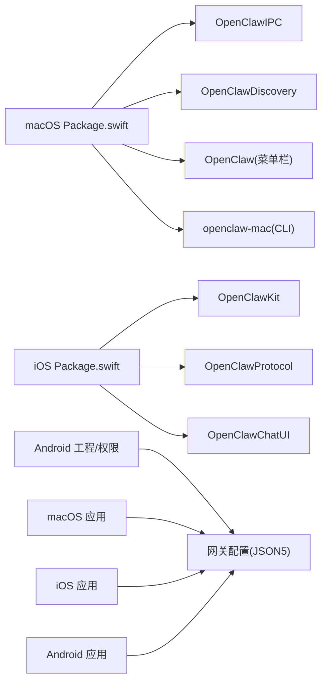

# 平台特定配置

<cite>
**本文引用的文件**
- [docs/platforms/macos.md](file://docs/platforms/macos.md)
- [docs/platforms/android.md](file://docs/platforms/android.md)
- [docs/platforms/ios.md](file://docs/platforms/ios.md)
- [docs/platforms/linux.md](file://docs/platforms/linux.md)
- [docs/platforms/windows.md](file://docs/platforms/windows.md)
- [apps/macos/README.md](file://apps/macos/README.md)
- [apps/android/README.md](file://apps/android/README.md)
- [apps/ios/README.md](file://apps/ios/README.md)
- [docs/gateway/configuration.md](file://docs/gateway/configuration.md)
- [docs/gateway/secrets.md](file://docs/gateway/secrets.md)
- [docs/install/migrating.md](file://docs/install/migrating.md)
- [apps/ios/Signing.xcconfig](file://apps/ios/Signing.xcconfig)
- [apps/android/gradle.properties](file://apps/android/gradle.properties)
- [apps/macos/Package.swift](file://apps/macos/Package.swift)
- [apps/shared/OpenClawKit/Package.swift](file://apps/shared/OpenClawKit/Package.swift)
</cite>

## 目录

1. [简介](#简介)
2. [项目结构](#项目结构)
3. [核心组件](#核心组件)
4. [架构总览](#架构总览)
5. [详细组件分析](#详细组件分析)
6. [依赖关系分析](#依赖关系分析)
7. [性能考量](#性能考量)
8. [故障排除指南](#故障排除指南)
9. [结论](#结论)
10. [附录](#附录)

## 简介

本指南面向在多平台（macOS、iOS、Android、Linux、Windows）部署与运行 OpenClaw 的工程师与运维人员，系统性梳理各平台的专属配置要点，包括权限与安全、服务与守护进程、环境变量与密钥管理、以及跨平台数据迁移与同步策略。文档以仓库内现有平台文档与应用说明为依据，提供可操作的步骤、可视化流程图与排障建议。

## 项目结构

围绕平台配置的关键位置如下：

- 平台文档：docs/platforms 下的各平台文档，覆盖连接、发现、Canvas/A2UI、语音、权限等
- 应用工程与构建：apps/{macos,ios,android}/README 及其配置文件
- 网关配置与密钥：docs/gateway/configuration.md、docs/gateway/secrets.md
- 迁移与同步：docs/install/migrating.md

**图表来源**

- [docs/platforms/macos.md](file://docs/platforms/macos.md)
- [docs/platforms/ios.md](file://docs/platforms/ios.md)
- [docs/platforms/android.md](file://docs/platforms/android.md)
- [docs/platforms/linux.md](file://docs/platforms/linux.md)
- [docs/platforms/windows.md](file://docs/platforms/windows.md)
- [apps/macos/README.md](file://apps/macos/README.md)
- [apps/ios/README.md](file://apps/ios/README.md)
- [apps/android/README.md](file://apps/android/README.md)
- [docs/gateway/configuration.md](file://docs/gateway/configuration.md)
- [docs/gateway/secrets.md](file://docs/gateway/secrets.md)
- [docs/install/migrating.md](file://docs/install/migrating.md)

**章节来源**

- [docs/platforms/macos.md](file://docs/platforms/macos.md)
- [docs/platforms/ios.md](file://docs/platforms/ios.md)
- [docs/platforms/android.md](file://docs/platforms/android.md)
- [docs/platforms/linux.md](file://docs/platforms/linux.md)
- [docs/platforms/windows.md](file://docs/platforms/windows.md)
- [apps/macos/README.md](file://apps/macos/README.md)
- [apps/ios/README.md](file://apps/ios/README.md)
- [apps/android/README.md](file://apps/android/README.md)
- [docs/gateway/configuration.md](file://docs/gateway/configuration.md)
- [docs/gateway/secrets.md](file://docs/gateway/secrets.md)
- [docs/install/migrating.md](file://docs/install/migrating.md)

## 核心组件

- 网关配置（JSON5）：集中式配置入口，支持热重载、分段 include、环境变量注入与 SecretRef
- 密钥管理（SecretRef）：支持 env/file/exec 三类提供者，启动即刻解析并原子切换快照，不暴露明文
- 平台节点（Node）：Android/iOS 节点作为“远程设备”，macOS 节点作为本地 UI/TCC 上下文执行载体
- 服务与守护：Linux 使用 systemd 用户服务；Windows 通过 WSL2 + 登录后自启；macOS 使用 launchd
- 迁移与同步：统一状态目录与工作区迁移，避免云盘同步带来的锁争用

**章节来源**

- [docs/gateway/configuration.md](file://docs/gateway/configuration.md)
- [docs/gateway/secrets.md](file://docs/gateway/secrets.md)
- [docs/platforms/android.md](file://docs/platforms/android.md)
- [docs/platforms/ios.md](file://docs/platforms/ios.md)
- [docs/platforms/macos.md](file://docs/platforms/macos.md)
- [docs/platforms/linux.md](file://docs/platforms/linux.md)
- [docs/platforms/windows.md](file://docs/platforms/windows.md)
- [docs/install/migrating.md](file://docs/install/migrating.md)

## 架构总览

下图展示跨平台连接与控制面交互：节点（Android/iOS/macOS）通过 WebSocket 连接网关，网关负责会话、工具调用与控制平面命令；macOS 节点额外通过 IPC 执行受 TCC 保护的系统命令。

**图表来源**

- [docs/platforms/android.md](file://docs/platforms/android.md)
- [docs/platforms/ios.md](file://docs/platforms/ios.md)
- [docs/platforms/macos.md](file://docs/platforms/macos.md)
- [docs/platforms/linux.md](file://docs/platforms/linux.md)
- [docs/platforms/windows.md](file://docs/platforms/windows.md)
- [docs/gateway/configuration.md](file://docs/gateway/configuration.md)
- [docs/gateway/secrets.md](file://docs/gateway/secrets.md)

## 详细组件分析

### macOS 平台配置

- 角色与职责
  - 菜栏伴生应用，负责权限提示（通知、辅助功能、屏幕录制、麦克风、语音识别、自动化）、本地/远程模式下的网关接入、暴露 macOS 特有能力（Canvas、Camera、Screen、system.run）
  - 本地模式默认附加到已有网关或通过安装 launchd 服务启动；远程模式通过 SSH 隧道与远端网关通信，并在本地起动节点主机服务以便远端网关可达
- 权限与安全
  - TCC 权限：通知、辅助功能、屏幕录制、麦克风、语音识别、自动化/AppleScript
  - system.run 执行需“执行审批”（Exec approvals），存储于本地 JSON，支持安全策略、询问策略与白名单
  - 环境变量过滤：对 PATH、DYLD*\*、LD*_、NODE_OPTIONS、PYTHON_/PERL\*/RUBYOPT、SHELLOPTS/PS4 等进行过滤合并
- 服务与守护
  - launchd 代理标签：ai.openclaw.gateway 或带 profile 的 ai.openclaw.<profile>；支持 kickstart/bootout 操作
- 状态目录与路径
  - 建议使用本地非云同步路径（如 ~/.openclaw），避免 iCloud/云存储导致延迟与锁冲突
- 开发与调试
  - 提供独立 CLI 工具 openclaw-mac，用于连接/发现逻辑验证；支持 JSON 输出便于对比
- 远程连接（SSH 隧道）
  - 控制隧道复用健康检查、状态、Web 聊天与配置调用；SSH 形态含批处理、退出失败即停、keepalive；IP 报告为 127.0.0.1，若需真实客户端 IP 可改用直连传输

**图表来源**

- [docs/platforms/macos.md](file://docs/platforms/macos.md)

**章节来源**

- [docs/platforms/macos.md](file://docs/platforms/macos.md)
- [apps/macos/README.md](file://apps/macos/README.md)

### iOS 平台配置

- 角色与连接
  - iOS 节点以 role: node 连接网关，支持 Canvas、屏幕截图、相机、位置、Talk 模式、语音唤醒
  - 支持 Bonjour/LAN、跨网络 Tailscale 与手动主机端口三种发现路径
- 语音与后台限制
  - 后台音频可能受限；Canvas/Camera/Screen 命令需要前台
- 分发与签名
  - 内部预览；本地/测试分发可通过 Xcode 与 Fastlane；Debug 构建 APSN 环境为沙盒
- 常见错误
  - NODE_BACKGROUND_UNAVAILABLE：回到前台
  - A2UI_HOST_NOT_CONFIGURED：确认网关 Canvas 主机已配置
  - 重新安装后配对失效：需重新配对

**图表来源**

- [docs/platforms/ios.md](file://docs/platforms/ios.md)
- [apps/ios/README.md](file://apps/ios/README.md)
- [apps/ios/Signing.xcconfig](file://apps/ios/Signing.xcconfig)

**章节来源**

- [docs/platforms/ios.md](file://docs/platforms/ios.md)
- [apps/ios/README.md](file://apps/ios/README.md)
- [apps/ios/Signing.xcconfig](file://apps/ios/Signing.xcconfig)

### Android 平台配置

- 角色与连接
  - Android 节点为 companion node（不托管网关），通过 mDNS/NSD + WebSocket 直连网关
  - 支持本地 LAN、跨网络 Tailscale（Wide-Area Bonjour/unicast DNS-SD）与手动主机端口
- 权限
  - 发现：Android 13+ 需 NEARBY_WIFI_DEVICES；12 及以下 ACCESS_FINE_LOCATION
  - 前台服务通知：POST_NOTIFICATIONS
  - 相机：CAMERA + RECORD_AUDIO（当 includeAudio=true）
- Canvas 与相机
  - Canvas 由网关 HTTP 服务器提供（同端口），支持 A2UI；相机支持拍照/录视频
- 连接运行手册
  - 启动网关 → Connect 标签选择 Setup Code/Manual → CLI 审批 → 验证节点状态 → 聊天/历史/Canvas/相机/语音

**图表来源**

- [docs/platforms/android.md](file://docs/platforms/android.md)
- [apps/android/README.md](file://apps/android/README.md)

**章节来源**

- [docs/platforms/android.md](file://docs/platforms/android.md)
- [apps/android/README.md](file://apps/android/README.md)

### Linux 平台配置

- 网关支持：Linux 完全支持，推荐 Node 作为运行时；不建议在网关上使用 Bun（存在已知问题）
- 安装与服务
  - 一键安装：npm i -g openclaw@latest
  - 服务安装：openclaw onboard --install-daemon 或 gateway install 或 configure 选择 Gateway 服务
  - 默认使用用户级 systemd 服务；共享/常驻服务器可使用系统级服务
- 快速路径（VPS）：安装 Node → 全局安装 openclaw → 安装守护 → 本地端口转发 → 浏览器令牌登录

**章节来源**

- [docs/platforms/linux.md](file://docs/platforms/linux.md)

### Windows（WSL2）平台配置

- 推荐方案：WSL2（Ubuntu）内运行 CLI 与网关，保持与 Linux 一致的工具链兼容性
- 安装与服务
  - 在 WSL2 内执行 openclaw onboard/gateway install/configure
  - 修复/迁移：openclaw doctor
- 自动启动（无用户登录）
  - 在 WSL 内启用 linger
  - 安装用户服务
  - 管理员 PowerShell 创建开机任务以启动 WSL
- 高级：WSL 服务暴露到 LAN（portproxy）
  - 获取 WSL IP 并建立端口转发规则，刷新规则以适配重启
  - 注意：远程节点需指向可达的网关 URL，避免使用 127.0.0.1

**章节来源**

- [docs/platforms/windows.md](file://docs/platforms/windows.md)

### 网关配置与密钥管理

- 配置（JSON5）
  - 支持交互向导、CLI、控制 UI 与直接编辑；严格校验，未知键/类型错误会导致拒绝启动
  - 热重载：hybrid 模式下安全变更即时生效，关键变更自动重启；可调整模式与去抖
  - 环境变量：支持 .env 与全局 ~/.openclaw/.env；可引用 Shell 环境；支持在配置中进行变量替换
  - SecretRef：支持 env/file/exec 三类提供者，启动即刻解析并原子切换；仅在有效表面激活
- 密钥管理（SecretRef）
  - 合同：{source: "env"|"file"|"exec", provider, id}
  - 提供者：env（可选 allowlist）、file（支持绝对 JSON 指针与单值）、exec（支持超时/字节限制/环境白名单/可信目录）
  - 激活触发：启动、热重载、显式 secrets.reload；失败时保留上次已知良好快照
  - 审计与配置：secrets audit/configure/apply 流程，优先清理静态明文与冗余条目

**图表来源**

- [docs/gateway/configuration.md](file://docs/gateway/configuration.md)
- [docs/gateway/secrets.md](file://docs/gateway/secrets.md)

**章节来源**

- [docs/gateway/configuration.md](file://docs/gateway/configuration.md)
- [docs/gateway/secrets.md](file://docs/gateway/secrets.md)

### 跨平台数据迁移与同步

- 迁移范围
  - 状态目录（默认 ~/.openclaw/，可被 OPENCLAW_STATE_DIR 或 profile 影响）
  - 工作区（默认 ~/.openclaw/workspace/）
- 步骤
  - 在旧机停止网关并归档状态目录与工作区
  - 在新机安装 CLI/Node
  - 复制状态目录与工作区，确保隐藏目录与属主正确
  - 新机执行 openclaw doctor 修复服务与迁移，随后重启网关并核验状态
- 常见陷阱
  - profile/状态目录不一致导致配置不生效、渠道缺失/登出、会话历史为空
  - 仅复制 openclaw.json 不完整，OAuth/渠道状态在 credentials/agents 下
  - 文件属主/权限错误导致无法读取凭据/会话
  - 远程模式下迁移的是远端网关主机而非本地 UI

**章节来源**

- [docs/install/migrating.md](file://docs/install/migrating.md)

## 依赖关系分析

- 平台与应用
  - macOS：菜单栏应用 + IPC 库 + 发现库 + Sparkle 更新 + 可选 Peekaboo 桥
  - iOS：OpenClawKit（协议/聊天 UI）、ElevenLabsKit、Textual（macOS/iOS）
  - Android：Kotlin/Jetpack Compose，权限与通知、ADB 反向调试
- 网关与密钥
  - 配置驱动能力开关与路由；SecretRef 保障凭据安全与启动/重载可靠性

**图表来源**

- [apps/macos/Package.swift](file://apps/macos/Package.swift)
- [apps/shared/OpenClawKit/Package.swift](file://apps/shared/OpenClawKit/Package.swift)
- [apps/android/README.md](file://apps/android/README.md)
- [docs/gateway/configuration.md](file://docs/gateway/configuration.md)

**章节来源**

- [apps/macos/Package.swift](file://apps/macos/Package.swift)
- [apps/shared/OpenClawKit/Package.swift](file://apps/shared/OpenClawKit/Package.swift)
- [apps/android/README.md](file://apps/android/README.md)
- [apps/ios/README.md](file://apps/ios/README.md)
- [apps/ios/Signing.xcconfig](file://apps/ios/Signing.xcconfig)
- [apps/android/gradle.properties](file://apps/android/gradle.properties)

## 性能考量

- macOS
  - system.run 环境变量过滤与 shell 包装处理，减少不必要的环境污染
  - 远程模式 SSH 隧道稳定复用，避免频繁重建
- iOS/Android
  - Canvas/A2UI/相机/语音等能力需前台活跃，后台行为受限
  - Android 前台服务通知与持久化连接，降低断连概率
- Linux/Windows
  - systemd 用户服务与 WSL2 自动登录，保证低延迟可用性
- 配置热重载
  - hybrid 模式兼顾即时生效与关键变更自动重启，减少维护窗口

[本节为通用指导，无需具体文件分析]

## 故障排除指南

- macOS
  - Exec 审批：检查 ~/.openclaw/exec-approvals.json，确认安全策略、询问策略与白名单
  - LaunchAgent：使用 kickstart/bootout 重载；确认标签与 profile 一致
  - 状态目录：避免 iCloud/云存储路径，doctor 会警告并建议迁回本地
- iOS
  - 后台不可用：Canvas/Camera/Screen 需前台；APNs 注册失败检查推送能力与配置
  - 重新安装后配对失效：重新配对节点
- Android
  - A2UI 主机不可达：确认网关 Canvas 主机运行且可达；保持 Screen 标签前台
  - 首次运行配对失败：在 CLI 审批最新设备请求
- 网关与密钥
  - 启动失败：doctor 定位配置错误；secrets audit 查看明文残留与未解析引用
  - 重载失败：保留上次已知良好快照；secrets.reload 刷新后重试
- 迁移
  - 配置不生效/渠道丢失：核对状态目录与 profile 是否一致；确保属主与权限正确

**章节来源**

- [docs/platforms/macos.md](file://docs/platforms/macos.md)
- [docs/platforms/ios.md](file://docs/platforms/ios.md)
- [docs/platforms/android.md](file://docs/platforms/android.md)
- [docs/gateway/secrets.md](file://docs/gateway/secrets.md)
- [docs/install/migrating.md](file://docs/install/migrating.md)

## 结论

通过平台专属配置与统一的网关配置/密钥管理策略，OpenClaw 在多平台上实现了稳定的连接、可控的权限与安全边界，并提供了清晰的迁移与排障路径。建议在生产环境中优先采用 SecretRef 管理密钥，结合热重载与 doctor 机制提升运维效率；在移动端遵循前台使用与权限最小化原则，确保体验与安全平衡。

[本节为总结，无需具体文件分析]

## 附录

- 平台快速参考
  - macOS：菜单栏应用 + launchd + TCC 权限 + system.run 审批 + 远程 SSH 隧道
  - iOS：role: node + Bonjour/Tailscale + Canvas/A2UI + 语音/位置
  - Android：NSD/mDNS + Canvas/A2UI + 相机/通知/权限
  - Linux：systemd 用户服务 + 网关守护 + 热重载
  - Windows：WSL2 + 登录后自启 + LAN 端口转发
- 关键命令与文件
  - openclaw doctor / status / gateway install / secrets audit/configure/apply
  - ~/.openclaw/openclaw.json 与 ~/.openclaw/.env
  - macOS: ~/.openclaw/exec-approvals.json
  - iOS: Signing.xcconfig（Bundle ID/Team/Profile）
  - Android: gradle.properties（构建参数）

[本节为补充信息，无需具体文件分析]
