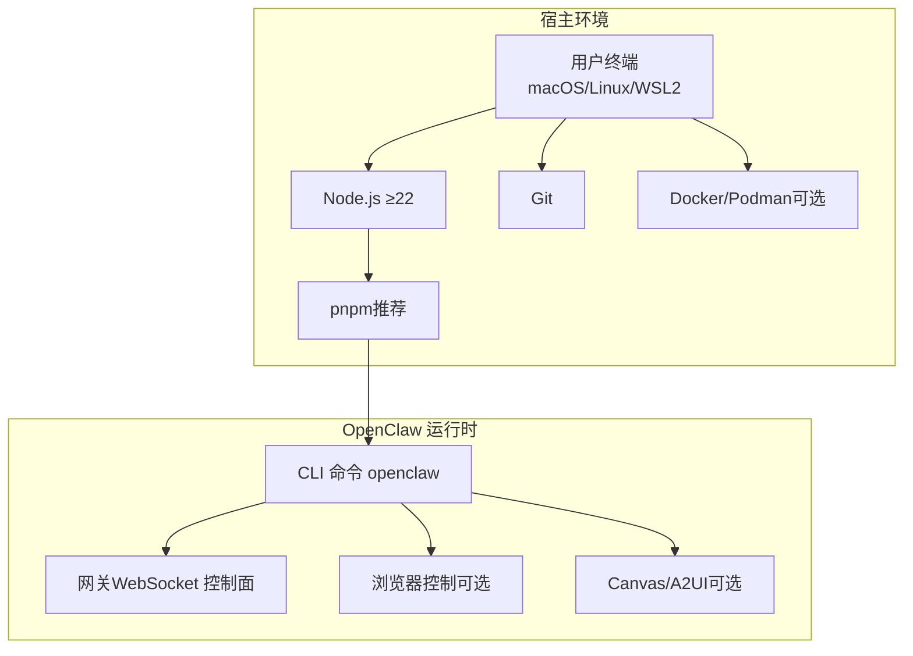
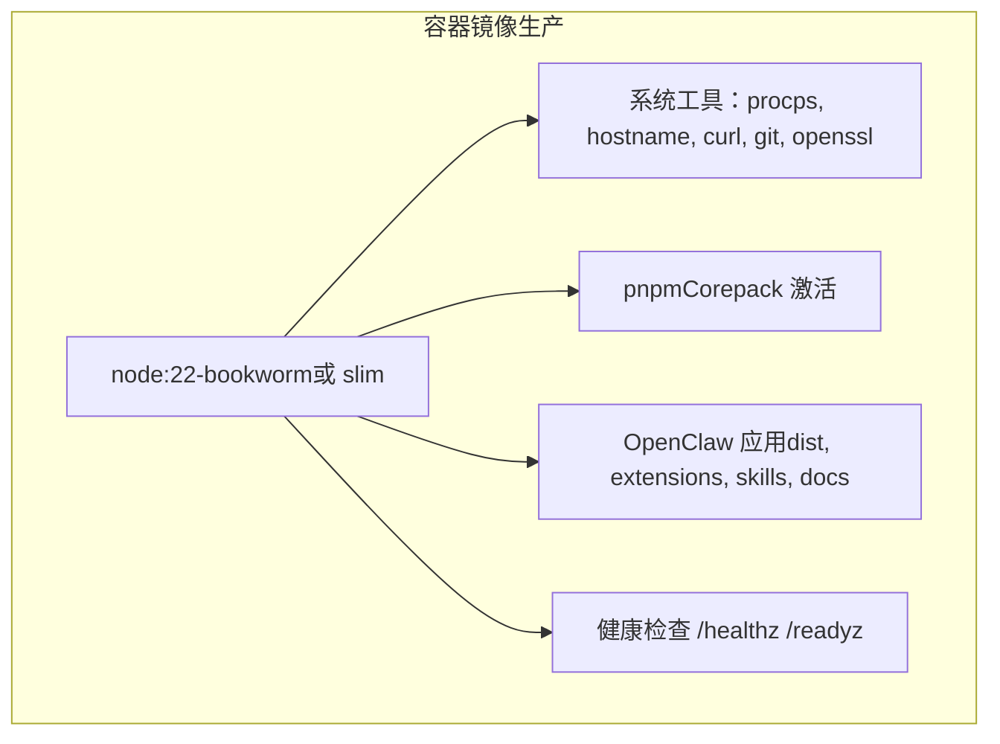
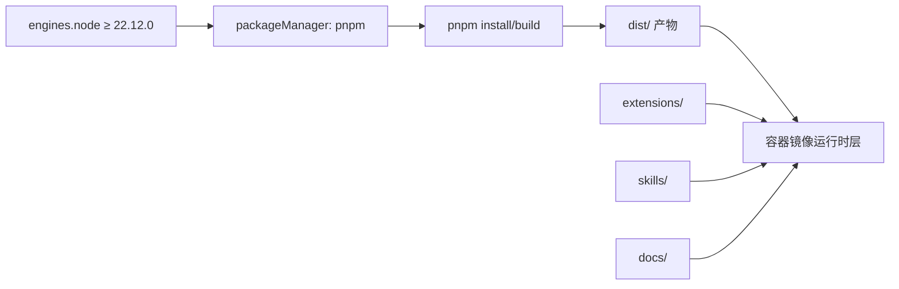

# 环境要求与依赖

<cite>
**本文引用的文件**
- [README.md](file://README.md)
- [package.json](file://package.json)
- [Dockerfile](file://Dockerfile)
- [Dockerfile.sandbox](file://Dockerfile.sandbox)
- [docs/platforms/macos.md](file://docs/platforms/macos.md)
- [docs/platforms/windows.md](file://docs/platforms/windows.md)
- [docs/platforms/linux.md](file://docs/platforms/linux.md)
- [scripts/install.sh](file://scripts/install.sh)
- [scripts/install.ps1](file://scripts/install.ps1)
</cite>

## 目录

1. [简介](#简介)
2. [项目结构](#项目结构)
3. [核心组件](#核心组件)
4. [架构总览](#架构总览)
5. [详细组件分析](#详细组件分析)
6. [依赖关系分析](#依赖关系分析)
7. [性能考虑](#性能考虑)
8. [故障排查指南](#故障排查指南)
9. [结论](#结论)
10. [附录](#附录)

## 简介

本文件面向在 macOS、Linux、Windows（WSL2）上部署与运行 OpenClaw 的用户，系统化梳理环境要求、前置依赖、安装流程、网络配置与验证方法，并覆盖开发与生产两类环境差异。OpenClaw 提供 CLI、网关（WebSocket 控制面）、浏览器控制、Canvas/A2UI、节点（macOS/iOS/Android）等能力，支持多通道消息集成与本地优先的安全模型。

## 项目结构

- 运行时与包管理：Node.js ≥ 22；推荐使用 pnpm 构建；支持 npm 与 bun（运行时以 Node 为主）。
- 容器化：提供基于 Debian Bookworm 的多阶段 Docker 镜像，支持 slim 变体；可选安装浏览器与 Docker CLI 以满足沙箱与自动化需求。
- 平台支持：官方文档明确支持 macOS、Linux；Windows 推荐通过 WSL2 使用 Linux 发行版体验一致的运行环境。
- 安装脚本：提供跨平台安装脚本，自动检测与引导 Node、Git、构建工具等前置条件。

图示来源

- [README.md:50-80](file://README.md#L50-L80)
- [package.json:422-424](file://package.json#L422-L424)
- [Dockerfile:104-231](file://Dockerfile#L104-L231)

章节来源

- [README.md:50-80](file://README.md#L50-L80)
- [package.json:422-424](file://package.json#L422-L424)
- [Dockerfile:104-231](file://Dockerfile#L104-L231)

## 核心组件

- Node.js 运行时：≥ 22.12.0（工程元数据与脚本中明确要求），建议使用 LTS 版本。
- 包管理器：pnpm（构建与开发首选），npm 与 bun 可用于运行时或直接执行 TypeScript。
- 容器镜像：基于 node:22-bookworm（或 slim）的多阶段构建，最终镜像非 root 用户运行，内置健康检查端点。
- 平台适配：macOS（菜单栏应用 + 权限管理）、Linux（systemd 用户服务）、Windows（WSL2）。
- 安装脚本：自动检测 OS、Node、Git、构建工具，必要时引导安装与配置。

章节来源

- [package.json:422-424](file://package.json#L422-L424)
- [scripts/install.sh:19-21](file://scripts/install.sh#L19-L21)
- [Dockerfile:104-231](file://Dockerfile#L104-L231)

## 架构总览

OpenClaw 的运行时由 CLI、网关与可选的浏览器/A2UI 组成。容器镜像提供生产级运行环境，支持通过参数启用浏览器预装与 Docker CLI，便于在容器内进行沙箱与自动化。

图示来源

- [Dockerfile:120-156](file://Dockerfile#L120-L156)
- [Dockerfile:224-230](file://Dockerfile#L224-L230)

章节来源

- [Dockerfile:120-156](file://Dockerfile#L120-L156)
- [Dockerfile:224-230](file://Dockerfile#L224-L230)

## 详细组件分析

### Node.js 版本与运行时要求

- 最低版本：≥ 22.12.0（来自 engines 字段与安装脚本中的最小版本常量）。
- 推荐：使用 LTS 版本以获得更稳定的长期支持。
- 运行方式：支持 npm 全局安装、pnpm 构建与运行、bun（实验性，不推荐作为网关运行时）。

章节来源

- [package.json:422-424](file://package.json#L422-L424)
- [scripts/install.sh:19-21](file://scripts/install.sh#L19-L21)
- [README.md:50-80](file://README.md#L50-L80)

### 操作系统兼容性与平台支持

- macOS：官方配套菜单栏应用，负责权限管理、网关连接与节点能力暴露；支持本地/远程模式。
- Linux：网关完全支持，推荐使用 Node 作为运行时；可通过 systemd 用户服务管理。
- Windows：官方推荐通过 WSL2（Ubuntu）安装与运行，以获得与 Linux 一致的工具链与二进制兼容性。

章节来源

- [docs/platforms/macos.md:1-227](file://docs/platforms/macos.md#L1-L227)
- [docs/platforms/linux.md:1-95](file://docs/platforms/linux.md#L1-L95)
- [docs/platforms/windows.md:1-204](file://docs/platforms/windows.md#L1-L204)

### 前置依赖与安装指南

- macOS
  - 必需：Xcode Command Line Tools（提供 make/clang 等构建工具）。
  - 可选：cmake（若未安装）。
- Linux
  - 必需：build-essential、python3、make、g++、cmake（apt）或对应发行版包管理器。
  - 可选：Homebrew（若需要安装 cmake）。
- Windows（WSL2）
  - 必需：WSL2 + Ubuntu；启用 systemd；按 Linux 流程安装 Node/pnpm。
  - 可选：通过 PowerShell 脚本安装 Node/Git（Windows 主机侧）。

章节来源

- [scripts/install.sh:622-654](file://scripts/install.sh#L622-L654)
- [scripts/install.sh:568-620](file://scripts/install.sh#L568-L620)
- [docs/platforms/windows.md:162-184](file://docs/platforms/windows.md#L162-L184)

### 容器化与生产环境

- 基础镜像：node:22-bookworm（或 slim），固定镜像摘要以保证可复现性。
- 系统工具：在 full 变体中已安装，slim 变体需额外安装 procps、hostname、curl、git、openssl。
- 可选增强：
  - 预装浏览器与 Playwright：通过构建参数启用，减少容器启动时的下载时间。
  - 安装 Docker CLI：在容器内管理沙箱（agents.defaults.sandbox）。
- 运行用户：非 root（node 用户），提升安全性。
- 健康检查：/healthz（存活）与 /readyz（就绪）。

章节来源

- [Dockerfile:104-231](file://Dockerfile#L104-L231)
- [Dockerfile.sandbox:1-24](file://Dockerfile.sandbox#L1-L24)

### 网络配置与访问

- 默认绑定：回环地址（127.0.0.1），默认端口 18789。
- 外部访问：
  - 使用主机网络（--network host）或修改绑定为 LAN（0.0.0.0）并设置认证。
  - 支持通过 Tailscale Serve/Funnel 或 SSH 隧道进行安全远端访问。
- 健康检查：容器内置健康探针，便于编排系统监控。

章节来源

- [Dockerfile:219-229](file://Dockerfile#L219-L229)
- [README.md:230-238](file://README.md#L230-L238)

### 开发环境与生产环境差异

- 开发环境
  - 使用 pnpm 安装依赖与构建；支持热重载与调试。
  - 可直接运行 TypeScript 文件（tsx）或构建后使用 Node。
- 生产环境
  - 使用容器镜像，非 root 用户运行；可选预装浏览器与 Docker CLI。
  - 通过 systemd（Linux）或 launchd（macOS）管理服务生命周期。

章节来源

- [README.md:92-111](file://README.md#L92-L111)
- [Dockerfile:211-214](file://Dockerfile#L211-L214)
- [docs/platforms/linux.md:65-95](file://docs/platforms/linux.md#L65-L95)
- [docs/platforms/macos.md:35-48](file://docs/platforms/macos.md#L35-L48)

## 依赖关系分析

- Node 引擎与包管理器
  - engines 字段约束 Node ≥ 22.12.0；packageManager 指定 pnpm。
- 构建与运行
  - pnpm 用于安装与构建；tsx 用于直接运行 TypeScript。
- 容器镜像
  - 多阶段构建：提取扩展依赖、构建产物、裁剪 dev 依赖与映射类型文件。
  - 运行时层仅包含 dist、extensions、skills、docs 与运行所需依赖。

图示来源

- [package.json:422-424](file://package.json#L422-L424)
- [Dockerfile:86-91](file://Dockerfile#L86-L91)

章节来源

- [package.json:422-424](file://package.json#L422-L424)
- [Dockerfile:86-91](file://Dockerfile#L86-L91)

## 性能考虑

- 容器内存：构建阶段通过限制 Node 堆大小与缓存策略降低 OOM 风险。
- 浏览器预装：在容器内预装 Chromium 与 Playwright，避免首次启动下载带来的冷启动延迟。
- 非 root 运行：减少容器逃逸风险，同时不影响功能可用性。

章节来源

- [Dockerfile:56-59](file://Dockerfile#L56-L59)
- [Dockerfile:161-171](file://Dockerfile#L161-L171)
- [Dockerfile:211-214](file://Dockerfile#L211-L214)

## 故障排查指南

- Node 版本不满足
  - 症状：安装失败或构建报错。
  - 处理：升级到 ≥ 22.12.0；参考安装脚本对 Node 的检测逻辑。
- 缺少构建工具
  - 症状：npm 安装原生模块失败（make/cmake/python 缺失）。
  - 处理：根据 OS 自动安装 build-essential/python3/make/g++/cmake；或手动安装。
- Windows 执行策略限制
  - 症状：PowerShell 报告执行策略阻止脚本运行。
  - 处理：临时设置执行策略为 RemoteSigned，或以管理员身份调整策略。
- WSL 启动链路
  - 症状：Windows 登录前无法自动启动网关。
  - 处理：启用 linger、安装用户服务、注册开机任务以启动 WSL。
- 容器外部访问
  - 症状：容器内网关无法从宿主机访问。
  - 处理：使用主机网络或修改绑定为 LAN 并设置认证；或通过 SSH 隧道访问。

章节来源

- [scripts/install.sh:535-542](file://scripts/install.sh#L535-L542)
- [scripts/install.sh:656-672](file://scripts/install.sh#L656-L672)
- [scripts/install.ps1:56-80](file://scripts/install.ps1#L56-L80)
- [docs/platforms/windows.md:58-101](file://docs/platforms/windows.md#L58-L101)
- [Dockerfile:219-229](file://Dockerfile#L219-L229)

## 结论

OpenClaw 在 macOS、Linux、Windows（WSL2）上均具备良好的支持度，运行时以 Node.js ≥ 22 为核心，配合 pnpm 构建与容器化部署实现开发与生产的统一。通过安装脚本与平台文档，可快速完成前置依赖安装与服务管理。生产环境建议使用容器镜像与 systemd/launchd 管理服务，并结合健康检查与安全绑定策略保障稳定与安全。

## 附录

### 环境验证清单

- Node.js 版本：node --version ≥ 22.12.0
- 包管理器：pnpm --version（推荐）
- Git：git --version
- 可选：浏览器预装（Playwright）与 Docker CLI（容器内沙箱）

章节来源

- [package.json:422-424](file://package.json#L422-L424)
- [Dockerfile:161-171](file://Dockerfile#L161-L171)
- [Dockerfile:177-203](file://Dockerfile#L177-L203)
