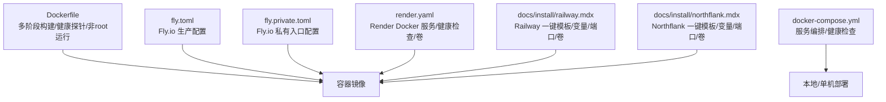
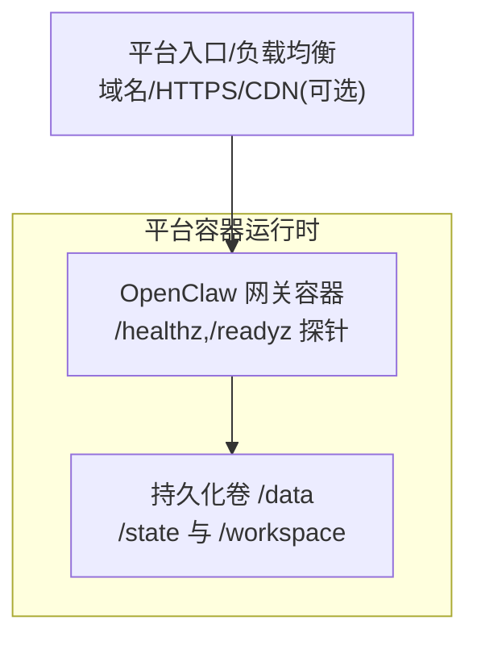
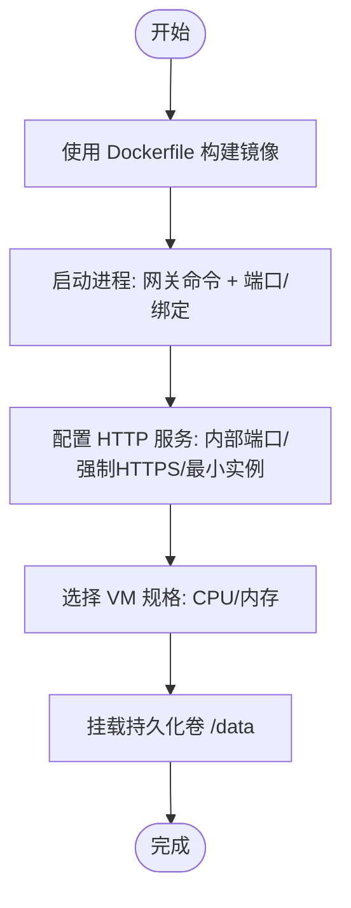
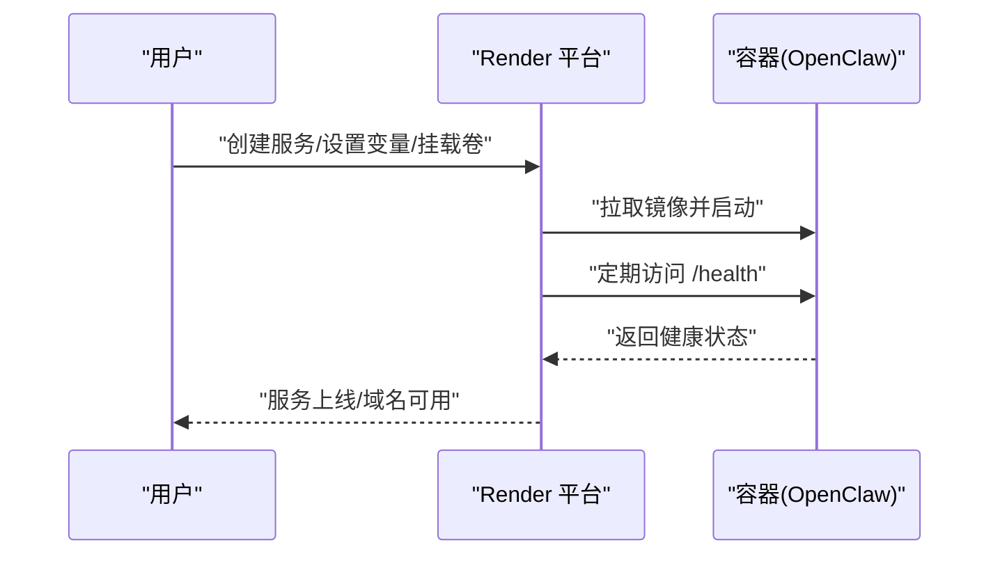
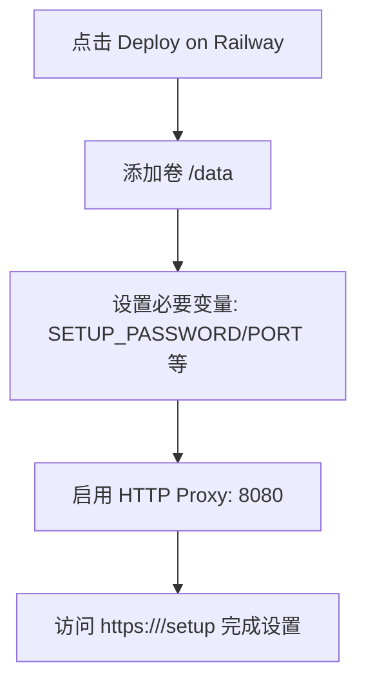
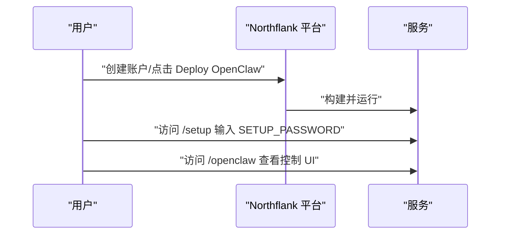
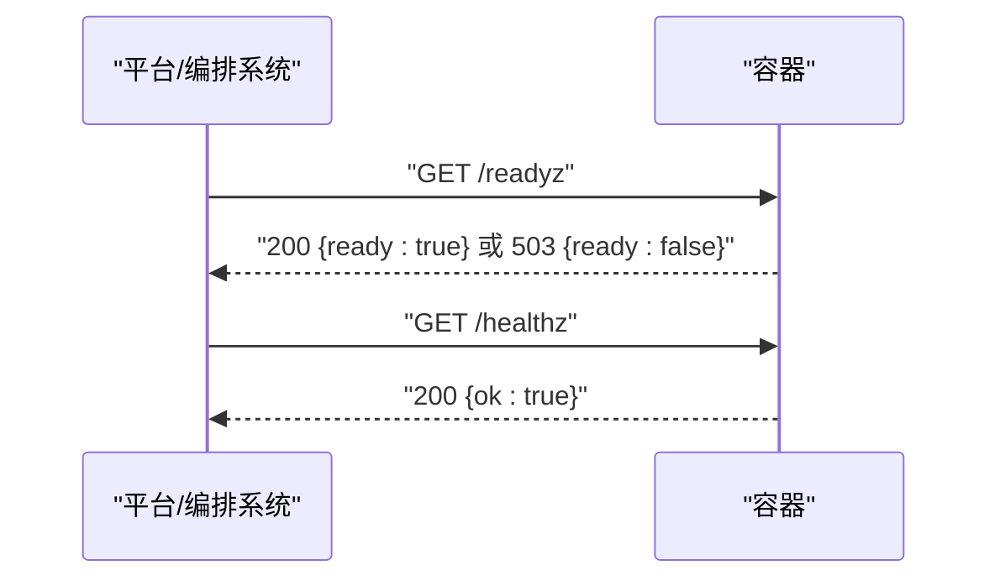
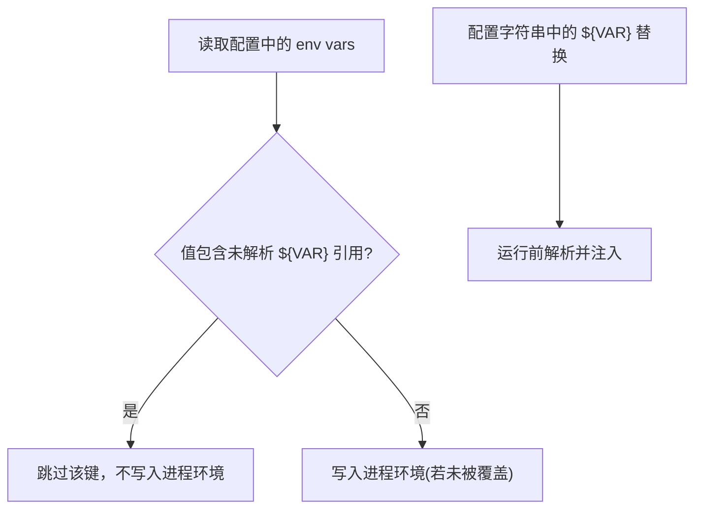
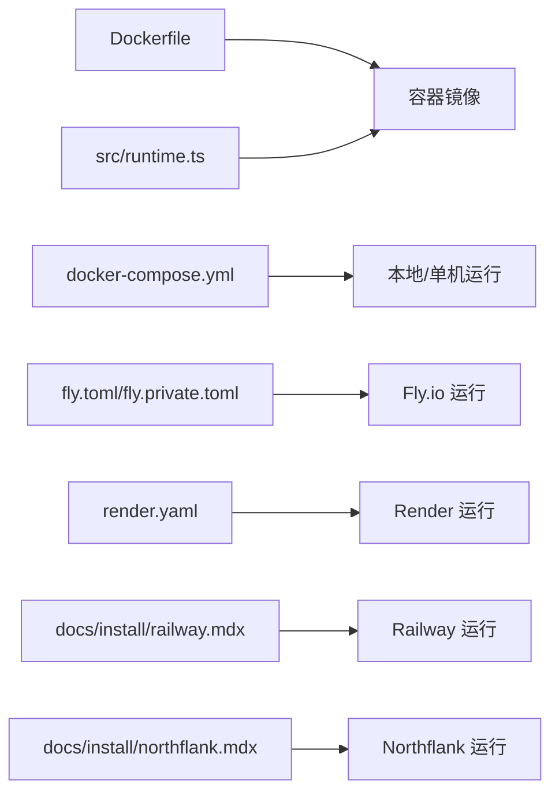

# 云平台部署

<cite>
**本文引用的文件**
- [fly.toml](file://fly.toml)
- [fly.private.toml](file://fly.private.toml)
- [render.yaml](file://render.yaml)
- [Dockerfile](file://Dockerfile)
- [docker-compose.yml](file://docker-compose.yml)
- [docs/install/railway.mdx](file://docs/install/railway.mdx)
- [docs/zh-CN/install/railway.mdx](file://docs/zh-CN/install/railway.mdx)
- [docs/install/northflank.mdx](file://docs/install/northflank.mdx)
- [docs/zh-CN/install/northflank.mdx](file://docs/zh-CN/install/northflank.mdx)
- [src/gateway/server-http.ts](file://src/gateway/server-http.ts)
- [src/gateway/server-http.probe.test.ts](file://src/gateway/server-http.probe.test.ts)
- [src/config/env-vars.ts](file://src/config/env-vars.ts)
- [src/config/env-substitution.test.ts](file://src/config/env-substitution.test.ts)
- [src/infra/openclaw-exec-env.ts](file://src/infra/openclaw-exec-env.ts)
- [src/runtime.ts](file://src/runtime.ts)
</cite>

## 目录

1. [简介](#简介)
2. [项目结构](#项目结构)
3. [核心组件](#核心组件)
4. [架构总览](#架构总览)
5. [详细组件分析](#详细组件分析)
6. [依赖关系分析](#依赖关系分析)
7. [性能考量](#性能考量)
8. [故障排查指南](#故障排查指南)
9. [结论](#结论)
10. [附录](#附录)

## 简介

本指南面向在主流云平台上部署 OpenClaw 的工程团队与运维人员，覆盖 Fly.io、Render、Railway、Northflank 等平台的部署配置要点，包括环境变量、持久化存储、健康探针、域名与入口配置等。同时给出云原生最佳实践（自动扩缩容、蓝绿/滚动更新策略）、平台特色能力（CDN 加速、SSL 证书管理、监控告警）以及成本优化与性能调优建议。

## 项目结构

OpenClaw 提供了多平台部署所需的基础设施与配置文件：

- 容器镜像构建：Dockerfile（含多阶段构建、健康探针、非 root 用户运行）
- 本地/容器编排：docker-compose.yml（示例服务编排与健康检查）
- 平台部署配置：
  - Fly.io：fly.toml（生产）、fly.private.toml（私有入口）
  - Render：render.yaml（Docker 服务、健康检查路径、磁盘卷）
  - Railway/Northflank：官方文档（一键模板、环境变量、端口与存储）

**图表来源**

- [Dockerfile:1-231](file://Dockerfile#L1-L231)
- [docker-compose.yml:1-77](file://docker-compose.yml#L1-L77)
- [fly.toml:1-35](file://fly.toml#L1-L35)
- [fly.private.toml:1-40](file://fly.private.toml#L1-L40)
- [render.yaml:1-22](file://render.yaml#L1-L22)
- [docs/install/railway.mdx:1-100](file://docs/install/railway.mdx#L1-L100)
- [docs/install/northflank.mdx:1-54](file://docs/install/northflank.mdx#L1-L54)

**章节来源**

- [Dockerfile:1-231](file://Dockerfile#L1-L231)
- [docker-compose.yml:1-77](file://docker-compose.yml#L1-L77)
- [fly.toml:1-35](file://fly.toml#L1-L35)
- [fly.private.toml:1-40](file://fly.private.toml#L1-L40)
- [render.yaml:1-22](file://render.yaml#L1-L22)
- [docs/install/railway.mdx:1-100](file://docs/install/railway.mdx#L1-L100)
- [docs/install/northflank.mdx:1-54](file://docs/install/northflank.mdx#L1-L54)

## 核心组件

- 容器镜像与健康探针
  - Dockerfile 定义了内置健康检查端点（/healthz、/readyz），用于容器编排平台的存活与就绪探测。
  - 建议在各平台的健康检查路径中使用这些端点以确保自动扩缩容与滚动更新的稳定性。
- 平台配置文件
  - Fly.io：fly.toml/fly.private.toml 定义应用名、区域、进程命令、HTTP 服务参数、VM 规格与数据卷挂载。
  - Render：render.yaml 定义 Docker 服务类型、计划、健康检查路径、环境变量与磁盘卷。
  - Railway/Northflank：官方文档说明一键模板、端口、变量与卷挂载要求。
- 环境变量与配置注入
  - 运行时支持环境变量注入与替换，部分敏感值不应直接暴露在配置中，应通过平台密钥管理或外部配置中心注入。
- 网络与入口
  - 各平台均支持通过“公共网络/HTTP 代理”暴露服务，需与容器内监听端口保持一致。

**章节来源**

- [Dockerfile:224-230](file://Dockerfile#L224-L230)
- [fly.toml:10-35](file://fly.toml#L10-L35)
- [fly.private.toml:18-40](file://fly.private.toml#L18-L40)
- [render.yaml:1-22](file://render.yaml#L1-L22)
- [src/gateway/server-http.ts:198-236](file://src/gateway/server-http.ts#L198-L236)
- [src/config/env-vars.ts:79-97](file://src/config/env-vars.ts#L79-L97)
- [src/config/env-substitution.test.ts:45-77](file://src/config/env-substitution.test.ts#L45-L77)

## 架构总览

下图展示了 OpenClaw 在云平台上的典型部署拓扑：容器镜像在平台提供的容器运行时中执行，通过平台的负载均衡/入口网关对外提供服务；持久化数据通过平台卷或对象存储挂载到 /data 路径，保证重启与迁移后的状态一致性。

**图表来源**

- [Dockerfile:224-230](file://Dockerfile#L224-L230)
- [render.yaml:18-22](file://render.yaml#L18-L22)
- [fly.toml:32-35](file://fly.toml#L32-L35)

## 详细组件分析

### Fly.io 部署配置

- 应用与区域
  - 应用名与主区域需按就近原则配置。
- 构建与镜像
  - 使用仓库根目录的 Dockerfile 构建。
- 环境变量
  - 生产环境、内存上限、状态目录等。
- 进程与端口
  - 进程命令包含网关启动参数（端口、绑定方式等）。
- HTTP 服务
  - 内部端口、强制 HTTPS、最小运行实例数、是否自动启停机器。
- VM 规格
  - CPU/内存规格与数据卷挂载。
- 私有入口（无公网入口）
  - 不配置 http_service，仅通过 fly proxy 或 WireGuard 访问。

**图表来源**

- [fly.toml:1-35](file://fly.toml#L1-L35)
- [fly.private.toml:1-40](file://fly.private.toml#L1-L40)

**章节来源**

- [fly.toml:1-35](file://fly.toml#L1-L35)
- [fly.private.toml:1-40](file://fly.private.toml#L1-L40)

### Render 部署配置

- 服务类型与运行时
  - Docker 类型、starter 计划。
- 健康检查
  - 健康检查路径为 /health。
- 环境变量
  - 端口、设置密码、状态目录、工作空间目录、网关令牌等。
- 磁盘卷
  - 名称、挂载路径与容量。

**图表来源**

- [render.yaml:1-22](file://render.yaml#L1-L22)

**章节来源**

- [render.yaml:1-22](file://render.yaml#L1-L22)

### Railway 部署配置

- 一键模板
  - 通过 Railway 模板快速部署。
- 公共网络
  - 启用 HTTP Proxy，端口 8080。
- 卷
  - 挂载 /data 以持久化状态与工作区。
- 环境变量
  - 至少设置 SETUP_PASSWORD；可选 OPENCLAW_STATE_DIR、OPENCLAW_WORKSPACE_DIR、OPENCLAW_GATEWAY_TOKEN。
- 设置向导
  - 通过 /setup 完成初始化配置。

**图表来源**

- [docs/install/railway.mdx:17-34](file://docs/install/railway.mdx#L17-L34)

**章节来源**

- [docs/install/railway.mdx:1-100](file://docs/install/railway.mdx#L1-L100)
- [docs/zh-CN/install/railway.mdx:1-107](file://docs/zh-CN/install/railway.mdx#L1-L107)

### Northflank 部署配置

- 一键模板
  - 通过 Northflank 模板快速部署。
- 环境变量
  - 至少设置 SETUP_PASSWORD。
- 设置向导与控制 UI
  - 通过 /setup 完成设置；控制 UI 在 /openclaw。

**图表来源**

- [docs/install/northflank.mdx:1-54](file://docs/install/northflank.mdx#L1-L54)

**章节来源**

- [docs/install/northflank.mdx:1-54](file://docs/install/northflank.mdx#L1-L54)
- [docs/zh-CN/install/northflank.mdx:1-61](file://docs/zh-CN/install/northflank.mdx#L1-L61)

### 健康检查与探针

- 容器内置探针
  - /healthz（存活）、/readyz（就绪）；/health、/ready 为别名。
- 平台健康检查
  - Render 使用 /health；Fly.io 使用内置探针；Railway/Northflank 通过平台健康检查机制对接。
- 就绪检查细节
  - 对于未认证的远程请求，就绪检查仅返回布尔状态；对于受信任来源，可返回详细信息（包含失败项与运行时长）。

**图表来源**

- [Dockerfile:224-230](file://Dockerfile#L224-L230)
- [src/gateway/server-http.ts:198-236](file://src/gateway/server-http.ts#L198-L236)
- [src/gateway/server-http.probe.test.ts:1-40](file://src/gateway/server-http.probe.test.ts#L1-L40)

**章节来源**

- [Dockerfile:224-230](file://Dockerfile#L224-L230)
- [src/gateway/server-http.ts:198-236](file://src/gateway/server-http.ts#L198-L236)
- [src/gateway/server-http.probe.test.ts:1-40](file://src/gateway/server-http.probe.test.ts#L1-L40)

### 环境变量与配置注入

- 运行时环境变量收集与应用
  - 支持从配置中收集运行时环境变量并应用到进程环境；若值包含未解析的 ${VAR} 引用，则跳过，避免污染进程环境。
- 环境变量替换
  - 支持在配置中进行变量替换（如 ${FOO}），并在运行前解析。
- 执行标记
  - 通过标记环境变量标识 CLI/执行上下文，便于日志与行为区分。

**图表来源**

- [src/config/env-vars.ts:79-97](file://src/config/env-vars.ts#L79-L97)
- [src/config/env-substitution.test.ts:45-77](file://src/config/env-substitution.test.ts#L45-L77)
- [src/infra/openclaw-exec-env.ts:1-16](file://src/infra/openclaw-exec-env.ts#L1-L16)

**章节来源**

- [src/config/env-vars.ts:79-97](file://src/config/env-vars.ts#L79-L97)
- [src/config/env-substitution.test.ts:45-77](file://src/config/env-substitution.test.ts#L45-L77)
- [src/infra/openclaw-exec-env.ts:1-16](file://src/infra/openclaw-exec-env.ts#L1-L16)

## 依赖关系分析

- 容器镜像依赖
  - Dockerfile 定义了基础镜像、多阶段构建、系统包安装、Playwright 浏览器可选安装、Docker CLI 可选安装等。
- 编排与平台配置
  - docker-compose.yml 展示了服务编排、健康检查与卷挂载；fly/render/railway/northflank 配置文件分别描述了平台侧的网络、卷与变量。
- 运行时与日志
  - runtime.ts 提供统一的日志输出与退出处理，便于在容器环境中稳定运行。

**图表来源**

- [Dockerfile:1-231](file://Dockerfile#L1-L231)
- [docker-compose.yml:1-77](file://docker-compose.yml#L1-L77)
- [fly.toml:1-35](file://fly.toml#L1-L35)
- [fly.private.toml:1-40](file://fly.private.toml#L1-L40)
- [render.yaml:1-22](file://render.yaml#L1-L22)
- [docs/install/railway.mdx:1-100](file://docs/install/railway.mdx#L1-L100)
- [docs/install/northflank.mdx:1-54](file://docs/install/northflank.mdx#L1-L54)
- [src/runtime.ts:1-54](file://src/runtime.ts#L1-L54)

**章节来源**

- [Dockerfile:1-231](file://Dockerfile#L1-L231)
- [docker-compose.yml:1-77](file://docker-compose.yml#L1-L77)
- [fly.toml:1-35](file://fly.toml#L1-L35)
- [fly.private.toml:1-40](file://fly.private.toml#L1-L40)
- [render.yaml:1-22](file://render.yaml#L1-L22)
- [docs/install/railway.mdx:1-100](file://docs/install/railway.mdx#L1-L100)
- [docs/install/northflank.mdx:1-54](file://docs/install/northflank.mdx#L1-L54)
- [src/runtime.ts:1-54](file://src/runtime.ts#L1-L54)

## 性能考量

- 容器镜像与运行时
  - 使用非 root 用户运行，减少攻击面；合理设置 NODE_OPTIONS（如内存上限）以避免 OOM。
  - 可选安装 Playwright 浏览器与 Docker CLI，以减少冷启动延迟与沙箱初始化时间。
- 健康检查与探针
  - 使用 /healthz 与 /readyz 精确区分存活与就绪状态，配合平台自动扩缩容策略提升弹性。
- 网络与入口
  - 在 Render/Fly.io 等平台启用强制 HTTPS 与 CDN（如可用），降低 TLS 开销与边缘延迟。
- 存储与 I/O
  - 将状态与工作区挂载到持久化卷，避免频繁重建导致的数据丢失与重同步。

**章节来源**

- [Dockerfile:157-203](file://Dockerfile#L157-L203)
- [Dockerfile:224-230](file://Dockerfile#L224-L230)
- [render.yaml:18-22](file://render.yaml#L18-L22)
- [fly.toml:20-26](file://fly.toml#L20-L26)

## 故障排查指南

- 健康检查失败
  - 确认容器内监听端口与平台健康检查路径一致；检查 /readyz 返回内容（本地请求可查看详细信息，远程请求仅返回布尔）。
- 环境变量问题
  - 若配置中存在未解析的 ${VAR}，运行时会跳过该键；请确认变量已正确注入或在平台侧设置。
- 权限与路径
  - 确保 /data 挂载路径存在且具备读写权限；状态目录与工作区目录需与平台配置一致。
- 日志与退出
  - 使用 runtime.ts 提供的日志与退出处理，便于在容器环境中定位问题。

**章节来源**

- [src/gateway/server-http.ts:198-236](file://src/gateway/server-http.ts#L198-L236)
- [src/gateway/server-http.probe.test.ts:1-40](file://src/gateway/server-http.probe.test.ts#L1-L40)
- [src/config/env-vars.ts:79-97](file://src/config/env-vars.ts#L79-L97)
- [src/runtime.ts:1-54](file://src/runtime.ts#L1-L54)

## 结论

通过 Fly.io、Render、Railway、Northflank 等平台提供的容器化与一键模板能力，OpenClaw 可以快速、安全地完成云端部署。结合内置健康探针、持久化卷与合理的环境变量管理，可在不同平台实现稳定的线上运行。建议在生产环境中启用 HTTPS、CDN 与监控告警，并根据流量特征配置自动扩缩容与滚动更新策略，持续优化成本与性能。

## 附录

- 云原生部署最佳实践
  - 自动扩缩容：基于 CPU/内存/请求速率设置阈值；结合健康检查与就绪探针，避免扩缩容过程中的流量冲击。
  - 蓝绿/滚动更新：优先使用平台支持的滚动更新；在更新前确保 /readyz 正常，更新后验证 /healthz。
  - SSL 证书与域名：在平台侧配置自定义域名与证书；启用强制 HTTPS。
  - CDN 加速：开启边缘缓存与静态资源加速，降低源站压力。
  - 监控告警：集成平台自带监控或第三方 APM，设置健康检查失败、CPU/内存/磁盘告警。
- 成本优化建议
  - 选择合适实例规格与计费模式；在低峰期降低最小实例数。
  - 使用持久化卷避免重复初始化；清理不必要的扩展与系统包。
  - 合理设置探针频率与超时，避免过度健康检查带来的额外开销。
