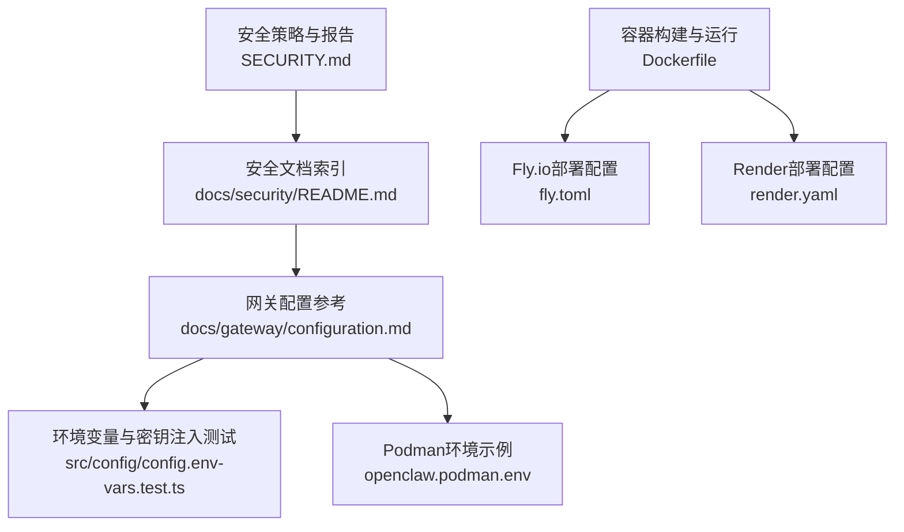
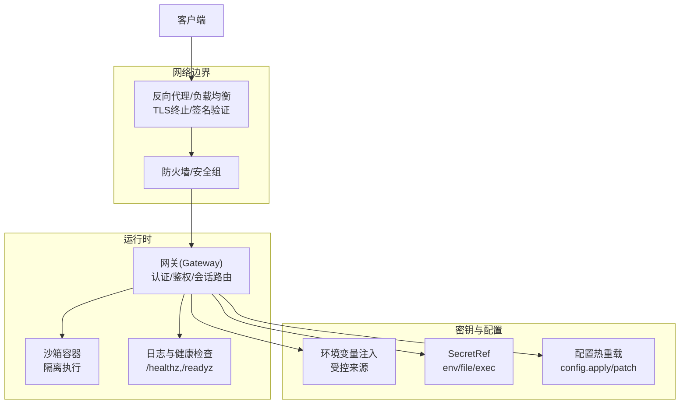
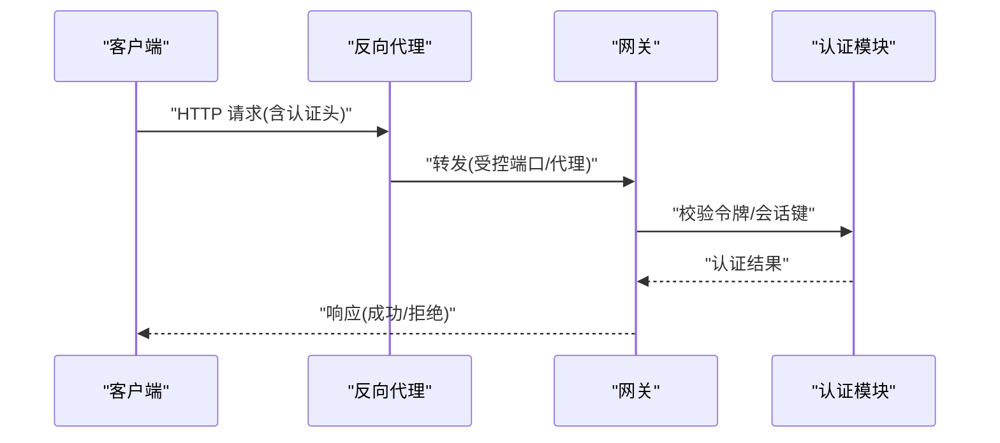
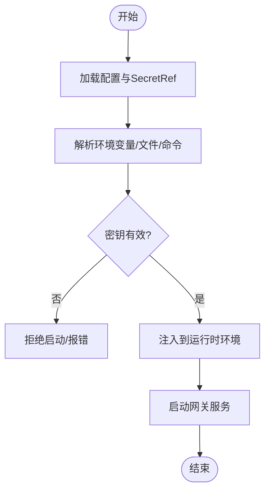
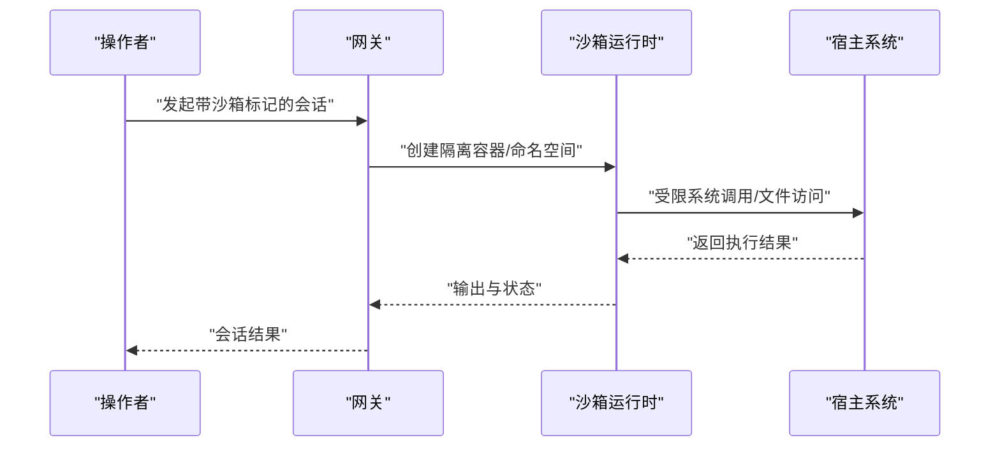
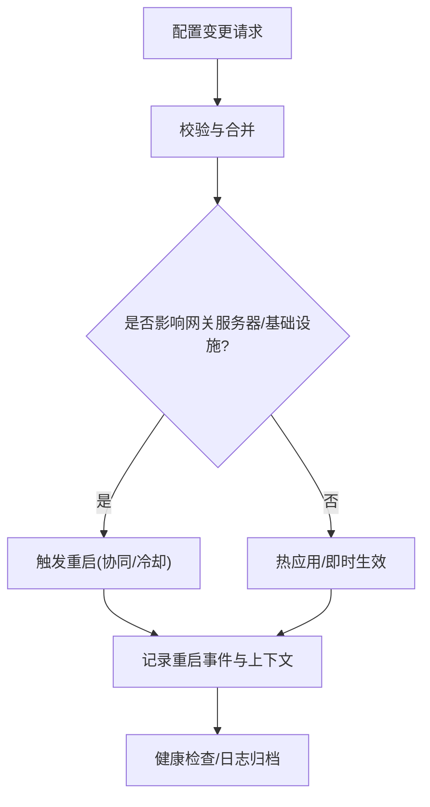
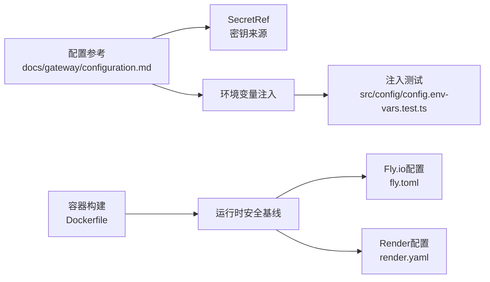

# 安全加固

<cite>
**本文引用的文件**
- [SECURITY.md](file://SECURITY.md)
- [docs/security/README.md](file://docs/security/README.md)
- [docs/gateway/configuration.md](file://docs/gateway/configuration.md)
- [src/config/config.env-vars.test.ts](file://src/config/config.env-vars.test.ts)
- [openclaw.podman.env](file://openclaw.podman.env)
- [Dockerfile](file://Dockerfile)
- [fly.toml](file://fly.toml)
- [render.yaml](file://render.yaml)
</cite>

## 目录

1. [简介](#简介)
2. [项目结构](#项目结构)
3. [核心组件](#核心组件)
4. [架构总览](#架构总览)
5. [详细组件分析](#详细组件分析)
6. [依赖关系分析](#依赖关系分析)
7. [性能考量](#性能考量)
8. [故障排查指南](#故障排查指南)
9. [结论](#结论)
10. [附录](#附录)

## 简介

本指南面向OpenClaw生产环境，提供一套系统化的安全加固方案，覆盖身份认证、授权控制与访问审计；详述API密钥管理、证书与网络安全配置；给出沙箱隔离、资源限制与入侵检测的实施方案；明确数据加密、隐私保护与合规满足路径；并提供安全扫描、漏洞评估与应急响应流程指引。内容基于仓库内现有安全策略、配置参考与容器化部署规范整理而成。

## 项目结构

OpenClaw在安全与信任方面提供了官方策略、威胁模型与部署建议，并通过配置参考文档、容器镜像与平台部署配置（Fly.io、Render）体现落地实践。下图展示与安全加固相关的关键文件与职责边界：

图表来源

- [SECURITY.md:1-288](file://SECURITY.md#L1-L288)
- [docs/security/README.md:1-18](file://docs/security/README.md#L1-L18)
- [docs/gateway/configuration.md:1-547](file://docs/gateway/configuration.md#L1-L547)
- [src/config/config.env-vars.test.ts:1-134](file://src/config/config.env-vars.test.ts#L1-L134)
- [openclaw.podman.env:1-25](file://openclaw.podman.env#L1-L25)
- [Dockerfile:1-231](file://Dockerfile#L1-L231)
- [fly.toml:1-35](file://fly.toml#L1-L35)
- [render.yaml:1-22](file://render.yaml#L1-L22)

章节来源

- [SECURITY.md:1-288](file://SECURITY.md#L1-L288)
- [docs/security/README.md:1-18](file://docs/security/README.md#L1-L18)
- [docs/gateway/configuration.md:1-547](file://docs/gateway/configuration.md#L1-L547)
- [src/config/config.env-vars.test.ts:1-134](file://src/config/config.env-vars.test.ts#L1-L134)
- [openclaw.podman.env:1-25](file://openclaw.podman.env#L1-L25)
- [Dockerfile:1-231](file://Dockerfile#L1-L231)
- [fly.toml:1-35](file://fly.toml#L1-L35)
- [render.yaml:1-22](file://render.yaml#L1-L22)

## 核心组件

- 身份认证与授权
  - 网关令牌认证：通过配置项设置共享密钥或使用受控环境变量注入，避免明文硬编码于配置中。
  - 会话路由：会话键用于路由而非多用户授权边界，需结合外部代理/防火墙实现网络级访问控制。
  - 插件信任：插件作为可信执行体，安装即等同本地主机权限，应严格限定来源与白名单。
- 访问审计
  - 配置热重载与变更追踪：通过配置RPC接口与重启协调机制，记录变更上下文与重启事件。
  - 运行时日志与健康检查：容器内置探针端点，便于编排层进行存活/就绪检查与可观测性集成。
- API密钥与证书
  - 密钥注入：支持环境变量、文件与外部命令三种SecretRef来源，优先采用受控存储或动态注入。
  - 证书与TLS：默认仅本地回环绑定，非本地暴露需配合强认证与反向代理/Tailscale等网络边界控制。
- 沙箱与资源限制
  - 沙箱模式：按会话/代理粒度启用隔离容器，结合工具策略与执行审批降低风险面。
  - 资源限制：容器层面通过只读根文件系统、能力降级与最小权限用户运行降低逃逸风险。
- 入侵检测与合规
  - 基线扫描：CI中集成detect-secrets进行机密泄露扫描，本地亦可按基线执行扫描。
  - 合规与信任模型：遵循“个人助理”单操作员信任模型，避免跨用户共享同一网关实例。

章节来源

- [docs/gateway/configuration.md:206-226](file://docs/gateway/configuration.md#L206-L226)
- [docs/gateway/configuration.md:270-301](file://docs/gateway/configuration.md#L270-L301)
- [SECURITY.md:207-245](file://SECURITY.md#L207-L245)
- [SECURITY.md:261-276](file://SECURITY.md#L261-L276)
- [SECURITY.md:277-288](file://SECURITY.md#L277-L288)

## 架构总览

下图展示生产环境中的安全边界与关键交互点，包括认证、授权、审计与隔离控制：

图表来源

- [docs/gateway/configuration.md:270-301](file://docs/gateway/configuration.md#L270-L301)
- [docs/gateway/configuration.md:389-447](file://docs/gateway/configuration.md#L389-L447)
- [Dockerfile:211-230](file://Dockerfile#L211-L230)
- [fly.toml:20-27](file://fly.toml#L20-L27)

章节来源

- [docs/gateway/configuration.md:270-301](file://docs/gateway/configuration.md#L270-L301)
- [docs/gateway/configuration.md:389-447](file://docs/gateway/configuration.md#L389-L447)
- [Dockerfile:211-230](file://Dockerfile#L211-L230)
- [fly.toml:20-27](file://fly.toml#L20-L27)

## 详细组件分析

### 组件A：身份认证与授权控制

- 网关令牌与会话键
  - 使用共享密钥进行请求认证，避免将密钥写入配置文件；推荐通过受控环境变量或SecretRef注入。
  - 会话键仅用于路由，不构成多用户授权边界；跨用户隔离需通过独立网关/主机/账户实现。
- 插件与扩展信任
  - 插件以进程内方式加载且具备与宿主相同的OS权限，必须严格限定来源与白名单。
- 外部代理与网络暴露
  - 默认仅本地回环绑定；如需远程访问，建议通过SSH隧道或Tailscale，同时启用强认证与防火墙控制。

图表来源

- [docs/gateway/configuration.md:270-301](file://docs/gateway/configuration.md#L270-L301)
- [SECURITY.md:227-245](file://SECURITY.md#L227-L245)

章节来源

- [docs/gateway/configuration.md:270-301](file://docs/gateway/configuration.md#L270-L301)
- [SECURITY.md:227-245](file://SECURITY.md#L227-L245)

### 组件B：API密钥管理与证书配置

- 密钥注入与替换
  - 支持从环境变量、文件与外部命令获取密钥；优先采用受控存储或动态注入，避免明文落盘。
  - 测试用例验证了危险启动环境变量被过滤、非便携键被丢弃等安全行为。
- 证书与TLS
  - 默认回环绑定，不直接暴露公网；若需公网访问，应在反向代理层完成TLS终止与签名验证。
- 平台部署密钥
  - Podman示例提供生成网关令牌的方法与可选Web提供商会话密钥占位符。

图表来源

- [src/config/config.env-vars.test.ts:46-82](file://src/config/config.env-vars.test.ts#L46-L82)
- [openclaw.podman.env:6-8](file://openclaw.podman.env#L6-L8)

章节来源

- [src/config/config.env-vars.test.ts:46-82](file://src/config/config.env-vars.test.ts#L46-L82)
- [openclaw.podman.env:6-8](file://openclaw.podman.env#L6-L8)

### 组件C：沙箱隔离与资源限制

- 沙箱模式
  - 可按会话/代理粒度启用隔离容器，结合工具策略与执行审批，降低恶意命令与文件操作风险。
- 容器安全基线
  - 镜像以非root用户运行，尽量使用只读根文件系统，必要时降级容器能力。
- 平台部署
  - Fly.io与Render均提供健康检查端点，便于编排层进行存活/就绪探测与自动恢复。

图表来源

- [docs/gateway/configuration.md:206-226](file://docs/gateway/configuration.md#L206-L226)
- [Dockerfile:211-230](file://Dockerfile#L211-L230)
- [fly.toml:20-27](file://fly.toml#L20-L27)

章节来源

- [docs/gateway/configuration.md:206-226](file://docs/gateway/configuration.md#L206-L226)
- [Dockerfile:211-230](file://Dockerfile#L211-L230)
- [fly.toml:20-27](file://fly.toml#L20-L27)

### 组件D：访问审计与合规

- 配置变更审计
  - 通过config.apply与config.patch接口进行受控变更，配合重启协调与注释记录，形成可追溯的变更轨迹。
- 运行时可观测性
  - 内置健康检查端点，便于外部监控系统采集指标与告警。
- 合规与信任模型
  - 明确“个人助理”信任模型，避免跨用户共享同一网关实例；多用户场景建议按OS用户/主机/网关分离。

图表来源

- [docs/gateway/configuration.md:389-447](file://docs/gateway/configuration.md#L389-L447)
- [Dockerfile:224-230](file://Dockerfile#L224-L230)

章节来源

- [docs/gateway/configuration.md:389-447](file://docs/gateway/configuration.md#L389-L447)
- [Dockerfile:224-230](file://Dockerfile#L224-L230)

## 依赖关系分析

- 配置与密钥注入
  - 配置参考文档定义了SecretRef与环境变量注入规则；测试用例验证了危险键过滤与非便携键丢弃。
- 容器与平台
  - Dockerfile定义了非root运行、健康检查与平台特定安装选项；Fly.io与Render配置提供健康检查路径与持久化挂载。

图表来源

- [docs/gateway/configuration.md:501-536](file://docs/gateway/configuration.md#L501-L536)
- [src/config/config.env-vars.test.ts:46-82](file://src/config/config.env-vars.test.ts#L46-L82)
- [Dockerfile:211-230](file://Dockerfile#L211-L230)
- [fly.toml:6-16](file://fly.toml#L6-L16)
- [render.yaml:6-22](file://render.yaml#L6-L22)

章节来源

- [docs/gateway/configuration.md:501-536](file://docs/gateway/configuration.md#L501-L536)
- [src/config/config.env-vars.test.ts:46-82](file://src/config/config.env-vars.test.ts#L46-L82)
- [Dockerfile:211-230](file://Dockerfile#L211-L230)
- [fly.toml:6-16](file://fly.toml#L6-L16)
- [render.yaml:6-22](file://render.yaml#L6-L22)

## 性能考量

- 沙箱开销与并发
  - 沙箱模式会引入容器启动与隔离成本，建议在高并发场景下合理设置并发上限与会话保留策略。
- 容器资源
  - 通过只读文件系统、能力降级与最小权限用户运行，减少逃逸风险的同时保持较低资源占用。
- 健康检查与弹性
  - 利用内置健康检查端点与平台自动重启能力，确保服务可用性与快速恢复。

## 故障排查指南

- 配置校验失败
  - 当配置不符合Schema时，网关拒绝启动；使用诊断命令定位问题并按提示修复。
- 密钥注入异常
  - 检查SecretRef来源与环境变量解析顺序；确认危险键未被注入，非便携键已被丢弃。
- 容器运行问题
  - 确认非root用户权限、只读根文件系统与健康检查端点可达；在平台侧查看日志与重启事件。
- 安全扫描
  - 在CI中启用detect-secrets扫描，本地按基线执行扫描并修复发现的问题。

章节来源

- [docs/gateway/configuration.md:61-73](file://docs/gateway/configuration.md#L61-L73)
- [src/config/config.env-vars.test.ts:46-82](file://src/config/config.env-vars.test.ts#L46-L82)
- [SECURITY.md:277-288](file://SECURITY.md#L277-L288)

## 结论

通过遵循OpenClaw的安全策略与配置参考，结合容器化与平台部署的最佳实践，可在生产环境中实现强认证、细粒度授权、可追溯审计与纵深防御。建议将“个人助理”信任模型作为默认边界，严格限制插件来源与密钥注入路径，启用沙箱与资源限制，并持续开展安全扫描与漏洞评估，以满足合规与风险管控目标。

## 附录

- 安全策略与威胁模型
  - 参考安全策略文档与威胁模型页面，了解报告流程、范围与信任边界。
- 配置参考与密钥管理
  - 使用配置参考文档中的SecretRef与环境变量注入功能，确保密钥安全可控。
- 容器与平台部署
  - 使用Dockerfile中的安全基线与平台配置文件中的健康检查路径，保障运行时可观测性与弹性。

章节来源

- [SECURITY.md:1-288](file://SECURITY.md#L1-L288)
- [docs/security/README.md:1-18](file://docs/security/README.md#L1-L18)
- [docs/gateway/configuration.md:501-536](file://docs/gateway/configuration.md#L501-L536)
- [Dockerfile:211-230](file://Dockerfile#L211-L230)
- [fly.toml:20-27](file://fly.toml#L20-L27)
- [render.yaml:6-22](file://render.yaml#L6-L22)
