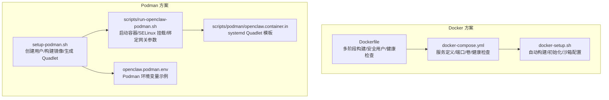
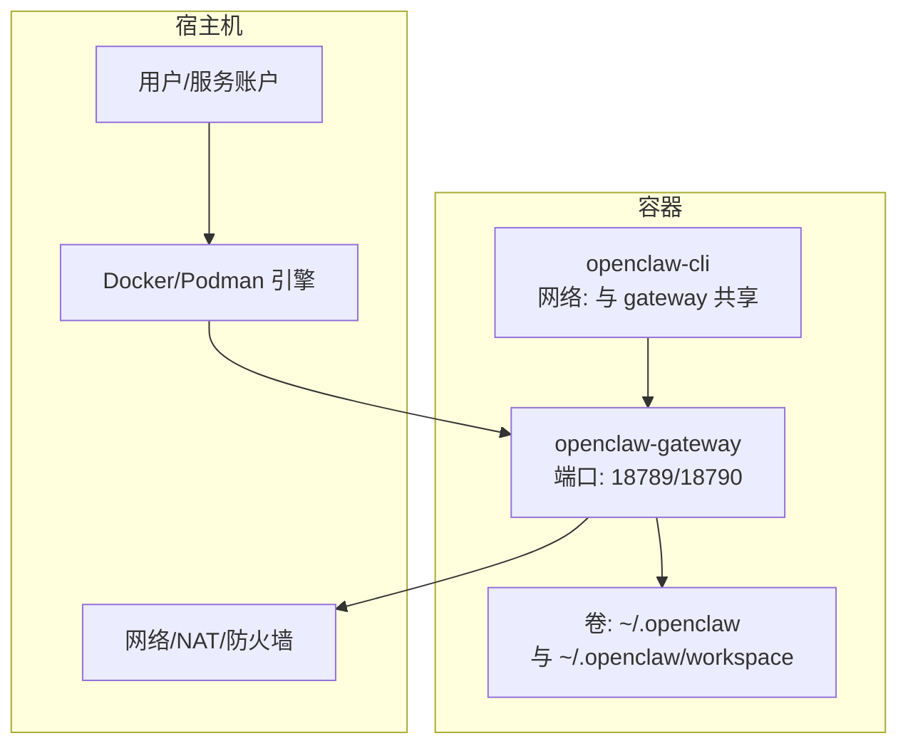
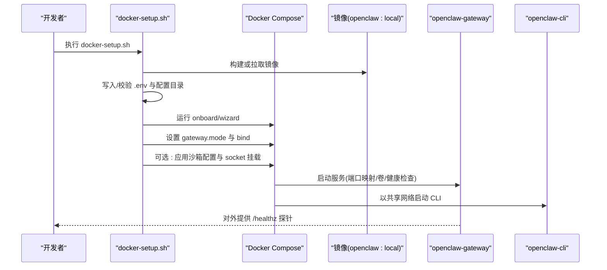
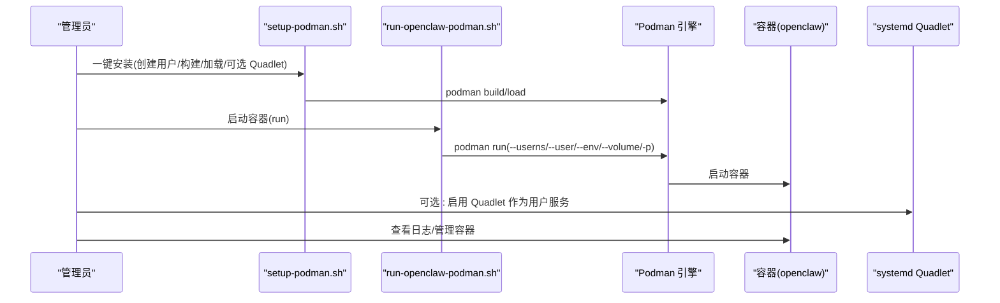
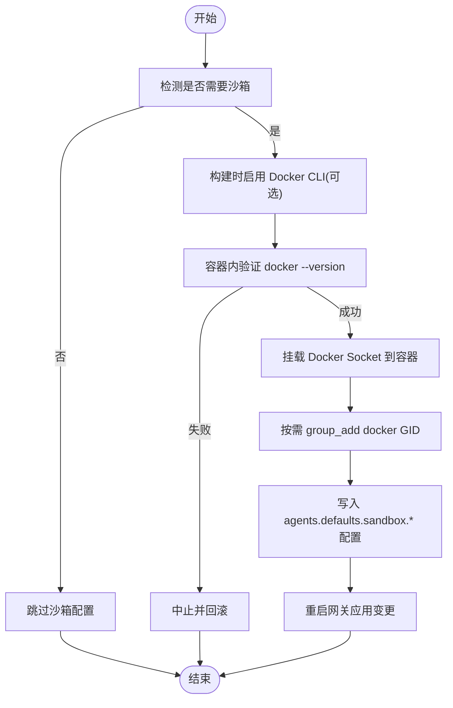
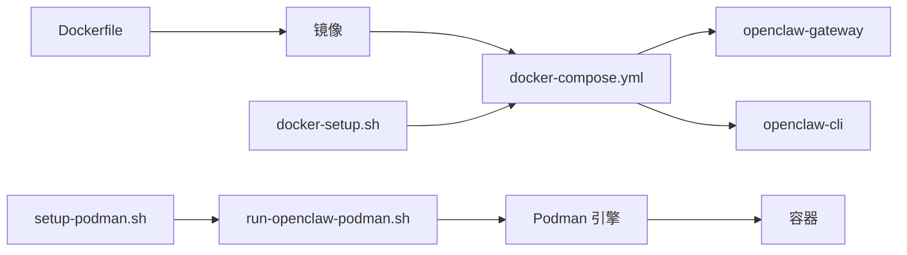

# 容器化部署

<cite>
**本文引用的文件**
- [Dockerfile](file://Dockerfile)
- [docker-compose.yml](file://docker-compose.yml)
- [docker-setup.sh](file://docker-setup.sh)
- [setup-podman.sh](file://setup-podman.sh)
- [scripts/run-openclaw-podman.sh](file://scripts/run-openclaw-podman.sh)
- [scripts/podman/openclaw.container.in](file://scripts/podman/openclaw.container.in)
- [openclaw.podman.env](file://openclaw.podman.env)
</cite>

## 目录

1. [简介](#简介)
2. [项目结构](#项目结构)
3. [核心组件](#核心组件)
4. [架构总览](#架构总览)
5. [详细组件分析](#详细组件分析)
6. [依赖关系分析](#依赖关系分析)
7. [性能与资源规划](#性能与资源规划)
8. [容器安全与合规](#容器安全与合规)
9. [监控与日志](#监控与日志)
10. [故障排除指南](#故障排除指南)
11. [结论](#结论)
12. [附录：最佳实践清单](#附录最佳实践清单)

## 简介

本指南面向在生产环境中使用容器运行时（Docker 与 Podman）部署 OpenClaw 的工程团队，覆盖镜像构建、Compose 编排、网络与卷挂载、安全加固、资源限制、健康检查、多容器协调、数据持久化、容器间通信、监控与日志、以及常见问题排查。文档严格基于仓库内现有脚本与配置文件进行分析与总结，确保可操作性与可追溯性。

## 项目结构

OpenClaw 提供了两套官方容器化方案：

- Docker：通过 Dockerfile 构建镜像，使用 docker-compose.yml 进行编排；配套 docker-setup.sh 自动完成构建、初始化、沙箱（可选）与端口映射等流程。
- Podman：通过 setup-podman.sh 一次性安装用户、构建镜像并加载到目标用户命名空间；scripts/run-openclaw-podman.sh 负责启动容器；scripts/podman/openclaw.container.in 为 systemd Quadlet 模板。

图表来源

- [Dockerfile:1-231](file://Dockerfile#L1-L231)
- [docker-compose.yml:1-77](file://docker-compose.yml#L1-L77)
- [docker-setup.sh:1-598](file://docker-setup.sh#L1-L598)
- [setup-podman.sh:1-313](file://setup-podman.sh#L1-L313)
- [scripts/run-openclaw-podman.sh:1-232](file://scripts/run-openclaw-podman.sh#L1-L232)
- [scripts/podman/openclaw.container.in:1-29](file://scripts/podman/openclaw.container.in#L1-L29)
- [openclaw.podman.env:1-25](file://openclaw.podman.env#L1-L25)

章节来源

- [Dockerfile:1-231](file://Dockerfile#L1-L231)
- [docker-compose.yml:1-77](file://docker-compose.yml#L1-L77)
- [docker-setup.sh:1-598](file://docker-setup.sh#L1-L598)
- [setup-podman.sh:1-313](file://setup-podman.sh#L1-L313)
- [scripts/run-openclaw-podman.sh:1-232](file://scripts/run-openclaw-podman.sh#L1-L232)
- [scripts/podman/openclaw.container.in:1-29](file://scripts/podman/openclaw.container.in#L1-L29)
- [openclaw.podman.env:1-25](file://openclaw.podman.env#L1-L25)

## 核心组件

- 镜像构建（Docker）
  - 多阶段构建，最终镜像仅包含运行时产物与最小系统依赖，非 root 用户执行，内置健康检查探针。
  - 支持通过构建参数注入扩展包、系统依赖、浏览器与 Docker CLI 等能力。
- Compose 编排（Docker）
  - 定义网关与 CLI 两个服务，前者暴露端口并内置健康检查；后者以“共享网络”方式复用前者网络。
  - 支持沙箱场景下的 Docker Socket 挂载与组加入。
- Podman 安装与启动
  - setup-podman.sh 创建专用用户、构建镜像并加载到该用户命名空间，支持 systemd Quadlet。
  - run-openclaw-podman.sh 负责启动容器、SELinux 绑定选项、环境注入与端口映射。
- 健康检查
  - 镜像内置对 /healthz 的健康检查；Compose 中也提供了等价的自检命令。

章节来源

- [Dockerfile:211-231](file://Dockerfile#L211-L231)
- [docker-compose.yml:23-49](file://docker-compose.yml#L23-L49)
- [docker-setup.sh:413-428](file://docker-setup.sh#L413-L428)
- [setup-podman.sh:258-277](file://setup-podman.sh#L258-L277)
- [scripts/run-openclaw-podman.sh:215-227](file://scripts/run-openclaw-podman.sh#L215-L227)

## 架构总览

下图展示了两种容器运行时的典型部署拓扑与交互关系。

图表来源

- [docker-compose.yml:1-77](file://docker-compose.yml#L1-L77)
- [scripts/run-openclaw-podman.sh:215-227](file://scripts/run-openclaw-podman.sh#L215-L227)

## 详细组件分析

### Docker 部署流水线（镜像构建 → 初始化 → 启动）

图表来源

- [docker-setup.sh:413-428](file://docker-setup.sh#L413-L428)
- [docker-setup.sh:447-477](file://docker-setup.sh#L447-L477)
- [docker-setup.sh:509-534](file://docker-setup.sh#L509-L534)
- [docker-compose.yml:23-49](file://docker-compose.yml#L23-L49)

章节来源

- [docker-setup.sh:1-598](file://docker-setup.sh#L1-L598)
- [docker-compose.yml:1-77](file://docker-compose.yml#L1-L77)

### Podman 部署流水线（用户/镜像/Quadlet → 启动 → 日志）

图表来源

- [setup-podman.sh:258-277](file://setup-podman.sh#L258-L277)
- [scripts/run-openclaw-podman.sh:215-227](file://scripts/run-openclaw-podman.sh#L215-L227)
- [scripts/podman/openclaw.container.in:1-29](file://scripts/podman/openclaw.container.in#L1-L29)

章节来源

- [setup-podman.sh:1-313](file://setup-podman.sh#L1-L313)
- [scripts/run-openclaw-podman.sh:1-232](file://scripts/run-openclaw-podman.sh#L1-L232)
- [scripts/podman/openclaw.container.in:1-29](file://scripts/podman/openclaw.container.in#L1-L29)

### 关键流程：沙箱启用与 Docker Socket 安全挂载

图表来源

- [docker-setup.sh:317-323](file://docker-setup.sh#L317-L323)
- [docker-setup.sh:497-506](file://docker-setup.sh#L497-L506)
- [docker-setup.sh:509-534](file://docker-setup.sh#L509-L534)
- [docker-setup.sh:536-574](file://docker-setup.sh#L536-L574)

章节来源

- [docker-setup.sh:317-323](file://docker-setup.sh#L317-L323)
- [docker-setup.sh:497-506](file://docker-setup.sh#L497-L506)
- [docker-setup.sh:509-534](file://docker-setup.sh#L509-L534)
- [docker-setup.sh:536-574](file://docker-setup.sh#L536-L574)

## 依赖关系分析

- Dockerfile
  - 基于固定 digest 的 node:22-bookworm 镜像，多阶段构建，最终以非 root 用户运行，内置健康检查。
  - 支持通过构建参数注入扩展、系统依赖、浏览器与 Docker CLI。
- docker-compose.yml
  - openclaw-gateway 服务：端口映射、卷挂载、健康检查、重启策略。
  - openclaw-cli 服务：与 gateway 共享网络、安全限制、TTY 与交互。
- docker-setup.sh
  - 校验与生成令牌、写入 .env、初始化配置、可选沙箱、控制 UI 允许来源、启动服务。
- Podman
  - setup-podman.sh：创建用户、构建镜像、加载到目标用户命名空间、可选 Quadlet。
  - run-openclaw-podman.sh：启动容器、SELinux 绑定选项、环境注入、端口映射。
  - openclaw.podman.env：示例环境变量模板。

图表来源

- [Dockerfile:1-231](file://Dockerfile#L1-L231)
- [docker-compose.yml:1-77](file://docker-compose.yml#L1-L77)
- [docker-setup.sh:1-598](file://docker-setup.sh#L1-L598)
- [setup-podman.sh:1-313](file://setup-podman.sh#L1-L313)
- [scripts/run-openclaw-podman.sh:1-232](file://scripts/run-openclaw-podman.sh#L1-L232)

章节来源

- [Dockerfile:1-231](file://Dockerfile#L1-L231)
- [docker-compose.yml:1-77](file://docker-compose.yml#L1-L77)
- [docker-setup.sh:1-598](file://docker-setup.sh#L1-L598)
- [setup-podman.sh:1-313](file://setup-podman.sh#L1-L313)
- [scripts/run-openclaw-podman.sh:1-232](file://scripts/run-openclaw-podman.sh#L1-L232)

## 性能与资源规划

- 镜像体积与启动时间
  - 多阶段构建与 slim 基础镜像可降低镜像体积，缩短拉取与启动时间。
  - 可选预装浏览器与 Playwright 二进制可显著减少首次启动安装耗时。
- 运行时内存
  - 构建阶段已通过环境参数限制 Node 内存上限，避免小规格主机上构建失败。
- 端口与网络
  - 默认仅监听 127.0.0.1，桥接网络映射端口后对外不可达；如需外部访问，需调整绑定与鉴权。
- 沙箱性能
  - 启用沙箱会引入额外的容器管理开销；建议在需要隔离的场景启用，并评估 CPU/IO 影响。

章节来源

- [Dockerfile:56-84](file://Dockerfile#L56-L84)
- [Dockerfile:157-171](file://Dockerfile#L157-L171)
- [Dockerfile:219-222](file://Dockerfile#L219-L222)
- [docker-compose.yml:23-25](file://docker-compose.yml#L23-L25)

## 容器安全与合规

- 非 root 运行
  - 镜像以非 root 用户运行，降低逃逸风险。
- 安全限制
  - Compose 中对 CLI 服务启用了 capabilities drop 与 no-new-privileges。
- 认证与鉴权
  - 必须设置网关令牌；默认绑定为 loopback，若改为 LAN 需要配置鉴权与允许来源。
- 沙箱安全
  - Docker Socket 挂载仅在满足前置条件后才应用，避免误暴露。
- SELinux 绑定
  - Podman 在 SELinux Enforcing/Permissive 下自动追加绑定选项，确保可读写。

章节来源

- [Dockerfile:211-214](file://Dockerfile#L211-L214)
- [docker-compose.yml:54-58](file://docker-compose.yml#L54-L58)
- [docker-setup.sh:101-123](file://docker-setup.sh#L101-L123)
- [scripts/run-openclaw-podman.sh:186-200](file://scripts/run-openclaw-podman.sh#L186-L200)

## 监控与日志

- 健康检查
  - 镜像内置 /healthz 与 /readyz 探针；Compose 中也提供等效的自检命令。
- 日志采集
  - Docker：使用 docker compose logs -f 或对接平台日志系统。
  - Podman：使用 podman logs -f 或 systemd journal。
- 建议
  - 将容器日志输出到 stdout/stderr 并由平台统一收集。
  - 结合探针与告警规则，监控 /healthz 返回状态。

章节来源

- [Dockerfile:224-229](file://Dockerfile#L224-L229)
- [docker-compose.yml:38-49](file://docker-compose.yml#L38-L49)
- [scripts/run-openclaw-podman.sh:229-231](file://scripts/run-openclaw-podman.sh#L229-L231)

## 故障排除指南

- 网络与端口
  - 若容器无法从宿主访问，确认绑定模式与端口映射；LAN 绑定需设置鉴权与允许来源。
- 权限与卷
  - 首次启动后，脚本会以 root 身份修复配置目录权限；若仍出现权限错误，请检查宿主目录属主与 SELinux 状态。
- 沙箱未生效
  - 确认镜像已启用 Docker CLI；若容器内 docker --version 失败，则沙箱不会启用。
- Podman SELinux
  - 在 SELinux Enforcing/Permissive 下，自动追加绑定选项；如仍失败，检查上下文标签与策略。
- 常用命令
  - Docker：查看日志、执行健康检查、进入 CLI 容器。
  - Podman：查看日志、启用 Quadlet 服务、按用户管理容器。

章节来源

- [docker-setup.sh:430-444](file://docker-setup.sh#L430-L444)
- [docker-setup.sh:497-506](file://docker-setup.sh#L497-L506)
- [scripts/run-openclaw-podman.sh:186-200](file://scripts/run-openclaw-podman.sh#L186-L200)
- [docker-compose.yml:59-76](file://docker-compose.yml#L59-L76)

## 结论

OpenClaw 提供了成熟且可复用的容器化方案：Docker 适合传统编排与生态集成，Podman 适合 rootless 与 systemd 场景。通过脚本化的安装与初始化流程，结合健康检查、安全限制与可选沙箱，可在生产环境中实现稳定、可观测、可审计的部署。

## 附录：最佳实践清单

- 镜像与构建
  - 使用固定 digest 的基础镜像；按需启用浏览器/Playwright 与 Docker CLI。
  - 在 CI 中缓存 pnpm/store 与 apt 缓存，提升构建效率。
- Compose 与编排
  - 明确区分配置卷与工作区卷；为 CLI 服务开启 TTY 与交互。
  - 为生产环境设置合理的重启策略与健康检查间隔。
- 安全
  - 始终使用非 root 用户运行；启用 capabilities drop 与 no-new-privileges。
  - LAN 绑定必须配合鉴权与允许来源白名单。
  - 沙箱启用前先验证容器内 Docker CLI 可用。
- 数据持久化与迁移
  - 将 ~/.openclaw 与 ~/.openclaw/workspace 设为独立卷；定期备份。
  - 迁移时保持目录权限一致，必要时使用脚本修复。
- 监控与日志
  - 将容器日志接入集中式日志系统；配置 /healthz/readyz 告警。
  - 记录容器启动参数与环境变量，便于审计与排障。
