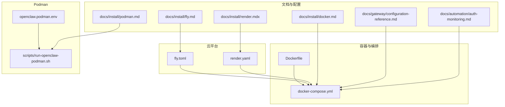
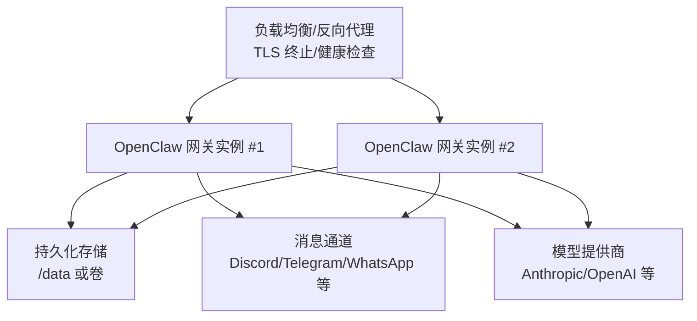
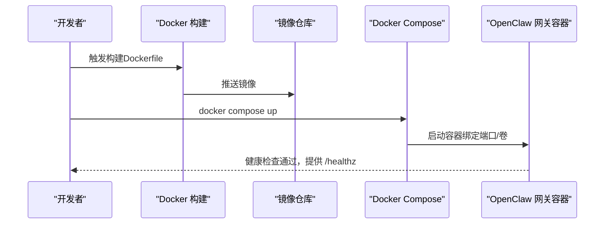
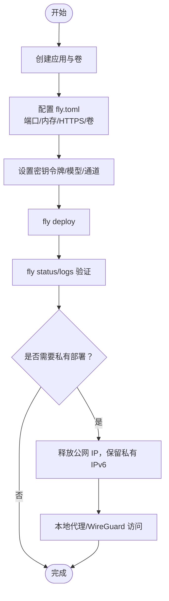
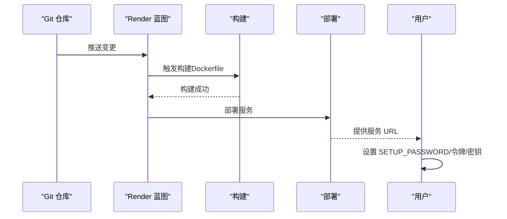
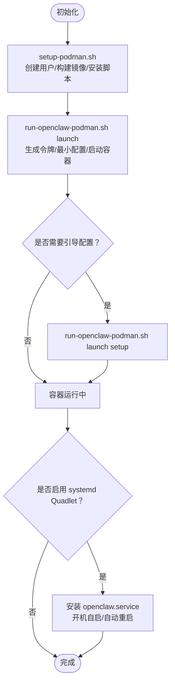
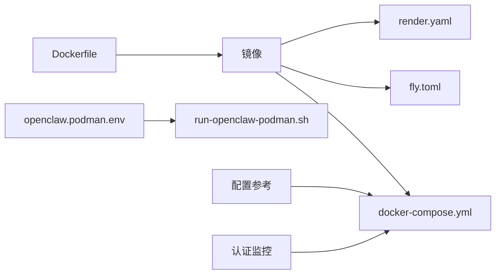

# 生产环境部署

<cite>
**本文档引用的文件**
- [Dockerfile](file://Dockerfile)
- [docker-compose.yml](file://docker-compose.yml)
- [fly.toml](file://fly.toml)
- [render.yaml](file://render.yaml)
- [openclaw.podman.env](file://openclaw.podman.env)
- [docs/install/docker.md](file://docs/install/docker.md)
- [docs/install/fly.md](file://docs/install/fly.md)
- [docs/install/render.mdx](file://docs/install/render.mdx)
- [docs/install/podman.md](file://docs/install/podman.md)
- [docs/install/hetzner.md](file://docs/install/hetzner.md)
- [docs/platforms/raspberry-pi.md](file://docs/platforms/raspberry-pi.md)
- [docs/gateway/configuration-reference.md](file://docs/gateway/configuration-reference.md)
- [docs/automation/auth-monitoring.md](file://docs/automation/auth-monitoring.md)
- [scripts/run-openclaw-podman.sh](file://scripts/run-openclaw-podman.sh)
</cite>

## 目录

1. [简介](#简介)
2. [项目结构](#项目结构)
3. [核心组件](#核心组件)
4. [架构总览](#架构总览)
5. [详细组件分析](#详细组件分析)
6. [依赖关系分析](#依赖关系分析)
7. [性能考虑](#性能考虑)
8. [故障排查指南](#故障排查指南)
9. [结论](#结论)
10. [附录](#附录)

## 简介

本指南面向在生产环境中部署 OpenClaw 的工程团队与运维人员，覆盖容器化部署（Docker、Podman）、云平台部署（Fly.io、Render）、本地服务器部署以及高可用配置。内容包括负载均衡与反向代理、SSL 证书、备份策略、监控告警、性能优化、资源限制与安全加固，并针对不同规模与需求提供可落地的实践建议。

## 项目结构

OpenClaw 提供多套官方部署入口与文档：

- 容器镜像与编排：Dockerfile、docker-compose.yml
- 云平台模板：fly.toml（Fly.io）、render.yaml（Render）
- Podman 运行脚本与环境：openclaw.podman.env、scripts/run-openclaw-podman.sh
- 部署与配置文档：docs/install/\*.md、docs/gateway/configuration-reference.md、docs/automation/auth-monitoring.md
- 本地/边缘部署参考：docs/install/hetzner.md、docs/platforms/raspberry-pi.md

图表来源

- [Dockerfile](file://Dockerfile)
- [docker-compose.yml](file://docker-compose.yml)
- [fly.toml](file://fly.toml)
- [render.yaml](file://render.yaml)
- [openclaw.podman.env](file://openclaw.podman.env)
- [scripts/run-openclaw-podman.sh](file://scripts/run-openclaw-podman.sh)
- [docs/install/docker.md](file://docs/install/docker.md)
- [docs/install/fly.md](file://docs/install/fly.md)
- [docs/install/render.mdx](file://docs/install/render.mdx)
- [docs/install/podman.md](file://docs/install/podman.md)
- [docs/gateway/configuration-reference.md](file://docs/gateway/configuration-reference.md)
- [docs/automation/auth-monitoring.md](file://docs/automation/auth-monitoring.md)

章节来源

- [Dockerfile](file://Dockerfile)
- [docker-compose.yml](file://docker-compose.yml)
- [fly.toml](file://fly.toml)
- [render.yaml](file://render.yaml)
- [openclaw.podman.env](file://openclaw.podman.env)
- [scripts/run-openclaw-podman.sh](file://scripts/run-openclaw-podman.sh)
- [docs/install/docker.md](file://docs/install/docker.md)
- [docs/install/fly.md](file://docs/install/fly.md)
- [docs/install/render.mdx](file://docs/install/render.mdx)
- [docs/install/podman.md](file://docs/install/podman.md)
- [docs/gateway/configuration-reference.md](file://docs/gateway/configuration-reference.md)
- [docs/automation/auth-monitoring.md](file://docs/automation/auth-monitoring.md)

## 核心组件

- 容器镜像与运行时
  - Dockerfile 定义多阶段构建、非 root 用户运行、健康检查探针、可选安装浏览器与 Docker CLI 等能力。
  - docker-compose.yml 提供网关与 CLI 服务的编排、卷挂载、健康检查与重启策略。
- 云平台部署
  - fly.toml：Fly.io 平台的进程定义、端口映射、强制 HTTPS、持久化存储挂载。
  - render.yaml：Render 蓝图定义，含健康检查路径、环境变量、磁盘挂载与自动部署。
- Podman 运行
  - openclaw.podman.env：Podman 环境变量示例与端口映射。
  - scripts/run-openclaw-podman.sh：Podman 启动脚本，支持生成令牌、最小配置、用户命名空间与 SELinux 挂载选项。
- 配置与监控
  - docs/gateway/configuration-reference.md：完整配置参考，覆盖通道、模型、代理、工具策略等。
  - docs/automation/auth-monitoring.md：OAuth 凭据状态检查与自动化告警。

章节来源

- [Dockerfile](file://Dockerfile)
- [docker-compose.yml](file://docker-compose.yml)
- [fly.toml](file://fly.toml)
- [render.yaml](file://render.yaml)
- [openclaw.podman.env](file://openclaw.podman.env)
- [scripts/run-openclaw-podman.sh](file://scripts/run-openclaw-podman.sh)
- [docs/gateway/configuration-reference.md](file://docs/gateway/configuration-reference.md)
- [docs/automation/auth-monitoring.md](file://docs/automation/auth-monitoring.md)

## 架构总览

下图展示生产部署的典型拓扑：反向代理/负载均衡前置，后端为 OpenClaw 网关实例；数据通过持久化卷或云平台存储实现跨实例共享；外部服务（模型提供商、消息通道）通过网络访问；监控与告警贯穿全链路。

图表来源

- [fly.toml](file://fly.toml)
- [render.yaml](file://render.yaml)
- [docker-compose.yml](file://docker-compose.yml)

## 详细组件分析

### Docker 容器化部署

- 多阶段构建与瘦身镜像：使用 node:22-bookworm 基础镜像，按需安装系统包与浏览器，最终以非 root 用户运行，内置健康检查。
- Compose 编排：网关与 CLI 共享网络，CLI 使用只读权限与 no-new-privileges 等安全增强；卷挂载用于持久化配置与工作区。
- 可选功能：预装浏览器、Docker CLI、额外 apt 包，满足沙箱与自动化需求。

图表来源

- [Dockerfile](file://Dockerfile)
- [docker-compose.yml](file://docker-compose.yml)

章节来源

- [Dockerfile](file://Dockerfile)
- [docker-compose.yml](file://docker-compose.yml)
- [docs/install/docker.md](file://docs/install/docker.md)

### Fly.io 部署

- 进程与端口：内部端口 3000，LAN 绑定，强制 HTTPS，最小运行实例数 1。
- 持久化：通过卷挂载 /data，设置 OPENCLAW_STATE_DIR=/data。
- 环境变量：NODE_ENV、OPENCLAW_PREFER_PNPM、NODE_OPTIONS 等。
- 私有部署：可释放公网 IP，仅保留私有 IPv6，结合本地代理或 WireGuard 访问。

图表来源

- [fly.toml](file://fly.toml)
- [docs/install/fly.md](file://docs/install/fly.md)

章节来源

- [fly.toml](file://fly.toml)
- [docs/install/fly.md](file://docs/install/fly.md)

### Render 部署

- 蓝图定义：web 服务、Docker 运行时、健康检查路径 /health、环境变量（PORT、SETUP_PASSWORD、OPENCLAW_GATEWAY_TOKEN、OPENCLAW_STATE_DIR、OPENCLAW_WORKSPACE_DIR）、磁盘挂载。
- 自动化：支持自动部署、日志查看、Shell 访问、环境变量热更新。
- 扩展性：垂直扩容（计划升级）与水平扩展（标准计划及以上）。

图表来源

- [render.yaml](file://render.yaml)
- [docs/install/render.mdx](file://docs/install/render.mdx)

章节来源

- [render.yaml](file://render.yaml)
- [docs/install/render.mdx](file://docs/install/render.mdx)

### Podman 部署

- 环境变量：OPENCLAW_GATEWAY_TOKEN、端口映射、绑定模式、可选 LLM API 密钥。
- 启动脚本：自动生成令牌、最小配置、用户命名空间、SELinux 挂载选项、容器替换与日志输出。
- systemd（Quadlet）：可选作为用户服务，开机自启、自动重启、日志管理。

图表来源

- [openclaw.podman.env](file://openclaw.podman.env)
- [scripts/run-openclaw-podman.sh](file://scripts/run-openclaw-podman.sh)
- [docs/install/podman.md](file://docs/install/podman.md)

章节来源

- [openclaw.podman.env](file://openclaw.podman.env)
- [scripts/run-openclaw-podman.sh](file://scripts/run-openclaw-podman.sh)
- [docs/install/podman.md](file://docs/install/podman.md)

### 本地服务器与边缘设备部署

- Hetzner VPS：Docker Compose 部署，持久化卷，必要二进制在镜像构建期烘焙，避免运行时丢失。
- Raspberry Pi：系统服务自启动、swap 优化、USB SSD 加速、ARM 兼容性注意、Tailnet 远程访问。

章节来源

- [docs/install/hetzner.md](file://docs/install/hetzner.md)
- [docs/platforms/raspberry-pi.md](file://docs/platforms/raspberry-pi.md)

### 高可用与负载均衡

- 多实例：Fly.io 与 Render 均支持多实例运行；建议使用同一持久化卷或共享存储。
- 负载均衡：在平台外层部署 Nginx/HAProxy，开启健康检查与会话亲和（如需）。
- SSL 证书：由反向代理统一终止 TLS，或使用平台提供的 HTTPS（Fly.io 强制 HTTPS）。
- 故障转移：结合平台健康检查与重启策略，实现自动恢复。

章节来源

- [fly.toml](file://fly.toml)
- [render.yaml](file://render.yaml)
- [docker-compose.yml](file://docker-compose.yml)

### 备份策略

- 配置与工作区：通过卷或磁盘挂载持久化到 /data，定期导出配置与工作区快照。
- Render：提供导出接口，便于迁移与恢复。
- Fly.io：通过 SSH 访问控制台导出配置与数据。

章节来源

- [render.yaml](file://render.yaml)
- [docs/install/render.mdx](file://docs/install/render.mdx)
- [docs/install/fly.md](file://docs/install/fly.md)

### 监控与告警

- 健康检查：容器内置 /healthz、/readyz；平台健康检查与日志监控。
- OAuth 凭据：使用 openclaw models status --check 进行自动化检查与告警。
- 日志：平台日志面板、systemd/journald、容器日志轮转。

章节来源

- [Dockerfile](file://Dockerfile)
- [docs/automation/auth-monitoring.md](file://docs/automation/auth-monitoring.md)

## 依赖关系分析

- 镜像与编排：Dockerfile 产出镜像被 docker-compose.yml 使用；fly.toml 与 render.yaml 在各自平台上复用该镜像。
- 配置与通道：配置参考文档定义了通道、模型、代理、工具策略等键值，影响运行时行为。
- 运行时依赖：Podman 脚本依赖 openclaw.podman.env 中的环境变量与令牌。

图表来源

- [Dockerfile](file://Dockerfile)
- [docker-compose.yml](file://docker-compose.yml)
- [fly.toml](file://fly.toml)
- [render.yaml](file://render.yaml)
- [openclaw.podman.env](file://openclaw.podman.env)
- [scripts/run-openclaw-podman.sh](file://scripts/run-openclaw-podman.sh)
- [docs/gateway/configuration-reference.md](file://docs/gateway/configuration-reference.md)
- [docs/automation/auth-monitoring.md](file://docs/automation/auth-monitoring.md)

章节来源

- [Dockerfile](file://Dockerfile)
- [docker-compose.yml](file://docker-compose.yml)
- [fly.toml](file://fly.toml)
- [render.yaml](file://render.yaml)
- [openclaw.podman.env](file://openclaw.podman.env)
- [scripts/run-openclaw-podman.sh](file://scripts/run-openclaw-podman.sh)
- [docs/gateway/configuration-reference.md](file://docs/gateway/configuration-reference.md)
- [docs/automation/auth-monitoring.md](file://docs/automation/auth-monitoring.md)

## 性能考虑

- 内存与 CPU
  - Fly.io 默认 2GB 内存建议；根据并发与通道数量调整。
  - Render Starter 计划适合个人与小团队；生产建议 Standard+。
  - Raspberry Pi 与 Hetzner VPS 注意 swap 与 I/O 优化。
- 启动与冷启动
  - Render Free Tier 存在空闲休眠与冷启动延迟；建议 Starter 或更高计划。
  - Podman/本地部署可通过 systemd 与缓存优化启动时间。
- 持久化与 I/O
  - 将 /data 挂载到高性能存储（SSD），避免 SD 卡随机 I/O。
  - Docker Compose 与 Podman 建议将配置与工作区目录持久化到宿主机。
- 浏览器与沙箱
  - 预装浏览器可减少首次启动等待；注意镜像体积与安全权衡。
  - 沙箱容器使用 tmpfs，注意隔离与资源限制。

章节来源

- [docs/install/fly.md](file://docs/install/fly.md)
- [docs/install/render.mdx](file://docs/install/render.mdx)
- [docs/platforms/raspberry-pi.md](file://docs/platforms/raspberry-pi.md)
- [docs/install/hetzner.md](file://docs/install/hetzner.md)
- [Dockerfile](file://Dockerfile)

## 故障排查指南

- 健康检查失败
  - Docker：确认 /healthz 可达；检查容器日志与重启策略。
  - Fly.io：核对 internal_port 与 --port 一致；检查内存是否足够。
  - Render：确认健康检查路径 /health；检查构建与启动日志。
- 端口与绑定
  - Docker Compose 默认 LAN 绑定；若需外网访问，需设置令牌与允许非 loopback 绑定。
  - Fly.io 强制 HTTPS；Render 默认 HTTP，可配置自定义域名与 TLS。
- 权限与挂载
  - Podman：确保 SELinux 挂载选项正确；宿主目录属主匹配容器 UID/GID。
  - Docker：宿主目录属主为 uid 1000；避免权限错误导致 EACCES。
- OAuth 凭据过期
  - 使用 openclaw models status --check 获取状态码；结合自动化脚本发送告警。
- 状态未持久化
  - Fly.io：确认 OPENCLAW_STATE_DIR=/data；重新部署。
  - Render：确认磁盘挂载与计划（Free Tier 无持久盘）。

章节来源

- [Dockerfile](file://Dockerfile)
- [docker-compose.yml](file://docker-compose.yml)
- [fly.toml](file://fly.toml)
- [render.yaml](file://render.yaml)
- [openclaw.podman.env](file://openclaw.podman.env)
- [scripts/run-openclaw-podman.sh](file://scripts/run-openclaw-podman.sh)
- [docs/automation/auth-monitoring.md](file://docs/automation/auth-monitoring.md)
- [docs/install/fly.md](file://docs/install/fly.md)
- [docs/install/render.mdx](file://docs/install/render.mdx)

## 结论

OpenClaw 提供从单机到云平台的多样化部署方案。通过容器化与编排、云平台模板与蓝图、Podman 用户服务与 systemd 集成，可在不同规模与需求下实现稳定、可扩展、可监控的生产环境。建议结合负载均衡与反向代理统一处理 TLS 与健康检查，采用持久化存储与定期备份保障数据安全，并通过 OAuth 状态检查与日志监控完善运维体系。

## 附录

- 关键配置要点
  - 网关绑定：LAN 绑定需令牌；loopback 仅限容器内访问。
  - 模型与通道：通过环境变量注入密钥；在配置文件中设置通道策略与组策略。
  - 沙箱与浏览器：按需预装浏览器与 Docker CLI；注意安全与资源限制。
- 最佳实践清单
  - 使用非 root 用户运行容器
  - 开启健康检查与自动重启
  - 持久化 /data 与工作区
  - 为通道与模型提供独立密钥与最小权限
  - 使用反向代理统一 TLS 与访问控制
  - 定期导出配置与工作区，建立备份与恢复流程
