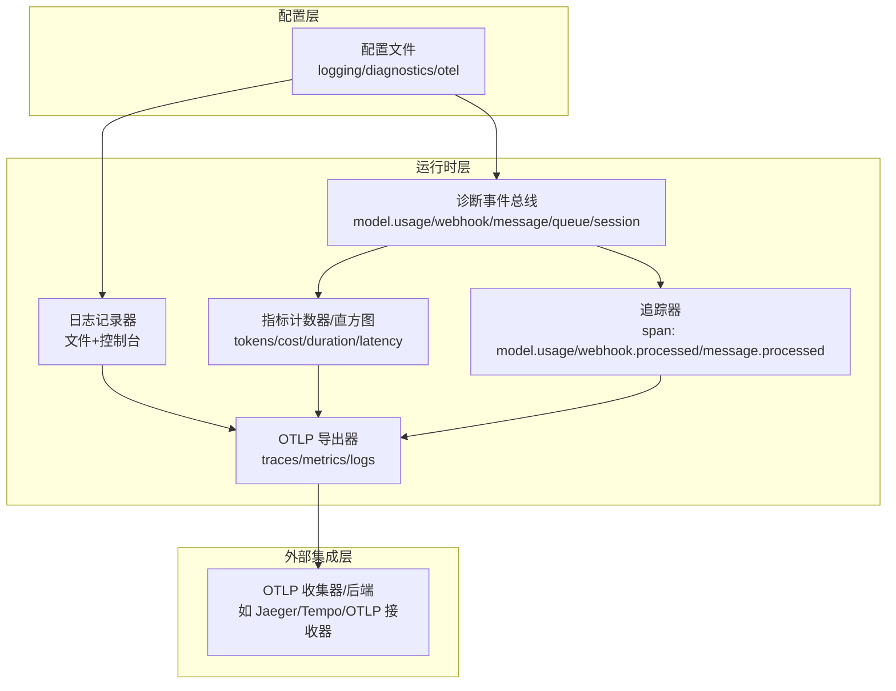
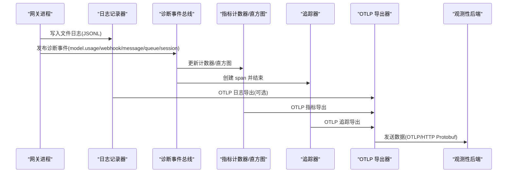
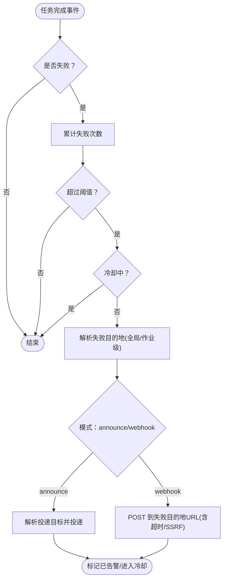
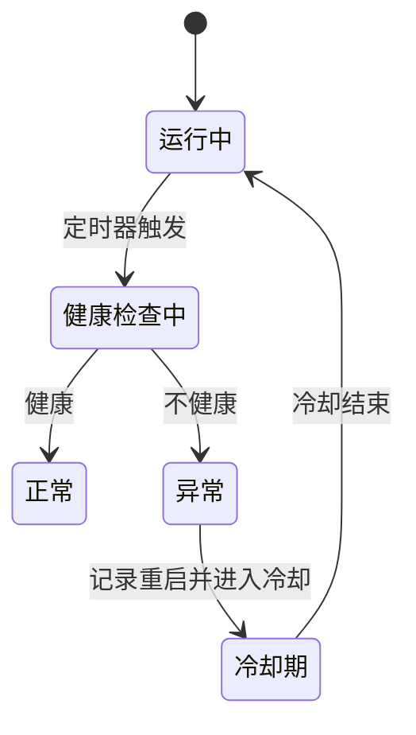
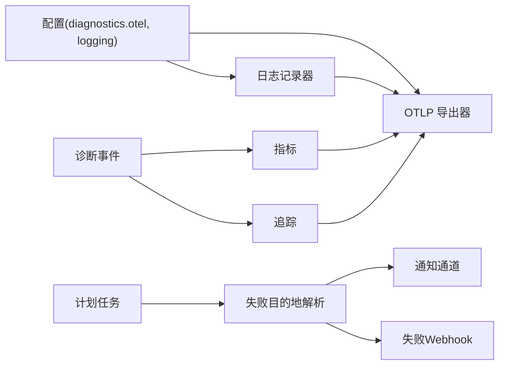

# 监控与日志

<cite>
**本文引用的文件**
- [logging.md](file://docs/logging.md)
- [schema.help.ts](file://src/config/schema.help.ts)
- [service.ts](file://extensions/diagnostics-otel/src/service.ts)
- [server-cron.ts](file://src/gateway/server-cron.ts)
- [delivery.ts](file://src/cron/delivery.ts)
- [service.failure-alert.test.ts](file://src/cron/service.failure-alert.test.ts)
- [channel-health-monitor.ts](file://src/gateway/channel-health-monitor.ts)
- [usage-aggregates.ts](file://src/shared/usage-aggregates.ts)
- [usage-render-overview.ts](file://ui/src/ui/views/usage-render-overview.ts)
- [usage-render-details.ts](file://ui/src/ui/views/usage-render-details.ts)
- [usage.ts](file://ui/src/ui/views/usage.ts)
</cite>

## 目录

1. [简介](#简介)
2. [项目结构](#项目结构)
3. [核心组件](#核心组件)
4. [架构总览](#架构总览)
5. [详细组件分析](#详细组件分析)
6. [依赖关系分析](#依赖关系分析)
7. [性能考量](#性能考量)
8. [故障排查指南](#故障排查指南)
9. [结论](#结论)
10. [附录](#附录)

## 简介

本指南面向生产环境，系统化阐述 OpenClaw 的监控与日志管理配置，覆盖以下方面：

- 系统指标监控：CPU、内存、网络、磁盘、通道健康度等
- 应用性能监控：模型调用耗时、消息处理延迟、队列深度与等待时间
- 业务指标追踪：令牌用量、成本估算、会话状态、错误峰值
- 日志采集、聚合与分析：文件日志、控制台输出、OTLP 日志导出
- 告警规则、通知渠道与故障响应：基于计划任务失败告警、通道健康重启策略
- 分布式追踪与链路监控：OpenTelemetry Traces（模型使用、Webhook、消息处理）
- 用户体验监控：会话卡顿检测、队列等待时间、运行尝试次数
- 监控仪表板、报告生成与趋势分析：按模型/提供商/渠道/工具维度的统计与可视化

## 项目结构

OpenClaw 将监控与日志能力分为三层：

- 配置层：通过配置项控制日志级别、敏感信息脱敏、诊断事件开关、OTLP 导出参数
- 运行时层：在网关进程内注入诊断事件、指标计数器、追踪器与日志导出器
- 外部集成层：将指标、追踪与日志通过 OTLP 协议发送至集中式可观测性后端

图表来源

- [service.ts:72-686](file://extensions/diagnostics-otel/src/service.ts#L72-L686)
- [logging.md:100-267](file://docs/logging.md#L100-L267)

章节来源

- [logging.md:10-114](file://docs/logging.md#L10-L114)
- [schema.help.ts:40-54](file://src/config/schema.help.ts#L40-L54)

## 核心组件

- 日志系统
  - 文件日志：JSON Lines，支持滚动与路径自定义
  - 控制台输出：TTY 友好格式，支持 pretty/compact/json 模式
  - 敏感信息脱敏：可按工具/通道场景脱敏
- 诊断与可观测性
  - 诊断事件：模型用量、Webhook 流量、消息处理、队列与会话状态
  - 指标：令牌用量、成本、运行时延、上下文大小、队列深度/等待、会话卡顿
  - 追踪：模型使用、Webhook/消息处理 span
  - 日志导出：OTLP Protobuf，支持服务名、采样率、刷新间隔、头部认证
- 计划任务与告警
  - 计划任务：周期执行、失败重试、失败目的地（通知或 Webhook）
  - 告警：连续失败阈值、冷却时间、按作业覆盖
- 通道健康监控
  - 定期检查通道运行状态，超阈值自动重启并限流重启频率
- 仪表板与报告
  - 按模型/提供商/工具/渠道/代理的用量与延迟统计
  - 时间范围筛选、累计/分转时段折线图、洞察列表

章节来源

- [logging.md:100-353](file://docs/logging.md#L100-L353)
- [service.ts:167-686](file://extensions/diagnostics-otel/src/service.ts#L167-L686)
- [delivery.ts:1-302](file://src/cron/delivery.ts#L1-L302)
- [channel-health-monitor.ts:76-200](file://src/gateway/channel-health-monitor.ts#L76-L200)
- [usage-aggregates.ts:68-109](file://src/shared/usage-aggregates.ts#L68-L109)
- [usage-render-overview.ts:530-543](file://ui/src/ui/views/usage-render-overview.ts#L530-L543)
- [usage-render-details.ts:394-429](file://ui/src/ui/views/usage-render-details.ts#L394-L429)
- [usage.ts:245-269](file://ui/src/ui/views/usage.ts#L245-L269)

## 架构总览

下图展示生产环境监控与日志的关键交互路径：

图表来源

- [service.ts:167-366](file://extensions/diagnostics-otel/src/service.ts#L167-L366)
- [logging.md:224-346](file://docs/logging.md#L224-L346)

## 详细组件分析

### 日志系统与配置

- 文件日志
  - 默认滚动路径：/tmp/openclaw/openclaw-YYYY-MM-DD.log
  - 可通过配置文件覆盖路径
  - CLI 支持实时跟踪、JSON/纯文本/无色模式
- 控制台输出
  - TTY：彩色、带时间戳、子系统前缀
  - 非 TTY：简洁文本
  - 支持 JSON 输出，便于日志处理器解析
- 日志级别与脱敏
  - file/console 级别可独立配置
  - 脱敏模式：off/tools，默认 tools；可追加正则模式
  - 环境变量 OPENCLAW_LOG_LEVEL 可临时提升级别
- 诊断事件与 OTLP 日志导出
  - 诊断事件可用于插件或自定义 sink
  - 启用 diagnostics.otel.logs 后，主日志输出通过 OTLP 导出
  - 高吞吐场景建议在收集器侧做采样/过滤

章节来源

- [logging.md:20-142](file://docs/logging.md#L20-L142)
- [logging.md:142-224](file://docs/logging.md#L142-L224)
- [logging.md:224-353](file://docs/logging.md#L224-L353)

### 诊断事件与指标

- 事件类型
  - 模型用量：tokens、cost、duration、context
  - 消息流：webhook.received/processed/error、message.queued/processed
  - 队列与会话：queue.lane.enqueue/dequeue、session.state/stuck、run.attempt、diagnostic.heartbeat
- 指标清单
  - 模型使用：openclaw.tokens、openclaw.cost.usd、openclaw.run.duration_ms、openclaw.context.tokens
  - 消息流：openclaw.webhook.received、openclaw.webhook.error、openclaw.webhook.duration_ms、openclaw.message.queued、openclaw.message.processed、openclaw.message.duration_ms
  - 队列与会话：openclaw.queue.lane.enqueue、openclaw.queue.lane.dequeue、openclaw.queue.depth、openclaw.queue.wait_ms、openclaw.session.state、openclaw.session.stuck、openclaw.session.stuck_age_ms、openclaw.run.attempt
- 追踪 span
  - openclaw.model.usage、openclaw.webhook.processed、openclaw.webhook.error、openclaw.message.processed、openclaw.session.stuck

章节来源

- [service.ts:167-686](file://extensions/diagnostics-otel/src/service.ts#L167-L686)
- [logging.md:268-326](file://docs/logging.md#L268-L326)

### OpenTelemetry 导出配置

- 协议与端点
  - 当前仅支持 OTLP/HTTP (protobuf)
  - endpoint 支持直接传入 /v1/traces、/v1/metrics 或 /v1/logs，或自动拼接
  - 支持 headers 注入（常用于租户鉴权/路由）
- 信号开关
  - traces、metrics、logs 可分别启用/禁用
  - traces 默认开启，metrics 默认开启，logs 需显式启用
- 采样与刷新
  - sampleRate：根级采样率（0–1）
  - flushIntervalMs：指标刷新间隔（最小 1000ms）
- 环境变量
  - OTEL_EXPORTER_OTLP_ENDPOINT、OTEL_SERVICE_NAME、OTEL_EXPORTER_OTLP_PROTOCOL

章节来源

- [logging.md:327-346](file://docs/logging.md#L327-L346)
- [schema.help.ts:488-506](file://src/config/schema.help.ts#L488-L506)

### 计划任务与失败告警

- 任务交付模式
  - announce：通过聊天通道投递
  - webhook：向 HTTP 端点投递
  - none：不投递
- 失败目的地策略
  - 支持全局默认与作业级覆盖
  - webhook 模式要求提供 URL
  - 若失败目的地与主投递目标相同，则忽略
- 告警规则
  - 连续失败次数达到阈值后触发
  - 支持冷却时间，避免重复告警风暴
  - 支持按作业禁用告警
  - 最佳努力（best-effort）作业不触发告警
- Webhook 投递
  - 自动添加 Content-Type 与 Bearer Token（若配置）
  - SSRF 保护与超时控制

图表来源

- [delivery.ts:129-209](file://src/cron/delivery.ts#L129-L209)
- [server-cron.ts:33-407](file://src/gateway/server-cron.ts#L33-L407)
- [service.failure-alert.test.ts:58-118](file://src/cron/service.failure-alert.test.ts#L58-L118)

章节来源

- [delivery.ts:1-302](file://src/cron/delivery.ts#L1-L302)
- [server-cron.ts:33-407](file://src/gateway/server-cron.ts#L33-L407)
- [service.failure-alert.test.ts:1-271](file://src/cron/service.failure-alert.test.ts#L1-L271)

### 通道健康监控与自动重启

- 监控策略
  - 启动宽限期、检查间隔、冷却周期
  - 每小时最大重启次数限制
- 触发条件
  - 健康检查失败且未处于冷却期
- 行为
  - 停止并重启通道实例
  - 清理重启计数并更新记录
- 适用场景
  - 通道连接异常、上游不可达、偶发性瞬断

图表来源

- [channel-health-monitor.ts:76-200](file://src/gateway/channel-health-monitor.ts#L76-L200)

章节来源

- [channel-health-monitor.ts:76-200](file://src/gateway/channel-health-monitor.ts#L76-L200)

### 仪表板与报告生成

- 统计聚合
  - 按渠道/模型/提供商/工具/代理汇总用量与成本
  - 计算平均/最小/最大/P95 延迟
  - 日粒度与按天明细
- 可视化
  - 洞察列表：Top 模型/提供商/工具/代理/渠道、峰值错误日/小时
  - 时间范围选择：累计/分转时段折线图
- 使用建议
  - 以日为单位生成成本报表
  - 以模型/渠道为维度进行成本与延迟对比
  - 结合“峰值错误”定位异常时段

章节来源

- [usage-aggregates.ts:68-109](file://src/shared/usage-aggregates.ts#L68-L109)
- [usage-render-overview.ts:530-543](file://ui/src/ui/views/usage-render-overview.ts#L530-L543)
- [usage-render-details.ts:394-429](file://ui/src/ui/views/usage-render-details.ts#L394-L429)
- [usage.ts:245-269](file://ui/src/ui/views/usage.ts#L245-L269)

## 依赖关系分析

- 配置到导出
  - diagnostics.otel.\* → OTLP 导出器
  - logging.\* → 文件/控制台日志
- 事件到指标/追踪
  - 诊断事件 → 指标计数器/直方图 → OTLP 指标
  - 诊断事件 → 追踪器 → OTLP 追踪
- 计划任务到告警
  - 任务执行结果 → 失败目的地解析 → 通知/失败 Webhook

图表来源

- [service.ts:72-686](file://extensions/diagnostics-otel/src/service.ts#L72-L686)
- [delivery.ts:129-209](file://src/cron/delivery.ts#L129-L209)
- [logging.md:224-346](file://docs/logging.md#L224-L346)

章节来源

- [service.ts:72-686](file://extensions/diagnostics-otel/src/service.ts#L72-L686)
- [delivery.ts:1-302](file://src/cron/delivery.ts#L1-L302)
- [logging.md:224-346](file://docs/logging.md#L224-L346)

## 性能考量

- 指标导出
  - 合理设置 flushIntervalMs，平衡可见性与网络开销
  - 在高吞吐场景优先在收集器侧做采样/过滤
- 追踪采样
  - sampleRate 控制根级采样，降低追踪数据体积
- 日志导出
  - OTLP 日志体积较大，建议仅在需要集中关联分析时启用 logs
  - 保持 logging.level 适中，避免冗余日志
- 通道健康监控
  - 合理设置检查间隔与冷却周期，避免频繁重启
  - 限制每小时重启次数，防止雪崩效应

## 故障排查指南

- 网关不可达
  - 先运行 openclaw doctor 检查状态
- 日志为空
  - 确认网关正在运行且写入 logging.file 指定路径
- 需要更详细日志
  - 提升 logging.level 至 debug/trace
- OTLP 导出失败
  - 检查 endpoint/headers/协议是否正确
  - 关注收集器端接收错误与拒绝原因
- 计划任务未投递
  - 确认 delivery.mode 与 delivery.to 是否有效
  - webhook 模式需提供合法 HTTP(S) URL
  - SSRF 保护可能阻止某些目标，检查日志提示
- 告警未触发
  - 检查 failureAlert 配置（阈值、冷却、作业级覆盖）
  - 最佳努力作业不会触发告警

章节来源

- [logging.md:347-353](file://docs/logging.md#L347-L353)
- [server-cron.ts:374-407](file://src/gateway/server-cron.ts#L374-L407)
- [delivery.ts:238-302](file://src/cron/delivery.ts#L238-L302)
- [service.failure-alert.test.ts:168-205](file://src/cron/service.failure-alert.test.ts#L168-L205)

## 结论

通过上述配置与实践，OpenClaw 生产环境可实现：

- 全面的日志采集与脱敏，满足合规与排障需求
- 丰富的业务指标与链路追踪，支撑成本与性能治理
- 可靠的计划任务失败告警与通道健康监控，保障稳定性
- 可扩展的仪表板与报告，辅助趋势分析与容量规划

## 附录

- 快速检查清单
  - 日志：确认 file 路径、consoleStyle、redactSensitive 设置
  - OTLP：确认 endpoint/headers/protocol、serviceName、traces/metrics/logs 开关
  - 指标：合理设置 flushIntervalMs 与 sampleRate
  - 计划任务：确认 delivery.mode/to、failureAlert 阈值与冷却
  - 通道健康：确认检查间隔、冷却周期、每小时重启上限
