# 裸机服务器部署

<cite>
**本文档引用的文件**
- [README.md](file://README.md)
- [package.json](file://package.json)
- [scripts/install.sh](file://scripts/install.sh)
- [scripts/run-node.mjs](file://scripts/run-node.mjs)
- [scripts/systemd/openclaw-auth-monitor.service](file://scripts/systemd/openclaw-auth-monitor.service)
- [scripts/systemd/openclaw-auth-monitor.timer](file://scripts/systemd/openclaw-auth-monitor.timer)
- [Dockerfile](file://Dockerfile)
- [docker-compose.yml](file://docker-compose.yml)
- [fly.toml](file://fly.toml)
- [render.yaml](file://render.yaml)
</cite>

## 目录

1. [简介](#简介)
2. [项目结构](#项目结构)
3. [核心组件](#核心组件)
4. [架构概览](#架构概览)
5. [详细组件分析](#详细组件分析)
6. [依赖分析](#依赖分析)
7. [性能考虑](#性能考虑)
8. [故障排除指南](#故障排除指南)
9. [结论](#结论)
10. [附录](#附录)

## 简介

OpenClaw是一个个人AI助手，可在您的设备上本地运行。它支持多种消息渠道（WhatsApp、Telegram、Slack、Discord、Google Chat、Signal、iMessage、BlueBubbles、IRC、Microsoft Teams、Matrix、Feishu、LINE、Mattermost、Nextcloud Talk、Nostr、Synology Chat、Tlon、Twitch、Zalo等），并能在macOS/iOS/Android平台上提供语音和视觉交互功能。

本指南专注于在物理服务器和VPS环境中部署OpenClaw，涵盖Node.js、Bun和Nix等多种运行时环境的安装配置。

## 项目结构

OpenClaw采用模块化架构，主要包含以下核心组件：

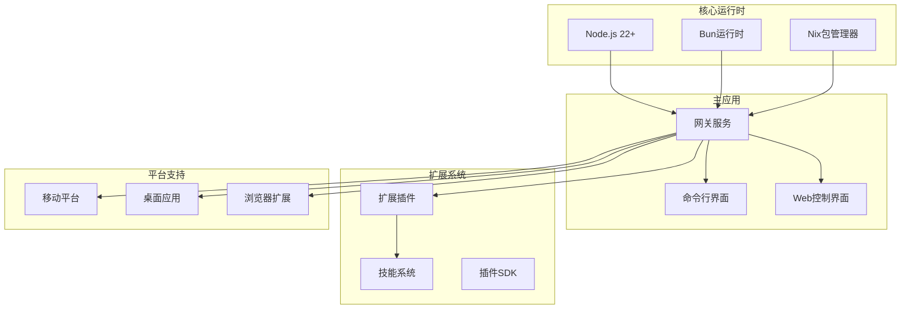

**图表来源**

- [package.json:422-424](file://package.json#L422-L424)
- [README.md:21-27](file://README.md#L21-L27)

**章节来源**

- [README.md:21-27](file://README.md#L21-L27)
- [package.json:16-34](file://package.json#L16-L34)

## 核心组件

### 系统要求

OpenClaw对运行环境有明确的要求：

- **Node.js版本**: ≥22.12.0
- **操作系统**: macOS、Linux、Windows (WSL2推荐)
- **内存**: 建议至少2GB RAM
- **存储**: 至少5GB可用空间
- **网络**: 出站互联网访问权限

### 运行时环境支持

OpenClaw支持多种运行时环境：

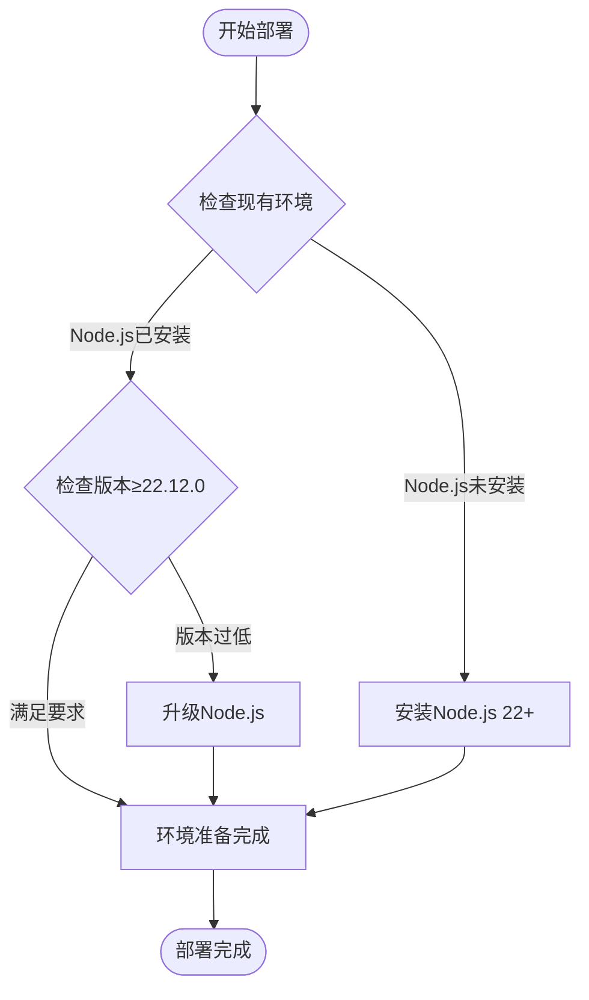

**图表来源**

- [scripts/install.sh:1286-1300](file://scripts/install.sh#L1286-L1300)
- [package.json:422-424](file://package.json#L422-L424)

**章节来源**

- [scripts/install.sh:1252-1486](file://scripts/install.sh#L1252-L1486)
- [package.json:422-424](file://package.json#L422-L424)

## 架构概览

OpenClaw采用分布式架构，核心组件通过WebSocket协议进行通信：

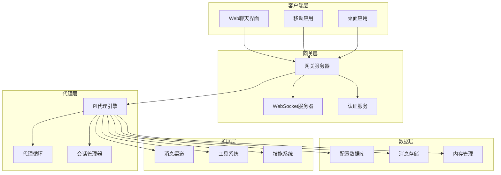

**图表来源**

- [README.md:185-202](file://README.md#L185-L202)
- [README.md:230-238](file://README.md#L230-L238)

## 详细组件分析

### 安装脚本分析

OpenClaw提供了自动化安装脚本，支持多种安装方式：

#### 自动检测和安装流程

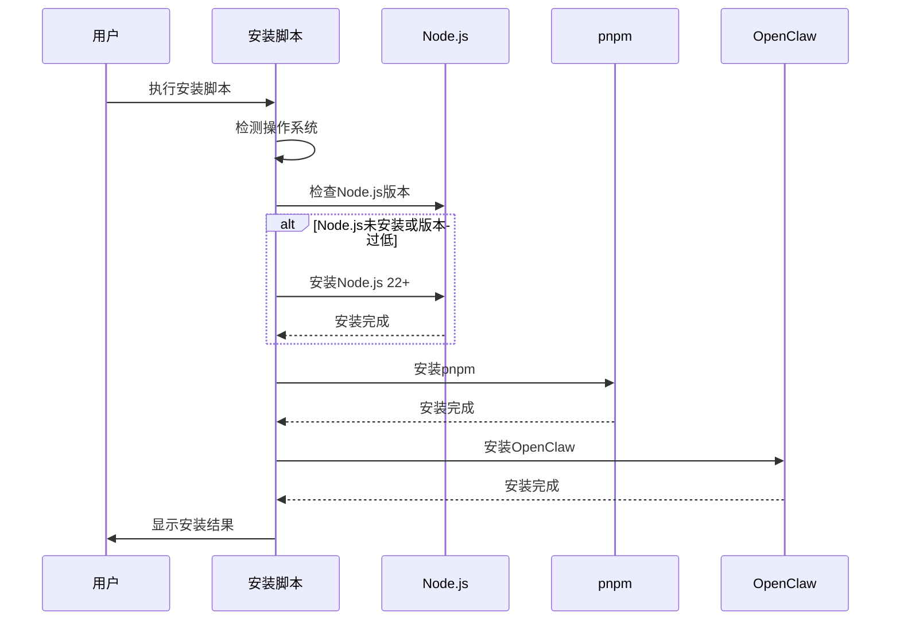

**图表来源**

- [scripts/install.sh:2201-2251](file://scripts/install.sh#L2201-L2251)
- [scripts/install.sh:1410-1486](file://scripts/install.sh#L1410-L1486)

#### 支持的安装方法

| 安装方法   | 描述                    | 适用场景                 |
| ---------- | ----------------------- | ------------------------ |
| npm安装    | 从npm注册表安装最新版本 | 快速部署，适合大多数用户 |
| git安装    | 从GitHub克隆源码构建    | 开发者，需要自定义修改   |
| Docker安装 | 使用官方容器镜像        | 生产环境，容器化部署     |

**章节来源**

- [scripts/install.sh:1001-1040](file://scripts/install.sh#L1001-L1040)
- [scripts/install.sh:1897-1945](file://scripts/install.sh#L1897-L1945)

### 网关服务配置

#### 网关启动参数

OpenClaw网关支持丰富的配置选项：

| 参数                 | 默认值   | 描述                            |
| -------------------- | -------- | ------------------------------- |
| --port               | 18789    | 网关监听端口                    |
| --bind               | loopback | 绑定地址 (loopback/lan/0.0.0.0) |
| --verbose            | false    | 启用详细日志                    |
| --allow-unconfigured | false    | 允许未配置模式                  |
| --token              | 自动生成 | 访问令牌                        |

#### 环境变量配置

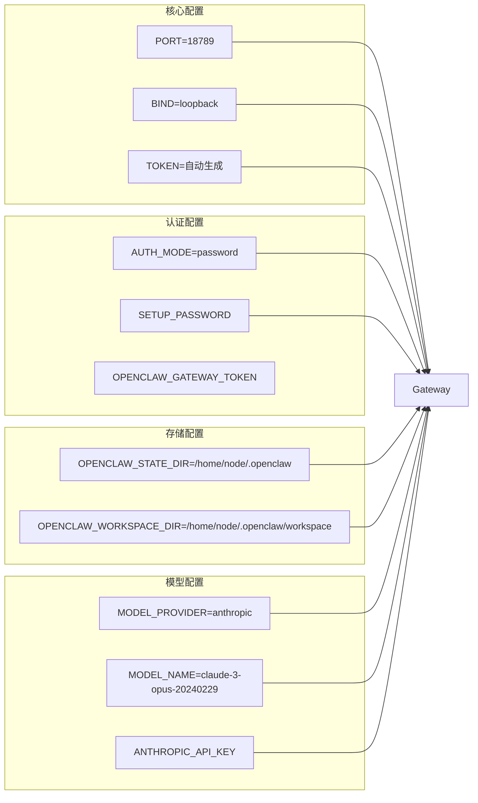

**图表来源**

- [README.md:320-330](file://README.md#L320-L330)
- [README.md:340-378](file://README.md#L340-L378)

**章节来源**

- [README.md:318-330](file://README.md#L318-L330)
- [README.md:340-378](file://README.md#L340-L378)

### 系统守护进程配置

#### systemd服务配置

OpenClaw提供了完整的systemd服务配置，用于生产环境的稳定运行：

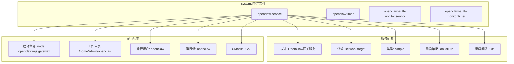

**图表来源**

- [scripts/systemd/openclaw-auth-monitor.service:1-15](file://scripts/systemd/openclaw-auth-monitor.service#L1-L15)
- [scripts/systemd/openclaw-auth-monitor.timer:1-11](file://scripts/systemd/openclaw-auth-monitor.timer#L1-L11)

**章节来源**

- [scripts/systemd/openclaw-auth-monitor.service:1-15](file://scripts/systemd/openclaw-auth-monitor.service#L1-L15)
- [scripts/systemd/openclaw-auth-monitor.timer:1-11](file://scripts/systemd/openclaw-auth-monitor.timer#L1-L11)

### 容器化部署

#### Docker配置

OpenClaw提供了完整的Docker容器化部署方案：

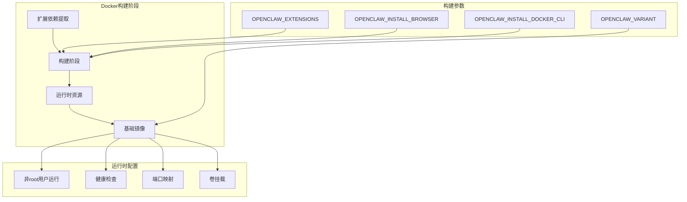

**图表来源**

- [Dockerfile:1-231](file://Dockerfile#L1-L231)
- [docker-compose.yml:1-77](file://docker-compose.yml#L1-L77)

**章节来源**

- [Dockerfile:1-231](file://Dockerfile#L1-L231)
- [docker-compose.yml:1-77](file://docker-compose.yml#L1-L77)

## 依赖分析

### 运行时依赖

OpenClaw的主要依赖包括：

```mermaid
graph TB
subgraph "核心依赖"
NodeCore[node: 22.x]
Express[express: 5.x]
WebSocket[ws: 8.x]
Hono[hono: 4.x]
end
subgraph "消息渠道"
WhatsApp[@whiskeysockets/baileys: 7.x]
Telegram[grammy: 1.x]
Discord[discord.js: 14.x]
Slack[@slack/bolt: 4.x]
end
subgraph "工具库"
Playwright[playwright-core: 1.58.x]
Sharp[sharp: 0.34.x]
LlamaCpp[node-llama-cpp: 3.16.x]
end
subgraph "开发工具"
TypeScript[typescript: 5.x]
Vitest[vitest: 4.x]
Pnpm[pnpm: 10.x]
end
NodeCore --> Express
NodeCore --> WebSocket
NodeCore --> Hono
Express --> WhatsApp
Express --> Telegram
Express --> Discord
Express --> Slack
WebSocket --> Playwright
Hono --> Sharp
Playwright --> LlamaCpp
```

**图表来源**

- [package.json:340-395](file://package.json#L340-L395)
- [package.json:396-417](file://package.json#L396-L417)

**章节来源**

- [package.json:340-395](file://package.json#L340-L395)
- [package.json:396-417](file://package.json#L396-L417)

### 环境兼容性

| 运行时  | 版本要求 | 支持状态      | 备注       |
| ------- | -------- | ------------- | ---------- |
| Node.js | ≥22.12.0 | ✅ 完全支持   | 推荐版本   |
| Bun     | 最新版本 | ✅ 部分支持   | 构建时使用 |
| Nix     | 最新版本 | ✅ 实验性支持 | 包管理器   |

**章节来源**

- [package.json:422-424](file://package.json#L422-L424)
- [scripts/install.sh:1252-1486](file://scripts/install.sh#L1252-L1486)

## 性能考虑

### 内存管理优化

OpenClaw在内存管理方面采用了多项优化策略：

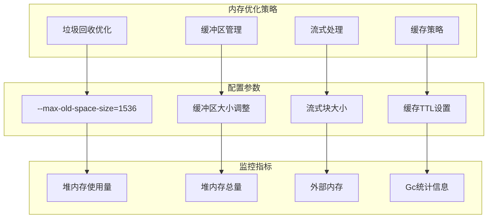

**图表来源**

- [fly.toml:15](file://fly.toml#L15)
- [Dockerfile:56-59](file://Dockerfile#L56-L59)

### CPU资源分配

针对不同部署场景的CPU资源分配建议：

| 场景       | CPU核心数 | 内存分配 | 适用平台      |
| ---------- | --------- | -------- | ------------- |
| 开发测试   | 1-2核     | 2-4GB    | VPS、云服务器 |
| 小型团队   | 2-4核     | 4-8GB    | 生产环境      |
| 中型企业   | 4-8核     | 8-16GB   | 企业级部署    |
| 大规模集群 | 8+核      | 16GB+    | 高并发场景    |

**章节来源**

- [fly.toml:28-31](file://fly.toml#L28-L31)
- [render.yaml:5-6](file://render.yaml#L5-L6)

## 故障排除指南

### 常见问题诊断

#### 端口冲突问题

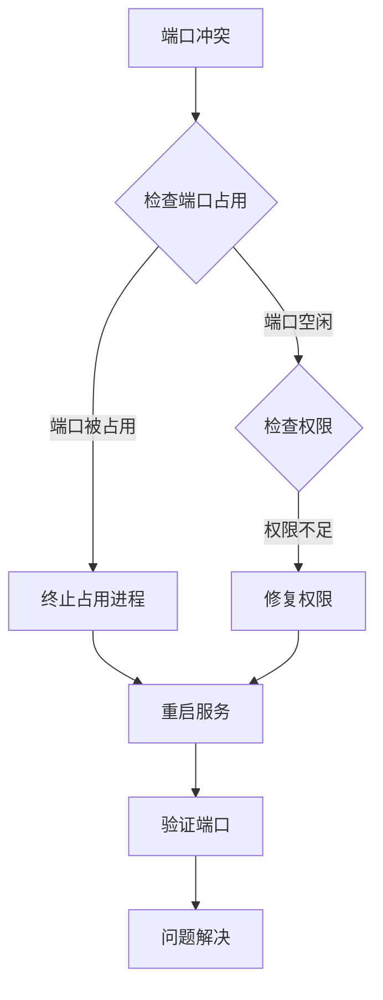

#### 依赖安装失败

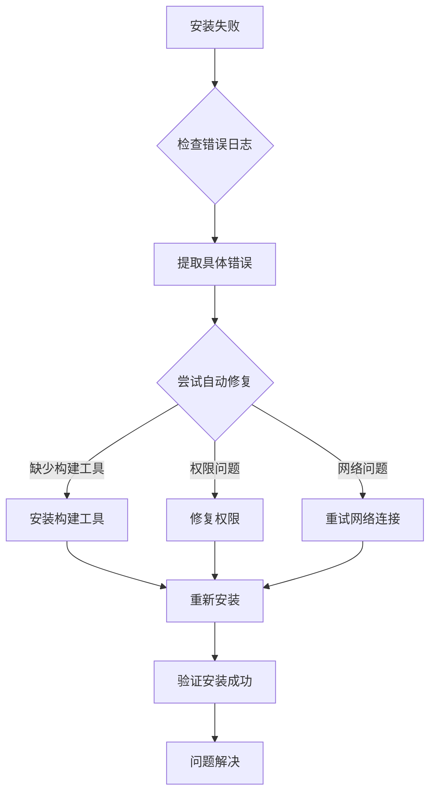

**图表来源**

- [scripts/install.sh:784-839](file://scripts/install.sh#L784-L839)
- [scripts/install.sh:656-672](file://scripts/install.sh#L656-L672)

**章节来源**

- [scripts/install.sh:784-839](file://scripts/install.sh#L784-L839)
- [scripts/install.sh:656-672](file://scripts/install.sh#L656-L672)

### 日志分析

OpenClaw提供了详细的日志记录机制：

| 日志级别 | 用途           | 输出位置        |
| -------- | -------------- | --------------- |
| 错误     | 严重错误和异常 | stderr          |
| 警告     | 可能的问题     | stdout          |
| 信息     | 一般操作信息   | stdout          |
| 调试     | 详细调试信息   | stdout (启用后) |

**章节来源**

- [scripts/run-node.mjs:172-177](file://scripts/run-node.mjs#L172-L177)

## 结论

OpenClaw提供了完整的裸机服务器部署解决方案，支持多种运行时环境和部署方式。通过合理的资源配置和优化策略，可以在各种硬件平台上获得稳定的性能表现。

关键部署要点：

1. 确保Node.js版本满足要求（≥22.12.0）
2. 选择合适的部署方式（Docker、systemd或直接安装）
3. 合理配置内存和CPU资源
4. 建立完善的监控和日志系统
5. 制定安全加固措施

## 附录

### 部署最佳实践

#### 安全配置建议


#### 性能监控指标

| 指标类型   | 监控目标 | 告警阈值 |
| ---------- | -------- | -------- |
| CPU使用率  | ≤80%     | >90%     |
| 内存使用率 | ≤85%     | >95%     |
| 磁盘空间   | ≥10%     | <5%      |
| 网络带宽   | ≤90%     | >95%     |
| 进程数量   | ≤100个   | >200个   |

#### 升级和维护

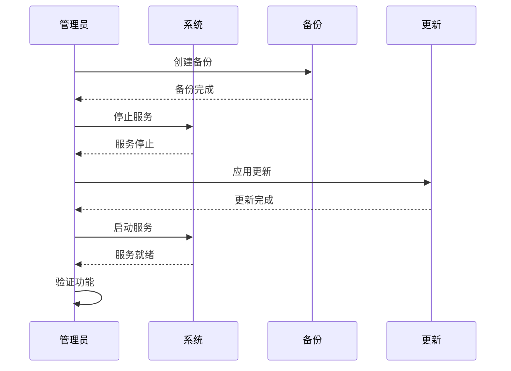

**章节来源**

- [README.md:442-449](file://README.md#L442-L449)
- [scripts/install.sh:2009-2023](file://scripts/install.sh#L2009-L2023)
